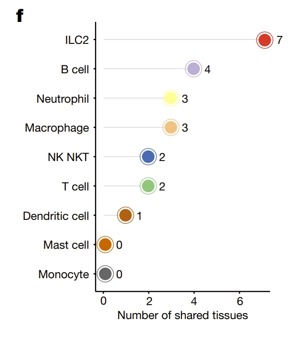
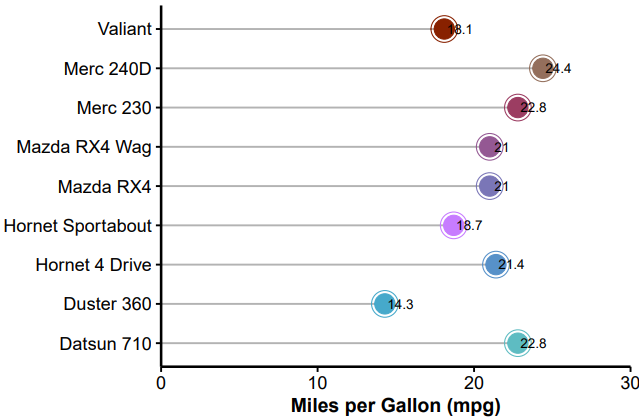
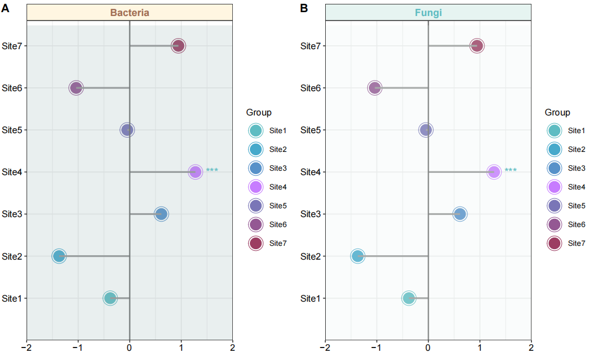
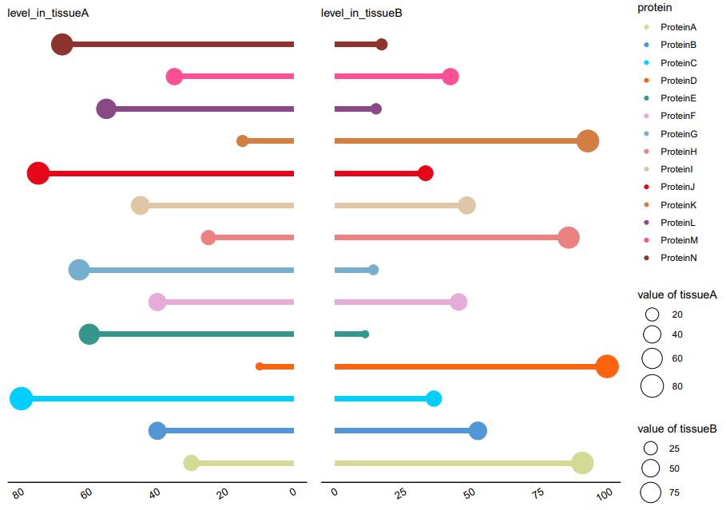
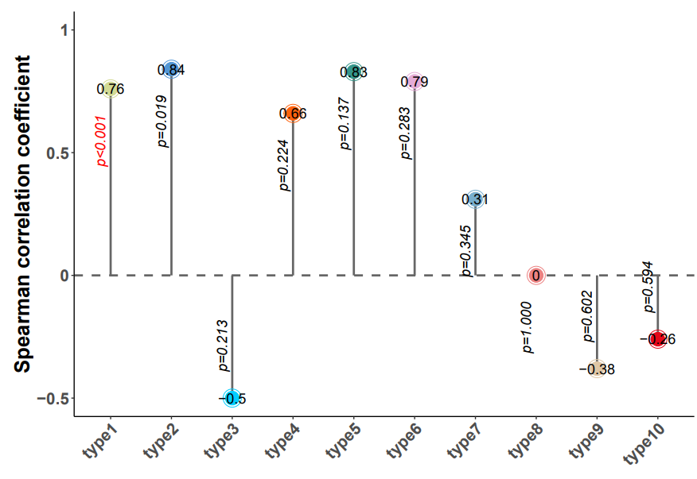
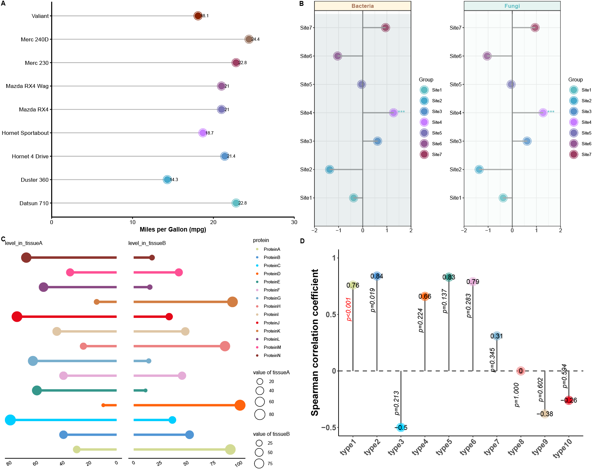

```{r setup, include=FALSE}
knitr::opts_chunk$set(
  collapse = T, echo=T, comment="#>", message=F, warning=F,
	fig.align="center", fig.width=5, fig.height=3, dpi=150)
```


The Lollipop chart scripts is referenced from MicrobiomeStatPlot [Inerst Reference below].

If you use this script, please cited 如果你使用本代码，请引用：

**Yong-Xin Liu**, Lei Chen, Tengfei Ma, Xiaofang Li, Maosheng Zheng, Xin Zhou, Liang Chen, Xubo Qian, Jiao Xi, Hongye Lu, Huiluo Cao, Xiaoya Ma, Bian Bian, Pengfan Zhang, Jiqiu Wu, Ren-You Gan, Baolei Jia, Linyang Sun, Zhicheng Ju, Yunyun Gao, **Tao Wen**, **Tong Chen**. 2023. EasyAmplicon: An easy-to-use, open-source, reproducible, and community-based pipeline for amplicon data analysis in microbiome research. **iMeta** 2(1): e83. https://doi.org/10.1002/imt2.83

The online version of this tuturial can be found in https://github.com/YongxinLiu/MicrobiomeStatPlot


**Authors**
First draft(初稿)：Defeng Bai(白德凤)；Proofreading(校对)：Ma Chuang(马闯) and Jiani Xun(荀佳妮)；Text tutorial(文字教程)：Defeng Bai(白德凤)


# Introduction简介

什么是棒棒糖图？
What is a lollipop chart?
参考：https://mp.weixin.qq.com/s/JNUmkkjFGbYyTtAxYIJOag

火柴图（棒棒糖图，Stick plot）是一种用于可视化分类变量之间的关系或比较的图表类型。它通常由一系列竖直排列的线段或棒棒糖组成，每个线段代表一个分类变量，并且线段的长度表示该分类变量的频数或比例。火柴图常用于显示多个分类变量之间的关系或比较，特别是在统计分析和数据可视化中。

A stick plot is a type of chart used to visualize the relationship or comparison between categorical variables. It usually consists of a series of vertically arranged line segments or lollipops, each of which represents a categorical variable, and the length of the line segment represents the frequency or proportion of the categorical variable. Stick plots are often used to show the relationship or comparison between multiple categorical variables, especially in statistical analysis and data visualization.


关键字：微生物组数据分析、MicrobiomeStatPlot、棒棒糖图、R语言可视化

Keywords: Microbiome analysis, MicrobiomeStatPlot, Lollipop chart , R visulization


## Lollipop chart example  棒棒图案例

参考文献：https://www.nature.com/articles/s41586-024-07291-6

中国科学院分子细胞科学卓越创新中心（分子细胞卓越中心）高栋团队联合北京大学白凡团队、分子细胞卓越中心陈洛南团队、深圳湾实验室于晨团队合作在Nature在线发表题为“Sex differences orchestrated by androgens at single-cell resolution”的研究论文。

The research paper titled "Sex differences orchestrated by androgens at single-cell resolution," jointly authored by Gao Dong's team at the CAS Center for Excellence in Molecular Cell Science, Bai Fan's team at Peking University, Chen Luonan's team at the CAS Center for Excellence in Molecular Cell Science, and Yu Chen's team at Shenzhen Bay Laboratory, was published online in Nature.




Fig. 4  Androgens modulate sex-biased immune compartments.
图 4 雄激素调节具有性别差异的免疫分区。

**结果**

Among these AASB-immune cell types, we noticed that group 2 innate lymphoid cells (ILC2s) highly expressing Gata3, Areg and Rora (Fig. 4e), which were identified in the 2010s18–23, were a negative AASB-immune cell type shared by seven tissues: the heart, lacrimal gland, liver, pancreas, salivary gland, spleen and stomach (Fig. 4f,g). 

在这些 AASB 免疫细胞类型中，我们注意到高表达 Gata3、Areg 和 Rora 的第 2组先天性淋巴细胞（ILC2s）（图 4e）于 2010 年代18-23 被发现，是心脏、泪腺、肝脏、胰腺、唾液腺、脾脏和胃这七个组织共有的 AASB 阴性免疫细胞类型（图 4f,g）。


## Packages installation软件包安装

```{r}
# 基于CRAN安装R包，检测没有则安装 Installing R packages based on CRAN and installing them if they are not detected
p_list = c("ggplot2", "reshape2", "readxl", "patchwork", "dplyr", "grid", 
           "cowplot", "gridExtra", "openxlsx")
for(p in p_list){if (!requireNamespace(p)){install.packages(p)}
    library(p, character.only = TRUE, quietly = TRUE, warn.conflicts = FALSE)}

# 加载R包 Loading R packages
suppressWarnings(suppressMessages(library(ggplot2)))
suppressWarnings(suppressMessages(library(reshape2)))
suppressWarnings(suppressMessages(library(readxl)))
suppressWarnings(suppressMessages(library(patchwork)))
suppressWarnings(suppressMessages(library(dplyr)))
suppressWarnings(suppressMessages(library(grid)))
suppressWarnings(suppressMessages(library(cowplot)))
suppressWarnings(suppressMessages(library(gridExtra)))
suppressWarnings(suppressMessages(library(openxlsx)))
```


# Lollipop chart 棒棒糖图

## Lollipop chart using R software 棒棒图R语言实战

### practice1 实战1 

参考：https://mp.weixin.qq.com/s/JNUmkkjFGbYyTtAxYIJOag

```{r Lollipop chart1, fig.show='asis', fig.width=4, fig.height=2.5}
# 加载数据 Load the data
df <- data.frame(mtcars)
df1 <- df[c(1:9), c(1, 2)]
df1 <- cbind(Names = rownames(df1), df1)
rownames(df1) <- NULL

# 颜色方案 Colour schemes
optimized_colors <- c("#5ebcc2", "#46a9cb", "#5791c9", "#C77CFF", "#7a76b7", "#945893", "#9c3d62", "#946f5c", "#882100")

# 绘制棒棒糖图形 Drawing Lollipop Graphics
p1 <- ggplot(df1, aes(x = Names, y = mpg)) +
  geom_segment(aes(x = Names, xend = Names, y = 0, yend = mpg - 0.3), color = "gray70", size = 0.6) +  
  geom_point(aes(color = Names), size = 8, shape = 1) + 
  geom_point(aes(color= Names),size=6)+
  geom_text(aes(label = round(mpg, 1), y = mpg + 0.5), hjust = 0.2, size = 3.2, color = "black") +  
  scale_color_manual(values = optimized_colors) +  
  scale_y_continuous(expand = c(0, 0), limits = c(0, 30)) +  
  coord_flip() + 
  theme_classic(base_size = 14) +  
  theme(
    axis.title.y = element_blank(),
    axis.title.x = element_text(size = 13, face = "bold"),
    axis.text.x = element_text(size = 12, color = "black"),
    axis.text.y = element_text(size = 12, color = "black"),
    axis.line = element_line(color = "black", size = 0.8),
    axis.ticks = element_line(color = "black", size = 0.6),
    panel.grid.major = element_blank(),
    panel.grid.minor = element_blank(),
    legend.position = "none"
  ) +
  labs(y = "Miles per Gallon (mpg)")  

# 保存为PDF Save as PDF
ggsave("results/Lollipop_chart1.pdf", plot = p1, width = 6, height = 4)
```





### practice2 实战2 

组间差异棒棒糖图
Lollipop chart of differences between groups

参考：https://mp.weixin.qq.com/s/p4oHLqRKyaE6dVJUAzzm8A

```{r Lollipop chart2, fig.show='asis', fig.width=4, fig.height=2.5}
# 加载数据 Load the data
df<-read.csv("data/test_otu.csv",row.names = 1)

# 构建测试数据框，构建Effect_size的数据
# Build a test data frame and build the data of Effect_size
plot_data<-df[1000:1006,c(7,7)]
plot_data<- as.data.frame(scale(plot_data))
colnames(plot_data)<-c("Effect_size","other")

# 添加group和Richness
# add group and richness
Group <- as.data.frame(c("Site1", "Site2", "Site3", "Site4", "Site5", "Site6", "Site7"))
Richness <- as.data.frame(c(rep("Bacteria", 7)))
plot_data <- cbind(plot_data, Group, Richness)
colnames(plot_data) <- c("Microbes", "Error_bar", "Group", "Richness")

# 绘图，geom_point添加散点，geom_segment添加直线，annotate('text')添加y轴
# Drawing, geom_point adds scattered points, geom_segment adds straight lines, annotate('text') adds y-axis
p2 <- ggplot(plot_data, aes(x = Group, y = Microbes, color = Group)) +
  #geom_point(size = 8, shape = 1, fill = "white") +
  geom_point(aes(color = Group), size = 8, shape = 1) + 
  geom_point(aes(color= Group),size=6)+
  geom_segment(aes(x = Group, xend = Group, y = 0, yend = Microbes), size = 1, color = "gray60") +
  scale_color_manual(values = c("#5ebcc2", "#46a9cb", "#5791c9", "#C77CFF", "#7a76b7", "#945893", "#9c3d62")) +
  scale_y_continuous(expand = c(0, 0), limits = c(-2, 2)) +
  #theme_classic() +
  theme_bw()+
  coord_flip() +
  geom_hline(aes(yintercept = 0), size = 0.7, color = "gray42") +
  annotate("rect", xmin = 0, xmax = 7.48, ymin = -2, ymax = 2, alpha = 0.2, fill = "#94b0b2") +
  facet_grid(~Richness, scales = "free", space = "free_x") +
  annotate('text', label = '***', x = 4, y = 1.60, size = 4.5, color = "#5ebcc2") +
  theme(
    strip.background = element_rect(fill = "#FFF6E1"),
    strip.text = element_text(size = 12, face = 'bold', color = "#a16e53"),
    axis.text = element_text(color = 'black', size = 11),
    axis.title = element_blank()
  )

# 添加facet(真菌)
# Add facet (fungus)
Richness <- as.data.frame(c(rep("Fungi", 7)))
plot_data <- cbind(plot_data[, 1:3], Richness)
colnames(plot_data) <- c("Microbes", "Error_bar", "Group", "Richness")
# 绘图，geom_point添加散点，geom_segment添加直线，annotate('text')添加y轴
# Drawing, geom_point adds scattered points, geom_segment adds straight lines, annotate('text') adds y-axis
p3 <- ggplot(plot_data, aes(x = Group, y = Microbes, color = Group)) +
  #geom_point(size = 4, shape = 16, fill = "white") +
  geom_point(aes(color = Group), size = 8, shape = 1) + 
  geom_point(aes(color= Group),size=6)+
  geom_segment(aes(x = Group, xend = Group, y = 0, yend = Microbes), size = 1, color = "gray60") +
  scale_color_manual(values = c("#5ebcc2", "#46a9cb", "#5791c9", "#C77CFF", "#7a76b7", "#945893", "#9c3d62")) +
  scale_y_continuous(expand = c(0, 0), limits = c(-2, 2)) +
  #theme_classic() +
  theme_bw()+
  coord_flip() +
  geom_hline(aes(yintercept = 0), size = 0.7, color = "gray42") +
  annotate("rect", xmin = 0, xmax = 7.48, ymin = -2, ymax = 2, alpha = 0.2, fill = "#e6f4f1") +
  facet_grid(~Richness, scales = "free", space = "free_x") +
  annotate('text', label = '***', x = 4, y = 1.60, size = 4.5, color = "#5ebcc2") +
  theme(
    strip.background = element_rect(fill = "#e6f4f1"),
    strip.text = element_text(size = 12, face = 'bold', color = "#5ebcc2"),
    axis.text = element_text(color = 'black', size = 11),
    axis.title = element_blank()
  )

# 拼图,或者用AI组合，可以更灵活的调整大小
# Puzzle, or use AI combination, you can adjust the size more flexibly
p4 <- cowplot::plot_grid(p2, p3 ,ncol= 2, rel_widths = c(1, 1), labels=LETTERS[1:2])
#p4

# 保存为PDF Save as pdf
ggsave("results/Lollipop_chart2.pdf", plot = p4, width = 10, height = 6)
```





### practice3 实战3 

双向棒棒糖图
Bidirectional Lollipop Chart

参考：https://mp.weixin.qq.com/s/j7HovQWMtlAV2FM2pFt6RQ

```{r Lollipop chart3, fig.show='asis', fig.width=4, fig.height=2.5}
# 读取数据
# load data
data <- read.table(file = "data/data2.txt", sep = "\t", header = TRUE, check.names = FALSE)

# 将数据转换为长格式
# Convert the data to long format
melted_data <- melt(data, id.vars = c("protein"))
melted_data$value <- as.numeric(as.character(melted_data$value))

# 提取数据中的唯一变量名
# Extract unique variable names from the data
unique_names <- unique(melted_data$protein)

# 定义更新的颜色向量
# Define the updated color vector
# colors <- c("#66CCFF", "#FF9933", "#8E44AD", "#FFD700", "#4CAF50", "#FFC107", "#C2185B",
#             "#1E90FF", "#FF6347", "#DA70D6", "#FF1493", "#00FA9A", "#FF4500", "#6A5ACD")

colors <- c("#d2da93", "#5196d5", "#00ceff", "#ff630d", "#35978b", "#e5acd7", "#77aecd",
            "#ec8181", "#dfc6a5", "#e50719", "#d27e43", "#8a4984", "#fe5094", "#8d342e")

# 创建颜色映射字典
# Create a color mapping dictionary
color_dict <- setNames(colors, unique_names)

# 左图：组织1数据的条形图，y轴反向，并在柱子顶端添加圆圈
# Left: Bar chart of Organization 1 data, with the y-axis reversed and circles added to the top of the bars
p5 <- ggplot(dplyr::filter(melted_data, variable == "level_in_tissueA"), 
             aes(x = factor(protein, levels = unique_names), y = value)) +
  geom_bar(stat = "identity", width = 0.15, aes(fill = protein), show.legend = FALSE) +  
  geom_point(aes(y = value, size = value, fill = protein, color = protein), shape = 21) +  
  scale_fill_manual(values = color_dict) + 
  scale_color_manual(values = color_dict) + 
  scale_size(range = c(3, 10)) +  
  coord_flip() +
  theme_classic()+
  theme(axis.text.x = element_text(angle = 30, hjust = 1, size = 10), 
        axis.text.y = element_blank(), 
        axis.ticks = element_blank(), 
        panel.grid = element_blank(),
        axis.line.y = element_blank(),
        axis.text = element_text(color = "black")) + 
  labs(subtitle = "level_in_tissueA", x = NULL, y = NULL, 
       size = "value of tissueA") + 
  scale_y_reverse()

# 右图：组织2数据的条形图，并在柱子顶端添加圆圈
# Right: Bar chart of Organization 2 data with circles added at the top of the bars
p6 <- ggplot(dplyr::filter(melted_data, variable == "level_in_tissueB"), 
             aes(x = factor(protein, levels = unique_names), y = value)) +
  geom_bar(stat = "identity", width = 0.15, aes(fill = protein), show.legend = FALSE) +  
  geom_point(aes(y = value, size = value, fill = protein, color = protein), shape = 21) +  
  scale_fill_manual(values = color_dict) + 
  scale_color_manual(values = color_dict) + 
  scale_size(range = c(3, 10)) +  
  coord_flip() + 
  theme_classic()+
  theme(axis.text.x = element_text(angle = 30, hjust = 1, size = 10),  
        panel.grid = element_blank(),
        axis.text.y = element_blank(),
        axis.ticks = element_blank(),
        axis.line.y = element_blank(),
        axis.text = element_text(color = "black")) +
  labs(subtitle = "level_in_tissueB", x = NULL, y = NULL, 
       size = "value of tissueB")

combined_plot <- p5 + p6 + plot_layout(guides = 'collect', widths = c(1, 1))
# 将图形保存为PDF Save as pdf
ggsave("results/Lollipop_chart3.pdf", combined_plot, width = 10, height = 7)
```




### practice4 实战4

转置棒棒糖图
Transpose the lollipop plot

参考：
https://mp.weixin.qq.com/s/d9Z2f3QEmnIfD0d7E475wQ 
Progenitor-like exhausted SPRY CD8 T cells poteniate responsiveness to neoadjuvant PD-1 blockade in esophageal squamous cellcarcinoma. https://pubmed.ncbi.nlm.nih.gov/37832554/

```{r Lollipop chart4, fig.show='asis', fig.width=4, fig.height=2.5}
# 加载数据 Load data
data <- read.xlsx("data/data.xlsx",check.names = F)
data$type <- factor(data$type, levels = data$type)

# 设置颜色 Set color
col_set =c("type1" = "#d2da93",
           "type2" = "#5196d5",
           "type3" = "#00ceff",
           "type4" = "#ff630d",
           "type5" = "#35978b",
           "type6" = "#e5acd7",
           "type7" = "#77aecd",
           "type8" = "#ec8181",
           "type9" = "#dfc6a5",
           "type10" = "#e50719")

# Plot
# 绘图
p7 <- ggplot(data,aes(x = type, y = r)) +
  geom_segment(aes(x = type, xend = type, y = 0, yend = r), 
               linetype = "solid",size = 1,color = "gray40") + 
  geom_hline(yintercept = 0,linetype = "dashed",size = 1,colour="gray40") +
  #geom_point(aes(color = type),color = col_set,size = 17) + 
  geom_point(aes(color = type), color = col_set, size = 8, shape = 1) + 
  geom_point(aes(color= type),color = col_set, size=6)+
  geom_text(aes(label = r), color = ifelse(data$r != 0.96, "black", 'red'),size = 5) +
  geom_text(aes(label = p),hjust = ifelse(data$r >= 0, 1.5, -0.5),vjust = -0.5,
            angle = 90,fontface = 'italic',color = 
              ifelse(data$p != 'p<0.001', "black", 'red'), size = 5) +
  scale_y_continuous(limits = c(-0.5, 1.0),breaks = c(-0.5, 0, 0.5, 1.0),
                     labels = c(-0.5, 0, 0.5, 1.0)) +
  labs(
    y = "Spearman correlation coefficient"
    ) +
  theme_classic() +
  theme(
    plot.title = element_text(size = 20, hjust = 0.5),
    axis.text.x = element_text(size = 16, angle = 45, hjust=1, face = 'bold'), 
    axis.text.y = element_text(size = 16, face = 'bold'),
    axis.title.x = element_blank(),
    axis.title.y = element_text(size = 20, face = 'bold'),
    plot.margin = unit(c(1, 1, 1, 1), "cm")
  )
#p7

# 将图形保存为PDF Save as pdf
ggsave("results/Lollipop_chart4.pdf", p7, width = 10, height = 7)
```




# Combo plots排版

Combo plots to published-ready figure

组合多个子图为发表格式

```{r Lollipop chart5, fig.show='asis', fig.width=8, fig.height=7.5, dpi=72}
library(cowplot)
width = 89
height = 59
p0 = plot_grid(p1, p4, combined_plot, p7, labels = c("A", "B", "C", "D"), ncol = 2)
ggsave("results/Lollipop_chart_all.pdf", p0, width = width * 5, height = height * 6, units = "mm")
```





If used this script, please cited:
使用此脚本，请引用下文：

**Yong-Xin Liu**, Lei Chen, Tengfei Ma, Xiaofang Li, Maosheng Zheng, Xin Zhou, Liang Chen, Xubo Qian, Jiao Xi, Hongye Lu, Huiluo Cao, Xiaoya Ma, Bian Bian, Pengfan Zhang, Jiqiu Wu, Ren-You Gan, Baolei Jia, Linyang Sun, Zhicheng Ju, Yunyun Gao, **Tao Wen**, **Tong Chen**. 2023. EasyAmplicon: An easy-to-use, open-source, reproducible, and community-based pipeline for amplicon data analysis in microbiome research. **iMeta** 2: e83. https://doi.org/10.1002/imt2.83

Copyright 2016-2024 Defeng Bai <baidefeng@caas.cn>, Chuang Ma <22720765@stu.ahau.edu.cn>, Jiani Xun <15231572937@163.com>, Yong-Xin Liu <liuyongxin@caas.cn>
