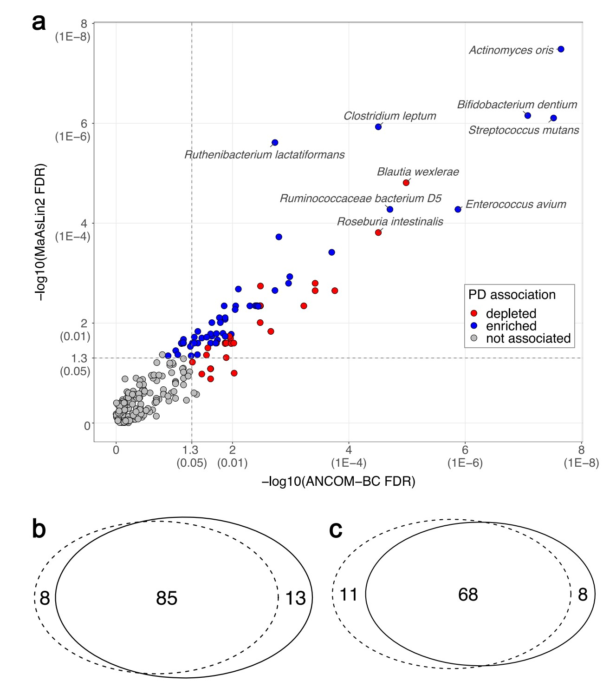

```{r setup, include=FALSE}
knitr::opts_chunk$set(
  collapse = T, echo=T, comment="#>", message=F, warning=F,
	fig.align="center", fig.width=5, fig.height=3, dpi=150)
```


The MaAsLin2 Analysis scripts is referenced from MicrobiomeStatPlot [Inerst Reference below].

If you use this script, please cited 如果你使用本代码，请引用：

**Yong-Xin Liu**, Lei Chen, Tengfei Ma, Xiaofang Li, Maosheng Zheng, Xin Zhou, Liang Chen, Xubo Qian, Jiao Xi, Hongye Lu, Huiluo Cao, Xiaoya Ma, Bian Bian, Pengfan Zhang, Jiqiu Wu, Ren-You Gan, Baolei Jia, Linyang Sun, Zhicheng Ju, Yunyun Gao, **Tao Wen**, **Tong Chen**. 2023. EasyAmplicon: An easy-to-use, open-source, reproducible, and community-based pipeline for amplicon data analysis in microbiome research. **iMeta** 2(1): e83. https://doi.org/10.1002/imt2.83

The online version of this tuturial can be found in https://github.com/YongxinLiu/MicrobiomeStatPlot


**Authors**
First draft(初稿)：Defeng Bai(白德凤)；Proofreading(校对)：Ma Chuang(马闯) and Jiani Xun(荀佳妮)；Text tutorial(文字教程)：Defeng Bai(白德凤)


# Introduction简介

考虑混杂因素的微生物差异比较
Comparison of microbial differences considering confounding factors

微生物物种相对丰度的差异常常收到个体特征的影响，比如性别、年龄、地区等等，在分析不同组之间微生物物种相对丰度差异时考虑混杂因素的影响能够更准确的得出组间具有显著差异的微生物物种或功能通路。MaAsLin2和ANCOMBC是常用的两种考虑混杂因素分析组间差异微生物物种的方法。

MaAsLin2主要是基于线性模型进行多元关联分析，用于有效确定临床数据(连续或非连续变量)和微生物组学特征(微生物丰度或者微生物基因丰度)之间的相关性；其主要过程为：
第一步：对菌群的丰度信息进行归一化处理，即每个数值是在0-1之间；
第二步：抽取一行菌群数据作为响应变量，使用Boosting算法进行提取后剩下的临床数据为自变量进行多元线性分析，统计出p值和Estimate值；
第三步：重复第二步获得更多p值，再对这些p值进行矫正，获得相应的Q值，最后基于不同的阈值，筛选出显著相关的指标。


MaAsLin2流程图


关键字：微生物组数据分析、MicrobiomeStatPlot、微生物组多变量关联与线性模型分析、R语言可视化

Keywords: Microbiome analysis, MicrobiomeStatPlot, MaAsLin2 , R visulization


## MaAsLin2分析案例
MaAsLin2 analysis example

这是Haydeh Payami团队2022年发表于Nature Communications上的一篇论文用到的MaAsLin2和ANCOM-BC分析宏基因组数据。论文题目为：Metagenomics of Parkinson’s disease implicates the gutmicrobiome inmultiple disease mechanisms. https://doi.org/10.1038/s41467-022-34667-x

This is the metagenomic data analyzed by MaAsLin2 and ANCOM-BC in a paper published by Haydeh Payami’s team in Nature Communications in 2022. The title of the paper is: Metagenomics of Parkinson’s disease implicates the gutmicrobiome inmultiple disease mechanisms. https://doi.org/10.1038/s41467-022-34667-x



Fig. 2 | PD-associated species nominated by consensus ofMaAsLin2 and ANCOM-BC. Analysis included N= 724 biologically independent samples from490 PD and 234 neurologically healthy control (NHC) subjects. a 257 species (denoted by circles in the plot) were tested in microbiome-wide association study (MWAS) with two statistical methods: MaAsLin2 and ANCOM-BC. The results are shown according to significance (−log10 of the FDR) achieved by MaAslin2 (Y-axis) vs ANCOM-BC (X-axis). Corresponding untransformed FDR values are provided in parentheses on the Xand Yaxes for easier interpretation. 84 species were nominated as PD-associated, defined by FDR <0.05 by one method and FDR≤0.1 by the other: 68 achieved FDR< 0.05by bothmethods, 10achievedANCOM-BCMaAsLin2 FDR < 0.05 byMaAsLin2 and FDR≤0.1 by ANCOM-BC, and 6 achieved FDR < 0.05 by ANCOM-BC and FDR≤0.1 by MaAsLin2. Blue: abundance is significantly elevated in PD. Red: abundance is significantly reduced in PD.Gray: not significantly associated with PD. Vertical and horizontal dashed lines denote points on Xand Yaxes that correspond to FDR=0.05. b, c Venn diagrams summarizing the overlap of species detected by MaAsLin2 (dotted circle) and ANCOM-BC (solid circle) at FDR≤0.1 (b), and at FDR <0.05 (c).

图 2 | 根据 MaAsLin2 和 ANCOM-BC 共识提名的 PD 相关物种。分析包括来自 490 名 PD 患者和 234 名神经健康对照 (NHC) 受试者的 N= 724 个生物学独立样本。在微生物组范围关联研究 (MWAS) 中，使用两种统计方法测试了 257 个物种（图中用圆圈表示）：MaAsLin2 和 ANCOM-BC。结果根据 MaAslin2（Y 轴）与 ANCOM-BC（X 轴）实现的显著性（FDR 的 -log10）显示。为了便于解释，在 X 轴和 Y 轴的括号中提供了相应的未转换 FDR 值。 84 个物种被提名为与 PD 相关，其中一种方法定义为 FDR <0.05，另一种方法定义为 FDR≤0.1：68 个物种通过两种方法实现 FDR< 0.05，10 个物种通过 MaAsLin2 实现 ANCOM-BCMaAsLin2 FDR < 0.05，通过 ANCOM-BC 实现 FDR≤0.1，6 个物种通过 ANCOM-BC 实现 FDR < 0.05，通过 MaAsLin2 实现 FDR≤0.1。蓝色：PD 中丰度显著升高。红色：PD 中丰度显著降低。灰色：与 PD 无显著关联。垂直和水平虚线表示 X 和 Yaxes 上与 FDR=0.05 相对应的点。 b、c 维恩图总结了 MaAsLin2（虚线圆）和 ANCOM-BC（实线圆）在 FDR≤0.1（b）和 FDR <0.05（c）时检测到的物种重叠情况。


**结果**

We conducted an unbiased metagenome-wide association study (MWAS) to test differential abundances of species in PD vs. NHC, using two statistical methods (MaAsLin2 and ANCOM-BC). We also conducted MWAS at genus level tobe able to interpret our results in thecontext of the existing literature. The full MWAS results are provided in Supplementary Data 1 and 2. We nominated a species or genus as PDassociated ifit achieved significancebyMaAsLin2 andANCOM-BC (i.e., false discovery rate (FDR) <0.05 by one and FDR≤0.1 by the other). By this stringent definition, 84 of 257 species tested were associated with PD: 64 achieved FDR<0.05 by bothMaAsLin2 and ANCOM-BC, 10 had FDR < 0.05 by MaAsLin2 and FDR≤0.1 by ANCOM-BC, and 6 had FDR < 0.05 by ANCOM-BC and FDR≤0.1 byMaAsLin2 (Fig. 2).

我们进行了一项无偏的宏基因组关联研究 (MWAS)，以测试 PD 与 NHC 中物种的差异丰度，使用两种统计方法（MaAsLin2 和 ANCOM-BC）。我们还在属级进行了 MWAS，以便能够在现有文献的背景下解释我们的结果。完整的 MWAS 结果在补充数据 1 和 2 中提供。如果一个物种或属通过 MaAsLin2 和 ANCOM-BC 达到显著性（即，一个物种或属的错误发现率 (FDR) <0.05，另一个物种或属的错误发现率≤0.1），我们将该物种或属提名为 PD 相关。根据这一严格的定义，在所测试的 257 种物种中，有 84 种与 PD 相关：64 种通过 MaAsLin2 和 ANCOM-BC 测试的 FDR < 0.05，10 种通过 MaAsLin2 测试的 FDR < 0.05 且通过 ANCOM-BC 测试的 FDR≤0.1，6 种通过 ANCOM-BC 测试的 FDR < 0.05 且通过 MaAsLin2 测试的 FDR≤0.1（图 2）。


## Packages installation软件包安装

```{r packages}
# 基于CRAN安装R包，检测没有则安装 Installing R packages based on CRAN and installing them if they are not detected
p_list = c("dplyr", "reshape2",  "readxl", "phyloseq", "tibble",  "openxlsx",
           "foreach", "data.table",  "gridExtra", "scales", "ggplot2",  "ggh4x",
           "ggfortify", "ggvenn",  "ggrepel", "vegan", "pairwiseCI",  "vcd",
           "ANCOMBC", "Maaslin2",  "igraph")
for(p in p_list){if (!requireNamespace(p)){install.packages(p)}
    library(p, character.only = TRUE, quietly = TRUE, warn.conflicts = FALSE)}

#### LOAD REQUIRED R PACKAGES ####
suppress <- function(x){invisible(capture.output(suppressMessages(suppressWarnings(x))))}

suppress(library(dplyr))
suppress(library(reshape2))
suppress(library(readxl))
suppress(library(phyloseq))
suppress(library(tibble))
suppress(library(openxlsx))
suppress(library(foreach))
suppress(library(data.table))
suppress(library(gridExtra))
suppress(library(scales))
suppress(library(ggplot2))
suppress(library(ggh4x))
suppress(library(ggfortify))
suppress(library(ggvenn))
suppress(library(ggrepel))
suppress(library(vegan))
suppress(library(pairwiseCI))
suppress(library(vcd))
suppress(library(ANCOMBC))
suppress(library(Maaslin2))
suppress(library(igraph))
```


## 创建输出目录
Make directories for output

```{r output, attr.source='.numberLines', echo=TRUE, eval=F}
# CREATE OUTPUT DIRECTORIES
system('mkdir results')
system('mkdir results/Taxonomic_associations')
```


## MaAsLin2 analysis using R software MaAsLin2分析R语言实战
Practice using R software

这是参考上面案例中Nature Communications论文分析的思路这里进行代码的复现
This is a reference to the analysis of the Nature Communications paper in the above case. Here is the code reproduction

### Load data for species difference analysis 加载数据进行物种差异分析

```{r load data}
# 导入数据
# Prepare relative abundance and count data
metadata <- data.frame(read_xlsx('data/source_data.xlsx', sheet='subject_metadata'))
rownames(metadata) <- metadata$sample_name

ra <- data.frame(read_xlsx('data/source_data.xlsx', sheet='metaphlan_rel_ab'))

# order same as metadata
ra <- ra[,c('clade_name',metadata$sample_name)]

# make table sample x feature
rownames(ra) <- ra$clade_name
ra <- data.frame(t(ra[,-1]), check.names=FALSE)

# compile count data into phyloseq objects for species and genus taxonomic levels
# "s__|UNKNOWN" 是一个正则表达式，表示匹配包含 “s__” 或 “UNKNOWN” 的字符串。
ra.sub <- ra[,grep("s__|UNKNOWN", colnames(ra))]
ra.ps.s <- phyloseq(otu_table(as.matrix(ra.sub), taxa_are_rows=FALSE),
                      sample_data(metadata),
                      tax_table(as.matrix(
                      data.frame(Kingdom=sapply(strsplit(colnames(ra.sub), "\\|"),
                                                function(x){x[1]}),
                                 Phylum=sapply(strsplit(colnames(ra.sub), "\\|"),
                                                function(x){x[2]}),
                                 Class=sapply(strsplit(colnames(ra.sub), "\\|"),
                                                function(x){x[3]}),
                                 Order=sapply(strsplit(colnames(ra.sub), "\\|"),
                                                function(x){x[4]}),
                                 Family=sapply(strsplit(colnames(ra.sub), "\\|"),
                                                function(x){x[5]}),
                                 Genus=sapply(strsplit(colnames(ra.sub), "\\|"),
                                                function(x){x[6]}),
                                 Species=sapply(strsplit(colnames(ra.sub), "\\|"),
                                                function(x){x[7]}),
                                 check.names=FALSE, row.names=colnames(ra.sub)))))

ra.sub <- ra[,intersect(grep("s__", colnames(ra), invert=TRUE),
                        grep("g__|UNKNOWN", colnames(ra)))]
ra.ps.g <- phyloseq(otu_table(as.matrix(ra.sub), taxa_are_rows=FALSE),
                      sample_data(metadata),
                      tax_table(as.matrix(
                      data.frame(Kingdom=sapply(strsplit(colnames(ra.sub), "\\|"),
                                                function(x){x[1]}),
                                 Phylum=sapply(strsplit(colnames(ra.sub), "\\|"),
                                                function(x){x[2]}),
                                 Class=sapply(strsplit(colnames(ra.sub), "\\|"),
                                                function(x){x[3]}),
                                 Order=sapply(strsplit(colnames(ra.sub), "\\|"),
                                                function(x){x[4]}),
                                 Family=sapply(strsplit(colnames(ra.sub), "\\|"),
                                                function(x){x[5]}),
                                 Genus=sapply(strsplit(colnames(ra.sub), "\\|"),
                                                function(x){x[6]}),
                                 Species=sapply(strsplit(colnames(ra.sub), "\\|"),
                                                function(x){x[7]}),
                                 check.names=FALSE, row.names=colnames(ra.sub)))))

# SPECIES AND GENUS MWAS
sample_data(ra.ps.s)$Case_status <- dplyr::recode(sample_data(ra.ps.s)$Case_status, 
                                                          `Patients`=1, Control=2)
sample_data(ra.ps.g)$Case_status <- dplyr::recode(sample_data(ra.ps.g)$Case_status, 
                                                          `Patients`=1, Control=2)
sample_data(ra.ps.s)$Sex <- dplyr::recode(sample_data(ra.ps.s)$Sex,
                                                        `F`=1, M=2)
sample_data(ra.ps.g)$Sex <- dplyr::recode(sample_data(ra.ps.g)$Sex,
                                                        `F`=1, M=2)
sample_data(ra.ps.s)$Age <- dplyr::recode(sample_data(ra.ps.s)$Age,
                                                        `young`=1, old=2)
sample_data(ra.ps.g)$Age <- dplyr::recode(sample_data(ra.ps.g)$Age,
                                                        `young`=1, old=2)

```


### MaAsLin2

```{r MaAsLin2, fig.show='asis', fig.width=4, fig.height=2.5}

# lm.s.patients
library(phyloseq)
library(Maaslin2)
ci <- function(coef, se){
  lower.ci <- coef - 1.96*se
  upper.ci <- coef + 1.96*se
  return(c(lower.ci=lower.ci,upper.ci=upper.ci))
}

ps = phyloseq(otu_table(ra.ps.s)/100, sample_data(ra.ps.s))
# run MaAsLin2
input_data <- data.frame(otu_table(ps))
library(sampling)
sam_data = as.data.frame(sample_data(ps))
common_columns = colnames(sam_data)[colnames(sam_data) %in% colnames(metadata)]
input_metadata <- data.frame(sam_data[, common_columns])
capt<- capture.output(fits <- suppressWarnings(Maaslin2(input_data, input_metadata, 
                 output='temp_directory', 
                 min_prevalence=0.05, 
                #min_variance,
                normalization='NONE', 
                max_significance=0.05,
                fixed_effects = c('Case_status','Sex','Age'),
                standardize=FALSE, 
                plot_heatmap=FALSE, 
                plot_scatter=FALSE
                )))

# put back original feature names
for (feat in seq_along(fits$results$feature)){
  fits$results$feature[feat] <- taxa_names(ps)[make.names(taxa_names(ps)) == 
                                              fits$results$feature[feat]]
}

input_metadata = input_metadata[!is.na(input_metadata$Case_status),]
input_metadata = input_metadata[!is.na(input_metadata$Sex),]
input_metadata = input_metadata[!is.na(input_metadata$Age),]

ps = phyloseq(otu_table(ps),sample_data(ra.ps.s))
sample_data(ps) = data.frame(sample_data(ps))

res <- data.frame()
for (var in seq_along(unique(fits$results$metadata))){
    # get variable name
    var.name <- unique(fits$results$metadata)[var]
    if (length(table(sample_data(ps)[,var.name])) == 2){
      group.1.index <- sample_data(ps)[,var.name] == 
                       names(table(sample_data(ps)[,var.name]))[2]
      group.1.index[is.na(group.1.index)] <- FALSE
      group.2.index <- sample_data(ps)[,var.name] == 
                       names(table(sample_data(ps)[,var.name]))[1]
      group.2.index[is.na(group.2.index)] <- FALSE
      n1 <- colSums(otu_table(ps)[group.1.index,] > 0)
      n2 <- colSums(otu_table(ps)[group.2.index,] > 0)
      mean1 <- colMeans(otu_table(ps)[group.1.index,])
      mean2 <- colMeans(otu_table(ps)[group.2.index,])
    }else{
      n1 <- rep(sum(table(sample_data(ps)[,var.name])), ntaxa(ps))
      names(n1) <- taxa_names(ps)
      n2 <- rep(NA, ntaxa(ps))
      names(n2) <- taxa_names(ps)
      mean1 <- colMeans(otu_table(ps))
      mean2 <- rep(NA, ntaxa(ps))
      names(mean2) <- taxa_names(ps)
    }
    # calculate fold change and confidence interval of fold change
    if(length(table(sample_data(ps)[,var.name])) == 2){
      FC <- 2^(fits$results$coef[fits$results$metadata == var.name])
      FC.lower <- c()
      FC.upper <- c()
      for (coef in seq_along(fits$results$coef[fits$results$metadata == var.name])){
        FC.lower <- c(FC.lower, 2^(ci(fits$results$coef[fits$results$metadata == 
                                                        var.name][coef],
                                      fits$results$stderr[fits$results$metadata == 
                                                          var.name][coef])['lower.ci']))
        FC.upper <- c(FC.upper, 2^(ci(fits$results$coef[fits$results$metadata == 
                                                        var.name][coef],
                                      fits$results$stderr[fits$results$metadata ==
                                                          var.name][coef])['upper.ci']))
      }
    }else{
      FC <- NA
      FC.lower <- NA
      FC.upper <- NA
    }
    # summarize results for variable
    correction = "BH"
    rvar <- data.frame(Variable=var.name,
                      Feature=fits$results$feature[fits$results$metadata == var.name],
                      N1=n1[fits$results$feature[fits$results$metadata == var.name]],
                      N2=n2[fits$results$feature[fits$results$metadata == var.name]],
                      Mean1=mean1[fits$results$feature[fits$results$metadata == var.name]],
                      Mean2=mean2[fits$results$feature[fits$results$metadata == var.name]],
                      Beta=fits$results$coef[fits$results$metadata == var.name],
                      SE=fits$results$stderr[fits$results$metadata == var.name],
                      P=fits$results$pval[fits$results$metadata == var.name],
                      FDR=p.adjust(fits$results$pval[fits$results$metadata == var.name], 
                                   method=correction),
                      FC=FC, FC_lower=FC.lower, FC_upper=FC.upper,
                      check.names=FALSE)
    res <- rbind(res, rvar[order(rvar$P),])
    # add untested features if they exist
    if (nrow(rvar) != ntaxa(ps)){
      res <- rbind(res,
             data.frame(Variable=var.name,
                        Feature=taxa_names(ps)[!(taxa_names(ps) %in% 
                              fits$results$feature[fits$results$metadata == var.name])],
                        N1=n1[taxa_names(ps)[!(taxa_names(ps) %in% 
                              fits$results$feature[fits$results$metadata == var.name])]],
                        N2=n2[taxa_names(ps)[!(taxa_names(ps) %in% 
                              fits$results$feature[fits$results$metadata == var.name])]],
                        Mean1=mean1[taxa_names(ps)[!(taxa_names(ps) %in% 
                              fits$results$feature[fits$results$metadata == var.name])]],
                        Mean2=mean2[taxa_names(ps)[!(taxa_names(ps) %in% 
                              fits$results$feature[fits$results$metadata == var.name])]],
                        Beta=NA, SE=NA, P=NA, FDR=NA, FC=NA, FC_lower=NA, FC_upper=NA,
                        check.names=FALSE)
                   )
    }
}
lm.s.patients = list(result.summary=res, Maaslin2.output=fits)

library(phyloseq)
library(Maaslin2)
ci <- function(coef, se){
  lower.ci <- coef - 1.96*se
  upper.ci <- coef + 1.96*se
  return(c(lower.ci=lower.ci,upper.ci=upper.ci))
}

ps = phyloseq(otu_table(ra.ps.g)/100, sample_data(ra.ps.g))
# run MaAsLin2
input_data <- data.frame(otu_table(ps))
library(sampling)
sam_data = as.data.frame(sample_data(ps))
common_columns = colnames(sam_data)[colnames(sam_data) %in% colnames(metadata)]
input_metadata <- data.frame(sam_data[, common_columns])
capt<- capture.output(fits <- suppressWarnings(Maaslin2(input_data, input_metadata, 
                 output='temp_directory', 
                 min_prevalence=0.05, 
                normalization='NONE', 
                max_significance=0.05,
                fixed_effects = c('Case_status','Sex','Age'),
                standardize=FALSE, 
                plot_heatmap=FALSE, 
                plot_scatter=FALSE
                )))

# put back original feature names
for (feat in seq_along(fits$results$feature)){
  fits$results$feature[feat] <- taxa_names(ps)[make.names(taxa_names(ps)) == 
                                              fits$results$feature[feat]]
}

# filter for samples with data for variables included in model
input_metadata = input_metadata[!is.na(input_metadata$Case_status),]
input_metadata = input_metadata[!is.na(input_metadata$Sex),]
input_metadata = input_metadata[!is.na(input_metadata$Age),]

ps = phyloseq(otu_table(ps),sample_data(ra.ps.s))
sample_data(ps) = data.frame(sample_data(ps))

res <- data.frame()
for (var in seq_along(unique(fits$results$metadata))){
    # get variable name
    var.name <- unique(fits$results$metadata)[var]
    if (length(table(sample_data(ps)[,var.name])) == 2){
      group.1.index <- sample_data(ps)[,var.name] == 
                       names(table(sample_data(ps)[,var.name]))[2]
      group.1.index[is.na(group.1.index)] <- FALSE
      group.2.index <- sample_data(ps)[,var.name] == 
                       names(table(sample_data(ps)[,var.name]))[1]
      group.2.index[is.na(group.2.index)] <- FALSE
      n1 <- colSums(otu_table(ps)[group.1.index,] > 0)
      n2 <- colSums(otu_table(ps)[group.2.index,] > 0)
      mean1 <- colMeans(otu_table(ps)[group.1.index,])
      mean2 <- colMeans(otu_table(ps)[group.2.index,])
    }else{
      n1 <- rep(sum(table(sample_data(ps)[,var.name])), ntaxa(ps))
      names(n1) <- taxa_names(ps)
      n2 <- rep(NA, ntaxa(ps))
      names(n2) <- taxa_names(ps)
      mean1 <- colMeans(otu_table(ps))
      mean2 <- rep(NA, ntaxa(ps))
      names(mean2) <- taxa_names(ps)
    }
    # calculate fold change and confidence interval of fold change
    if(length(table(sample_data(ps)[,var.name])) == 2){
      FC <- 2^(fits$results$coef[fits$results$metadata == var.name])
      FC.lower <- c()
      FC.upper <- c()
      for (coef in seq_along(fits$results$coef[fits$results$metadata == var.name])){
        FC.lower <- c(FC.lower, 2^(ci(fits$results$coef[fits$results$metadata == 
                                                        var.name][coef],
                                      fits$results$stderr[fits$results$metadata == 
                                                          var.name][coef])['lower.ci']))
        FC.upper <- c(FC.upper, 2^(ci(fits$results$coef[fits$results$metadata == 
                                                        var.name][coef],
                                      fits$results$stderr[fits$results$metadata ==
                                                          var.name][coef])['upper.ci']))
      }
    }else{
      FC <- NA
      FC.lower <- NA
      FC.upper <- NA
    }
    # summarize results for variable
    correction = "BH"
    rvar <- data.frame(Variable=var.name,
                      Feature=fits$results$feature[fits$results$metadata == var.name],
                      N1=n1[fits$results$feature[fits$results$metadata == var.name]],
                      N2=n2[fits$results$feature[fits$results$metadata == var.name]],
                      Mean1=mean1[fits$results$feature[fits$results$metadata == var.name]],
                      Mean2=mean2[fits$results$feature[fits$results$metadata == var.name]],
                      Beta=fits$results$coef[fits$results$metadata == var.name],
                      SE=fits$results$stderr[fits$results$metadata == var.name],
                      P=fits$results$pval[fits$results$metadata == var.name],
                      FDR=p.adjust(fits$results$pval[fits$results$metadata == var.name], 
                                   method=correction),
                      FC=FC, FC_lower=FC.lower, FC_upper=FC.upper,
                      check.names=FALSE)
    res <- rbind(res, rvar[order(rvar$P),])
    # add untested features if they exist
    if (nrow(rvar) != ntaxa(ps)){
      res <- rbind(res,
             data.frame(Variable=var.name,
                        Feature=taxa_names(ps)[!(taxa_names(ps) %in% 
                              fits$results$feature[fits$results$metadata == var.name])],
                        N1=n1[taxa_names(ps)[!(taxa_names(ps) %in% 
                              fits$results$feature[fits$results$metadata == var.name])]],
                        N2=n2[taxa_names(ps)[!(taxa_names(ps) %in% 
                              fits$results$feature[fits$results$metadata == var.name])]],
                        Mean1=mean1[taxa_names(ps)[!(taxa_names(ps) %in% 
                              fits$results$feature[fits$results$metadata == var.name])]],
                        Mean2=mean2[taxa_names(ps)[!(taxa_names(ps) %in% 
                              fits$results$feature[fits$results$metadata == var.name])]],
                        Beta=NA, SE=NA, P=NA, FDR=NA, FC=NA, FC_lower=NA, FC_upper=NA,
                        check.names=FALSE)
                   )
    }
}
lm.g.patients = list(result.summary=res, Maaslin2.output=fits)

```


### Results summary 结果汇总

```{r results summary}
# remove temporary output directory
system('rm -r temp_directory')

# coalesce results for species
res.summ <- #merge(
            data.frame(Variable=lm.s.patients$result.summary$Variable,
                       Kingdom=gsub('_', ' ', 
                                    gsub('k__', '', 
                                         sapply(strsplit(lm.s.patients$result.summary$Feature, "\\|"), 
                                                function(x){x[1]}))),
                       Phylum=gsub('_', ' ',
                                   gsub('p__', '', 
                                        sapply(strsplit(lm.s.patients$result.summary$Feature, "\\|"), 
                                               function(x){x[2]}))),
                       Class=gsub('_', ' ', 
                                  gsub('c__', '', 
                                       sapply(strsplit(lm.s.patients$result.summary$Feature, "\\|"), 
                                              function(x){x[3]}))),
                       Order=gsub('_', ' ', 
                                  gsub('o__', '', 
                                       sapply(strsplit(lm.s.patients$result.summary$Feature, "\\|"), 
                                              function(x){x[4]}))),
                       Family=gsub('_', ' ', 
                                   gsub('f__', '', 
                                        sapply(strsplit(lm.s.patients$result.summary$Feature, "\\|"), 
                                               function(x){x[5]}))),
                       Genus=gsub('_', ' ', 
                                  gsub('g__', '', 
                                       sapply(strsplit(lm.s.patients$result.summary$Feature, "\\|"), 
                                              function(x){x[6]}))),
                       Species=gsub('_', ' ', 
                                    gsub('s__', '', 
                                         sapply(strsplit(lm.s.patients$result.summary$Feature, "\\|"), 
                                                function(x){x[7]}))),
                       `N Patients`=lm.s.patients$result.summary$N2,
                       `N Control`=lm.s.patients$result.summary$N1,
                       space_1='',
                       `RA in Patients`=lm.s.patients$result.summary$Mean2,
                       `RA in Control`=lm.s.patients$result.summary$Mean1,
                       lm.s.patients$result.summary[,c('Beta','SE','P','FDR','FC')],
                       `FC lower`=lm.s.patients$result.summary$FC_lower, 
                       `FC upper`=lm.s.patients$result.summary$FC_upper, 
                       space_2='', check.names=FALSE)

res.summ <- res.summ[res.summ$Variable=='Case_status',-1]
colnames(res.summ) <- c('Kingdom', 'Phylum', 'Class', 'Order',
                        'Famiy', 'Genus', 'Species',
                        'N Patients', 'N Control', '',
                        'RA in Patients', 'RA in Control',
                        'Beta', 'SE', 'P','FDR', 'FC',
                        'FC lower', 'FC upper', '')
res.summ <- as.data.frame(res.summ)
write.csv(res.summ, "results/Taxonomic_associations/Species_MaAsLin2_results.csv")

# coalesce results for genera
res.summ <- #merge(
            data.frame(Variable=lm.g.patients$result.summary$Variable,
                       Kingdom=gsub('_', ' ', 
                                    gsub('k__', '', 
                                         sapply(strsplit(lm.g.patients$result.summary$Feature, "\\|"), 
                                                function(x){x[1]}))),
                       Phylum=gsub('_', ' ',
                                   gsub('p__', '', 
                                        sapply(strsplit(lm.g.patients$result.summary$Feature, "\\|"), 
                                               function(x){x[2]}))),
                       Class=gsub('_', ' ', 
                                  gsub('c__', '', 
                                       sapply(strsplit(lm.g.patients$result.summary$Feature, "\\|"), 
                                              function(x){x[3]}))),
                       Order=gsub('_', ' ', 
                                  gsub('o__', '', 
                                       sapply(strsplit(lm.g.patients$result.summary$Feature, "\\|"), 
                                              function(x){x[4]}))),
                       Family=gsub('_', ' ', 
                                   gsub('f__', '', 
                                        sapply(strsplit(lm.g.patients$result.summary$Feature, "\\|"), 
                                               function(x){x[5]}))),
                       Genus=gsub('_', ' ', 
                                  gsub('g__', '', 
                                       sapply(strsplit(lm.g.patients$result.summary$Feature, "\\|"), 
                                              function(x){x[6]}))),
                       `N Patients`=lm.g.patients$result.summary$N2,
                       `N Control`=lm.g.patients$result.summary$N1,
                       space_1='',
                       `RA in Patients`=lm.g.patients$result.summary$Mean2,
                       `RA in Control`=lm.g.patients$result.summary$Mean1,
                       lm.g.patients$result.summary[,c('Beta','SE','P','FDR','FC')],
                       `FC lower`=lm.g.patients$result.summary$FC_lower, 
                       `FC upper`=lm.g.patients$result.summary$FC_upper, 
                       space_2='', check.names=FALSE)

res.summ <- res.summ[res.summ$Variable=='Case_status',-1]
colnames(res.summ) <- c('Kingdom', 'Phylum', 'Class', 'Order',
                        'Famiy', 'Genus', 
                        'N Patients', 'N Control', '',
                        'BC-OA in Patients', 'BC-OA in Control',
                         'Beta', 'SE', 'P', 'FDR', 'FC',
                        'FC lower', 'FC upper')
res.summ <- as.data.frame(res.summ)
write.csv(res.summ, "results/Taxonomic_associations/Genus_MaAsLin2_results.csv")
```


### Results filtering 结果筛选

```{r fdr_plot, attr.source='.numberLines', echo=TRUE, eval=F}
# get FDR q-values ready for plotting
plot.data <- lm.s.patients$result.summary[lm.s.patients$result.summary$Variable == 'Case_status',
                                       c('Feature','FDR','FC')]
plot.data <- plot.data[rowSums(is.na(plot.data)) == 0,]

plot.data$`NPC association` <- ifelse(plot.data[,2] < 0.05 | round(plot.data[,2],1) <= 0.1,
                                      ifelse(plot.data[,3] > 1, 
                                            'depleted',
                                      ifelse(plot.data[,3] < 1,
                                                    'enriched','opposite directions')),
                                     'not associated')

# create column to label features reaching FDR 1E-4 in either method
labels <- gsub('_',' ',sapply(plot.data[,1], function(x){strsplit(x, 's__')[[1]][2]}))
plot.data$labels <- ''
plot.data$labels[plot.data[,2] < 1E-4] <- labels[plot.data[,2] < 1E-4]

# tag what species were detected at FDR q-value thresholds of 0.1 and 0.05
plot.data$`MaAsLin2 FDR<0.1`[plot.data$FDR < 0.1] <- TRUE
plot.data$`MaAsLin2 FDR<0.1`[plot.data$FDR > 0.1] <- FALSE
plot.data$`MaAsLin2 FDR<0.05`[plot.data$FDR < 0.05] <- TRUE
plot.data$`MaAsLin2 FDR<0.05`[plot.data$FDR > 0.05] <- FALSE

plot.data$`MaAsLin2 FDR<0.1`[plot.data$`MaAsLin2 FDR<0.1` == 0] <- NA
plot.data$`ANCOM-BC FDR<0.1`[plot.data$`MaAsLin2 FDR<0.1` == 0] <- NA
plot.data$`MaAsLin2 FDR<0.05`[plot.data$`MaAsLin2 FDR<0.05` == 0] <- NA
plot.data$`ANCOM-BC FDR<0.05`[plot.data$`MaAsLin2 FDR<0.05` == 0] <- NA

write.csv(plot.data, 'results/Taxonomic_associations/MaAsLin2_plot_data_Case_status.csv')
```


### Sex, age, and confounder analysis 性别、年龄和混杂因素分析

为了了解在调整年龄和性别以及外在患者相关受试者数据（来自早期受试者元数据分析的与患者相关的变量，这些变量是与疾病无内在或生物学相关性的暴露变量）时患者-物种关联如何受到影响，重新运行了 MaAsLin2，以针对调整这些变量的患者相关物种进行分析。

To see how patients-species associations are affected when adusting for age and sex and extrinsic patients-associated subject data (variables associated with patients from earlier subject metadata analysis that are exposure variables not intrinsically or biologically related to the disease), re-ran MaAsLin2 for patients-associated species adjusting for these variables.

```{r confounder_analysis, attr.source='.numberLines', echo=TRUE, eval=F}
# 创建用于格式化输出的 Excel 样式
# Create excel styles used for formatting output
bold <- createStyle(textDecoration="bold")
center <- createStyle(halign="center", valign="center", wrapText=TRUE)
horizontal_border_med <- createStyle(border="top", borderStyle="medium")

# SEX, AGE, & CONFOUNDER ANALYSES
sub.data <- lm.s.patients$result.summary[lm.s.patients$result.summary$Variable == 'Case_status',
                                      c('Feature','FDR')]
tested.species <- sub.data$Feature[rowSums(is.na(sub.data)) == 0]
sig.species <- ifelse(sub.data[,2] < 0.05|
                      round(sub.data[,2],1) <= 0.05,
                      sub.data$Feature, NA)
sig.species <- sig.species[!is.na(sig.species)]

# SEX AND AGE
# prep temporary directory for MaAsLin2 output
system('
if [ ! -d "temp_directory" ]
then
  mkdir temp_directory
fi
')

# perform differential abundance analysis for PD-associated species using 
# linear regression with log2 transformed relative abundances
variables <- c('Case_status', 'Sex', 'Age')

library(phyloseq)
library(Maaslin2)
ci <- function(coef, se){
  lower.ci <- coef - 1.96*se
  upper.ci <- coef + 1.96*se
  return(c(lower.ci=lower.ci,upper.ci=upper.ci))
}
#ps <- phyloseq(otu_table(prune_taxa(sig.species, ra.ps.s))/100, sample_data(ra.ps.s))
ps = phyloseq(otu_table(ra.ps.s)/100, sample_data(ra.ps.s))

# run MaAsLin2
input_data <- data.frame(otu_table(ps))
library(sampling)
sam_data = as.data.frame(sample_data(ps))
common_columns = colnames(sam_data)[colnames(sam_data) %in% colnames(metadata)]
input_metadata <- data.frame(sam_data[, common_columns])
capt<- capture.output(fits <- suppressWarnings(Maaslin2(input_data, input_metadata, 
                 output='temp_directory', 
                 min_prevalence=0.05, 
                #min_variance,
                normalization='NONE', 
                max_significance=0.05,
                fixed_effects = c('Case_status','Sex','Age'),
                standardize=FALSE, 
                #cores,
                plot_heatmap=FALSE, 
                plot_scatter=FALSE
                )))

# put back original feature names
for (feat in seq_along(fits$results$feature)){
  fits$results$feature[feat] <- taxa_names(ps)[make.names(taxa_names(ps)) == 
                                              fits$results$feature[feat]]
}

input_metadata = input_metadata[!is.na(input_metadata$Region),]
input_metadata = input_metadata[!is.na(input_metadata$Case_status),]
input_metadata = input_metadata[!is.na(input_metadata$Sex),]
input_metadata = input_metadata[!is.na(input_metadata$Age),]

ps = phyloseq(otu_table(ps),sample_data(ra.ps.s))
sample_data(ps) = data.frame(sample_data(ps))

res <- data.frame()
for (var in seq_along(unique(fits$results$metadata))){
    # get variable name
    var.name <- unique(fits$results$metadata)[var]
    if (length(table(sample_data(ps)[,var.name])) == 2){
      group.1.index <- sample_data(ps)[,var.name] == 
                       names(table(sample_data(ps)[,var.name]))[2]
      group.1.index[is.na(group.1.index)] <- FALSE
      group.2.index <- sample_data(ps)[,var.name] == 
                       names(table(sample_data(ps)[,var.name]))[1]
      group.2.index[is.na(group.2.index)] <- FALSE
      n1 <- colSums(otu_table(ps)[group.1.index,] > 0)
      n2 <- colSums(otu_table(ps)[group.2.index,] > 0)
      mean1 <- colMeans(otu_table(ps)[group.1.index,])
      mean2 <- colMeans(otu_table(ps)[group.2.index,])
    }else{
      n1 <- rep(sum(table(sample_data(ps)[,var.name])), ntaxa(ps))
      names(n1) <- taxa_names(ps)
      n2 <- rep(NA, ntaxa(ps))
      names(n2) <- taxa_names(ps)
      mean1 <- colMeans(otu_table(ps))
      mean2 <- rep(NA, ntaxa(ps))
      names(mean2) <- taxa_names(ps)
    }
    # calculate fold change and confidence interval of fold change
    if(length(table(sample_data(ps)[,var.name])) == 2){
      FC <- 2^(fits$results$coef[fits$results$metadata == var.name])
      FC.lower <- c()
      FC.upper <- c()
      for (coef in seq_along(fits$results$coef[fits$results$metadata == var.name])){
        FC.lower <- c(FC.lower, 2^(ci(fits$results$coef[fits$results$metadata == 
                                                        var.name][coef],
                                      fits$results$stderr[fits$results$metadata == 
                                                          var.name][coef])['lower.ci']))
        FC.upper <- c(FC.upper, 2^(ci(fits$results$coef[fits$results$metadata == 
                                                        var.name][coef],
                                      fits$results$stderr[fits$results$metadata ==
                                                          var.name][coef])['upper.ci']))
      }
    }else{
      FC <- NA
      FC.lower <- NA
      FC.upper <- NA
    }
# summarize results for variable
    correction = "BH"
    rvar <- data.frame(Variable=var.name,
                      Feature=fits$results$feature[fits$results$metadata == var.name],
                      N1=n1[fits$results$feature[fits$results$metadata == var.name]],
                      N2=n2[fits$results$feature[fits$results$metadata == var.name]],
                      Mean1=mean1[fits$results$feature[fits$results$metadata == var.name]],
                      Mean2=mean2[fits$results$feature[fits$results$metadata == var.name]],
                      Beta=fits$results$coef[fits$results$metadata == var.name],
                      SE=fits$results$stderr[fits$results$metadata == var.name],
                      P=fits$results$pval[fits$results$metadata == var.name],
                      FDR=p.adjust(fits$results$pval[fits$results$metadata == var.name], 
                                   method=correction),
                      FC=FC, FC_lower=FC.lower, FC_upper=FC.upper,
                      check.names=FALSE)
    res <- rbind(res, rvar[order(rvar$P),])
    # add untested features if they exist
    if (nrow(rvar) != ntaxa(ps)){
      res <- rbind(res,
             data.frame(Variable=var.name,
                        Feature=taxa_names(ps)[!(taxa_names(ps) %in% 
                              fits$results$feature[fits$results$metadata == var.name])],
                        N1=n1[taxa_names(ps)[!(taxa_names(ps) %in% 
                              fits$results$feature[fits$results$metadata == var.name])]],
                        N2=n2[taxa_names(ps)[!(taxa_names(ps) %in% 
                              fits$results$feature[fits$results$metadata == var.name])]],
                        Mean1=mean1[taxa_names(ps)[!(taxa_names(ps) %in% 
                              fits$results$feature[fits$results$metadata == var.name])]],
                        Mean2=mean2[taxa_names(ps)[!(taxa_names(ps) %in% 
                              fits$results$feature[fits$results$metadata == var.name])]],
                        Beta=NA, SE=NA, P=NA, FDR=NA, FC=NA, FC_lower=NA, FC_upper=NA,
                        check.names=FALSE)
                   )
    }
}
lm.s.adj = list(result.summary=res, Maaslin2.output=fits)

# coalesce results for sex and age analysis
res.summ <- data.frame(Variable=lm.s.adj$result.summary$Variable,
                       Species=gsub('_', ' ', 
                                    gsub('s__', '', 
                                         sapply(strsplit(lm.s.adj$result.summary$Feature, "\\|"), 
                                                function(x){x[7]}))),
                       lm.s.adj$result.summary[,c('Beta','SE','P','FDR','FC')],
                       `FC lower`=lm.s.adj$result.summary$FC_lower, 
                       `FC upper`=lm.s.adj$result.summary$FC_upper, 
                       check.names=FALSE)
res.summ <- res.summ[order(res.summ$Species),]
res.summ$Variable <- gsub('Case_status', 'Case status', 
                          res.summ$Variable)
res.summ$Variable <- gsub('Sex', 'Sex', 
                          res.summ$Variable)
res.summ$Variable <- gsub('Age', 'Age (old or young)', 
                          res.summ$Variable)

# initialize worbook
wb <- createWorkbook()

# add results for sex and age analysis and format
addWorksheet(wb, 'Sex age results')
writeData(wb, 'Sex age results', res.summ, keepNA=TRUE, colNames=TRUE)
setColWidths(wb, 'Sex age results', cols=seq_len(ncol(res.summ)), 
             widths=c(22, 34, rep(10,7))) ### format cells
addStyle(wb, 'Sex age results', cols=seq_len(ncol(res.summ)),
         rows=1, style=bold, stack=TRUE) ### font
addStyle(wb, 'Sex age results', cols=seq_len(ncol(res.summ)), 
         rows=c(1,2,(nrow(res.summ)+2)), ### borders
         gridExpand=TRUE, style=horizontal_border_med, stack=TRUE)

#### patients EXTRINSIC CONFOUNDERS ####
# make table of what species associated with what variable
var.breakdown <- data.frame(Feature=unique(lm.s.adj$result.summary$Feature), 
                            `Associated variable`=NA, check.names=FALSE)
for (taxa in seq_len(nrow(var.breakdown))){
  taxa.name <- var.breakdown$Feature[taxa]
  sig.var <- lm.s.adj$result.summary[lm.s.adj$result.summary$Feature == taxa.name & 
                                     round(lm.s.adj$result.summary$FDR,1) <= 0.1,]
  if (nrow(sig.var) > 0){
    sig.var.lab <- c()
    for (var in seq_len(nrow(sig.var))){
      var.res <- sig.var[var,]
      if (!(is.na(var.res$FC))){
        if (var.res$FC > 1 && var.res$FDR < 0.05){sig.var.lab <- 
                   c(sig.var.lab, paste(var.res$Variable,'++',sep=''))}
        if (var.res$FC > 1 && var.res$FDR >= 0.05){sig.var.lab <- 
                   c(sig.var.lab, paste(var.res$Variable,'+',sep=''))}
        if (var.res$FC < 1 && var.res$FDR < 0.05){sig.var.lab <- 
                   c(sig.var.lab, paste(var.res$Variable,'--',sep=''))}
        if (var.res$FC < 1 && var.res$FDR >= 0.05){sig.var.lab <- 
                   c(sig.var.lab, paste(var.res$Variable,'-',sep=''))}
      }
    }
    var.breakdown$`Associated variable`[taxa] <- paste(sig.var.lab, collapse=',')
  }
}
var.breakdown$`Associated variable`[is.na(var.breakdown$`Associated variable`)] <- ''

# replace variable names with smaller names
var.breakdown$`Associated variable` <- gsub('Case_status', 'patients', 
                                            var.breakdown$`Associated variable`)
var.breakdown$`Associated variable` <- gsub('_', ' ',  
                                            var.breakdown$`Associated variable`)

# coalesce results for asscociating variables
res.summ <- data.frame(Species=gsub('_', ' ', 
                                    gsub('s__', '', 
                                         sapply(strsplit(var.breakdown$Feature, "\\|"), 
                                                function(x){x[7]}))),
                       `Associated variable`=var.breakdown$`Associated variable`, 
                       check.names=FALSE)
res.summ <- res.summ[order(res.summ$Species),]

# add results for associating variables and format
addWorksheet(wb, 'Assoc confound var')
writeData(wb, 'Assoc confound var', res.summ, keepNA=TRUE, colNames=TRUE)
setColWidths(wb, 'Assoc confound var', cols=seq_len(ncol(res.summ)), 
             widths=c(22, 30)) ### format cells
addStyle(wb, 'Assoc confound var', cols=seq_len(ncol(res.summ)), 
         rows=1, style=bold, stack=TRUE) ### font
addStyle(wb, 'Assoc confound var', cols=seq_len(ncol(res.summ)), 
         rows=c(1,2,(nrow(res.summ)+2)), ### borders
         gridExpand=TRUE, style=horizontal_border_med, stack=TRUE)

# save workbook
saveWorkbook(wb, 
    'results/Taxonomic_associations/patients_associated_species_adj_covariates_01.xlsx',
    overwrite=TRUE)
```


If used this script, please cited:
使用此脚本，请引用下文：

**Yong-Xin Liu**, Lei Chen, Tengfei Ma, Xiaofang Li, Maosheng Zheng, Xin Zhou, Liang Chen, Xubo Qian, Jiao Xi, Hongye Lu, Huiluo Cao, Xiaoya Ma, Bian Bian, Pengfan Zhang, Jiqiu Wu, Ren-You Gan, Baolei Jia, Linyang Sun, Zhicheng Ju, Yunyun Gao, **Tao Wen**, **Tong Chen**. 2023. EasyAmplicon: An easy-to-use, open-source, reproducible, and community-based pipeline for amplicon data analysis in microbiome research. **iMeta** 2: e83. https://doi.org/10.1002/imt2.83

Copyright 2016-2024 Defeng Bai <baidefeng@caas.cn>, Chuang Ma <22720765@stu.ahau.edu.cn>, Jiani Xun <15231572937@163.com>, Yong-Xin Liu <liuyongxin@caas.cn>


