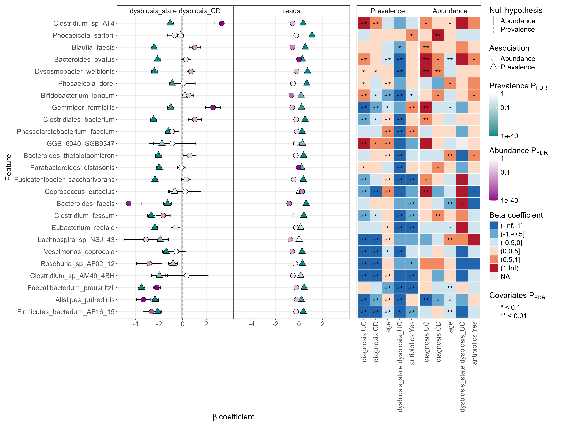
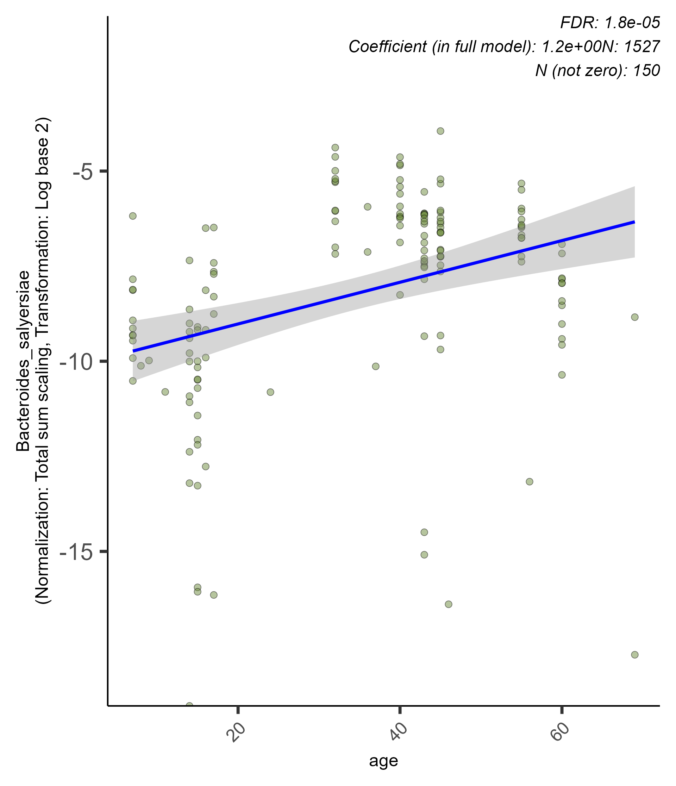
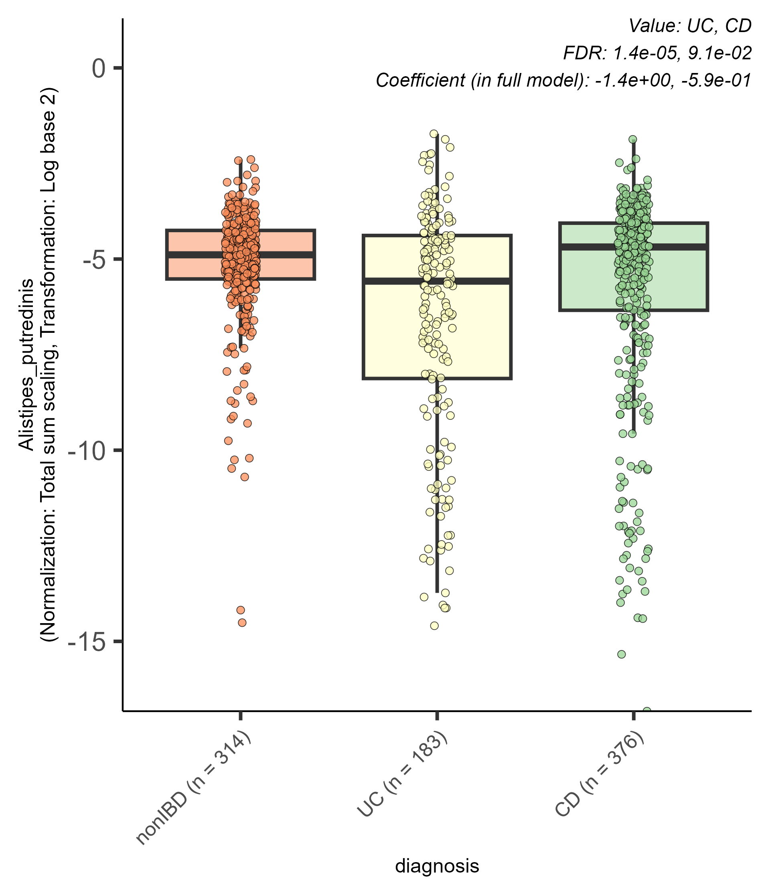
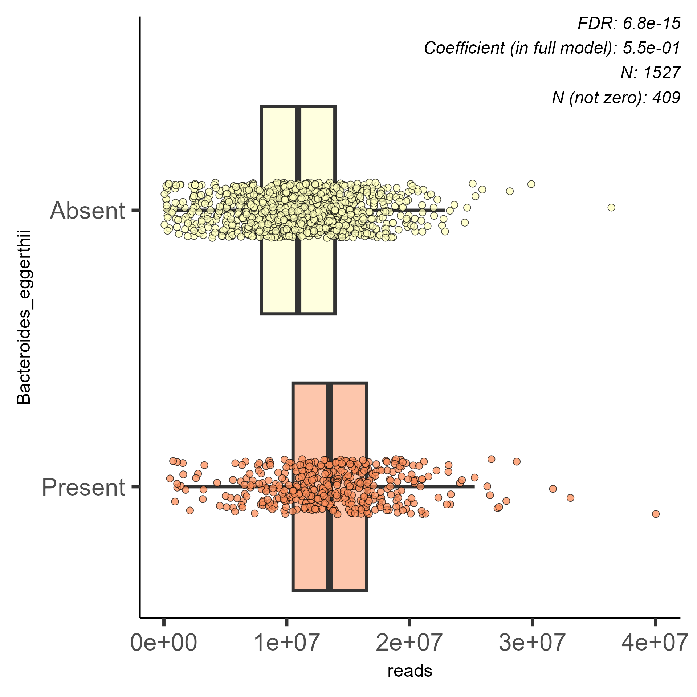
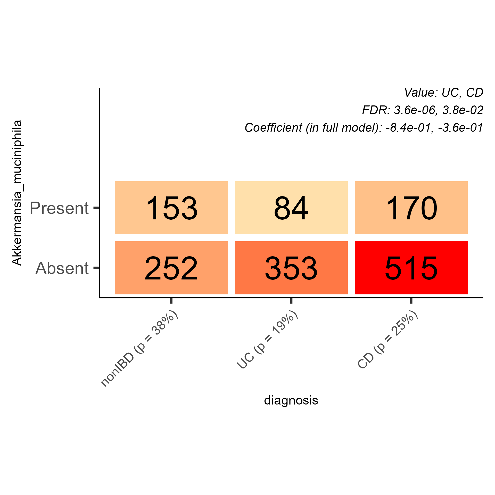
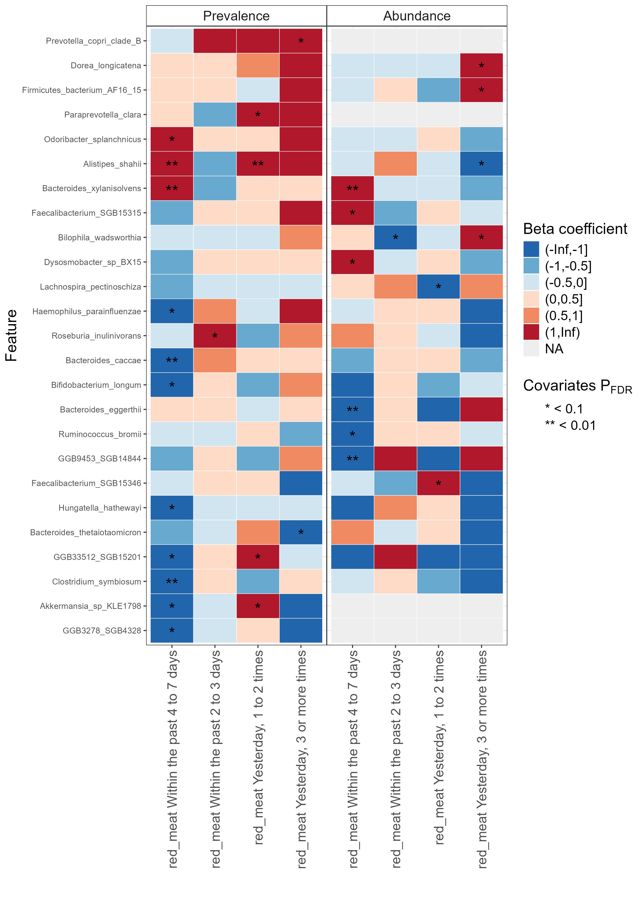

```{r setup, include=FALSE}
knitr::opts_chunk$set(
  collapse = T, echo=T, comment="#>", message=F, warning=F,
	fig.align="center", fig.width=5, fig.height=3, dpi=150)
```


The MaAsLin3 scripts is referenced from MicrobiomeStatPlot [Inerst Reference below].

If you use this script, please cited 如果你使用本代码，请引用：

**Yong-Xin Liu**, Lei Chen, Tengfei Ma, Xiaofang Li, Maosheng Zheng, Xin Zhou, Liang Chen, Xubo Qian, Jiao Xi, Hongye Lu, Huiluo Cao, Xiaoya Ma, Bian Bian, Pengfan Zhang, Jiqiu Wu, Ren-You Gan, Baolei Jia, Linyang Sun, Zhicheng Ju, Yunyun Gao, **Tao Wen**, **Tong Chen**. 2023. EasyAmplicon: An easy-to-use, open-source, reproducible, and community-based pipeline for amplicon data analysis in microbiome research. **iMeta** 2(1): e83. https://doi.org/10.1002/imt2.83

The online version of this tuturial can be found in https://github.com/YongxinLiu/MicrobiomeStatPlot


**Authors**
First draft(初稿)：Defeng Bai(白德凤)；Proofreading(校对)：Ma Chuang(马闯) and Jiani Xun(荀佳妮)；Text tutorial(文字教程)：Defeng Bai(白德凤)


# Introduction简介

2024年年末，biobakery项目组推出了MaAsLin3, 这里进行MaAsLin3的测试，并进行中文翻译相关软件介绍和使用的内容。

英文原文内容参考：https://github.com/biobakery/biobakery/wiki/MaAsLin3

MaAsLin 3.0教程

MaAsLin3 是 MaAsLin（具有线性模型的微生物组多变量关联）的下一代。这个全面的 R 包可以有效地确定表型元数据和微生物组学特征之间的多变量关联。相对于 MaAsLin 2，MaAsLin 3 引入了量化和测试丰度和流行度关联的能力，同时更好地考虑了组合性。通过结合广义线性模型，MaAsLin 3 可适应大多数现代流行病学研究设计，包括横断面研究和纵向研究。

如果您使用 MaAsLin 3 软件，请引用论文：

William A. Nickols, Thomas Kuntz, Jiaxian Shen, Sagun Maharjan, Himel Mallick, Eric A. Franzosa, Kelsey N. Thompson, Jacob T. Nearing, Curtis Huttenhower. MaAsLin 3: Refining and extending generalized multivariable linear models for meta-omic association discovery. bioRxiv 2024.12.13.628459; doi: https://doi.org/10.1101/2024.12.13.628459


## 1. Installing R

## 2. Installing MaAsLin 3

```{r}

if (!require("BiocManager", quietly = TRUE))
    install.packages("BiocManager")

#BiocManager::install("biobakery/maaslin3")
library(maaslin3)

```

## 3. Microbiome association detection with MaAsLin 3

要运行 MaAsLin 3，用户必须提供每个样本特征丰度表（仍包含零）、每个样本元数据表以及公式或固定效应（也可以添加随机效应），以指定元数据应如何与特征普遍性（特征存在或不存在的可能性）和丰度（如果存在，特征的含量是多少）相关联。MaAsLin 3 将返回一个关联表，其中包括每个特征元数据关联的效应大小和 p 值，以及一个视觉文件夹，其中包括重要关联的摘要图和诊断图。

### 3.1 MaAsLin 3 输入

MaAsLin3 需要两个输入文件。

1.特征丰度数据框
-格式化为以特征为列、以样本为行。
-此格式的转置也是可以的。
-可能的特征包括分类或基因。这些可以是相对丰度或计数。
-这可以是制表符分隔文件的文件路径。

2.元数据数据框
-格式化为变量作为列，样本作为行。
-此格式的转置也可以。
-可能的元数据包括性别或年龄。
-这可以是制表符分隔文件的文件路径。

数据文件可以包含元数据文件中未包含的样本（反之亦然）。对于这两种情况，未包含在两个文件中的样本将从分析中删除。此外，样本在两个文件中的顺序不需要相同，因为行和列将根据需要进行扫描和重新排列。

元数据中含有 NA 值的样本在拟合模型时将被排除。建议在随机缺失假设下提前删除这些样本，或使用多重插补来运行完整数据集。

示例输入文件可以在 MaAsLin 3 源或 MaAsLin 3 教程文件存储库的 inst/extdata 文件夹中找到。提供的文件是根据人类微生物组计划 2 (HMP2) 数据生成的，可从 https://ibdmdb.org/ 下载。

-HMP2_taxonomy.tsv：一个制表符分隔文件，其中样本为行，物种为列。它是完整 HMP2 分类法的子集，仅包含部分物种丰度。

-HMP2_metadata.tsv：一个制表符分隔的文件，其中样本为行，元数据为列。它是完整 HMP2 元数据的子集，仅包含部分字段。


```{r}
library(maaslin3)

# Read abundance table 丰度表
taxa_table_name <- system.file("extdata", "HMP2_taxonomy.tsv", package = "maaslin3")
taxa_table <- read.csv(taxa_table_name, sep = '\t')

# Read metadata table 元信息表
metadata_name <- system.file("extdata", "HMP2_metadata.tsv", package = "maaslin3")
metadata <- read.csv(metadata_name, sep = '\t')

# Factor the categorical variables to test IBD against healthy controls
# 考虑分类变量来检验 IBD 与健康对照组
metadata$diagnosis <- 
  factor(metadata$diagnosis, levels = c('nonIBD', 'UC', 'CD'))
metadata$dysbiosis_state <- 
  factor(metadata$dysbiosis_state, levels = c('none', 'dysbiosis_UC', 'dysbiosis_CD'))
metadata$antibiotics <- 
  factor(metadata$antibiotics, levels = c('No', 'Yes'))

# Check how the dataframes look like
# 检查数据
taxa_table[1:5, 1:5]
metadata[1:5, 1:5]

```


3.2 运行 MaAsLin 3

MaAsLin 3 通过指定丰度表 (input_data)、元数据表 (input_metadata)、输出目录 (output) 和模型来运行。模型可以来自公式或术语向量。无论哪种情况，变量名称都不应包含空格或不寻常的字符。

-公式：公式参数应设置为满足 lme4 规范的任何公式：固定效应、随机效应（第 4.2 节）、交互项（第 4.3 节）、多项式项等都可以包含。如果将分类变量作为固定效应包含，则每个级别将针对第一个因子级别进行测试。此外，可以通过在公式中包含 group(variable_name) 和 ordered(variable_name) 来包含有序预测因子（第 4.4 节）和组预测因子（第 4.5 节）。当数据涉及配对或匹配的病例对照样本时，可以通过使用 strata(variable_name) 指定分组变量来运行条件逻辑回归。

-向量：或者，可以为参数 fixed_effects、random_effects、group_effects、ordered_effects 和 strata_effects 提供一个变量名称向量。变量应作为列名包含，而不是使用 $ 符号。分类变量应预先按因子排序，或者应将引用作为“变量，引用”字符串提供，用分号分隔多个变量（例如，variable_1，reference_1；variable_2，reference_2）。注意：在变量和级别之间添加空格可能会导致使用错误的参考级别。

由于 MaAsLin 3 识别了流行性（存在/不存在）关联，因此样本读取深度（读取次数）应作为协变量（如果可用）包括在内。当模型中不包含读取深度时，更深的测序可能会以可能与感兴趣的元数据虚假相关的方式增加特征检测。

在 HMP2 数据上运行 MaAsLin 3

以下命令在 HMP2 数据上运行 MaAsLin 3，运行多变量回归模型来测试微生物物种丰度和患病率与 IBD 诊断和菌群失调评分之间的关联，同时控制抗生素使用、年龄和采样深度（读数）。丰度关联来自将多元线性模型拟合到特征存在的样本中特征以 2 为底的对数相对丰度。患病率关联来自将多元逻辑模型拟合到所有样本中特征的存在/不存在数据。输出将定向到当前工作目录下名为 hmp2_output 的文件夹（输出 =“hmp2_output”）。

为了显示每种类型的图（见下文），绘制的显著关联的最大数量已增加，即 max_pngs=100（默认值为
30）。前四个参数以外的所有其他参数都是默认参数，但为了清晰起见，仍包含在内：

-随后将使用总和缩放（normalization = 'TSS'）和对数变换（'transform = 'LOG'）。这些几乎始终是推荐的选择（并且所有 MaAsLin 3 评估都是使用这些选项执行的），但允许使用其他规范化和变换（请参阅 ?maaslin3 中的规范化和变换）。

-数据增强程序用于避免逻辑回归中的线性可分性（augment = TRUE）。几乎总是建议这样做，尽管可以关闭它（请参阅手册中的 augment）。

-连续元数据变量是 z 分数标准化的（减去平均值，除以标准差），其中 standardize = TRUE，以便系数处于同一尺度（改善可视化）。

-名义 FDR 水平 0.1（max_significance = 0.1）决定哪些关联是显著的，但这也可以改变（参见手册中的 max_significance）。

-对于丰度系数，为了解释相对丰度数据中的组成性，重要性是通过与特征元数据的中位数系数 (median_comparison_abundance) 进行比较来确定的。由于普遍性系数不具有相同的组成特性，因此它们与 0 (median_comparison_prevalence) 进行比较。有关这些参数的讨论，请参阅下文。

一个 CPU 用于拟合（核心 = 1）。

丰度、流行度和方差过滤参数不包括在内，默认情况下为 0。与其他差异丰度工具不同，低流行度特征不需要过滤掉，因为 MaAsLin 3 中的流行度建模已经考虑了高比例的零。但是，过滤低流行度特征可能会提高功效。

默认情况下，模型拟合时会打印多行信息，但可以使用详细程度参数更改详细程度（例如，verbosity ='WARN'）。

中位数比较

当 median_comparison_abundance 或 median_comparison_prevalence 处于开启状态时，元数据的系数将根据该元数据的中位数系数（特征之间的中位数）进行测试。否则，系数将与 0 进行测试。对于丰度关联，这是为了考虑组合性，即在相对尺度上针对零进行测试并不等同于在绝对尺度上针对零进行测试。用户手册包含有关何时使用 median_comparison_abundance 和 median_comparison_prevalence 的更广泛讨论，但总结如下：

-median_comparison_abundance 默认为 TRUE，在使用相对丰度数据时，应使用它来在绝对尺度上进行推断。当 median_comparison_abundance 为 TRUE 时，只有 p 值和 q 值会发生变化。返回的系数仍然是相对丰度系数，除非 subtract_median 为 TRUE，在这种情况下将减去中位数。

-在以下情况下，median_comparison_abundance 应该为 FALSE：(1) 测试显著相对关联；(2) 在假设总绝对丰度不变的情况下测试绝对丰度关联；或 (3) 在提供带有 unscaled_abundance 的 spike-in 或总丰度时测试显著绝对关联。

-median_comparison_prevalence 默认为 FALSE。

```{r}

set.seed(1)
fit_out <- maaslin3(input_data = taxa_table,
                    input_metadata = metadata,
                    output = 'hmp2_output',
                    formula = '~ diagnosis + dysbiosis_state +
                        antibiotics + age + reads',
                    normalization = 'TSS',
                    transform = 'LOG',
                    augment = TRUE,
                    standardize = TRUE,
                    max_significance = 0.1,
                    median_comparison_abundance = TRUE,
                    median_comparison_prevalence = FALSE,
                    max_pngs = 250,
                    cores = 1,
                    verbosity ='WARN')

```


3.3 MaAsLin 3 输出

HMP2 输出可以在 MaAsLin 3 教程文件库中找到。

显著相关

MaAsLin 3 的主要输出是 significance_results.tsv 中的显著关联列表。此列表列出了所有通过 MaAsLin 3 联合或个体 q 值显著性阈值的关联，按个体 q 值的递增顺序排列。格式为：

-feature 和 metadata 是功能和元数据名称。

-value 和 name 是来自模型的元数据和变量名称的值。

-coef 和 stderr 是模型的拟合系数和标准误差。在丰度模型中，元数据变量的一个单位变化对应于特征相对丰度的 2coef 倍变化。在流行模型中，元数据变量的一个单位变化对应于特征存在的对数几率的 coef 变化。

-pval_individual 和 qval_individual 是个体关联的 p 值和错误发现率 (FDR) 校正的 q 值。FDR 校正是对所有 p 值进行的，在丰度和流行度建模中没有错误。

-pval_joint 和 qval_joint 是联合流行度和丰度关联的 p 值和 q 值。p 值来自将关联的丰度和流行度 p 值的最小值代入 Beta(1,2) CDF。它被解释为如果特征和元数据之间既没有丰度关联也没有流行度关联，则丰度或流行度关联会像观察到的那样极端的概率。

-模型指定关联是丰富性还是普遍性。

-N 和 N_not_zero 是该特征的数据点总数和非零数据点总数。


完整输出文件结构

MaAsLin 3 生成两种类型的输出文件（如下所述）：数据和可视化。此外，从 maaslin3（上面的 fit_out）返回的对象包含所有数据和结果（参见 ?maaslin_fit）。

1.数据输出文件
-significant_results.tsv

-all_results.tsv
格式与上面相同，但适用于所有关联，并带有一个额外的列，列出了模型拟合中的任何错误。

-features
该文件夹包含输入特征表的过滤、规范化和转换版本。
这些步骤按上述顺序依次执行。
如果设置了选项使得某个步骤不会改变数据，则仍然会输出结果表。

-models_linear.rds and models_logistic.rds
这些文件包含每个模型适合对象的列表。
仅当 save_models 设置为 TRUE 时才会生成。

-residuals_linear.rds and residuals_logstic.rds
这些文件包含一个数据框，其中有每个特征的残差。对于逻辑拟合，残差是偏差残差。

-fitted_linear.rds and fitted_logistic.rds
这些文件包含一个数据框，其中列出了每个特征的拟合值。

-ranef_linear.rds and ranef_logistic.rds
这些文件包含一个数据框，其中提取了每个特征的随机效应（当指定随机效应时）。

-maaslin3.log
该文件包含运行的所有日志信息。
它包括所有设置、警告、错误和运行的步骤。

2.可视化输出文件
-summary_plot.pdf
该文件包含最显著关联的组合系数图和热图。在热图中，一颗星表示单个 q 值低于参数 max_significance，两颗星表示单个 q 值低于 max_significance 除以 10。



-association_plots/[metadatum]/[association]/[metadatum]_[feature]_[association].png
为每个显著关联生成一个图，最多可达 max_pngs。
散点图用于连续元数据丰度关联。
箱线图用于分类数据丰度关联。
箱线图用于连续数据流行度关联。
网格用于分类数据流行度关联。
绘制的数据点经过过滤、规范化和转换，因此图中的比例是拟合时使用的比例。









每个关联图的右上角是结果文件中显著关联的名称、单个关联的 FDR 校正 q 值、数据集中的样本数以及特征的非零丰度样本数。在具有分类元数据变量的图中，参考类别位于左侧，右上角的显著 q 值和系数按上面指定的值的顺序排列。由于显示的系数对应于具有（可能）缩放元数据变量的完整拟合模型，因此绘制的边际关联可能与显示的系数不匹配。但是，这些图旨在提供可解释的视觉效果，同时通常与完整模型一致。


诊断（Diagnostics）

在结果中需要检查几个常见问题：

1.如果在拟合过程中出现警告或错误，它们会记录在 all_results.tsv 的错误列中。通常，这些警告表示模型拟合失败或拟合效果不佳，不应信任，但有时警告可能是良性的，模型拟合可能仍然合理。如果产生错误，用户应检查感兴趣的关联。
当 warn_prevalence=TRUE 时，错误列中将生成一条注释，指示何时可能由丰度关联引起普遍性关联。应使用诊断视觉效果进行目视检查。

2.尽管进行了错误检查，但模型拟合度较差仍可能导致显著结果。通常可以使用 association_plots 目录中的视觉效果来诊断这些问题。
任何与分类变量的显著丰度关联通常应在每个类别中至少有 10 个观测值。
与分类变量的显著流行关联还应在每个显著类别中至少有 10 个存在该特征的样本和至少 10 个不存在该特征的样本。
应目视检查与连续元数据的显著丰度关联是否存在有影响力的异常值。

3.q 值是针对所有丰度和普遍性关系进行 FDR 校正的，因此最好只对感兴趣的变量的 p 值进行 FDR 校正。当存在许多重要但不感兴趣的关联（例如，许多读取深度关联）时，这可以减少误报。

4.还有一些经验法则需要牢记。
理想情况下，模型的样本数量（逻辑拟合的所有样本，线性拟合的非零样本）应为协变量项（所有连续变量加上所有分类变量水平）的 10 倍左右。
除非包含非常小的非标准化预测因子，否则绝对值大于 15 的系数（效应大小）通常是可疑的。（系数 15 对应于倍数变化 >30000！）。如果遇到这样的系数，请检查 (1) 没有出现错误，(2) 诊断看起来合理，(3) 拟合中使用了足够数量的样本，(4) q 值显著，(5) 元数据不是高度共线，以及 (6) 随机效应合理。


重绘图（Replotting）

运行 maaslin3 一次后，即可运行 maaslin_plot_results_from_output 来（重新）创建图表。这样，即使没有 maaslin_fit 或 maaslin3 返回的 R 对象（例如，如果通过命令行拟合模型），用户也可以绘制关联。建议使用对公式绘图具有鲁棒性的简单变量名称来拟合模型，然后将其转换为适合绘图的正确名称。同样，heatmap_vars 和 coef_plot_vars 可以在任何时候指定，但通常更容易先查看名称如何出现，然后选择哪些元数据变量将进入系数图，哪些将进入热图，然后使用 maaslin_plot_results_from_output。此重新绘图的代码示例可在 maaslin3_tutorial.Rmd 小插图中找到。


4. 高级主题

4.1 绝对丰度

大多数微生物组方法历来都侧重于相对丰度（1 的比例）。然而，一些实验方案可以估计绝对丰度（细胞计数/浓度）。MaAsLin 3 可用于两种类型的绝对丰度估计：spike-in 和总丰度缩放。在spike-in 程序中，添加少量已知数量的微生物，否则这些微生物不会存在于样本中，然后照常进行测序程序。然后，已经存在于群落中的微生物的绝对丰度估计为：

Absoluteabundanceothermicrobe = RelativeabundanceothermicrobeRelativeabundancespike - inmicrobe.(Absoluteabundancespike - inmicrobe)

或者，可以确定样本中的微生物总丰度（例如，使用标记基因的 qPCR 或通过细胞计数）。然后，估算群落中微生物的绝对丰度如下：

Absoluteabundancemicrobe = (Totalabsoluteabundance).(Relativeabundancemicrobe)


加标(Spike-in)

以下部分展示了使用来自 SparseDOSSA2 的模拟数据的合成加标程序。丰度表与 MaAsLin 3 的任何其他丰度表输入类似，只是“Feature101”是加标（必须存在于每个样本中）。比例因子数据框的唯一列名是“Feature101”，其中包含每个样本的加标绝对丰度（行名）。如果向所有样本添加了相同数量的加标，则此列可以完全为 1（或任何其他任意值）。使用加标程序时，比例因子数据框应有一个列，其名称与丰度表中的某个特征相同，将用作加标。示例输入文件可以在 MaAsLin 3 源或 MaAsLin 3 教程文件存储库的 inst/extdata 文件夹中找到。


```{r}
# Abundance table
taxa_table_name <- system.file("extdata", "abundance_spike_in_ex.tsv", package = "maaslin3")
spike_in_taxa_table <- read.csv(taxa_table_name, sep = '\t')

# Metadata table
metadata_name <- system.file("extdata", "metadata_spike_in_ex.tsv", package = "maaslin3")
spike_in_metadata <- read.csv(metadata_name, sep = '\t')
for (col in c('Metadata_1', 'Metadata_2', 'Metadata_5')) {
  spike_in_metadata[,col] <- factor(spike_in_metadata[,col])
}

# Spike-in table
unscaled_name <- system.file("extdata", "scaling_factors_spike_in_ex.tsv", package = "maaslin3")
spike_in_unscaled <- read.csv(unscaled_name, sep = '\t')

spike_in_taxa_table[c(1:5, 101),1:5]
spike_in_metadata[1:5,]
spike_in_unscaled[1:5, , drop=F]
```

以下代码适合绝对丰度模型。请注意，由于该过程涉及缩放相对丰度比，因此必须将标准化设置为 TSS。此外，median_comparison_abundance 现在设置为 FALSE，因为我们想要测试绝对系数是否为零。绝对丰度的数据框作为 unscaled_abundance 参数包含在内，并且将根据列名自动检测 spike-in 策略。输出文件可以在 MaAsLin 3 教程文件存储库中找到。

```{r}

fit_out <- maaslin3(
    input_data = spike_in_taxa_table,
    input_metadata = spike_in_metadata,
    output = 'spike_in_demo',
    formula = '~ Metadata_1 + Metadata_2 + Metadata_3 +
        Metadata_4 + Metadata_5',
    normalization = 'TSS',
    transform = 'LOG',
    median_comparison_abundance = FALSE,
    unscaled_abundance = spike_in_unscaled,
    verbosity ='WARN')

```


总丰度缩放(Total abundance scaling)

以下部分展示了使用来自 SparseDOSSA2 的模拟数据的合成总丰度缩放程序。丰度表与 MaAsLin 3 的任何其他丰度表输入一样，没有任何额外功能。缩放因子数据框的唯一列名是“total”，其中包含每个样本的总绝对丰度（行名）。示例输入文件可以在 MaAsLin 3 源或 MaAsLin 3 教程文件存储库的 inst/extdata 文件夹中找到。

```{r}

# Abundance table
taxa_table_name <- system.file("extdata", "abundance_total_ex.tsv", package = "maaslin3")
total_scaling_taxa_table <- read.csv(taxa_table_name, sep = '\t')

# Metadata table
metadata_name <- system.file("extdata", "metadata_total_ex.tsv", package = "maaslin3")
total_scaling_metadata <- read.csv(metadata_name, sep = '\t')
for (col in c('Metadata_1', 'Metadata_3', 'Metadata_5')) {
  spike_in_metadata[,col] <- factor(spike_in_metadata[,col])
}

# Total abundance table
unscaled_name <- system.file("extdata", "scaling_factors_total_ex.tsv", package = "maaslin3")
total_scaling_unscaled <- read.csv(unscaled_name, sep = '\t')

total_scaling_taxa_table[1:5, 1:5]
total_scaling_metadata[1:5,]
total_scaling_unscaled[1:5, , drop=F]

```

以下代码适合绝对丰度模型。与以前一样，TSS 必须设置为 TRUE，median_comparison_abundance 设置为 FALSE，并将绝对丰度的数据框作为 unscaled_abundance 参数包含在内。将根据列名检测总丰度缩放程序。输出文件可以在 MaAsLin 3 教程文件存储库中找到。

```{r}

fit_out <- maaslin3(
    input_data = total_scaling_taxa_table,
    input_metadata = total_scaling_metadata,
    output = 'total_scaling_demo',
    formula = '~ Metadata_1 + Metadata_2 + Metadata_3 +
        Metadata_4 + Metadata_5',
    normalization = 'TSS',
    transform = 'LOG',
    median_comparison_abundance = FALSE,
    unscaled_abundance = total_scaling_unscaled,
    verbosity ='WARN')

```

计算估计的绝对丰度(Computationally estimated absolute abundance)

当使用纯计算方法估计绝对丰度时（例如，Nishijima 等人使用函数 MLP 的 Cell 2024），可以估计丰度表，然后以规范化 = 'NONE' 运行，以避免缩放结果。


4.2 随机效应（Random effects）

某些研究对样本观察结果有自然的“分组”，例如纵向设计中按受试者分组，或家庭设计中按家庭分组。统计分析必须解决属于同一组的样本之间的非独立性问题。MaAsLin 3 为此提供了一个具有随机效应的简单界面，用户可以在其中指定分组变量以运行混合效应模型。此分组变量可以通过 random_effects 参数提供，也可以在模型中使用 (1|grouping_variable) 指定。这将添加“随机截距”，即对模型截距进行每组调整。可以根据 lme4 公式解析在公式中指定更复杂的随机效应。例如，HMP2 具有纵向设计，其中同一受试者（列参与者 ID）可以有多个样本。因此，我们在模型中使用参与者 ID 作为随机效应分组变量。示例输入文件可以在 MaAsLin 3 源或 MaAsLin 3 教程文件存储库的 inst/extdata 文件夹中找到，输出文件可以在 MaAsLin 3 教程文件存储库中找到。

```{r}

# Subset to only CD cases for time; taxa are subset automatically
fit_out <- maaslin3(
    input_data = taxa_table,
    input_metadata = metadata[metadata$diagnosis == 'CD',],
    output = 'random_effects_output',
    formula = '~ dysbiosis_state + antibiotics +
        age + reads + (1|participant_id)',
    plot_summary_plot = FALSE,
    plot_associations = FALSE,
    verbosity ='WARN')

```

请注意，输出中不包含任何参与者 ID 项；随机截距仅用于控制分组。如果您有兴趣在纵向研究中测试时间的影响，则应将时间点变量作为固定效应包含在您的 MaAsLin 3 公式中。

混合效应模型由于其复杂性需要更长的时间来拟合，并且由于额外的项，拟合可能会更频繁地失败。但是，考虑到这种非独立性很重要，MaAsLin 3 仍然能够在几个小时内拟合具有数千个样本和数千个特征的复杂模型（增加使用核心的 CPU 可能会有所帮助）。但是，随机效应并不是解决所有相关数据问题的办法。特别是，当每组的观测值少于 5 个时，随机截距模型可能会产生较差的模型拟合。在这些情况下，应使用每组固定效应或对于高级用户，条件逻辑回归（请参阅手册中的 strata_effects）。例如，在治疗前后研究中，前一个样本，后一个样本，参与者 ID 和前/后指标应作为固定效应包括在内，但仅应保留前/后指标以供事后分析。


4.3 互作（Interactions）

MaAsLin 3 公式模式的优点之一是能够包含交互项。从数学上讲，交互项对应于设计矩阵中两列的乘积。当连续变量与分类项交互时，交互项对应于连续变量在类别之间的斜率变化。对于两个交互的分类变量，请参见下文；通过示例可以更好地解释。在公式中，可以使用 : 符号指定交互以仅包含交互项，或使用 * 符号指定交互以同时包含交互项和非交互项（即 a*b 将项 a、b 和 a:b 相加）。示例输入文件可以在 MaAsLin 3 源或 MaAsLin 3 教程文件存储库的 inst/extdata 文件夹中找到，输出文件可以在 MaAsLin 3 教程文件存储库中找到。

```{r}
library(magrittr)
library(dplyr)
metadata <- metadata %>%
    mutate(dysbiosis_general = ifelse(dysbiosis_state != 'none',
                                    'dysbiosis', 'none')) %>%
    mutate(dysbiosis_general = factor(dysbiosis_general, levels =
                                        c('none', 'dysbiosis')))

fit_out <- maaslin3(
    input_data = taxa_table,
    input_metadata = metadata,
    output = 'interaction_output',
    formula = '~ diagnosis + diagnosis:dysbiosis_general +
        antibiotics + age + reads',
    verbosity ='WARN')
```


在上面的模型中，我们已将 dysbiosis_CD 和 dysbiosis_UC 转换为变量 dysbiosis_general 中的 dysbiosis，然后使用 diagnostic:dysbiosis_general 指定诊断和 dysbiosis_general 之间的交互。由于诊断本身有 3 个级别（非 IBD、UC、CD），因此每个特征将产生五个术语（名称列）：

-diagnosisCD 是非 dysbiotic CD 和非 IBD 之间的差异
-diagnosisUC 是非 dysbiotic UC 和非 IBD 之间的差异
-diagnosisCD:dysbiosis_generaldysbiosis（diagnosisCD 和 dysbiosis_generaldysbiosis 的交互）是非 dysbiotic CD 和 dysbiotic CD 之间的差异
-diagnosisnonIBD:dysbiosis_generaldysbiosis（diagnosisnonIBD 和 dysbiosis_generaldysbiosis 的交互）是 dysbiotic 和非 dysbiotic non-IBD 之间的差异。请注意，这些系数均为 NA，因为没有标记为非 IBD 的受试者被标记为菌群失调。
-diagnosisUC:dysbiosis_generaldysbiosis（diagnosisUC 和 dysbiosis_generaldysbiosis 的相互作用）是非菌群失调 UC 和菌群失调 UC 之间的差异

由于我们以不同的方式有效地拟合了原始模型，因此此输出表相当于原始输出表，但在列元数据、值和基于交互项的名称中使用了新名称。


4.4 层次比对（Level contrasts）

MaAsLin 3 的另一个功能是能够使用对比测试来测试有序预测因子的水平与水平之间的差异。有序预测因子是具有自然排序的分类变量，例如癌症阶段、饮食因素的消费频率或剂量组。在这里，我们通过在公式中包含 ordered(red_meat) 来评估微生物丰度和流行率与食用红肉之间的关系。这将执行对比测试，以确定每对后续水平之间是否存在差异（例如，“昨天，3 次或更多次”与“昨天，1 到 2 次”），而不是水平与基线之间是否存在差异（例如，“昨天，3 次或更多次”与“过去 7 天内没有”）。系数、标准误差和 p 值都对应于值水平与前一个水平之间的差异。有序预测因子应仅作为固定效应包括在内（即，没有有序预测因子作为随机效应等）。示例输入文件可以在 MaAsLin 3 源或 MaAsLin 3 教程文件存储库的 inst/extdata 文件夹中找到，输出文件可以在 MaAsLin 3 教程文件存储库中找到。

如果我们查看生成的热图，我们可以发现 Alistipes shahii 流行率关联可能很有趣，因为除了一个级别与级别的比较外，其他所有级别的比较中，它的流行率都随着肉类消费的增加而增加。

```{r}
# Put the red meat consumption responses in order
metadata <- metadata %>%
    mutate(red_meat = ifelse(
        red_meat == 'No, I did not consume these products in the last 7 days',
                            'Not in the last 7 days',
                            red_meat) %>%
            factor(levels = c('Not in the last 7 days',
                                'Within the past 4 to 7 days',
                                'Within the past 2 to 3 days',
                                'Yesterday, 1 to 2 times',
                                'Yesterday, 3 or more times'))
    )

# Create the model with only non-IBD subjects
fit_out <- maaslin3(
    input_data = taxa_table,
    input_metadata = metadata[metadata$diagnosis == 'nonIBD',],
    output = 'ordered_outputs',
    formula = '~ ordered(red_meat) + antibiotics + age + reads',
    plot_summary_plot = TRUE,
    plot_associations = TRUE,
    heatmap_vars = c('red_meat Within the past 4 to 7 days',
                    'red_meat Within the past 2 to 3 days',
                    'red_meat Yesterday, 1 to 2 times',
                    'red_meat Yesterday, 3 or more times'),
    max_pngs = 30,
    verbosity ='WARN')
```



4.5 组间差异（Group-wise differences）

这里重点介绍的 MaAsLin 3 的最后一个功能是能够使用 ANOVA 或类似 ANOVA 的程序来测试分类预测因子的分组差异。分组预测因子是具有或不具有排序的分类变量，例如种族、国家或饮食因素的消费频率。在进行分组差异测试时，我们不会比较任何两个特定的级别；相反，我们会调查所有级别的丰度和流行率是否相同。因此，不会返回任何系数，只会返回 p 值。在这里，我们通过包括 group(red_meat) 来测试不同红肉消费水平的人群中微生物丰度和流行率是否存在差异。分组预测因子应仅作为固定效应（即，没有作为随机效应的分组预测因子等）包含在内。示例输入文件可以在 MaAsLin 3 源或 MaAsLin 3 教程文件存储库的 inst/extdata 文件夹中找到，输出文件可以在 MaAsLin 3 教程文件存储库中找到。

如果我们查看之前的相同 Alistipes shahii 关联，我们会发现组预测器没有返回系数或标准误差，但 q 值非常低。这证实了之前的观察结果，即 Alistipes shahii 的流行程度与红肉消费量存在差异。

```{r}
fit_out <- maaslin3(
    input_data = taxa_table,
    input_metadata = metadata[metadata$diagnosis == 'nonIBD',],
    output = 'group_outputs',
    formula = '~ group(red_meat) + antibiotics + age + reads',
    plot_summary_plot = TRUE,
    plot_associations = TRUE,
    heatmap_vars = c('red_meat Within the past 4 to 7 days',
                    'red_meat Within the past 2 to 3 days',
                    'red_meat Yesterday, 1 to 2 times',
                    'red_meat Yesterday, 3 or more times'),
    max_pngs = 200,
    verbosity ='WARN')
```


4.6 对比测试(Contrast tests)

我们还可以在 MaAsLin 3 中执行对比测试，以检查系数的线性组合是否与右侧大小 (RHS) 上的某个常数有显著差异。例如，我们可以通过测试对比 β1−β2 = 0 来测试两个系数是否显著不同。对比矩阵的列名应与系数名称匹配，行应与感兴趣的对比相匹配。对于每一行 CT，将测试假设 H0:CTβ→=RHS。请注意，在原始拟合中，save_models 必须为 TRUE 才能执行对比测试。如果未指定 RHS，则将执行中位数测试，并返回中位数测试 RHS。

下面我们测试一下UC和CD的诊断系数是否相同，以及UC和CD的菌群失调系数是否相同。

```{r}
# Fit with save_models = TRUE
fit_out <- maaslin3(input_data = taxa_table,
                    input_metadata = metadata,
                    output = 'contrast_test_output',
                    formula = '~ diagnosis + dysbiosis_state +
                        antibiotics + age + reads',
                    plot_summary_plot = FALSE,
                    plot_associations = FALSE,
                    cores = 1,
                    save_models = TRUE,
                    verbosity ='WARN')

contrast_mat <- matrix(c(1, -1, 0, 0, 0, 0, 1, -1), 
    ncol = 4, nrow = 2, byrow = TRUE)
    
colnames(contrast_mat) <- c("diagnosisUC",
                            "diagnosisCD",
                            "dysbiosis_statedysbiosis_UC",
                            "dysbiosis_statedysbiosis_CD")
                            
rownames(contrast_mat) <- c("diagnosis_test", "dysbiosis_test")

contrast_mat

contrast_out <- maaslin_contrast_test(fits = fit_out$fit_data_abundance$fits,
                        contrast_mat = contrast_mat)

contrast_out %>%
    knitr::kable() %>%
    kableExtra::kable_styling("striped", position = 'center') %>%
    kableExtra::scroll_box(width = "800px", height = "400px")
```


5. 命令行运行

MaAsLin 3 也可以通过命令行界面运行。例如，第一个 HMP2 分析可以使用以下方式执行：

确保提供 MaAsLin3 可执行文件的完整路径（即 ./R/maaslin3.R）。
在演示命令中：
-inst/extdata/HMP2_taxonomy.tsv 是数据（或特征）文件的路径
-inst/extdata/HMP2_metadata.tsv 是元数据文件的路径
-command_line_output 是写入输出的文件夹的路径

```{bash}

#./R/maaslin3.R inst/extdata/HMP2_taxonomy.tsv inst/extdata/HMP2_metadata.tsv command_line_output --formula='~ diagnosis + dysbiosis_state + antibiotics + age + reads' --reference='diagnosis,nonIBD;dysbiosis_state,none;antibiotics,No'

```


If used this script, please cited:
使用此脚本，请引用下文：

**Yong-Xin Liu**, Lei Chen, Tengfei Ma, Xiaofang Li, Maosheng Zheng, Xin Zhou, Liang Chen, Xubo Qian, Jiao Xi, Hongye Lu, Huiluo Cao, Xiaoya Ma, Bian Bian, Pengfan Zhang, Jiqiu Wu, Ren-You Gan, Baolei Jia, Linyang Sun, Zhicheng Ju, Yunyun Gao, **Tao Wen**, **Tong Chen**. 2023. EasyAmplicon: An easy-to-use, open-source, reproducible, and community-based pipeline for amplicon data analysis in microbiome research. **iMeta** 2: e83. https://doi.org/10.1002/imt2.83

Copyright 2016-2024 Defeng Bai <baidefeng@caas.cn>, Chuang Ma <22720765@stu.ahau.edu.cn>, Jiani Xun <15231572937@163.com>, Yong-Xin Liu <liuyongxin@caas.cn>

