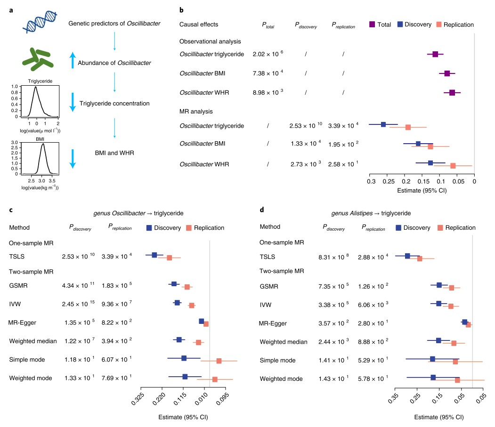
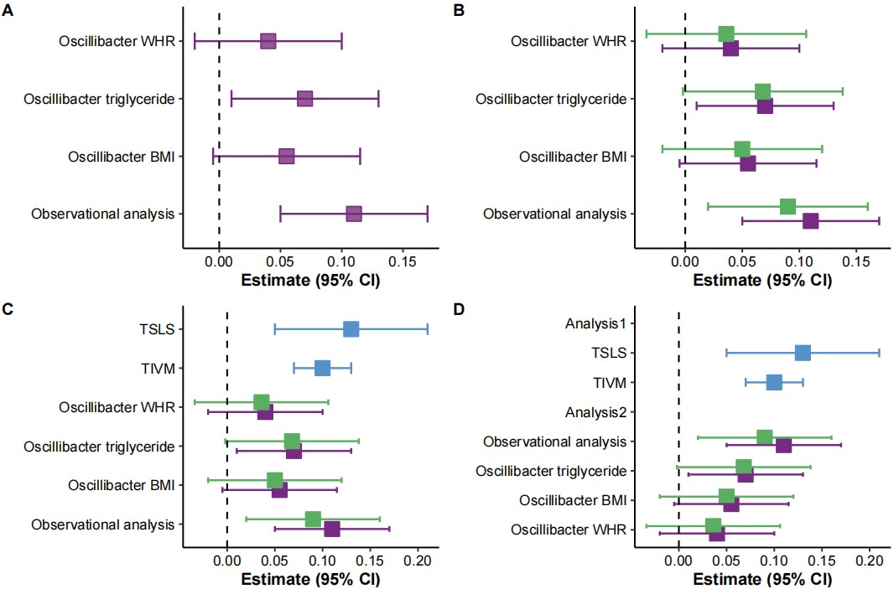

```{r setup, include=FALSE}
knitr::opts_chunk$set(
  collapse = T, echo=T, comment="#>", message=F, warning=F,
	fig.align="center", fig.width=5, fig.height=3, dpi=150)
```


The Mendelian Randomization Analysis scripts is referenced from MicrobiomeStatPlot [Inerst Reference below].

If you use this script, please cited 如果你使用本代码，请引用：

**Yong-Xin Liu**, Lei Chen, Tengfei Ma, Xiaofang Li, Maosheng Zheng, Xin Zhou, Liang Chen, Xubo Qian, Jiao Xi, Hongye Lu, Huiluo Cao, Xiaoya Ma, Bian Bian, Pengfan Zhang, Jiqiu Wu, Ren-You Gan, Baolei Jia, Linyang Sun, Zhicheng Ju, Yunyun Gao, **Tao Wen**, **Tong Chen**. 2023. EasyAmplicon: An easy-to-use, open-source, reproducible, and community-based pipeline for amplicon data analysis in microbiome research. **iMeta** 2(1): e83. https://doi.org/10.1002/imt2.83

The online version of this tuturial can be found in https://github.com/YongxinLiu/MicrobiomeStatPlot


**Authors**
First draft(初稿)：Defeng Bai(白德凤)；Proofreading(校对)：Ma Chuang(马闯) and Jiani Xun(荀佳妮)；Text tutorial(文字教程)：Defeng Bai(白德凤)


# Introduction简介

孟德尔随机化(Mendelian Randomization Analysis)

根据这个教程学习孟德尔随机化分析
https://mp.weixin.qq.com/s/opx5-pGVerVDtEIZzRziEQ


孟德尔随机化分析的目的：Infer ther causal effect of the exposure on the outcome

在19世纪，孟德尔用豌豆花作为实验材料，通过对豌豆花颜色、形状等特征的观察和统计分析，发现了遗传的基本规律，这就是孟德尔定律。不过，孟德尔定律只适用于单基因的遗传性状，并且无法解释复杂的多基因遗传疾病。此外，孟德尔定律也无法解释环境因素对基因表达的影响，以及基因与环境的相互作用。为了解决这个问题，著名统计学家Fisher提出了孟德尔随机化的概念。

孟德尔随机化Mendelian randomization, MR是一种基于遗传变异的因果推断方法，其基本原理是利用自然界中的随机分配的基因型对表型的影响来推断生物学因素对疾病的影响。

举个例子：
假设我们了解体重BMI对冠心病发病的影响。但是对冠心病影响的因素太多了，比如高血压、高血糖等，我们怎么才能排除混在因素，确定为体重BMI对冠心病有影响呢？我们先要选定一个工具基因变量M，这个M要和我们研究变量X相关，和我们解决变量和混杂因素无关。最后我们通过MR分析得出M基因对Y有影响，因为M基因对Y没有直接关联，所以M基因是通过影响暴露因素X而后从而对Y产生影响。这一连成线的过程可以看作四类似一个中介效应，暴漏因素X就是中介变量，基因M通过对中介变量X的影响达到对Y的影响。

要做孟德尔随机化要有3个假设前提：
1.基因M要和体重（暴露因素）强相关联-关联性假设
2.基因M和结局变量冠心病和其他混杂因素没有关联。-独立性假设
3.基因M只能通过影响体重对冠心病造成影响，不能通过其他途径对冠心病造成影响。-排他性假设

目前主流使用的孟德尔随机化的工具为TwoSampleMR包。TwoSampleMR软件包的使用可参考https://mrcieu.github.io/TwoSampleMR/articles/perform_mr.html


关键字：微生物组数据分析、MicrobiomeStatPlot、孟德尔随机化分析、R语言可视化

Keywords: Microbiome analysis, MicrobiomeStatPlot, Mendelian Randomization Analysis , R visulization


## 孟德尔随机化分析案例
Mendelian Randomization Analysis example

这是来自于深圳华大基因Tao Zhang课题组2022年发表于Nature Genetics上的一篇文章。论文题目为：Mendelian randomization analyses support causal relationships between blood metabolites and the gut microbiome. https://doi.org/10.1038/s41588-021-00968-y

This is an article from Tao Zhang's research group at Shenzhen BGI published in Nature Genetics in 2022. The title of the paper is: Mendelian randomization analyses support causal relationships between blood metabolites and the gut microbiome. https://doi.org/10.1038/s41588-021-00968-y



Fig. 5 | causal effects of genus Oscillibacter and Alistipes on decreasing blood triglyceride concentration. a, Schematic representation of the MR analysis results: genetic predisposition to higher abundance of Oscillibacter is associated with decreased blood triglyceride concentration and, to a lesser extent, for lowering BMI and WHR. b, Forest plot representing the effect per 1 s.d. increase in Oscillibacter abundance on blood triglyceride, BMI and WHR, as estimated using observational and MR analysis, respectively. Observational correlation analysis was performed using a multivariate linear model in a total of 2,545 samples (purple). One-sample MR analysis was carried out by using a PRS constructed by up to 134 genetic predictors as an instrumental variable, as estimated in the discovery (blue) and replication (red) cohort, respectively. The beta estimates and 95% confidence interval (CI) values as well as P values from both the observational and one-sample MR analysis are listed. c,d, Forest plots representing the MR estimates and 95% CI values of the causal effects of Oscillibacter (c) and Alistipes (d) on triglyceride amount, respectively, as estimated using a one-sample MR and six different two-sample MR methods both in the discovery (blue) and replication (red) cohort. The P values calculated by each MR method are also listed.

图 5 | 颤杆菌属和 Alistipes 对降低血液甘油三酯浓度的因果影响。a，MR分析结果的示意图：对颤杆菌较高丰度的遗传易感性与血液甘油三酯浓度降低有关，在较小程度上与降低 BMI 和 WHR 有关。b，森林图表示颤杆菌丰度每增加 1 s.d. 对血液甘油三酯、BMI 和 WHR 的影响，分别使用观察性和 MR分析估计。使用多元线性模型在总共 2,545 个样本（紫色）中执行观察性相关性分析。使用由多达 134 个遗传预测因子构建的 PRS 作为工具变量进行单样本 MR 分析，分别在发现（蓝色）和复制（红色）队列中估计。列出了观察和单样本 MR 分析的 beta 估计值和 95% 置信区间 (CI) 值以及 P值。c、d、森林图分别表示使用单样本 MR 和六种不同的双样本 MR 方法在发现 (蓝色) 和复制 (红色) 队列中估计的 Oscillibacter (c) 和 Alistipes (d) 对甘油三酯含量的因果影响的 MR 估计值和 95% CI 值。还列出了通过每种 MR 方法计算的 P 值。


**结果**
The most significant causal effect was Oscillibacter on decreasing blood triglyceride concentration (Fig. 5a–c) and, to a lesser extent, on lowering BMI and waist-hip ratio (WHR), whereas the effect with plasma alanine was bidirectional. Using 134 genetic variants to construct a polygenic risk score (PRS) (134 genetic variants and the constructed PRS explained 39.3% and 49.6% of the phenotypic variance, respectively; Fig. 3b and Supplementary Table 10) for one-sample MR analysis in the discovery cohort, we estimated that each 1 s.d. increase in the abundance of Oscillibacter would generate a 0.261 mmol l−1 (P = 2.53 × 10−10), a 0.161 kg m−2 and 0.126 ratio decrease in WHR (P = 2.73 × 10−3 decrease in triglyceride concentration decrease in BMI (P = 1.33 × 10−4 ). This causal relationship was robust when four two-sample MR tests were performed (PGCTA-GSMR (genome-wide complex trait analysis-generalized summary MR) Pinverse_variance_weighted = 2.45 × 10−15= 4.34 × 10−11 , Pweighted-median = 1.22 × 10−7 , and PMR-Egger = 1.35 × 10−5) (Fig. 5c), and there was no evidence of horizontal pleiotropy (PMR-PRESSOGlobaltest = 0.18; Supplementary Table 11). In addition, higher relative abundance of Alistipes was also associated with decreased blood triglyceride concentration (Fig. 5d).

最显著的因果效应是颤杆菌降低血液甘油三酯浓度（图 5a-c），在较小程度上降低 BMI 和腰臀比 (WHR)，而血浆丙氨酸的影响是双向的。使用 134 个遗传变异构建多基因风险评分 (PRS)（134 个遗传变异和构建的 PRS 分别解释了 39.3% 和 49.6% 的表型变异；图 3b 和补充表 10）在发现队列中进行单样本 MR 分析，我们估计每个 1 s.d. Oscillibacter 丰度的增加会导致 WHR 降低 0.261 mmol l-1（P = 2.53 × 10-10）、甘油三酯浓度降低 0.161 kg m-2 和 0.126 比率（P = 2.73 × 10-3）BMI 降低（P = 1.33 × 10-4）。当进行四次双样本 MR 测试时，这种因果关系是稳健的（PGCTA-GSMR（全基因组复杂性状分析-广义总结 MR）Pinverse_variance_weighted = 2.45 × 10-15= 4.34 × 10-11，Pweighted-median = 1.22 × 10-7，和 PMR-Egger = 1.35 × 10-5）（图 5c），并且没有水平多效性的证据（PMR-PRESSOGlobaltest = 0.18；补充表 11）。此外，Alistipes 相对丰度较高也与血液甘油三酯浓度降低有关（图 5d）。


## Packages installation软件包安装


```{r}
# 基于CRAN安装R包，检测没有则安装 Installing R packages based on CRAN and installing them if they are not detected
p_list = c("ggplot2", "reshape2",  "dplyr", "cowplot","readxl")
for(p in p_list){if (!requireNamespace(p)){install.packages(p)}
    library(p, character.only = TRUE, quietly = TRUE, warn.conflicts = FALSE)}

# 基于github安装
library(remotes)
if(!requireNamespace("TwoSampleMR", quietly = TRUE))
  remotes::install_github("MRCIEU/TwoSampleMR")

library(devtools)
if(!requireNamespace("MRPRESSO", quietly = TRUE))
  remotes::install_github("rondolab/MR-PRESSO")

# 加载R包 Loading R packages
suppressWarnings(suppressMessages(library(ggplot2)))
suppressWarnings(suppressMessages(library(reshape2)))
suppressWarnings(suppressMessages(library(cowplot)))
suppressWarnings(suppressMessages(library(dplyr)))
suppressWarnings(suppressMessages(library(readxl)))
suppressWarnings(suppressMessages(library(TwoSampleMR)))
suppressWarnings(suppressMessages(library(MRPRESSO)))
```


# Mendelian Randomization Analysis 孟德尔随机化分析

## Mendelian Randomization Analysis using R software 孟德尔随机化分析R语言实战

### 实战1

参考：https://mp.weixin.qq.com/s/opx5-pGVerVDtEIZzRziEQ

```{r MR01, echo=TRUE}
# 1.获得暴露因素X的SNP数据，包括体重BMI的SNP数据和结局冠心病的SNP数据。通常通过各种GWAS数据库或者GWAS文献找到。或者通过https://gwas.mrcieu.ac.uk/datasets/这个数据库寻找，利用这个数据库可以直接通过TwoSampleMR包下载。进入数据库网站后，在网站Traitcontains选项中里填入体重指数，然后筛选数据，这里分析选择了ieu-a-835这个数据。然后再找冠心病的数据，这里选的是ieu-a-7这个数据。然后，需要下载ieu-a-835和ieu-a-7这两个数据，先使用extract_instruments函数对暴露数据进行下载。如果是已经下载到电脑里面的数据，使用read_exposure_data函数和clump_data函数读取。

# 从数据库中查找用于 MR 分析的数据
library(TwoSampleMR)
exposure_dat <- extract_instruments(outcomes='ieu-a-835',#access_token = NULL, 
                         options(ieugwasr_api = 'gwas-api.mrcieu.ac.uk/'),
                         force_server = FALSE,
                         p1 = 5e-08,
                         clump = TRUE,
                         p2 = 5e-08,
                         r2 = 0.001,
                         kb = 10000)

# 查看exposure_dat的SNP数据
exposure_dat$SNP

# 因为ieu-a-7这个数据是冠心病数据，所以这一步要在ieu-a-7这个数据中找到与上面65个SNP匹配的数据，这样就生成了结果数据
outcome_dat <- extract_outcome_data(snps=exposure_dat$SNP,
 outcomes='ieu-a-7',
 options(ieugwasr_api = 'gwas-api.mrcieu.ac.uk/'),
 proxies = FALSE,
 maf_threshold =0.01#,
 #access_token =NULL
 )

# 2.效应等位与效应量保持统一
dat<- harmonise_data(
 exposure_dat = exposure_dat,
 outcome_dat = outcome_dat)

#以上2步完成就可以进行MR分析。mr默认使用五种方法(MR Egger, Weighted median, Inverse variance weighted, Simple mode, Weighted mode)

res<- mr(dat)
# 在res数据表中，b是效应值，se是标准误，pval是P值，最重要的就是看Inverse variance weighted这个方法的P值。这里P值小于0.05，表明体重和冠心病解决是有统计意义的。
#res

# 敏感性分析
mr_heterogeneity(dat)

# 水平多效性检验，如果变量工具不通过暴露影响结果，就违反了孟德尔的假设，就是存在多水平效应。
mr_pleiotropy_test(dat)

# Leave-one-out analysis，Leave-one-out analysis是指逐步剔除SNP后观察剩余的稳定性，理想的是剔除后变化不大。
res_loo <- mr_leaveoneout(dat)
#mr_leaveoneout_plot(res_loo)

# 可视化，散点图，可以看出趋势是正相关
p1 <-mr_scatter_plot(res, dat)
# p1

# 森林图
res_single<- mr_singlesnp(dat)
# mr_forest_plot(res_single)

# 漏斗图中的不对称性对于衡量特定 MR 分析的可靠性很有用。可以使用单个 SNP 结果生成漏斗图，如下所示：
# mr_funnel_plot(res_single)
```


### 实战2

参考：https://mp.weixin.qq.com/s/_1Zj5hAK8PvCSlW388Uffw

参考论文题目：Mendelian randomization analysis does not reveal a causal influence of mental diseases on osteoporosis. https://doi.org/10.3389/fendo.2023.1125427

```{r MR02, echo=TRUE}
library(MRPRESSO)
# 导入数据进行分析
Ins<-data<- read_excel("data/FA_BMD_data.xlsx",1)

# 暴漏数据
aaa<- extract_instruments(outcomes='ieu-a-22',clump=TRUE, r2=0.001,kb=10000)

# 数据不是标准格式，需要修改数据格式
outcome_dat<-format_data(Ins,
                         type = "outcome", header = TRUE,
                         phenotype_col ="Phenotype", snp_col = "SNPs", 
                         beta_col ="beta.outcome",
                         se_col ="se.outcome", 
                         eaf_col = "eaf.outcome", 
                         effect_allele_col ="effect_allele.outcome",
                         other_allele_col ="other_allele.outcome", 
                         pval_col = "pval.outcome")

# 进行数据效应等位与效应两保持统一，然后进行MR分析
Mydata<- harmonise_data(aaa, outcome_dat)

res<-mr(Mydata,method_list=c("mr_ivw", "mr_ivw_fe",
"mr_two_sample_ml","mr_egger_regression", "mr_weighted_median",
"mr_penalised_weighted_median","mr_simple_mode", "mr_weighted_mode"))

# 进行MR-PRESSO检验，是一个多水平效应检验
mr_presso(BetaOutcome="beta.outcome",
 BetaExposure ="beta.exposure", SdOutcome ="se.outcome",
 SdExposure = "se.exposure",OUTLIERtest =TRUE,DISTORTIONtest = TRUE,
 data =Mydata, NbDistribution = 1000,SignifThreshold = 0.05)

# 异质性检验
mr_heterogeneity(Mydata,
method_list=c("mr_egger_regression", "mr_ivw"))

# 多水平校验
pleio<- mr_pleiotropy_test(Mydata)
# pleio

# Leave-one-out analysis，Leave-one-out analysis是指逐步剔除SNP后观察剩余的稳定性，理想的是剔除后变化不大，这和我们的meta分析剔除法很相似。
single<- mr_leaveoneout(Mydata)
# mr_leaveoneout_plot(single)

# 散点图
# mr_scatter_plot(res,Mydata)

# 绘制森林图
res_single<- mr_singlesnp(Mydata)
# mr_forest_plot(res_single)

# 绘制漏斗图，主要是看蓝线周围的散点是否对称
# mr_funnel_plot(res_single)

# 最后生成OR和置信区间
out<-generate_odds_ratios(res)
```


### Plot MR analysis results 绘制孟德尔随机化结果图

```{r plot MR, echo=TRUE}
# Load data
MR01 <- read.table(file = "data/data_single.txt", sep = "\t", header = TRUE, check.names = FALSE)

# Plot
# 绘图
Set <- "A"
col.palette  <- setNames(c("#762a83"), c(Set))
p1 <- ggplot(MR01, aes(x = Total, y = Causal_effects, color = Set
                       )) +
  geom_point(size = 6, shape = 22, fill = "#945893", stroke = 0.8) + # Larger point size with border
  geom_errorbar(aes(xmin = Total - error_bar, xmax = Total + error_bar, colour = Set), 
                width = 0.3, size = 0.8) + # Error bars with adjusted width and size
  labs(y = "", x = "Estimate (95% CI)") +
  geom_vline(xintercept = 0, linetype = "dashed", color = "black", size = 0.7) +
  scale_color_manual(values = col.palette) +
  theme_classic(base_size = 14) + # Use a classic theme for a clean look
  theme(
    panel.grid.major = element_blank(), # Remove major grid lines
    panel.grid.minor = element_blank(), # Remove minor grid lines
    axis.text = element_text(color = 'black', size = 12),
    axis.title = element_text(size = 14, face = "bold"),
    legend.position = "none",
    legend.title = element_text(size = 14, face = "bold"),
    legend.text = element_text(size = 12),
    plot.title = element_text(size = 16, face = "bold", hjust = 0.5)
  )

# Save the plot
# 图保存
ggsave(filename = "results/Error_bar_plot01.pdf", plot = p1, width = 8, height = 6, useDingbats = FALSE, limitsize = FALSE)

# 分组对比(双)
MR02 <- read.table(file = "data/data_double.txt", sep = "\t", header = TRUE, check.names = FALSE)

# Plot
# 绘图
Set1 <- "A"
Set2 <- "B"
col.palette  <- setNames(c("#762a83","#5aae61"), c(Set1, Set2))
p2 <- ggplot(MR02, aes(x = Total, y = Causal_effects, fill = Set, color = Set
                       )) +
  geom_point(size = 6, shape = 22, stroke = 0.8, position = position_dodge(0.5)) + # Larger point size with border
  geom_errorbar(aes(xmin = Total - error_bar, xmax = Total + error_bar, colour = Set), position = position_dodge(0.5),
                width = 0.3, size = 0.8) + # Error bars with adjusted width and size
  labs(y = "", x = "Estimate (95% CI)") +
  geom_vline(xintercept = 0, linetype = "dashed", color = "black", size = 0.7) +
  #geom_hline(yintercept = c(3.5, 6.5, 9.5), linetype = "dashed", color = "black", size = 0.7) +
  scale_color_manual(values = col.palette) +
  scale_fill_manual(values = col.palette) +
  theme_classic(base_size = 14) + # Use a classic theme for a clean look
  theme(
    panel.grid.major = element_blank(), # Remove major grid lines
    panel.grid.minor = element_blank(), # Remove minor grid lines
    axis.text = element_text(color = 'black', size = 12),
    axis.title = element_text(size = 14, face = "bold"),
    legend.position = "none",
    legend.title = element_text(size = 14, face = "bold"),
    legend.text = element_text(size = 12),
    plot.title = element_text(size = 16, face = "bold", hjust = 0.5)
  )

# Save the plot
# 图保存
ggsave(filename = "results/Error_bar_plot02.pdf", plot = p2, width = 8, height = 6, useDingbats = FALSE, limitsize = FALSE)


# 分组对比(单+双)
MR03 <- read.table(file = "data/data_single_double.txt", sep = "\t", header = TRUE, check.names = FALSE)

# Plot
# 绘图
Set1 <- "A"
Set2 <- "B"
Set3 <- "C"
col.palette  <- setNames(c("#762a83","#5aae61","#5791c9"), c(Set1, Set2, Set3))
p3 <- ggplot(MR03, aes(x = Total, y = Causal_effects, fill = Set, color = Set
                       )) +
  geom_point(size = 6, shape = 22, stroke = 0.8, position = position_dodge(0.5)) + # Larger point size with border
  geom_errorbar(aes(xmin = Total - error_bar, xmax = Total + error_bar, colour = Set), position = position_dodge(0.5),
                width = 0.3, size = 0.8) + # Error bars with adjusted width and size
  labs(y = "", x = "Estimate (95% CI)") +
  geom_vline(xintercept = 0, linetype = "dashed", color = "black", size = 0.7) +
  scale_color_manual(values = col.palette) +
  scale_fill_manual(values = col.palette) +
  theme_classic(base_size = 14) + # Use a classic theme for a clean look
  theme(
    panel.grid.major = element_blank(), # Remove major grid lines
    panel.grid.minor = element_blank(), # Remove minor grid lines
    axis.text = element_text(color = 'black', size = 12),
    axis.title = element_text(size = 14, face = "bold"),
    legend.position = "none",
    legend.title = element_text(size = 14, face = "bold"),
    legend.text = element_text(size = 12),
    plot.title = element_text(size = 16, face = "bold", hjust = 0.5)
  )

# Save the plot
# 图保存
ggsave(filename = "results/Error_bar_plot03.pdf", plot = p3, width = 8, height = 6, useDingbats = FALSE, limitsize = FALSE)


# 分组对比(单+双+空白行)
MR04 <- read.table(file = "data/data_single_double2.txt", sep = "\t", header = TRUE, check.names = FALSE)

# Plot
# 绘图
Set1 <- "A"
Set2 <- "B"
Set3 <- "C"
col.palette  <- setNames(c("#762a83","#5aae61","#5791c9"), c(Set1, Set2, Set3))

MR04 = MR04 %>%
  mutate(Causal_effects = ordered(Causal_effects,
                         levels=c("Oscillibacter WHR","Oscillibacter BMI","Oscillibacter triglyceride",
                                  "Observational analysis","Analysis2","TIVM",
                                  "TSLS","Analysis1"
                                  )))
p4 <- ggplot(MR04, aes(x = Total, y = Causal_effects, fill = Set, color = Set
                       )) +
  geom_point(size = 6, shape = 22, stroke = 0.8, position = position_dodge(0.5)) + # Larger point size with border
  geom_errorbar(aes(xmin = Total - error_bar, xmax = Total + error_bar, colour = Set), position = position_dodge(0.5),
                width = 0.3, size = 0.8) + # Error bars with adjusted width and size
  labs(y = "", x = "Estimate (95% CI)") +
  geom_vline(xintercept = 0, linetype = "dashed", color = "black", size = 0.7) +
  scale_color_manual(values = col.palette) +
  scale_fill_manual(values = col.palette) +
  theme_classic(base_size = 14) + # Use a classic theme for a clean look
  theme(
    panel.grid.major = element_blank(), # Remove major grid lines
    panel.grid.minor = element_blank(), # Remove minor grid lines
    axis.text = element_text(color = 'black', size = 12),
    axis.title = element_text(size = 14, face = "bold"),
    legend.position = "none",
    legend.title = element_text(size = 14, face = "bold"),
    legend.text = element_text(size = 12),
    plot.title = element_text(size = 16, face = "bold", hjust = 0.5)
  )

# Save the plot
# 图保存
ggsave(filename = "results/Error_bar_plot04.pdf", plot = p4, width = 8, height = 6, useDingbats = FALSE, limitsize = FALSE)

```


# Combo plots排版

Combo plots to published-ready figure

组合多个子图为发表格式

```{r mr_combo, fig.show='asis', fig.width=8, fig.height=7.5, dpi=72}
library(cowplot)
width = 89
height = 59
p0 = plot_grid(p1, p2, p3, p4, labels = c("A", "B", "C", "D"), ncol = 2)
ggsave("results/MR_forest.pdf", p0, width = width * 3, height = height * 3, units = "mm")
```





If used this script, please cited:
使用此脚本，请引用下文：

**Yong-Xin Liu**, Lei Chen, Tengfei Ma, Xiaofang Li, Maosheng Zheng, Xin Zhou, Liang Chen, Xubo Qian, Jiao Xi, Hongye Lu, Huiluo Cao, Xiaoya Ma, Bian Bian, Pengfan Zhang, Jiqiu Wu, Ren-You Gan, Baolei Jia, Linyang Sun, Zhicheng Ju, Yunyun Gao, **Tao Wen**, **Tong Chen**. 2023. EasyAmplicon: An easy-to-use, open-source, reproducible, and community-based pipeline for amplicon data analysis in microbiome research. **iMeta** 2: e83. https://doi.org/10.1002/imt2.83

Copyright 2016-2024 Defeng Bai <baidefeng@caas.cn>, Chuang Ma <22720765@stu.ahau.edu.cn>, Jiani Xun <15231572937@163.com>, Yong-Xin Liu <liuyongxin@caas.cn>


