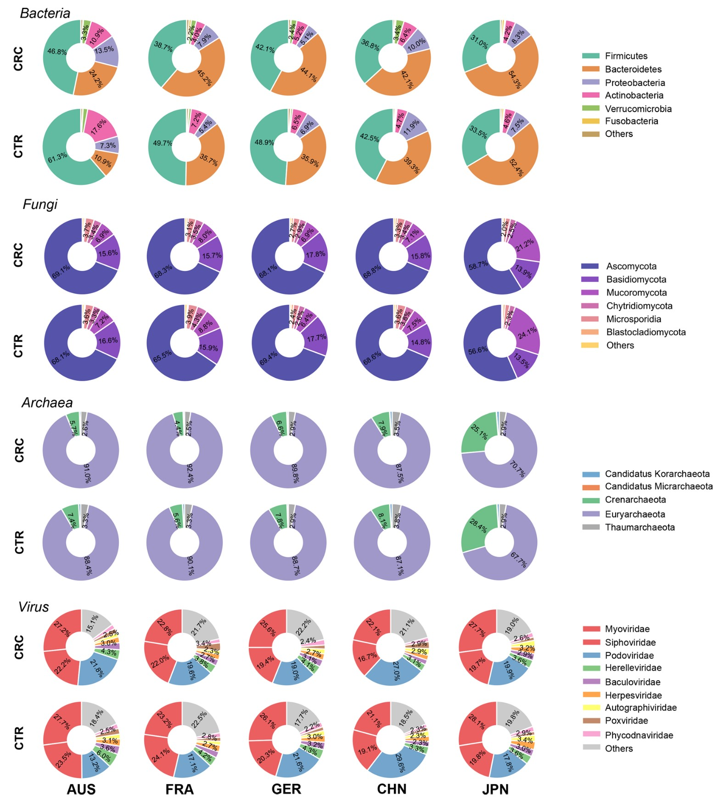

```{r setup, include=FALSE}
knitr::opts_chunk$set(
  collapse = T, echo=T, comment="#>", message=F, warning=F,
	fig.align="center", fig.width=5, fig.height=3, dpi=150)
```


The Microbiota Composition Pie scripts is referenced from MicrobiomeStatPlot [Inerst Reference below].

If you use this script, please cited 如果你使用本代码，请引用：

**Yong-Xin Liu**, Lei Chen, Tengfei Ma, Xiaofang Li, Maosheng Zheng, Xin Zhou, Liang Chen, Xubo Qian, Jiao Xi, Hongye Lu, Huiluo Cao, Xiaoya Ma, Bian Bian, Pengfan Zhang, Jiqiu Wu, Ren-You Gan, Baolei Jia, Linyang Sun, Zhicheng Ju, Yunyun Gao, **Tao Wen**, **Tong Chen**. 2023. EasyAmplicon: An easy-to-use, open-source, reproducible, and community-based pipeline for amplicon data analysis in microbiome research. **iMeta** 2(1): e83. https://doi.org/10.1002/imt2.83

The online version of this tuturial can be found in https://github.com/YongxinLiu/MicrobiomeStatPlot


**Authors**
First draft(初稿)：Defeng Bai(白德凤)；Proofreading(校对)：Ma Chuang(马闯) and Xun Jiani(荀佳妮)；Text tutorial(文字教程)：Defeng Bai(白德凤)


# Introduction简介

微生物组成饼图常常用来展示微生物不同层级的组成情况，在饼图上能够直观的看出每一类微生物的占比，同时用不同颜色区分不同的微生物类别，方便进行组间比较。


关键字：微生物组数据分析、MicrobiomeStatPlot、微生物组成饼图、R语言可视化

Keywords: Microbiome analysis, MicrobiomeStatPlot, Microbiota Composition Pie, R visulization


## Microbiota Composition Pie Example 微生物组成饼图应用案例

这是来自于上海交通大学医学院Lixin Zhu, Xingdong Chen, Guoqing Zhang, Ruixin Zhu和Hui Wang等2022年发表于Nature Microbiology的论文，论文题目为：Multi-kingdom microbiota analyses identify bacterial–fungal interactions and biomarkers of colorectal cancer across cohorts. https://doi.org/10.1038/s41564-021-01030-7

这是来自于上海交通大学医学院Lixin Zhu, Xingdong Chen, Guoqing Zhang, Ruixin Zhu和Hui Wang等2022年发表于Nature Microbiology的论文，论文题目为：Multi-kingdom microbiota analyses identify bacterial–fungal interactions and biomarkers of colorectal cancer across cohorts. https://doi.org/10.1038/s41564-021-01030-7


Extended Data Fig. 1 | overview of microbial composition in four kingdoms across populations. Microbial composition of four kingdoms in CRC and control (CTR) group, respectively. Composition of bacteria, fungi and archaea was shown at phylum level and composition of virus was shown at family level. Only the abundant phyla are shown in the pie chart and the rare family are summed into others.

扩展数据图 1 | 四个界在不同人群中的微生物组成概览。CRC 组和对照组 (CTR) 的四个界的微生物组成。细菌、真菌和古菌的组成以门级显示，病毒的组成以科级显示。饼图中仅显示丰富的门，稀有科则归入其他科。


**结果**

Regarding microbial composition, we found different microbial alterations across all four kingdoms for the CRC samples at the phylum level (Supplementary Discussion, Extended Data Fig. 1 and Supplementary Data 3).

关于微生物组成，我们发现在门水平上，CRC 样本中四个界的微生物发生了不同的改变（补充讨论、扩展数据图 1 和补充数据 3）。


## Packages installation软件包安装

```{r}
# 基于CRAN安装R包，检测没有则安装
p_list = c("dplyr", "ggalluvial", "ggplot2", "tidyverse", "tidyr", "reshape2",
           "tidyfst", "formattable","ggpubr")
for(p in p_list){if (!requireNamespace(p)){install.packages(p)}
    library(p, character.only = TRUE, quietly = TRUE, warn.conflicts = FALSE)}

# 加载R包 Load the package
suppressWarnings(suppressMessages(library(dplyr)))
suppressWarnings(suppressMessages(library(ggalluvial)))
suppressWarnings(suppressMessages(library(ggplot2)))
suppressWarnings(suppressMessages(library(tidyverse)))
suppressWarnings(suppressMessages(library(tidyr)))
suppressWarnings(suppressMessages(library(reshape2)))
suppressWarnings(suppressMessages(library(tidyfst)))
suppressWarnings(suppressMessages(library(formattable)))
suppressWarnings(suppressMessages(library(ggpubr)))
```


# 微生物组成饼图 Microbiota Composition Pie

## Microbiota Composition Pie using R software 微生物组成饼图R语言实战


```{r microbiota composition pie, include=TRUE}
# Load data
data_phylum <- read.table(file = "data/data_phylum.txt", sep = "\t", header = T, check.names = FALSE)

# sum of Phylum
df3_p <- data_phylum
design <- read.table(file = "data/metadata.txt", sep = "\t", header = T, row.names=1)
data_p<-aggregate(.~ Phylum,data=df3_p,sum)
rownames(data_p) = data_p$Phylum
data_p = data_p[, -1]

# Decreased sort by abundance
mean_sort = data_p[(order(-rowSums(data_p))), ]
mean_sort = as.data.frame(mean_sort)
mean_sort2 = t(mean_sort)
mean_sort2 = mean_sort2[order(-mean_sort2[,1]),]
mean_sort3 = t(mean_sort2)
mean_sort3 = apply(mean_sort3, 2, function(x) x/sum(x))
mean_sort3 = as.data.frame(mean_sort3)

# Filter Top 5, and other group into low abundance (relative abundance < 1%)
other = colSums(mean_sort3[6:dim(mean_sort3)[1], ])
mean_sort3 = mean_sort3[(6 - 1):1, ]
mean_sort3 = rbind(other,mean_sort3)
rownames(mean_sort3)[1] = c("others")
mean_sort3 = as.data.frame(mean_sort3)

# Percentage for each sample
sampFile = data.frame(sample = row.names(design), group = design$Group, row.names = row.names(design))
mean_sort3$tax = rownames(mean_sort3)
# Calculate average relative abundance for each group
mat_t = t(mean_sort3)
mat_t2 = merge(sampFile, mat_t, by = "row.names")
mat_t2 = mat_t2[,c(-1,-2)]
mat_t2 = as.data.frame(mat_t2)
mat_t2$group = as.factor(mat_t2$group)
mat_t3 = mat_t2[, -1]
mat_t3 = mutate_all(mat_t3, as.numeric)
mat_t3$group = mat_t2$group
mat_t3 = as.data.frame(mat_t3)

mat_mean2 = aggregate(.~group, data = mat_t3, FUN=function(x) mean(x))
mat_mean_final = do.call(rbind, mat_mean2)[-1,]
#geno = mat_mean2$group
#colnames(mat_mean_final) = geno
mean_sort=as.data.frame(mat_mean_final)

# data collation
mean_sort$tax = rownames(mean_sort)
mean_sort4 = as.data.frame(mean_sort)
mean_sort4$tax = mean_sort$tax
data_all22 = as.data.frame(melt(mean_sort4, id.vars=c("tax")))
data_all22 = data_all22[order(-data_all22$value), ]
data_all22 = data_all22[c(1:4, 6, 5),]

# 比例饼图绘制
# 转换为百分比
# Convert to percentage
data1 <- data_all22
data1$per <- percent(data1$value,0.1)
data1$group1 <- factor(data1$tax, levels = c("p__Ascomycota","p__Mucoromycota",
                                               "p__Basidiomycota","p__Microsporidia",
                                               "p__Blastocladiomycota","others"))
# 确定标签位置
# Determine label position
data1$ymax<-cumsum(data1$value)
data1$ymin<-c(0,head(data1$ymax,n=-1))
data1$labelposition<-(data1$ymax + data1$ymin)/2

# 绘制圆环图
# Draw a circular diagram
p1 <- ggplot(data1,aes(ymax=ymax,ymin=ymin,
                xmax=3,xmin=2))+
  geom_rect(aes(fill=group1), color = "white")+
  geom_text(x=2.5,aes(y=labelposition,label=paste0(group1,"\n(",per,")")),size=4, color = "black")+
  xlim(1,3)+
  coord_polar(theta="y")+
  theme_void()+
  scale_fill_manual(values = c("#fdae6b", "#a8ddb5","#ebffac","#fa9fb5","#41ae76","#ccece6"))
# p1
ggsave(filename = "results/microbiota_composition_pie1.pdf", plot = p1, width = 6, height = 4)


labs <- paste0(data1$tax, " (", data1$value*100, "%)")
# 圆饼图 
p2 <- ggpie(data1, "value",
      label = labs,
      #lab.pos = "in", 
      lab.font = "black",
      fill = "tax", 
      color = "white", 
      palette = c("#fdae6b", "#a8ddb5","#ebffac","#fa9fb5","#41ae76","#ccece6"))+
  theme_minimal()+
  theme(panel.grid = element_blank(), 
        panel.background = element_blank())+ 
  theme(axis.text.x = element_text(size = 8,angle = 0,colour = "black", hjust = 0.5),
        axis.text.y = element_text(size = 8,angle = 0,colour = "black", hjust = 0.5),
        axis.title = element_text(face="bold",size = 8),
        legend.title=element_text(size=12),
        plot.title = element_text(face="bold",size = 8,hjust = 0))+
labs(x = '', y = '', 
     fill = 'tax',
     legend.position = c(0.5,1))
# p2
ggsave(filename = "results/microbiota_composition_pie2.pdf", plot = p2, width = 6, height = 4)

# 圆心圈
p3 <- ggdonutchart(data1, "value", 
              label = labs,
              #lab.pos = "in", 
              lab.font = "black",
                fill = "tax", 
                 color = "white",
              palette = c("#fdae6b", "#a8ddb5","#ebffac","#fa9fb5","#41ae76","#ccece6")
                 )+
 theme_minimal()+
 theme(panel.grid = element_blank(), 
           panel.background = element_blank())+ 
   theme(axis.text.x = element_text(size = 8,angle = 0,colour = "black", hjust = 0.5),
       axis.text.y = element_text(size = 8,angle = 0,colour = "black", hjust = 0.5),
       axis.title = element_text(face="bold",size = 8),
       plot.title = element_text(face="bold",size = 8,hjust = 0))+
  labs(x = '', y = '', 
      fill = 'tax',
      legend.position = c(0.5,1))
#p3
ggsave(filename = "results/microbiota_composition_pie3.pdf", plot = p3, width = 6, height = 4)
```


# Combo plots排版

Combo plots to published-ready figure

组合多个子图为发表格式

```{r div_combo, fig.show='asis', fig.width=8, fig.height=7.5, dpi=72}
library(cowplot)
width = 89
height = 59
p0 = plot_grid(p1, p2, p3, labels = c("A", "B", "C"), ncol = 3)
ggsave("results/microbiota_composition_pie_combined.pdf", p0, width = width * 4, height = height * 2, units = "mm")
```


If used this script, please cited:
使用此脚本，请引用下文：

**Yong-Xin Liu**, Lei Chen, Tengfei Ma, Xiaofang Li, Maosheng Zheng, Xin Zhou, Liang Chen, Xubo Qian, Jiao Xi, Hongye Lu, Huiluo Cao, Xiaoya Ma, Bian Bian, Pengfan Zhang, Jiqiu Wu, Ren-You Gan, Baolei Jia, Linyang Sun, Zhicheng Ju, Yunyun Gao, **Tao Wen**, **Tong Chen**. 2023. EasyAmplicon: An easy-to-use, open-source, reproducible, and community-based pipeline for amplicon data analysis in microbiome research. **iMeta** 2: e83. https://doi.org/10.1002/imt2.83

Copyright 2016-2024 Defeng Bai <baidefeng@caas.cn>, Chuang Ma <22720765@stu.ahau.edu.cn>, Jiani Xun <15231572937@163.com>, Yong-Xin Liu <liuyongxin@caas.cn>
