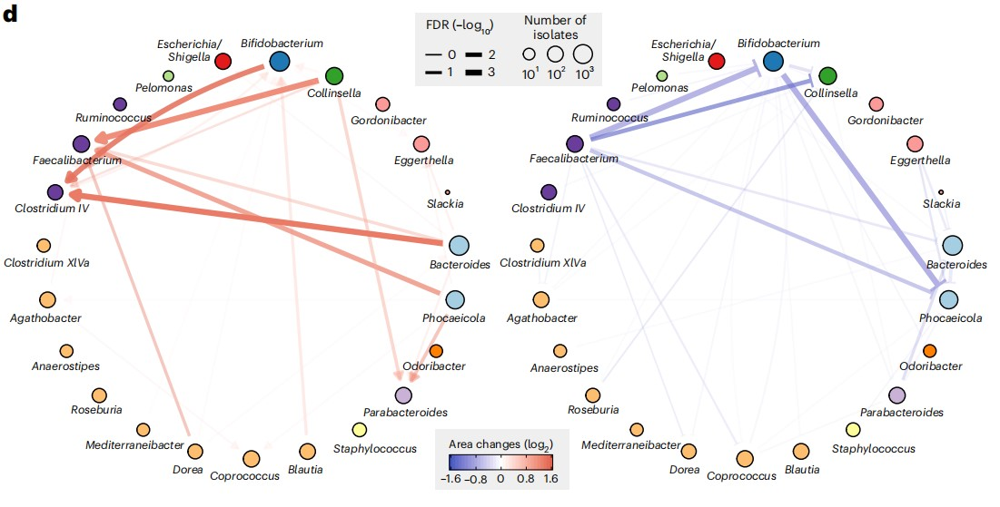
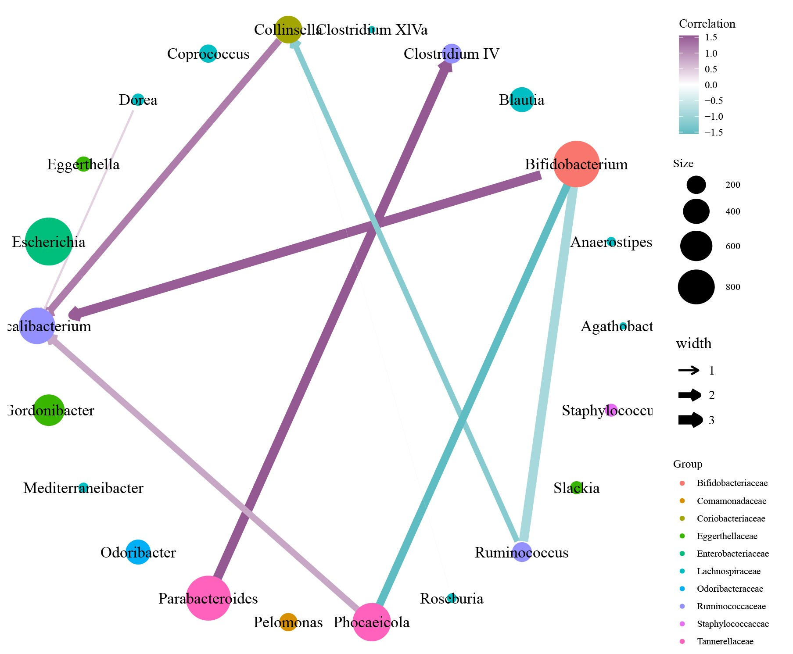

```{r setup, include=FALSE}
knitr::opts_chunk$set(
  collapse = T, echo=T, comment="#>", message=F, warning=F,
	fig.align="center", fig.width=5, fig.height=3, dpi=150)
```


The Microbiota Interaction Network scripts is referenced from MicrobiomeStatPlot [Inerst Reference below].

If you use this script, please cited 如果你使用本代码，请引用：

**Yong-Xin Liu**, Lei Chen, Tengfei Ma, Xiaofang Li, Maosheng Zheng, Xin Zhou, Liang Chen, Xubo Qian, Jiao Xi, Hongye Lu, Huiluo Cao, Xiaoya Ma, Bian Bian, Pengfan Zhang, Jiqiu Wu, Ren-You Gan, Baolei Jia, Linyang Sun, Zhicheng Ju, Yunyun Gao, **Tao Wen**, **Tong Chen**. 2023. EasyAmplicon: An easy-to-use, open-source, reproducible, and community-based pipeline for amplicon data analysis in microbiome research. **iMeta** 2(1): e83. https://doi.org/10.1002/imt2.83

The online version of this tuturial can be found in https://github.com/YongxinLiu/MicrobiomeStatPlot


**Authors**
First draft(初稿)：Defeng Bai(白德凤)；Proofreading(校对)：Ma Chuang(马闯) and Jiani Xun(荀佳妮)；Text tutorial(文字教程)：Defeng Bai(白德凤)


# Introduction简介

微生物之间常常存在正或负的相互作用，例如在研究微生物竞争或者互利关系时常会发现这种菌种之间的相互作用。利用网络图展示这种正负相互作用能够让我们直观的观察不同菌种之间相互作用的正负和强弱。

There are often positive or negative interactions between microorganisms. For example, when studying microbial competition or mutualism, such interactions between species are often found. Using network diagrams to display such positive and negative interactions allows us to intuitively observe the positive and negative and strength of interactions between different species.


关键字：微生物组数据分析、MicrobiomeStatPlot、微生物正负互作网络图、R语言可视化

Keywords: Microbiome analysis, MicrobiomeStatPlot, Microbiota Interaction Network , R visulization


## Microbiota Interaction Network example 微生物正负互作网络图案例

这是来自于哥伦比亚大学Harris H. Wang课题组2023年发表于Nature Biotechnology上的一篇论文用到的网络图。论文题目为：High-throughput microbial culturomics 
using automation and machine learning. https://doi.org/10.1038/s41587-023-01674-2

This is a network diagram used in a paper published in Nature Biotechnology in 2023 by Harris H. Wang's research group at Columbia University. The title of the paper is: High-throughput microbial culturomics using automation and machine learning. https://doi.org/10.1038/s41587-023-01674-2




Fig. 4 d, Pairwise growth promoting and inhibiting networks between genera. Directional growth-promoting effects are shown in red sharp arrows and directional growth-inhibiting effects are shown in blue blunt arrows. Nodes represent bacterial genera and are colored by family. Node sizes are proportional to the number of isolates used in this analysis and edges widths are proportional to the significance of the interactions.

图 4d，属间成对生长促进和抑制网络。定向生长促进效应以红色尖箭头表示，定向生长抑制效应以蓝色钝箭头表示。节点代表细菌属，并按科着色。节点大小与本分析中使用的分离株数量成正比，边宽与相互作用的显著性成正比。


**结果**
We next incorporated taxonomic information of nearby colonies and looked at how the colony size of a specific genus could be affected by other genera. Briefly, for each pair of genera, we compared the colony sizes of one genus with the other genus present in the neighborhood and without any colonies present (Methods). Remarkably, we identified isolates from two genera, Faecalibacteriumand Clostridium IV, that grow into larger sizes when the isolates were close to Bifidobacterium, Phocaeicola and Bacteroides (Fig. 4d). Faecalibacterium and Clostridium IV have been reported to be major butyrate-producing bacteria in the gut and could benefit from coculture growth with Bifidobacterium and Bacteroides species, which is consistent with our findings. On the other hand, we observed that 
Phocaeicola isolates are smaller with Faecalibacterium isolates as neighbors (Fig. 4d), indicating that the cogrowth interaction might be beneficial to only one side. Furthermore, consistent with our previous correlation analysis that examined neighboring isolate numbers without the consideration of neighbors’ identity, we observed that the growth of Phocaeicola and Bacteroides could be inhibited by multiple other genera, suggesting further investigations to better understand the underlying mechanism of these positive and negative interactions between gut microbiota. Together, our results highlight that CAMII can reveal colony cogrowth patterns governed by interspecies interactions, which may help identify growth-promoting microbes and their diffusible metabolites that stimulate in vitro growth of fastidious species.

接下来，我们整合了附近菌落的分类信息，并研究了特定属的菌落大小如何受到其他属的影响。简而言之，对于每对属，我们将一个属的菌落大小与附近存在且没有任何菌落的另一个属进行比较（方法）。值得注意的是，我们鉴定了两个属（Faecalibacterium 和 Clostridium IV）的分离物，当分离物靠近双歧杆菌、Phocaeicola和拟杆菌时，它们会长得更大（图 4d）。据报道，Faecalibacterium 和 Clostridium IV是肠道中主要的丁酸产生细菌，并且可以从与双歧杆菌和拟杆菌种共培养生长中受益，这与我们的发现一致。另一方面，我们观察到与 Faecalibacterium 分离株相邻时，Phocaeicola 分离株较小（图 4d），表明共生相互作用可能仅对一侧有益。此外，与我们之前检查相邻分离株数量而不考虑邻居身份的相关性分析一致，我们观察到 Phocaeicola 和 Bacteroides 的生长可能受到多种其他属的抑制，这表明需要进一步研究以更好地了解肠道微生物群之间这些正负相互作用的潜在机制。总之，我们的研究结果强调 CAMII可以揭示由种间相互作用控制的菌落共生模式，这可能有助于识别促进生长的微生物及其可扩散代谢物，这些代谢物可刺激难养物种的体外生长。


## Packages installation软件包安装

```{r}
# 基于CRAN安装R包，检测没有则安装 Installing R packages based on CRAN and installing them if they are not detected
p_list = c("tidyverse", "igraph",  "ggraph", "tidygraph", "reshape2", "ggplot2", 
           "psych")
for(p in p_list){if (!requireNamespace(p)){install.packages(p)}
    library(p, character.only = TRUE, quietly = TRUE, warn.conflicts = FALSE)}

# 加载R包 Loading R packages
suppressWarnings(suppressMessages(library(tidyverse)))
suppressWarnings(suppressMessages(library(igraph)))
suppressWarnings(suppressMessages(library(ggraph)))
suppressWarnings(suppressMessages(library(tidygraph)))
suppressWarnings(suppressMessages(library(reshape2)))
suppressWarnings(suppressMessages(library(ggplot2)))
suppressWarnings(suppressMessages(library(psych)))
```


# Microbiota Interaction Network 微生物正负互作网络图

## 微生物正负互作网络图R语言实战
Microbiota Interaction Network using R software

图形特点：
1.环状图；2.图点大小代表Number of isolates；3.颜色代表物种；4.连线颜色代表互斥或促进；5.连线颜色粗细代表面积改变的大小；6.连线的粗细代表菌种之间相互作用的强弱

```{r Microbiota Interaction Network, fig.show='asis', fig.width=4, fig.height=2.5}
# 导入数据
# Load data
nodes <- read.table(file = "data/nodes.txt", sep = "\t", header = T, check.names = FALSE)
edges <- read.table(file = "data/edges.txt", sep = "\t", header = T, check.names = FALSE)

net<-graph_from_data_frame(d=edges,vertices = nodes,directed = T)
# ggraph(net)+
#   geom_edge_link()+
#   geom_node_point()
# 
#net<-graph_from_data_frame(d=edges,vertices = nodes,directed = F)
# ggraph(net)+
#   geom_edge_link(aes(edge_width=width2,edge_color=color))+
#   geom_node_point(aes(size=Size,color=Group))+
#   geom_node_text(aes(label=Name))

pdf("results/network_group_circle8.pdf",family = "Times",width = 8,height = 6.5)
ggraph(net, layout = "circle")+
  geom_edge_link(aes(start_cap = label_rect(node1.name),
  end_cap = label_rect(node2.name),edge_width=width, edge_color=color),
 arrow = arrow(length = unit(2, 'mm')))+
  geom_node_point(aes(size=Size,color=Group))+
  geom_node_text(aes(label=Name))+
  scale_size_area(max_size = 15)+
  scale_edge_size_area(max_size = 0.2)+
  scale_edge_size(range = c(-1,1))+
  scale_edge_width(range = c(0,3))+
  scale_edge_color_gradient2(low = "#5ebcc2",mid="white",high = "#945893")+
  theme_minimal()+
  theme(panel.background = element_blank(),
    panel.grid = element_blank(),
    axis.text.x =element_blank(),
    axis.text.y = element_blank(),
    axis.title.x = element_blank(),
    axis.title.y = element_blank())
  #scale_edge_color_continuous(low = "#819bcf",high = "#ec8883")
dev.off()
```




If used this script, please cited:
使用此脚本，请引用下文：

**Yong-Xin Liu**, Lei Chen, Tengfei Ma, Xiaofang Li, Maosheng Zheng, Xin Zhou, Liang Chen, Xubo Qian, Jiao Xi, Hongye Lu, Huiluo Cao, Xiaoya Ma, Bian Bian, Pengfan Zhang, Jiqiu Wu, Ren-You Gan, Baolei Jia, Linyang Sun, Zhicheng Ju, Yunyun Gao, **Tao Wen**, **Tong Chen**. 2023. EasyAmplicon: An easy-to-use, open-source, reproducible, and community-based pipeline for amplicon data analysis in microbiome research. **iMeta** 2: e83. https://doi.org/10.1002/imt2.83

Copyright 2016-2024 Defeng Bai <baidefeng@caas.cn>, Chuang Ma <22720765@stu.ahau.edu.cn>, Jiani Xun <15231572937@163.com>, Yong-Xin Liu <liuyongxin@caas.cn>

