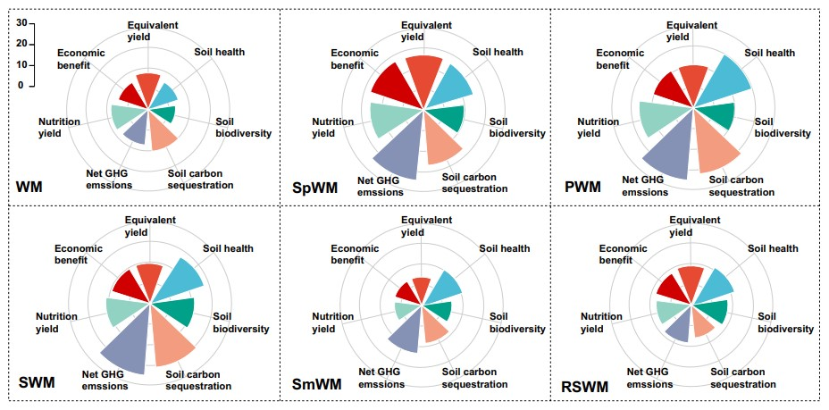
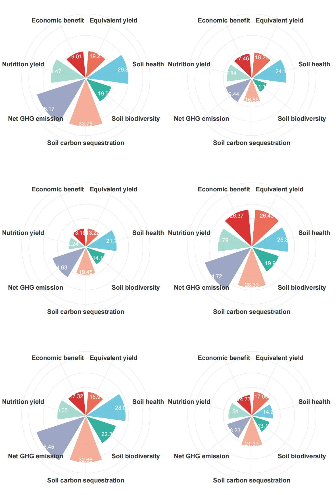

```{r setup, include=FALSE}
knitr::opts_chunk$set(
  collapse = T, echo=T, comment="#>", message=F, warning=F,
	fig.align="center", fig.width=5, fig.height=3, dpi=150)
```


The Nightingale Rose Chart scripts is referenced from MicrobiomeStatPlot [Inerst Reference below].

If you use this script, please cited 如果你使用本代码，请引用：

**Yong-Xin Liu**, Lei Chen, Tengfei Ma, Xiaofang Li, Maosheng Zheng, Xin Zhou, Liang Chen, Xubo Qian, Jiao Xi, Hongye Lu, Huiluo Cao, Xiaoya Ma, Bian Bian, Pengfan Zhang, Jiqiu Wu, Ren-You Gan, Baolei Jia, Linyang Sun, Zhicheng Ju, Yunyun Gao, **Tao Wen**, **Tong Chen**. 2023. EasyAmplicon: An easy-to-use, open-source, reproducible, and community-based pipeline for amplicon data analysis in microbiome research. **iMeta** 2(1): e83. https://doi.org/10.1002/imt2.83

The online version of this tuturial can be found in https://github.com/YongxinLiu/MicrobiomeStatPlot


**Authors**
First draft(初稿)：Defeng Bai(白德凤)；Proofreading(校对)：Ma Chuang(马闯) and Jiani Xun(荀佳妮)；Text tutorial(文字教程)：Defeng Bai(白德凤)


# Introduction简介

玫瑰花瓣图
Nightingale Rose Chart

参考：https://mp.weixin.qq.com/s/kxrZQ6b8w26cJTvhYrk3ag

玫瑰花瓣图(Nightingale Rose Chart)是一种像花瓣一样的环形柱状图，在极坐标中将平面根据组别划分为若干等角区域，再根据数据大小的不同进行填充，形成一片片花瓣，非常适用于不同组别间数据大小的比对。

The Nightingale Rose Chart is a petal-like annular bar chart. In polar coordinates, the plane is divided into several equiangular areas according to the groups, and then filled according to the different data sizes to form petals. It is very suitable for comparing the data sizes between different groups.


关键字：微生物组数据分析、MicrobiomeStatPlot、玫瑰花瓣图、R语言可视化

Keywords: Microbiome analysis, MicrobiomeStatPlot, Nightingale Rose Chart , R visulization


## Nightingale Rose Chart Example 玫瑰花瓣图案例

这是中国农业大学Yantai Gan课题组2024年发表于Nature Communications上的一篇文章，题目为：Diversifying crop rotation increases food
production, reduces net greenhouse gas emissions and improves soil health. https://doi.org/10.1038/s41467-023-44464-9

This is an article published in Nature Communications by Yantai Gan's research group at China Agricultural University in 2024. The title is: Diversifying crop rotation increases food production, reduces net greenhouse gas emissions and improves soil health. https://doi.org/10.1038/s41467-023-44464-9



Fig. 6 d, Nightingale Rose Charts of multiple objectives analysis to assess the detailed functions for each crop rotation
图6 d，多目标分析的南丁格尔玫瑰图，用于评估每种作物轮作的详细功能


**结果**：

We used the comprehensive evaluation index concept (CEI) to assess the synergies and trade-offs of the different crop rotations related to
yield, nutritional value, soil-related indicators (health, C sequestration, microbial biodiversity), net GHG emissions, and economic benefit
(Eqs. 11–20 in Methods) (Fig. 6a, d).

我们使用综合评价指数概念（CEI）来评估不同作物轮作在产量、营养价值、土壤相关指标（健康、碳封存、微生物生物多样性）、温室气体净排放和经济效益方面的协同作用和权衡（方法中的等式11–20）（图6a，d）。


## Packages installation软件包安装

```{r}
# 基于CRAN安装R包，检测没有则安装 Installing R packages based on CRAN and installing them if they are not detected
p_list = c("ggplot2", "tidyverse", "patchwork")
for(p in p_list){if (!requireNamespace(p)){install.packages(p)}
    library(p, character.only = TRUE, quietly = TRUE, warn.conflicts = FALSE)}

# 加载R包 Loading R packages
suppressWarnings(suppressMessages(library(ggplot2)))
suppressWarnings(suppressMessages(library(tidyverse)))
suppressWarnings(suppressMessages(library(patchwork)))
```


## Nightingale Rose Chart 玫瑰花瓣图

```{r Nightingale Rose Chart, include=TRUE}
# 读取数据
# Load the data
data <- read.csv('data/testdata.csv', header = TRUE, row.names = 1, check.names = FALSE)

# 数据转换
# Transform the data
data_long <- data %>%
  as_tibble(rownames = 'crop_rotation') %>%
  pivot_longer(cols = -crop_rotation, names_to = 'detailed_functions', values_to = 'values') %>%
  mutate(detailed_functions = factor(detailed_functions, levels = unique(detailed_functions)))

# 提取各组数据
# Extract data for each group
plot_data <- split(data_long, data_long$crop_rotation)

# 定义颜色调色板
# Define color palette
colors <- c('#e74a32', '#4cbcd6', '#00a188', '#f39c80', '#8592b5', '#92d2c3', '#d00000')

# 绘制极坐标柱状图函数
# Function to create polar bar plot
create_polar_plot <- function(df, colors) {
  ggplot(df, aes(x = detailed_functions, y = values, fill = detailed_functions)) +
    geom_col(width = 0.8, color = 'white', alpha = 0.8) +
    geom_text(aes(label = values), nudge_y = -2, color = 'white', size = 5) +
    scale_y_continuous(limits = c(0, 40)) +
    coord_polar(start = 0) +
    scale_fill_manual(values = colors) +
    theme_minimal() +
    theme(
      axis.title = element_blank(),
      axis.text.y = element_blank(),
      axis.text.x = element_text(size = 16, face = 'bold', color = '#333333'),
      legend.position = 'none',
      plot.margin = unit(c(1, 1, 1, 1), "cm")
    )
}

# 绘制所有组的图
# Create plots for all groups
plots <- lapply(plot_data, function(df) {
  create_polar_plot(df, colors)
})

# 组合图形并显示
# Combine and display plots
combined_plot <- wrap_plots(plots, ncol = 2) # Adjust ncol to control the number of columns in the layout
#combined_plot

# 保存图形到 PDF 文件
# Save the plot to a PDF file
ggsave("results/combined_plot.pdf", plot = combined_plot, width = 12, height = 18, units = "in", dpi = 300)
```





If used this script, please cited:
使用此脚本，请引用下文：

**Yong-Xin Liu**, Lei Chen, Tengfei Ma, Xiaofang Li, Maosheng Zheng, Xin Zhou, Liang Chen, Xubo Qian, Jiao Xi, Hongye Lu, Huiluo Cao, Xiaoya Ma, Bian Bian, Pengfan Zhang, Jiqiu Wu, Ren-You Gan, Baolei Jia, Linyang Sun, Zhicheng Ju, Yunyun Gao, **Tao Wen**, **Tong Chen**. 2023. EasyAmplicon: An easy-to-use, open-source, reproducible, and community-based pipeline for amplicon data analysis in microbiome research. **iMeta** 2: e83. https://doi.org/10.1002/imt2.83

Copyright 2016-2024 Defeng Bai <baidefeng@caas.cn>, Chuang Ma <22720765@stu.ahau.edu.cn>, Jiani Xun <15231572937@163.com>, Yong-Xin Liu <liuyongxin@caas.cn>

