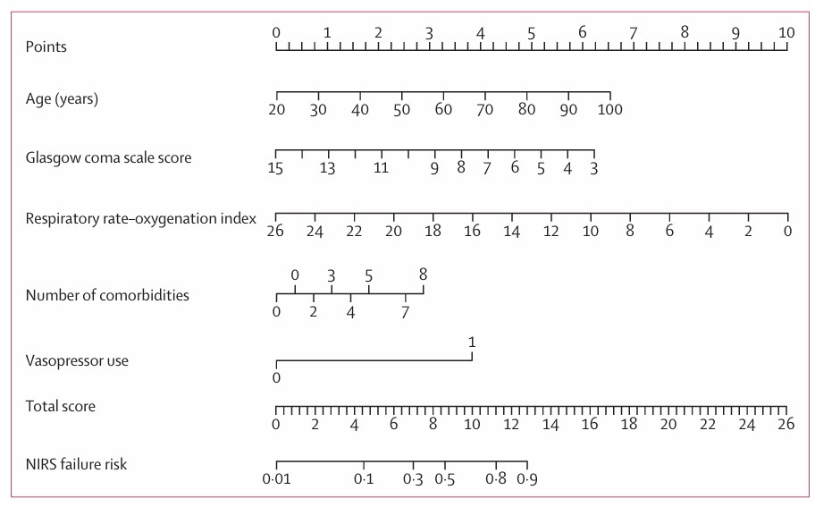
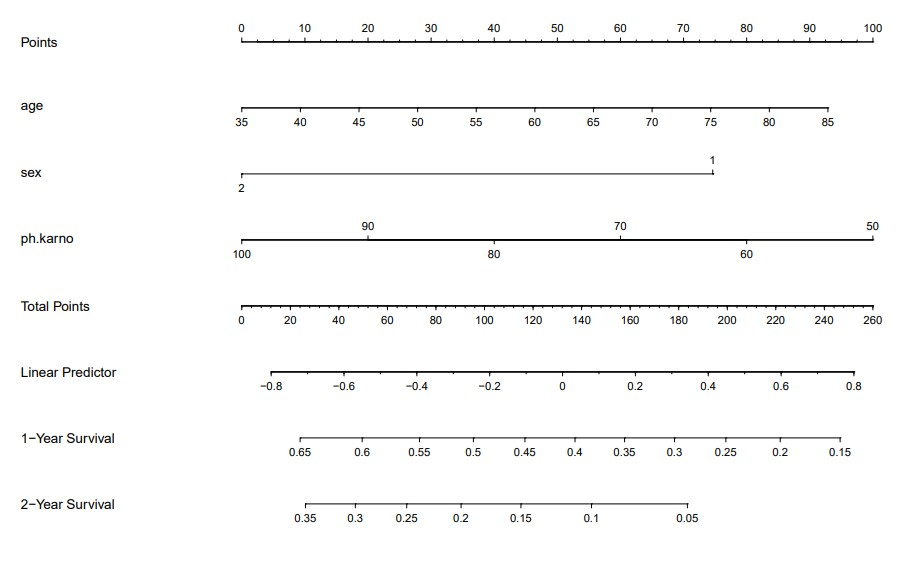

```{r setup, include=FALSE}
knitr::opts_chunk$set(
  collapse = T, echo=T, comment="#>", message=F, warning=F,
	fig.align="center", fig.width=5, fig.height=3, dpi=150)
```


The Nomogram scripts is referenced from MicrobiomeStatPlot [Inerst Reference below].

If you use this script, please cited 如果你使用本代码，请引用：

**Yong-Xin Liu**, Lei Chen, Tengfei Ma, Xiaofang Li, Maosheng Zheng, Xin Zhou, Liang Chen, Xubo Qian, Jiao Xi, Hongye Lu, Huiluo Cao, Xiaoya Ma, Bian Bian, Pengfan Zhang, Jiqiu Wu, Ren-You Gan, Baolei Jia, Linyang Sun, Zhicheng Ju, Yunyun Gao, **Tao Wen**, **Tong Chen**. 2023. EasyAmplicon: An easy-to-use, open-source, reproducible, and community-based pipeline for amplicon data analysis in microbiome research. **iMeta** 2(1): e83. https://doi.org/10.1002/imt2.83

The online version of this tuturial can be found in https://github.com/YongxinLiu/MicrobiomeStatPlot


**Authors**
First draft(初稿)：Defeng Bai(白德凤)；Proofreading(校对)：Ma Chuang(马闯) and Xun Jiani(荀佳妮)；Text tutorial(文字教程)：Defeng Bai(白德凤)


# Introduction简介

诺莫图 (Nomogram)又称为列线图(Alignment Diagram)，是建立在多因素回归分析的基础上的，主要用于多个预测指标整合到同一个平面上，以可视化地表达预测模型中各个变量之间的相互关系。通过使用带有刻度的线段，并按照一定的比例在同一坐标系上绘制这些线段，以直观地展示不同预测指标对结果的影响程度。通常我们需要先进行回归分析，获得多因素回归模型的结果，然后再使用列线图来呈现这些结果。

The nomogram, also known as the alignment diagram, is based on multi-factor regression analysis and is mainly used to integrate multiple prediction indicators into the same plane to visually express the relationship between the variables in the prediction model. By using scaled segments and drawing these segments on the same coordinate system in a certain proportion, the influence of different prediction indicators on the results can be intuitively displayed. Usually we need to perform regression analysis first to obtain the results of the multi-factor regression model, and then use the nomogram to present these results.

诺莫图的名称主要包括三类：
1.预测模型中的变量名称：例如年龄、高血压等等，每一个变量对应的线段上都标注了刻度，代表了该变量的可取值范围，而线段的长度则反映了该因素对结局时间的贡献大小。
2.得分，包括单项得分，即途中的point，表示每个变量在不同取值下的单项得分，以及总得分，即total point，表示所有变量去之后对应的单项分数加起来合计的总得分。
3.预测概率

The names of the nomograms mainly include three categories:
1. The names of the variables in the prediction model: such as age, hypertension, etc. The line segment corresponding to each variable is marked with a scale, representing the range of values of the variable, and the length of the line segment reflects the contribution of the factor to the outcome time.
2. Score, including single score, that is, the point in the middle, which represents the single score of each variable under different values, and the total score, that is, the total point, which represents the total score of the single score corresponding to all variables after all variables are removed.
3. Prediction probability


关键字：微生物组数据分析、MicrobiomeStatPlot、诺莫图、R语言可视化

Keywords: Microbiome analysis, MicrobiomeStatPlot, Nomogram, R visulization


## Nomogram Example 诺莫图案例



FIGURE 1 Instructions for Using the Nomogram
图 1 列线图使用

Draw a line perpendicular from the corresponding axis of each risk factor until it reaches the top line labeled “POINTS.” Sum up the number of points for all risk factors then draw a line descending from the axis labeled “TOTAL POINTS” until it intercepts each of the survival axes to determine 5-, 10-, and 15-year survival probabilities. For binary variables, 0 = no and 1 = yes. For CACS categories, 0 = none, 1 = 1 to 100,2 = 101 to 400, 3 = 401 to 1,000, and 4 = >1,000. CAD = coronary artery disease; CACS = coronary artery calcium score.

从每个风险因素的相应轴画一条垂直线，直到到达标有“POINTS”的顶部线。将所有风险因素的点数相加，然后从标有“TOTAL POINTS”的轴向下画一条线，直到它与每个生存轴相交，以确定 5 年、10 年和 15 年生存概率。对于二元变量，0 = 否，1 = 是。对于 CACS 类别，0 = 无，1 = 1 至 100，2 = 101 至 400，3 = 401 至 1,000，4 = >1,000。CAD = 冠状动脉疾病；CACS = 冠状动脉钙化积分。


**结果**

Table 3 reports the risk of death from all causes by quartiles of the PI. Those comprising the very high risk group (PI >96 total risk points) represented 57% and 58% of deaths in the derivation and validation sets, respectively. Incident deaths for the highest quartile in the derivation (17.28/1,000 person-years) and validation sets (11.71/1,000 person-years) were higher compared with lower quartiles. The highest quartiles were associated with a >10-fold (95% CI: 7.99 to 13.63; p < 0.001) and 15-fold (95% CI: 9.57 to 25.93; p < 0.001) increased risk of death in the derivation and validation sets, respectively, although the pointwise 95% CIs for the latter dataset were some what wider given the lower number of events observed. Based upon these findings, a nomogram was configured (Figure 1)

表 3 报告了按 PI 四分位数划分的全因死亡风险。极高风险组（PI >96 总风险点）分别占推导集和验证集中死亡人数的 57% 和 58%。推导集（17.28/1,000 人年）和验证集（11.71/1,000 人年）中最高四分位数的死亡率高于较低四分位数。最高四分位数分别与推导集和验证集中死亡风险增加 >10 倍（95% CI：7.99 至 13.63；p < 0.001）和 15 倍（95% CI：9.57 至 25.93；p < 0.001）相关，尽管后者数据集的逐点 95% CI 略宽，因为观察到的事件数量较少。根据这些发现，我们绘制了一个列线图（图 1）

Perhaps the most appealing aspect of our nomogram model is its clinical applicability and ease of use in a wide variety of health care systems. As an example, a female age 65 years who is a nonsmoker; is nonhypertensive, nondiabetic, and nondyslipidemic; has a family history of premature CAD; and has a CAC score of 90, will have a total risk score of 91 points, which corresponds to a 5-, 10-, and 15-year probability of survival of 95%, 92%, and 88% (Online Table 1, Figure 1). In contrast, a male age 73 years who is a current smoker; is hypertensive, nondiabetic, and nondyslipidemic; does not have a family history of premature CAD; and has a CAC score of 600, will have
a total risk score of 167 points, corresponding to a 5-, 10-, and 15-year probability of survival of 70%, 45%, and 25%, respectively (Figure 1).

我们的列线图模型最吸引人的方面可能是它的临床适用性和在各种医疗保健系统中的易用性。例如，一名 65 岁的女性，不吸烟；无高血压、无糖尿病、无血脂异常；有早发 CAD 家族史；CAC 评分为 90，则其总风险评分为 91 分，这对应 5 年、10 年和 15 年生存概率分别为 95%、92% 和 88%（在线表 1，图 1）。相比之下，一名 73 岁的男性，目前吸烟；有高血压、无糖尿病、无血脂异常；没有早发 CAD 家族史；且 CAC 评分为 600，则总风险评分为 167 分，对应 5 年、10 年和 15 年生存概率分别为 70%、45% 和 25%（图 1）。


## Packages installation软件包安装

```{r}
# 基于CRAN安装R包，检测没有则安装
p_list = c("survival", "rms", "grid", "gridExtra")
for(p in p_list){if (!requireNamespace(p)){install.packages(p)}
    library(p, character.only = TRUE, quietly = TRUE, warn.conflicts = FALSE)}

# 加载R包 Load the package
suppressWarnings(suppressMessages(library(survival)))
suppressWarnings(suppressMessages(library(rms)))
suppressWarnings(suppressMessages(library(grid)))
suppressWarnings(suppressMessages(library(gridExtra)))
```


# Nomogram 诺莫图

## Nomogram using R software 诺莫图R语言实战

参考：https://mp.weixin.qq.com/s/ZdTzE64fMnd_XeDukgDjqQ

```{r Nomogram, include=TRUE}
# Data preparation
data(lung)
dd <- datadist(lung)
options(datadist = "dd")

# Fit Cox proportional hazards model
f <- cph(Surv(time, status) ~ age + sex + ph.karno, data = lung, x = TRUE, y = TRUE, surv = TRUE)

# Define survival functions
survival <- Survival(f)
survival1 <- function(x) survival(365, x)
survival2 <- function(x) survival(730, x)

# Create nomogram
nom <- nomogram(f,
                 fun = list(survival1, survival2),
                 fun.at = c(0.05, seq(0.1, 0.9, by = 0.05), 0.95),
                 funlabel = c('1-Year Survival', '2-Year Survival'))

# Save the plot to a PDF file
pdf(file = "results/nomogram_plot.pdf", width = 12, height = 8, paper = "special")
# Draw nomogram using grid graphics
grid.newpage()  # Ensure a new page is created for plotting
print(plot(nom, 
           main = "Nomogram for 1-Year and 2-Year Survival Probability", 
           sub = "Cox Proportional Hazards Model", 
           cex.main = 1.5,  # Title size
           cex.sub = 1.2,   # Subtitle size
           cex.axis = 0.8,  # Axis label size
           cex.lab = 0.8), 
      newpage = FALSE)  # Ensure no new page is created

# Close the PDF device
dev.off()
```




If used this script, please cited:
使用此脚本，请引用下文：

**Yong-Xin Liu**, Lei Chen, Tengfei Ma, Xiaofang Li, Maosheng Zheng, Xin Zhou, Liang Chen, Xubo Qian, Jiao Xi, Hongye Lu, Huiluo Cao, Xiaoya Ma, Bian Bian, Pengfan Zhang, Jiqiu Wu, Ren-You Gan, Baolei Jia, Linyang Sun, Zhicheng Ju, Yunyun Gao, **Tao Wen**, **Tong Chen**. 2023. EasyAmplicon: An easy-to-use, open-source, reproducible, and community-based pipeline for amplicon data analysis in microbiome research. **iMeta** 2: e83. https://doi.org/10.1002/imt2.83

Copyright 2016-2024 Defeng Bai <baidefeng@caas.cn>, Chuang Ma <22720765@stu.ahau.edu.cn>, Jiani Xun <15231572937@163.com>, Yong-Xin Liu <liuyongxin@caas.cn>

