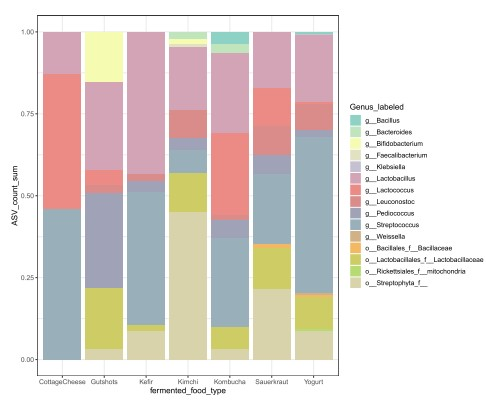
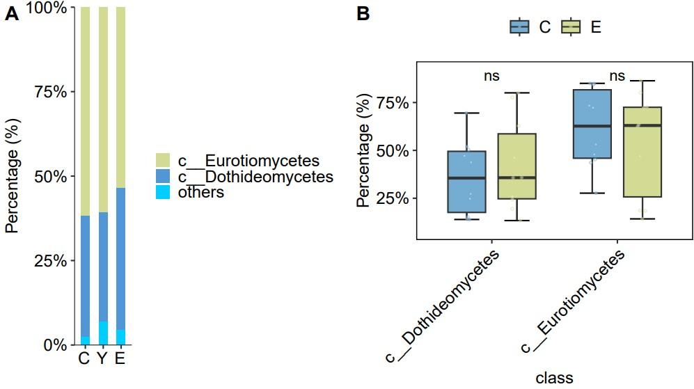

```{r setup, include=FALSE}
knitr::opts_chunk$set(
  collapse = T, echo=T, comment="#>", message=F, warning=F,
	fig.align="center", fig.width=5, fig.height=3, dpi=150)
```


The Overall composition comparision stack bar plot scripts is referenced from MicrobiomeStatPlot [Inerst Reference below].

If you use this script, please cited 如果你使用本代码，请引用：

**Yong-Xin Liu**, Lei Chen, Tengfei Ma, Xiaofang Li, Maosheng Zheng, Xin Zhou, Liang Chen, Xubo Qian, Jiao Xi, Hongye Lu, Huiluo Cao, Xiaoya Ma, Bian Bian, Pengfan Zhang, Jiqiu Wu, Ren-You Gan, Baolei Jia, Linyang Sun, Zhicheng Ju, Yunyun Gao, **Tao Wen**, **Tong Chen**. 2023. EasyAmplicon: An easy-to-use, open-source, reproducible, and community-based pipeline for amplicon data analysis in microbiome research. **iMeta** 2(1): e83. https://doi.org/10.1002/imt2.83

The online version of this tuturial can be found in https://github.com/YongxinLiu/MicrobiomeStatPlot


**Authors**
First draft(初稿)：Defeng Bai(白德凤)；Proofreading(校对)：Ma Chuang(马闯) and Jiani Xun(荀佳妮)；Text tutorial(文字教程)：Defeng Bai(白德凤)


# Introduction简介

在微生物组分析中，常进行组间物种不同分类级别组成比较，同时每个组内又有多个样本，为了比较分组之间的整体微生物组成变化，会将分组内的所有样本的微生物相对丰度求平均值，用堆叠柱状图进行展示，这样能够从整体上观察组间微生物组成变化。进一步可以用统计检验(比如wilcox检验)检验组间差异是否显著。

In microbiome analysis, the composition of species at different taxonomic levels is often compared between groups. At the same time, there are multiple samples in each group. In order to compare the changes in the overall microbial composition between groups, the relative abundance of microorganisms in all samples within the group is compared. Calculate the average value and display it as a stacked histogram, so that you can observe the changes in microbial composition between groups as a whole. Further, statistical tests (such as Wilcox test) can be used to test whether the differences between groups are significant.


关键字：微生物组数据分析、MicrobiomeStatPlot、物种组成整体比较堆叠柱状图、R语言可视化

Keywords: Microbiome analysis, MicrobiomeStatPlot, Overall composition comparision stack bar plot , R visulization


## Overall composition comparision stack bar plot example 物种组成整体比较堆叠柱状图案例

这是斯坦福医学院Justin L. Sonnenburg团队2021年发表于Cell上的一篇论文用到的堆叠柱状图进行组间微生物组间比较。论文题目为：Gut-microbiota-targeted diets modulate human immune status. https://doi.org/10.1016/j.cell.2021.06.019

This is a stacked bar chart used in a paper published in Cell in 2021 by Justin L. Sonnenburg's team at Stanford School of Medicine to compare microbiota between groups. The title of the paper is: Gut-microbiota-targeted diets modulate human immune status. https://doi.org/10.1016/j.cell.2021.06.019



Figure S5. 16S ASV analysis of fermented foods. ASVs with fewer than 250 counts were filtered out and counts binning to the same genus were summed. If genus was unassigned, ASVs were summed based on the same order and family.

图 S5 发酵食品的 16S ASV 分析。计数少于 250 的 ASV 被过滤掉，并将归入同一属的计数相加。如果未指定属，则根据同一目和科对 ASV 进行求和。


**结果**

An important consideration was whether the new taxa detected were microbes directly sourced from the fermented foods. Taxa present in the commonly consumed fermented foods in the study were identified through 16S rRNA amplicon sequencing (Figure S5) and compared with those newly observed in the participants’ microbiota during the intervention. Only a small percentage of the new microbiota ASVs were common with those found in fermented foods.

一个重要的考虑因素是检测到的新分类群是否直接来自发酵食品的微生物。通过16S rRNA 扩增子测序（图S5）识别了研究中常吃的发酵食品中存在的分类群，并与干预期间参与者微生物群中新观察到的分类群进行了比较。只有一小部分新微生物群 ASV 与发酵食品中发现的 ASV 相同。


## Packages installation软件包安装

```{r}
# 基于CRAN安装R包，检测没有则安装 Installing R packages based on CRAN and installing them if they are not detected
p_list = c("ggplot2", "reshape2", "ggprism", "dplyr", "dplyr", "plyr", "ggalluvial"
           , "tidyverse", "tidyr", "ggpubr")
for(p in p_list){if (!requireNamespace(p)){install.packages(p)}
    library(p, character.only = TRUE, quietly = TRUE, warn.conflicts = FALSE)}

# 加载R包 Loading R packages
suppressWarnings(suppressMessages(library(ggplot2)))
suppressWarnings(suppressMessages(library(reshape2)))
suppressWarnings(suppressMessages(library(ggprism)))
suppressWarnings(suppressMessages(library(ggalluvial)))
suppressWarnings(suppressMessages(library(dplyr)))
suppressWarnings(suppressMessages(library(plyr)))
suppressWarnings(suppressMessages(library(tidyverse)))
suppressWarnings(suppressMessages(library(tidyr)))
suppressWarnings(suppressMessages(library(ggpubr)))
```


# Overall composition comparision stack bar plot 物种组成整体比较堆叠柱状图

将每组多样本进行整合求平均，并计算分组之间的分类级别差异

### Group average stackplot at class level

```{r Overall composition stacked bar plot, fig.show='asis', fig.width=4, fig.height=2.5}
# Load data
# 导入数据
# 分类数据(Taxonomy)
data_taxonomy <- read.table(file = "data/taxonomy.txt", sep = "\t", header = T, check.names = FALSE)
data_taxonomy2 <- data_taxonomy %>% distinct(data_taxonomy$Species, .keep_all = TRUE)

# 物种丰度数据
# Species abundance data
data_species <- read.table(file = "data/Species_count_data.txt", sep = "\t", header = T, check.names = FALSE)

# 确保物种不重复
# Non-duplicates species
data_species <- aggregate(.~ Species, data = data_species, sum)
rownames(data_species) = data_species$Species
data_species2 <- merge(data_taxonomy2, data_species, by = "Species")
data_class <- data_species2[, c(5, 10:39)]

# sum of Class
df3_p <- data_class
design <- read.table(file = "data/metadata.txt", sep = "\t", header = T, row.names=1)
data_p<-aggregate(.~ Class,data=df3_p,sum)
rownames(data_p) = data_p$Class
data_p = data_p[, -1]

# Decreased sort by abundance
# 按丰富程度下降排序
mean_sort = data_p[(order(-rowSums(data_p))), ]
mean_sort = as.data.frame(mean_sort)
mean_sort2 = t(mean_sort)
mean_sort2 = mean_sort2[order(-mean_sort2[,1]),]
mean_sort3 = t(mean_sort2)
mean_sort3 = apply(mean_sort3, 2, function(x) x/sum(x))
mean_sort3 = as.data.frame(mean_sort3)

# Filter Top 2, and other group into low abundance (relative abundance < 1%)
# 过滤前 2 个，其他组归为低丰度组（相对丰度 < 1%）
other = colSums(mean_sort3[3:dim(mean_sort3)[1], ])
mean_sort3 = mean_sort3[(3 - 1):1, ]
mean_sort3 = rbind(other,mean_sort3)
rownames(mean_sort3)[1] = c("others")
mean_sort3 = as.data.frame(mean_sort3)

# Stackplot for each sample
sampFile = data.frame(sample = row.names(design), group = design$Group, row.names = row.names(design))
mean_sort3$tax = rownames(mean_sort3)
# Calculate average relative abundance for each group
mat_t = t(mean_sort3)
mat_t2 = merge(sampFile, mat_t, by = "row.names")
mat_t2 = mat_t2[,c(-1,-2)]
mat_t2 = as.data.frame(mat_t2)
mat_t2$group = as.factor(mat_t2$group)
mat_t3 = mat_t2[, -1]
mat_t3 = mutate_all(mat_t3, as.numeric)
mat_t3$group = mat_t2$group
mat_t3 = as.data.frame(mat_t3)

mat_mean2 = aggregate(.~group, data = mat_t3, FUN=function(x) mean(x))
mat_mean_final = do.call(rbind, mat_mean2)[-1,]
geno = mat_mean2$group
colnames(mat_mean_final) = geno
mean_sort=as.data.frame(mat_mean_final)

# data collation
# 数据整理
mean_sort$tax = rownames(mean_sort)
mean_sort4 = as.data.frame(mean_sort)
mean_sort4$tax = mean_sort$tax
data_all22 = as.data.frame(melt(mean_sort4, id.vars=c("tax")))
data_all22 = data_all22[order(-data_all22$value), ]

mytheme = theme_bw() + theme(text = element_text(family = "sans", size = 6))+
  theme(#legend.position="none",
    legend.text = element_text(size=12),
    legend.title = element_blank(), 
    panel.background = element_blank(),
    panel.grid = element_blank(),
    axis.text.y = element_text(size=12, colour="black", family = "sans", angle = 0), 
    axis.text.x = element_text(size=12, colour="black", family = "sans", angle = 0, hjust = 0),
    axis.title= element_text(size=12),
    strip.text.x = element_text(size=12, angle = 0),
    strip.text.y = element_text(size=12, angle = 0),
    plot.title = element_text(size=12, angle = 0),
    strip.background.x = element_rect(fill = "#E5E4E2", colour = "black", size = 0.2))+
      theme(axis.text.x=element_text(angle=0,vjust=1, hjust=0.6))+
  theme(axis.line = element_line(size = 0.1, colour = "black"))

# Plot
# 绘图
p_class01 = ggplot(data_all22, aes(x=factor(variable, levels = unique(variable)), y = value, fill = factor(tax, levels = unique(tax)),
                           stratum = factor(tax, levels = unique(tax)), alluvium = factor(tax, levels = unique(tax)))) +
  geom_bar(stat = "identity", position = "fill", width=0.2)+
  scale_y_continuous(labels = scales::percent, expand = c(0,0)) +
  coord_cartesian(ylim = c(0,1))+
  xlab("")+
  ylab("Percentage (%)")+ theme_classic()+
  guides(fill=guide_legend(title="class"))+
  theme(legend.key.size = unit(0.4, "cm"))+
  theme(text = element_text(family = "sans", size = 8))+
  theme(#legend.position="none",
    legend.text = element_text(size=12),
    legend.title = element_blank(), 
    panel.background = element_blank(),
    panel.grid = element_blank(),
    axis.text.y = element_text(size=12, colour="black", family = "sans", angle = 0), 
    axis.text.x = element_text(size=12, colour="black", family = "sans", angle = 0, hjust = 0),
    axis.title= element_text(size=12),
    strip.text.x = element_text(size=12, angle = 0),
    strip.text.y = element_text(size=12, angle = 0),
    plot.title = element_text(size=12, angle = 0),
    strip.background.x = element_rect(fill = "#E5E4E2", colour = "black", size = 0.2))+
      theme(axis.text.x=element_text(angle=0,vjust=1, hjust=0.6))+
  theme(axis.line = element_line(size = 0.1, colour = "black"))+
  scale_fill_manual(values = c("#d2da93","#5196d5","#00ceff","#ff630d","#35978b",
                  "#e5acd7","#77aecd","#ec8181","#dfc6a5","#e50719",
                  "#d27e43","#8a4984","#fe5094","#8d342e","#f94e54",
                  "#ffad00","#36999d","#00fc8d","#b64aa0","#9b82e1"))+
  scale_color_manual(values = c("#d2da93","#5196d5","#00ceff","#ff630d","#35978b",
                  "#e5acd7","#77aecd","#ec8181","#dfc6a5","#e50719",
                  "#d27e43","#8a4984","#fe5094","#8d342e","#f94e54",
                  "#ffad00","#36999d","#00fc8d","#b64aa0","#9b82e1"))+
  geom_col(width = 0.5, color=NA)
ggsave(paste("results/Figure_class_stack01",".pdf", sep=""), p_class01, width=79 * 1.5, height=69 * 1.5, unit='mm')
#p_class01

# Comparison of Microbial Differences under Classification Levels in Box plots
# 箱线图中不同分类水平下的微生物差异比较
data_p2 <- data_p
# Decreasing order by relative abundance
# 按相对丰度降序排列
mean_sort = data_p2[(order(-rowSums(data_p2))), ]
mean_sort = as.data.frame(mean_sort)
mean_sort2 = t(mean_sort)
mean_sort2 = mean_sort2[order(-mean_sort2[,1]),]
mean_sort3 = t(mean_sort2)
mean_sort3 = apply(mean_sort3, 2, function(x) x/sum(x))
mean_sort3 = as.data.frame(mean_sort3)

# Filter Top 2, and other group into low abundance (<1%)
# 过滤前2，其他组为低丰度组（<1%）
mean_sort3 = mean_sort3[(3 - 1):1, ]
mean_sort3 = t(mean_sort3)
mean_sort3 = as.data.frame(mean_sort3)
mean_sort3$group = rownames(mean_sort3)
mean_sort3$group = gsub("[0-9]","", mean_sort3$group)

# C vs E
mean_sort3$group <- as.factor(mean_sort3$group)
mean_sort3 <- as.data.frame(mean_sort3)
mean_sort3 <- mean_sort3[mean_sort3$group %in% c("C", "E"), ]

colnames(mean_sort3)

# wilcox test
diff_class <- mean_sort3 %>%
    select_if(is.numeric) %>%
    map_df(~ broom::tidy(wilcox.test(. ~ group,data = mean_sort3, conf.int = TRUE)), .id = 'var')
write.csv(diff_class, "results/class_selected_wilcox_test01.csv")

#melt data from wide to long
data_long_m<-melt(mean_sort3, id.vars = c("group"), 
                  measure.vars = c('c__Dothideomycetes','c__Eurotiomycetes'),
                  variable.name = c('class'),
                  value.name = 'value')

# Boxplot，Default significance test method was Wilcoxon Rank Sum and Signed Rank Tests
p_class02_CE <- ggplot(data_long_m,aes(x=class,y=value,fill=group))+
  stat_boxplot(geom = "errorbar",width=0.4,position=position_dodge(0.8))+
  geom_boxplot(width=0.6,alpha=1,position=position_dodge(0.8), outlier.shape = NA)+mytheme+
  theme(legend.position = "top")+
  stat_compare_means(aes(group=group), method = "wilcox.test",label="p.signif")+
  labs(x = "class", y = "Percentage (%)")+
  scale_y_continuous(labels = scales::percent, expand = c(0,0.1))+
  geom_jitter(aes(color=group),
              shape=21, size=0.6,alpha=0.5, 
              fill="transparent",
              position =  position_jitterdodge(jitter.width = 0.2, dodge.width = 0.8)
              )+
  scale_fill_manual(values = c("#74add1","#d2da93"))+
  scale_color_manual(values = c("#74add1","#d2da93"))+
  theme(axis.text.x = element_text(angle = 45, vjust = 1, hjust = 1))
ggsave(paste("results/Wilcox_class_CE",".pdf", sep=""), p_class02_CE, width=109 * 1.5, height=89 * 1.5, unit='mm')
#p_class02_CE

## C vs Y 与上相同
## E vs Y 与上相同

# 组合图
# Combined
library(cowplot)
width = 89
height = 59
p0 = plot_grid(p_class01, p_class02_CE, labels = c("A", "B"), ncol = 2)
ggsave("results/Overall_composition_comparision_stack_bar_plot.pdf", p0, width = width * 2, height = height * 1.7, units = "mm")
```





If used this script, please cited:
使用此脚本，请引用下文：

**Yong-Xin Liu**, Lei Chen, Tengfei Ma, Xiaofang Li, Maosheng Zheng, Xin Zhou, Liang Chen, Xubo Qian, Jiao Xi, Hongye Lu, Huiluo Cao, Xiaoya Ma, Bian Bian, Pengfan Zhang, Jiqiu Wu, Ren-You Gan, Baolei Jia, Linyang Sun, Zhicheng Ju, Yunyun Gao, **Tao Wen**, **Tong Chen**. 2023. EasyAmplicon: An easy-to-use, open-source, reproducible, and community-based pipeline for amplicon data analysis in microbiome research. **iMeta** 2: e83. https://doi.org/10.1002/imt2.83

Copyright 2016-2024 Defeng Bai <baidefeng@caas.cn>, Chuang Ma <22720765@stu.ahau.edu.cn>, Jiani Xun <15231572937@163.com>, Yong-Xin Liu <liuyongxin@caas.cn>

