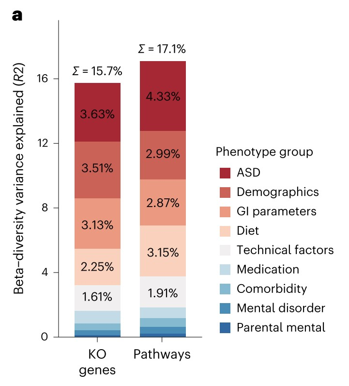
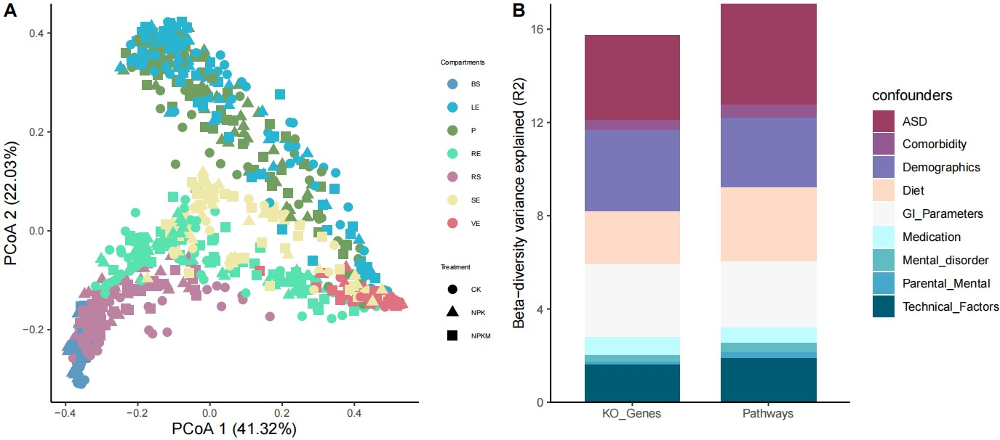

```{r setup, include=FALSE}
knitr::opts_chunk$set(
  collapse = T, echo=T, comment="#>", message=F, warning=F,
	fig.align="center", fig.width=5, fig.height=3, dpi=150)
```


The PERMANOVA scripts is referenced from MicrobiomeStatPlot [Inerst Reference below].

If you use this script, please cited 如果你使用本代码，请引用：

**Yong-Xin Liu**, Lei Chen, Tengfei Ma, Xiaofang Li, Maosheng Zheng, Xin Zhou, Liang Chen, Xubo Qian, Jiao Xi, Hongye Lu, Huiluo Cao, Xiaoya Ma, Bian Bian, Pengfan Zhang, Jiqiu Wu, Ren-You Gan, Baolei Jia, Linyang Sun, Zhicheng Ju, Yunyun Gao, **Tao Wen**, **Tong Chen**. 2023. EasyAmplicon: An easy-to-use, open-source, reproducible, and community-based pipeline for amplicon data analysis in microbiome research. **iMeta** 2(1): e83. https://doi.org/10.1002/imt2.83

The online version of this tuturial can be found in https://github.com/YongxinLiu/MicrobiomeStatPlot


**Authors**
First draft(初稿)：Defeng Bai(白德凤)；Proofreading(校对)：Ma Chuang(马闯) and Jiani Xun(荀佳妮)；Text tutorial(文字教程)：Defeng Bai(白德凤)


# Introduction简介

什么是置换多元方差分析?
What is PERMANOVA？

置换多元方差分析（PERMANOVA，Permutational Multivariate Analysis of Variance）是一种非参数统计方法，常用于比较多组样本的多元数据集，特别是用于生态学、微生物学等领域中的群落组成差异分析。PERMANOVA的基本原理是通过置换测试来评估不同组之间的差异。与传统的方差分析（ANOVA）不同，PERMANOVA不依赖于数据的正态性或方差齐性假设，因此更适合处理高维度或复杂结构的生态数据。

Permutational Multivariate Analysis of Variance (PERMANOVA) is a nonparametric statistical method that is often used to compare multivariate data sets of multiple groups of samples, especially for the analysis of community composition differences in fields such as ecology and microbiology. The basic principle of PERMANOVA is to evaluate the differences between different groups through permutation tests. Unlike traditional analysis of variance (ANOVA), PERMANOVA does not rely on the normality or homogeneity of variance assumptions of the data, so it is more suitable for processing ecological data with high dimensions or complex structures.

PERMANOVA分析的步骤包括：1.聚类矩阵的计算，首先计算样本之间的距离矩阵，常用的距离度量包括 Bray-Curtis、欧氏距离、Jaccard 距离等。2.分组差异计算，基于不同的分组（例如处理组和对照组），通过置换数据来计算各组之间的差异。3.置换检验，将原始组别标签进行多次随机置换，重新计算每次置换后的组间差异。最后，通过比较原始差异与置换生成的差异分布，来估计组间差异是否显著。4.P值计算，通过置换生成的差异分布来计算 P 值，用于检验组间差异的显著性。

The steps of PERMANOVA analysis include: 1. Calculation of clustering matrix. First, calculate the distance matrix between samples. Commonly used distance measures include Bray-Curtis, Euclidean distance, Jaccard distance, etc. 2. Group difference calculation, based on different groups (such as treatment group and control group), calculate the difference between each group by replacing the data. 3. Permutation test, perform multiple random permutations of the original group labels, and recalculate the difference between groups after each permutation. Finally, we estimate whether differences between groups are significant by comparing the original differences with the distribution of differences generated by permutation. 4. P value calculation, calculate the P value through the difference distribution generated by permutation, which is used to test the significance of the difference between groups.


关键字：微生物组数据分析、MicrobiomeStatPlot、置换多元方差分析、R语言可视化

Keywords: Microbiome analysis, MicrobiomeStatPlot, PERMANOVA , R visulization


## PERMANOVA example 置换多元方差分析案例


Fig. 2 a, Variance in microbiome function (microbial pathways and genes) explained by phenotype groups in multivariate PERMANOVA analysis.

图 2a，多元 PERMANOVA分析中表型组解释的微生物组功能（微生物途径和基因）的差异。


**结果**

At functional level, host phenotype factors explained 17.1% and 15.7% of the variation in microbiome pathways and microbial genes, respectively (Fig. 2a). A diagnosis of ASD ranked as the top factor accounting for the variation in both microbiome pathways and microbial genes (Fig. 2a).

在功能层面，宿主表型因素分别解释了 17.1% 和 15.7% 的微生物组途径和微生物基因变异（图 2a）。ASD 诊断是解释微生物组途径和微生物基因变异的首要因素（图 2a）。


## Packages installation软件包安装

```{r}
# 基于CRAN安装R包，检测没有则安装 Installing R packages based on CRAN and installing them if they are not detected
p_list = c("ggplot2", "vegan", "ggforce", "plyr", "microeco", "tidyverse",
           "ape","phyloseq","GUniFrac","reshape2" )
for(p in p_list){if (!requireNamespace(p)){install.packages(p)}
    library(p, character.only = TRUE, quietly = TRUE, warn.conflicts = FALSE)}

# 加载R包 Loading R packages
suppressWarnings(suppressMessages(library(ggplot2)))
suppressWarnings(suppressMessages(library(vegan)))
suppressWarnings(suppressMessages(library(ggforce)))
suppressWarnings(suppressMessages(library(plyr)))
suppressWarnings(suppressMessages(library(microeco)))
suppressWarnings(suppressMessages(library(tidyverse)))
suppressWarnings(suppressMessages(library(ape)))
suppressWarnings(suppressMessages(library(phyloseq)))
suppressWarnings(suppressMessages(library(GUniFrac)))
suppressWarnings(suppressMessages(library(reshape2)))
```


# PERMANOVA 置换多元方差分析

## 距离指数的计算

在微生物群落分析中，常用的距离指数有很多，这里介绍两种最常用的距离指数Bray-Curtis距离指数和UniFrac距离指数的计算。

Bray-Curtis距离计算

Bray-Curtis距离指数在计算时考虑了微生物物种德有无，也考虑了微生物物种的丰度大小。Bray-Curtis距离的取值范围为0-1，0表示两个群落的物种类型和丰度完全一致，1表示两个群落不共享任何物种。

```{r Bray_Curtis, fig.show='asis', fig.width=4, fig.height=2.5}
# 导入数据
# Load data
sample_info_16S <- read.csv("data/sample_info_16S.csv", header = TRUE, stringsAsFactors = FALSE, row.names = 1)
otu_table_16S <- read.csv("data/otu_table_16S.csv", header = TRUE, stringsAsFactors = FALSE, row.names = 1)

# 计算Bray-Curtis距离
# Calculate Bray-Curtis distance
distance_bray <- vegdist(t(otu_table_16S), method="bray",diag=T, upper=T)
class(distance_bray)

# dist转换成matirx
# As matrix
distance_bray_matrix <- as.matrix(distance_bray)
dim(distance_bray_matrix)

# matrix转换成dataframe
# As dataframe
distance_bray_frame <- as.data.frame(distance_bray_matrix)
dim(distance_bray_frame)

# 保存
# Save
write.table(distance_bray_frame,"results/bray_curtis_distance.txt",sep = "\t")
```


UniFrac距离计算

UniFrac距离指数主要用于比较微生物群落，UniFrac距离的计算同时考虑了微生物物种的丰度和物种间的进化距离，其主要包括加权UniFrac(考虑存在与否和丰度)和非加权UniFrac(仅考虑存在与否)。UniFrac距离主要是进一步考虑了微生物物种间的系统发育关系，通过进化关系来评估样本的相似性，更好的反映微生物群落的相同和不同。

```{r UniFrac, fig.show='asis', fig.width=4, fig.height=2.5}
# 读入数据
# Load data
otu = read.table('data/otutab.txt', row.names = 1, header = T) 
otu = as.data.frame(otu)

# 读入进化树文件
# Load tree file
tree = read.tree('data/otus.tree')

# 构建phyloseq对象
# Construct phyloseq
physeq = phyloseq(otu_table(otu, taxa_are_rows = T), phy_tree(tree))

# 计算加权 Unifrac 距离
# Calculate weighted-UniFrac
wei_unif_dis = distance(physeq, method = 'wunifrac')
wei_unif_dis = as.matrix(wei_unif_dis)
write.table(wei_unif_dis,"results/W.unifrac.txt",sep = "\t")

# 计算非加权 Unifrac 距离
# Calculate Unweighted-UniFrac
unwei_unif_dis = distance(physeq, method = 'unifrac')
unwei_unif_dis = as.matrix(unwei_unif_dis)
write.table(unwei_unif_dis,"results/U.unifrac.txt",sep = "\t")
```


## PERMANOVA 置换多元方差分析

参考文献：A highly conserved core bacterial microbiota with nitrogen-fixation capacity inhabits the xylem sap in maize plants. https://doi.org/10.1038/s41467-022-31113-w

```{r PERMANOVA, fig.show='asis', fig.width=4, fig.height=2.5}
# 载入metadata和距离指数
# Load metadata and distance matrix
sub_design = read.table("data/metadata.txt", header=T, row.names=1, sep="\t")

# distance matrix
m = "data/weighted_unifrac"
# m = "unweighted_unifrac"
# m = "bray_curtis"
beta = read.table(paste(m,".txt",sep=""), header=T, row.names=1, sep="\t", comment.char="")
idx = rownames(sub_design) %in% rownames(beta)
sub_design = sub_design[idx,]
sub_beta = beta[rownames(sub_design),rownames(sub_design)]

# PCoA分析
# PCoA analysis
pcoa = cmdscale(sub_beta, k=3, eig=T)
points = as.data.frame(pcoa$points)
colnames(points) = c("x", "y", "z")
eig = pcoa$eig
points = cbind(points, sub_design[match(rownames(points), rownames(sub_design)), ])
Compartments = factor(points$Compartments,levels = c("BS","RS","RE","VE","SE","LE","P"))
Treatment = factor(points$Treatment,levels = c("CK","NPK","NPKM"))

# 设置颜色和主题
# Set color and theme
col=c("#5e99c2","#29b4d1","#729f60","#58e2b0","#bb82a1","#eee8a9","#df7181")
mytheme = theme_classic() + 
  theme(axis.text.x = element_text(size = 8),axis.text.y = element_text(size = 8))+
  theme(axis.title.y= element_text(size=12))+
  theme(axis.title.x = element_text(size = 12))+
  theme(legend.title=element_text(size=5),legend.text=element_text(size=5))

# 绘图
# Plot
p1 = ggplot(points, aes(x=x, y=y,color=Compartments,shape=Treatment))+ 
  geom_point(size=3)+ 
  labs(x=paste("PCoA 1 (", format(100 * eig[1] / sum(eig), digits=4), "%)", sep=""),
       y=paste("PCoA 2 (", format(100 * eig[2] / sum(eig), digits=4), "%)",sep=""))+
  scale_colour_manual(values = col) + mytheme
#p1

# 保存为PDF
# Save as PDF
ggsave(paste0("results/PCoA_", m, ".pdf", sep=""), p1, width = 150, height = 120,units = "mm")

# PerMANOVA 置换多元方差分析
# 距离指数 Distance matrix
dis = read.table(paste(m,".txt",sep=""), header=T, row.names=1, sep="\t", comment.char="")
idx = rownames(sub_design) %in% rownames(dis)
sub_design = sub_design[idx,]
sub_dis = dis[rownames(sub_design),rownames(sub_design)]
dis1 <- as.dist(sub_dis)

# anonis
adonis_result <- (adonis(dis1~Site+Compartments+Treatment, sub_design, permutations = 999))
adonis_result$aov.tab
```


## 堆叠柱状图展示变异解释度 Variance explained (R2) stacked plot

参考文献：Multikingdom and functional gut microbiota markers for autism spectrum disorder. https://doi.org/10.1038/s41564-024-01739-1

```{r Variance explained, fig.show='asis', fig.width=4, fig.height=2.5}
# 载入数据
# Load data
data<-read.table("data/variance_explained.txt",sep = "\t",header = TRUE)
#head(data)

# 绘图
# Plot
p2 <- ggplot(data, aes(kindom, r2, fill=confounders))+
  scale_fill_manual(values=c("#9c3d62",
                             "#945893",
                             "#7a76b7",
                             "#fddbc7",
                             "#f7f7f7",
                             "#befcff",
                             "#5ebcc2",
                             "#46a9cb",
                             "#005c72"))+
  geom_bar(stat="identity",position = "stack",width=0.7)+
  guides(fill=guide_legend(reverse=F))+
  scale_y_continuous(expand=c(0,0))+theme_bw()+labs(x="", y="Beta-diversity variance explained (R2)")+
  theme(panel.grid=element_blank())+
  theme_classic()+
  theme(panel.grid.major =element_blank(), 
        panel.grid.minor = element_blank(), 
        panel.background = element_blank(),
        axis.line = element_line(colour = "black"))
#p2
ggsave("results/variance_explained.pdf", width = 15, height = 10, units = "cm")
```


# Combo plots排版

Combo plots to published-ready figure

组合多个子图为发表格式

```{r Combined, fig.show='asis', fig.width=4, fig.height=2.5}
# 组合图
library(cowplot)
width = 89
height = 59
p0 = plot_grid(p1, p2, labels = c("A", "B"), ncol = 2)
ggsave("results/PERMANOVA_analysis.pdf", p0, width = width * 3, height = height * 2, units = "mm")
```





If used this script, please cited:
使用此脚本，请引用下文：

**Yong-Xin Liu**, Lei Chen, Tengfei Ma, Xiaofang Li, Maosheng Zheng, Xin Zhou, Liang Chen, Xubo Qian, Jiao Xi, Hongye Lu, Huiluo Cao, Xiaoya Ma, Bian Bian, Pengfan Zhang, Jiqiu Wu, Ren-You Gan, Baolei Jia, Linyang Sun, Zhicheng Ju, Yunyun Gao, **Tao Wen**, **Tong Chen**. 2023. EasyAmplicon: An easy-to-use, open-source, reproducible, and community-based pipeline for amplicon data analysis in microbiome research. **iMeta** 2: e83. https://doi.org/10.1002/imt2.83

Copyright 2016-2024 Defeng Bai <baidefeng@caas.cn>, Chuang Ma <22720765@stu.ahau.edu.cn>, Jiani Xun <15231572937@163.com>, Yong-Xin Liu <liuyongxin@caas.cn>
