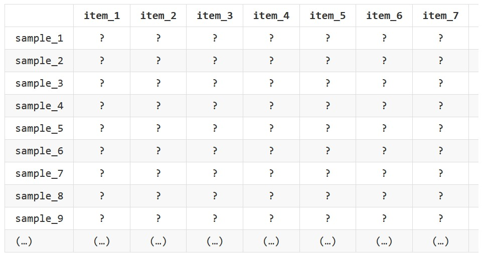
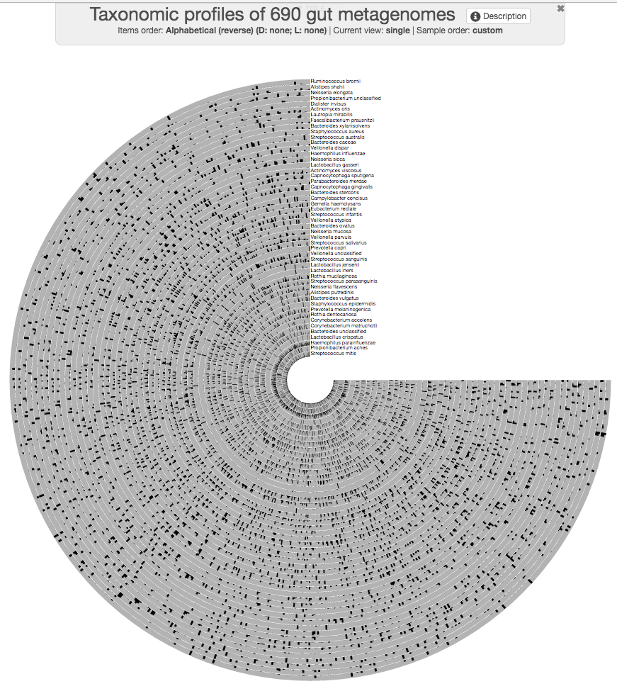
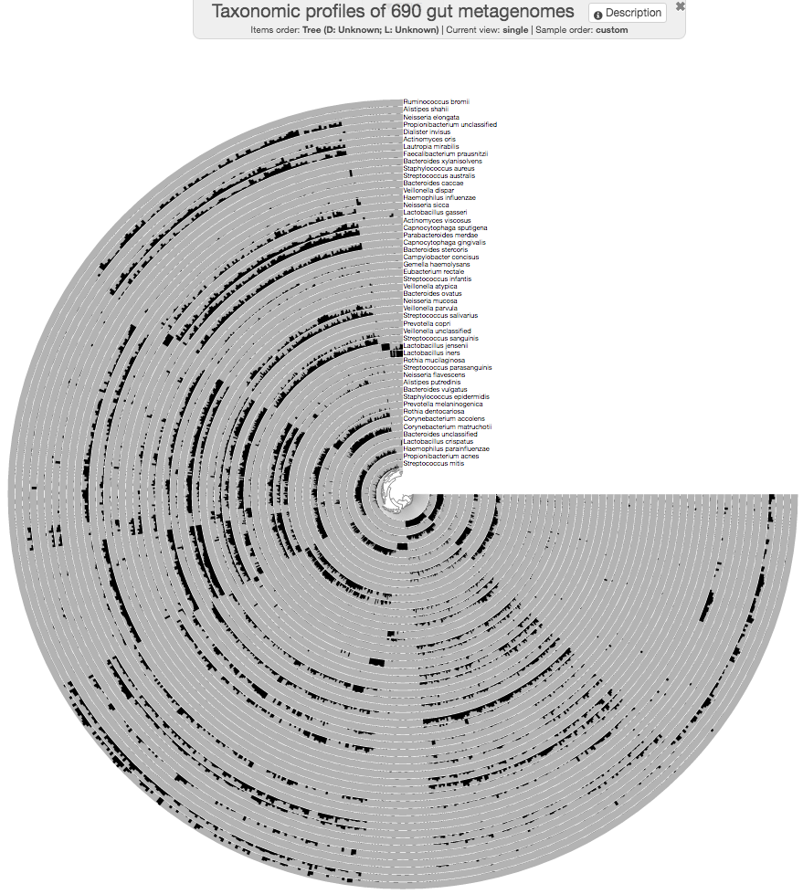
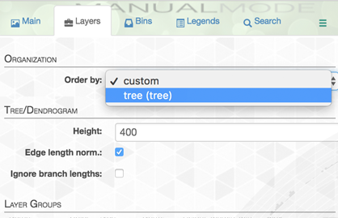
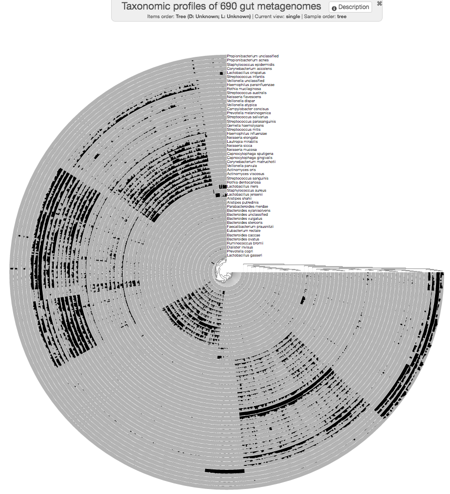
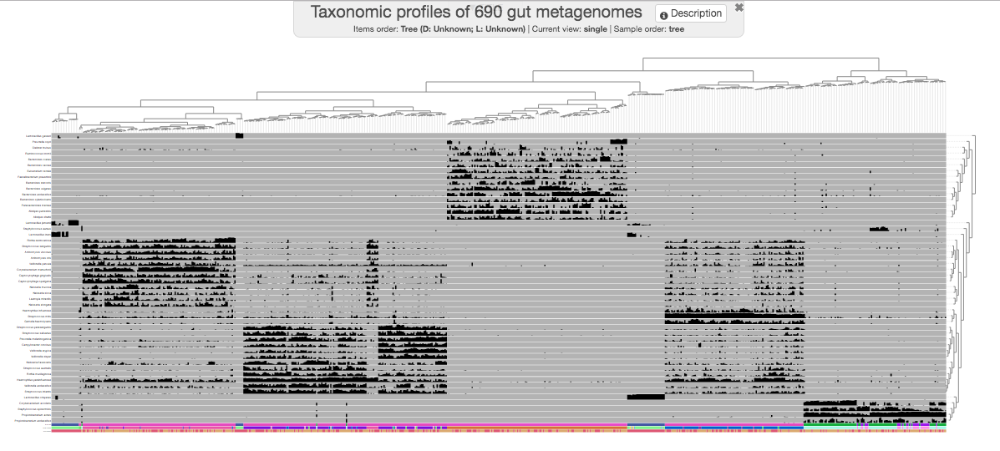
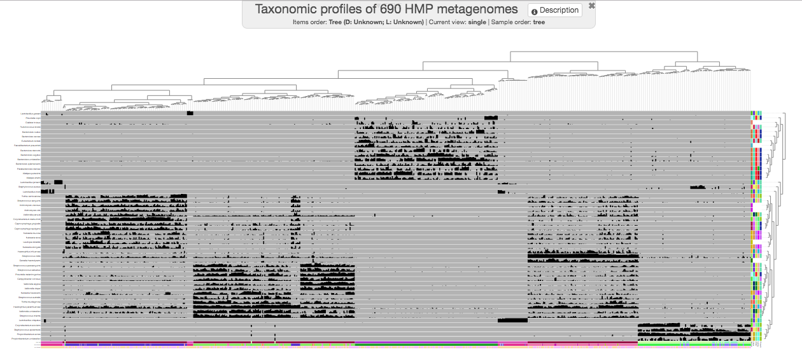
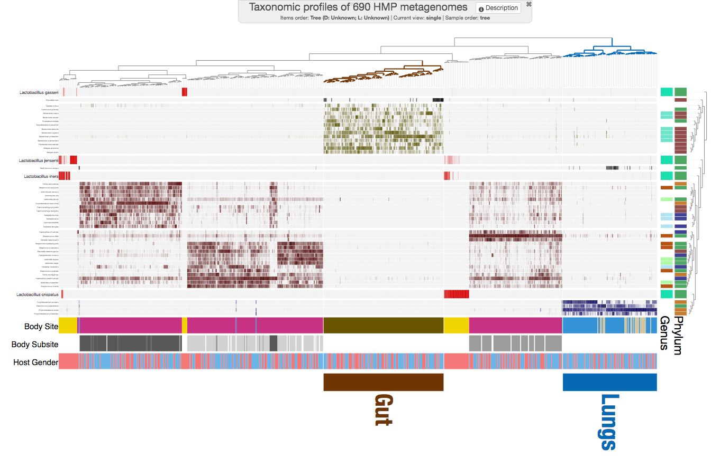
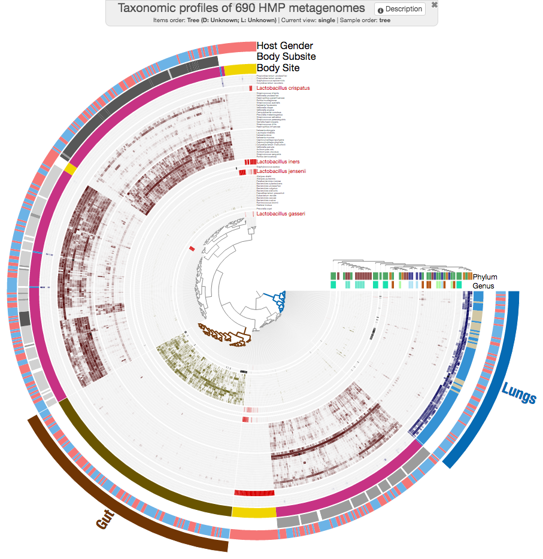

```{r setup, include=FALSE}
knitr::opts_chunk$set(
  collapse = T, echo=T, comment="#>", message=F, warning=F,
	fig.align="center", fig.width=5, fig.height=3, dpi=150)
```


The Pangenome anvi'o scripts is referenced from MicrobiomeStatPlot [Inerst Reference below].

If you use this script, please cited 如果你使用本代码，请引用：

**Yong-Xin Liu**, Lei Chen, Tengfei Ma, Xiaofang Li, Maosheng Zheng, Xin Zhou, Liang Chen, Xubo Qian, Jiao Xi, Hongye Lu, Huiluo Cao, Xiaoya Ma, Bian Bian, Pengfan Zhang, Jiqiu Wu, Ren-You Gan, Baolei Jia, Linyang Sun, Zhicheng Ju, Yunyun Gao, **Tao Wen**, **Tong Chen**. 2023. EasyAmplicon: An easy-to-use, open-source, reproducible, and community-based pipeline for amplicon data analysis in microbiome research. **iMeta** 2(1): e83. https://doi.org/10.1002/imt2.83

The online version of this tuturial can be found in https://github.com/YongxinLiu/MicrobiomeStatPlot


**Authors**

First draft(初稿)：Defeng Bai(白德凤)；Proofreading(校对)：Ma Chuang(马闯) and Jiani Xun(荀佳妮)；Text tutorial(文字教程)：Defeng Bai(白德凤)


# Introduction简介

参考：https://merenlab.org/2016/02/27/the-anvio-interactive-interface//#using-the-anvio-interactive-interface

anvi'o 交互界面
The anvi'o interactive interface

Anvi’o 是一个综合性的组学平台，拥有庞大的代码库，可执行广泛的任务，并对大型数据集进行深入分析。
Anvi’o is a comprehensive ‘omics platform with a large codebase to perform wide range of tasks, and in-depth analyses of large datasets.

anvi’o 交互式界面是一个完全可定制的可视化环境，可通过直观的界面访问，以高效地可视化复杂数据。它可以处理大型数据集，其源代码可在 anvi’o 平台内免费获取。
The anvi’o interactive interface is a fully customizable visualization environment that is accessible through an intuitive interface to efficiently visualize complex data. It can handle large datasets, and it’s source code is freely available within the anvi’o platform.


# anvi'o 交互界面使用教程

参考：https://merenlab.org/tutorials/interactive-interface/

1.数据矩阵
The data matrix

anvi'o处理的数据表格样式为：


该表中的每一行代表一个肠道宏基因组，每一列代表一个微生物分类单元。单元格显示给定宏基因组中给定分类单元的百分比丰度。

```{bash}
# 运行测试
# 获取测试数据
wget http://merenlab.org/tutorials/interactive-interface/files/data.txt

# 运行交互界面绘图
anvi-interactive -d data.txt \
                 -p profile.db \
                 --title "Taxonomic profiles of 690 gut metagenomes" \
                 --manual

```



组织内容
可以使用程序 anvi-matrix-to-newick 对数据进行快速的层次聚类

```{bash}
anvi-matrix-to-newick data.txt \
                         -o tree.txt
                         
anvi-interactive -d data.txt \
                    -p profile.db \
                    --title "Taxonomic profiles of 690 gut metagenomes" \
                    --tree tree.txt \
                    --manual
```



保存的历史版本文件
State files

在进行可视化决策时，Anvi’o 的交互式界面可以为您提供很多帮助。它提供了一种存储更改的方法。给定数据库中可以有多个状态文件，但如果 anvi’o 在给定的配置文件数据库中找到名为 default 的状态，则它会自动加载该状态并绘制。

```{bash}
anvi-help state

anvi-export-state -p profile.db \
                  -s default \
                  -o default.json
```


组织图层
Organizing layers

使用 anvi’o 执行此操作与组织项目的初始步骤有点类似

```{bash}
anvi-matrix-to-newick data.txt \
                         --transpose \
                         -o layers-tree.txt

wget http://merenlab.org/tutorials/interactive-interface/files/layer-orders.txt

anvi-import-misc-data layer-orders.txt \
                         --target-data-table layer_orders \
                         --pan-or-profile-db profile.db
                         
anvi-interactive -d data.txt \
                    -p profile.db \
                    --title "Taxonomic profiles of 690 gut metagenomes" \
                    --tree tree.txt \
                    --manual

```

以上步骤运行完成后需要指示 anvi’o 使用新的组织方式来对图层进行排序。这可以从“图层”选项卡中完成。





项目附加数据
Additional data for the items

Anvi’o 可以用附加数据扩展图。例如，我们有一些关于这些宏基因组的信息。例如采样地点，或它们来自的个体的性别。我们可以显示这些信息以改善我们对数据的理解。

```{bash}
wget http://merenlab.org/tutorials/interactive-interface/files/additional-items-data.txt

anvi-import-misc-data additional-items-data.txt \
                         --target-data-table items \
                         --pan-or-profile-db profile.db
                         
anvi-interactive -d data.txt \
                    -p profile.db \
                    --title "Taxonomic profiles of 690 HMP metagenomes" \
                    --tree tree.txt \
                    --manual

```



图层附加数据
Additional data for the layers

可以给一些图层添加一些分类。

```{bash}
wget http://merenlab.org/tutorials/interactive-interface/files/additional-layers-data.txt

anvi-import-misc-data additional-layers-data.txt \
                         --target-data-table layers \
                         --pan-or-profile-db profile.db
                         
anvi-interactive -d data.txt \
                    -p profile.db \
                    --title "Taxonomic profiles of 690 HMP metagenomes" \
                    --tree tree.txt \
                    --manual
                  
```




美化
Prettification

```{bash}
wget http://merenlab.org/tutorials/interactive-interface/files/pretty-state.json
anvi-import-state -p profile.db -s pretty-state.json -n default

anvi-interactive -d data.txt \
                    -p profile.db \
                    --title "Taxonomic profiles of 690 HMP metagenomes" \
                    --tree tree.txt \
                    --manual
```






If used this script, please cited:
使用此脚本，请引用下文：

**Yong-Xin Liu**, Lei Chen, Tengfei Ma, Xiaofang Li, Maosheng Zheng, Xin Zhou, Liang Chen, Xubo Qian, Jiao Xi, Hongye Lu, Huiluo Cao, Xiaoya Ma, Bian Bian, Pengfan Zhang, Jiqiu Wu, Ren-You Gan, Baolei Jia, Linyang Sun, Zhicheng Ju, Yunyun Gao, **Tao Wen**, **Tong Chen**. 2023. EasyAmplicon: An easy-to-use, open-source, reproducible, and community-based pipeline for amplicon data analysis in microbiome research. **iMeta** 2: e83. https://doi.org/10.1002/imt2.83

Copyright 2016-2024 Defeng Bai <baidefeng@caas.cn>, Chuang Ma <22720765@stu.ahau.edu.cn>, Jiani Xun <15231572937@163.com>, Yong-Xin Liu <liuyongxin@caas.cn>
