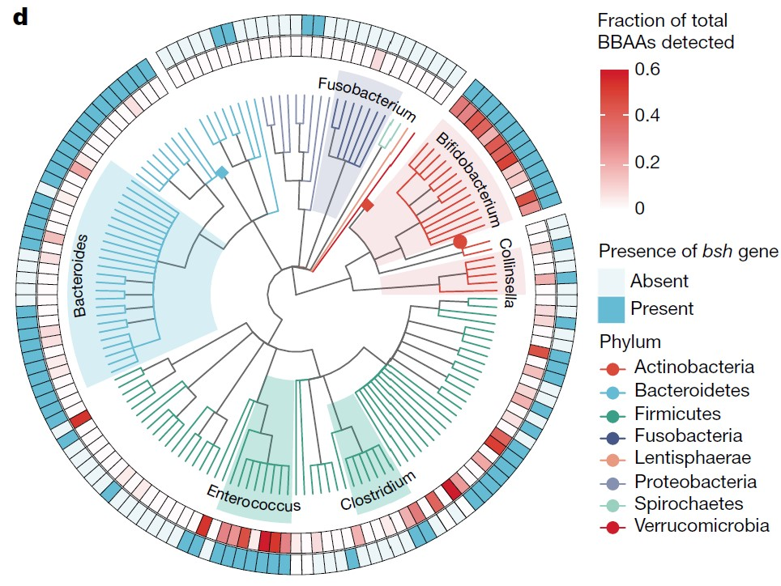
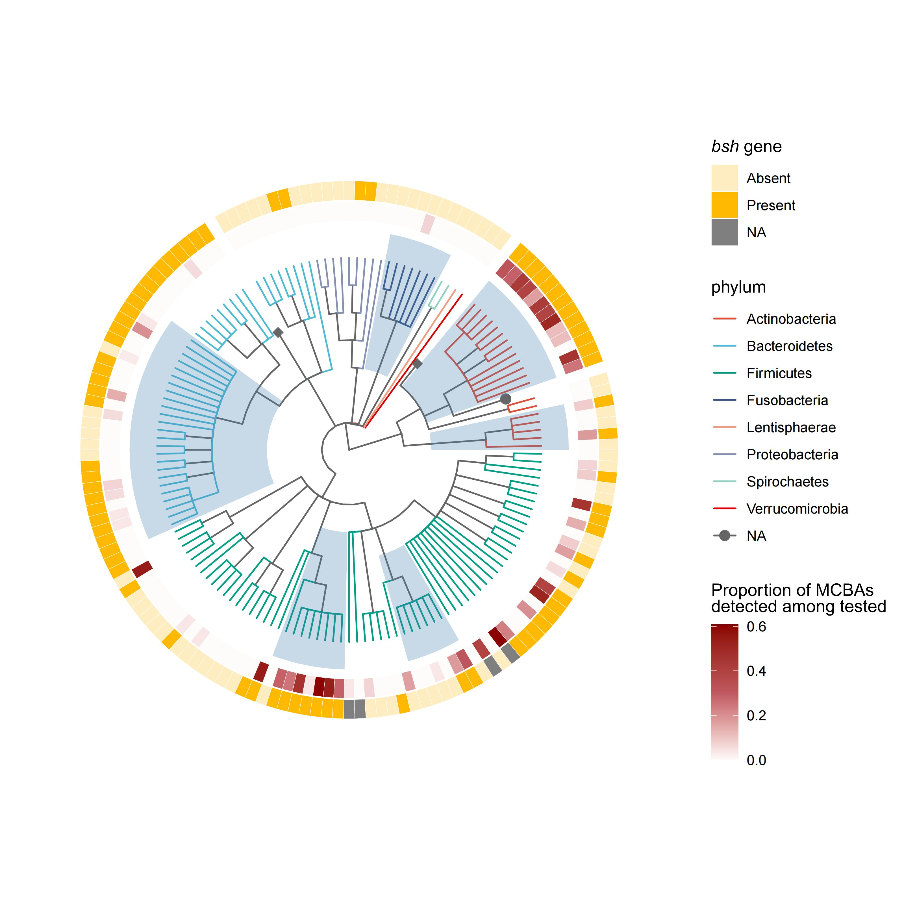

```{r setup, include=FALSE}
knitr::opts_chunk$set(
  collapse = T, echo=T, comment="#>", message=F, warning=F,
	fig.align="center", fig.width=5, fig.height=3, dpi=150)
```


If you use this script, please cited 如果你使用本代码，请引用：

**Yong-Xin Liu**, Lei Chen, Tengfei Ma, Xiaofang Li, Maosheng Zheng, Xin Zhou, Liang Chen, Xubo Qian, Jiao Xi, Hongye Lu, Huiluo Cao, Xiaoya Ma, Bian Bian, Pengfan Zhang, Jiqiu Wu, Ren-You Gan, Baolei Jia, Linyang Sun, Zhicheng Ju, Yunyun Gao, **Tao Wen**, **Tong Chen**. 2023. EasyAmplicon: An easy-to-use, open-source, reproducible, and community-based pipeline for amplicon data analysis in microbiome research. **iMeta** 2(1): e83. https://doi.org/10.1002/imt2.83

The online version of this tuturial can be found in https://github.com/YongxinLiu/MicrobiomeStatPlot


**Authors**
First draft(初稿)：Ma Chuang(马闯)；Proofreading(校对)：Defeng Bai(白德凤) and Xun Jiani(荀佳妮)；Text tutorial(文字教程)：Ma Chuang(马闯)


# Introduction简介

#什么是系统发育树？
What is a phylogenetic tree plot？

系统发育树用于表示生物物种、基因或其他生物单元间的进化关系。它基于共同祖先和进化历史，将不同的物种或基因用分支结构表示，类似于家谱。系统发育树通常由节点和分支组成：节点分为内部节点和外部节点。内部节点代表一个共同祖先；外部节点代表当前的物种、基因或其他生物单元。分支表示物种或基因在进化过程中从共同祖先分化出来的路径，分支的长度可以反映进化的时间或遗传变化的程度。系统发育树的类型：跟树和无根树。系统发育树通常通过比较物种或基因序列（如DNA、RNA或蛋白质序列）构建，常用的方法包括：距离矩阵法；最大简约法；最大似然法；贝叶斯推断。系统发育树常用于进行物种分类和进化研究、基因功能推断、流行病学分析、生物多样性保护。
A phylogenetic tree is used to represent the evolutionary relationships between biological species, genes, or other biological units.It is based on common ancestry and evolutionary history and represents different species or genes in a branching structure, similar to a family tree.Phylogenetic trees usually consist of nodes and branches: nodes are divided into internal and external nodes.Internal nodes represent a common ancestor; external nodes represent current species, genes, or other biological units.Branches represent the paths by which species or genes diverged from a common ancestor during evolution, and the length of a branch can reflect the time of evolution or the degree of genetic change.Types of phylogenetic trees: heel trees and unrooted trees.Phylogenetic trees are usually constructed by comparing species or gene sequences (e.g., DNA, RNA, or protein sequences), and common methods include: distance matrix method; maximum parsimony method; maximum likelihood method; and Bayesian inference.Phylogenetic trees are commonly used to conduct species classification and evolutionary studies, gene function inference, epidemiological analysis, and biodiversity conservation.

# 系统发育树图在微生物研究中的应用
The application of phylogenetic tree diagram in microbial research

与系统发育相关的概念：
Concepts related to phylogeny:
1.分子进化Molecular evolution
分子进化是指生物进化过程中生物大分子（蛋白质、核酸）的演变现象。进化主要是基于基因突变、核苷酸替代转换和颠换、插入和缺失、重组和倒位等引发基因突变。突变的基因或DNA序列通过群体水平的遗传漂变或自然选择进行扩散，从而产生新的形态或功能性状，最终在物种间得以固定并传递给其所有后代。
Molecular evolution refers to the phenomenon of the evolution of biological macromolecules (proteins, nucleic acids) during the process of biological evolution. Evolution is mainly based on gene mutations, nucleotide substitution and inversion, insertion and deletion, recombination and inversion, etc., which trigger gene mutations. Mutated genes or DNA sequences diffuse through genetic drift or natural selection at the population level, resulting in new morphological or functional traits that are ultimately fixed between species and passed on to all their descendants.
2.同源Homologous
同源是指来源于共同祖先的相似序列为同源序列
Homologous refers to a homologous sequence derived from a common ancestor
3.系统发育树Phylogenetic tree
系统发育树是多序列比对结果以树形图形的呈现。
A phylogenetic tree is a tree shaped representation of multiple sequence alignment results.

系统发育树的构成：
The composition of the phylogenetic tree:
1.根root
所有分支的共同祖先叫做根。根据有无根可分为：①有根树：可以从树中找到共同的祖先。反映了树上基因或蛋白质进化的时间顺序，通过分析有根树的树枝长度，可以了解不同基因或蛋白质以何方式和速率进化。②无根树：只反映分类单元之间的距离，不涉及寻找祖先的问题。
The common ancestor of all branches is called a root. According to the presence or absence of roots, it can be divided into: ① Rooted trees: common ancestors can be found from the trees. It reflects the temporal sequence of gene or protein evolution on trees. By analyzing the length of branches in rooted trees, it is possible to understand how different genes or proteins evolve and at what rate Rootless tree: It only reflects the distance between taxonomic units and does not involve the problem of finding ancestors.
2.节点Node
每个结点代表一个分类单元，物种上可以是属、种群等，基因上可以是基因家族、同源物等。
Each node represents a taxonomic unit, which can be a genus, population, or gene family or homologous species.
3.进化支Branch
也称分支，指两种以上的生物或序列组成的进化关系。
Also known as a branch, it refers to the evolutionary relationship composed of two or more organisms or sequences.
4.外群Outer group
与分析序列相关的生物序列，但是具有较远的亲缘关系。
Biological sequences related to the analysis sequence, but with distant phylogenetic relationships.
5.进化分支长度Evolutionary branch length
也叫遗传变异度、进化距离。一般会标注在分支线上，代表进化支变化的程度，进化枝长度越短代表差异越小，进化距离越近。遗传变异度实际代表基因组序列中每个位点碱基的替换频率，计算方法也很简单：变异度=变异碱基数/总碱基数(%)。从水平方向上的分支及长度可以看到进化谱系随着时间的变化，进化分支长度越长代表着该分支对应的物种或基因的变化越大。
Also known as genetic variability or evolutionary distance. It is generally marked on the branch line, representing the degree of evolution of the branch. The shorter the length of the branch, the smaller the difference, and the closer the evolutionary distance. Genetic variability actually represents the replacement frequency of each base in the genome sequence, and the calculation method is also simple: variability=base number of variation/total base number (%). From the horizontal branches and lengths, it can be seen that the evolutionary lineage changes over time. The longer the length of the evolutionary branch, the greater the change in the species or genes corresponding to that branch.
6.距离标尺Distance ruler
生物或序列间差异数值的单位长度，相当于进化树的比例尺。
The unit length of differences between organisms or sequences, equivalent to the scale of evolutionary trees.
7.步长分析值Bootstrap value
一般会标注在结点，用来评估该分支的可信度。
It is usually annotated at a node to evaluate the credibility of the branch.

进化树的构建：
Construction of Evolutionary Tree:
构建系统发育树的过程被称为分支系统发育分析（Molecular phylogenetic analysis），是一种用来研究物种或序列进化和系统分类的方法。一般研究对象是碱基序列或氨基酸序列，通过数理统计算法来计算生物间进化关系，最后根据计算结果，可视化为系统进化树。进化树的构建大体要分为3步：序列比对、建树、评估验证。
The process of constructing a phylogenetic tree is called molecular phylogenetic analysis, which is a method used to study species or sequence evolution and systematic classification. The general research object is base sequence or amino acid sequence, and the evolutionary relationship between organisms is calculated through mathematical statistical algorithms. Finally, based on the calculation results, it is visualized as a phylogenetic tree. The construction of an evolutionary tree can be roughly divided into three steps: sequence alignment, tree construction, and evaluation and validation.


关键字：微生物组数据分析、MicrobiomeStatPlot、系统发育树案例1、R语言可视化

Keywords: Microbiome analysis, MicrobiomeStatPlot, Phylogenetic Tree 1, R visulization


# 微生物系统发育树案例
Microbial phylogenetic tree case study

本文是Andrew D. Patterson团队2024年发表在Nature（Rimal et al., 2024）上论文用到的图。题目为：Bile salt hydrolase catalyses formation of amine-conjugated bile acids。

This article is a graph used by Andrew D. Patterson's team in their paper published in Nature (Rimal et al., 2024) in 2024. The title is: Bill salt hydroxide catalysts formation of amine reconciled bill acids.
https://www.nature.com/articles/s41586-023-06990-w


图 1：胆汁酸的酰胺化和脱酰胺化反应与细菌 胆盐水解酶 （bile salt hydrolase，BSH） 有关。
d，胆盐水解酶（BSH） 基因的存在与否与不同细菌类群产生 BBAAs 的能力之间的相关性。
Fig. 1: Amidation and de-amidation reactions of bile acids are associated with bacterial bsh.
d, Correlation between presence or absence of the bsh gene with the ability of various bacterial taxa to produce BBAAs. 

**结果**：
人类胃肠道中的多种细菌都会产生BBAAs2,3。因此，我们开始研究产生BBAAs的基因。最近的研究表明，肠道细菌可以用苯丙氨酸、酪氨酸和亮氨酸酰胺化 CA1。 此外，在对 202 个人类相关细菌分离物的筛选中，有报道称 CA 和 DCA的混合物可产生 BBAA3。 另一项研究筛选了 72 株细菌分离物，发现25株菌株能与DCA、CDCA或CA结合产生至少一种BBAA2。我们将这两项研究中涉及的分离菌株的基因组与它们产生的BBAA进行了比较，以确定可能产生BBAA的候选基因。我们发现胆盐水解酶（bsh）基因与 BBAA 的产生显著相关（P = 9.4 × 10-6，系统发育线性回归）（图 1d 和扩展数据图 1）。
Diverse bacteria from the human gastrointestinal tract produce BBAAs2,3. We therefore set out to discover the gene(s) responsible for the production of BBAAs. It was recently demonstrated that gut bacteria can amidate CA with phenylalanine, tyrosine and leucine1. Additionally, in a screen of 202 human-associated bacterial isolates, production of BBAAs from a mixture of CA and DCA was reported3. Another study screened 72 bacterial isolates and found that 25 strains were able to conjugate DCA, CDCA or CA to produce at least one BBAA2. We compared the genomes of the isolates involved in these two studies with their production of BBAAs to identify possible candidate gene(s) responsible for BBAA production. We found that the bile salt hydrolase (bsh) gene was significantly associated (P = 9.4 × 10−6, phylogenetic linear regression) with BBAA production (Fig. 1d and Extended Data Fig. 1).


## Packages installation软件包安装

```{r}
# 基于CRAN安装R包，检测没有则安装
p_list = c("tidyverse", "ggsci", "reutils", "forcats", "ggtree", "phyloseq", "ggtext")
for(p in p_list){if (!requireNamespace(p)){install.packages(p)}
    library(p, character.only = TRUE, quietly = TRUE, warn.conflicts = FALSE)}

# 加载R包 Load the package
suppressWarnings(suppressMessages(library(tidyverse)))
suppressWarnings(suppressMessages(library(ggsci)))
suppressWarnings(suppressMessages(library(reutils)))
suppressWarnings(suppressMessages(library(forcats)))
suppressWarnings(suppressMessages(library(ggtree)))
suppressWarnings(suppressMessages(library(phyloseq)))
suppressWarnings(suppressMessages(library(ggtext)))

```


## Reproducing the bibliographic tree diagram 复现文献树图
https://www.nature.com/articles/s41586-023-06990-w
https://github.com/PattersonLab-PSU/BBAAs-paper/tree/main

```{r}
## 输入基因数据集
## Input gene dataset
bacteria_producers<- read.csv("data/gene.csv") %>% select(-X) %>% 
  distinct(Accession, .keep_all = TRUE) %>%
  rename(fileName=label) %>%
  mutate(Accession=as.numeric(gsub("GC[F|A]_","",Accession))) %>% select(-gene,-n)

## 参与次级胆汁酸代谢的基因，只有 bsh 会被绘制出来。
## The table is filtered for the genes involved in secondary bile acid metabolism. Only bsh will be plotted. 
prokka_gene_presence_absence <- read.csv("data/prokka.csv",header=TRUE) %>%
  rename(Accession="locus_tag") %>%
  mutate(Accession=gsub("GC[A|F]_","",Accession),
         Accession=as.numeric(Accession)) %>%
  select(-X)

## 每种细菌的物种分类表
## Taxonomy table for each bacteria
bacteria_taxonomy<- read.csv("data/metadata.csv")

## PHYLIP 格式的树文件
## Tree files in PHYLIP format
tree<-ggtree::read.tree("data/phyliptree.ph")

#### 带taxaid的菌文件
### Fungus file with taxaid
tree_taxid <- read.table("data/taxid.txt",sep="\t", header=TRUE) %>% 
  select(name,taxid)

## 合并bacteria_producers和prokka_gene_presence_absence数据框
## Merging data frames
bacteria_producers<-bacteria_producers %>% merge(prokka_gene_presence_absence,by="Accession",all=TRUE)

## 树根置于中点
## Root the tree at midpoint
tree_rooted <- phangorn::midpoint(tree, node.labels="support")
tree_df <-tree %>% as.tibble %>% mutate(label=gsub("'","",label)) #%>% write.csv("tree_df.csv") 
tree_df_taxid <- merge(tree_df,tree_taxid, by.x="label", by.y="name") %>%
  merge(bacteria_taxonomy,by="taxid") %>% select(-c(X,label.y)) %>%
  rename(label=label.x) %>%
  mutate(organism_name=gsub("","",organism_name)) %>%
  mutate(Accession=as.numeric(gsub("GC[F|A]_","",Accession))) 

##绘制环状树图
## Drawing a ring tree diagram
tree_rooted$node.label = gsub("'","",tree_rooted$node.label)

p <- ggtree(tree_rooted, layout="circular", size=0.5, open.angle=5,branch.length = "none", aes(color=phylum)) %<+% 
  tree_df_taxid + 
  #geom_tiplab(size=2,aes(label=label), offset=0.1) + 
  scale_color_npg(palette=c("nrc"),alpha=1,na.value="grey40")
    #scale_color_viridis_d(name="Phylum", na.value="grey40",direction = -1) 
p

p1 <- p %>% collapse(node=240)  +
  geom_point2(aes(subset=(node==240)),shape=16,size=3) 
p1 <- p1 %>% collapse(node=236) +
  geom_point2(aes(subset=(node==236)),shape=18,size=3) 
p1 <- p1 %>% collapse(node=278) +
  geom_point2(aes(subset=(node==278)),shape=18,size=3) 

p1$data<-p1$data %>% mutate(label=gsub("'","",label))
p1

#合并tree_df_taxid 和 bacteria_producers数据框
tree_df_producer_gene<-tree_df_taxid %>%
  merge(bacteria_producers, by=c("Accession","organism_name"), all.x=TRUE) %>%
  # mutate(
  #   gene=as.factor(gene)
  # ) %>%
  mutate(production = ifelse(
    nMCB>0,1,0
  ))

##绘制微生物结合胆汁酸（MCBAs）数据
## Plotting data on microbial bound bile acids (MCBAs)
proportions_df <- tree_df_producer_gene %>% select(label,proportion) %>%
  column_to_rownames("label") 

MCBAs <-gheatmap(p1, 
             proportions_df, 
             offset=1, width=0.1,
             colnames=FALSE) +
  scale_fill_gradient2(
    low = "white", 
    mid="#BF5960", 
    high = "darkred", 
    midpoint = 0.3
    )  +
  labs(fill="Proportion of MCBAs <br /> detected among tested") +
  theme(legend.title = element_markdown())
MCBAs


## 绘制胆盐水解酶（BSH）数据 
## Plot in bsh data 
bsh_df <- tree_df_producer_gene %>% select(label,`Choloylglycine.hydrolase`) %>%
  column_to_rownames("label") %>% 
  rename(bsh="Choloylglycine.hydrolase") %>%
    mutate(bsh=case_when(
    bsh==1 ~ "Present",
    bsh ==0 ~ "Absent"
    )) %>%
  mutate(bsh = as.factor(bsh))

p3 <- MCBAs + ggnewscale::new_scale_fill()

BSH <- gheatmap(p3, 
               bsh_df, 
               offset=1.75, width=0.1,
               colnames=FALSE) + 
  scale_fill_manual(values=c("#ffedc2","#ffb900"), 
                    name="*bsh* gene") +
  theme(legend.title = element_markdown())
BSH


nodeids <- nodeid(tree, tree_rooted$node.label[tree_rooted$node.label %in% tree_df_taxid$genus])
nodelab <- tree_rooted$node.label[tree_rooted$node.label %in% tree_df_taxid$genus]
nodedf <- data.frame(id=nodeids)

genus_to_highlight=c("Bifidobacterium","Enterococcus","Bacteroides","Fusobacterium","Collinsella","Clostridium")

nodedf <- nodedf%>% filter(nodelab %in% genus_to_highlight) 
nodedf$type <- as.factor(genus_to_highlight)
p5 <- BSH +geom_hilight(data=nodedf, mapping=aes(node=id),
               extendto=8, alpha=0.3,
               size=0.03) 
ggsave("results/Tree_MCBAs_BSH.pdf", width = 8, height = 8)
```



If used this script, please cited:
使用此脚本，请引用下文：

**Yong-Xin Liu**, Lei Chen, Tengfei Ma, Xiaofang Li, Maosheng Zheng, Xin Zhou, Liang Chen, Xubo Qian, Jiao Xi, Hongye Lu, Huiluo Cao, Xiaoya Ma, Bian Bian, Pengfan Zhang, Jiqiu Wu, Ren-You Gan, Baolei Jia, Linyang Sun, Zhicheng Ju, Yunyun Gao, **Tao Wen**, **Tong Chen**. 2023. EasyAmplicon: An easy-to-use, open-source, reproducible, and community-based pipeline for amplicon data analysis in microbiome research. **iMeta** 2: e83. https://doi.org/10.1002/imt2.83

Copyright 2016-2024 Defeng Bai <baidefeng@caas.cn>, Chuang Ma <22720765@stu.ahau.edu.cn>, Jiani Xun <xunjiani@caas.cn>, Yong-Xin Liu <liuyongxin@caas.cn>
