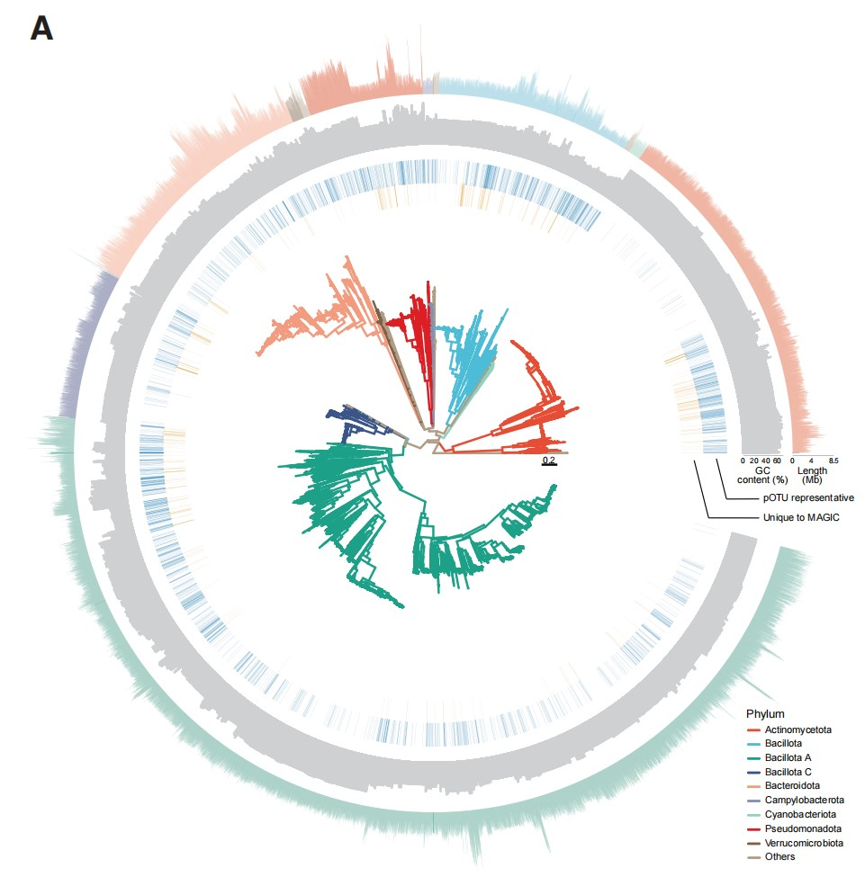
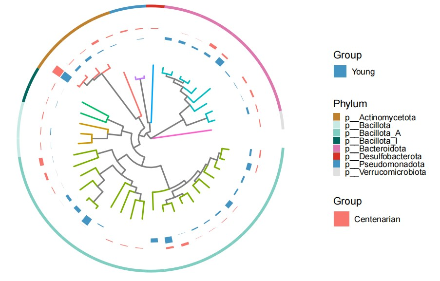

```{r setup, include=FALSE}
knitr::opts_chunk$set(
  collapse = T, echo=T, comment="#>", message=F, warning=F,
	fig.align="center", fig.width=5, fig.height=3, dpi=150)
```


If you use this script, please cited 如果你使用本代码，请引用：

**Yong-Xin Liu**, Lei Chen, Tengfei Ma, Xiaofang Li, Maosheng Zheng, Xin Zhou, Liang Chen, Xubo Qian, Jiao Xi, Hongye Lu, Huiluo Cao, Xiaoya Ma, Bian Bian, Pengfan Zhang, Jiqiu Wu, Ren-You Gan, Baolei Jia, Linyang Sun, Zhicheng Ju, Yunyun Gao, **Tao Wen**, **Tong Chen**. 2023. EasyAmplicon: An easy-to-use, open-source, reproducible, and community-based pipeline for amplicon data analysis in microbiome research. **iMeta** 2(1): e83. https://doi.org/10.1002/imt2.83

The online version of this tuturial can be found in https://github.com/YongxinLiu/MicrobiomeStatPlot


**Authors**
First draft(初稿)：Defeng Bai(白德凤), Yunyun Gao(高云云)；Proofreading(校对)：Ma Chuang(马闯) and Xun Jiani(荀佳妮)；Text tutorial(文字教程)：Defeng Bai(白德凤)


# Introduction简介

关于系统发育树的基础知识已经在系统发育树案例1中进行了介绍，系统发育树案例2是系统发育树的另外一种样式，其利用gtdbtk方法得到的无根树进行构建，对比组间的相对丰度差异。

The basic knowledge about phylogenetic trees has been introduced in Phylogenetic Tree Case 1. Phylogenetic Tree Case 2 is another style of phylogenetic tree, which is constructed using the unrooted tree obtained by the gtdbtk method to compare the relative abundance differences between groups.


关键字：微生物组数据分析、MicrobiomeStatPlot、系统发育树案例2、R语言可视化

Keywords: Microbiome analysis, MicrobiomeStatPlot, Phylogenetic Tree 2, R visulization


# 微生物系统发育树案例
Microbial phylogenetic tree case study

这是香港中文大学Hein Min Tun, Siew Chien Ng和Lin Zhang等2024年发表于Cell Host & Microbe上的一篇论文。论文的题目为：A metagenome-assembled genome inventory
for children reveals early-life gut bacteriome and virome dynamics. https://doi.org/10.1016/j.chom.2024.10.017

This is a paper published in Cell Host & Microbe in 2024 by Hein Min Tun, Siew Chien Ng and Lin Zhang from the Chinese University of Hong Kong. The title of the paper is: A metagenome-assembled genome inventory for children reveals early-life gut bacteriome and virome dynamics. https://doi.org/10.1016/j.chom.2024.10.017




Figure 2. (A) Phylogeny, uniqueness, GC content, and genome length of the 26,352 pMAGs in the MAGIC database.
图 2. (A) MAGIC 数据库中 26,352 个 pMAG 的系统发育、唯一性、GC 含量和基因组长度。


**结果**

MAGIC covers 26,352 prokaryotic metagenome-assembled genomes (pMAGs) (Data S1). These pMAGs were dereplicated into 3,299 prokaryote operational taxonomic units (pOTUs) of 16 phyla and five archaeal pOTUs of two phyla (Figures 2A and S1). An early-life associated species, B. longum, has the largest number of MAGs recovered (n = 610, dereplicated into three OTUs), followed by Blautia A wexlerae (n = 601) and B. adolescentis (n = 525) (Figure S1; Data S1). By matching the sequences to major databases (STAR Methods; Data S2), we found that 8.5% (n = 279) of the pOTUs did not cluster with reported genomes, comprising 523 pMAGs (Figures 2A and S2A). Notably, the Actinomycetota phylum has the highest proportion of pOTUs that are unique to MAGIC (18.5%) compared with other phyla (two-sided Fisher’s exact test, p < 0.001, Data S1 and S2).

MAGIC 涵盖 26,352 个原核生物宏基因组组装基因组 (pMAG)（数据 S1）。这些 pMAG 被去冗余后得到 16 个门的 3,299 个原核生物操作分类单位 (pOTU) 和两个门的 5 个古细菌 pOTU（图 2A 和 S1）。早期生命相关物种 B. longum 恢复的 MAG 数量最多（n = 610，去复制为 3 个 OTU），其次是 Blautia A wexlerae（n = 601）和 B. adolescentis（n = 525）（图 S1；数据 S1）。通过将序列与主要数据库（STAR 方法；数据 S2）进行匹配，我们发现 8.5%（n = 279）的 pOTU 与已报道的基因组不聚类，包括 523 个 pMAG（图 2A 和 S2A）。值得注意的是，与其他门相比，放线菌门具有 MAGIC 独有的 pOTU 比例最高 (18.5%)（双侧 Fisher 精确检验，p < 0.001，数据 S1 和 S2）。


## Packages installation软件包安装

```{r}
# 基于CRAN安装R包，检测没有则安装
p_list = c("ggtreeExtra","ggtree","treeio","tidytree","ggstar","ggplot2",
             "ggnewscale","TDbook")
for(p in p_list){if (!requireNamespace(p)){install.packages(p)}
    library(p, character.only = TRUE, quietly = TRUE, warn.conflicts = FALSE)}

# 加载R包 Load the package
suppressWarnings(suppressMessages(library("ggtreeExtra")))
suppressWarnings(suppressMessages(library("ggtree")))
suppressWarnings(suppressMessages(library("treeio")))
suppressWarnings(suppressMessages(library("tidytree")))
suppressWarnings(suppressMessages(library("ggstar")))
suppressWarnings(suppressMessages(library("ggplot2")))
suppressWarnings(suppressMessages(library("ggnewscale")))
suppressWarnings(suppressMessages(library("TDbook")))

```


## Phylogenetic Tree 2 系统发育树案例2

系统发育树外圈增加不同分组柱状图进行不同分组对应物种相对丰度高低的比较，最外圈用颜色标注物种对应的门水平。
Different grouping bar graphs are added to the outer circle of the phylogenetic tree to compare the relative abundance of species corresponding to different groups, and the outermost circle uses colors to mark the phylum level corresponding to the species.

```{r}
# 树文件和注释文件是通过EasyMetagenome分析流程获取的，EasyMetagenome网址：https://github.com/YongxinLiu/EasyMetagenome

# Load tree data
# 导入树文件
tree <- read.tree("data/tax.unrooted.tree")

# Load annotation data
# 导入注释文件
data_anno <- read.table("data/annotation.txt", header = TRUE, sep = "\t")

data1 <- subset(data_anno, select = c(ID, Phylum))
data1 <- data1[order(data1$Phylum), ]
color_palette <-c("#4393c3","#fec44f","#fa9fb5","#a1d99b",
                  "#dd1c77","#bcbddc","#1c9099","#bf812d",
                  "#c7eae5", "#80cdc1", "#01665e", "#de77ae", 
                  "#d73027", "#e0e0e0")

unique_phyla <- unique(data1$Phylum)
num_unique_phyla <- length(unique_phyla)
if (num_unique_phyla > length(color_palette)) {
  color_mapping <- setNames(rep(color_palette, length.out = num_unique_phyla), unique_phyla)
} else {
  color_mapping <- setNames(color_palette[1:num_unique_phyla], unique_phyla)
}

data1$color <- color_mapping[data1$Phylum]
data1 <- data1[order(data1$ID), ]

data2 <- subset(data_anno, select = c(ID, MY1, MY2, MY3))
data2$Prevalence<- rowMeans(data2[, c("MY1", "MY2", "MY3")])
data2$Group <- "Young"

data3 <- subset(data_anno, select = c(ID, FC1, FC2, FC3))
data3$Prevalence<- rowMeans(data3[, c("FC1","FC2","FC3")])
data3$Group <- "Centenarian"

#如果数据相差太大，可以做Min-Max Normalization
min_max_normalize <- function(x) {
  return((x - min(x)) / (max(x) - min(x)))
}
data2$Prevalence <- min_max_normalize(data2$Prevalence)
data3$Prevalence <- min_max_normalize(data3$Prevalence)
# Prepare the tree
data1$label <- data1$ID
tree2 <- full_join(tree, data1, by = "label")

# Create the circular layout tree
# 绘制系统发育树圈图
p1<- ggtree(tree2,
            aes(color=Phylum),#支长颜色按照分组进行着色
            layout="fan",#进化树类型
            open.angle=0,#开口角度
            linewidth=0.75,#分支线条粗细
            show.legend = F)+
  new_scale_fill() +
  geom_fruit(
    data=data2,#数据
    geom = geom_col,#绘图类型
    mapping = aes(y=ID, x= Prevalence, fill = Group),
    offset = 0.1,
    pwidth = 0.1,
    width=0.5,
  )+
  scale_fill_manual(
    values=c("#4393c3","#fec44f","#fa9fb5","#a1d99b",
             "#dd1c77","#bcbddc"),
    guide=guide_legend(keywidth=1, keyheight=1, order=2),
    name="Group")+
  new_scale_fill() +
  geom_fruit(
    data=data3,#数据
    geom = geom_col,#绘图类型
    mapping = aes(y=ID, x= Prevalence, fill = Group),
    offset = 0.01,
    pwidth = 0.1,
    width=0.5
  )+
  new_scale_fill() +
  geom_fruit(
    data=data1,
    geom=geom_tile,
    mapping=aes(y=ID, fill=data1$Phylum),
    width=0.03,
    offset=0.15
  )+
    scale_fill_manual(
    values=c("#bf812d", "#c7eae5", "#80cdc1", "#01665e", "#de77ae", "#d73027", "#4393c3","#e0e0e0"),
    guide=guide_legend(keywidth=0.5, keyheight=0.5, order=2),
    name="Phylum")

pdf(file=paste("results/MAGs_phylogenetic_tree01.pdf", sep=""), height = 5.2, width = 11)
p1
dev.off()
```





If used this script, please cited:
使用此脚本，请引用下文：

**Yong-Xin Liu**, Lei Chen, Tengfei Ma, Xiaofang Li, Maosheng Zheng, Xin Zhou, Liang Chen, Xubo Qian, Jiao Xi, Hongye Lu, Huiluo Cao, Xiaoya Ma, Bian Bian, Pengfan Zhang, Jiqiu Wu, Ren-You Gan, Baolei Jia, Linyang Sun, Zhicheng Ju, Yunyun Gao, **Tao Wen**, **Tong Chen**. 2023. EasyAmplicon: An easy-to-use, open-source, reproducible, and community-based pipeline for amplicon data analysis in microbiome research. **iMeta** 2: e83. https://doi.org/10.1002/imt2.83

Copyright 2016-2024 Defeng Bai <baidefeng@caas.cn>, Chuang Ma <22720765@stu.ahau.edu.cn>, Jiani Xun <xunjiani@caas.cn>, Yong-Xin Liu <liuyongxin@caas.cn>

