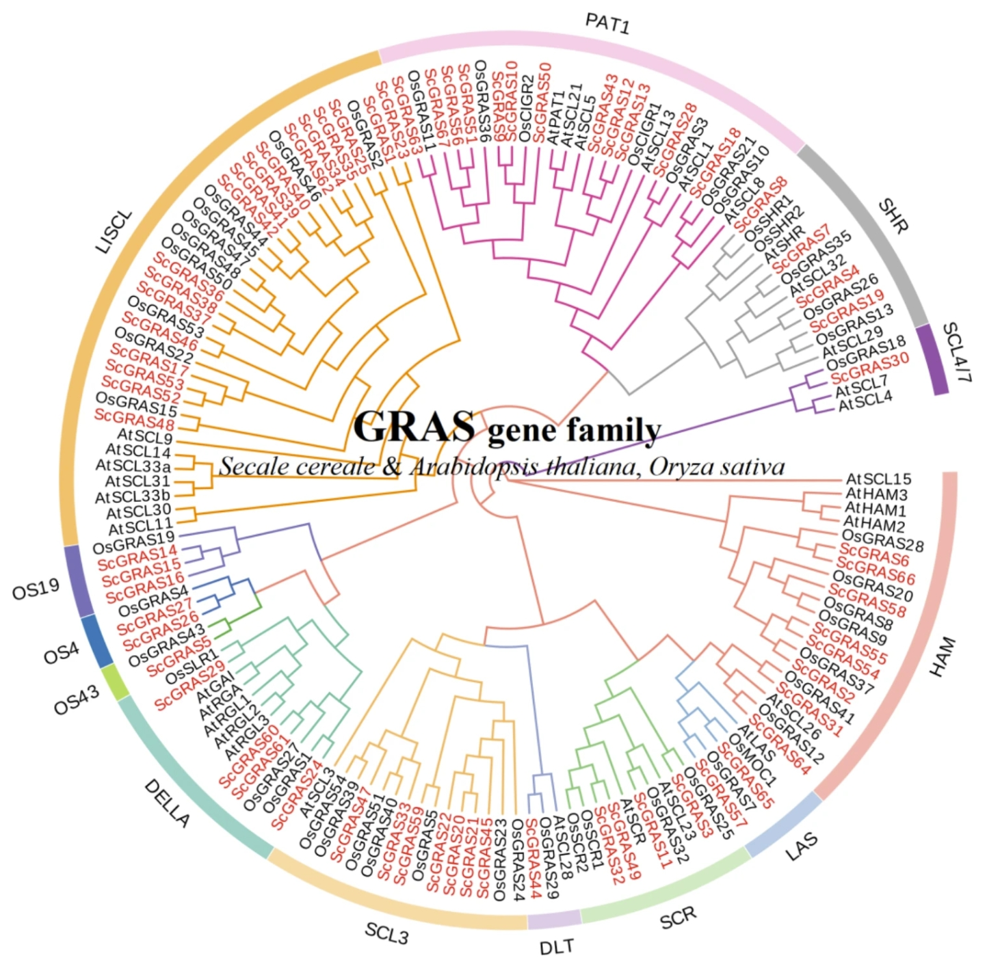
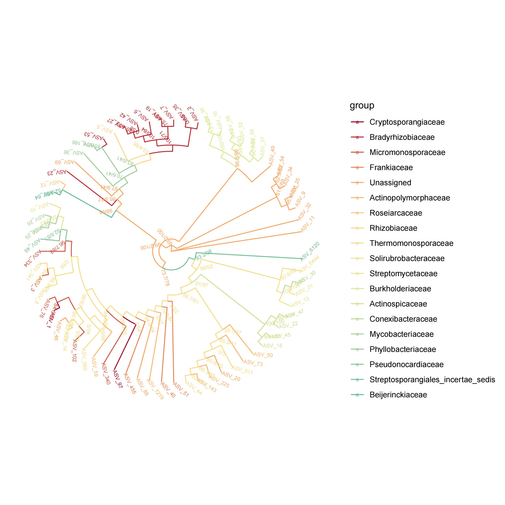

```{r setup, include=FALSE}
knitr::opts_chunk$set(
  collapse = T, echo=T, comment="#>", message=F, warning=F,
	fig.align="center", fig.width=5, fig.height=3, dpi=150)
```


If you use this script, please cited 如果你使用本代码，请引用：

**Yong-Xin Liu**, Lei Chen, Tengfei Ma, Xiaofang Li, Maosheng Zheng, Xin Zhou, Liang Chen, Xubo Qian, Jiao Xi, Hongye Lu, Huiluo Cao, Xiaoya Ma, Bian Bian, Pengfan Zhang, Jiqiu Wu, Ren-You Gan, Baolei Jia, Linyang Sun, Zhicheng Ju, Yunyun Gao, **Tao Wen**, **Tong Chen**. 2023. EasyAmplicon: An easy-to-use, open-source, reproducible, and community-based pipeline for amplicon data analysis in microbiome research. **iMeta** 2(1): e83. https://doi.org/10.1002/imt2.83

The online version of this tuturial can be found in https://github.com/YongxinLiu/MicrobiomeStatPlot


**Authors**
First draft(初稿)：Ma Chuang(马闯)；Proofreading(校对)：Defeng Bai(白德凤) and Xun Jiani(荀佳妮)；Text tutorial(文字教程)：Ma Chuang(马闯)；Video tutorial(视频教程)：Ma Chuang(马闯)


# Introduction简介

#什么是系统发育树？
What is a phylogenetic tree plot？

系统发育树用于表示生物物种、基因或其他生物单元间的进化关系。它基于共同祖先和进化历史，将不同的物种或基因用分支结构表示，类似于家谱。系统发育树通常由节点和分支组成：节点分为内部节点和外部节点。内部节点代表一个共同祖先；外部节点代表当前的物种、基因或其他生物单元。分支表示物种或基因在进化过程中从共同祖先分化出来的路径，分支的长度可以反映进化的时间或遗传变化的程度。系统发育树的类型：跟树和无根树。系统发育树通常通过比较物种或基因序列（如DNA、RNA或蛋白质序列）构建，常用的方法包括：距离矩阵法；最大简约法；最大似然法；贝叶斯推断。系统发育树常用于进行物种分类和进化研究、基因功能推断、流行病学分析、生物多样性保护。
A phylogenetic tree is used to represent the evolutionary relationships between biological species, genes, or other biological units.It is based on common ancestry and evolutionary history and represents different species or genes in a branching structure, similar to a family tree.Phylogenetic trees usually consist of nodes and branches: nodes are divided into internal and external nodes.Internal nodes represent a common ancestor; external nodes represent current species, genes, or other biological units.Branches represent the paths by which species or genes diverged from a common ancestor during evolution, and the length of a branch can reflect the time of evolution or the degree of genetic change.Types of phylogenetic trees: heel trees and unrooted trees.Phylogenetic trees are usually constructed by comparing species or gene sequences (e.g., DNA, RNA, or protein sequences), and common methods include: distance matrix method; maximum parsimony method; maximum likelihood method; and Bayesian inference.Phylogenetic trees are commonly used to conduct species classification and evolutionary studies, gene function inference, epidemiological analysis, and biodiversity conservation.

# 系统发育树图在微生物研究中的应用
The application of phylogenetic tree diagram in microbial research

与系统发育相关的概念：
Concepts related to phylogeny:
1.分子进化Molecular evolution
分子进化是指生物进化过程中生物大分子（蛋白质、核酸）的演变现象。进化主要是基于基因突变、核苷酸替代转换和颠换、插入和缺失、重组和倒位等引发基因突变。突变的基因或DNA序列通过群体水平的遗传漂变或自然选择进行扩散，从而产生新的形态或功能性状，最终在物种间得以固定并传递给其所有后代。
Molecular evolution refers to the phenomenon of the evolution of biological macromolecules (proteins, nucleic acids) during the process of biological evolution. Evolution is mainly based on gene mutations, nucleotide substitution and inversion, insertion and deletion, recombination and inversion, etc., which trigger gene mutations. Mutated genes or DNA sequences diffuse through genetic drift or natural selection at the population level, resulting in new morphological or functional traits that are ultimately fixed between species and passed on to all their descendants.
2.同源Homologous
同源是指来源于共同祖先的相似序列为同源序列
Homologous refers to a homologous sequence derived from a common ancestor
3.系统发育树Phylogenetic tree
系统发育树是多序列比对结果以树形图形的呈现。
A phylogenetic tree is a tree shaped representation of multiple sequence alignment results.

系统发育树的构成：
The composition of the phylogenetic tree:
1.根root
所有分支的共同祖先叫做根。根据有无根可分为：①有根树：可以从树中找到共同的祖先。反映了树上基因或蛋白质进化的时间顺序，通过分析有根树的树枝长度，可以了解不同基因或蛋白质以何方式和速率进化。②无根树：只反映分类单元之间的距离，不涉及寻找祖先的问题。
The common ancestor of all branches is called a root. According to the presence or absence of roots, it can be divided into: ① Rooted trees: common ancestors can be found from the trees. It reflects the temporal sequence of gene or protein evolution on trees. By analyzing the length of branches in rooted trees, it is possible to understand how different genes or proteins evolve and at what rate Rootless tree: It only reflects the distance between taxonomic units and does not involve the problem of finding ancestors.
2.节点Node
每个结点代表一个分类单元，物种上可以是属、种群等，基因上可以是基因家族、同源物等。
Each node represents a taxonomic unit, which can be a genus, population, or gene family or homologous species.
3.进化支Branch
也称分支，指两种以上的生物或序列组成的进化关系。
Also known as a branch, it refers to the evolutionary relationship composed of two or more organisms or sequences.
4.外群Outer group
与分析序列相关的生物序列，但是具有较远的亲缘关系。
Biological sequences related to the analysis sequence, but with distant phylogenetic relationships.
5.进化分支长度Evolutionary branch length
也叫遗传变异度、进化距离。一般会标注在分支线上，代表进化支变化的程度，进化枝长度越短代表差异越小，进化距离越近。遗传变异度实际代表基因组序列中每个位点碱基的替换频率，计算方法也很简单：变异度=变异碱基数/总碱基数(%)。从水平方向上的分支及长度可以看到进化谱系随着时间的变化，进化分支长度越长代表着该分支对应的物种或基因的变化越大。
Also known as genetic variability or evolutionary distance. It is generally marked on the branch line, representing the degree of evolution of the branch. The shorter the length of the branch, the smaller the difference, and the closer the evolutionary distance. Genetic variability actually represents the replacement frequency of each base in the genome sequence, and the calculation method is also simple: variability=base number of variation/total base number (%). From the horizontal branches and lengths, it can be seen that the evolutionary lineage changes over time. The longer the length of the evolutionary branch, the greater the change in the species or genes corresponding to that branch.
6.距离标尺Distance ruler
生物或序列间差异数值的单位长度，相当于进化树的比例尺。
The unit length of differences between organisms or sequences, equivalent to the scale of evolutionary trees.
7.步长分析值Bootstrap value
一般会标注在结点，用来评估该分支的可信度。
It is usually annotated at a node to evaluate the credibility of the branch.

进化树的构建：
Construction of Evolutionary Tree:
构建系统发育树的过程被称为分支系统发育分析（Molecular phylogenetic analysis），是一种用来研究物种或序列进化和系统分类的方法。一般研究对象是碱基序列或氨基酸序列，通过数理统计算法来计算生物间进化关系，最后根据计算结果，可视化为系统进化树。进化树的构建大体要分为3步：序列比对、建树、评估验证。
The process of constructing a phylogenetic tree is called molecular phylogenetic analysis, which is a method used to study species or sequence evolution and systematic classification. The general research object is base sequence or amino acid sequence, and the evolutionary relationship between organisms is calculated through mathematical statistical algorithms. Finally, based on the calculation results, it is visualized as a phylogenetic tree. The construction of an evolutionary tree can be roughly divided into three steps: sequence alignment, tree construction, and evaluation and validation.


# 微生物系统发育树案例
Microbial phylogenetic tree case study

本文是成都大学食品与生物工程学院团队2024年发表在BMC Plant Biology上论文用到的图。题目为：GRAS gene family in rye (Secale cereale L.): genome-wide identification, phylogeny, evolutionary expansionand expression analyses. https://doi.org/10.1186/s12870-023-04674-1

This is the figure used in the paper published in BMC Plant Biology by the team from School of Food and Bioengineering, Chengdu University, Chengdu, China in 2024.Title: GRAS gene family in rye (Secale cereale L.): genome-wide identification, phylogeny, evolutionary expansionand expression analyses
https://doi.org/10.1186/s12870-023-04674-1


图 1：显示拟南芥（Secale cereale，SC）、拟南芥（Arabidopsis thaliana，At）和黑麦（Oryza sativa，Os）的 GRAS 结构域之间关系的无根系统发生树。 该系统发生树是使用 MEGA7.0 中的邻接法得出的。 该树显示了 13 个系统发育亚科。 来自 S. cereale 的 GRAS 蛋白用红色标出
Fig. 1: Unrooted phylogenetic tree showing relationships among GRAS domains of Secale cereale (Sc), Arabidopsis thaliana (At) and Oryza sativa (Os). The phylogenetic tree was derived using the neighbor-joining method in MEGA7.0. The tree shows the 13 phylogenetic subfamilies. GRAS proteins from S. cereale are highlighted in red 

**结果**：

我们通过邻接法构建了一棵包括 S. cereale（67 个 ScGRASs）、A. thaliana（33 个 AtGRASs）和 O. sativa（46 个 OsGRASs）的系统发生树（图 1，表 S1）。 按照 Cenci 等人[7]和 Tian 等人[34]提出的分类方法，146 个 GRAS 蛋白被分为 13 个不同的拓扑分支。 值得注意的是，LISCL 的成员数量最多（18 个 ScGRAS 蛋白），而 OS43（ScGRAS5）、SCL4/7（ScGRAS30）和 DLT（ScGRAS44）的代表数量最少（各只有一个 ScGRAS 蛋白）。 拓扑树揭示了某些 ScGRAS 蛋白与许多 AtGRAS 和 OsGRAS 蛋白之间显著的遗传亲和性（bootstrap 支持率≥ 70），ScGRAS5、ScGRAS8 和 ScGRAS58 就是典型的例子。 这表明这些同源蛋白可能具有相似的基因结构和生理功能。
We constructed a phylogenetic tree encompassing S. cereale (67 ScGRASs), A. thaliana (33 AtGRASs), and O. sativa (46 OsGRASs) through the neighbor-joining method (Fig. 1, Table S1). Following the classification methodology proposed by Cenci et al. [7] and Tian et al. [34], the 146 GRAS proteins were categorized into thirteen distinct topological branches. Notably, LISCL exhibited the largest number of members (18 ScGRAS proteins), while OS43 (ScGRAS5), SCL4/7 (ScGRAS30), and DLT (ScGRAS44) possessed the fewest representatives (solely one ScGRAS protein each). The topology tree reveals a remarkable genetic affinity between certain ScGRAS proteins and numerous AtGRAS and OsGRAS proteins (bootstrap support ≥ 70), exemplified by ScGRAS5, ScGRAS8, and ScGRAS58. This suggests that these homologous proteins may share comparable gene structures and physiological functionalities.


## Packages installation软件包安装

```{r}
# 基于CRAN安装R包，检测没有则安装
p_list = c("ggplot2", "colorspace", "RColorBrewer", "ggtree")
for(p in p_list){if (!requireNamespace(p)){install.packages(p)}
    library(p, character.only = TRUE, quietly = TRUE, warn.conflicts = FALSE)}

# 加载R包 Load the package
suppressWarnings(suppressMessages(library(ggplot2)))
suppressWarnings(suppressMessages(library(colorspace)))
suppressWarnings(suppressMessages(library(RColorBrewer)))
suppressWarnings(suppressMessages(library(ggtree)))

```


## Reproducing the bibliographic tree diagram 复现文献树图
参考https://mp.weixin.qq.com/s/0JAOPyTW1dQlTOVso5N9_A

```{r}
# 输入文件路径
treFile = "data/otus.treefile"  # 进化树文件
groupFile = "data/annotation.txt"  # 树枝分类文件
outFile = "results/tree_Family.pdf"  # 输出文件路径

# 自定义颜色
#custom_colors = c("#a60026", "#F9A363", "#FCDC89", "#E3EA96", "#AAD09D", "#66BC98")

# 读取属性文件，并将属性信息保存到列表
cls = list()
rt = read.table(groupFile, sep = "\t", header = TRUE)

# 设置你想要使用的分类水平的列名，例如Kingdom, Phylum（3）, Class（4）, Order（5）, Family（6）, 
# 在这里，假设你选择的是第二列，可以根据需要修改列号（如想用科级别，选择相应列）
taxonomy_level = 6  # 可以更改这个数值，指定具体的分类水平列

for (i in 1:nrow(rt)) {
  otu = as.character(rt[i, 1])  # OTU 是第一列
  taxonomy = as.character(rt[i, taxonomy_level])  # 根据选择的分类水平读取
  cls[[taxonomy]] = c(cls[[taxonomy]], otu)
}

# 获取分类名称
taxonomyNames = names(cls)
taxonomyNum = length(taxonomyNames)


# 如果自定义颜色不足，使用 colorRampPalette 生成足够多的颜色
custom_colors = c("#a60026", "#F9A363", "#FCDC89", "#E3EA96", "#AAD09D", "#66BC98")
if (taxonomyNum > length(custom_colors)) {
  custom_colors = colorRampPalette(custom_colors)(taxonomyNum)
}

# 读取进化树文件，并将其与属性文件合并
tree = read.tree(treFile)
tree = groupOTU(tree, cls)

# 绘制进化树并输出到 PDF 文件
pdf(file = outFile, width = 8, height = 8)
ggtree(tree, 
       layout = "circular", 
       ladderize = FALSE, 
       branch.length = "none", 
       aes(color = group)) +
  scale_color_manual(values = custom_colors, 
                     breaks = taxonomyNames, 
                     labels = taxonomyNames) +
  theme(legend.position = "right") + 
  geom_text(aes(label = paste("              ", label, sep = ""), 
                angle = angle + 45), 
            size = 2)
dev.off()
```




If used this script, please cited:
使用此脚本，请引用下文：

**Yong-Xin Liu**, Lei Chen, Tengfei Ma, Xiaofang Li, Maosheng Zheng, Xin Zhou, Liang Chen, Xubo Qian, Jiao Xi, Hongye Lu, Huiluo Cao, Xiaoya Ma, Bian Bian, Pengfan Zhang, Jiqiu Wu, Ren-You Gan, Baolei Jia, Linyang Sun, Zhicheng Ju, Yunyun Gao, **Tao Wen**, **Tong Chen**. 2023. EasyAmplicon: An easy-to-use, open-source, reproducible, and community-based pipeline for amplicon data analysis in microbiome research. **iMeta** 2: e83. https://doi.org/10.1002/imt2.83

Copyright 2016-2024 Defeng Bai <baidefeng@caas.cn>, Chuang Ma <22720765@stu.ahau.edu.cn>, Jiani Xun <15231572937@163.com>, Yong-Xin Liu <liuyongxin@caas.cn>
