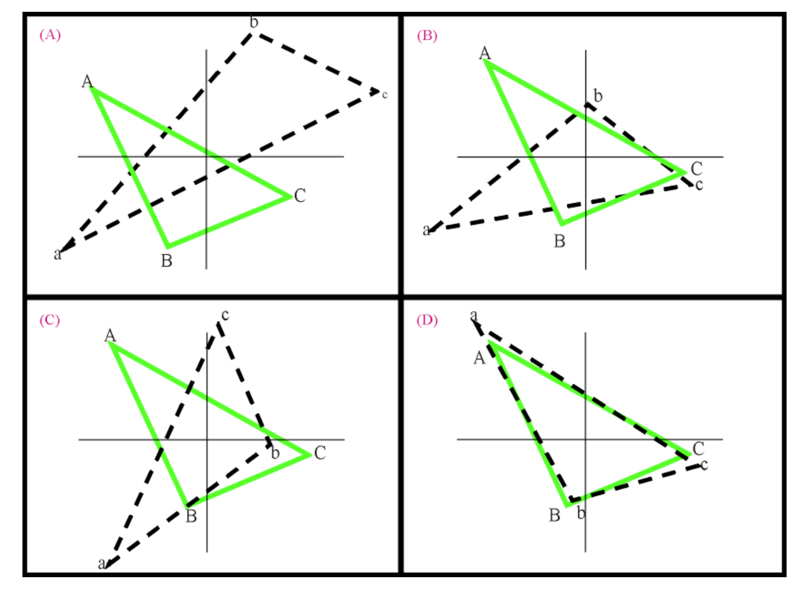
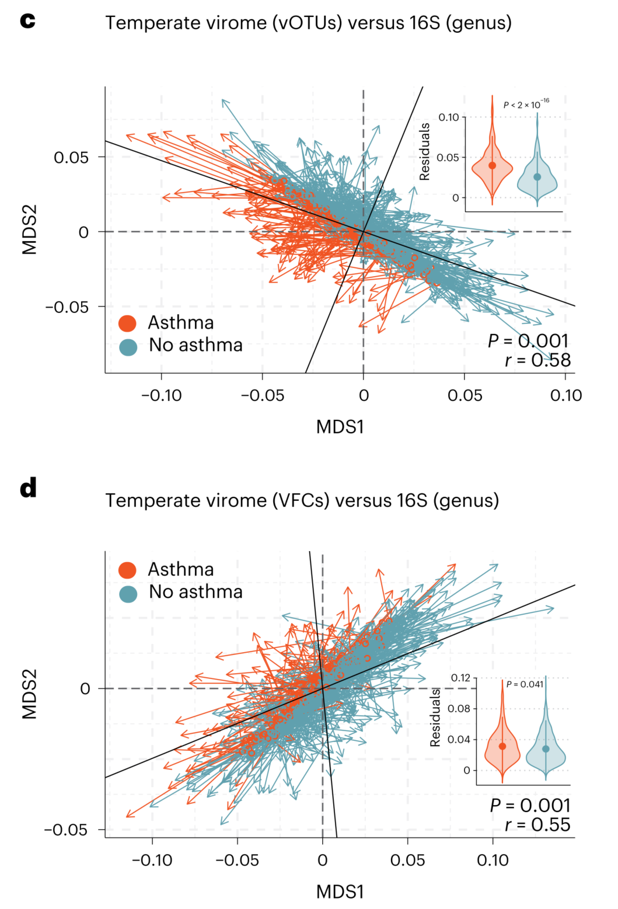
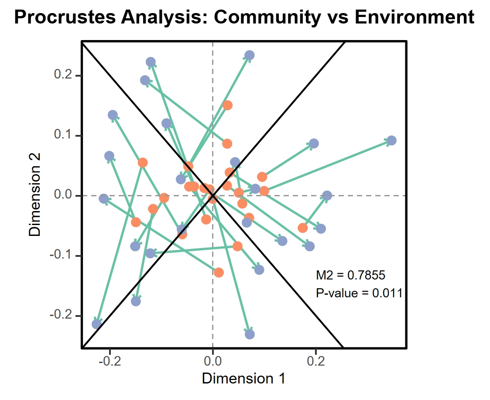

```{r setup, include=FALSE}
knitr::opts_chunk$set(
  collapse = T, echo=T, comment="#>", message=F, warning=F,
	fig.align="center", fig.width=5, fig.height=3, dpi=150)
```


The Procrustes analysis scripts is referenced from MicrobiomeStatPlot [Inerst Reference below].


If you use this script, please cited 如果你使用本代码，请引用：

**Yong-Xin Liu**, Lei Chen, Tengfei Ma, Xiaofang Li, Maosheng Zheng, Xin Zhou, Liang Chen, Xubo Qian, Jiao Xi, Hongye Lu, Huiluo Cao, Xiaoya Ma, Bian Bian, Pengfan Zhang, Jiqiu Wu, Ren-You Gan, Baolei Jia, Linyang Sun, Zhicheng Ju, Yunyun Gao, **Tao Wen**, **Tong Chen**. 2023. EasyAmplicon: An easy-to-use, open-source, reproducible, and community-based pipeline for amplicon data analysis in microbiome research. **iMeta** 2(1): e83. https://doi.org/10.1002/imt2.83

The online version of this tuturial can be found in https://github.com/YongxinLiu/MicrobiomeStatPlot


**Authors**
First draft(初稿)：Defeng Bai(白德凤)；Proofreading(校对)：Ma Chuang(马闯) and Xun Jiani(荀佳妮)；Text tutorial(文字教程)：Defeng Bai(白德凤)


# Introduction简介

## Procrutest Analysis 普鲁克分析

什么是普鲁克分析（Procrutest analysis）?
What is Procurement analysis?

参考：https://mp.weixin.qq.com/s/EXRo0VwPVhOX3biKBllS-g

普鲁克分析（Procrustes analysis）是一种通过分析形状分布，比较两组数据一致性德方法。在数学上，就是不断迭代，寻找标准形状（canonical shape）,并利用最小二乘法寻找每个对象形状到这个标准形状的仿射变化方式。该过程也称为最小二乘正交映射（least-squares orthogona mapping）。

Procrustes analysis is a method of comparing the consistency of two sets of data by analyzing shape distributions. In mathematics, it is to iteratively search for a canonical shape and use the least squares method to find the affine transformation of each object's shape to this standard shape. This process is also known as least squares orthogonal mapping.

普鲁克分析的过程：普鲁克分析基于匹配两个数据集中的对应点（坐标），通过平移、旋转和缩放其中一个数据集中点的坐标以匹配另一个数据集中对应的坐标，并最小化点坐标之间的偏差平方和（表示为M2）。对应点坐标之间的偏差称为矢量残差，小的矢量残差代表了两数据集具有更高的一致性。

The process of Procrutest analysis: Procrutest analysis is based on matching the corresponding points (coordinates) of two datasets, by translating, rotating, and scaling the coordinates of one dataset point to match the corresponding coordinates of the other dataset, and minimizing the sum of squared deviations between point coordinates (represented as M2). The deviation between the corresponding point coordinates is called vector residual, and a smaller vector residual represents higher consistency between the two datasets.


以此图为例，A图显示了投影到二维空间中的两数据集，两数据集中样本对应为A-a, B-b, C-c; B图表示平移坐标使质心对其，此时两数据集具有一个公共质心；C-D, 通过不断迭代旋转并缩放调整数据，使M2最小化。

Taking this figure as an example, Figure A shows two datasets projected into two-dimensional space, with samples corresponding to A-a, B-b, and C-c; Figure B represents the translation coordinate with the center of mass relative to it, where the two datasets have a common center of mass; C-D,  Minimize M2 by iteratively rotating and scaling the adjusted data.

普鲁克分析M2统计量的显著性检验（PROTEST）
普鲁克分析对两个数据集中点的坐标进行描述性总结和图形化比较，尽管M2统计量提供了对一致性的度量（M2越小表示两数据集关联度越高），但是并未评估M2是否比预期的更高（M2是否显著，而不是由偶然导致）。可通过置换检验的原理实验对M2显著性的检验，称为PROTEST或者PROcrustean randomization test。如果计算得到的p值达到显著性水平（如p<0.05），则可以认为原始观测值的M2并非偶然因素所致，两个数据集的期望值比在随机情况下表现出更大的一致性。

The Procrutest analysis provides a descriptive summary and graphical comparison of the coordinates of points in two datasets. Although the M2 statistic provides a measure of consistency (smaller M2 indicates higher correlation between the two datasets), it does not evaluate whether M2 is higher than expected (whether M2 is significant rather than accidental). The principle experiment of permutation test can be used to test the significance of M2, which is called the PROTEST or PROrustean randomization test. If the calculated p-value reaches a significance level (such as p<0.05), it can be considered that the M2 of the original observation value is not caused by accidental factors, and the expected values of the two datasets show greater consistency than in random situations.


关键字：微生物组数据分析、MicrobiomeStatPlot、普鲁克分析、R语言可视化

Keywords: Microbiome analysis, MicrobiomeStatPlot, Procrutest analysis, R visulization


## Application Cases of Procrutest Analysis 普鲁克分析应用案例


这是Jakob Stokholm课题组2023年发表于Nature Medicine上的文章，第一作者为Cristina Leal Rodríguez，题目为：The infant gut virome is associated with preschool asthma risk independently of bacteria. https://doi.org/10.1038/s41591-023-02685-x

This is an article published by the Jakob Stokholm research group in Nature Medicine in 2023. The first author is Cristina Leal Rodr í guez, and the title is: The incident gut virus is associated with pre-school astroma risk independently of bacteria. https://doi.org/10.1038/s41591-023-02685-x




Fig. 4 c,d, Plot of residuals from a Procrustes analysis showing the overall association between variation in the temperate virome and the bacterial composition (16S) using a constrained ordination with regards to preschool asthma using vOTUs (a) and VFCs (b). We used the Aitchison distances for both the virome and bacteriome data. Each arrow connects the temperate virome and the gut microbiome from the same child. The arrows point in the direction of the bacterial ordination. Longer lines on the Procrustes plot indicate more within-subject discordance (that is, difference between both compositions). Orange lines are children with preschool asthma, and blue lines are children without preschool asthma (n = 133 out of 498). The Procrustes randomization tests showed a significant relationship between the datasets (r = 0.58; P = 0.001; and r = 0.55; P = 0.001, for a and b, respectively). Inset violin plots display the distribution with mean ± s.d. of Procrustes residuals between children with and without asthma for each plot, P values are from Wilcoxon tests. All P values were two-sided.

图4c，d，Procrustes分析的残差图，显示了使用vOTU（a）和VFCs（b）对学龄前哮喘使用约束排序的温带病毒组变异和细菌组成（16S）之间的总体关联。我们对病毒组和细菌组数据都使用了Aitchison距离。每个箭头连接来自同一个孩子的温和病毒组和肠道微生物组。箭头指向细菌排序的方向。Procrustes图上较长的线表示受试者内部的不和谐（即两种构图之间的差异）更多。橙色线表示有学龄前哮喘的儿童，蓝色线表示没有学龄前哮喘（498人中有133人）。Procrustes随机化测试显示数据集之间存在显著关系（a和b分别为r=0.58；P=0.001；和r=0.55；P=0.001）。插入小提琴图显示了患有和不患有哮喘的儿童之间Procrustes残差的平均±s.d.分布，每个图的P值来自Wilcoxon检验。所有P值均为双侧。


**结果**：

Then, a Procrustes analysis, measuring how close the temperate virome and the bacteriome configurations are in relation to asthma, demonstrated a correlation between the two (species-level vOTUs, r = 0.58; P = 0.001; family-level VFCs, r = 0.55; P = 0.001). Furthermore, Procrustes residuals indicated that preschoolers with asthma consistently had the greatest discordance between the temperate virome and bacterial ordinations (Fig. 4c,d).

然后，Procrustes分析，测量了温带病毒组和细菌组结构与哮喘的关系，证明了两者之间的相关性（物种水平的vOTU，r=0.58；P=0.001；家族水平的VFCs，r=0.55；P=0.001）。此外，Procrustes残差表明，患有哮喘的学龄前儿童在温和的病毒组和细菌排列之间始终存在最大的不一致性（图4c，d）。


## Packages installation软件包安装

```{r}
# 基于CRAN安装R包，检测没有则安装
p_list = c("vegan", "ggplot2")
for(p in p_list){if (!requireNamespace(p)){install.packages(p)}
    library(p, character.only = TRUE, quietly = TRUE, warn.conflicts = FALSE)}

# 加载R包 Load the package
suppressWarnings(suppressMessages(library(vegan)))
suppressWarnings(suppressMessages(library(ggplot2)))
```


# Procrutest analysis普鲁克分析

## Procrutest analysis using R software 普鲁克分析实战

参考：https://mp.weixin.qq.com/s/VB6qEVW9iKflHEsyTZL1IQ

在微生态领域，该方法通常用于分析自相同样本不同数据集之间是否存在相似性关系。例如物种和环境、物种和功能基因等等，可以分析两个数据集之间的关联度或者是否存在潜在的一致性

In the field of microecology, this method is commonly used to analyze whether there is a similarity relationship between different datasets from the same sample. For example, species and environment, species and functional genes, etc., can be analyzed to determine the correlation or potential consistency between two datasets

可以利用R语言vegan包中的procrustes和protest两个函数来实现普鲁克分析，并用ggplot2包完成对应分析的绘图。

Pruke analysis can be implemented using the procrustes and test functions in the R language vegan package, and the corresponding analysis can be plotted using the ggplot2 package.

```{r Procrustes analysis, fig.show='asis', fig.width=4, fig.height=2.5}
# Load data
# 载入数据
data(varespec)
data(varechem)

# 计算样本之间的距离矩阵
# Calcualte distance matrix
species_dist <- vegdist(varespec, method = "bray")
env_dist <- vegdist(scale(varechem), method = "euclidean")

# 使用NMDS进行降维
# Downscale using NMDS
nmds_species <- monoMDS(species_dist)
nmds_env <- monoMDS(env_dist)

# 普鲁克分析
# Procrustes analysis
proc_result <- procrustes(nmds_species, nmds_env, symmetric = TRUE)
summary(proc_result)

# 显著性检验
# Significance test
set.seed(1)
proc_test <- protest(nmds_species, nmds_env, permutations = 999)
proc_test

# 提取坐标数据
# Extract coordinates
procrustes_data <- as.data.frame(cbind(proc_result$Yrot, proc_result$X))
rotation_matrix <- as.data.frame(proc_result$rotation)

# 绘制图形
# Plot
pdf("results/Procrustes_Analysis_with_Crosslines2.pdf", width = 5, height = 5) 
ggplot(procrustes_data) +
  geom_segment(aes(x = V1, y = V2, xend = MDS1, yend = MDS2), 
               color = "#66C2A5", size = 1, arrow = arrow(length = unit(0.25, 'cm'))) +
  geom_point(aes(V1, V2), color = "#FC8D62", size = 4, shape = 16) +
  geom_point(aes(MDS1, MDS2), color = "#8DA0CB", size = 4, shape = 16) +
  theme_classic(base_size = 16) +
  theme(
    panel.border = element_rect(color = "black", fill = NA, size = 1), 
    panel.grid = element_blank(),
    panel.background = element_rect(fill = "transparent", color = NA),
    axis.ticks.length = unit(0.4, "lines"),
    axis.line = element_blank(), 
    axis.title = element_text(size = 14),
    axis.text = element_text(size = 12),
    plot.title = element_text(hjust = 0.5, size = 18, face = "bold")
  ) +
  labs(x = "Dimension 1", y = "Dimension 2", 
       title = "Procrustes Analysis: Community vs Environment") +
  geom_vline(xintercept = 0, color = "grey60", linetype = "dashed", size = 0.5) +
  geom_hline(yintercept = 0, color = "grey60", linetype = "dashed", size = 0.5) +
  geom_abline(slope = 1, intercept = 0, color = "black", size = 0.8) +
  geom_abline(slope = -1, intercept = 0, color = "black", size = 0.8) + 
  annotate("text", label = paste("M2 =", round(proc_test$ss, 4), 
                                 "\nP-value =", format.pval(proc_test$signif)),
           x = 0.2, y = -0.15, size = 4, hjust = 0)
dev.off()
```




If used this script, please cited:
使用此脚本，请引用下文：

**Yong-Xin Liu**, Lei Chen, Tengfei Ma, Xiaofang Li, Maosheng Zheng, Xin Zhou, Liang Chen, Xubo Qian, Jiao Xi, Hongye Lu, Huiluo Cao, Xiaoya Ma, Bian Bian, Pengfan Zhang, Jiqiu Wu, Ren-You Gan, Baolei Jia, Linyang Sun, Zhicheng Ju, Yunyun Gao, **Tao Wen**, **Tong Chen**. 2023. EasyAmplicon: An easy-to-use, open-source, reproducible, and community-based pipeline for amplicon data analysis in microbiome research. **iMeta** 2: e83. https://doi.org/10.1002/imt2.83

Copyright 2016-2024 Defeng Bai <baidefeng@caas.cn>, Chuang Ma <22720765@stu.ahau.edu.cn>, Jiani Xun <15231572937@163.com>, Yong-Xin Liu <liuyongxin@caas.cn>
