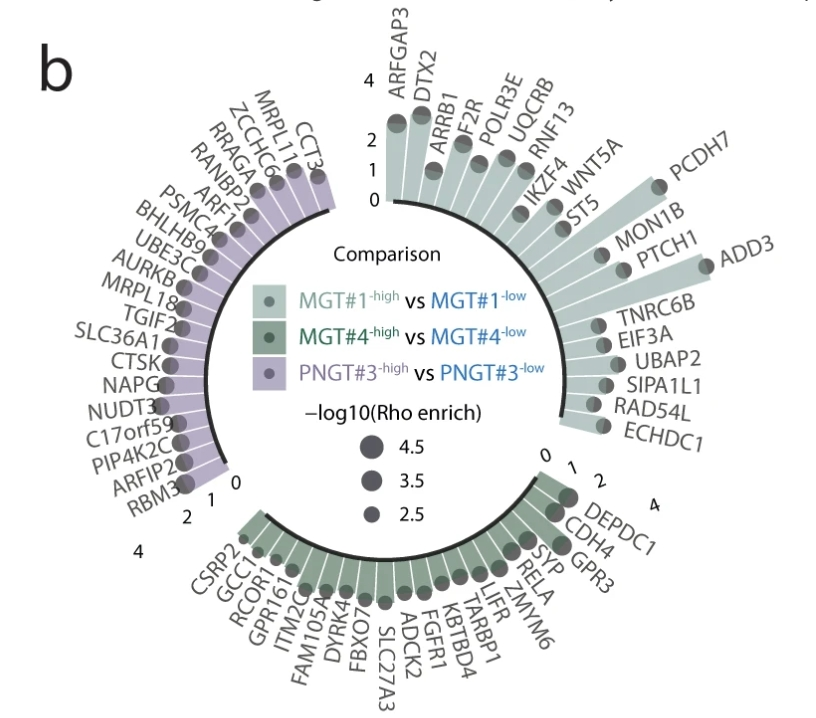
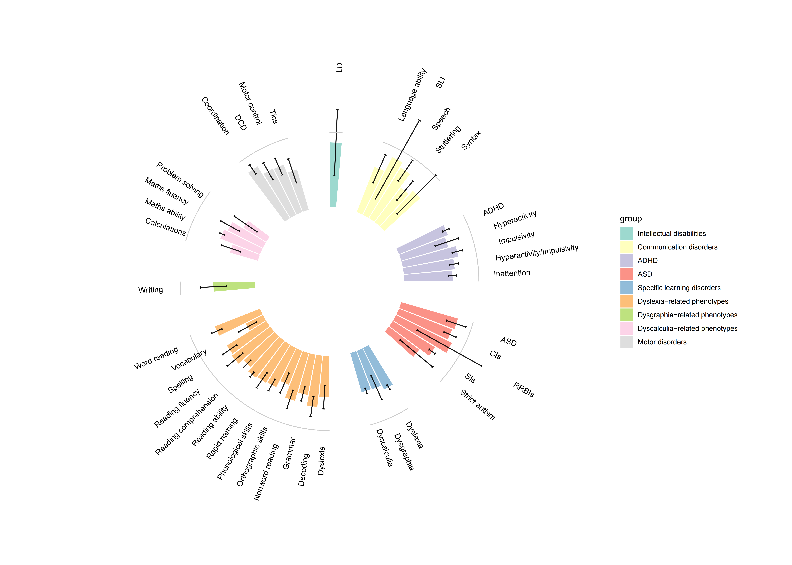
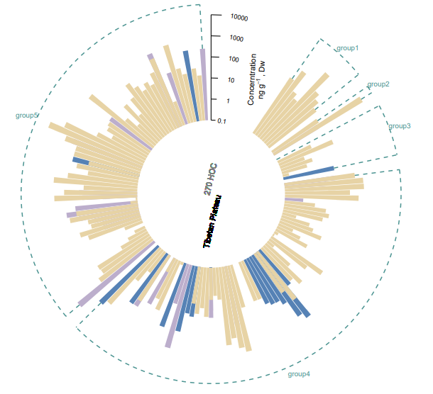
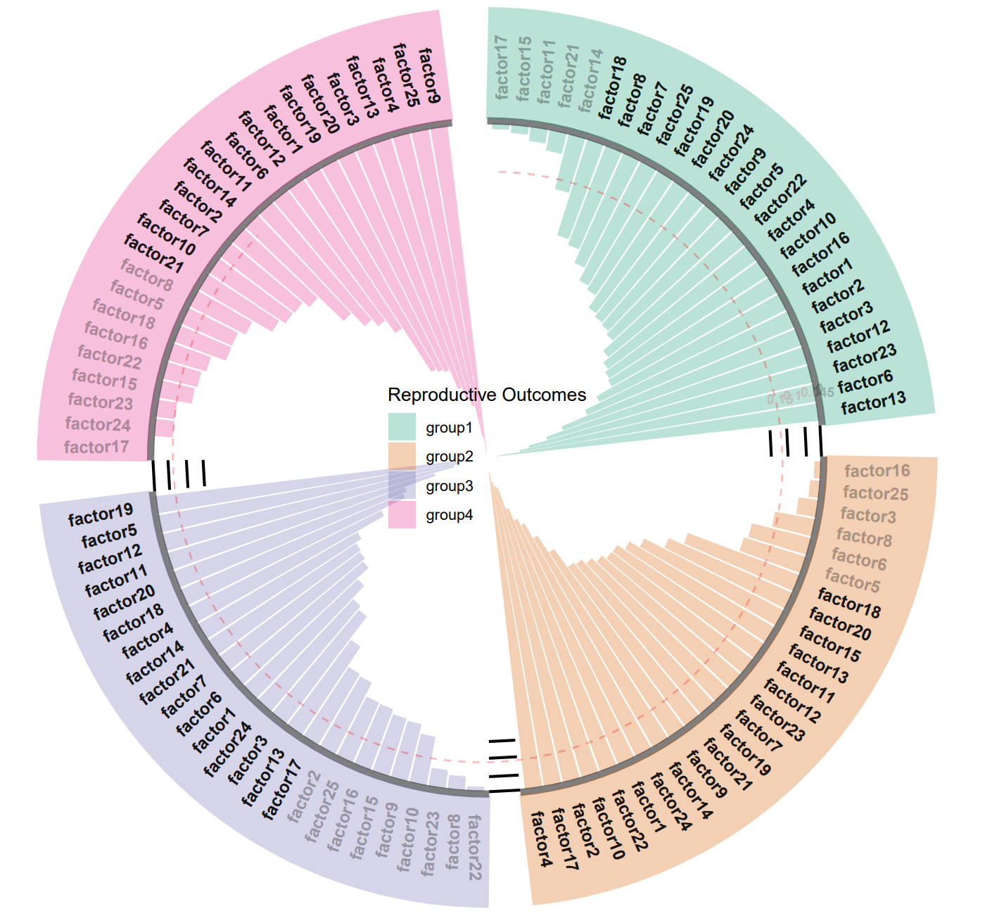
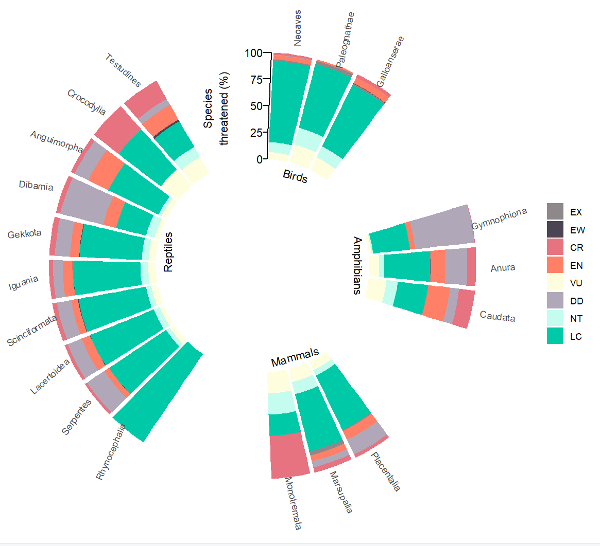

```{r setup, include=FALSE}
knitr::opts_chunk$set(
  collapse = T, echo=T, comment="#>", message=F, warning=F,
	fig.align="center", fig.width=5, fig.height=3, dpi=150)
```


The Ring bar plot scripts is referenced from MicrobiomeStatPlot [Inerst Reference below].

If you use this script, please cited 如果你使用本代码，请引用：

**Yong-Xin Liu**, Lei Chen, Tengfei Ma, Xiaofang Li, Maosheng Zheng, Xin Zhou, Liang Chen, Xubo Qian, Jiao Xi, Hongye Lu, Huiluo Cao, Xiaoya Ma, Bian Bian, Pengfan Zhang, Jiqiu Wu, Ren-You Gan, Baolei Jia, Linyang Sun, Zhicheng Ju, Yunyun Gao, **Tao Wen**, **Tong Chen**. 2023. EasyAmplicon: An easy-to-use, open-source, reproducible, and community-based pipeline for amplicon data analysis in microbiome research. **iMeta** 2(1): e83. https://doi.org/10.1002/imt2.83

The online version of this tuturial can be found in https://github.com/YongxinLiu/MicrobiomeStatPlot


**Authors**
First draft(初稿)：Defeng Bai(白德凤)；Proofreading(校对)：Ma Chuang(马闯) and Jiani Xun(荀佳妮)；Text tutorial(文字教程)：Defeng Bai(白德凤)


# Introduction简介

什么是环形柱状图？
What is Ring bar plot?

环形柱状图（circular barplot）是将柱状图的柱子排列成环形的一种图表形式。它可以在视觉上给人以更具吸引力和不一样的展示效果，尤其适合展示带有周期性或循环性质的数据。例如，可以用来表示一天24小时内的活动模式、一年12个月的变化趋势等.与传统的柱状图不同，环形柱状图的柱子不是沿着水平或垂直轴排列的，而是沿着一个圆的周围排列。环形柱状图能在有限空间内展示更多的类别。

Circular barplot (circular barplot) is a form of chart in which the bars of a bar chart are arranged in a circular shape. It gives a more visually appealing and different presentation, and is particularly suitable for presenting data that is periodic or cyclical in nature. For example, it can be used to show activity patterns over a 24-hour day, trends over a 12-month year, etc... Unlike traditional bar charts, the bars of a circular bar chart are not arranged along a horizontal or vertical axis, but rather along the perimeter of a circle. A circular bar chart can show more categories in a limited space.


关键字：微生物组数据分析、MicrobiomeStatPlot、环形柱状图、R语言可视化

Keywords: Microbiome analysis, MicrobiomeStatPlot, Ring bar chart , R visulization


## Ring bar plot example  弧线图案例

参考文献：https://www.nature.com/articles/s41467-024-45069-6

这是马克斯-德尔布吕赫分子医学中心Gaetano Gargiulo团队2024年发表于NC上的一篇论文用到的图。论文题目为：Logical design of synthetic cis-regulatory DNA for genetic tracing of cell identities and state changes. https://doi.org/10.1038/s41467-024-45069-6

This is the figure used in a paper published in NC in 2024 by Gaetano Gargiulo's team at the Max Delbrüch Centre for Molecular Medicine. The paper is entitled: Logical design of synthetic cis-regulatory DNA for genetic tracing of cell identities and state changes. https://doi.org/10.1038/s41467-024-45069-6




Figure 6. Convergence of LSD, genome-wide CRISPR activation and patients' datasets towards the discovery of cell-state-specific drivers.
图 6. 将 LSD、全基因组 CRISPR 激活和患者数据集汇聚在一起，以发现细胞状态特异性驱动因素。

**结果**
Unbiased analysis of the dataset using robust rank aggregation and enrichment over the reporter-low fraction uncovered genes whose potential amplification by multiple sgRNAs could drive reporter-specific upregulation (Fig. 6b and Supplementary Dataset S2). Strikingly, we found RELA among the MGT4 screen top hits (Fig. 6b and Supplementary Dataset S2): RELA is one of the NF-kB transcription factors that we previously identified as an MGT1 regulator under homeostatic conditions in glioblastoma-initiating cells in both focused loss-of-function experiments and genome-scale CRISPR KO screens.

利用稳健的等级聚合和对报告基因低水平部分的富集对数据集进行无偏分析，发现了可能被多个sgRNA扩增的基因，这些基因可能驱动报告基因特异性上调（图 6b 和补充数据集 S2）。引人注目的是，我们在MGT4筛选的热门基因中发现了RELA（图6b和补充数据集S2）：RELA是NF-kB转录因子之一，我们之前在聚焦功能缺失实验和基因组规模的CRISPR KO筛选中都发现它是胶质母细胞瘤启动细胞平衡条件下的MGT1调控因子。


## Packages installation软件包安装


```{r}
# 基于CRAN安装R包，检测没有则安装 Installing R packages based on CRAN and installing them if they are not detected
p_list = c("ggplot2", "reshape2",  "dplyr", "cowplot", "likert", "tidyverse", 
           "export", "RColorBrewer", "readxl")
for(p in p_list){if (!requireNamespace(p)){install.packages(p)}
    library(p, character.only = TRUE, quietly = TRUE, warn.conflicts = FALSE)}

# 加载R包 Loading R packages
suppressWarnings(suppressMessages(library(ggplot2)))
suppressWarnings(suppressMessages(library(reshape2)))
suppressWarnings(suppressMessages(library(cowplot)))
suppressWarnings(suppressMessages(library(likert)))
suppressWarnings(suppressMessages(library(tidyverse)))
suppressWarnings(suppressMessages(library(export)))
suppressWarnings(suppressMessages(library(RColorBrewer)))
suppressWarnings(suppressMessages(library(readxl)))
```


# Ring bar plot 环形柱状图

## Ring bar plot using R software 环形柱状图R语言实战

参考：https://mp.weixin.qq.com/s/jbUe7PvSP9BmldWFyvP9IQ
https://mp.weixin.qq.com/s/X4cmEAjCs_ukmolii6tuTQ


```{r Ring Bar Chart, fig.show='asis', fig.width=4, fig.height=2.5}
# 加载数据 Load data
data <- read.table("data/data_circle.txt", header = TRUE, row.names = 1, sep = "\t", comment.char = "")

# 数据整理 Data processing
data$pheno <- factor(data$pheno, levels = unique(data$pheno))
data$group <- factor(data$group, levels = unique(data$group))
data$group <- reorder(data$group, data$pheno)
data$id <- seq_len(nrow(data))

# 添加空行，避免图表过度拥挤
# Add blank lines to avoid overcrowding the chart
empty_bar <- 3
to_add <- data.frame(matrix(NA, empty_bar * nlevels(data$group), ncol(data)))
colnames(to_add) <- colnames(data)
to_add$group <- rep(levels(data$group), each = empty_bar)
data <- rbind(data, to_add)

# 更新id以适应新数据集
# Updating ids for new datasets
data <- data %>% arrange(group)
data$id <- seq_len(nrow(data))

# 标签数据
# Label data
label_data <- data
number_of_bar <- nrow(label_data)
angle <- 90 - 360 * (label_data$id - 0.5) / number_of_bar
label_data$hjust <- ifelse(angle < -90, 1, 0)
label_data$angle <- ifelse(angle < -90, angle + 180, angle)

# 计算组的起始和终止位置以便绘制网格
# Calculate the start and end positions of groups to draw the grid
base_data <- data %>%
  group_by(group) %>%
  dplyr::summarize(start = min(id), end = max(id) - empty_bar) %>%
  rowwise() %>%
  mutate(title = mean(c(start, end)))

# 绘制柱形图
# Drawing bar plot
p <- ggplot(data, aes(x = as.factor(id), y = est, fill = group)) +
  geom_bar(stat = "identity", width = 0.9, alpha = 0.85) + 
  geom_errorbar(aes(ymin = est - se, ymax = est + se), width = 0.2, size = 0.6, alpha = 0.9) +
  coord_polar() +  
  scale_fill_brewer(palette = "Set3") +  
  theme_minimal() +  
  theme(
    legend.position = "right",
    axis.text = element_blank(),
    axis.title = element_blank(),
    panel.grid = element_blank()
  ) +
  ylim(-1, max(data$est + data$se) + 1)  

# 添加网格线
# Add grid line
grid_data <- base_data %>%
  mutate(start = start - 0.5, end = end + 0.5)
for (i in seq(0, 1, by = 0.2)) {
  p <- p + geom_segment(data = grid_data, aes(x = start, xend = end, y = i, yend = i), color = "grey80", size = 0.4)
}

# 添加标签
# Add labels
p <- p + geom_text(data = label_data, aes(x = id, y = est + se + 0.5, label = pheno, angle = angle, hjust = hjust), size = 3.5, color = "black")

# 保存最终图形
# Save plots
ggsave(filename = "results/Circle_bar_plot.pdf", plot = p, width = 14, height = 10)
```





### Practice2 实战2

第二种样式
The second type

https://mp.weixin.qq.com/s/9W-wd1LB1XI3EDFqiFlddw
数据来源：https://www.nature.com/articles/s41561-023-01293-1#Sec22

```{r Ring Bar Chart2, fig.show='asis', fig.width=4, fig.height=2.5}
# Load data
# 载入数据
data2 <- read.table("data/data_practice2.txt", header = TRUE, sep = "\t", comment.char = "")

# Log10转化
# Log10-transformation
data3 <- data.frame(data2[,1:2], map_df(data2[,3:5], ~log10(.) + 1))
data3[,3:5][data3[,3:5] < 0] = 0
head(data3)

# 在不同的分组间插入用于分隔的间隙
# Insert gaps between different groups to separate them
emptybar<- 1 
empty<- data.frame(matrix(NA, emptybar*nlevels(factor(data3$Group))+floor((nrow(data3)+4)/9), 
        ncol(data3)))

# 四个间隙+一个大约为40度大间隔，用于后续放置刻度线
# Four gaps + a large gap of about 40 degrees for subsequent placement of tick marks
colnames(empty)<- colnames(data3)
empty$Group<- c(rep(levels(factor(data3$Group)), each = emptybar),
     rep("Group5", floor((nrow(data3)+4)/9)))

# 将大间隔设置为Group5，后续会将其消除
# Set the large interval to Group5, which will be eliminated later
head(empty)

# 整合数据, 将数据空行插入原始数据，按Group排序
# Integrate data, insert blank rows into original data, and sort by Group
data3 <- rbind(data3, empty) %>% arrange(Group)
data3$id<- seq(1, nrow(data3))
head(data3)
data3 <- data3[c(16:159,1:15),]

# 绘制基础的柱状图
# Plot
p1 <- ggplot(data3, aes(x = as.factor(id)))+ 
  geom_bar(aes(y = PNER), stat="identity", alpha = 1, fill = "#BCAECC")+
  geom_bar(aes(y = CNER), stat="identity", alpha = 1, fill = "#5682B5")+
  geom_bar(aes(y = EF), stat="identity", alpha = 1, fill = "#E7D3A5")+#三组数据
  scale_fill_manual(values = c("#5CB85C", "#337AB7", "#F0AD4E", "#D9534F"))
#p1

# 添加分组的绿色虚线
# Add grouped green dashed lines
# 列出每个分组中的第一个和最后一个数据，用于画竖线
# List the first and last data in each group for drawing vertical lines
group_data1<- subset(data3, Sample %in% c("sample1", "sample8", "sample9", "sample10",
        "sample11", "sample18","sample19", "sample82","sample83", "sample139"))

# 选出三列数据中最大的一个，避免虚线画进柱子内部
# Select the largest of the three columns to avoid drawing dotted lines inside the column
group_data1$high<- apply(group_data1[,3:5], 1, max) 

# 得到5组画横线的数据
# Get 5 sets of data for drawing horizontal lines
group_data2<- data.frame(matrix(group_data1$id, byrow = T,
          ncol = 2, nrow = 5),
          Group = paste0("Group", 1:5)) |>
  setNames(c("x", "xend", "Group"))
head(group_data2)

# 绘图
# Plot
p2 <- p1 +
  geom_segment(data = group_data1, aes(x = id, y = high, xend = id, yend = 5.5), 
               color = "#1C7875", alpha = 0.8, size = 0.7, lty = 2)+
  geom_segment(data = group_data2, aes(x = x, y = 5.5, xend = xend, yend = 5.5),
               color = "#1C7875", alpha = 0.8, size = 0.7, lty = 2)+
  #设置圆环外围和中间空心圆大小
  #Set the size of the outer ring and the hollow circle in the middle
  ylim(-3.5, 6)+
  theme_minimal()+
  theme(legend.position = "none",
        axis.text = element_blank(),
        axis.title = element_blank(),
        panel.grid = element_blank())+
  coord_polar() 
#p2

# 添加刻度线
# Add tick marks
axis_data<- data.frame(x = 0.5, xend = 2,
                       y = c(0, 1, 2, 3, 4, 5),
                       yend = c(0, 1, 2, 3, 4, 5),
                       label = c(0.1, 1, 10, 100, 1000, 10000))
head(axis_data)

# 基于每一组第一个和最后一个位置，确定绿色框线的分组标签位置
# Based on the first and last positions of each group, determine the group label position of the green frame line
base_data <- data3 %>% 
  group_by(Group) %>% 
  dplyr::summarize(start = min(id), end = max(id) - emptybar) %>% 
  rowwise() %>% 
  mutate(title = mean(c(start, end))) %>% 
  filter(Group != "Group5")

# 绘图
# Plot
p3 <- p2 +
  annotate(geom = "segment", 
           x = 0.5, xend = 0.5, y = 0, yend = 5) + 
  geom_segment(data = axis_data,
               aes(x = x, xend = xend, y = y, yend = yend),
               inherit.aes = FALSE)+#添加刻度轴
  geom_text(data = axis_data, aes(x = 5.5, y = y, label = label),
            inherit.aes = T, hjust = 0.9, angle = -10, size = 3)+#添加刻度轴上的数字
  annotate(geom = "text", x = 12, y = 2.5,
           label = expression("Concerntration\n","ng"~g^{-1}~", Dw"),
           angle = 87, vjust = -0.1)+#y轴标签名
  geom_text(x = -80, y = -2.2, label = "Tibetan Plateau", size = 4,
          angle = 77, color = "black")+
  geom_text(x = -80, y = -4.2, label = "270 HOC", size = 4, 
            angle = 77, color = "grey50")+#内圆中的标签
  geom_text(data = base_data[,], aes(x = title, y = 6, label = Group),
            colour = "#1C7875", alpha = 0.8, size = 3.5, inherit.aes = FALSE)
#p3

# 保存最终图形
# Save plots
ggsave(filename = "results/Circle_bar_plot2.pdf", plot = p3, width = 14, height = 10)
```





### Practice3 实战3

内向环形柱状图
Inner direction circle bar plot

```{r Ring Bar Chart3, fig.show='asis', fig.width=4, fig.height=2.5}
# 导入数据
# Load data
data <- read.table("data/data_circle3.txt", header = TRUE, sep = "\t", comment.char = "")
head(data)
data$value <- round(data$value,4)

# 每组间添加间隔
# Add gaps
empty_bar <- 2 

# 将group列转换为因子变量
# group as factor
data$group <- as.factor(data$group) 

# 创建一个空的数据框to_add
# A new dataframe
to_add <- data.frame( matrix(NA, empty_bar*nlevels(data$group), ncol(data)))

# 创建一个空的数据框to_add
# A new dataframe
colnames(to_add) <- colnames(data)

# 为to_add数据框的group列赋值，使得每个组别之间2个空行
# Assign values to the group column of the to_add data frame so that there are 2 blank rows between each group
to_add$group <- rep(levels(data$group), each=empty_bar)

# 将to_add数据框添加到原数据集data中，实现在每组之间插入空行的效果
# Add the to_add data frame to the original data set data to insert blank rows between each group
data <- rbind(data, to_add) 

# 对数据集按照group列进行排序
# Sort the data set by the group column
data <- data %>% arrange(group)

# 为数据集添加一个新的列id，用来重新编号数据集的行
# Add a new column id to the dataset to renumber the rows of the dataset
data$id <- seq(1, nrow(data))
head(data)


# 添加各个变量标签在图中的角度信息和对齐方式
# Add angle information and alignment of each variable label in the graph

# 对数据集data按照group列和value列进行排序，确保每个组内的数据按照value的大小顺序排列
# Sort the data set data by the group column and the value column to ensure that the data in each group is arranged in order of value
data = data %>% arrange(group, value)

# 为数据集添加一个新的列id，用来重新编号数据集的行
# Add a new column id to the dataset to renumber the rows of the dataset
data$id <- seq(1, nrow(data))

# 设置添加label标签信息
# Add label info
label_data <- data

# 计算数据集中的总行数，用于后续计算标签在图中的角度信息
# Calculate the total number of rows in the data set for subsequent calculation of the angle information of the label in the figure
number_of_bar <- nrow(label_data)

# 根据数据集中每行的编号计算标签在图中的角度信息，使得标签可以环绕图片
# Calculate the angle information of the label in the image according to the number of each row in the dataset, so that the label can surround the image
angle <- 90 - 360 * (label_data$id-1.3) /number_of_bar

# 根据角度信息判断标签的对齐方式，如果角度大于-90度，则左对齐；否则右对齐
# Determine the alignment of the label based on the angle information. If the angle is greater than -90 degrees, it is left-aligned; otherwise, it is right-aligned.
label_data$hjust <- ifelse(angle < -90, 1, 0)

# 根据角度信息调整标签的角度，使得标签在不同位置可以正确显示
# Adjust the angle of the label according to the angle information so that the label can be displayed correctly in different positions
label_data$angle <- ifelse(angle < -90, angle+180, angle)


# 添加各组数据在图片上的起止位置，用于刻度线等的定位
# Add the start and end positions of each group of data on the image for positioning of scale lines, etc.
# 按照group列对数据集进行分组，然后对每个组计算起始位置和结束位置的定位信息，并计算每个组的标题位置
# Group the data set according to the group column, then calculate the starting and ending position information for each group, and calculate the title position of each group
base_data <- data %>%   
  group_by(group) %>%     
  dplyr::summarize(start=min(id), end=max(id) - empty_bar) %>% 
  rowwise() %>%   
  mutate(title=mean(c(start, end)))


# 添加各组数据在图片上的间隔定位信息，用于刻度线等的定位
# Add the interval positioning information of each group of data on the picture, which is used for positioning of scale lines, etc.
# 将之前计算得到的base_data数据框赋值给grid_data，用于添加间隔的起始和结束位置信息
# Assign the previously calculated base_data data frame to grid_data to add the start and end position information of the interval
grid_data <- base_data

# 将grid_data数据框中end列的值向下平移一行，并加上0.7，用于确定间隔的结束位置
# Shift the value of the end column in the grid_data data frame down one row and add 0.7 to determine the end position of the interval
grid_data$end <- grid_data$end[c(nrow(grid_data), 1:nrow(grid_data)-1)] + 0.7

# 将grid_data数据框中start列的值向上平移0.7，用于确定间隔的起始位置
# Shift the value of the start column in the grid_data data frame upward by 0.7 to determine the starting position of the interval
grid_data$start <- grid_data$start - 0.7

# 删除grid_data数据框中的第一行，因为第一行的起始位置和结束位置已经确定，不需要再添加间隔信息
# Delete the first row in the grid_data data frame, because the starting and ending positions of the first row have been determined, and there is no need to add interval information
grid_data <- grid_data[-1,]


# 绘图(Plot)
# 绘制分组环状条形图
# Draw a grouped donut bar chart
p4 <- ggplot(data, aes(x=as.factor(id),  
                      y=-value, fill=group)) +
  geom_bar(stat="identity", alpha=0.3) + 
  scale_fill_brewer(type = "qual", palette = "Dark2")+ 
  #限制Y轴的上下限，用于调节图片的显示效果
  #Limit the upper and lower limits of the Y axis to adjust the display effect of the image
  ylim(-1,0.45) + 
  geom_segment(data=grid_data, aes(x = end, y = -0.15, xend = start, yend = -0.15), 
               colour = "black", alpha=1, size=0.8 , inherit.aes = FALSE ) +  
  geom_segment(data=grid_data, aes(x = end, y = -0.1, 
                                   xend = start, yend = -0.1), colour = "black", 
               alpha=1, size=0.8 , inherit.aes = FALSE ) +  
  geom_segment(data=grid_data, aes(x = 1, y = -0.145, xend = 94.7, yend = -0.045), 
               linetype="dashed", colour = "red", 
               alpha=0.1, size=0.5 , inherit.aes = FALSE ) +  
  geom_segment(data=grid_data, 
               aes(x = end, y = 0, xend = start, yend = 0), 
               colour = "black", alpha=1, size=0.8 , inherit.aes = FALSE )+
  geom_segment(data=grid_data, aes(x = end, y = -0.045,
                               xend = start, yend = -0.045),
               colour = "black",  alpha=1, size=0.8 , inherit.aes = FALSE ) +
  annotate("text", x = rep(23.8,4), y = c(-0.145, -0.095, -0.042, 0.005), 
           label = c("0.15", "0.1", "0.045", "0") , 
           family="sans", color="grey", size=2.8 , angle=0, fontface="bold", hjust=0) +  
  theme_minimal() +  theme( legend.position=c(.5,.5),  
                               axis.title = element_blank(), 
                               panel.grid = element_blank(),
                               axis.text.x = element_blank(),
                               plot.margin = unit(rep(0,8), "cm")) +  
  labs(family="sans",fill = "Reproductive Outcomes")+ 
  coord_polar() +  
  geom_segment(data=base_data, aes(x = start-0.7, y = 0.007, xend = end+0.7, yend = 0.007), 
               colour = "black", alpha=0.5, size=2 , inherit.aes = FALSE ) +
  geom_segment(data=base_data , aes(x = start-0.7, y = 0.18, xend = end+0.7, yend = 0.18),
               colour = brewer.pal(4,"Dark2"), alpha=0.3, size=31 , inherit.aes = FALSE )+
  geom_text(data=label_data, aes(x=id, y=0.07, label=sample, hjust=hjust),
            color="black", fontface="bold",alpha=ifelse(label_data$value > 0.245, 0.9, 0.3),
            size=3.5, angle= label_data$angle, inherit.aes = FALSE
            )
#p4

# 保存最终图形
# Save plots
ggsave(filename = "results/Circle_bar_plot3.pdf", plot = p4, width = 14, height = 10)
```





### Practice4 实战4

环状堆叠柱状图
Circle stacked bar plot

```{r Ring Bar Chart4, fig.show='asis', fig.width=4, fig.height=2.5}
# 载入数据
# Load data
dat01<-read_excel("data/41586_2022_4664_MOESM3_ESM.xlsx",
                  sheet = "Fig 1b",na="NA")

# 给数据集增加一列用来做x
# Add a column for x-axis
dat01 %>% 
  ggpubr::mutate(new_x = rep(paste0('X',formatC(1:31,width = 2,flag = 0)),each=8)) -> dat01

# 最基本的堆积柱形图
# Basic stack bar plot
p51 <- ggplot(data = dat01,aes(x=new_x,y=n,fill=rlCodes))+
  geom_bar(stat = "identity",position = "fill")

# 变成环状
# Circilize
p52 <- ggplot(data = dat01,aes(x=new_x,y=n,fill=rlCodes))+
  geom_bar(stat = "identity",position = "fill")+
  coord_polar()+
  ylim(-1,NA)

# 修改细节
# Change details
p53 <- ggplot(data = dat01,aes(x=new_x,y=n,fill=rlCodes))+
  geom_bar(stat = "identity",position = "fill")+
  coord_polar()+
  scale_x_discrete(expand = expansion(add = 0),
                   labels=coalesce(dat01$orderName[seq(1,248,8)],""))+
  scale_y_continuous(limits = c(-1,NA))+
  theme(axis.text.x = element_text(angle = cumsum(c(90,-rep(12,15))),
                                   vjust=0,hjust = 1),
        panel.background = element_blank(),
        axis.text.y = element_blank(),
        axis.title = element_blank(),
        axis.ticks = element_blank())
#p53

# 修改颜色，添加标签
# Change color and add labels
p54 <- p53 + 
  annotate(geom = "text",x=2,y=-0.1,label="Birds",angle=-15)+
  annotate(geom = "text",x=8,y=-0.1,label="Amphibians",angle=-90)+
  annotate(geom = "text",x=14,y=-0.1,label="Mammals",angle=15)+
  annotate(geom = "text",x=24,y=-0.1,label="Reptiles",angle=90)+
  scale_fill_manual(values = c("LC"="#00c9a7","NT"="#c4fcef",
                               "DD"="#b0a8b9","VU"="#fefedf",
                               "EN"="#ff8066","CR"="#e77381",
                               "EW"="#4b4453","EX"="#8f888b"),
                    limits=c("EX","EW","CR","EN","VU","DD","NT","LC"),
                    name="")
# p54

# 添加坐标轴
# Add axis lables
new_dat01<-data.frame(
  x=0.5,xend=0.3,
  y=c(0,0.25,0.5,0.75,1),
  yend=c(0,0.25,0.5,0.75,1)
)
new_dat02<-data.frame(x=0.3,
                      y=c(0,0.25,0.5,0.75,1),
                      label=c(0,0.25,0.5,0.75,1)*100)
p55 <- p54 + annotate(geom = "segment",
           x=0.5,xend=0.5,y=0,yend=1)+
  geom_segment(data=new_dat01,
               aes(x=x,xend=xend,y=y,yend=yend),
               inherit.aes = FALSE)+
  geom_text(data=new_dat02,aes(x=x,y=y,label=label),
            inherit.aes = FALSE,hjust=1)+
  annotate(geom = "text",x=30,y=0.5,label="Species\nthreatened (%)",
           angle=90,vjust=-0.1)

# 保存最终图形
# Save plots
ggsave(filename = "results/Circle_bar_plot4.pdf", plot = p55, width = 14, height = 10)
```





If used this script, please cited:
使用此脚本，请引用下文：

**Yong-Xin Liu**, Lei Chen, Tengfei Ma, Xiaofang Li, Maosheng Zheng, Xin Zhou, Liang Chen, Xubo Qian, Jiao Xi, Hongye Lu, Huiluo Cao, Xiaoya Ma, Bian Bian, Pengfan Zhang, Jiqiu Wu, Ren-You Gan, Baolei Jia, Linyang Sun, Zhicheng Ju, Yunyun Gao, **Tao Wen**, **Tong Chen**. 2023. EasyAmplicon: An easy-to-use, open-source, reproducible, and community-based pipeline for amplicon data analysis in microbiome research. **iMeta** 2: e83. https://doi.org/10.1002/imt2.83

Copyright 2016-2024 Defeng Bai <baidefeng@caas.cn>, Chuang Ma <22720765@stu.ahau.edu.cn>, Jiani Xun <15231572937@163.com>, Yong-Xin Liu <liuyongxin@caas.cn>

