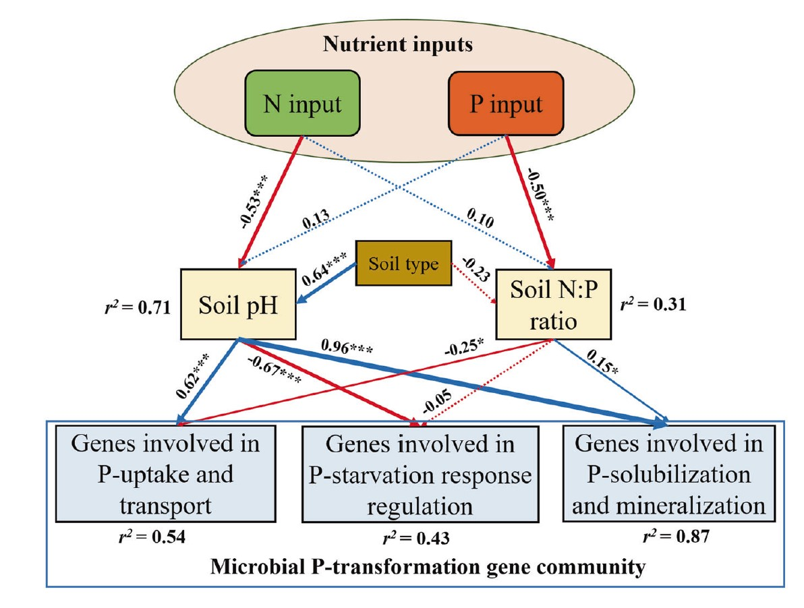
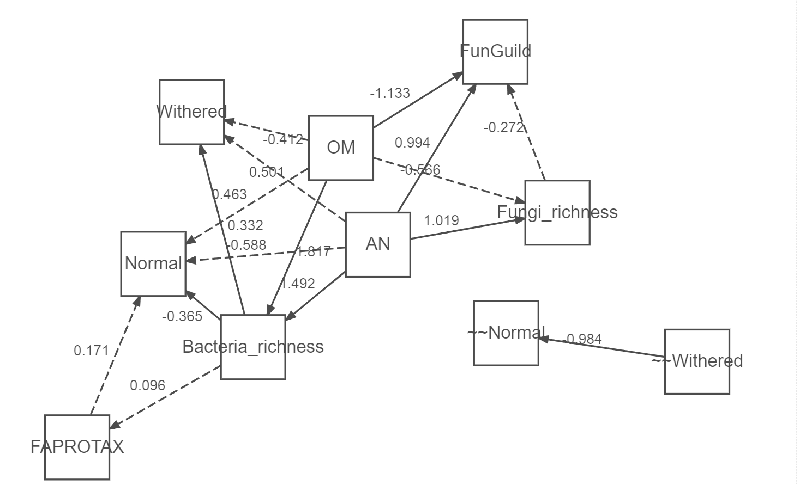

```{r setup, include=FALSE}
knitr::opts_chunk$set(
  collapse = T, echo=T, comment="#>", message=F, warning=F,
	fig.align="center", fig.width=5, fig.height=3, dpi=150)
```


The Structural equation model analysis scripts is referenced from MicrobiomeStatPlot [Inerst Reference below].


If you use this script, please cited 如果你使用本代码，请引用：

**Yong-Xin Liu**, Lei Chen, Tengfei Ma, Xiaofang Li, Maosheng Zheng, Xin Zhou, Liang Chen, Xubo Qian, Jiao Xi, Hongye Lu, Huiluo Cao, Xiaoya Ma, Bian Bian, Pengfan Zhang, Jiqiu Wu, Ren-You Gan, Baolei Jia, Linyang Sun, Zhicheng Ju, Yunyun Gao, **Tao Wen**, **Tong Chen**. 2023. EasyAmplicon: An easy-to-use, open-source, reproducible, and community-based pipeline for amplicon data analysis in microbiome research. **iMeta** 2(1): e83. https://doi.org/10.1002/imt2.83

The online version of this tuturial can be found in https://github.com/YongxinLiu/MicrobiomeStatPlot


**Authors**
First draft(初稿)：Defeng Bai(白德凤)；Proofreading(校对)：Ma Chuang(马闯) and Xun Jiani(荀佳妮)；Text tutorial(文字教程)：Defeng Bai(白德凤)


# Introduction简介

参考：https://mp.weixin.qq.com/s/O90XZRBQK-WLa0zzdoCmfQ

什么是结构方程模型？
What is a structural equation model?

结构方程模型（Structural Equation Modeling,SEM）是综合因素分析、回归分析与路径分析而逐步形成的一门统计方法，是一种建立、评估和检验因果关系模型的方法。模型中既包含可观测的显在变量，也可能包含无法直接观测的潜在变量。SEM可以替代多元回归、路径分析、因子分析、协方差分析等方法，清晰分析单项指标对总体的作用和单项指标间的相互关系。与传统分析方法相比，结构方程模型在了解变量之间的共变关系的同时，能够解释模型中变量尽可能多的变异。一般用SEM来解释变量的变异或者变量之间的共变（variation and covariation）;用验证性因子分析探究潜变量和显变量之间的关系；用潜增长曲线模型（LGM）估计纵向数据的初始、变化、结构斜率和方法；用路径分析探究变量之间的因果。
Structural Equation Modeling (SEM) is a statistical method gradually formed by integrating factor analysis, regression analysis, and path analysis. It is a method for establishing, evaluating, and testing causal relationship models. The model may contain both observable and latent variables that cannot be directly observed. SEM can replace methods such as multiple regression, path analysis, factor analysis, and covariance analysis to clearly analyze the impact of individual indicators on the population and the interrelationships between individual indicators. Compared with traditional analysis methods, structural equation modeling can explain as much variation as possible in the model while understanding the covariation relationship between variables. SEM is generally used to explain the variation of variables or the covariation between variables; Exploring the relationship between latent and significant variables using confirmatory factor analysis; Estimating the initial, changing, structural slope, and method of longitudinal data using the latent growth curve model (LGM); Exploring causal relationships between variables through path analysis.

潜变量：潜变量是无法直接测量或观察到的变量，需借由一组观察变量间接地测量或观察来做推论，测量地方法可以来自调查或各种测验等。比如评估一个人的颜值时，颜值就是潜变量，它可以用五官比例、身高等具体数值来加以量化。
Latent variables: Latent variables are variables that cannot be directly measured or observed, and need to be indirectly measured or observed through a set of observed variables to make inferences. The measurement method can come from surveys or various tests. For example, when evaluating a person's appearance, appearance is a latent variable that can be quantified using specific values such as facial features ratio and height.

观察变量：观察变量是可直接测量地变量，是一组变量的集合，用来定义或推论潜变量。
Observing variables: Observing variables are directly measurable variables, a collection of variables used to define or infer latent variables.

外生变量：外生变量指的是模型中不受其他变量影响的变量。
Exogenous variables: Exogenous variables refer to variables in the model that are not affected by other variables.

内生变量：内生变量指的是模型中受到其他变量所影响的变量。这些通常是模型中的依赖变量，而外甥变量不受模型中其他变量的影响，而是影响内生变量。内生变量通常有箭头指向他们，而外生变量则没有。
Endogenous variables: Endogenous variables refer to variables in the model that are influenced by other variables. These are usually dependent variables in the model, while nephew variables are not affected by other variables in the model, but rather affect endogenous variables. Endogenous variables usually have arrows pointing towards them, while exogenous variables do not.

直接效应和间接效应：直接效应是两个变量之间的直接关系，其中一个变量影响另一个变量。而间接效应中，一个或多个变量在模型中介导这种关系。
Direct and indirect effects: Direct effects are the direct relationship between two variables, where one variable affects the other. In indirect effects, one or more variables mediate this relationship in the model.

如何评估构建的结构方程模型？
How to evaluate the constructed structural equation model?

卡方（Chi-square): 非显著值表明拟合度好，但有时由于对大样本敏感，不能总依赖卡方值，因为大样本量可能导致显著的p值，无论模型拟合度如何。
Chi square: Non significant values indicate good fit, but sometimes due to sensitivity to large samples, it is not always possible to rely on chi square values because large sample sizes may lead to significant p-values, regardless of the model's fit.

均方根误差近似值（RMSEA, Root Mean Square Error of Approximation）：小于0.05被认为是好的拟合，0.05-0.08之间表示合理拟合。高于1被认为拟合度差。
Root Mean Square Error of Approximation (RMSEA): A value less than 0.05 is considered a good fit, and a value between 0.05 and 0.08 indicates a reasonable fit. A value higher than 1 is considered to have poor fit.

比较拟合指数（CFI, Comparative Fit Index）和塔克-刘易斯指数（TLI，Tucker-Lewis Index）:0.9以上表明拟合度好，0.95以上表明极佳的拟合。
Comparative Fit Index (CFI) and Tucker Lewis Index (TLI): above 0.9 indicates good fit, above 0.95 indicates excellent fit.

标准化均方根残差（SRMR, Standardized Root Mean Square
Residual）:0.08或以下被认为是好的拟合，0.08到0.10之间表示合理拟合。高于0.10被认为拟合度差。
Standardized Root Mean Square Residual (SRMR): 0.08 or less is considered a good fit, and a range of 0.08 to 0.10 indicates a reasonable fit. Exceeding 0.10 is considered poor fit.


结构方程模型常见的类型有哪些？
What are the common types of structural equation models?

1.路径分析（Path analysis)
路径分析是一种没有潜变量的SEM分析方法。它直接测定变量间的相互关系。一般来说，可以使用相关分析查看相关程度，或者使用RDA分析、主成分分析、随机森林确定重要变量等方法，提前选取某些具有代表性的变量进行模型构建。
Path analysis is a SEM analysis method without latent variables. It directly measures the interrelationships between variables. Generally speaking, correlation analysis can be used to examine the degree of correlation, or methods such as RDA analysis, principal component analysis, and random forest can be used to determine important variables, and representative variables can be selected in advance for model construction.

2.验证性因素分析（Confirmatory Factor Analysis）
验证性因素分析，是带有潜变量的SEM构建方法。验证性因素分析可以理解为在路径分析中加入了无法直接观测到的变量后获得的SEM。
Confirmatory factor analysis is a SEM construction method with latent variables. Confirmatory factor analysis can be understood as SEM obtained by adding variables that cannot be directly observed in path analysis.

3.分段结构方程模型（piecewise SEM）
分段结构方程模型，是由Shipley于2000年提出的一种更加灵活的构建SEM方式。它将传统的SEM模型分段隔开来，单独对每组的关系进行独立估计，最后将所有路径拼凑起来构建因果模型。由于每段模型需要单独估计，所以其建模过程会更加复杂，其支持交互作用、非正态响应模式、随机效应和层次模型等多种建模技术。分段结构方程模型有其自身的有时，比如样本数量可以较小，变量的正态性及变量间的独立性要求不高等优点。
The segmented structural equation model is a more flexible approach to constructing SEM, proposed by Shipley in 2000. It separates traditional SEM models into segments, independently estimates the relationships of each group, and finally pieces together all paths to construct a causal model. Due to the separate estimation required for each model segment, its modeling process becomes more complex, supporting various modeling techniques such as interaction, non normal response patterns, random effects, and hierarchical modeling. The segmented structural equation model has its own advantages, such as small sample size, low requirements for normality of variables, and low independence between variables.

4.偏最小二乘路径模型（Pls-sem）
偏最小二乘路径模型（Partial least squares path model）,是一种更适合探索多变量间相互关系的方法，它最大的优点是能应用于中小样本数据分析中，大样本数据同样适合，并且对数据的正态性及独立性要求并不高，也允许使用潜变量来预测因果关系或模型，其对原始数据进行降维，然后提取主成分数据放入模型中，然后获得主成分的权重，实现最优模型构建。PLS-PM是由两个模块组成，包括Inner model/structural model(某些潜变量与其它潜变量相关联)和Measurement model/outer model（观测变量与其自身的潜变量相关联）。观测变量的意思为实际可测定的变量，如身高、体重等，潜变量就是无法测定的变量，如颜值。
The Partial Least Squares path model is a more suitable method for exploring the relationships between multiple variables. Its biggest advantage is that it can be applied to the analysis of small and medium-sized sample data, and large sample data is also suitable. It does not require high normality and independence of the data, and also allows the use of latent variables to predict causal relationships or models. It reduces the dimensionality of the original data, extracts principal component data into the model, and then obtains the weights of the principal components to achieve optimal model construction. PLS-PM consists of two modules, including the Inner model/structural model (some latent variables are associated with other latent variables) and the Measurement model/outer model (observation variables are associated with their own latent variables). The meaning of observational variables is actually measurable variables, such as height, weight, etc., while latent variables are unmeasurable variables, such as appearance.


关键字：微生物组数据分析、MicrobiomeStatPlot、结构方程模型、R语言可视化

Keywords: Microbiome analysis, MicrobiomeStatPlot, Structural equation model, R visulization


## Structural Equation Modeling Case 结构方程模型案例

本研究是浙江大学徐建明（Jianming XU）团队与2019年发表在ISME（Dai et al., 2019）上的一篇论文。题目为：Long-term nutrient inputs shift soil microbial functional profiles of phosphorus cycling in diverse agroecosystems. https://doi.org/10.1038/s41396-019-0567-9

This study is a paper published in ISME (Dai et al., 2019) by the team of Jianming XU from Zhejiang University. The title is: Long term nutrient inputs shift soil microbial functional profiles of physiology cycling in diverse agroecosystems. https://doi.org/10.1038/s41396-019-0567-9



Fig. 6 Structural equation model (SEM) illustrating how the N and P inputs influenced the gene composition for microbial P-transformation by changing soil pH and N:P stoichiometry. Solid and dashed arrows represent the significant and nonsignificant relationships between different variables. Adjacent values near the arrows indicate path coefficients. r2 values indicate the proportion of variance explained by each variable. Significance levels are denoted with *p < 0.05, **p < 0.01, and ***p < 0.001.

图 6 结构方程模型 (SEM)，说明通过改变土壤 pH 值和氮磷比结构，氮和磷的输入如何影响微生物磷转化的基因组成。实线和虚线箭头表示不同变量之间的显著和不显著关系。箭头附近的相邻值表示路径系数。r2 值表示每个变量解释的变异比例。显著性水平用 *p < 0.05、**p < 0.01 和 ***p < 0.001 表示。

**结果**：

Based on the SEM, N inputs significantly affected the genes involved in microbial P-transformation by decreasing soil pH, while P inputs significantly affected the genes involved in microbial P-transformation by decreasing soil N:P ratio (Fig. 6). The decrease in soil pH induced by N inputs had positive effects on the genes involved in inorganic P-solubilization and organic Pmineralization (with an estimated value of 0.96, p < 0.05) and the genes involved in P-uptake and transport (0.62, p < 0.05), and had negative effects on the genes involved in P-starvation response regulation (−0.67, p < 0.05) (Fig. 6). The decreases in soil N:P ratio induced by P inputs had positive effects on the genes involved in inorganic P-solubilization and organic P- mineralization (with an estimated value of 0.15, p < 0.05), and had negative effects on the genes involved in P-uptake and transport (−0.25, p < 0.05) (Fig. 6).

根据 SEM，氮的输入通过降低土壤 pH 值对参与微生物 P 转化的基因有显著影响，而磷的输入通过降低土壤氮磷比对参与微生物 P 转化的基因有显著影响（图 6）。氮输入引起的土壤 pH 值降低对参与无机钾溶解和有机钾矿化的基因（估计值为0.96，p＜0.05）以及参与钾吸收和转运的基因（0.62，p＜0.05）有正向影响，而对参与钾饥饿响应调控的基因（-0.67，p＜0.05）有负向影响（图 6）。钾输入引起的土壤氮磷比下降对参与无机钾溶解和有机钾矿化的基因有积极影响（估计值为 0.15，p < 0.05），对参与钾吸收和运输的基因有消极影响（-0.25，p < 0.05）（图 6）。


## Packages installation软件包安装

```{r}
# 基于CRAN安装R包，检测没有则安装
p_list = c("lavaan", "semPlot", "nlme", "piecewiseSEM", "car")
for(p in p_list){if (!requireNamespace(p)){install.packages(p)}
    library(p, character.only = TRUE, quietly = TRUE, warn.conflicts = FALSE)}

# 加载R包 Load the package
suppressWarnings(suppressMessages(library(lavaan)))
suppressWarnings(suppressMessages(library(semPlot)))
suppressWarnings(suppressMessages(library(nlme)))
suppressWarnings(suppressMessages(library(piecewiseSEM)))
suppressWarnings(suppressMessages(library(car)))
```


# Structural equation model

## Constructing Structural Equation Models in R Language R语言构建结构方程模型

### Practice 1 实战1

```{r SEM, fig.show='asis', fig.width=4, fig.height=2.5}
# 读取数据
# Load data
mydata <- read.csv("data/meta.csv", row.names = 1)
mydata$status_dummy <- ifelse(mydata$status == 2, 1, 0)

# 获取数值变量，并排除status和status_dummy列
# Get the numeric variables and exclude the status and status_dummy columns
numeric_vars <- names(mydata)[sapply(mydata, is.numeric)]
numeric_vars_to_scale <- numeric_vars[!(numeric_vars %in% c("status", "status_dummy"))]

# 对数值变量进行标准化
# Standardize numerical variables
mydata_scaled <- mydata
mydata_scaled[, numeric_vars_to_scale] <- scale(mydata[, numeric_vars_to_scale])

# 定义SEM模型
# Define SEM model
model <- '
  latentBact =~ Bacteria_richness  
  latentFung =~ Fungi_richness  
  latentFAPROTAX =~ FAPROTAX  
  latentFunGuild =~ FunGuild

  latentBact ~ OM + status_dummy
  latentFung ~ OM + status_dummy
  latentFAPROTAX ~ OM + status_dummy
  latentFunGuild ~ OM + status_dummy

  latentBact ~~ latentFung
'

# 拟合模型
# Fit model
fit <- sem(model, data = mydata_scaled, int.ov.free = TRUE)

# 保存模型摘要、系数和ANOVA结果到文件
# Save model summary, coefficients, and ANOVA results to file
capture.output(
  summary(fit),          
  coef(fit),            
  anova(fit),           
  file = "data/model01_stats.txt"
)

# 绘制结构方程模型图，优化布局与配色
# Draw a structural equation model diagram and optimize the layout and color matching
# sem_plot <- semPaths(
#   fit,
#   what = "est",                 # 显示路径系数(Display path coefficients)
#   edge.label.cex = 1.0,          # 增大边标签的字号(Increase edge label font size)
#   layout = "tree2",              # 使用更清晰的树状布局(Use a clearer tree layout)
#   style = "lisrel",              # 使用Lisrel样式，简化图形(Use Lisrel styles to simplify graphics)
#   color = list(lat = "#76C7C0", man = "#F7C04A", edge = "gray50"),  # 自定义颜色(Define color)
#   sizeMan = 8,                   # 设置观测变量的节点大小(Set the node size of the observation variable)
#   sizeLat = 10,                  # 设置潜在变量的节点大小(Setting the node size of latent variables)
#   residuals = FALSE,             # 不显示残差(Do not display residuals)
#   mar = c(6, 6, 6, 6)            # 设置边距，增加空间感(Set margins to increase the sense of space)
# )

# 保存为高分辨率PDF
# Save plot
pdf("results/SEM_Plot01.pdf", width = 10, height = 8)
semPaths(fit, what = "est", edge.label.cex = 1.0, layout = "tree2",
         style = "lisrel", color = list(lat = "#76C7C0", man = "#F7C04A", edge = "gray50"),
         sizeMan = 8, sizeLat = 10, residuals = FALSE, mar = c(6, 6, 6, 6))
dev.off()

# 保存为高分辨率PNG
# Save plot
png("results/SEM_Plot01.png", width = 1200, height = 960, res = 150)
semPaths(fit, what = "est", edge.label.cex = 1.0, layout = "tree2",
         style = "lisrel", color = list(lat = "#76C7C0", man = "#F7C04A", edge = "gray50"),
         sizeMan = 8, sizeLat = 10, residuals = FALSE, mar = c(6, 6, 6, 6))
dev.off()
# 这只是草图，最终的主图还需要用AI手动修改
# This is just a sketch, the final main picture still needs to be manually modified using AI
```


### Practice 2 实战2

```{r SEM2, fig.show='asis', fig.width=4, fig.height=2.5}
# 分类变量(Categorical variables)
# Load data
exp_data_func <- read.csv("data/meta.csv", row.names = 1)
exp_data_func$BactR <- exp_data_func$`Bacteria_richness `
exp_data_func$FungR <- exp_data_func$`Fungi_richness`
exp_data_func$FAPR <- exp_data_func$`FAPROTAX`
exp_data_func$FunG <- exp_data_func$`FunGuild`

# Sem models    
psem_cat<-psem(
  lme(Bacteria_richness ~ OM + AN , 
       random =~ 1|Soiltype, data=exp_data_func, method="ML"),
  lme(Fungi_richness ~ OM + AN, 
      random =~ 1|Soiltype, data=exp_data_func, method="ML"),
  lme(FAPROTAX ~ Bacteria_richness, 
      random =~ 1|Soiltype, data=exp_data_func, method="ML"),
  lme(FunGuild ~ OM + Fungi_richness + AN, 
      random =~ 1|Soiltype, data=exp_data_func, method="ML"),
  lme(Withered ~ OM + Bacteria_richness + AN ,
      random =~ 1|Soiltype, data=exp_data_func, method="ML"),
  lme(Normal ~ Bacteria_richness + AN + OM + FAPROTAX, 
      random =~ 1|Soiltype, data=exp_data_func, method="ML"),
  Normal %~~% Withered,
  data=exp_data_func
)
#summary(psem_cat)

# 获取summary的输出
# Get the output of the summary
sum_output <- capture.output(summary(psem_cat)) 

# 将AIC、卡方等输出保存为TXT文件
# Save AIC, chi square, and other outputs as TXT files
writeLines(sum_output, "results/psem_cat_summary.txt")

# 提取系数估计值
# Extract estimated coefficient values
coefs(psem_cat)

# 获取模型的系数
# Obtain the coefficients of the model
model_coefs <- coefs(psem_cat)  

# 将系数保存为model2.txt文件
# Save the coefficients as a model2.txt file
write.table(model_coefs, file="results/model2.txt", sep="\t", row.names=FALSE, quote=FALSE)

# 绘制模型图
# Draw a model diagram
# plot(psem_cat)
# 这只是草图，最终的主图还需要用AI手动修改
# This is just a sketch, the final main picture still needs to be manually modified using AI
```





If used this script, please cited:
使用此脚本，请引用下文：

**Yong-Xin Liu**, Lei Chen, Tengfei Ma, Xiaofang Li, Maosheng Zheng, Xin Zhou, Liang Chen, Xubo Qian, Jiao Xi, Hongye Lu, Huiluo Cao, Xiaoya Ma, Bian Bian, Pengfan Zhang, Jiqiu Wu, Ren-You Gan, Baolei Jia, Linyang Sun, Zhicheng Ju, Yunyun Gao, **Tao Wen**, **Tong Chen**. 2023. EasyAmplicon: An easy-to-use, open-source, reproducible, and community-based pipeline for amplicon data analysis in microbiome research. **iMeta** 2: e83. https://doi.org/10.1002/imt2.83

Copyright 2016-2024 Defeng Bai <baidefeng@caas.cn>, Chuang Ma <22720765@stu.ahau.edu.cn>, Jiani Xun <15231572937@163.com>, Yong-Xin Liu <liuyongxin@caas.cn>
