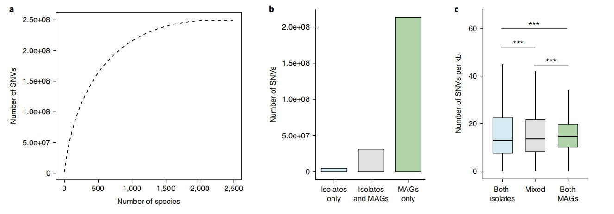

```{r setup, include=FALSE}
knitr::opts_chunk$set(
  collapse = T, echo=T, comment="#>", message=F, warning=F,
	fig.align="center", fig.width=5, fig.height=3, dpi=150)
```


The SNV analysis scripts is referenced from MicrobiomeStatPlot [Inerst Reference below].


If you use this script, please cited 如果你使用本代码，请引用：

**Yong-Xin Liu**, Lei Chen, Tengfei Ma, Xiaofang Li, Maosheng Zheng, Xin Zhou, Liang Chen, Xubo Qian, Jiao Xi, Hongye Lu, Huiluo Cao, Xiaoya Ma, Bian Bian, Pengfan Zhang, Jiqiu Wu, Ren-You Gan, Baolei Jia, Linyang Sun, Zhicheng Ju, Yunyun Gao, **Tao Wen**, **Tong Chen**. 2023. EasyAmplicon: An easy-to-use, open-source, reproducible, and community-based pipeline for amplicon data analysis in microbiome research. **iMeta** 2(1): e83. https://doi.org/10.1002/imt2.83

The online version of this tuturial can be found in https://github.com/YongxinLiu/MicrobiomeStatPlot


**Authors**
First draft(初稿)：Defeng Bai(白德凤)；Proofreading(校对)：Ma Chuang(马闯) and Xun Jiani(荀佳妮)；Text tutorial(文字教程)：Defeng Bai(白德凤)


# Introduction简介

参考：https://mp.weixin.qq.com/s/bGTEkYNhQV9qz-RGlXKdcA

SNV, 全称为single-nucleotide variants, 中文为单核苷酸变异，其描述的是基因组中单个核苷酸位置的变异，不考虑该变异再人群中的频率。SNV是单个核苷酸的变异，不受频率限制，可能出现在体细胞中。体细胞单核苷酸变异（例如由癌症引起）也可称为单核苷酸变异。在高通量测序数据中，有许多的SNV可以被检测到。在精准医疗领域，SNV可以作为蛋白质功能丧失和疾病风险的实用标志物，还可以确定对靶向疗法有响应的患者，并用来预测一些人类疾病的治疗效果和预后信息。

SNV, the full name of which is single-nucleotide variants, is a single nucleotide variation in Chinese. It describes the variation of a single nucleotide position in the genome, regardless of the frequency of the variation in the population. SNV is a variation of a single nucleotide, which is not limited by frequency and may occur in somatic cells. Somatic single nucleotide variations (such as those caused by cancer) can also be called single nucleotide variations. In high-throughput sequencing data, many SNVs can be detected. In the field of precision medicine, SNV can be used as a practical marker for protein function loss and disease risk, and can also identify patients who respond to targeted therapies and be used to predict the treatment effect and prognosis information of some human diseases.


关键字：微生物组数据分析、MicrobiomeStatPlot、单核苷酸变异分析、R语言可视化

Keywords: Microbiome analysis, MicrobiomeStatPlot, SNV analysis, R visulization


## SNV analysis example 单核苷酸变异分析案例

这是来自于欧洲生物信息研究所Robert D. Finn团队2021年发表于Nature Biotechnology上的一篇论文用到的SNV分析。论文题目为：A unified catalog of 204,938 reference genomes from the human gut microbiome. https://doi.org/10.1038/s41587-020-0603-3

This is the SNV analysis used in a paper published in Nature Biotechnology in 2021 by Robert D. Finn's team from the European Bioinformatics Institute. The title of the paper is: A unified catalog of 204,938 reference genomes from the human gut microbiome. https://doi.org/10.1038/s41587-020-0603-3




Fig. 6 Analysis of intraspecies single-nucleotide variation. a, Total number of SNVs detected as a function of the number of species. The cumulative 
distribution was calculated after ordering the species by decreasing number of SNVs. b, Number of SNVs detected only in isolate genomes or MAGs, or 
in both. c, Pairwise SNV density analysis of genomes of the same or different type (isolates, n= 808,331 comparisons; mixed, n= 1,575,895 comparisons; 
MAGs, n= 26,899,457 comparisons). A two-tailed Wilcoxon rank-sum test was performed to assess statistical significance and further adjusted for 
multiple comparisons using the Benjamini–Hochberg correction (***P< 0.001).

图 6 物种内单核苷酸变异分析。a，检测到的 SNV 总数与物种数量的关系。按 SNV 数量递减对物种进行排序后计算累积分布。b，仅在分离基因组或 MAG 中检测到的 SNV 数量，或两者兼而有之。c，相同或不同类型的基因组的成对 SNV 密度分析（分离物，n= 808,331 次比较；混合，n= 1,575,895 次比较；MAG，n= 26,899,457 次比较）。进行双尾 Wilcoxon 秩和检验以评估统计显着性，并使用 Benjamini-Hochberg 校正进一步调整多重比较（***P< 0.001）。


**结果**

We next investigated intraspecies single-nucleotide variants (SNVs) within the UHGG species. We generated a catalog consisting of 249,435,699 SNVs from 2,489 species with three or more conspecific genomes (Fig. 6a). For context, a previously published catalog contained 10.3 million single-nucleotide polymorphisms from 101 gut microbiome species. Of note, more than 85% of these SNVs were exclusively detected in MAGs, whereas only 2.2% were exclusive to isolate genomes (Fig. 6b). We found the overall pairwise SNV density between MAGs to be higher than that observed between isolate genomes (Fig. 6c). This was irrespective of the level of strain heterogeneity of the MAGs, as there was no correlation between SNV density and the degree of strain heterogeneity estimated with CMseq 
(Extended Data Fig. 10).

接下来，我们研究了 UHGG 物种内的种内单核苷酸变异 (SNV)。我们生成了一个目录，其中包含来自 2,489 个具有三个或更多同种基因组的物种的 249,435,699 个 SNV（图 6a）。作为背景，之前发布的目录包含来自 101 种肠道微生物组的 1030 万个单核苷酸多态性。值得注意的是，超过 85% 的 SNV 仅在 MAG 中检测到，而只有 2.2% 仅在分离基因组中检测到（图 6b）。我们发现 MAG 之间的整体成对 SNV 密度高于分离基因组之间的密度（图 6c）。这与 MAG 的菌株异质性水平无关，因为 SNV 密度与使用 CMseq 估计的菌株异质性程度之间没有相关性（扩展数据图 10）。


## SNV analysis 单核苷酸变异分析实战

SNV分析代码主要在linux环境中运行

参考：https://github.com/zjshi/snv_analysis_almeida2019

```{bash}
# 安装mummer软件
# Install mummer
wget -c https://github.com/mummer4/mummer/releases/download/v4.0.0rc1/mummer-4.0.0rc1.tar.gz
# 解压Unzip
tar -zxvf mummer-4.0.0rc1.tar.gz

cd mummer-4.0.0rc1/
# 配置文件configure files
./configure --prefix=/data5/baidefeng//miniconda3/envs/mummer
# 通过make工具进行编译软件 Compile the software using the make tool
make
make install
export PATH=$PATH:/data5/baidefeng//miniconda3/envs/mummer/bin
echo 'export PATH=$PATH:/data5/baidefeng//miniconda3/envs/mummer/bin' >> ~/.bashrc
source ~/.bashrc

# SNV分析流程 SNV analysis pipeline
git clone https://github.com/zjshi/snv_analysis_almeida2019.git


# 获取所有SNV集合目录 Get all SNV collection catalogs
mkdir -p GUT_GENOME000067_CATALOG
SPECIES=GUT_GENOME000067
GENOMES_DIR=$SPECIES
PAIRS_IN=input_catalog_pairs.tsv
OUTPUT_DIR=$SPECIES"_CATALOG"
while IFS= read -r pair
do
    genome1=$(echo $pair | cut -d' ' -f1)
    genome2=$(echo $pair | cut -d' ' -f2)

    GB_PATH_1=$GENOMES_DIR/$genome1.fna
    GB_PATH_2=$GENOMES_DIR/$genome2.fna

    nucmer $GENOMES_DIR/$genome1.fna $GENOMES_DIR/$genome2.fna --prefix $OUTPUT_DIR/$genome1-$genome2 --threads 1
    delta-filter -q -r $OUTPUT_DIR/$genome1-$genome2.delta > $OUTPUT_DIR/$genome1-$genome2.filter.delta
    show-coords $OUTPUT_DIR/$genome1-$genome2.filter.delta > $OUTPUT_DIR/$genome1-$genome2.coords
    show-snps $OUTPUT_DIR/$genome1-$genome2.filter.delta > $OUTPUT_DIR/$genome1-$genome2.snps
    show-diff $OUTPUT_DIR/$genome1-$genome2.filter.delta > $OUTPUT_DIR/$genome1-$genome2.diff

	echo "done whole genome alignment for $genome1 and $genome2"
done < $PAIRS_IN

ls $OUTPUT_DIR/ | grep snps | cut -d'.' -f1 | xargs -I[] bash -c 'sed "1,5d" '$OUTPUT_DIR'/[].snps | awk "$0"' '$2 != "." && $3 != "." {printf "%s\t%s||%s||%s||%s\n", "[]", $14, $1, $2, $3}' | cut -f2 | LC_ALL=C sort -k2,2 -S20G --parallel=4 | uniq -c | awk '$1 > 1 {print $2}' > $SPECIES.snps.list

python3 generate_catalog.py --shared $SPECIES.snps.list --in-list <(ls $OUTPUT_DIR/*.snps) --out $SPECIES.catalog.tsv

sed -i "1s/$SPECIES-//g" $SPECIES.catalog.tsv

echo $SPECIES | xargs -I[] bash -c 'head -n 1 [].catalog.tsv | awk "$0"' '{for (i=1; i <= NF; ++i) {if ($i == "[]") {print "[]",i}}}' | awk '{printf "cut -f1-%s,%s- %s.catalog.tsv > %s.catalog.noAuto.tsv\n", $2-1, $2+1, $1, $1}' | xargs -I[] bash -c "[]"

python bin_snps_by_source.py --catalog $SPECIES.catalog.noAuto.tsv --name $SPECIES --genome-info <(cut -f1,22 ./genomes_metadata.tsv) > $SPECIES.continentBin.tsv

#python identify_ref_allele.py --catalog $SPECIES.catalog.noAuto.tsv --name $SPECIES --coords-dir $OUTPUT_DIR --out $SPECIES.catalog.noAuto.wtRef.tsv
python identify_ref_allele2.py --catalog $SPECIES.catalog.noAuto.tsv --name $SPECIES --coords-dir $OUTPUT_DIR --out $SPECIES.catalog.noAuto.wtRef.tsv
# identify_ref_allele2.py可能遇到代码格式问题，需要对代码对齐进行纠正之后能够正常运行

rm $SPECIES.snps.list
rm $SPECIES.catalog.tsv
rm $SPECIES.catalog.noAuto.tsv


# 运行全部成对分析 Run all pairwise analyses
mkdir -p GUT_GENOME000067_ALL_PAIRS
SPECIES=GUT_GENOME000067
GENOMES_DIR=$SPECIES
PAIRS_IN=input_all_pairs.tsv
OUTPUT_DIR=$SPECIES"_ALL_PAIRS"
while IFS= read -r pair
do
    genome1=$(echo $pair | cut -d' ' -f1)
    genome2=$(echo $pair | cut -d' ' -f2)
    GB_PATH_1=$GENOMES_DIR/$genome1.fna
    GB_PATH_2=$GENOMES_DIR/$genome2.fna
    nucmer $GENOMES_DIR/$genome1.fna $GENOMES_DIR/$genome2.fna --prefix $OUTPUT_DIR/$genome1-$genome2 --threads 1
    delta-filter -q -r $OUTPUT_DIR/$genome1-$genome2.delta > $OUTPUT_DIR/$genome1-$genome2.filter.delta
    show-coords $OUTPUT_DIR/$genome1-$genome2.filter.delta > $OUTPUT_DIR/$genome1-$genome2.coords
    show-snps $OUTPUT_DIR/$genome1-$genome2.filter.delta > $OUTPUT_DIR/$genome1-$genome2.snps
    show-diff $OUTPUT_DIR/$genome1-$genome2.filter.delta > $OUTPUT_DIR/$genome1-$genome2.diff

	echo "done whole genome alignment for $genome1 and $genome2"
done < $PAIRS_IN

find $OUTPUT_DIR/ -name '*.snps' | xargs -I[] bash -c 'sed "1,5d" [] | awk "$0" | wc -l | awk "$1" OFS="\t"' '$2 != "." && $3 != "." {printf "%s\t%s||%s||%s||%s\n", "[]", $14, $1, $2, $3}' '{print "[]", $1}' | cut -d'/' -f2 > $SPECIES.snp_count.tsv

find $OUTPUT_DIR/ -name '*.coords' | xargs -I[] bash -c 'awk "$0" "$1"' 'BEGIN{OFS="\t";total_len=0;total_sim=0}; NR > 5 {total_len = total_len + $7; total_sim=total_sim+$7*$10}; END {split(FILENAME,a,"/");pair_name=a[2];print pair_name, total_len, total_sim, total_sim/total_len};' '[]' > $SPECIES.align_stats.tsv
```


If used this script, please cited:
使用此脚本，请引用下文：

**Yong-Xin Liu**, Lei Chen, Tengfei Ma, Xiaofang Li, Maosheng Zheng, Xin Zhou, Liang Chen, Xubo Qian, Jiao Xi, Hongye Lu, Huiluo Cao, Xiaoya Ma, Bian Bian, Pengfan Zhang, Jiqiu Wu, Ren-You Gan, Baolei Jia, Linyang Sun, Zhicheng Ju, Yunyun Gao, **Tao Wen**, **Tong Chen**. 2023. EasyAmplicon: An easy-to-use, open-source, reproducible, and community-based pipeline for amplicon data analysis in microbiome research. **iMeta** 2: e83. https://doi.org/10.1002/imt2.83

Copyright 2016-2024 Defeng Bai <baidefeng@caas.cn>, Chuang Ma <22720765@stu.ahau.edu.cn>, Jiani Xun <15231572937@163.com>, Yong-Xin Liu <liuyongxin@caas.cn>


