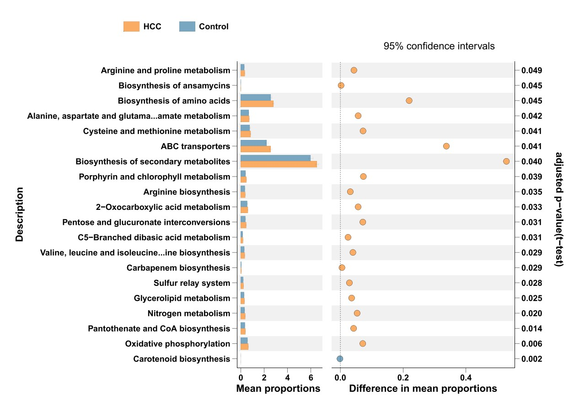
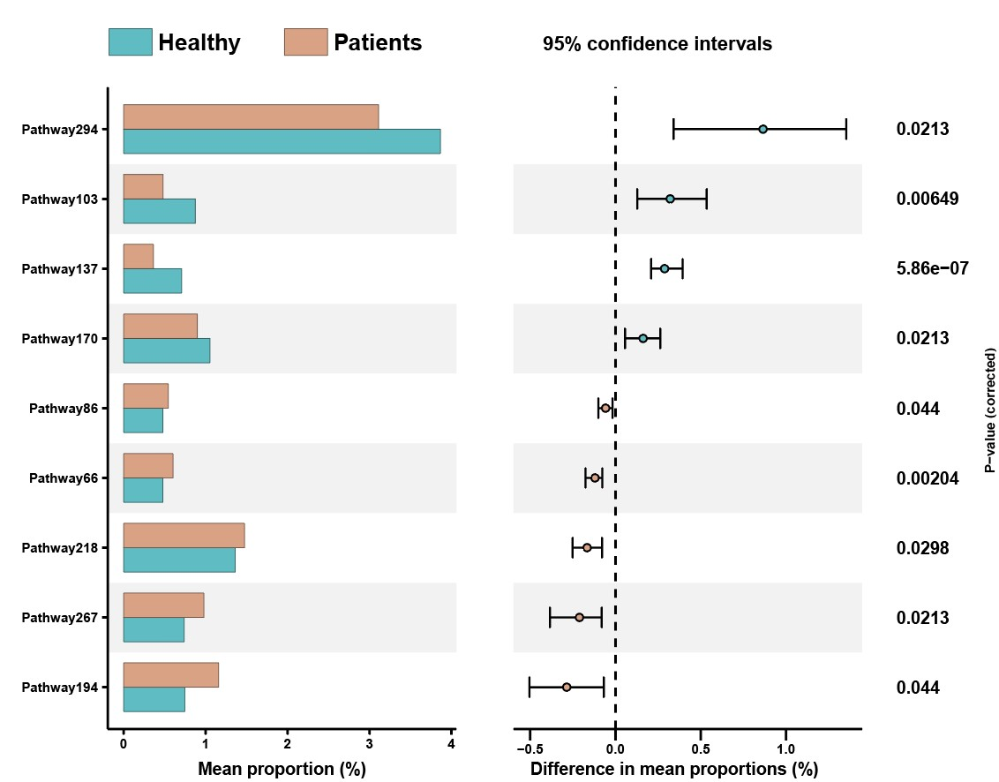

```{r setup, include=FALSE}
knitr::opts_chunk$set(
  collapse = T, echo=T, comment="#>", message=F, warning=F,
	fig.align="center", fig.width=5, fig.height=3, dpi=150)
```


The Stamp plot scripts is referenced from MicrobiomeStatPlot [Inerst Reference below].

If you use this script, please cited 如果你使用本代码，请引用：

**Yong-Xin Liu**, Lei Chen, Tengfei Ma, Xiaofang Li, Maosheng Zheng, Xin Zhou, Liang Chen, Xubo Qian, Jiao Xi, Hongye Lu, Huiluo Cao, Xiaoya Ma, Bian Bian, Pengfan Zhang, Jiqiu Wu, Ren-You Gan, Baolei Jia, Linyang Sun, Zhicheng Ju, Yunyun Gao, **Tao Wen**, **Tong Chen**. 2023. EasyAmplicon: An easy-to-use, open-source, reproducible, and community-based pipeline for amplicon data analysis in microbiome research. **iMeta** 2(1): e83. https://doi.org/10.1002/imt2.83

The online version of this tuturial can be found in https://github.com/YongxinLiu/MicrobiomeStatPlot


**Authors**
First draft(初稿)：Defeng Bai(白德凤)；Proofreading(校对)：Ma Chuang(马闯) and Jiani Xun(荀佳妮)；Text tutorial(文字教程)：Defeng Bai(白德凤)


# Introduction简介

## STAMP STAMP分析

在微生物多样性分析中，STAMP(Statistical analysis of megagenomic profiles)分析常常用来比较多组样本之间物种或功能相对丰度的差异情况，能够得到组间具有显著差异的物种和功能。STAMP分析通过扩展柱状图(Extended error bar)的形式来展示最终的结果。

In microbial diversity analysis, STAMP (Statistical analysis of megagenomic profiles) analysis is often used to compare the differences in the relative abundance of species or functions between multiple groups of samples, and can obtain species and functions with significant differences between groups. STAMP analysis displays the final results in the form of an extended error bar.

也可以用STAMP软件完成功能更多的差异分析，网站地址为https://beikolab.cs.dal.ca/software/STAMP，软件的使用可参考https://mp.weixin.qq.com/s/1EFYt2KJOIx_zmT5Xltkeg; https://mp.weixin.qq.com/s/2zSvLgcJ2pGv7MyMLKaICw

You can also use STAMP software to complete differential analysis with more functions. The website address is https://beikolab.cs.dal.ca/software/STAMP. For the use of the software, please refer to https://mp.weixin.qq.com/s/1EFYt2KJOIx_zmT5Xltkeg; https://mp.weixin.qq.com/s/2zSvLgcJ2pGv7MyMLKaICw


关键字：微生物组数据分析、MicrobiomeStatPlot、STAMP分析、R语言可视化

Keywords: Microbiome analysis, MicrobiomeStatPlot, STAMP , R visulization


## STAMP example STAMP分析案例

这是来自于温州医科大学附属医院Chen Gang团队和温州医科大学Wang Yi团队2023年发表于Gut Microbes上的一篇论文，论文题目为：A distinct microbiota signature precedes the clinical diagnosis of hepatocellular carcinoma. https://doi.org/10.1080/19490976.2023.2201159

This is a paper published in Gu Microbes in 2023 by Chen Gang's team from Wenzhou Medical University Affiliated Hospital and Wang Yi's team from Wenzhou Medical University. The title of the paper is: A distinct microbiota signature precedes the clinical diagnosis of hepatocellular carcinoma. https://doi.org/10.1080/19490976.2023.2201159



Figure 5. The major KEGG pathways between HCC and the control groups of the prospective cohort with the metagenomic sequencing data of fecal samples. Differential shotgun metagenomic sequence-based KEGG pathways in gut microbiota between the two groups detected by Diamond software. The top 20 items are listed along with the appropriate 95% confidence intervals and adjusted-p values.

图 5. 前瞻性队列中 HCC 组和对照组之间的主要 KEGG 通路与粪便样本的宏基因组测序数据。Diamond 软件检测到两组肠道菌群中基于散弹枪宏基因组序列的差异 KEGG 通路。列出了前 20 个项目以及相应的 95% 置信区间和调整后的 p 值。


**结果**

Meanwhile, KEGG pathway analyses discovered several biological metabolic pathways in HCC with the metagenomic sequencing (Figure 5). Methodologically, the Diamond algorithm was constructed to annotate and calculate the statistical difference in the KEGG pathways between the two groups (Figure 5, adjusted p < 0.05).

同时，KEGG通路分析通过宏基因组测序发现了HCC中多条生物代谢通路（图5）。方法学上，构建了Diamond算法对两组间KEGG通路进行注释和计算统计差异（图5，调整后p < 0.05）。


## Packages installation软件包安装

```{r}
# 基于CRAN安装R包，检测没有则安装
p_list = c("tidyverse", "ggsci", "magrittr", "ggh4x", "rstatix", "ggsignif", "ggpubr",
           "ggnewscale", "patchwork", "reshape2", "ggplot2")
for(p in p_list){if (!requireNamespace(p)){install.packages(p)}
    library(p, character.only = TRUE, quietly = TRUE, warn.conflicts = FALSE)}

# install.packages("devtools")
# 基于github安装
library(devtools)
if(!requireNamespace("ggchicklet", quietly = TRUE))
  install_github("hrbrmstr/ggchicklet")

# 加载R包 Load the package
suppressWarnings(suppressMessages(library(ggchicklet)))
suppressWarnings(suppressMessages(library(tidyverse)))
suppressWarnings(suppressMessages(library(ggsci)))
suppressWarnings(suppressMessages(library(magrittr)))
suppressWarnings(suppressMessages(library(ggh4x)))
suppressWarnings(suppressMessages(library(rstatix)))
suppressWarnings(suppressMessages(library(ggsignif)))
suppressWarnings(suppressMessages(library(ggpubr)))
suppressWarnings(suppressMessages(library(ggnewscale)))
suppressWarnings(suppressMessages(library(patchwork)))
suppressWarnings(suppressMessages(library(reshape2)))
suppressWarnings(suppressMessages(library(ggplot2)))
```


# STAMP using R software 使用R软件实现STAMP图绘制

## 扩展柱状图(Extended error bar)

```{r STAMP, fig.show='asis', fig.width=4, fig.height=2.5}
# 载入数据
# Load data
data <- read.table("data/pathway.txt",header = TRUE,row.names = 1,sep = "\t")
group <- read.table("data/group.txt",header = FALSE,sep = "\t")
group = group[-1,]

# 构建矩阵
# Construct matrix
row=as.numeric(length(row.names(data))) 
col=as.numeric(length(colnames(data))) 
col_sum=rep(colSums(data), row)
col_sum=matrix(col_sum, nrow = col, ncol = row)

# 计算相对丰度
# Calcualate relative abundance
data2=data/t(col_sum)
colSums(data2)

# 过滤掉平均丰度低于5%的功能分类
# Filter out functional categories with an average abundance below 5%
data = data2
data <- data*100
data <- data %>% filter(apply(data,1,mean) > 0.5)

data <- t(data)
data1 <- data.frame(data,group$V2)
colnames(data1) <- c(colnames(data),"Group")
data1$Group <- as.factor(data1$Group)

# 不符合正态分布，使用非参检验
# Does not conform to normal distribution, use non-parametric test
# shapiro.test(data1$`Amino acid metabolism`)
# shapiro.test(data1$`Biosynthesis of other secondary metabolites`)
# shapiro.test(data1$Alistipes_putredinis)

# diff <- data1 %>% 
#     select_if(is.numeric) %>%
#     map_df(~ broom::tidy(t.test(. ~ Group,data = data1)), .id = 'var')
# 
# diff$p.value <- p.adjust(diff$p.value,"bonferroni")
# diff <- diff %>% filter(p.value < 0.05)

# 非参检验
# wilcox test
library(tidyverse)
diff <- data1 %>% 
    select_if(is.numeric) %>%
    map_df(~ broom::tidy(wilcox.test(. ~ Group,data = data1, conf.int = TRUE)), .id = 'var')
diff$p.value <- p.adjust(diff$p.value,"BH")
diff <- diff %>% filter(p.value < 0.05)
# write.csv(diff, "results/Pathway_wixcox_test_0.05_abun_filter_0.05.csv")

## 绘图数据构建(Data construction)
## 左侧条形图(Left bar plot)
abun.bar <- data1[,c(diff$var,"Group")] %>% 
    rstatix::gather(variable,value,-Group) %>% 
    group_by(variable,Group) %>% 
    summarise(Mean = mean(value))

## 右侧散点图(Scatter plot on the right)
diff.mean <- diff[,c("var","estimate","conf.low","conf.high","p.value")]
diff.mean$Group <- c(ifelse(diff.mean$estimate >0,levels(data1$Group)[1],
                            levels(data1$Group)[2]))
diff.mean <- diff.mean[order(diff.mean$estimate,decreasing = TRUE),]

## 左侧条形图(Left bar plot)
cbbPalette <- c("#5ebcc2","#d9a285")
abun.bar$variable <- factor(abun.bar$variable,levels = rev(diff.mean$var))
p1 <- ggplot(abun.bar,aes(variable,Mean,fill = Group)) +
    scale_x_discrete(limits = levels(diff.mean$var)) +
    coord_flip() +
    xlab("") +
    ylab("Mean proportion (%)") +
    theme(panel.background = element_rect(fill = 'transparent'),
          panel.grid = element_blank(),
          axis.ticks.length = unit(0.2,"lines"), 
          axis.ticks = element_line(color='black'),
          axis.line = element_line(colour = "black"),
          axis.title.x=element_text(colour='black', size=9,face = "bold"),
          axis.text=element_text(colour='black',size=7,face = "bold"),
          legend.title=element_blank(),
          legend.text=element_text(size=12,face = "bold",colour = "black",
                                   margin = margin(r = 20)),
          #legend.position = c(-0.1,0.1),
          legend.position = "top",
          legend.direction = "horizontal",
          legend.key.width = unit(0.8,"cm"),
          legend.key.height = unit(0.5,"cm"))
#p1

for (i in 1:(nrow(diff.mean) - 1)) 
    p1 <- p1 + annotate('rect', xmin = i+0.5, xmax = i+1.5, ymin = -Inf, ymax = Inf, 
                        fill = ifelse(i %% 2 == 0, 'white', 'gray95'))

p1 <- p1 + 
    geom_bar(stat = "identity",position = "dodge",width = 0.7,colour = "black",linewidth = 0.1) +
    scale_fill_manual(values=cbbPalette)
#p1

## 右侧散点图(Scatter plot on the right)
diff.mean$var <- factor(diff.mean$var,levels = levels(abun.bar$variable))
diff.mean$p.value <- signif(diff.mean$p.value,3)
diff.mean$p.value <- as.character(diff.mean$p.value)
p2 <- ggplot(diff.mean,aes(var,estimate,fill = Group)) +
    theme(panel.background = element_rect(fill = 'transparent'),
          panel.grid = element_blank(),
          axis.ticks.length = unit(0.4,"lines"), 
          axis.ticks = element_line(color='black'),
          axis.line = element_line(colour = "black"),
          axis.title.x=element_text(colour='black', size=6,face = "bold"),
          axis.text=element_text(colour='black',size=7,face = "bold"),
          axis.text.y = element_blank(),
          legend.position = "none",
          axis.line.y = element_blank(),
          axis.ticks.y = element_blank(),
          plot.title = element_text(size = 10,face = "bold",colour = "black",hjust = 0.5)) +
    scale_x_discrete(limits = levels(diff.mean$var)) +
    coord_flip() +
    xlab("") +
    ylab("Difference in mean proportions (%)") +
    labs(title="95% confidence intervals") 

for (i in 1:(nrow(diff.mean) - 1)) 
    p2 <- p2 + annotate('rect', xmin = i+0.5, xmax = i+1.5, ymin = -Inf, ymax = Inf, 
                        fill = ifelse(i %% 2 == 0, 'white', 'gray95'))

p2 <- p2 +
    geom_errorbar(aes(ymin = conf.low, ymax = conf.high), 
                  position = position_dodge(0.8), width = 0.3, size = 0.40) +
    geom_point(shape = 21,size = 1.5) +
    scale_fill_manual(values=cbbPalette) +
    geom_hline(aes(yintercept = 0), linetype = 'dashed', color = 'black')
#p2
    
p3 <- ggplot(diff.mean,aes(var,estimate,fill = Group)) +
    geom_text(aes(y = 0,x = var),label = diff.mean$p.value,
              hjust = 0,fontface = "bold",inherit.aes = FALSE,size = 3) +
    geom_text(aes(x = nrow(diff.mean)/2 +0.5,y = 0.85),label = "P-value (corrected)",
             srt = 90,fontface = "bold",size = 2.5) +
    coord_flip() +
    ylim(c(0,1)) +
    theme(panel.background = element_blank(),
          panel.grid = element_blank(),
          axis.line = element_blank(),
          axis.ticks = element_blank(),
          axis.text = element_blank(),
          axis.title = element_blank())

## 图像拼接(Combined plot)
p <- p1 + p2 + p3 + plot_layout(widths = c(2,2,1))
#p

## 保存图像
# Save plot
ggsave("results/Pathway_stamp_abun_filter_0.05.pdf",p,width = 8,height = 6)
```





If used this script, please cited:
使用此脚本，请引用下文：

**Yong-Xin Liu**, Lei Chen, Tengfei Ma, Xiaofang Li, Maosheng Zheng, Xin Zhou, Liang Chen, Xubo Qian, Jiao Xi, Hongye Lu, Huiluo Cao, Xiaoya Ma, Bian Bian, Pengfan Zhang, Jiqiu Wu, Ren-You Gan, Baolei Jia, Linyang Sun, Zhicheng Ju, Yunyun Gao, **Tao Wen**, **Tong Chen**. 2023. EasyAmplicon: An easy-to-use, open-source, reproducible, and community-based pipeline for amplicon data analysis in microbiome research. **iMeta** 2: e83. https://doi.org/10.1002/imt2.83

Copyright 2016-2024 Defeng Bai <baidefeng@caas.cn>, Chuang Ma <22720765@stu.ahau.edu.cn>, Jiani Xun <15231572937@163.com>, Yong-Xin Liu <liuyongxin@caas.cn>
