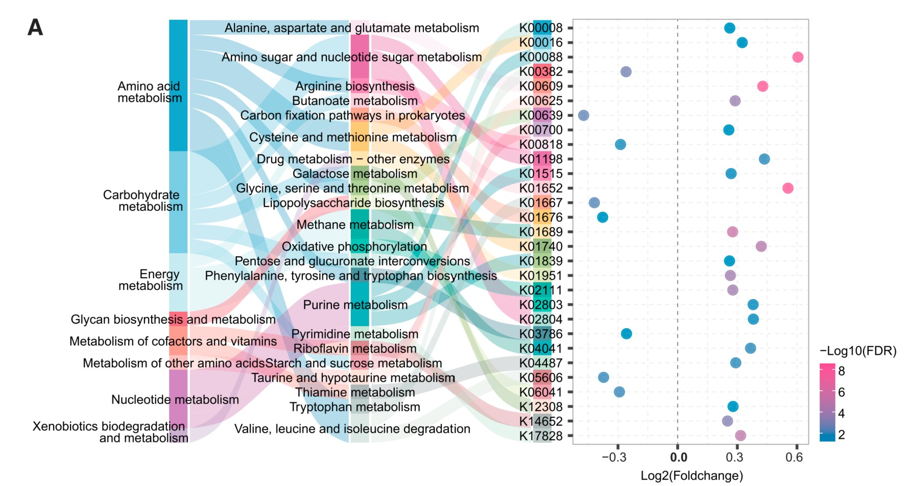
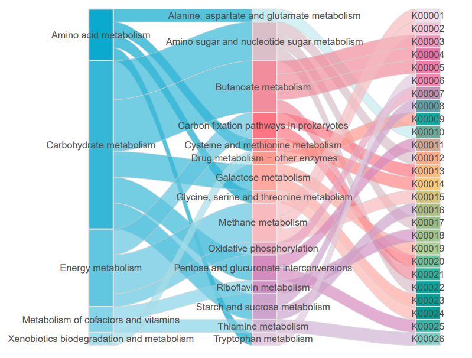

```{r setup, include=FALSE}
knitr::opts_chunk$set(
  collapse = T, echo=T, comment="#>", message=F, warning=F,
	fig.align="center", fig.width=5, fig.height=3, dpi=150)
```


The Sankey plot scripts is referenced from MicrobiomeStatPlot [Inerst Reference below].


If you use this script, please cited 如果你使用本代码，请引用：

**Yong-Xin Liu**, Lei Chen, Tengfei Ma, Xiaofang Li, Maosheng Zheng, Xin Zhou, Liang Chen, Xubo Qian, Jiao Xi, Hongye Lu, Huiluo Cao, Xiaoya Ma, Bian Bian, Pengfan Zhang, Jiqiu Wu, Ren-You Gan, Baolei Jia, Linyang Sun, Zhicheng Ju, Yunyun Gao, **Tao Wen**, **Tong Chen**. 2023. EasyAmplicon: An easy-to-use, open-source, reproducible, and community-based pipeline for amplicon data analysis in microbiome research. **iMeta** 2(1): e83. https://doi.org/10.1002/imt2.83

The online version of this tuturial can be found in https://github.com/YongxinLiu/MicrobiomeStatPlot


**Authors**
First draft(初稿)：Defeng Bai(白德凤)；Proofreading(校对)：Ma Chuang(马闯) and Xun Jiani(荀佳妮)；Text tutorial(文字教程)：Defeng Bai(白德凤)


# Introduction简介

桑基图又称桑基能量分流图或桑基能量平衡图，是一种特定类型的流程图，是一种表现数据间包含和权重关系流向的统计图标，常见的布局形式有左右流向布局和上下流向布局，其中线条的粗细代表了数值的大小，线条的颜色代表不同的分支种类，通过线条流动的位置和归属，来表现各类别数据之间的包含关系。

The Sankey plot, also known as the Sankey energy diversion diagram or Sankey energy balance diagram, is a specific type of flowchart that represents the flow direction of data inclusion and weight relationships. Common layout forms include left and right flow layout and up and down flow layout, where the thickness of the lines represents the size of the values, and the color of the lines represents different types of branches. The inclusion relationship between different categories of data is represented by the position and attribution of the line flow.

桑基图的起始流量和结束流量相同，所有主支宽度的总和与所有分出去的分支宽度总和相等，保持能量的平衡；各主支和分支不同的宽度代表了不同的流量大小；不同宽度的线条代表了不同的流量分流情况，线条的宽度成比例地显示此分支占有地流量。

The starting and ending flow rates of the Sankey diagram are the same, and the sum of the widths of all main branches is equal to the sum of the widths of all branching branches, maintaining energy balance; The different widths of each main branch and branch represent different flow sizes; The lines with different widths represent different flow diversion situations, and the width of the lines proportionally displays the flow occupied by this branch.

桑基图用于描述一组数值转化成另一组数值的流向，观察数据的流转情况。

The Sankey plot is used to describe the flow direction of converting one set of numerical values into another, and to observe the flow of data


关键字：微生物组数据分析、MicrobiomeStatPlot、桑基图、R语言可视化

Keywords: Microbiome analysis, MicrobiomeStatPlot, Sankey plot, R visulization


## Case study of Sankey plot 桑基图案例


## Sangi diagram showing differences in functional pathways and KO genes 桑基图展示功能通路和KO基因差异

本文是上海交通大学Chen Haoyan课题组于2023年发表于Cell Host & Microbe上的一篇文章用到的桑基图和气泡图结合，展示KEGG功能通路和KO基因差异。题目为：Multi-kingdom gut microbiota analyses define bacterial-fungal interplay and microbial markers of pan-cancer immunotherapy across cohorts。

This article is an article published by Chen Haoyan's research group at Shanghai Jiao Tong University in 2023 on Cell Host&Microbe, which combines the Sangi plot and bubble plot to demonstrate the differences in KEGG functional pathways and KO genes. The title is: Multi kingdom gut microbiota analyses define bacterial empty interplay and microbial markers of pan cancer immune across cohorts.



Figure 6 (A) (Left) Sankey plot showing the distribution of Kyoto Encyclopedia of Genes and Genomes (KEGG) levels and differential KO genes involving in metabolism. (Right) Bubble plot showing the generalized fold change of KO genes. Color of the dot represents -log10(FDR).

图 6 (A) （左）Sankey 图显示京都基因组百科全书（KEGG）水平的分布和涉及新陈代谢的不同 KO 基因。(右图）气泡图显示 KO 基因的广义折叠变化。点的颜色代表 -log10(FDR)。

**结果**：
The intestinal microbiota can regulate host physiology and maintenance. Since the gut microbiome differed between responders and non-responders, we hypothesized that microbial functions exhibited distinct patterns in the two response phenotypes. To test this, we investigated functional alterations in Kyoto Encyclopedia of Genes and Genomes (KEGG) orthology (KO) genes, pathways, and EggNOG orthology genes in 4 datasets treated with anti-PD-1 monotherapy. The most significantly enriched metabolic KO gene in responders was involved in purine metabolism, followed by a gene involved in butanoate metabolism (Figure 6A). K00700 (EC:2.4.1.18) was involved in starch and sucrose metabolism (Figure 6A), directly responsible for the synthesis of starch from amylose.

肠道微生物群可以调节宿主的生理机能和维持宿主的健康。由于应答者和非应答者的肠道微生物组不同，我们假设微生物功能在两种应答表型中表现出不同的模式。为了验证这一假设，我们研究了接受抗PD-1单药治疗的4个数据集中的《京都基因组百科全书》（KEGG）正选（KO）基因、通路和EggNOG正选基因的功能变化。应答者中最明显富集的代谢 KO 基因参与了嘌呤代谢，其次是一个参与丁酸代谢的基因（图6A）。K00700（EC:2.4.1.18）参与淀粉和蔗糖代谢（图 6A），直接负责从淀粉中合成淀粉。


## Packages installation软件包安装

```{r}
# 基于CRAN安装R包，检测没有则安装
p_list = c("ggalluvial", "ggplot2")
for(p in p_list){if (!requireNamespace(p)){install.packages(p)}
    library(p, character.only = TRUE, quietly = TRUE, warn.conflicts = FALSE)}

# install.packages("devtools")
# 基于github安装
library(devtools)
if(!requireNamespace("amplicon", quietly = TRUE))
  install_github("davidsjoberg/ggsankey")

# 加载R包 Load the package
suppressWarnings(suppressMessages(library(ggalluvial)))
suppressWarnings(suppressMessages(library(ggplot2)))
suppressWarnings(suppressMessages(library(ggsankey)))
```


# Sankey plot桑基图

## Sankey plot implementation 桑基图实现

```{r Sankey plot, fig.show='asis', fig.width=4, fig.height=2.5}
# 读取数据
# Load data
df01 <- read.table(file = "data/data_sankey3.txt", sep = "\t", header = TRUE, check.names = FALSE)
data <- df01

# 转换为lodes形式数据
# Data format transformation
df <- to_lodes_form(data[, 1:ncol(data)], axes = 1:ncol(data), id = "value")

# 自定义配色方案，使用更现代的调色板，并控制色彩平衡
# Set color
colors <- colorRampPalette(c('#0ca9ce', '#78cfe5', '#c6ecf1', '#ff6f81', '#ff9c8f', '#ffc2c0','#d386bf',
        '#cdb1d2', '#fae6f0', '#eb6fa6', '#ff88b5', '#00b1a5',"#ffa68f","#ffca75","#97bc83","#acd295",
        "#00ada1","#009f93","#ace2da","#448c99","#00b3bc","#b8d8c9","#db888e","#e397a4","#ead0c7",
        "#8f9898","#bfcfcb"))(67)


# 绘制桑基图，调整形状比例，使用新的曲线类型以提高视觉效果
# Plot
p1 <- ggplot(df, aes(x = x, stratum = stratum, alluvium = value, fill = stratum, label = stratum)) +
  geom_flow(width = 0.15, curve_type = "cubic", alpha = 0.7, color = 'gray80', size = 0.2) +
  geom_stratum(width = 0.15, color = "gray90") +
  geom_text(stat = 'stratum', size = 3, color = 'gray30') +
  scale_fill_manual(values = colors) +
  theme_minimal() +
  theme(legend.position = 'none',
        axis.title = element_blank(),
        axis.text = element_blank(),
        panel.grid = element_blank(),
        plot.margin = margin(5, 5, 5, 5))

# 保存图像
# Save plot
ggsave(filename = "results/Figure_sankey.pdf", plot = p1, width = 7, height = 5, useDingbats = FALSE, limitsize = FALSE)
```




If used this script, please cited:
使用此脚本，请引用下文：

**Yong-Xin Liu**, Lei Chen, Tengfei Ma, Xiaofang Li, Maosheng Zheng, Xin Zhou, Liang Chen, Xubo Qian, Jiao Xi, Hongye Lu, Huiluo Cao, Xiaoya Ma, Bian Bian, Pengfan Zhang, Jiqiu Wu, Ren-You Gan, Baolei Jia, Linyang Sun, Zhicheng Ju, Yunyun Gao, **Tao Wen**, **Tong Chen**. 2023. EasyAmplicon: An easy-to-use, open-source, reproducible, and community-based pipeline for amplicon data analysis in microbiome research. **iMeta** 2: e83. https://doi.org/10.1002/imt2.83

Copyright 2016-2024 Defeng Bai <baidefeng@caas.cn>, Chuang Ma <22720765@stu.ahau.edu.cn>, Jiani Xun <15231572937@163.com>, Yong-Xin Liu <liuyongxin@caas.cn>
