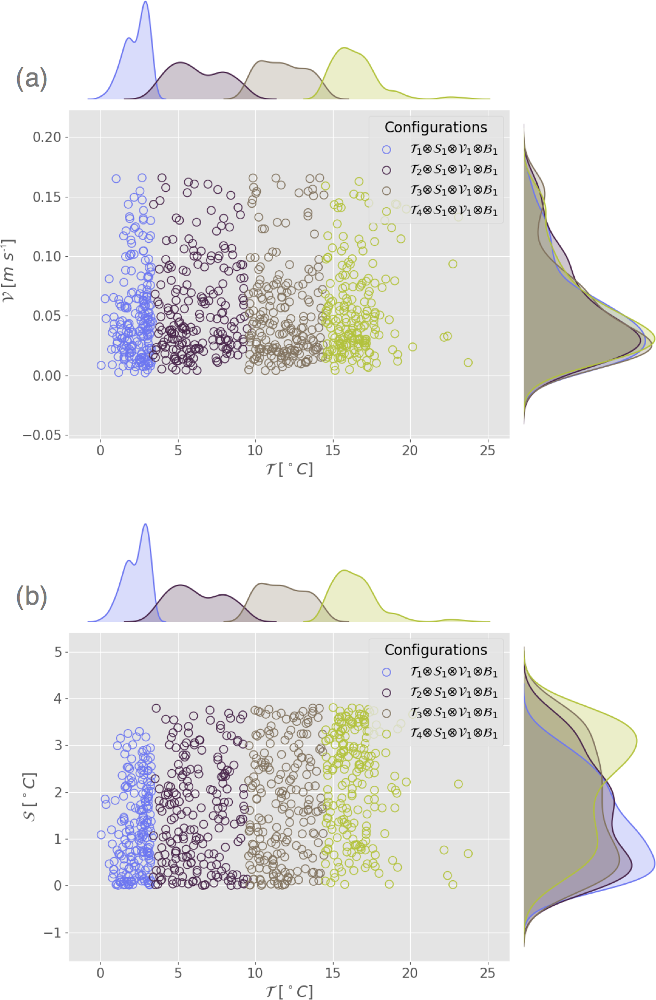
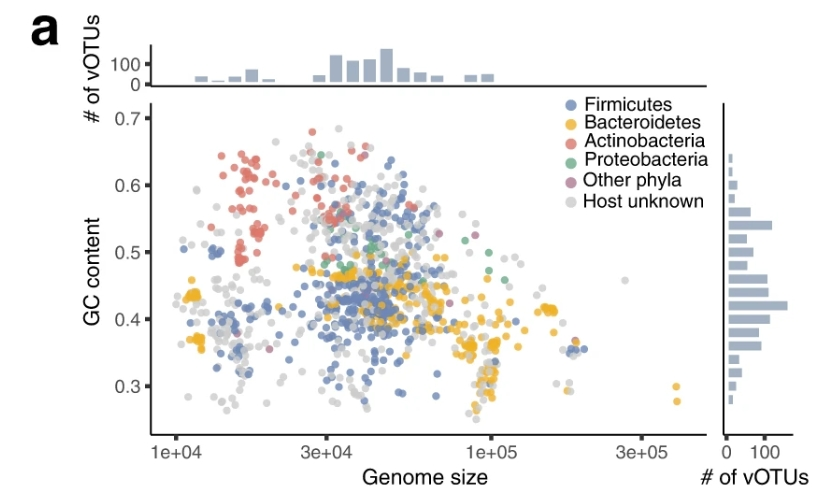
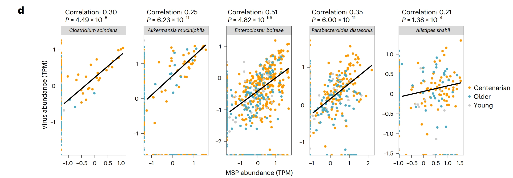
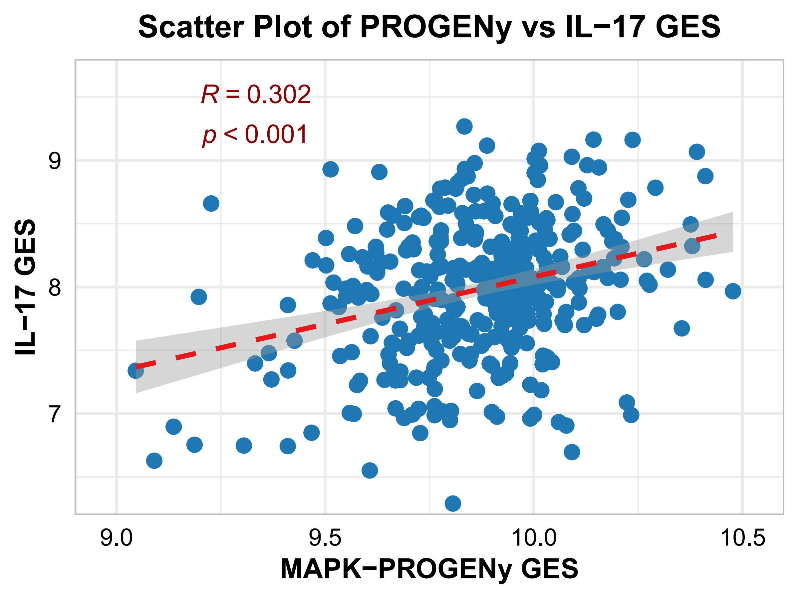
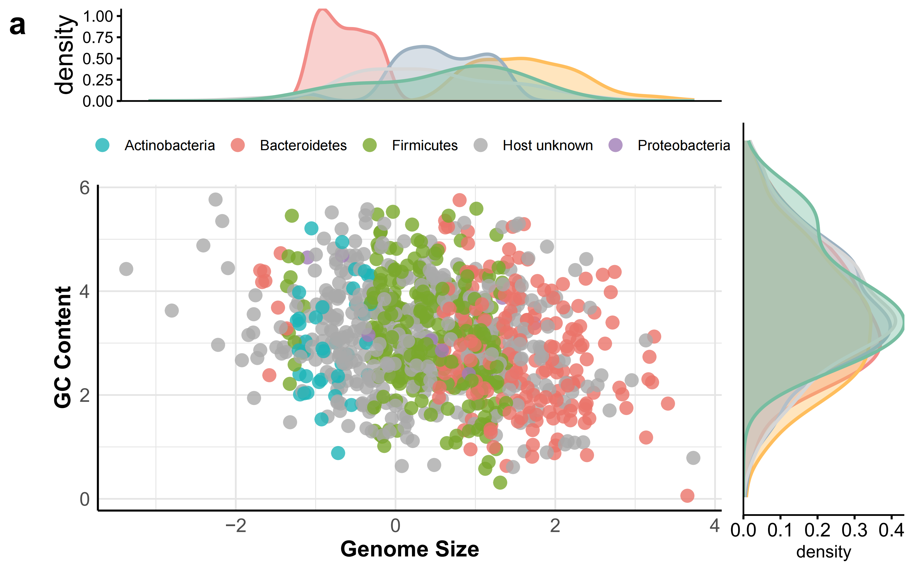
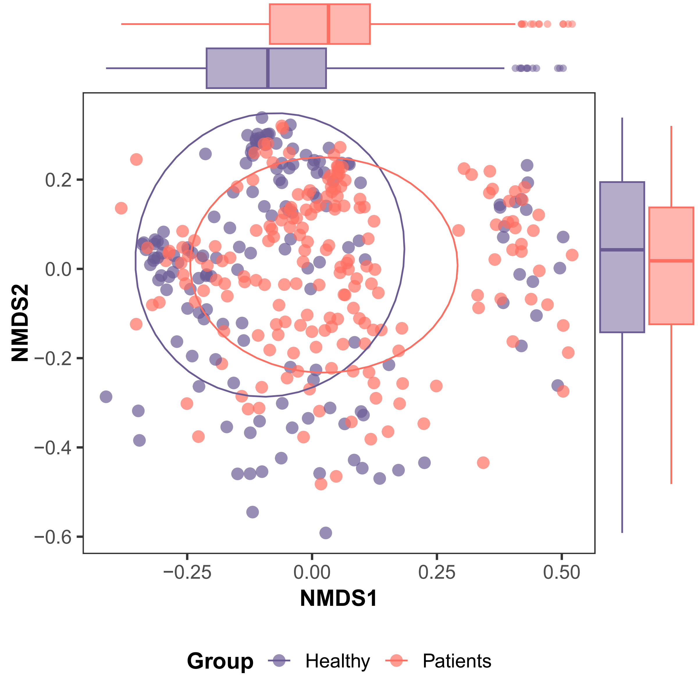
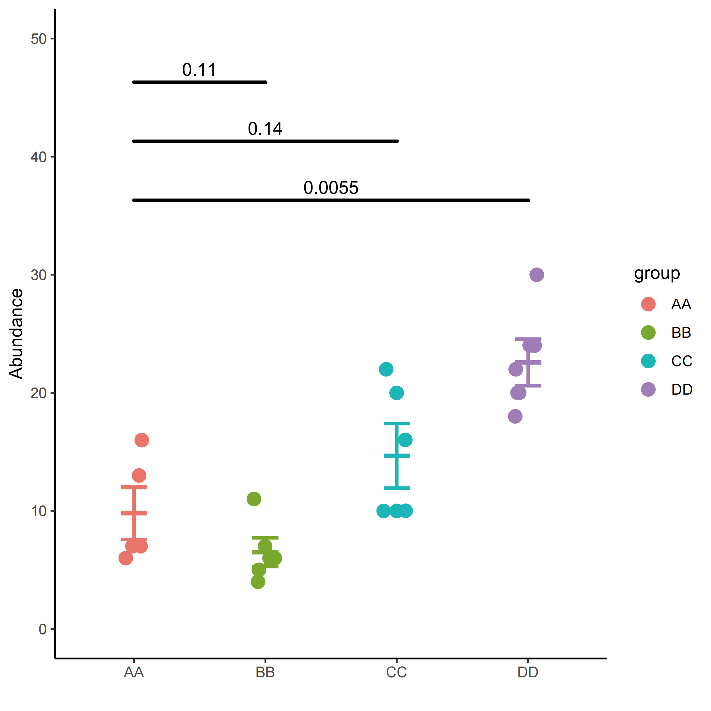
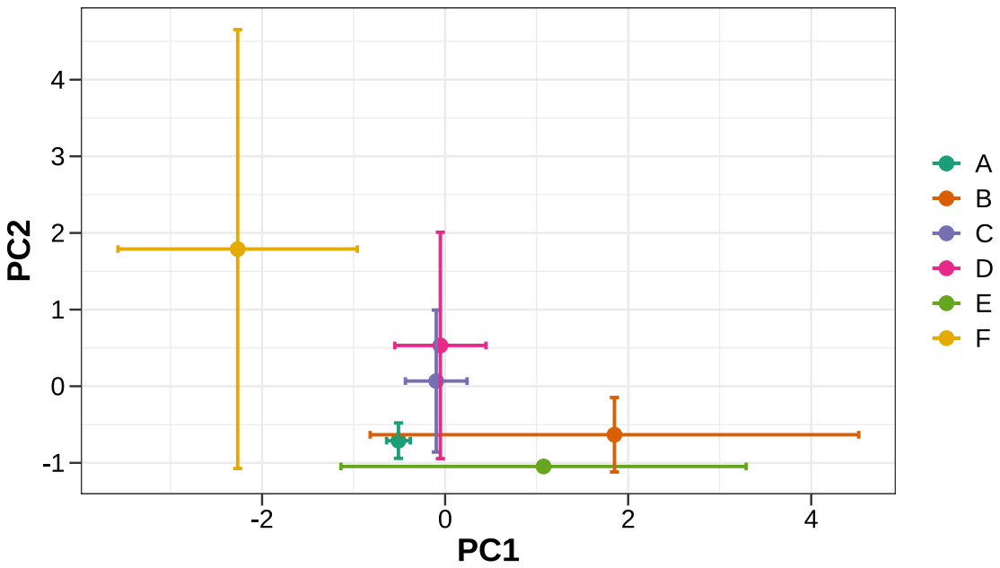
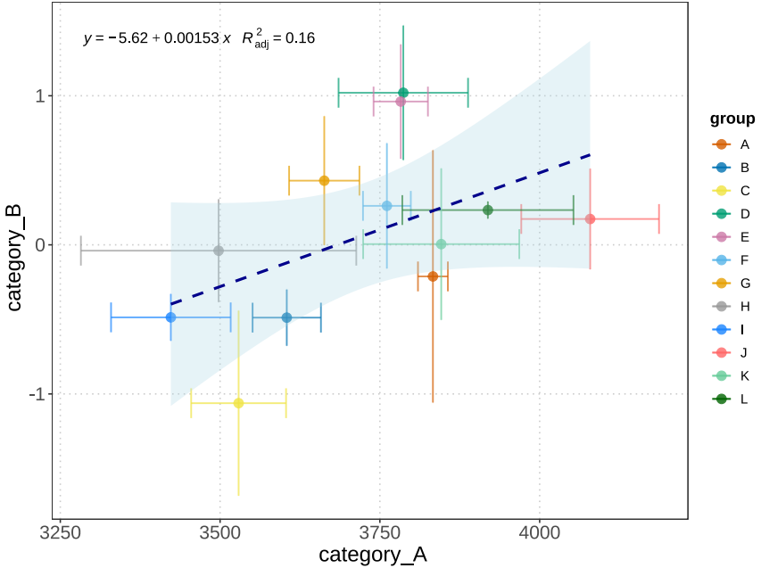

```{r setup, include=FALSE}
knitr::opts_chunk$set(
  collapse = T, echo=T, comment="#>", message=F, warning=F,
	fig.align="center", fig.width=5, fig.height=3, dpi=150)
```


The Scatter plot scripts is referenced from MicrobiomeStatPlot [Inerst Reference below].

If you use this script, please cited 如果你使用本代码，请引用：

**Yong-Xin Liu**, Lei Chen, Tengfei Ma, Xiaofang Li, Maosheng Zheng, Xin Zhou, Liang Chen, Xubo Qian, Jiao Xi, Hongye Lu, Huiluo Cao, Xiaoya Ma, Bian Bian, Pengfan Zhang, Jiqiu Wu, Ren-You Gan, Baolei Jia, Linyang Sun, Zhicheng Ju, Yunyun Gao, **Tao Wen**, **Tong Chen**. 2023. EasyAmplicon: An easy-to-use, open-source, reproducible, and community-based pipeline for amplicon data analysis in microbiome research. **iMeta** 2(1): e83. https://doi.org/10.1002/imt2.83

The online version of this tuturial can be found in https://github.com/YongxinLiu/MicrobiomeStatPlot


**Authors**

First draft(初稿)：Defeng Bai(白德凤)；Proofreading(校对)：Ma Chuang(马闯) and Jiani Xun(荀佳妮)；Text tutorial(文字教程)：Defeng Bai(白德凤)


# Introduction简介

## Scatter plot 散点图
什么是散点图？
What is a scatter plot?

散点图（Scatter Plot） 是一种统计图形，用于展示两个变量之间的关系。它通过二维坐标系中的点来表示观察数据，每个点的位置由两个变量的取值决定，横坐标表示自变量（X 轴），纵坐标表示因变量（Y 轴）。散点图的应用：相关性分析,判断两个变量之间是否存在某种关联，以及这种关联是正相关、负相关还是无关。模型拟合,通过观察散点图，可以选择合适的回归模型（如线性回归、非线性回归等）来拟合数据。异常检测,可以通过观察散点图中的异常点来检测潜在的异常数据或错误观测值。

A Scatter Plot is a statistical graph used to show the relationship between two variables. It represents the observed data by means of points in a two-dimensional coordinate system, where the position of each point is determined by the values of the two variables, with the horizontal coordinate representing the independent variable (X-axis) and the vertical coordinate representing the dependent variable (Y-axis). Scatterplot application: Correlation analysis, to determine whether there is some kind of correlation between two variables, and whether the correlation is positive, negative or irrelevant. Model fitting, by looking at the scatterplot, you can choose a suitable regression model (e.g. linear regression, non-linear regression, etc.) to fit the data. Anomaly detection, by looking at the anomalies in the scatterplot, you can detect potential anomalies or erroneous observations.


关键字：微生物组数据分析、MicrobiomeStatPlot、散点图、R语言可视化

Keywords: Microbiome analysis, MicrobiomeStatPlot, Scatter plot, R visulization


## Scatter plot examples 散点图应用案例

### Example1 案例1

这是Patrick Lehodey在2020年发表于Biogeosciences上的文章，第一作者为Audrey Delpech，题目为：Influence of oceanic conditions in the energy transfer efficiency estimation of a micronekton model.  https://bg.copernicus.org/articles/17/833/2020/

This is an article by Patrick Lehodey published in Biogeosciences in 2020, first authored by Audrey Delpech, titled: Influence of oceanic conditions in the energy transfer efficiency estimation of a micronekton model. https://bg.copernicus.org/articles/17/833/2020/




Figure 5 Scatter plot and marginal distribution from kernel density estimation in the plane (a) (𝒯,𝒱) and (b) (𝒯,𝒮) for the configurations corresponding to Exp. 3a, b, c and d from Table 3.

图5 显示了在平面 (a) (𝒯,𝒱)和(b)(𝒯,𝒮)上基于核密度估计的散点图及边缘分布，分别对应表3中实验3a、3b、3c 和 3d 的配置。


**结果**：

Figure 5 shows that the distributions along the secondary variables of each configuration are close enough for the experiments to be compared, avoiding any risk of cross-correlation. 

图 5 显示，每种配置的次要变量分布都非常接近，足以进行实验比较，避免了任何交叉相关的风险。


### Example2 案例2

这是Masahira Hattori 在2022年发表于NC上的文章，第一作者为Suguru Nishijima，题目为：Extensive gut virome variation and its associations with host and environmental factors in a population-level cohort  https://doi.org/10.1038/s41467-022-32832-W

This is an article by Patrick Lehodey published in Biogeosciences in 2020, first authored by Audrey Delpech, titled: Influence of oceanic conditions in the energy transfer efficiency estimation of a micronekton model


Fig. 1: Overview of reconstructed phage genomes from 4198 human gut metagenomes.

图 1：从 4198 个人类肠道元基因组中重建的噬菌体基因组概览

a. Genome size and GC content of phage genomes (n = 4709) reconstructed from the dataset of 4,198 whole metagenomes. Bar plots on the top and right side depict the distribution of genome size and GC content, respectively. 

a. 从 4198 个全元基因组数据集中重建的噬菌体基因组（n = 4709）的基因组大小和 GC 含量。顶部和右侧的柱状图分别描述了基因组大小和 GC 含量的分布情况。


**结果**：

Clustering of the 4709 phage sequences with >95% sequence similarity generated 1347 viral operational taxonomic units (vOTUs) (corresponding to the species level) (Fig. 1a and Supplementary Fig. 2a, Supplementary Data 4).
对序列相似度大于 95% 的 4709条噬菌体序列进行聚类，生成了1347个病毒操作分类单元（vOTUs）（相当于物种水平）（图 1a 和补充图 2a，补充数据 4）。


### Example3 案例3

这是Damian R. plichta 在2023年发表于Nature Microbiology上的文章，第一作者为Joachim Johansen
，题目为：Centenarians have a diverse gut virome with the potential to modulate metabolism and promote healthy lifespan  https://www.nature.com/articles/s41467-024-45793-z

This is an article by Damian R. plichta published in Nature Microbiology in 2023, first authored by Joachim Johansen with the title : Centenarians have a diverse gut virome with the potential to modulate metabolism and promote healthy lifespan. https://www.nature.com/articles/s41467-024-45793-z



Fig. 3 | Phage signatures correlate with the unique centenarian bacterial 
communities.
图 3 | 噬菌体特征与独特的百岁老人细菌群落相关群落相关。

d, Several enriched temperate vOTUs displayed PtW abundance (log10 scale) trends with MSP host abundance, such as the abundance of E. boltea vOTUs showing a Spearman rank correlation of 0.51 (P = 4.82 × 10−66), C. scindens (P = 4.49 × 10−08) and P. distasonis (P = 6.00 × 10−11). 
d, 一些富集的温和 vOTUs 的 PtW 丰度（log10 标度）与 MSP 宿主丰度呈相关趋势，如 E. boltea vOTUs 丰度的 Spearman 等级相关性为 0.51（P = 4.82 × 10-66）、C. scindens（P = 4.49 × 10-08）和 P. distasonis（P = 6.00 × 10-11）。

**结果**：

We hypothesized that the trend could reflect the abundance profile of the viral bacterial hosts and thus correlated the viral profiles of predicted temperate viruses to their predicted host. We found that the profile of overabundant bacteria such as C. scindens and its associated viruses were significantly correlated (Cor = 0.30, P = 4.49 × 10−08). A similar trend was found for Akkermansia muciniphila (Cor = 0.25, P = 6.23 × 10−11), Enterocloster bolteae (Cor = 0.51, P = 4.82 × 10−66) and Parabacteroides distasonis (Cor = 0.35, P = 6.00 × 10−11) (Fig. 3d). 

我们推测这一趋势可能反映了病毒细菌宿主的丰度。因此，我们将预测的温带病毒的病毒特征与其预测的宿主相关联。预测的温带病毒的病毒特征与其预测的宿主相关联。我们发现C.scindens等过量细菌的特征与相关病毒有显著相关性（Cor = 0.30, P = 4.49 × 10-08）。在 Akkermansia muciniphila中也发现了类似的趋势（Cor = 0.25、 P=6.23×10-11）、Enterocloster bolteae（Cor=0.51，P=4.82×10-66）和 Parabacteroides distasonis（Cor = 0.35，P = 6.00 × 10-11）（图 3d）。

这里举例绘制散点图的基础图形和散点图和其他类型图的组合
Here we give an example of drawing the basic graphics of scatter plots and the combination of scatter plots and other types of graphs.


## Packages installation软件包安装

```{r}
# 基于CRAN安装R包，检测没有则安装
p_list = c("ggplot2", "ggpubr", "ggpmisc", "doBy", "FactoMineR", "factoextra", 
           "tidyverse", "ggExtra", "vegan", "cowplot", "MASS", "scales","showtext","grid")
for(p in p_list){if (!requireNamespace(p)){install.packages(p)}
    library(p, character.only = TRUE, quietly = TRUE, warn.conflicts = FALSE)}

# 加载R包 Load the package
suppressWarnings(suppressMessages(library(ggplot2)))
suppressWarnings(suppressMessages(library(ggpubr)))
suppressWarnings(suppressMessages(library(ggpmisc)))
suppressWarnings(suppressMessages(library(doBy)))
suppressWarnings(suppressMessages(library(FactoMineR)))
suppressWarnings(suppressMessages(library(factoextra)))
suppressWarnings(suppressMessages(library(tidyverse)))
suppressWarnings(suppressMessages(library(ggExtra)))
suppressWarnings(suppressMessages(library(vegan)))
suppressWarnings(suppressMessages(library(cowplot)))
suppressWarnings(suppressMessages(library(MASS)))
suppressWarnings(suppressMessages(library(scales)))
suppressWarnings(suppressMessages(library(showtext)))
suppressWarnings(suppressMessages(library(grid)))
```


# Scatter plot 散点图

## 1.Scatter plot plus fitted line 散点图加拟合线

```{r Example01, fig.show='asis', fig.width=4, fig.height=2.5}
# 读取数据
# Load data
Scatterplot <- read.table("data/figure1e.txt", header = TRUE, sep = "\t", comment.char = "")
colnames(Scatterplot) <- c("PROGENY", "KEGG")

# 散点图
# Plot
p1 <- ggplot(Scatterplot, aes(x = PROGENY, y = KEGG)) +
  geom_point(size = 3.5, color = "#1F78B4") +  
  geom_smooth(method = "lm", color = "#E31A1C", size = 1.3, linetype = "dashed") + 
  stat_cor(method = "pearson",
           label.sep = '\n',
           p.accuracy = 0.001,
           r.digits = 3,
           label.x = 9.2,
           size = 5, color = "darkred") +
  scale_x_continuous(limits = c(8.9, 10.6), expand = c(0, 0)) +
  scale_y_continuous(limits = c(6.2, 9.8), expand = c(0, 0)) +
  labs(x = "MAPK-PROGENy GES", y = "IL-17 GES") +
  ggtitle("Scatter Plot of PROGENy vs IL-17 GES") + 
  theme_minimal(base_size = 16) +  
  theme(
    axis.text = element_text(color = "black", size = 13),
    axis.title = element_text(size = 15, face = "bold"),
    plot.title = element_text(size = 17, face = "bold", hjust = 0.5),
    panel.border = element_rect(color = "gray", fill = NA, size = 0.8) 
  )

# 将图形保存为PDF文件
# Save plot
ggsave("results/scatterplot01.pdf", plot = p1, width = 6, height = 4.5)
```




## 2.Scatter plot plus histogram 散点图加直方图

参考：https://mp.weixin.qq.com/s/3wBXO3gHWj2TpgHqJdBm6w https://mp.weixin.qq.com/s/k6XH4KQaJ6BSDwNO_xUx4w

```{r Example02, fig.show='asis', fig.width=4, fig.height=2.5}
# 创建示例数据
# Create sample data
covariance <- matrix(c(1, -0.2, -0.2, 1), nrow = 2, byrow = TRUE)
data <- mvrnorm(n = 1000, mu = c(0.5, 3), covariance)
data <- as.data.frame(data)
colnames(data) <- c("Genome size", "GC content")

# 添加分组信息
# Add group info
data$group <- "Host unknown"
data$group[order(data$`Genome size`)[c(sample(10:30, 10), sample(500:1000, 300))]] <- "Bacteroidetes"
data$group[order(data$`Genome size`)[c(sample(30:60, 20), sample(200:800, 300))]] <- "Firmicutes"
data$group[order(data$`Genome size`)[c(sample(40:80, 20), sample(100:200, 20))]] <- "Actinobacteria"
data$group[order(data$`Genome size`)[sample(1:1000, 10)]] <- "Proteobacteria"

# 设置颜色
# Set color
colors <- c("Bacteroidetes" = "#EB746A",  
            "Firmicutes" = "#7AA82C",    
            "Actinobacteria" = "#1EB5B8",
            "Proteobacteria" = "#A07DB7",
            "Host unknown" = "#AAAAAA")  

# 散点图
# Plot
p21 <- ggplot(data) +
  geom_point(aes(`Genome size`, `GC content`, color = group), alpha = 0.8, size = 3.5) +
  scale_color_manual(values = colors) +
  theme_minimal() +
  theme(
    legend.position = "top",
    legend.title = element_blank(),
    axis.text = element_text(size = 12),
    axis.title = element_text(size = 14, face = "bold"),
    axis.line = element_line(size = 0.6), 
    panel.grid = element_line(color = "grey90")
  ) +
  labs(x = "Genome Size", y = "GC Content")

# 上方直方图
# Top bar plot
p22 <- ggplot(data) +
  geom_histogram(aes(`Genome size`), binwidth = 0.2, fill = "#EB746A", color = "white", size = 0.8) +
  theme_minimal() +
  theme(
    axis.title.x = element_blank(),
    axis.text.x = element_blank(),
    axis.ticks.x = element_blank(),
    axis.line = element_line(size = 0.6),   # 添加刻度线
    panel.grid = element_blank()
  ) +
  ylab("# of vOTUs")

# 右侧直方图
# Right bar plot
p23 <- ggplot(data) +
  geom_histogram(aes(`GC content`), binwidth = 0.2, fill = "#A07DB7", color = "white", size = 0.8) +
  theme_minimal() +
  theme(
    axis.title.y = element_blank(),
    axis.text.y = element_blank(),
    axis.ticks.y = element_blank(),
    axis.line = element_line(size = 0.6),   # 添加刻度线
    panel.grid = element_blank()
  ) +
  coord_flip() +
  ylab("# of vOTUs")

# 拼图
# Patchwork
p24 <- ggdraw() + 
  draw_plot(p21, 0.05, 0, .75, .8) +
  draw_plot(p22, 0.05, 0.8, .75, .2) +
  draw_plot(p23, 0.8, 0, .2, .8)

# 保存优化后的图像为PDF
# Save plot
ggsave("results/scatter_histogram_high.pdf", plot = p24, height = 6, width = 8)
```


## 3.Scatter plot plus density plot 散点图加密度图

```{r Example03, fig.show='asis', fig.width=4, fig.height=2.5}
# 数据为“2.Scatter plot plus histogram 散点图加直方图”使用的数据
# Data inherted from "2.Scatter plot plus histogram 散点图加直方图"

# 绘制密度图
# Plot density plot
p31 <- ggplot(data, aes(x = `Genome size`, color = group, fill=group)) +
  geom_density(alpha = 0.4, size = 1) +
  scale_y_continuous(expand = c(0,0))+
  scale_color_manual(values = c("#f28c88","#ffbe5d","#9db1c1","#d6d6d6","#77bda1"))+
  scale_fill_manual(values =alpha(c("#f28c88","#ffbe5d","#9db1c1","#d6d6d6","#77bda1"),0.6) )+
  theme_classic()+
  theme(panel.background = element_blank(),
        panel.grid.major = element_blank(),
        panel.grid.minor = element_blank(),
        axis.ticks = element_line(size=0.6,colour = "black"),
        axis.text.y = element_text(size=10,colour = "black"),
        axis.title.y = element_text(size=16),
        axis.title.x = element_blank(),
        axis.ticks.x = element_blank(),
        axis.text.x = element_blank(),
    legend.position = "none"
    )
#p31

p32 <- ggplot(data, aes(x = `GC content`, color = group, fill=group)) +
  geom_density(alpha = 0.4, size = 1) +
  scale_y_continuous(expand = c(0,0))+
  scale_color_manual(values = c("#f28c88","#ffbe5d","#9db1c1","#d6d6d6","#77bda1"))+
  scale_fill_manual(values =alpha(c("#f28c88","#ffbe5d","#9db1c1","#d6d6d6","#77bda1"),0.6) )+
  theme_classic()+
  theme(panel.background = element_blank(),
        panel.grid.major = element_blank(),
        panel.grid.minor = element_blank(),
        axis.ticks = element_line(size=0.6,colour = "black"),
        axis.text.x = element_text(size = 12,colour = "black"),
        axis.title.y = element_blank(),
        axis.ticks.y = element_blank(),
        axis.text.y = element_blank(),
    legend.position = "none"
    )+coord_flip()
#p32

# 拼图
# Patchwork
p33 <- ggdraw() + 
  draw_plot_label("a", size = 20)+
  draw_plot(p21, 0.05, 0, .75, .8)+
  draw_plot(p31, 0.05, 0.8, .75, .2)+
  draw_plot(p32, 0.8, 0, .2, .8)
ggsave("results/plot03.pdf", height = 5, width = 8, plot = p33)
#p33
```





## 4.Scatter plot plus box plot 散点图加箱线图

```{r Example04, fig.show='asis', fig.width=4, fig.height=2.5}
# 载入数据
# Load data
distance_mat=read.table(paste0("data/OTUID_beta_diversity_yjb_all.txt"), header=T, row.names=1, sep="\t", comment.char="")
distance_mat[1:3, 1:3]
metadata=read.table("data/metadata_double_single3.txt", header=T, row.names=1, sep="\t", comment.char="", stringsAsFactors=F)

df <- metadata
df <- df[rownames(df)%in%rownames(distance_mat), ]

# 进行PCoA分析(PCoA analysis)
# pcoa_result <- cmdscale(distance_mat, eig = TRUE, k = 2)
# pcoa_result2 <- pcoa_result[["points"]]

# bray_dis <- vegdist(varespec, method = 'bray')#基于Bray-curtis 距离测算(Based on Bray-Curtis distance measurement)
nmds_dis <- metaMDS(distance_mat, k = 2)#NMDS排序计算，一般定义 2 个维度(NMDS sorting calculation generally defines 2 dimensions)
nmds_dis_site <- data.frame(nmds_dis$points)#计算样点得分(Calculate sample point scores)

df$nmds1 <- nmds_dis_site[, 1]
df$nmds2 <- nmds_dis_site[, 2]

# 定义颜色
# Define color
colors <- c("Patients" = "#FF6F61", "Healthy" = "#6B5B95")

# 绘制PCoA散点图
# Draw PCoA scatter plot
p41 <- ggplot(df, aes(x = nmds1, y = nmds2, color = Group)) +
  geom_point(alpha = 0.7, size = 3) +
  stat_ellipse(level = 0.68) +
  scale_color_manual(values = colors) +
  theme_bw(base_size = 15) + 
  labs(x = paste0("NMDS1"),
       y = paste0("NMDS2")
       ) +
  theme(
    legend.position = "bottom",
    legend.title = element_text(size = 14, face = "bold"),
    legend.text = element_text(size = 12),
    panel.grid.major = element_blank(),
    panel.grid.minor = element_blank(),
    axis.text = element_text(size = 12),
    axis.title = element_text(size = 14, face = "bold"),
    plot.title = element_text(size = 16, face = "bold", hjust = 0.5),
    plot.margin = unit(c(1, 1, 1, 1), "cm")
  )

# 添加边缘箱线图
# Add marginal box plots
p42 <- ggMarginal(p41, type = "boxplot", margins = "both", groupColour = TRUE, groupFill = TRUE)

# 显示图(Show plot)
# print(p)
ggsave("results/NMDS_plot01.pdf", plot = p42, width = 6, height = 6)
```





## 5.Add error bars and mean to grouped scatter plot 分组散点图添加误差棒和平均值

参考：https://mp.weixin.qq.com/s/e6CVI23i-qgWANTaDXAJdw

```{r Example05, fig.show='asis', fig.width=4, fig.height=2.5}
# 载入数据
# Load data
test_design <- read.csv("data/test_design.csv",row.names = 1)
df2 <- test_design[,c(2,5)]

# 统计平均值
# Calculate the average value
mean_df <- aggregate(df2[,2],by=list(df2[,1]),FUN=mean)
rownames(mean_df) <- mean_df[,1]

# 统计标准差
# Standard deviation
sd_df <- aggregate(df2[,2],by=list(df2[,1]),FUN=sd)
rownames(sd_df) <- sd_df[,1]
sd_df <- sd_df[,-1]

# 计算标准误
# Calculate the standard error
sd_df<-sd_df/2 
se<-as.data.frame(sd_df)

# 合并数据
# Merge data
df1<-cbind(mean_df,se)
colnames(df1)<-c("group","mean","se")
colnames(df2)<-c("group","Gene_Abundance")

# 绘图
# Plot
p51 <- ggplot()+stat_summary(fun = "mean",geom = "crossbar", mapping = aes(x=df1$group,y=df1$mean),
                      width=0.65,size=1.0, color = "gray2")+
  geom_jitter(data=df2,mapping=aes(x=group,y=Gene_Abundance,fill = group,colour = group,shape = group),
              size = 3.5, height = 0.01,width = 0.1)+ 
  scale_color_manual(values = c("#EB746A","#7AA82C","#1EB5B8","#A07DB7"))+ 
  geom_errorbar(data=df1,mapping=aes(x = group,ymin = mean-se, ymax = mean+se), width = 0.2, 
                 color = "gray2",size=1)+
  labs(y="Abundance", x="")+
  theme_bw(base_line_size = 1.05,base_rect_size =1.05)+
  theme(panel.grid.major=element_blank(),panel.grid.minor=element_blank())+
  theme(axis.text=element_text(colour='black',size=12))

# 改变样式
# Change the style
p52 <- ggplot()+stat_summary(fun = "mean",geom = "crossbar", mapping = aes(x=df1$group,y=df1$mean),
                      width=0.2,size=0.5, height =0.01 ,color = c("#EB746A","#7AA82C","#1EB5B8","#A07DB7"))+
  geom_jitter(data=df2,mapping=aes(x=group,y=Gene_Abundance,fill = group,colour = group),
              size = 3.5,height = 0.01,width = 0.1, shape = 20)+ 
  scale_color_manual(values = c("#EB746A","#7AA82C","#1EB5B8","#A07DB7"))+ 
  geom_errorbar(data=df1,mapping=aes(x = group,ymin = mean-se, ymax = mean+se), width = 0.2, 
                 color = c("#EB746A","#7AA82C","#1EB5B8","#A07DB7"),size=1)+
  labs(y="Abundance", x="")+
  theme_classic()+
  theme(panel.grid.major=element_blank(),panel.grid.minor=element_blank())+
  theme(axis.text=element_text(colour='black',size=12))

# 改变样式
# Change the style
p53 <- ggplot(df2, aes(group, Gene_Abundance))+
  stat_summary(fun.data="mean_sdl", fun.args = list(mult=1), geom="pointrange", color = "pink",size = 1.2)+
  stat_summary(fun="mean", fun.args = list(mult=1), geom="point", color = "white",size = 4)+
  geom_jitter(data=df2,mapping=aes(x=group,y=Gene_Abundance,fill = group,colour = group),
              size = 3.5,height = 0.01,width = 0.1, shape = 20)+ 
  scale_color_manual(values = c("#EB746A","#7AA82C","#1EB5B8","#A07DB7"))+
  labs(y="Abundance", x="")+
  theme_classic()

# 添加显著性标记
# Add significance
p54 <- ggplot()+stat_summary(fun = "mean",geom = "crossbar", mapping = aes(x=df1$group,y=df1$mean),
                      width=0.2,size=0.5, height =0.01 ,color = c("#EB746A","#7AA82C","#1EB5B8","#A07DB7"))+
  geom_jitter(data=df2,mapping=aes(x=group,y=Gene_Abundance,fill = group,colour = group),
              size = 3.5,height = 0.01,width = 0.1)+ 
  scale_color_manual(values = c("#EB746A","#7AA82C","#1EB5B8","#A07DB7"))+ 
  geom_errorbar(data=df1,mapping=aes(x = group,ymin = mean-se, ymax = mean+se), width = 0.2, 
                 color = c("#EB746A","#7AA82C","#1EB5B8","#A07DB7"),size=1)+
  labs(y="Abundance", x="")+
  theme_classic()+
  scale_y_continuous(limits = c(0, 50))+
  geom_signif(data = df2, mapping=aes(x=group,y=Gene_Abundance), 
              comparisons = list(c("AA", "BB"), 
                                 c("AA", "CC"),
                                 c("AA", "DD")
                                 ),
              map_signif_level=F, 
              tip_length=c(0,0,0,0,0,0,0,0,0,0,0,0), 
              y_position = c(45,40,35), 
              size=1,
              textsize = 4,
              test = "wilcox.test"
              )
ggsave("results/scatter_plot_error_bar.pdf", p54, width = 6, height = 6)
```





## 6.Centroid + Error Bar 1 质心+误差棒1

案例：Wang, T., et al. (2024). "Divergent age-associated and metabolism-associated gut microbiome signatures modulate cardiovascular disease risk." Nat Med 30(6): 1722-1731. https://doi.org/10.1038/s41591-024-03038-y

参考：https://mp.weixin.qq.com/s/h2EwRvvM7BXVlwpzC7_gNQ


```{r Example06, fig.show='asis', fig.width=4, fig.height=2.5}
# 读取数据
# Load data
mydata <- read.csv("data/pca_data.csv", header = TRUE)
data1 <- mydata[, 1:10]
data <- scale(data1)

# 进行PCA分析
# Perform PCA analysis
res.pca <- PCA(data, graph = FALSE)

# 提取样本PC1、PC2坐标和分组信息
# Extract sample PC1, PC2 coordinates and grouping information
result <- data.frame(res.pca$ind$coord)
pc1 <- result[, 1]
pc2 <- result[, 2]
group <- mydata[, 11]

# 合并数据用于绘图
# Combining data for plotting
plotdata <- data.frame(pc1 = pc1, pc2 = pc2, group = group)

# 计算均值、标准差、标准误差和95%置信区间
# Calculation of mean, standard deviation, standard error and 95% confidence interval
se <- function(x) sd(x) / sqrt(length(x))
conf_95 <- function(x) t.test(x, conf.level = 0.95)$conf.int[2]

sumdata <- summaryBy(pc1 + pc2 ~ group, data = plotdata, FUN = c(mean, sd, se, conf_95))

# 绘图
# Plot
p61 <- ggplot(sumdata, aes(x = pc1.mean, y = pc2.mean, color = group)) +
  geom_point(size = 3) +
  scale_color_manual(values = c("#1b9e77", "#d95f02", "#7570b3", "#e7298a", "#66a61e", "#e6ab02")) +
  #theme_minimal() +
  theme_bw()+
  #theme_classic()+
  labs(x = 'PC1', y = 'PC2') +
  theme(
    text = element_text(family = "Arial", size = 16),
    axis.title = element_text(face = "bold"),
    axis.ticks.length = unit(0.2, "cm"),
    axis.text = element_text(color = "black"),
    legend.position = "right",
    legend.title = element_blank()
  )

# 添加误差棒
# Add error bars
p62 <- p61 +
  geom_errorbarh(aes(xmin = pc1.mean - pc1.sd, xmax = pc1.mean + pc1.sd), height = 0.1, size = 0.8) +
  geom_errorbar(aes(ymin = pc2.mean - pc2.sd, ymax = pc2.mean + pc2.sd), width = 0.1, size = 0.8)

# 添加误差棒
# Adding error bars
p63 <- p61 +
  geom_errorbarh(aes(xmin = pc1.mean - pc1.se, xmax = pc1.mean + pc1.se), height = 0.1, size = 0.8) +
  geom_errorbar(aes(ymin = pc2.mean - pc2.se, ymax = pc2.mean + pc2.se), width = 0.1, size = 0.8)

# 添加误差棒
#  Add error bars
showtext_auto()
p64 <- p61 +
  geom_errorbarh(aes(xmin = pc1.mean - pc1.conf_95, xmax = pc1.mean + pc1.conf_95), height = 0.1, size = 0.8) +
  geom_errorbar(aes(ymin = pc2.mean - pc2.conf_95, ymax = pc2.mean + pc2.conf_95), width = 0.1, size = 0.8) +
  theme(text = element_text(family = "Arial", size = 16)) 

# 保存图像为PDF文件
# Save as PDF
ggsave("results/Centroid_Error_Bar.pdf", plot = p64, width = 7, height = 4)
```





## 7.Centroid + Error Bar 2 质心+误差棒2

参考：https://mp.weixin.qq.com/s/7SHgJXhctRCi4QnHyaAZug

案例：Pärn, J., Verhoeven, J.T.A., Butterbach-Bahl, K. et al. Nitrogen-rich organic soils under warm well-drained conditions are global nitrous oxide emission hotspots. Nat Commun 9, 1135 (2018). https://doi.org/10.1038/s41467-018-03540-1


```{r Example07, fig.show='asis', fig.width=4, fig.height=2.5}
# 加载数据
# Load data
data1 <- read.csv("data/test_data2.csv",header = T)

# 重新计算质心数据
# Recalculate the centre of mass data
X <- aggregate(X ~ group, data1, function(x) c(mean = mean(x), sd = sd(x)))
Y <- aggregate(Y ~ group, data1, function(x) c(mean = mean(x), sd = sd(x)))
data2 <- data.frame(
  group=X$group,
  X=X$X[,1],
  X_error=X$X[,2],
  Y=Y$Y[,1],
  Y_error=Y$Y[,2]
)

# 绘图
# Plot
p71 <- ggplot(data2, aes(X, Y)) +
  geom_errorbar(aes(xmin = X - X_error, xmax = X + X_error, color = group), 
                linewidth = 0.6, width = 0.2, alpha = 0.7) +
  geom_errorbar(aes(ymin = Y - Y_error, ymax = Y + Y_error, color = group), 
                linewidth = 0.6, width = 0.2, alpha = 0.7) +
  geom_point(aes(color = group), size = 3, alpha = 0.8) +
  scale_color_manual(values = c("#D55E00", "#0072B2", "#F0E442", "#009E73",
                                "#CC79A7", "#56B4E9", "#E69F00", "#999999",
                                "#1A85FF", "#FF6666", "#66CC99", "#006400",
                                "#8B0000", "#DAA520", "#556B2F", "#FF4500",
                                "#4682B4", "#9400D3")) +
  geom_smooth(method = "lm", color = "darkblue", fill = "#ADD8E6", se = TRUE, 
              formula = y ~ x, linetype = "dashed", alpha = 0.3) +
  stat_poly_eq(formula = y ~ x, 
               aes(label = paste(after_stat(eq.label), after_stat(adj.rr.label), sep = "~~~")), 
               parse = TRUE, size = 4, label.x.npc = "right", label.y.npc = "top") +
  labs(x = " category_A", y = " category_B", color = "group") +
  #theme_minimal(base_size = 15) +
  theme_bw()+
  theme(
    legend.position = "right",        
    legend.title = element_text(size = 12, face = "bold"),
    legend.text = element_text(size = 10), 
    axis.title = element_text(size = 16),   
    axis.text = element_text(size = 14),    
    panel.grid.major = element_line(size = 0.5, linetype = "dotted", color = "gray80"),  
    panel.grid.minor = element_blank()      
  )

# 保存PDF
# Save as PDF
ggsave("results/Centroid_Error_Bar02.pdf", plot = p71, width = 8, height = 6, dpi = 300)
```





If used this script, please cited:
使用此脚本，请引用下文：

**Yong-Xin Liu**, Lei Chen, Tengfei Ma, Xiaofang Li, Maosheng Zheng, Xin Zhou, Liang Chen, Xubo Qian, Jiao Xi, Hongye Lu, Huiluo Cao, Xiaoya Ma, Bian Bian, Pengfan Zhang, Jiqiu Wu, Ren-You Gan, Baolei Jia, Linyang Sun, Zhicheng Ju, Yunyun Gao, **Tao Wen**, **Tong Chen**. 2023. EasyAmplicon: An easy-to-use, open-source, reproducible, and community-based pipeline for amplicon data analysis in microbiome research. **iMeta** 2: e83. https://doi.org/10.1002/imt2.83

Copyright 2016-2024 Defeng Bai <baidefeng@caas.cn>, Chuang Ma <22720765@stu.ahau.edu.cn>, Jiani Xun <15231572937@163.com>, Yong-Xin Liu <liuyongxin@caas.cn>
