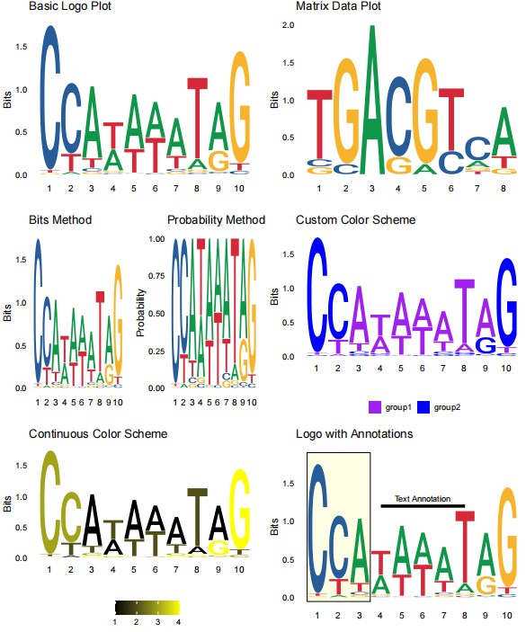

```{r setup, include=FALSE}
knitr::opts_chunk$set(
  collapse = T, echo=T, comment="#>", message=F, warning=F,
	fig.align="center", fig.width=5, fig.height=3, dpi=150)
```


The SeqLogo plot scripts is referenced from MicrobiomeStatPlot [Inerst Reference below].

If you use this script, please cited 如果你使用本代码，请引用：

**Yong-Xin Liu**, Lei Chen, Tengfei Ma, Xiaofang Li, Maosheng Zheng, Xin Zhou, Liang Chen, Xubo Qian, Jiao Xi, Hongye Lu, Huiluo Cao, Xiaoya Ma, Bian Bian, Pengfan Zhang, Jiqiu Wu, Ren-You Gan, Baolei Jia, Linyang Sun, Zhicheng Ju, Yunyun Gao, **Tao Wen**, **Tong Chen**. 2023. EasyAmplicon: An easy-to-use, open-source, reproducible, and community-based pipeline for amplicon data analysis in microbiome research. **iMeta** 2(1): e83. https://doi.org/10.1002/imt2.83

The online version of this tuturial can be found in https://github.com/YongxinLiu/MicrobiomeStatPlot


**Authors**
First draft(初稿)：Defeng Bai(白德凤)；Proofreading(校对)：Ma Chuang(马闯) and Jiani Xun(荀佳妮)；Text tutorial(文字教程)：Defeng Bai(白德凤)


# Introduction简介

什么是序列标识图？
What is Sequence logo plot

序列标识图(sequence logo), 序列标识图就是序列的logo，它是以图形的方式依次绘出序列比对中各个位置上出现的残基，每个位置上残基的累积可以反映出该位置上残基的一致性。每个残基对应图形字符的大小与残基在该位置上出现的频率成正比。在生物信息分析中，经常要做序列标识图。

Sequence logo, a sequence logo is the logo of a sequence. It is a graphical representation of the residues at each position in the sequence alignment. The accumulation of residues at each position can reflect the consistency of the residues at that position. The size of the graphic character corresponding to each residue is proportional to the frequency of occurrence of the residue at that position. In bioinformatics analysis, sequence logos are often used.


关键字：微生物组数据分析、MicrobiomeStatPlot、序列标识图、R语言可视化

Keywords: Microbiome analysis, MicrobiomeStatPlot, SeqLogo Plot , R visulization


## Packages installation软件包安装

```{r}
# 基于CRAN安装R包，检测没有则安装 Installing R packages based on CRAN and installing them if they are not detected
p_list = c("ggplot2", "ggseqlogo", "cowplot" , "gridExtra")
for(p in p_list){if (!requireNamespace(p)){install.packages(p)}
    library(p, character.only = TRUE, quietly = TRUE, warn.conflicts = FALSE)}

# 加载R包 Loading R packages
suppressWarnings(suppressMessages(library(ggplot2)))
suppressWarnings(suppressMessages(library(ggseqlogo)))
suppressWarnings(suppressMessages(library(cowplot)))
suppressWarnings(suppressMessages(library(gridExtra)))
```


# SeqLogo Plot 序列标识图

## 序列标识图R语言实战
Sequence logo using R software

参考：https://mp.weixin.qq.com/s/dh1SoNJq3rnw5fuaPp98lw

```{r SeqLogo Plot, fig.show='asis', fig.width=4, fig.height=2.5}
# Load data
# 载入数据
data(ggseqlogo_sample)

# Example data from ggseqlogo package
# data("pfms_dna")  # Matrix data
# data("seqs_dna")  # DNA sequences

# 1. Basic Logo Plot
# 1.基础Logi图
p1 <- ggseqlogo(seqs_dna$MA0001.1, 
                method = "bits", 
                stack_width = 0.95) +
  ggtitle("Basic Logo Plot") +
  theme_logo(base_size = 14) +
  theme(legend.position = "bottom", 
        axis.text.x = element_text(size = 12),
        plot.title = element_text(size = 16))

# 2. Matrix Data Plot
# 2. 矩阵数据图
p2 <- ggseqlogo(pfms_dna$MA0018.2, 
                method = "bits") +
  ggtitle("Matrix Data Plot") +
  theme_logo(base_size = 14) +
  theme(legend.position = "bottom", 
        axis.text.x = element_text(size = 12),
        plot.title = element_text(size = 16))

# 3. Bit vs Probability Method
# 3. 比特与概率法比较
# (p3 <- grid.arrange(
#   ggseqlogo(seqs_dna$MA0001.1, method = 'bits') + ggtitle("Bits Method") +
#     theme_logo(base_size = 14) +
#     theme(legend.position = "bottom",
#           axis.text.x = element_text(size = 12),
#           plot.title = element_text(size = 16)),
# 
#   ggseqlogo(seqs_dna$MA0001.1, method = 'prob') + ggtitle("Probability Method") +
#     theme_logo(base_size = 14) +
#     theme(legend.position = "bottom",
#           axis.text.x = element_text(size = 12),
#           plot.title = element_text(size = 16)),
# 
#   ncol = 2
# ))

# 4. Custom Color Schemes
# 4. 自定义颜色
cs1 <- make_col_scheme(chars = c('A', 'T', 'C', 'G'), 
                       groups = c('group1', 'group1', 'group2', 'group2'), 
                       cols = c('purple', 'purple', 'blue', 'blue'))

cs2 <- make_col_scheme(chars = c('A', 'T', 'C', 'G'), 
                       values = 1:4)

p4 <- ggseqlogo(seqs_dna$MA0001.1, 
                col_scheme = cs1) +
  ggtitle("Custom Color Scheme") +
  theme_logo(base_size = 14) +
  theme(legend.position = "bottom", 
        axis.text.x = element_text(size = 12),
        plot.title = element_text(size = 16))

p5 <- ggseqlogo(seqs_dna$MA0001.1, 
                col_scheme = cs2) +
  ggtitle("Continuous Color Scheme") +
  theme_logo(base_size = 14) +
  theme(legend.position = "bottom", 
        axis.text.x = element_text(size = 12),
        plot.title = element_text(size = 16))

# 5. Logo with Annotations
# 5. Logo带有注释信息
p6 <- ggplot() +
  annotate('rect', xmin = 0.5, xmax = 3.5, ymin = -0.05, ymax = 1.9, 
           alpha = 0.1, col = 'black', fill = 'yellow') +
  geom_logo(seqs_dna$MA0001.1, stack_width = 0.90) +
  annotate('segment', x = 4, xend = 8, y = 1.2, yend = 1.2, size = 2) +
  annotate('text', x = 6, y = 1.3, label = 'Text Annotation') +
  ggtitle("Logo with Annotations") +
  theme_logo(base_size = 14) +
  theme(legend.position = "bottom", 
        axis.text.x = element_text(size = 12),
        plot.title = element_text(size = 16))

# 6. Font Variations
# 6. 字体变化
fonts <- list_fonts(F)
p7_list <- lapply(fonts, function(f) {
  ggseqlogo(seqs_dna$MA0001.1, font = f) + ggtitle(f) +
    theme_logo(base_size = 14) +
    theme(legend.position = "bottom", 
          axis.text.x = element_text(size = 12),
          plot.title = element_text(size = 16))
})

# Save plots to PDF
# 保存图片
pdf("results/optimized_ggseqlogo_plots.pdf", width = 10, height = 12)

# Arrange plots in a grid
#grid.arrange(p1, p2, p3, p4, p5, p6, ncol = 2)
grid.arrange(p1, p2, p4, p5, p6, ncol = 2)

# Print font variations
for (p in p7_list) {
  print(p)
}

# Close the PDF device
dev.off()
```





If used this script, please cited:
使用此脚本，请引用下文：

**Yong-Xin Liu**, Lei Chen, Tengfei Ma, Xiaofang Li, Maosheng Zheng, Xin Zhou, Liang Chen, Xubo Qian, Jiao Xi, Hongye Lu, Huiluo Cao, Xiaoya Ma, Bian Bian, Pengfan Zhang, Jiqiu Wu, Ren-You Gan, Baolei Jia, Linyang Sun, Zhicheng Ju, Yunyun Gao, **Tao Wen**, **Tong Chen**. 2023. EasyAmplicon: An easy-to-use, open-source, reproducible, and community-based pipeline for amplicon data analysis in microbiome research. **iMeta** 2: e83. https://doi.org/10.1002/imt2.83

Copyright 2016-2024 Defeng Bai <baidefeng@caas.cn>, Chuang Ma <22720765@stu.ahau.edu.cn>, Jiani Xun <15231572937@163.com>, Yong-Xin Liu <liuyongxin@caas.cn>

