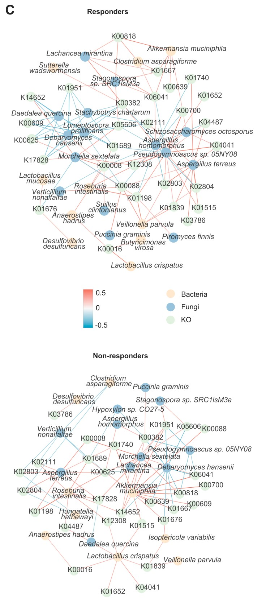
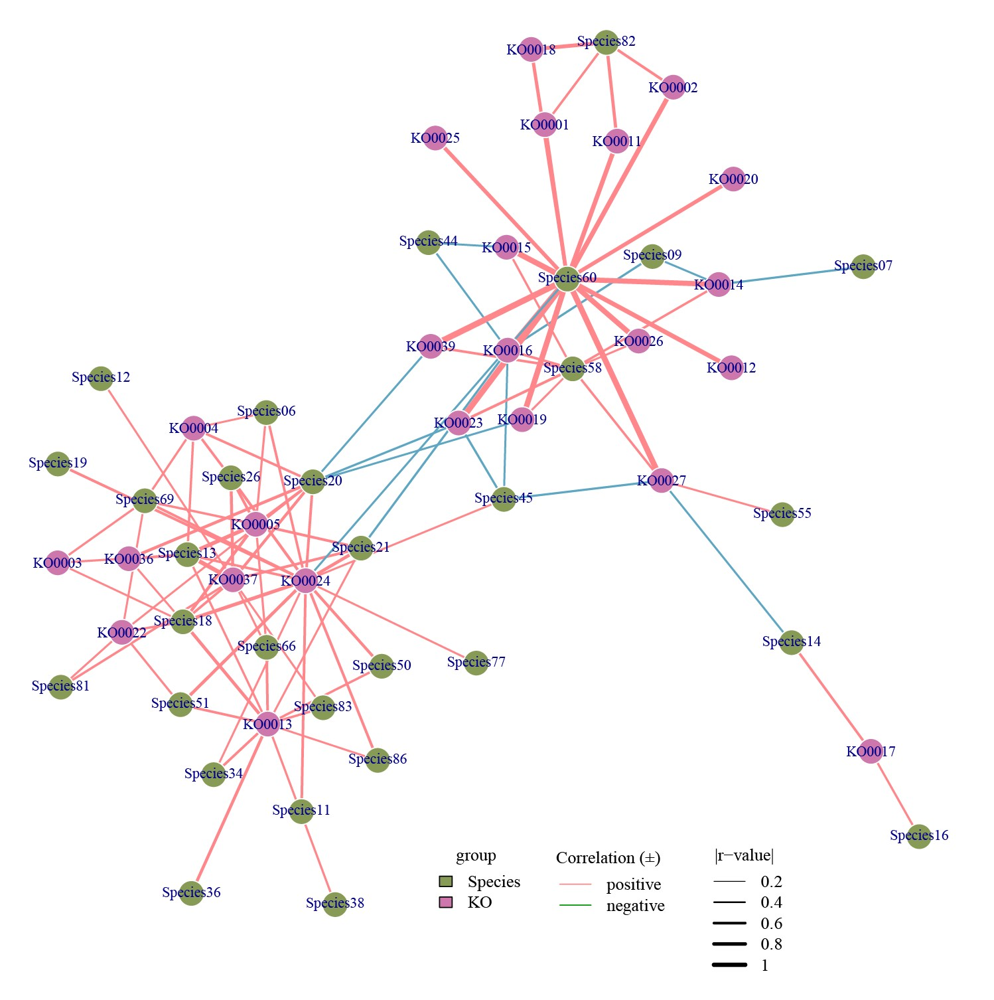

```{r setup, include=FALSE}
knitr::opts_chunk$set(
  collapse = T, echo=T, comment="#>", message=F, warning=F,
	fig.align="center", fig.width=5, fig.height=3, dpi=150)
```


The Species and Gene Spearman Correlation Network Analysis scripts is referenced from MicrobiomeStatPlot [Inerst Reference below].

If you use this script, please cited 如果你使用本代码，请引用：

**Yong-Xin Liu**, Lei Chen, Tengfei Ma, Xiaofang Li, Maosheng Zheng, Xin Zhou, Liang Chen, Xubo Qian, Jiao Xi, Hongye Lu, Huiluo Cao, Xiaoya Ma, Bian Bian, Pengfan Zhang, Jiqiu Wu, Ren-You Gan, Baolei Jia, Linyang Sun, Zhicheng Ju, Yunyun Gao, **Tao Wen**, **Tong Chen**. 2023. EasyAmplicon: An easy-to-use, open-source, reproducible, and community-based pipeline for amplicon data analysis in microbiome research. **iMeta** 2(1): e83. https://doi.org/10.1002/imt2.83

The online version of this tuturial can be found in https://github.com/YongxinLiu/MicrobiomeStatPlot


**Authors**
First draft(初稿)：Defeng Bai(白德凤)；Proofreading(校对)：Ma Chuang(马闯) and Jiani Xun(荀佳妮)；Text tutorial(文字教程)：Defeng Bai(白德凤)


# Introduction简介

在分析物种和基因相关性，或者分析多界物种与基因或者其它因子的相关性时，常常用到Spearman相关性网络来展示多个分组之间的相关性。这里从实际案例出发，尝试用Gephi和R软件实现物种和基因的Spearman相关性网络分析。

When analyzing the correlation between species and genes, or analyzing the correlation between multi -bounds species and genes or other factors, the Spearman correlation network is often used to display the correlation between multiple groups. Starting from actual cases, try to use Gephi and R software to implement SPEARMAN correlation network analysis of species and genes.


关键字：微生物组数据分析、MicrobiomeStatPlot、物种和基因Spearman相关网络分析、R语言可视化

Keywords: Microbiome analysis, MicrobiomeStatPlot, Species and Gene Spearman Correlation Network Analysis , R visulization


## Species and Gene Spearman Correlation Network Analysis Example 物种和基因Spearman相关网络分析案例

这是来自于上海交通大学医学院Haoyan Chen和Jie Hong课题组2023年发表于Cell Host & Microbe上的一篇论文。论文题目为：Multi-kingdom gut microbiota analyses define bacterial-fungal interplay and microbial markers of pan-cancer immunotherapy across cohorts. https://doi.org/10.1016/j.chom.2023.10.005

This is a paper from Haoyan Chen and Jie HONG Research Group from Shanghai Jiaotong University School of Medicine. The thesis title is: Multi-Kingdom Gut Microbiota Analyser DEFINE BACTERIAL Interplay and Microbial Marlet Markers of Pan-CANCER IMMUNORAPY ACROSS COHORTS: https: //doi.org/10.1016/j.chom.2023.10.005



Figure 6. C) Co-occurrence network of multi-kingdom markers and differentially abundant KO genes of metabolism in PD-1 blockade responders and non-responders. Nodes of bacteria were colored in green and fungi in blue, KO genes in red. Positive correlations were colored in orange and negative in blue.

图 6. C) PD-1 阻断反应者和无反应者中多界标记和代谢差异丰度 KO 基因的共现网络。细菌节点用绿色表示，真菌节点用蓝色表示，KO基因用红色表示。正相关性用橙色表示，负相关性用蓝色表示。


**结果**

To explore the relationship between metabolic functions and microbiota, the correlation between differential metabolic KO genes and multi-kingdom markers was assessed. We noticed that the fungus Schizosaccharomyces octosporus, which was the hub of the multi-kingdom network in responders (Figure 5B), had positive correlations with 2 KO genes. This was not observed in non-responders (Figure 6C), suggesting that the enrichment of Schizosaccharomyces octosporus and its metabolic activities might be specific to responders. 

为了探索代谢功能与微生物群之间的关系，我们评估了差异代谢 KO 基因与多界标记之间的相关性。我们注意到，真菌裂殖酵母 (Schizosaccharomyces octosporus) 是响应者多界网络的中心 (图 5B)，与 2 个 KO 基因呈正相关。在无响应者中没有观察到这种情况 (图 6C)，这表明裂殖酵母的富集及其代谢活动可能对响应者具有特异性。


## Packages installation软件包安装

```{r}
# 基于CRAN安装R包，检测没有则安装
p_list = c("igraph","Hmisc","psych","dplyr","tidyr")
for(p in p_list){if (!requireNamespace(p)){install.packages(p)}
    library(p, character.only = TRUE, quietly = TRUE, warn.conflicts = FALSE)}

# 加载R包 Load the package
suppressWarnings(suppressMessages(library(igraph)))
suppressWarnings(suppressMessages(library(Hmisc)))
suppressWarnings(suppressMessages(library(psych)))
suppressWarnings(suppressMessages(library(dplyr)))
suppressWarnings(suppressMessages(library(tidyr)))
```


# Species and Gene Spearman Correlation Network Analysis 物种和基因Spearman相关网络分析

## Spearman Correlation Calculation and plot Spearman相关性计算及绘图

```{r spearman correlation network, fig.show='asis', fig.width=4, fig.height=2.5}
# 载入数据
# Load data
mic <- read.table("data/Species_data.txt", sep="\t", header=T, check.names=F,row.names = 1)
mic = apply(mic, 2, function(x) x/100)
gene <- read.table("data/KO_data.txt", sep="\t", header=T, check.names=F,row.names = 1)
group <- read.table("data/group.txt", sep="\t", header=T, check.names=F)

mic <- as.data.frame(t(mic))
mic$sample <- rownames(mic)
gene <- as.data.frame(t(gene))
gene$sample <- rownames(gene)
df <- merge(mic, gene, by = "sample")
rownames(df) <- df$sample
df <- df[-1]
head(df)

# 计算相关性并以p>0.05作为筛选阈值进行数据处理
data<-as.matrix(df)
cor<- corr.test(data, method="spearman",adjust="BH")
data.cor <- as.data.frame(cor$r)

r.cor<-data.frame(cor$r)[91:117,1:90]
p.cor<-data.frame(cor$p)[91:117,1:90]
r.cor[p.cor>0.05] <- 0
r.cor[abs(r.cor) < 0.3] <- 0

# 构建网络连接属性及节点属性
# 将数据转换为long format进行合并并添加连接属性
r.cor$from = rownames(r.cor)
p.cor$from = rownames(p.cor)
p_value <-  p.cor %>%
  gather(key = "to", value = "p", -from) %>%
  data.frame() 
#p_value$FDR <- p.adjust(p_value$p,"BH")
p_value <- p_value[, -3]
cor.data<- r.cor %>%
  gather(key = "to", value = "r", -from) %>%
  data.frame() %>%
  left_join(p_value, by=c("from","to")) %>%
  #diff$p.value <- p.adjust(diff$p.value,"BH")
  #filter(FDR <= 1e-5, from != to) %>%
  #filter(p <= 0.001, from != to) %>%
  mutate(
    linecolor = ifelse(r > 0,"positive","negative"),
    linesize = abs(r)
  )

cor.data <- cor.data[abs(cor.data$r)>0.3, ]
write.csv(cor.data, "results/Species_KO_all_correlations_0.2.csv")

###设置节点属性
vertices <- c(as.character(cor.data$from),as.character(cor.data$to)) %>%
  as_tibble() %>%
  group_by(value) %>%
  summarise()
colnames(vertices) <- "name"
vertices <- vertices %>%
  left_join(group,by="name")
vertices$group <- factor(vertices$group, levels = c("Species","KO" ))
vertices <- vertices %>%
  arrange(group)

#构建graph数据结构并添加网络基础属性、保存数据
###构建graph数据结构
graph <- graph_from_data_frame(cor.data, vertices = vertices, directed = FALSE )
E(graph)$weight <- abs(E(graph)$r)
V(graph)$label <- V(graph)$name
###保存数据
#write_graph(graph, "Healthy_180_net13_new0911.graphml", format="graphml")
write_graph(graph, "results/Species_KO_0.2.graphml", format="graphml")


# 可视化方式1：基于Gephi软件进行可视化 https://gephi.org/

# 可视化方式2：利用igraph进行可视化
g <- graph
# 准备网络图布局数据
# Preparing network diagram layout data。
layout1 <- layout_in_circle(g)
layout5 <- layout_with_graphopt(g)

## 设置绘图颜色
## Setting the drawing color
color <- c("#879b56","#ce77ad")

names(color) <- unique(V(g)$group) 
V(g)$point.col <- color[match(V(g)$group,names(color))] 

## 边颜色按照相关性正负设置
## The edge color is set according to the positive or negative correlation
#E(g)$color <- ifelse(E(g)$linecolor == "positive","#ff878c",rgb(0,147,0,maxColorValue = 255))
E(g)$color <- ifelse(E(g)$linecolor == "positive","#ff878c","#5ea6c2")

pdf("results/network_group_graphopt.pdf",family = "Times",width = 10,height = 12)
par(mar=c(5,2,1,2))
plot.igraph(g, layout=layout5,
     vertex.color=V(g)$point.col,
     vertex.border=V(g)$point.col,
     vertex.size=6,
     vertex.frame.color="white",
     vertex.label=g$name,
     vertex.label.cex=0.8,
     vertex.label.dist=0, 
     vertex.label.degree = pi/2,
     vertex.label.col="black",
     edge.arrow.size=0.5,
     edge.width=abs(E(g)$r)*6,
     )

# 设置图例
legend(
  title = "group",
  list(x = min(layout1[,1])-0.05,
       y = min(layout1[,2])-0.05), 
  legend = c(unique(V(g)$group)),
  fill = color,
  #pch=1
)

legend(
  title = "|r-value|",
  list(x = min(layout1[,1])+0.6,
       y = min(layout1[,2])-0.05),
  legend = c(0.2,0.4,0.6,0.8,1.0),
  col = "black",
  lty=1,
  lwd=c(0.2,0.4,0.6,0.8,1.0)*4,
)

legend(
  title = "Correlation (±)",
  list(x = min(layout1[,1])+1.0,
       y = min(layout1[,2])-0.05),
  legend = c("positive","negative"),
  col = c("#ff878c",rgb(0,147,0,maxColorValue = 255)),
  lty=1,
  lwd=1
)
dev.off()
```





If used this script, please cited:
使用此脚本，请引用下文：

**Yong-Xin Liu**, Lei Chen, Tengfei Ma, Xiaofang Li, Maosheng Zheng, Xin Zhou, Liang Chen, Xubo Qian, Jiao Xi, Hongye Lu, Huiluo Cao, Xiaoya Ma, Bian Bian, Pengfan Zhang, Jiqiu Wu, Ren-You Gan, Baolei Jia, Linyang Sun, Zhicheng Ju, Yunyun Gao, **Tao Wen**, **Tong Chen**. 2023. EasyAmplicon: An easy-to-use, open-source, reproducible, and community-based pipeline for amplicon data analysis in microbiome research. **iMeta** 2: e83. https://doi.org/10.1002/imt2.83

Copyright 2016-2024 Defeng Bai <baidefeng@caas.cn>, Chuang Ma <22720765@stu.ahau.edu.cn>, Jiani Xun <15231572937@163.com>, Yong-Xin Liu <liuyongxin@caas.cn>


