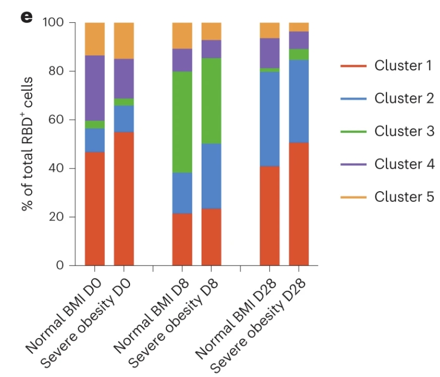
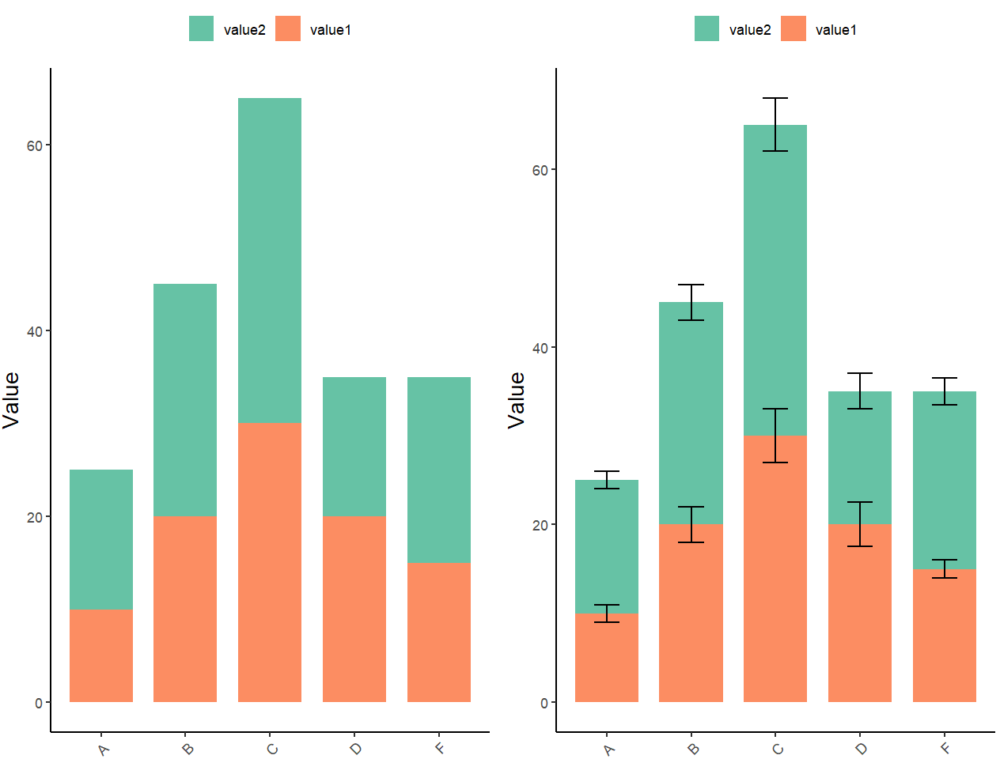
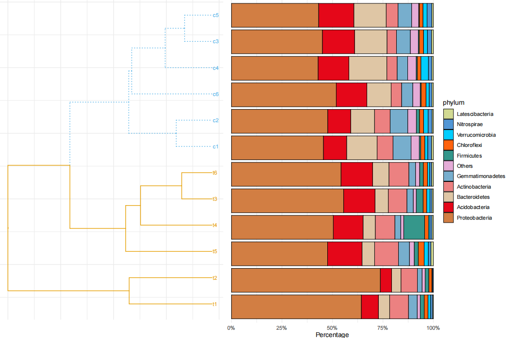
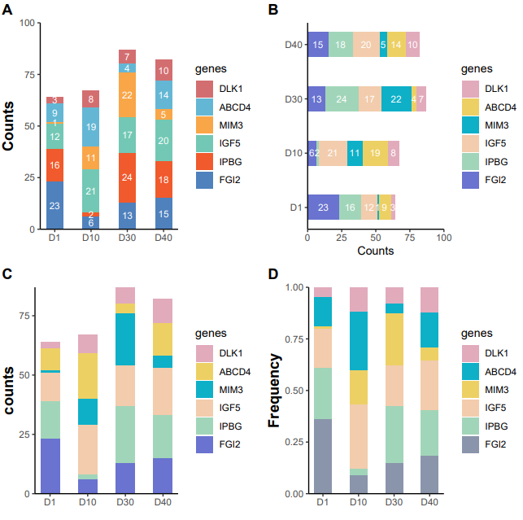
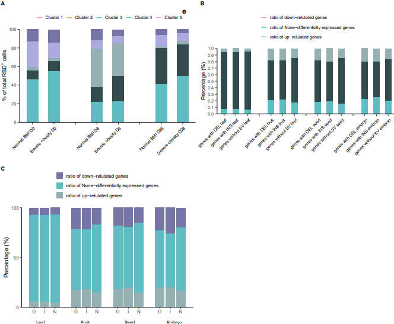
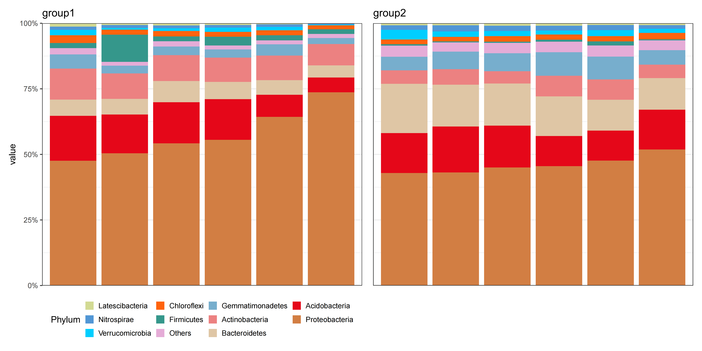
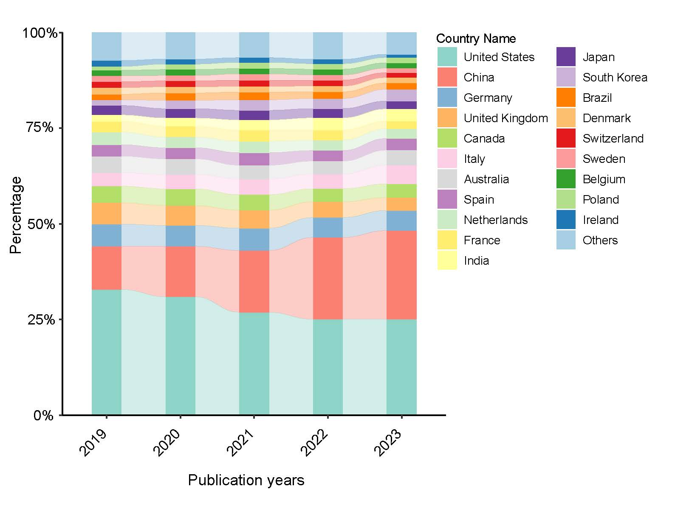

```{r setup, include=FALSE}
knitr::opts_chunk$set(
  collapse = T, echo=T, comment="#>", message=F, warning=F,
	fig.align="center", fig.width=5, fig.height=3, dpi=150)
```


The Stack bar plot scripts is referenced from MicrobiomeStatPlot [Inerst Reference below].

If you use this script, please cited 如果你使用本代码，请引用：

**Yong-Xin Liu**, Lei Chen, Tengfei Ma, Xiaofang Li, Maosheng Zheng, Xin Zhou, Liang Chen, Xubo Qian, Jiao Xi, Hongye Lu, Huiluo Cao, Xiaoya Ma, Bian Bian, Pengfan Zhang, Jiqiu Wu, Ren-You Gan, Baolei Jia, Linyang Sun, Zhicheng Ju, Yunyun Gao, **Tao Wen**, **Tong Chen**. 2023. EasyAmplicon: An easy-to-use, open-source, reproducible, and community-based pipeline for amplicon data analysis in microbiome research. **iMeta** 2(1): e83. https://doi.org/10.1002/imt2.83

The online version of this tuturial can be found in https://github.com/YongxinLiu/MicrobiomeStatPlot

**Authors**
First draft(初稿)：Defeng Bai(白德凤)；Proofreading(校对)：Ma Chuang(马闯) and Jiani Xun(荀佳妮)；Text tutorial(文字教程)：Defeng Bai(白德凤)


# Introduction简介

什么是堆叠柱状图？
What is a stacked bar chart?
参考：https://mp.weixin.qq.com/s/5t0BjCB7sBgoaNRrdyoReQ

堆叠柱状图，它通过堆叠的方式在单一柱子内展示多个类别的数据，以揭示每个类别在总体中的贡献或占比。堆叠柱状图将每个柱子进行分割，以显示相同类型下各个数据的大小情况。每一根柱子上的值分别代表不同的数据大小，而每一层又代表不同分类的数据，不同分类数据的总和代表整根柱子的高度。堆叠柱状图适用于比较每个分组的数据总量，以及每个分组内部各个小分类的数据大小和占比。它常用于销售数据的比较、市场份额分析、产品组合优化等场景。例如，可以使用堆叠柱状图来展示不同产品一年的销售额在每个月的对比，或者不同销售渠道的销售额对比。

Stacked bar charts, which display data from multiple categories within a single column by stacking them to reveal the contribution or share of each category in the overall picture. A stacked bar chart splits each bar to show how the size of individual data under the same type. The values on each bar represent different data sizes, and each layer represents a different category of data, with the sum of the different categories representing the height of the entire bar. Stacked bar charts are suitable for comparing the total amount of data in each subgroup, as well as the size and percentage of data in each subcategory within each subgroup. It is commonly used in scenarios such as comparison of sales data, market share analysis, and product mix optimisation. For example, a stacked bar chart can be used to show the comparison of sales of different products in a year in each month, or the comparison of sales in different sales channels.


关键字：微生物组数据分析、MicrobiomeStatPlot、堆叠柱状图、R语言可视化

Keywords: Microbiome analysis, MicrobiomeStatPlot, Stack bar plot, R visulization


## Stack bar chart plot  堆叠柱状图案例

参考文献：https://www.nature.com/articles/s41591-023-02343-2

这篇文章是MRC毒理学研究所James Thaventhiran团队等人合作于2023年在Nature medicine在线发表题为“Accelerated waning of the humoral response to COVID-19 vaccines in obesity”的研究论文。



Fig. 3: Immune response to third (booster) dose COVID-19 vaccination.
图 3：接种第三剂 COVID-19 疫苗后的免疫反应。

**结果**

To further assess humoral immunity associated with severe obesity, we next used an established high-dimensional spectral flow cytometry panel to enumerate and phenotype SARS-CoV-2 RBD-binding B cells (Fig. 3c–e and Extended Data Fig. 6a–c). Unsupervised t-distributed stochastic neighbor embedding (tSNE) analysis of RBD-binding (RBD+) cells was performed on all IgD− B cells combined from individuals with normal BMI and individuals with severe obesity at several timepoints. Cluster 1 represented IgM+ B cells; cluster 2 showed features of atypical or age-associated B cells32; cluster 3 separated plasmablasts; and the smallest clusters (4 and 5) were class-switched memory B cells (Fig. 3c–e). 

为了进一步评估与重度肥胖相关的体液免疫，我们接下来使用已建立的高维光谱流式细胞仪面板对 SARS-CoV-2 RBD 结合型 B 细胞进行计数和表型（图3c-e和扩展数据图6a-c）。RBD结合（RBD+）细胞的无监督 t 分布随机邻接嵌入（tSNE）分析是在几个时间点对来自正常体重指数（BMI）个体和重度肥胖个体的所有 IgD- B 细胞组合进行的。簇 1 代表 IgM+ B 细胞；簇 2 显示了非典型或年龄相关 B 细胞的特征32；簇 3 分离了浆细胞；最小的簇（簇 4 和簇 5）是类开关记忆 B 细胞（图 3c-e）。


## Packages installation软件包安装

```{r}
# 基于CRAN安装R包，检测没有则安装 Installing R packages based on CRAN and installing them if they are not detected
p_list = c("ggplot2", "reshape2", "ggsci", "patchwork", "dplyr", "treeio", 
           "cowplot", "ggtree", "cols4all", "ggh4x", "ggprism", "tidyverse", 
           "tidyr", "plyr","scales","phytools","gridExtra","ggalluvial","readxl",
           "alluvial")
for(p in p_list){if (!requireNamespace(p)){install.packages(p)}
    library(p, character.only = TRUE, quietly = TRUE, warn.conflicts = FALSE)}

# 加载R包 Loading R packages
suppressWarnings(suppressMessages(library(ggplot2)))
suppressWarnings(suppressMessages(library(reshape2)))
suppressWarnings(suppressMessages(library(ggsci)))
suppressWarnings(suppressMessages(library(patchwork)))
suppressWarnings(suppressMessages(library(dplyr)))
suppressWarnings(suppressMessages(library(treeio)))
suppressWarnings(suppressMessages(library(cowplot)))
suppressWarnings(suppressMessages(library(ggtree)))
suppressWarnings(suppressMessages(library(cols4all)))
suppressWarnings(suppressMessages(library(ggh4x)))
suppressWarnings(suppressMessages(library(ggprism)))
suppressWarnings(suppressMessages(library(tidyverse)))
suppressWarnings(suppressMessages(library(tidyr)))
suppressWarnings(suppressMessages(library(plyr)))
suppressWarnings(suppressMessages(library(phytools)))
suppressWarnings(suppressMessages(library(scales)))
suppressWarnings(suppressMessages(library(gridExtra)))
suppressWarnings(suppressMessages(library(dplyr)))
suppressWarnings(suppressMessages(library(readxl)))
suppressWarnings(suppressMessages(library(ggalluvial)))
suppressWarnings(suppressMessages(library(alluvial)))
```


# Stack bar plot

## Practice1 实战1

### Stacked histogram with error lines 带误差线堆叠柱状图

```{r simple bar chart,  fig.show='asis', fig.width=4, fig.height=2.5}
# 载入数据
# Load data
df1 <- read.table(file = "data/data_practice1.txt", sep = "\t", header = TRUE, check.names = FALSE)

# 误差线位置
# Error bar position
df1 <- df1 %>% 
  group_by(group) %>% 
  dplyr::mutate(xx=cumsum(value))

# 保证误差线可以对应其正确位置
# Ensure that the error bars correspond to their correct positions
df1$variable <- factor(df1$variable,levels = c("value2","value1"))

# 转换为因子，指定绘图顺序
# Convert to factors and specify drawing order
df1$group <- factor(df1$group, levels = unique(df1$group))

# 配色方案
# Set color
optimized_colors_grouped <- c("#1b9e77", "#d95f02")
optimized_colors_stacked <- c("#66c2a5", "#fc8d62")

# 优化后的分组柱状图绘制
# Plot
p1_optimized <- ggplot(data = df1, aes(x = group, y = value, fill = variable)) +
  geom_bar(position = "dodge", stat = "identity", color = NA, width = 0.75) +
  scale_fill_manual(values = optimized_colors_grouped) +
  theme_minimal(base_size = 16) +
  theme(
    legend.position = "top",
    axis.text.x = element_text(angle = 45, hjust = 1),
    axis.title.y = element_text(size = 14),
    legend.title = element_blank()
  ) +
  labs(y = "Value", x = "")
#p1_optimized

# 优化后的堆叠柱状图绘制
# Plot
p2_optimized <- ggplot(data = df1, aes(x = group, y = value, fill = variable)) +
  geom_bar(position = "stack", stat = "identity", color = NA, width = 0.75) +
  scale_fill_manual(values = optimized_colors_stacked) +
  #theme_minimal(base_size = 16) +
  theme_classic()+
  theme(
    legend.position = "top",
    axis.text.x = element_text(angle = 45, hjust = 1),
    axis.title.y = element_text(size = 14),
    legend.title = element_blank()
  ) +
  labs(y = "Value", x = "")
ggsave(filename = "results/Stacked_bar_plot.pdf", plot = p2_optimized, width = 10, height = 7)
#p2_optimized

# 为分组柱状图添加误差棒
# Add error bar
p3_optimized <- ggplot(df1, aes(x = group, y = value, fill = variable)) +
  geom_bar(position = position_dodge(), stat = "identity", color = NA, width = 0.75) +
  scale_fill_manual(values = optimized_colors_grouped) +
  #theme_minimal(base_size = 16) +
  theme_classic()+
  theme(
    legend.position = "top",
    axis.text.x = element_text(angle = 45, hjust = 1),
    axis.title.y = element_text(size = 14),
    legend.title = element_blank()
  ) +
  geom_errorbar(aes(ymin = value - sd, ymax = value + sd),
                position = position_dodge(width = 0.75), width = 0.3) +
  labs(y = "Value", x = "")
#p3_optimized

# 为堆叠柱状图添加误差棒
# Add error bar
df1 <- df1 %>%
  group_by(group) %>% 
  dplyr::mutate(position = cumsum(value))

p4_optimized <- ggplot(df1, aes(x = group, y = value, fill = variable)) +
  geom_bar(position = "stack", stat = "identity", color = NA, width = 0.75) +
  scale_fill_manual(values = optimized_colors_stacked) +
  #theme_minimal(base_size = 16) +
  theme_classic()+
  theme(
    legend.position = "top",
    axis.text.x = element_text(angle = 45, hjust = 1),
    axis.title.y = element_text(size = 14),
    legend.title = element_blank()
  ) +
  geom_errorbar(aes(ymin = position - sd, ymax = position + sd),
                width = 0.3) +
  labs(y = "Value", x = "")
ggsave(filename = "results/Stacked_bar_with_error.pdf", plot = p4_optimized, width = 10, height = 7)
#p4_optimized

# 组合图
# Combined
library(patchwork)
p5_optimized <- p2_optimized + p4_optimized
#p5_optimized
```





## Practice2 实战2

### Stack bar plot with Cluster Tree 带聚类树的堆叠柱状图

参考：https://mp.weixin.qq.com/s/FK5ZOtsfx7clVOSKLR23FQ

```{r Stacked bar Chart with Cluster Tree, ,fig.show='asis', fig.width=4, fig.height=2.5}
# 导入OTU文件
# Import OTU file
otu <- read.table('data/phylum_top10.txt', header = T)

# 计算Bray-Curtis距离，均值聚类，生成树形图
# Calculate Bray-Curtis distance, mean clustering, generate tree diagrams
tree <- hclust(vegan::vegdist(t(otu), method = 'bray'), method = 'average') %>%
  as.phylo()

# 对树形图节点进行分组
# Grouping of tree diagram nodes
tree <- groupClade(tree, .node = c(16))

# 绘制树形聚类图
# Plotting tree clusters
p1 <- ggtree(tree, aes(color = group, linetype = group)) + 
  geom_tiplab(aes(color = group), size = 3) + 
  scale_color_manual(values = c("#E69F00", "#56B4E9")) +  
  theme_minimal() +
  theme(legend.position = "none", 
        axis.line = element_blank(),  
        axis.text = element_blank(),  
        axis.ticks = element_blank())

# 计算每个分类的均值并按均值排序
# Calculate the mean for each classification and sort by mean
otu$mean <- apply(otu, 1, mean)
otu <- otu[order(otu$mean), ]
otu$phylum <- factor(rownames(otu), levels = rownames(otu))
otu <- otu[, -c(ncol(otu)-1)]

# 检查OTU数据中的分类数量
# Check the number of classifications in the OTU data
num_phyla <- length(unique(otu$phylum))

# 绘制物种组成柱状图
# Histograms of species composition
p2 <- otu %>%
  melt(id.vars = 'phylum') %>%
  ggplot(aes(variable, value, fill = phylum)) +
  geom_bar(stat = 'identity', position = 'fill', color = 'black', size = 0.3) +  # 添加边框
  scale_x_discrete(limits = c('t1', 't2', 't5', 't4', 't3', 't6', 'c1', 'c2', 'c6', 'c4', 'c3', 'c5')) +
  #scale_fill_igv()+ 
  scale_fill_manual(values = c("#d2da93","#5196d5","#00ceff","#ff630d","#35978b",
                  "#e5acd7","#77aecd","#ec8181","#dfc6a5","#e50719",
                  "#d27e43","#8a4984","#fe5094","#8d342e","#f94e54",
                  "#ffad00","#36999d","#00fc8d","#b64aa0","#9b82e1"))+
  scale_color_manual(values = c("#d2da93","#5196d5","#00ceff","#ff630d","#35978b",
                  "#e5acd7","#77aecd","#ec8181","#dfc6a5","#e50719",
                  "#d27e43","#8a4984","#fe5094","#8d342e","#f94e54",
                  "#ffad00","#36999d","#00fc8d","#b64aa0","#9b82e1"))+
  scale_y_continuous(expand = c(0, 0), labels = percent) +  
  coord_flip() +  
  theme_minimal() +  
  theme(axis.ticks.y = element_blank(),
        axis.title.y = element_blank(),
        axis.text.y = element_blank(),
        axis.line = element_blank()) +  
  labs(y = 'Percentage')

# 拼接两张图，调整布局
# Splicing two diagrams and adjusting the layout
p3 <- ggdraw() +
  draw_plot(p1, 0, 0.05, 0.45, 0.95) +  
  draw_plot(p2, 0.45, 0, 0.55, 1)  

# 保存图表为PDF文件 Save as pdf
ggsave(filename = "results/Stacked_bar_with_tree.pdf", plot = p3, width = 12, height = 8)
```





## Practice3 实战3

### Stacked bar chart 堆积柱状图

参考：https://mp.weixin.qq.com/s/JYt0QW1oR8vvORPmkyFHtw

```{r stacked bar chart1, fig.show='asis', fig.width=4, fig.height=2.5}
# 载入数据
# Load data
df <- read.table(file = "data/data_practice3.txt", sep = "\t", header = TRUE, check.names = FALSE)

# 基本堆叠柱状图
# Basic stack bar plot
p31 <- ggplot(df, aes(x = time, y = values, fill = genes)) +
  geom_col(width = 0.45, position = position_stack(vjust = 1)) +
  scale_fill_manual(values = c("#d36e70", "#64b7d4", "#f9a648", "#72c8b4", "#f05a2c", "#4f81bd")) +
  scale_y_continuous(expand = c(0, 0), limits = c(0, 100)) + # 调整y轴比例
  scale_x_discrete(expand = c(0.1, 0.1)) +
  geom_text(aes(label = values), position = position_stack(vjust = 0.5), colour = "white", size = 3) +
  labs(x = "", y = "Counts", title = "") +
  theme_prism(base_fontface = "plain", base_family = "serif", base_size = 16, 
              base_line_size = 0.8, axis_text_angle = 0) +
  theme_classic() +
  theme(axis.title.y = element_text(face = "bold", size = 14, color = "black", family = "sans"))


# 横向堆叠柱状图
# Horizontal stack bar plot
p32 <- ggplot(df, aes(x = time, y = values, fill = genes)) +
  geom_col(width = 0.45, position = position_stack(vjust = 1)) +
  scale_fill_manual(values = c("#e1abbc", "#edd064", "#0eb0c8", "#f2ccac", "#a1d5b9", "#6a73cf")) +
  scale_y_continuous(expand = c(0, 0), limits = c(0, 100)) + 
  scale_x_discrete(expand = c(0.1, 0.1)) +
  coord_flip() +
  geom_text(aes(label = values), position = position_stack(vjust = 0.5), colour = "white", size = 3) +
  labs(x = "", y = "Counts", title = "") +
  theme_prism(base_fontface = "plain", base_family = "serif", base_size = 16, base_line_size = 0.8, axis_text_angle = 0) +
  theme_classic() +
  theme(axis.title.y = element_text(face = "bold", size = 14, color = "black", family = "sans"))


# 不展示数量大小
# Do not display the quantity
p33 <- ggplot(df, aes(x = time, y = values, fill = genes)) +
  geom_col( width = 0.5,position = position_stack(vjust = 1)) +
  scale_fill_manual(values=c("#e1abbc","#edd064","#0eb0c8","#f2ccac","#a1d5b9","#6a73cf")) +
  scale_y_discrete(expand = c(0.0,0.0), limits = c(0, 25,50,75,94))+
  scale_x_discrete(expand = c(0.1,0.1), limits = c("D1","D10","D30","D40"))+
  labs(x = "", y = "counts", title = "") +
  theme_prism(base_fontface = "plain",
              base_family = "serif", 
              base_size = 16,  
              base_line_size = 0.8, 
              axis_text_angle = 0) +
  theme_classic()+
  theme(axis.title.y = element_text(face="bold",size = 14, color = "black",family = "sans")
  )

# 百分比形式展示
# Display as percentage
p34 <- ggplot(df, aes(x = time, y = values, fill = genes)) +
  geom_bar(width = 0.5,stat="identity",position = "fill") +
  scale_fill_manual(values=c("#e1abbc","#0eb0c8","#edd064","#f2ccac","#a1d5b9","#8a95ab")) +
  scale_y_discrete(expand = c(0.0,0.0),limits=c(0.00,0.25,0.50,0.75,1.00))+
  scale_x_discrete(expand = c(0.1,0.1), limits = c("D1","D10","D30","D40"))+
  labs(x = "", y = "Frequency", title = "") +
  theme_prism(base_fontface = "plain",
              base_family = "serif", 
              base_size = 16,  
              base_line_size = 0.8, 
              axis_text_angle = 0) +
  theme_classic()+
  theme(axis.title.y = element_text(face="bold",size = 14, color = "black",family = "sans")
  )
ggsave("results/stacked_bar_percentage.pdf", width = 8, height = 6)

# 组合图
# Combined
library(cowplot)
width = 89
height = 59
p0 = plot_grid(p31, p32, p33, p34, labels = c("A", "B", "C", "D"), ncol = 2)
ggsave("results/simple_stack_bar_plot.pdf", p0, width = width * 2, height = height * 3, units = "mm")
```





##  Practice4 实战4

### Stacked bar plot and line 堆积柱状图结合折线图

参考：https://mp.weixin.qq.com/s/ayHjWK7WwJGKn0B8WCivJg
参考：https://mp.weixin.qq.com/s/o9aveoC4LXb2Tu8kmGQ4rQ

```{r stacked bar chart2, fig.show='asis', fig.width=4, fig.height=2.5}
# 载入数据
# Load data
mydata <- read.table(file = "data/data_practice4.txt", sep = "\t", header = TRUE, check.names = FALSE)

# 两两比较绘图
# Plot
p41 <- ggplot(mydata, aes(x = type, y = values, fill = cell_groups)) +
  geom_col(width = 0.55, position = position_stack(reverse = TRUE), show.legend = FALSE) +
  geom_line(aes(colour = cell_groups)) +
  scale_x_discrete(limits = c("Normal BMI D0", "Severe obesity D0", 3,
                              "Normal BMI D8", "Severe obesity D8", 6,
                              "Normal BMI D28", "Severe obesity D28"),
                   labels = c("Normal BMI D0", "Severe obesity D0", "",
                              "Normal BMI D8", "Severe obesity D8", "",
                              "Normal BMI D28", "Severe obesity D28")) +
  scale_y_continuous(expand = c(0, 0), breaks = seq(0, 100, 20)) +
  #scale_fill_manual(values = c("firebrick1", "dodgerblue3", "limegreen", "blueviolet", "orange1")) +
  scale_fill_manual(values = c("#5ebcc2", "#324b4d", "#94b0b2", "#aba9dd", "#7575a6")) +
  theme_classic(base_size = 14) +
  theme(plot.subtitle = element_text(face = "bold", size = 18, hjust = -0.2, vjust = -3),
        axis.line = element_line(size = 0.3),
        axis.ticks = element_line(size = 0.3),
        axis.ticks.length = unit(0.2, "cm"),
        panel.grid = element_blank(),
        panel.border = element_blank(),
        axis.text.x = element_text(colour = "black",angle = 45, hjust = 0.97, vjust = 0.95),
        legend.position = "top") +
  labs(subtitle = "e",
       colour = "",
       fill = "",
       x = "",
       y = expression("% of total RBD"^"+"*" cells"))


# 三个比较绘图(方式1)
# Load data
dat1 <- read.table(file = "data/data_practice42.txt", sep = "\t", header = TRUE, check.names = FALSE)

colnames(dat1)<-paste0("X",1:4)
dat1 %>% 
  mutate(X4=factor(X4,levels = c("ratio of down-relulated genes",
                                 "ratio of up-relulated genes",
                                 "ratio of None-differentially expressed genes"))) 

p42 <- ggplot(dat1, aes(x = X2, y = X3, fill = X4)) +
  geom_col(width = 0.55, position = position_stack(reverse = TRUE), show.legend = FALSE) +
  geom_line(aes(colour = X4)) +
  #geom_bar(aes(colour = X4))+
  scale_x_discrete(limits = c("genes with DEL leaf", "genes with INS leaf", "genes without SV leaf", 4,
                              "genes with DEL fruit", "genes with INS fruit", "genes without SV fruit", 8,
                              "genes with DEL seed", "genes with INS seed", "genes without SV seed", 12,
                              "genes with DEL embryo", "genes with INS embryo", "genes without SV embryo"),
                   labels = c("genes with DEL leaf", "genes with INS leaf", "genes without SV leaf", "",
                              "genes with DEL fruit", "genes with INS fruit", "genes without SV fruit", "",
                              "genes with DEL seed", "genes with INS seed", "genes without SV seed", "",
                              "genes with DEL embryo", "genes with INS embryo", "genes without SV embryo")) +
  scale_y_continuous(expand = c(0, 0), breaks = seq(0, 1, 0.1)) +
  #scale_fill_manual(values = c("firebrick1", "dodgerblue3", "limegreen", "blueviolet", "orange1")) +
  scale_fill_manual(values = c("#5ebcc2", "#324b4d", "#94b0b2", "#aba9dd", "#7575a6")) +
  guides(fill=guide_legend(ncol = 1))+
  theme_classic(base_size = 14) +
  theme(plot.subtitle = element_text(face = "bold", size = 18, hjust = -0.2, vjust = -3),
        axis.line = element_line(size = 0.3),
        axis.ticks = element_line(size = 0.3),
        axis.ticks.length = unit(0.2, "cm"),
        panel.grid = element_blank(),
        panel.border = element_blank(),
        axis.text.x = element_text(colour = "black",angle = 45, hjust = 0.97, vjust = 0.95),
        legend.position = "top") +
  labs(subtitle = "e",
       colour = "",
       fill = "",
       x = "",
       y = "Percentage (%)")


# 三个比较绘图(方式2)
# 载入数据
dat2 <- read.table(file = "data/data_practice43.txt", sep = "\t", header = TRUE, check.names = FALSE)

colnames(dat2)<-paste0("X",1:5)
dat2 %>% 
  mutate(X5=factor(X5,levels = c("ratio of down-relulated genes",
                                 "ratio of up-relulated genes",
                                 "ratio of None-differentially expressed genes"))) 

# 绘图
p43 <- ggplot(data=dat2,aes(x=X2,y=X4))+
  geom_bar(aes(fill=X5),stat = "identity",
      position = "fill")+
  theme_bw(base_size = 15)+
  theme(panel.grid = element_blank(),
        panel.border = element_blank(),
        axis.line = element_line(),
        legend.position = "top",
        legend.title = element_blank())+
  guides(fill=guide_legend(ncol = 1))+
  scale_x_continuous(breaks = c(1,2,3,5,6,7,9,10,11,13,14,15),
                     labels = rep(c("D","I","N"),4))+
  scale_y_continuous(expand = expansion(mult = c(0,0)),
                    breaks = c(0,0.5,1),
                     labels = c(0,50,100))+
  labs(x=NULL,y="Percentage (%)")+
  scale_fill_manual(values = c("#7575a6","#5ebcc2","#94b0b2"))

# 分组标签
p44 <- data.frame(x=c(2,6,10,14),
           y=1,
           label=c("Leaf","Fruit","Seed","Embryo")) %>% 
  ggplot(aes(x=x,y=y))+
  geom_text(aes(label=label),
            hjust=0.5)+
  theme_void()+
  scale_x_continuous(limits = c(1,15))

# 组合图1
library(patchwork)
p45 <- p43+p44+
  plot_layout(ncol = 1,heights = c(10,1))

# 组合图2
# Combined
library(cowplot)
width = 89
height = 59
p0 = plot_grid(p41, p42, p45, labels = c("A", "B", "C"), ncol = 2)
ggsave("results/multigroup_stack_bar_plot.pdf", p0, width = width * 4, height = height * 5, units = "mm")
```





##  Practice5 实战5

### 排序堆叠柱状图(Ordered stack bar plot)

按照丰度最高的门排序

```{r, stacked bar chart3, fig.show='asis', fig.width=4, fig.height=2.5}
# 导入OTU文件
# Import OTU file
otu <- read.table('data/phylum_top10.txt', header = TRUE)

# 计算每个门的平均丰度并排序
# Calculate and rank the average abundance of each gate
otu$mean <- apply(otu, 1, mean)
otu <- otu[order(otu$mean), ]

# 转置数据并排序
# Transpose and sort the data
otu2 <- t(otu[, -13])
otu2 <- otu2[order(otu2[, 11]), ]
otu3 <- as.data.frame(t(otu2))
otu3$phylum <- factor(rownames(otu), levels = rownames(otu))

# 将数据框转换为长格式
# Converting data frames to long format
otu4 <- melt(otu3, id.vars = 'phylum')

# 分组信息处理
# Packet information processing
otu4$group <- gsub("t[1-6]", "group1", otu4$variable)
otu4$group <- gsub("c[1-6]", "group2", otu4$group)

# 绘制 group1 图形
# Drawing group1 graphs
otu5 <- otu4[otu4$group == "group1", ]
p_g2 <- ggplot(otu5, aes(x = factor(variable, levels = unique(variable)), 
                         y = value, fill = factor(phylum, levels = unique(phylum)))) +
  geom_bar(stat = "identity", position = "fill", width = 0.9) +
  scale_y_continuous(labels = scales::percent, expand = c(0, 0)) +
  guides(fill = guide_legend(title = "Phylum")) +
  theme_bw() +
  theme(axis.ticks.x = element_blank(), 
        axis.text.x = element_blank(),
        legend.key.size = unit(0.4, "cm"),
        axis.title.x = element_blank(),
        legend.position = "bottom") +
  ggtitle("group1") +
  scale_fill_manual(values = c("#d2da93","#5196d5","#00ceff","#ff630d","#35978b",
                                "#e5acd7","#77aecd","#ec8181","#dfc6a5","#e50719",
                                "#d27e43","#8a4984","#fe5094","#8d342e","#f94e54",
                                "#ffad00","#36999d","#00fc8d","#b64aa0","#9b82e1"))

# 绘制 group2 图形
# Drawing group2 graphs
otu6 <- otu4[otu4$group == "group2", ]
p_g3 <- ggplot(otu6, aes(x = factor(variable, levels = unique(variable)), 
                         y = value, fill = factor(phylum, levels = unique(phylum)))) +
  geom_bar(stat = "identity", position = "fill", width = 0.9) +
  scale_y_continuous(labels = scales::percent, expand = c(0, 0)) +
  guides(fill = guide_legend(title = "Phylum")) +
  theme_bw() +
  theme(axis.ticks.x = element_blank(), 
        axis.text.x = element_blank(),
        axis.text.y = element_blank(),
        axis.ticks.y = element_blank(),
        axis.title.y = element_blank(),
        legend.key.size = unit(0.4, "cm"),
        axis.title.x = element_blank(),
        legend.position = "none") +
  ggtitle("group2") +
  scale_fill_manual(values = c("#d2da93","#5196d5","#00ceff","#ff630d","#35978b",
                                "#e5acd7","#77aecd","#ec8181","#dfc6a5","#e50719",
                                "#d27e43","#8a4984","#fe5094","#8d342e","#f94e54",
                                "#ffad00","#36999d","#00fc8d","#b64aa0","#9b82e1"))

# 合并图形并保存为PDF
# Merge graphics and save as PDF
p_g4 <- p_g2 + p_g3
ggsave("results/phylum_composition_group1_group2.pdf", p_g4, width = 12, height = 6)
```




##  Practice6 实战6

### 堆叠柱状图连线(Stack bar plot with line)

参考：Yunyun Gao, Danyi Li, Yong-Xin Liu, Microbiome research outlook: past, present, and future, Protein & Cell, 2023, pwad031, https://doi.org/10.1093/procel/pwad031.


```{r, stacked bar chart4, fig.show='asis', fig.width=4, fig.height=2.5}
# 载入数据
# Load data
mydata<- read.table("data/FigureS1bBarplotWithLine.txt", header = T, sep='\t')

# 定义绘图顺序
# Define the desired order of levels for the ID variable
test1 <- gather(mydata, E1, E2, -ID) 
my_order<- c("Others","Ireland","Poland","Belgium","Sweden","Switzerland",
             "Denmark","Brazil","South Korea","Japan","India","France",
             "Netherlands","Spain","Australia","Italy","Canada",
             "United Kingdom","Germany","China","United States")

# Reorder the levels of the ID variable
# ID排序
test1$ID <- factor(test1$ID, levels = my_order)

# 绘图
# Plot
p61 <- ggplot(test1, aes(x=E1, y=E2,alluvium = ID)) + 
  geom_alluvium(aes(fill= ID),
                alpha= 0.4, width = 0.4) +
  geom_bar(stat="identity",aes(fill=ID), width = 0.4) +
  scale_y_continuous(expand = c(0,0)) +
  scale_fill_manual(values=c("#a6cee3","#1f78b4","#b2df8a","#33a02c","#fb9a99",
                                      "#e31a1c","#fdbf6f","#ff7f00","#cab2d6",
                                      "#6a3d9a","#ffff99","#ffed6f","#ccebc5",
                                      "#bc80bd","#d9d9d9","#fccde5","#b3de69",
                                      "#fdb462","#80b1d3","#fb8072","#8dd3c7"))+
                                        theme_classic() +
  theme(
    panel.background = element_rect(fill="white", colour="white", size=0.25),
    axis.line = element_line(colour="black", size=0.5),
    axis.title = element_text(size=13, color="black"),
    axis.text = element_text(size=12, color="black"),
    legend.text = element_text(size =10),
    aspect.ratio = 1, 
    plot.title = element_text(size = 10),
    axis.text.x = element_text(angle = 45, hjust = 1) 
  ) +
  guides(fill = guide_legend(reverse = TRUE))
#p61
ggsave("results/phylum_stack_line01.pdf", p61, width = 12, height = 6)
```




If used this script, please cited:
使用此脚本，请引用下文：

**Yong-Xin Liu**, Lei Chen, Tengfei Ma, Xiaofang Li, Maosheng Zheng, Xin Zhou, Liang Chen, Xubo Qian, Jiao Xi, Hongye Lu, Huiluo Cao, Xiaoya Ma, Bian Bian, Pengfan Zhang, Jiqiu Wu, Ren-You Gan, Baolei Jia, Linyang Sun, Zhicheng Ju, Yunyun Gao, **Tao Wen**, **Tong Chen**. 2023. EasyAmplicon: An easy-to-use, open-source, reproducible, and community-based pipeline for amplicon data analysis in microbiome research. **iMeta** 2: e83. https://doi.org/10.1002/imt2.83

Copyright 2016-2024 Defeng Bai <baidefeng@caas.cn>, Chuang Ma <22720765@stu.ahau.edu.cn>, Jiani Xun <15231572937@163.com>, Yong-Xin Liu <liuyongxin@caas.cn>