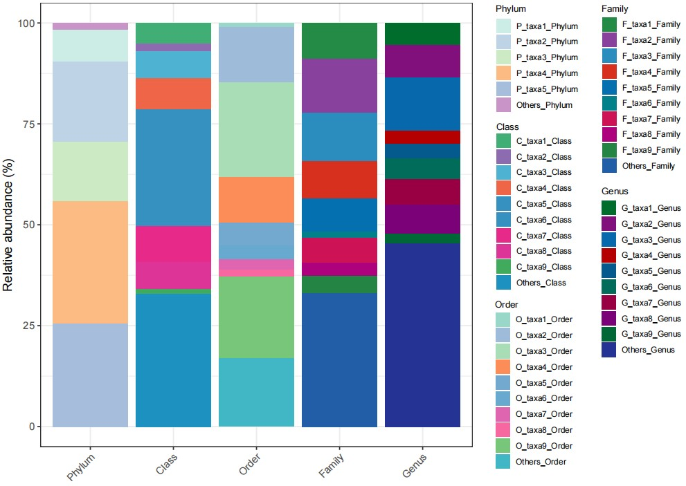

```{r setup, include=FALSE}
knitr::opts_chunk$set(
  collapse = T, echo=T, comment="#>", message=F, warning=F,
	fig.align="center", fig.width=5, fig.height=3, dpi=150)
```


The Multi-levels StackPlot in One Plot scripts is referenced from MicrobiomeStatPlot [Inerst Reference below].

If you use this script, please cited 如果你使用本代码，请引用：

**Yong-Xin Liu**, Lei Chen, Tengfei Ma, Xiaofang Li, Maosheng Zheng, Xin Zhou, Liang Chen, Xubo Qian, Jiao Xi, Hongye Lu, Huiluo Cao, Xiaoya Ma, Bian Bian, Pengfan Zhang, Jiqiu Wu, Ren-You Gan, Baolei Jia, Linyang Sun, Zhicheng Ju, Yunyun Gao, **Tao Wen**, **Tong Chen**. 2023. EasyAmplicon: An easy-to-use, open-source, reproducible, and community-based pipeline for amplicon data analysis in microbiome research. **iMeta** 2(1): e83. https://doi.org/10.1002/imt2.83

The online version of this tuturial can be found in https://github.com/YongxinLiu/MicrobiomeStatPlot


**Authors**
First draft(初稿)：Defeng Bai(白德凤)；Proofreading(校对)：Ma Chuang(马闯) and Jiani Xun(荀佳妮)；Text tutorial(文字教程)：Defeng Bai(白德凤)


# Introduction简介

堆叠柱状图常用于展示微生物不同分类级别组成。包括用堆叠柱状图直观的比较不同分组之间的微生物组成变化。而如果没有分组，只想展示一下不同分类级别微生物的组成情况，可以将不同分类级别的微生物组成放在一张图中展示，并给不同分类级别组成不同的着色加以区分。这样就能直观的了解不同分类级别主要的组成是什么。

Stacked bar charts are often used to display the composition of microorganisms at different classification levels. This includes using stacked bar charts to intuitively compare the changes in microbial composition between different groups. If there is no grouping, and you just want to show the composition of microorganisms at different classification levels, you can put the composition of microorganisms at different classification levels in one picture and distinguish them by different colors. In this way, you can intuitively understand what the main composition of different classification levels is.


关键字：微生物组数据分析、MicrobiomeStatPlot、不同分类级别堆叠柱状图、R语言可视化

Keywords: Microbiome analysis, MicrobiomeStatPlot, Multi-levels StackPlot, R visulization


## Multi-levels StackPlot in One Plot example 不同分类级别堆叠柱状图案例

这是内蒙古农业大学张和平和孙志宏团队2023年发表于Nature Microbiology上的一篇论文用到的堆叠柱状图，论文的题目为：A high-quality genome compendium of the human gut microbiome of Inner Mongolians. https://doi.org/10.1038/s41564-022-01270-1.

This is a stacked bar chart used in a paper published in Nature Microbiology in 2023 by Zhang Heping and Sun Zhihong's team from Inner Mongolia Agricultural University. The title of the paper is: A high-quality genome compendium of the human gut microbiome of Inner Mongolians. https://doi.org/10.1038/s41564-022-01270-1.


Fig. 2 b, Taxonomic distribution of the IMGG dataset at phylum, class, order and family levels. Only the top five taxa are shown at each taxonomic level, and the remaining ones are grouped as ‘others’.

图 2b，IMGG 数据集在门、纲、目和科级别的分类分布。每个分类级别仅显示前五个分类单元，其余分类单元归类为“其他”。


**结果**

The recovered MGS were taxonomically assigned to 11 phyla, 14 classes, 30 orders and 40 families, spanning  across 220 genera (Fig. 2b and Supplementary Table 8).

回收的 MGS 在分类学上归属于 11 个门、14 个纲、30 个目和 40 个科，涵盖 220 个属（图 2b 和补充表 8）。


## Packages installation软件包安装

```{r}
# 基于CRAN安装R包，检测没有则安装 Installing R packages based on CRAN and installing them if they are not detected
p_list = c("ggplot2", "tidyverse")
for(p in p_list){if (!requireNamespace(p)){install.packages(p)}
    library(p, character.only = TRUE, quietly = TRUE, warn.conflicts = FALSE)}

# 加载R包 Loading R packages
suppressWarnings(suppressMessages(library(ggplot2)))
suppressWarnings(suppressMessages(library(tidyverse)))
```


# Multi-levels StackPlot in One Plot 不同分类级别堆叠柱状图

## Practice using R software R语言实战

```{r multi level stack plot, fig.show='asis', fig.width=4, fig.height=2.5}
# Load data
data <- read.table("data/data.txt", header = TRUE, sep = "\t", comment.char = "")

# 定义 Phylum 级别的配色方案(Define colors)
# 批量生成颜色
#colors <- colorRampPalette(RColorBrewer::brewer.pal(9, "Set1"))(50)

# 自定义颜色 (Custom colors)
colors <- c("#ccece6","#bfd3e6","#ccebc5","#fdbb84","#a6bddb","#c994c7",
            "#99d8c9","#9ebcda","#a8ddb5","#fc8d59","#74a9cf","#67a9cf","#df65b0","#f768a1","#78c679","#41b6c4",
            "#41ae76","#8c6bb1","#4eb3d3","#ef6548","#3690c0","#3690c0","#e7298a","#dd3497","#41ab5d","#1d91c0",
            "#238b45","#88419d","#2b8cbe","#d7301f","#0570b0","#02818a","#ce1256","#ae017e","#238443","#225ea8",
            "#006d2c","#810f7c","#0868ac","#b30000","#045a8d","#016c59","#980043","#7a0177","#006837","#253494"
            )

# 为每个 Phylum 级别分配唯一的颜色(Assign a unique color to each Phylum level)
get_fill_colors <- function(data, colors) {
  taxa_samples <- unique(interaction(data$Taxa, data$Sample, sep = "_"))
  colors <- setNames(
    colors[seq_along(taxa_samples)], # 从颜色池中选择足够的颜色
    taxa_samples
  )
  return(colors)
}

# 处理数据，添加 Fill 列(Process data and add Fill column)
data <- data %>%
  mutate(Fill = interaction(Taxa, Sample, sep = "_")) # Taxa 和 Sample 组合

# 分配颜色 (Assign Color)
fill_colors <- get_fill_colors(data, colors)

data = data %>%
  mutate(Sample = ordered(Sample,
                         levels=c("Phylum","Class","Order","Family","Genus"
                                  )))

# 绘制堆叠柱状图 (Plot)
p <- ggplot(data, aes(x = Sample, y = Abundance, fill = Fill)) +
  geom_bar(stat = "identity", position = "stack") +
  scale_fill_manual(values = fill_colors) +
  labs(x =NULL, y="Relative abundance (%)", fill = "Taxa-Sample") +
  #theme_minimal() +
  theme_bw()+
  theme(axis.text.x = element_text(angle = 45, hjust = 1))

# 保存为 PDF 文件 (Save as PDF)
pdf("results/microbiome_composition_different_levels.pdf", width = 10, height = 6)
print(p)
dev.off()

```





If used this script, please cited:
使用此脚本，请引用下文：

**Yong-Xin Liu**, Lei Chen, Tengfei Ma, Xiaofang Li, Maosheng Zheng, Xin Zhou, Liang Chen, Xubo Qian, Jiao Xi, Hongye Lu, Huiluo Cao, Xiaoya Ma, Bian Bian, Pengfan Zhang, Jiqiu Wu, Ren-You Gan, Baolei Jia, Linyang Sun, Zhicheng Ju, Yunyun Gao, **Tao Wen**, **Tong Chen**. 2023. EasyAmplicon: An easy-to-use, open-source, reproducible, and community-based pipeline for amplicon data analysis in microbiome research. **iMeta** 2: e83. https://doi.org/10.1002/imt2.83

Copyright 2016-2024 Defeng Bai <baidefeng@caas.cn>, Chuang Ma <22720765@stu.ahau.edu.cn>, Jiani Xun <15231572937@163.com>, Yong-Xin Liu <liuyongxin@caas.cn>


