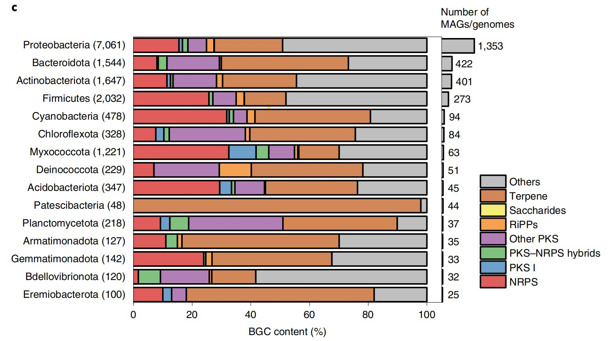

```{r setup, include=FALSE}
knitr::opts_chunk$set(
  collapse = T, echo=T, comment="#>", message=F, warning=F,
	fig.align="center", fig.width=5, fig.height=3, dpi=150)
```


If you use this script, please cited 如果你使用本代码，请引用：

**Yong-Xin Liu**, Lei Chen, Tengfei Ma, Xiaofang Li, Maosheng Zheng, Xin Zhou, Liang Chen, Xubo Qian, Jiao Xi, Hongye Lu, Huiluo Cao, Xiaoya Ma, Bian Bian, Pengfan Zhang, Jiqiu Wu, Ren-You Gan, Baolei Jia, Linyang Sun, Zhicheng Ju, Yunyun Gao, **Tao Wen**, **Tong Chen**. 2023. EasyAmplicon: An easy-to-use, open-source, reproducible, and community-based pipeline for amplicon data analysis in microbiome research. **iMeta** 2(1): e83. https://doi.org/10.1002/imt2.83

The online version of this tuturial can be found in https://github.com/YongxinLiu/MicrobiomeStatPlot


**Authors**
First draft(初稿)：Defeng Bai(白德凤)；Proofreading(校对)：Ma Chuang(马闯) and Xun Jiani(荀佳妮)；Text tutorial(文字教程)：Defeng Bai(白德凤)


# Introduction简介

堆叠柱状图能够展示分类的组成情况，再结合直方图展示每一个分类级别的一些性质，此类组合图能够更全面展示分类组成信息。

The stacked bar chart can show the composition of the classification, and combined with the histogram to show some properties of each classification level, this type of combination chart can more comprehensively display the classification composition information.


# 堆叠柱状图结合直方图案例
Stacked Bar Plot With Histogram Example

这是中科院微生物所骆迎峰团队和兰州大学刘勇勤团队合作发表在Nature Biotechnology上的一篇论文，论文题目为A genome and gene catalog of glacier microbiomes. https://doi.org/10.1038/s41587-022-01367-2

This is a paper published in Nature Biotechnology by Luo Yingfeng's team from the Institute of Microbiology, Chinese Academy of Sciences, and Liu Yongqin's team from Lanzhou University. The title of the paper is A genome and gene catalog of glacier microbiomes. https://doi.org/10.1038/s41587-022-01367-2



Fig. 3 c, The relative frequency of BGC types across dominant phyla BGC genes are predominantly identified in Proteobacteria, Firmicutes, Bacteroidota and 
Actinobacteriota, and they are highly variable across phyla. 

图 3c，优势门中 BGC 类型的相对频率 BGC 基因主要在变形菌门、厚壁菌门、拟杆菌门和放线菌门中发现，并且它们在门之间变化很大。


**结果**

The predicted secondary metabolites were categorized into eight groups (Fig. 3b). Of these, BGCs synthesizing terpene were the most diverse, with 4,105 unique sequences identified, accounting for 25.7% of the total BGC diversity identified. They are also the most abundant BGCs in most bacterial phyla (Fig. 3c,Fig. 3 and Supplementary Table 5). This may be due to the widespread incidence of terpenoid pigments, such as carotenoids in bacteria, which play roles in harvesting light energy to neutralize oxidants and acting as virulence factors. Furthermore, a total of 2,731 (17.1%) non-ribosomal peptide synthetase (NRPS) gene clusters were identified from 18 phyla, 268 (1.7%) polyketide synthase (PKS) I clusters from 11 phyla, 319 (2.0%) PKS–NRPS hybrid clusters from 12 phyla and 348 (2.2%) ribosomally synthesized and post-translationally modified peptide (RiPP) clusters from 14 phyla.

预测的次级代谢产物分为 8 类（图 3b）。其中，合成萜烯的 BGC 多样性最丰富，已鉴定出 4,105 个独特序列，占已鉴定 BGC 总多样性的25.7%。它们也是大多数细菌门中最丰富的 BGC（图 3c、图 3 和补充表5）。 这可能是由于萜类色素（如细菌中的类胡萝卜素）广泛存在，它们在收集光能以中和氧化剂并充当毒力因子方面发挥作用。此外，共从 18 个门中鉴定出 2,731个（17.1%）非核糖体肽合成酶（NRPS）基因簇，从 11 个门中鉴定出 268 个（1.7%）聚酮合酶（PKS）I 簇，从 12 个门中鉴定出 319 个（2.0%）PKS-NRPS 混合簇，从 14 个门中鉴定出 348 个（2.2%）核糖体合成和翻译后修饰肽（RiPP）簇。


## Packages installation软件包安装

```{r}
# 基于CRAN安装R包，检测没有则安装
p_list = c("magrittr", "reshape2", "ggplot2", "formattable", "cowplot")
for(p in p_list){if (!requireNamespace(p)){install.packages(p)}
    library(p, character.only = TRUE, quietly = TRUE, warn.conflicts = FALSE)}

# 加载R包 Load the package
suppressWarnings(suppressMessages(library(magrittr)))
suppressWarnings(suppressMessages(library(reshape2)))
suppressWarnings(suppressMessages(library(ggplot2)))
suppressWarnings(suppressMessages(library(formattable)))
suppressWarnings(suppressMessages(library(cowplot)))

```


## 堆叠柱状图结合直方图 Stacked Bar Plot With Histogram

```{r}
# Load stack bar plot data
otu2 <- read.table("data/data_stack.txt", header = TRUE, sep = "\t")
rownames(otu2) <- otu2$Group
otu2 <- otu2[, -1]

otu2 <- apply(otu2, 2, function(x) x/sum(x))
otu2 <- as.data.frame(otu2)

# 计算每个分类的均值并按均值排序
# Calculate the mean for each classification and sort by mean
otu2$mean <- apply(otu2, 1, mean)
otu2 <- otu2[order(otu2$mean), ]
otu2$phylum <- factor(rownames(otu2), levels = rownames(otu2))
otu2 <- otu2[, -c(ncol(otu2)-1)]

# 检查OTU数据中的分类数量
# Check the number of classifications in the OTU data
num_phyla <- length(unique(otu2$phylum))

data2 <- otu2 %>%
  melt(id.vars = 'phylum')

data2$phylum <- factor(data2$phylum, levels = c("Others","BGC type8","BGC type7",
                                  "BGC type6","BGC type5","BGC type4",
                                  "BGC type3", "BGC type2", "BGC type1"))

p1 <- data2 %>% 
  ggplot(aes(variable, value, fill = phylum)) +
  geom_bar(stat = 'identity', position = 'fill', color = 'black', size = 0.3) +  
  scale_fill_manual(values = c("grey","#ec8181","#d2da93","#35978b","#00ceff","#ff630d","#35978b",
                  "#e5acd7","#dfc6a5","#77aecd","#77aecd","#ec8181","#dfc6a5","#e50719",
                  "#d27e43","#8a4984","#fe5094","#8d342e","#f94e54",
                  "#ffad00","#36999d","#00fc8d","#b64aa0","#9b82e1"))+
  scale_color_manual(values = c("grey","#ec8181","#d2da93","#d2da93","#5196d5","#00ceff","#ff630d","#35978b",
                  "#e5acd7","#dfc6a5","#77aecd","#77aecd","#ec8181","#dfc6a5","#e50719",
                  "#d27e43","#8a4984","#fe5094","#8d342e","#f94e54",
                  "#ffad00","#36999d","#00fc8d","#b64aa0","#9b82e1"))+
  scale_y_continuous(expand = c(0, 0), labels = percent) +  
  coord_flip() +  
  theme_minimal() + 
  #theme_classic()
  theme(axis.ticks.y = element_blank(),
        axis.title.y = element_blank(),
        axis.line = element_blank(),
        legend.position = "left"
        ) +  
  labs(y = 'Percentage')


# Histogram data
imp_species = read.table("data/data_histogram.txt", header=T, sep="\t")
right_1 <- ggplot(imp_species,aes(x = Phylum,y = Genomes), fill ="#dfc6a5") +
      geom_bar(stat = "identity", color = "black", fill="#dfc6a5") +
      coord_flip() +
  #theme_bw()+
  theme_classic()+
  theme(text = element_text(family = 'sans', size = 14),
        panel.grid.major = element_blank(),
        panel.grid.minor = element_blank(),
        axis.text.x = element_blank(),
        axis.text.y = element_blank(),
        axis.line.y = element_blank(),
        axis.ticks.y = element_blank(),
        axis.title.y = element_blank(),
         axis.ticks.x = element_blank(),
        axis.title.x = element_blank(),
        axis.line.x = element_blank(),
        legend.position = "none"
        )+
  scale_fill_manual(values = c("#d2da93","#5196d5","#00ceff","#ff630d","#9b82e1",
                  "#e5acd7","#36999d","#ec8181","#dfc6a5","#e50719",
                  "#d27e43","#8a4984","#fe5094","#8d342e","#f94e54",
                  "#ffad00","#36999d","#00fc8d","#b64aa0","#9b82e1"))+
      scale_x_discrete(labels= imp_species$Phylum, position="top")+
      scale_y_continuous(expand=expansion(add=c(0,0)),
                         limits=c(0,800),breaks=c(0,200,400,600, 800)
                         )+
  geom_text(aes(label = Genomes, hjust = -0.2, colour = "black", size=2), colour="black")
#right_1

p3 <- ggdraw() +
  draw_plot(p1, 0, -0.0190, .72, 0.99)+
  draw_plot(right_1, 0.750, 0.040, .17, 0.930)
#p3

pdf("results/BGCs_Phylum01.pdf", height = 5.5, width = 8.5)
p3
dev.off()

```


If used this script, please cited:
使用此脚本，请引用下文：

**Yong-Xin Liu**, Lei Chen, Tengfei Ma, Xiaofang Li, Maosheng Zheng, Xin Zhou, Liang Chen, Xubo Qian, Jiao Xi, Hongye Lu, Huiluo Cao, Xiaoya Ma, Bian Bian, Pengfan Zhang, Jiqiu Wu, Ren-You Gan, Baolei Jia, Linyang Sun, Zhicheng Ju, Yunyun Gao, **Tao Wen**, **Tong Chen**. 2023. EasyAmplicon: An easy-to-use, open-source, reproducible, and community-based pipeline for amplicon data analysis in microbiome research. **iMeta** 2: e83. https://doi.org/10.1002/imt2.83

Copyright 2016-2024 Defeng Bai <baidefeng@caas.cn>, Chuang Ma <22720765@stu.ahau.edu.cn>, Jiani Xun <xunjiani@caas.cn>, Yong-Xin Liu <liuyongxin@caas.cn>

