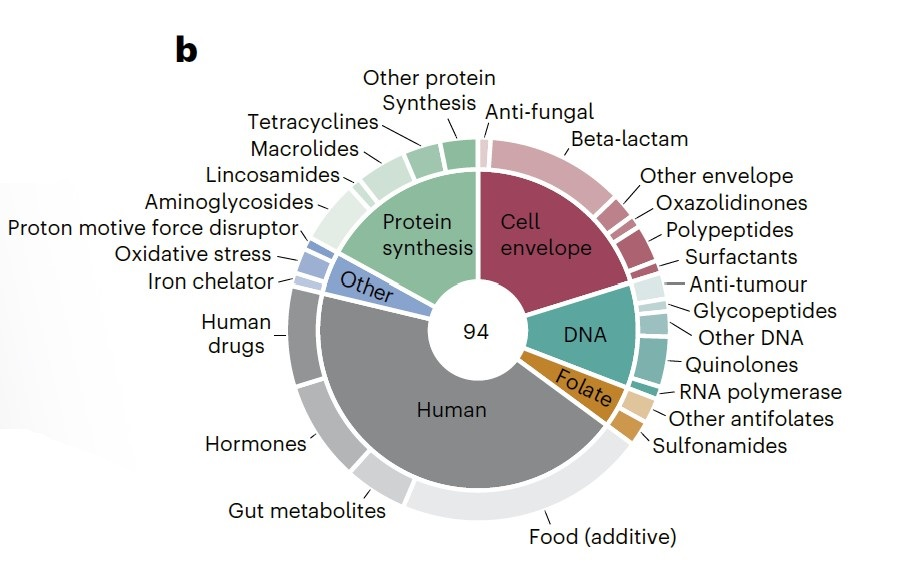
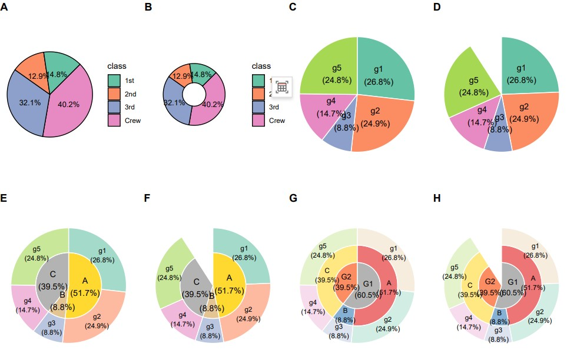

```{r setup, include=FALSE}
knitr::opts_chunk$set(
  collapse = T, echo=T, comment="#>", message=F, warning=F,
	fig.align="center", fig.width=5, fig.height=3, dpi=150)
```


The SunBurst plot scripts is referenced from MicrobiomeStatPlot [Inerst Reference below].


If you use this script, please cited 如果你使用本代码，请引用：

**Yong-Xin Liu**, Lei Chen, Tengfei Ma, Xiaofang Li, Maosheng Zheng, Xin Zhou, Liang Chen, Xubo Qian, Jiao Xi, Hongye Lu, Huiluo Cao, Xiaoya Ma, Bian Bian, Pengfan Zhang, Jiqiu Wu, Ren-You Gan, Baolei Jia, Linyang Sun, Zhicheng Ju, Yunyun Gao, **Tao Wen**, **Tong Chen**. 2023. EasyAmplicon: An easy-to-use, open-source, reproducible, and community-based pipeline for amplicon data analysis in microbiome research. **iMeta** 2(1): e83. https://doi.org/10.1002/imt2.83

The online version of this tuturial can be found in https://github.com/YongxinLiu/MicrobiomeStatPlot/tree/master/3.Visualization_and_interpretation


**Authors**
First draft(初稿)：Defeng Bai(白德凤)；Proofreading(校对)：Ma Chuang(马闯) and Xun Jiani(荀佳妮)；Text tutorial(文字教程)：Defeng Bai(白德凤)


# Introduction简介

什么是旭日图？
What is the sunburst plot?

旭日图（Sunburst Chart），其实是一种特殊的饼图或环状图，常用于展示数据的多层数据结构关系。

The Sunburst Chart is actually a special type of pie chart or circular chart commonly used to display the multi-level data structure relationships of data.


关键字：微生物组数据分析、MicrobiomeStatPlot、旭日图、R语言可视化

Keywords: Microbiome analysis, MicrobiomeStatPlot, sunburst plot, R visulization


## Case study of the Sunburst Chart 旭日图案例

本文是Ana Rita Brochado团队2024年发表在Nature Microbiology（Brenzinger et al., 2024）上的一篇论文用到的旭日图。题目：The Vibrio cholerae CBASS phage defence system modulates resistance and killing by antifolate antibiotics. https://doi.org/10.1038/s41564-023-01556-y 

This article is a sunrise chart used by Ana Rita Brocado's team in a paper published in Nature Microbiology (Brenzinger et al., 2024) in 2024. Title: The Vibrio cholerae CBASS phase defense system modulates resistance and killing by antagonistic antibiotics. https://doi.org/10.1038/s41564-023-01556-y




Figure 1 b, Composition of the compound library tested in this study. Compounds are classified by target (in the case of antimicrobials, inner ring) and compound class (outer ring).

图1B，本研究中测试的化合物库的组成。化合物按目标（在抗菌药物的情况下，内环）和化合物类别（外环）进行分类。

**结果**：

We sought to systematically investigate the impact of CBASS on antimicrobial activity by assessing bacterial growth of wild-type (WT) V. cholerae and CBASS operon-deleted (ΔCBASS) strains in the presence of 94 small molecules, including antibiotics, human drugs, human endogenous metabolites, and food additives (Fig. 1b and Supplementary Table 1).

我们试图通过评估野生型（WT）霍乱弧菌和CBASS操纵子缺失（ΔCBASS）菌株在94种小分子（包括抗生素、人类药物、人类内源性代谢产物和食品添加剂）存在下的细菌生长，系统地研究CBASS对抗微生物活性的影响（图1b和补充表1）。


## Packages installation软件包安装

```{r}
# 基于CRAN安装R包，检测没有则安装
p_list = c("dplyr", "ggplot2", "formattable")
for(p in p_list){if (!requireNamespace(p)){install.packages(p)}
    library(p, character.only = TRUE, quietly = TRUE, warn.conflicts = FALSE)}

# 加载R包 Load the package
suppressWarnings(suppressMessages(library(dplyr)))
suppressWarnings(suppressMessages(library(ggplot2)))
```


# SunBurst plot旭日图

## Sunburst plotusing R software 旭日图R语言实战

绘制饼图
Draw a pie chart

参考：https://mp.weixin.qq.com/s/xUQM-1h-OeeWGjJlRw3d_g

```{r SunBurst plot, fig.show='asis', fig.width=4, fig.height=2.5}
# 构建数据
# Load data
count_data <- data.frame(
  class = c("1st", "2nd", "3rd", "Crew"),
  n = c(325, 285, 706, 885),
  prop = c(14.8, 12.9, 32.1, 40.2)
)

# 计算标签位置
# Label positions
count_data <- count_data %>%
  arrange(desc(class)) %>%
  mutate(lab_ypos = cumsum(prop) - 0.5 * prop)

# 使用ColorBrewer中的调色板
# Set color
mycols <- c("#66C2A5", "#FC8D62", "#8DA0CB", "#E78AC3")

# 绘制的饼图
# Pie plot
p_pie1 <- ggplot(count_data, aes(x = "", y = prop, fill = class)) +
  geom_bar(width = 1, stat = "identity", color = "black", size = 0.5) +
  coord_polar("y", start = pi/4) +
  geom_text(aes(y = lab_ypos, label = paste0(prop, "%")), color = "black", size = 3.5) +
  scale_fill_manual(values = mycols) +
  theme_void() +
  theme(legend.position = "right")

# 绘制空心饼图（甜甜圈图）
# Draw a hollow pie chart (donut chart)
p_pie2 <- ggplot(count_data, aes(x = 2, y = prop, fill = class)) +
  geom_bar(stat = "identity", color = "black", size = 0.5) +
  coord_polar(theta = "y", start = pi/4) +
  geom_text(aes(y = lab_ypos, label = paste0(prop, "%")), color = "black", size = 3.5) +
  scale_fill_manual(values = mycols) +
  theme_void() +
  xlim(1, 3) +
  theme(legend.position = "right")
ggsave('results/donut_chart.pdf', p_pie2)
```


Drawing using ggplot2 package使用ggplot2包作图

参考：https://mp.weixin.qq.com/s/19clA4xZqoAl7KuY96ZJjQ?search_click_id=9261072915409092102-1714444702544-1010392356

```{r SunBurst plot2, fig.show='asis', fig.width=4, fig.height=2.5}
# 加载数据
# Load data
df <- read.table("data/data.txt", header = TRUE, check.names = FALSE, sep = "\t")

# 定义百分比转换函数
# Define percentage conversion function
convert_to_percent <- function(x) {
  return(paste0(round(x * 100, 1), "%"))
}

# 分别计算group1、group2、group3的数据
# Calculate the data of group1, group2, and group3 respectively
get_data <- function(group_col, data) {
  data_group <- aggregate(value ~ get(group_col), data, sum)
  data_group$Rel <- data_group$value / sum(data_group$value)
  data_group$per <- convert_to_percent(data_group$Rel)
  colnames(data_group)[1] <- group_col
  data_group <- data_group %>%
    mutate(
      ymax = cumsum(Rel),
      ymin = c(0, head(ymax, -1)),
      labelposition = (ymax + ymin) / 2
    )
  return(data_group)
}

data1 <- get_data("group1", df)
data2 <- get_data("group2", df)
data3 <- get_data("group3", df)

# 设定颜色
# Set color
mycolors1 <- c("#66c2a5", "#fc8d62", "#8da0cb", "#e78ac3", "#a6d854")
mycolors2 <- c("#ffd92f", "#e5c494", "#b3b3b3")
mycolors3 <- c("#e41a1c", "#377eb8")

# 绘制第一个圆环图
# Plot First circle
p1 <- ggplot(data1, aes(ymax = ymax, ymin = ymin, xmax = 3, xmin = 2)) +
  geom_rect(aes(fill = group1), color = "white") +
  geom_text(aes(x = 2.5, y = labelposition, label = paste0(group1, "\n(", per, ")")),
            size = 4, color = "black") +
  coord_polar(theta = "y") +
  theme_void() +
  scale_fill_manual(values = mycolors1) +
  theme(legend.position = "none")
#p1

# 增加中间空白区域
# Add the blank space
p2 <- p1 + ylim(0, 1.1)
#p2

# 绘制双环图（内环 + 外环）
# Draw a double ring plot (inner ring + outer ring)
p3 <- ggplot() +
  geom_rect(data = data2, aes(ymax = ymax, ymin = ymin, xmax = 2, xmin = 0, fill = group2), color = "white") +
  geom_rect(data = data1, aes(ymax = ymax, ymin = ymin, xmax = 3.5, xmin = 2, fill = group1), color = "white", alpha = 0.6) +
  geom_text(data = data2, aes(x = 1, y = labelposition, label = paste0(group2, "\n(", per, ")")),
            size = 4, color = "black") +
  geom_text(data = data1, aes(x = 2.75, y = labelposition, label = paste0(group1, "\n(", per, ")")),
            size = 3, color = "black") +
  coord_polar(theta = "y") +
  theme_void() +
  scale_fill_manual(values = c(mycolors2, mycolors1)) +
  theme(legend.position = "none") +
  xlim(0, 3.5)
#p3

# 增加空白区域
# Add the blank space
p4 <- p3 + ylim(0, 1.1)
#p4

# 绘制三环旭日图
# Draw a three-ring sunburst plot
p5 <- ggplot() +
  geom_rect(data = data3, aes(ymax = ymax, ymin = ymin, xmax = 2, xmin = 0, fill = group3), color = "white") +
  geom_rect(data = data2, aes(ymax = ymax, ymin = ymin, xmax = 3.5, xmin = 2, fill = group2), color = "white", alpha = 0.6) +
  geom_rect(data = data1, aes(ymax = ymax, ymin = ymin, xmax = 5, xmin = 3.5, fill = group1), color = "white", alpha = 0.3) +
  geom_text(data = data3, aes(x = 1, y = labelposition, label = paste0(group3, "\n(", per, ")")),
            size = 3.5, color = "black") +
  geom_text(data = data2, aes(x = 2.75, y = labelposition, label = paste0(group2, "\n(", per, ")")),
            size = 3, color = "black") +
  geom_text(data = data1, aes(x = 4.25, y = labelposition, label = paste0(group1, "\n(", per, ")")),
            size = 3, color = "black") +
  coord_polar(theta = "y") +
  theme_void() +
  scale_fill_manual(values = c(mycolors3, mycolors2, mycolors1)) +
  theme(legend.position = "none") +
  xlim(0, 5)
#p5

# 增加空白区域
# Add the blank space
p6 <- p5 + ylim(0, 1.1)
#p6
ggsave('results/Three_ring_sunburst_plot.pdf', p6)
```


# Combo plots排版

Combo plots to published-ready figure

组合多个子图为发表格式

```{r SunBurst plot3, fig.show='asis', fig.width=4, fig.height=2.5}
library(cowplot)
width = 89
height = 59
p0 = plot_grid(p_pie1 ,p_pie2, p1, p2, p3, p4, p5, p6, 
               labels = c("A", "B", "C", "D", "E", "F", "G", "H"), ncol = 4)
ggsave("results/SunBurst_plot01.pdf", p0, width = width * 3, height = height * 3, units = "mm")
```





If used this script, please cited:
使用此脚本，请引用下文：

**Yong-Xin Liu**, Lei Chen, Tengfei Ma, Xiaofang Li, Maosheng Zheng, Xin Zhou, Liang Chen, Xubo Qian, Jiao Xi, Hongye Lu, Huiluo Cao, Xiaoya Ma, Bian Bian, Pengfan Zhang, Jiqiu Wu, Ren-You Gan, Baolei Jia, Linyang Sun, Zhicheng Ju, Yunyun Gao, **Tao Wen**, **Tong Chen**. 2023. EasyAmplicon: An easy-to-use, open-source, reproducible, and community-based pipeline for amplicon data analysis in microbiome research. **iMeta** 2: e83. https://doi.org/10.1002/imt2.83

Copyright 2016-2024 Defeng Bai <baidefeng@caas.cn>, Chuang Ma <22720765@stu.ahau.edu.cn>, Jiani Xun <15231572937@163.com>, Yong-Xin Liu <liuyongxin@caas.cn>
