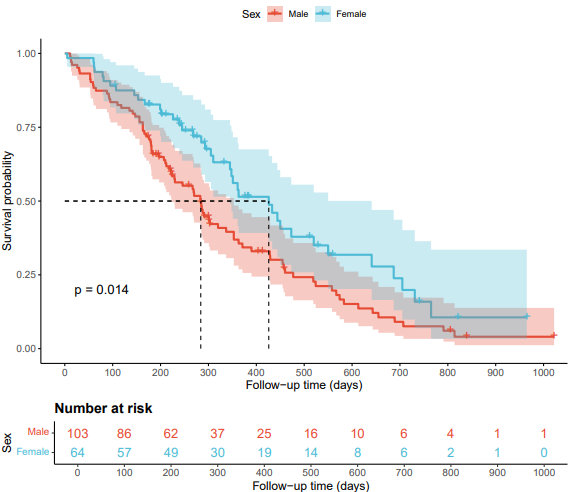

```{r setup, include=FALSE}
knitr::opts_chunk$set(
  collapse = T, echo=T, comment="#>", message=F, warning=F,
	fig.align="center", fig.width=5, fig.height=3, dpi=150)
```


The Survival analysis scripts is referenced from MicrobiomeStatPlot [Inerst Reference below].


If you use this script, please cited 如果你使用本代码，请引用：

**Yong-Xin Liu**, Lei Chen, Tengfei Ma, Xiaofang Li, Maosheng Zheng, Xin Zhou, Liang Chen, Xubo Qian, Jiao Xi, Hongye Lu, Huiluo Cao, Xiaoya Ma, Bian Bian, Pengfan Zhang, Jiqiu Wu, Ren-You Gan, Baolei Jia, Linyang Sun, Zhicheng Ju, Yunyun Gao, **Tao Wen**, **Tong Chen**. 2023. EasyAmplicon: An easy-to-use, open-source, reproducible, and community-based pipeline for amplicon data analysis in microbiome research. **iMeta** 2(1): e83. https://doi.org/10.1002/imt2.83

The online version of this tuturial can be found in https://github.com/YongxinLiu/MicrobiomeStatPlot


**Authors**
First draft(初稿)：Defeng Bai(白德凤)；Proofreading(校对)：Ma Chuang(马闯) and Xun Jiani(荀佳妮)；Text tutorial(文字教程)：Defeng Bai(白德凤)


# Introduction简介

什么是生存分析？
What is survival analysis?
参考：https://mp.weixin.qq.com/s/9ZtE2erTvjvMX6s6Ppx2nw

生存分析（survival analysis）主要用来处理考虑发生时间的二分类结局变量，不仅考虑事件是否出现，而且考虑事件出现的事件长短，因此这类方法也称为事件事件分析（time-to-event analysis）。生存分析的资料常常分为终点事件（如死亡）和删失（其他生存结局）两类，其特点包括：1.同时考虑两个变量，生存时间和生存结局；2.通常含有删失数据；3.生存时间的分布通常不服从正态分布。
Survival analysis is mainly used to handle binary outcome variables that consider the time of occurrence. It not only considers whether the event occurred, but also the length of the event that occurred. Therefore, this type of method is also known as time to event analysis. The data for survival analysis is often divided into two categories: endpoint events (such as death) and deletion (other survival outcomes), which have the characteristics of: 1. simultaneously considering two variables, survival time and survival outcome; 2. Usually containing deleted data; The distribution of survival time usually does not conform to a normal distribution.

什么是删失数据？
What is missing data deletion?
再研究结束的时候，研究对象发生了研究之外的其他事件或生存结局，无法明确从开始观察到发生终点事件的生存事件，我们把这种类型的数据称之为删失数据。
At the end of the study, if the research subject experiences other events or survival outcomes outside of the study, it is unclear which survival events occurred from the beginning to the endpoint. We refer to this type of data as censored data.

生存期的几个概念
Several Concepts of Survival
总体生存期（overall survival, OS）
任何原因导致的死亡，只关心是否死亡，不关心因为何种原因死亡。
Death caused by any reason, only concerned about whether or not to die, not about the reason for death.

疾病特异性生存期（disease specific survival, DSS）
结局指标为由特定疾病导致的死亡，反映特定疾病的临床获益。但患者的死因经常并不容易明确。
The outcome measure is death caused by a specific disease, reflecting the clinical benefits of the specific disease. But the cause of death for patients is often not easy to determine.

无进展生存期（progression free survival, PFS）
疾病经过治疗后没有出现进一步恶化的生存期，结局指标是发生恶化或死亡，要求对发生恶化的标准进行明确的定义。
After treatment, there is no further deterioration in the survival period of the disease, and the outcome indicator is the occurrence of deterioration or death, requiring a clear definition of the criteria for occurrence of deterioration.

无病生存期（disease free survival, DFS）
从随机化开始至疾病复发或由于疾病进展导致患者死亡的事件，不关心因为何种原因死亡。要求对发生复发的标准进行明确的定义。
Events that occur from randomization to disease recurrence or death due to disease progression, regardless of the cause of death. Clear definition of criteria for recurrence is required.

生存分析的主要方法：
The main methods of survival analysis
1.非参数法：Log rank检验等
1. Non parametric method: Log rank test, etc
一般肿瘤治疗药物临床试验会采样Log rank检验法。Log-rank检验对晚期死亡事件权重较大，对数据分布的要求较低，主要用于比较两组生存曲线是否存在差异，回答“是否有效”的问题，但无法衡量效果大小，P值作为验证主要结局是否阳性的证据。
Generally, clinical trials of tumor treatment drugs use the Log rank test method for sampling. The Log rank test has a higher weight for late death events and lower requirements for data distribution. It is mainly used to compare whether there is a difference in survival curves between two groups and answer the question of "whether it is effective", but cannot measure the size of the effect. The P-value serves as evidence to verify whether the main outcome is positive.

2.半参数法：Cox回归分析
2. Semi parametric method: Cox regression analysis
考虑随访事件，用Cox回归获得HR，更直观的测量治疗效果。
Consider follow-up events and use Cox regression to obtain HR for a more intuitive measurement of treatment effectiveness.

3.Kaplan-Meier法
3. Kaplan-Meier method
Kaplan-Meier法估计的生存率是一个累积的生存率，或者说是一个条件的生存率，前面的条件再乘以当前的生存率，通常用生存曲线描述生存过程。
The survival rate estimated by Kaplan Meier method is a cumulative survival rate, or rather a conditional survival rate. The previous conditions are multiplied by the current survival rate, and the survival process is usually described using a survival curve.

不同的生存分析内容，选择不同分分析策略
Different survival analysis contents, selecting different sub analysis strategies
-计算生存率，中位生存事件，用生存曲线描述生存过程：Kaplan-Meier方法
-Calculate survival rate, median survival event, and describe survival process using survival curve: Kaplan Meier method
-生存时间分布的时间比较：log Rank
-Time comparison of survival time distribution: log Rank
-探讨生存时间（生存速度）的影响因素：Cox回归分析
-Exploring the influencing factors of survival time (survival rate): Cox regression analysis


关键字：微生物组数据分析、MicrobiomeStatPlot、生存分析、R语言可视化

Keywords: Microbiome analysis, MicrobiomeStatPlot, Survival analysis, R visulization


## Survival analysis case 生存分析案例

这是Jakob Stokholm课题组2023年发表于Nature Medicine上的文章，第一作者为Cristina Leal Rodríguez，题目为：The infant gut virome is associated with preschool asthma risk independently of bacteria. https://doi.org/10.1038/s41591-023-02685-x

This is an article published by the Jakob Stokholm research group in Nature Medicine in 2023. The first author is Cristina Leal Rodr í guez, and the title is: The incident gut virus is associated with pre-school astroma risk independently of bacteria. https://doi.org/10.1038/s41591-023-02685-x


Fig. 5 d, Kaplan–Meier curves displaying the cumulative incidence of asthma to 5 years of age. Children’s asthma signature scores were divided into high (above median) and low (below median) for both the bacteriome and virome, resulting in four combined groups (low–low, low–high, high–low and high–high). The P value for the difference in groups was determined by the two-sided log-rank test. 

图5 d、 Kaplan-Meier曲线显示5岁哮喘的累计发病率。儿童哮喘特征评分分为细菌组和病毒组的高（高于中位数）和低（低于中位数），分为四组（低-低、低-高、高-低和高-高）。组间差异的P值通过双侧对数秩检验确定。

**结果**：
Finally, we estimated the cumulative incidence of asthma in four different groups of children based on their combined virome and bacteriome signature scores (low–low, low–high, high–low and high–high) and found a difference in the time to asthma diagnosis (two-sided log-rank test, P = 0.004, Fig. 5d). These four groups were also different in a Cox survival model (overall P = 0.005, low–low as reference; low–high hazard ratio (HR) = 1.53 (0.86–2.70); P = 0.147; high–low HR = 1.46 (0.82–2.61); P = 0.188; high–high HR = 2.39 (1.46–3.93); P = 5.94 × 10−4). Furthermore, to assess the cumulative and combined effect of virome and bacteriome, we computed a combined score (low–low = 1; low–high or high-low = 2; high–high = 3), which showed complementarity between the virome and bacteriome, indicating a 53% increase per group in the likelihood that the children receive an asthma diagnosis (HR = 1.53 (1.21–1.95); P = 4.08 × 10−4). 

最后，我们根据四组不同儿童的病毒组和细菌组特征评分（低-低、低-高、高-低和高-高）估计了他们的哮喘累积发病率，并发现哮喘诊断时间存在差异（双侧对数秩检验，P=0.004，图5d）。这四组在Cox生存模型中也有所不同（总体P=0.005，低-低作为参考；低-高风险比（HR）=1.53（0.86–2.70）；P=0.147；高-低HR=1.46（0.82–2.61）；P＝0.188；高-高HR=2.39（1.46–3.93）；P＝5.94×10−4）。此外，为了评估病毒组和细菌组的累积和综合效应，我们计算了一个综合评分（低-低=1；低-高或高-低=2；高-高=3），该评分显示了病毒组和菌组之间的互补性，表明每组儿童接受哮喘诊断的可能性增加了53%（HR=1.53（1.21-1.95）；P＝4.08×10−4）。


## Packages installation软件包安装

```{r}
# 基于CRAN安装R包，检测没有则安装
p_list = c("survival","dplyr","autoReg","rrtable","survminer","jstable","patchwork")
for(p in p_list){if (!requireNamespace(p)){install.packages(p)}
    library(p, character.only = TRUE, quietly = TRUE, warn.conflicts = FALSE)}

# 加载R包 Load the package
suppressWarnings(suppressMessages(library(survival)))
suppressWarnings(suppressMessages(library(dplyr)))
suppressWarnings(suppressMessages(library(autoReg)))
suppressWarnings(suppressMessages(library(rrtable)))
suppressWarnings(suppressMessages(library(survminer)))
suppressWarnings(suppressMessages(library(jstable)))
suppressWarnings(suppressMessages(library(patchwork)))
```


# Survival analysis 生存分析

## Survival analysis using R software 生存分析R语言实战

参考：https://mp.weixin.qq.com/s/6_vOZVLc3_KZPjNfKsygeQ

```{r survival analysis,fig.show='asis', fig.width=4, fig.height=2.5}
# 加载数据
# Load data
mydata <- survival::lung %>% na.omit()
mydata <- mydata %>% mutate(sex = factor(sex), ph.ecog = factor(ph.ecog))

# 描述统计
# Basic Statistics
table1 <- gaze(status ~ ., data = mydata) %>% myft()
table2 <- gaze(status ~ ., data = mydata, method = 3) %>% myft()

# 拟合生存曲线
# Fit survival model
fit <- survfit(Surv(time, status) ~ sex, data = mydata)

# 生存曲线图
# Survival curve
pdf("results/survival_plot.pdf",width = 8,height = 7)
ggsurvplot(
  fit, 
  data = mydata, 
  conf.int = TRUE, 
  pval = TRUE, 
  pval.size = 4.5,
  surv.median.line = "hv", 
  risk.table = TRUE, 
  risk.table.height = 0.2,
  risk.table.col = "strata",
  xlab = "Follow-up time (days)", 
  legend.title = "Sex", 
  legend.labs = c("Male", "Female"), 
  palette = c("#E64B35FF", "#4DBBD5FF"), 
  break.x.by = 100,
  ggtheme = theme_classic() + 
    theme(
      plot.title = element_text(size = 14, face = "bold"),
      axis.title = element_text(size = 12),
      axis.text = element_text(size = 10)
    )
)
dev.off()


# Cox 回归模型
# Cox regression
cox_fit <- coxph(Surv(time, status) ~ age + sex + ph.ecog + ph.karno + pat.karno + meal.cal + wt.loss, 
                 data = mydata)
cox_result <- autoReg(cox_fit, uni = TRUE) %>% myft()

# Cox模型结果的森林图
# Forest plot from Cox model results
forest_plot <- ggforest(
  cox_fit, 
  data = mydata, 
  main = "Hazard Ratios (95% CI)", 
  fontsize = 0.9, 
  cpositions = c(0.02, -0.1, 0.3),
  refLabel = "Reference",
  noDigits = 2
)
#forest_plot
# 保存图
# Save plot
ggsave("results/cox_forest_plot.pdf", plot = forest_plot, device = "pdf", width = 8, height = 6)

# 变量截断与分组
# Variable truncation and grouping
mydata$status <- mydata$status - 1
mydata$sex <- ifelse(mydata$sex == 1, "Male", "Female")
cutpoints <- surv_cutpoint(mydata, time = "time", event = "status",
                           variables = c("age", "meal.cal", "ph.karno", "pat.karno"))
mydata_cut <- surv_categorize(cutpoints)
# 使用cbind将mydata_cut与mydata的其他列合并
# Use cbind to merge mydata_cut with other columns of mydata
mydata <- cbind(mydata[, c("sex", "ph.ecog", "wt.loss")], mydata_cut)

# 检查数据结构
# Check data structure
str(mydata)

# 亚组分析
# Subgroup analysis
subgroup_res <- TableSubgroupMultiCox(
  formula = Surv(time, status) ~ sex, 
  var_subgroups = c("age", "meal.cal", "ph.karno", "pat.karno"), 
  data = mydata
)
write.csv(subgroup_res, "results/subgroup_analysis_results.csv")
```





If used this script, please cited:
使用此脚本，请引用下文：

**Yong-Xin Liu**, Lei Chen, Tengfei Ma, Xiaofang Li, Maosheng Zheng, Xin Zhou, Liang Chen, Xubo Qian, Jiao Xi, Hongye Lu, Huiluo Cao, Xiaoya Ma, Bian Bian, Pengfan Zhang, Jiqiu Wu, Ren-You Gan, Baolei Jia, Linyang Sun, Zhicheng Ju, Yunyun Gao, **Tao Wen**, **Tong Chen**. 2023. EasyAmplicon: An easy-to-use, open-source, reproducible, and community-based pipeline for amplicon data analysis in microbiome research. **iMeta** 2: e83. https://doi.org/10.1002/imt2.83

Copyright 2016-2024 Defeng Bai <baidefeng@caas.cn>, Chuang Ma <22720765@stu.ahau.edu.cn>, Jiani Xun <15231572937@163.com>, Yong-Xin Liu <liuyongxin@caas.cn>
