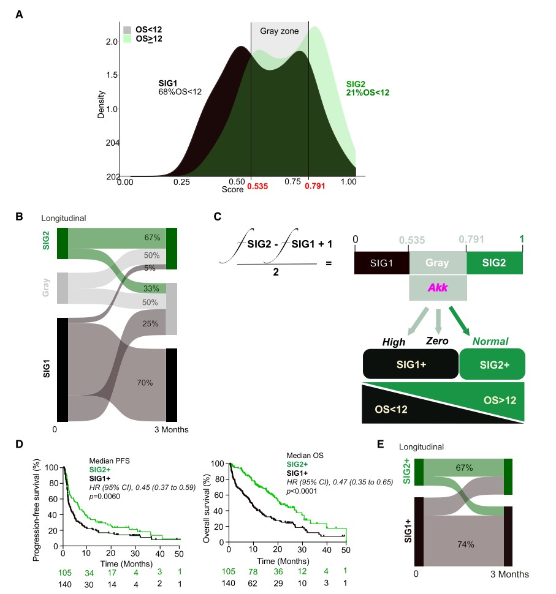

```{r setup, include=FALSE}
knitr::opts_chunk$set(
  collapse = T, echo=T, comment="#>", message=F, warning=F,
	fig.align="center", fig.width=5, fig.height=3, dpi=150)
```


The TOPOSCORE scripts is referenced from MicrobiomeStatPlot [Inerst Reference below].

If you use this script, please cited 如果你使用本代码，请引用：

**Yong-Xin Liu**, Lei Chen, Tengfei Ma, Xiaofang Li, Maosheng Zheng, Xin Zhou, Liang Chen, Xubo Qian, Jiao Xi, Hongye Lu, Huiluo Cao, Xiaoya Ma, Bian Bian, Pengfan Zhang, Jiqiu Wu, Ren-You Gan, Baolei Jia, Linyang Sun, Zhicheng Ju, Yunyun Gao, **Tao Wen**, **Tong Chen**. 2023. EasyAmplicon: An easy-to-use, open-source, reproducible, and community-based pipeline for amplicon data analysis in microbiome research. **iMeta** 2(1): e83. https://doi.org/10.1002/imt2.83

Derosa, L., et al. (2024). "Custom scoring based on ecological topology of gut microbiota associated with cancer immunotherapy outcome." Cell 187(13): 3373-3389 e3316. https://doi.org/10.1016/j.cell.2024.05.029

The online version of this tuturial can be found in https://github.com/YongxinLiu/MicrobiomeStatPlot


**Authors**
First draft(初稿)：Defeng Bai(白德凤)；Proofreading(校对)：Ma Chuang(马闯) and Jiani Xun(荀佳妮)；Text tutorial(文字教程)：Defeng Bai(白德凤)


# Introduction简介

## 微生物共存网络拓扑得分
TOPOSCORE of co-abundance networks

TOPOSCORE是Laurence Zitvogel团队2024年发表于Cell上的一篇论文用到的算法，计算微生物共存网络的拓扑评分来预测患者预后的好坏。论文题目为：Custom scoring based on ecological topology of gut microbiota associated with cancer immunotherapy outcome

TOPOSCORE is an algorithm used in a paper published in Cell by Laurence Zitvogel's team in 2024. It calculates the topological score of the microbial coexistence network to predict the prognosis of patients. The title of the paper is: Custom scoring based on ecological topology of gut microbiota associated with cancer immunotherapy outcome


### TOPOSCORE原理 The principle of TOPOSCORE



Figure 2. Design and performance of the TOPOSCORE in the discovery cohort
图 2. 发现队列中 TOPOSCORE 的设计和性能

(A) The distribution of the S score is depicted by means of kernel density estimation (KDE). The boundaries between these two SIG distributions—identified as local maxima of the Youden index (0.5351 and 0.7911)—are indicated in the x axis and individualize the limits of the gray zone. The percentages of patients with OS < 12 months are annotated in each SIG group. Patients’ distribution was statistically significant as per c2 statistics. Refer to Table 1 for details of p values.
（A）通过核密度估计 (KDE) 描绘 S 评分的分布。这两个 SIG 分布之间的边界（确定为 Youden 指数的局部最大值（0.5351 和 0.7911））在 x 轴中表示，并个性化了灰色区域的界限。每个 SIG 组中均标注了 OS < 12 个月的患者百分比。根据 c2 统计，患者的分布具有统计学意义。有关 p 值的详细信息，请参阅表 1。

(B) Sankey diagram for the longitudinal follow up of patient categorization using the S score in 32 NSCLC patients.
(B) 使用 S 评分对 32 名 NSCLC 患者进行患者分类的纵向随访桑基图。

(C) Decision-making tree to calculate the TOPOSCORE. Step 1 consists in calculating the S score (number of SIG2 MGSs present in individual patient stool divided by 45 [frequency (f) SIG2] minus number of SIG1 MGSs present in individual patient stool divided by 37 [frequency (f) SIG1]) + 1 divided by 2. If the S score falls into the gray zone (0.535 % x < 0.791), the Akkermansia muciniphila relative abundance allows to further classify the patient stool as follows: all patients harboring physiological ‘‘normal’’ A. muciniphila (Akk) relative abundances (0 < Akk%4.799) should be considered OS > 12, while all the other gray zone patients (harboring high Akk levels [AkkHigh, Akk R 4.8] and no Akk [Akk0]) have to be considered OS < 12, allowing a final binary categorization into SIG1+ and SIG2+, respectively.
(C) 计算 TOPOSCORE 的决策树。步骤 1 包括计算 S 分数（单个患者粪便中存在的 SIG2 MGS 数量除以 45 [频率 (f) SIG2] 减去单个患者粪便中存在的 SIG1 MGS 数量除以 37 [频率 (f) SIG1]）+ 1 除以 2。如果 S 分数落入灰色区域（0.535 % x < 0.791），则 Akkermansia muciniphila 相对丰度允许进一步将患者粪便分类如下：所有具有生理“正常”A. muciniphila（Akk）相对丰度（0 < Akk%4.799）的患者应被视为 OS > 12，而所有其他灰色区域患者（具有高 Akk 水平 [AkkHigh、Akk R 4.8] 和无 Akk [Akk0]）必须被视为 OS < 12，允许最终二分类为 SIG1 + 和 SIG2 +。

(D) Cox regression univariate analysis and Kaplan-Meier curves of PFS and OS(left and right) in the 245 NSCLC patients according to the binary categorization of the TOPOSCORE gave significant differences (p = 0.0060 for PFS, p < 0.0001 for OS). Refer to multivariate analyses in Table 1.
(D) 根据 TOPOSCORE 的二元分类，245 名 NSCLC 患者的 PFS 和 OS（左和右）的 Cox 回归单变量分析和 Kaplan-Meier 曲线显示出显著差异（PFS 为 p = 0.0060，OS 为 p < 0.0001）。请参阅表 1 中的多变量分析。

(E) Sankey diagram for the longitudinal follow up of patient categorization using the TOPOSCORE in 32 NSCLC patients.
(E) 使用 TOPOSCORE 对 32 名 NSCLC 患者进行分类的纵向跟踪桑基图。


**结果**

Two scores, 0.5351 and 0.7911, were identified as local maxima of the Youden index (specificity + specificity - 1, Figure S2B) and were used as cutoff values to define three categories: SIG1 if S % 0.5351,SIG2 if S R 0.7911, and otherwise a gray zone (Figure 2A). Of note, 69% of patients with S % 0.5351 presented an OS < 12 months, contrasting with only 23% of patients with S R 0.7911 (Figure 2A; Table S3). 

两个评分 0.5351 和 0.7911 被确定为 Youden 指数的局部最大值（特异性 + 特异性 - 1，图 S2B），并用作截止值来定义三个类别：如果 S % 0.5351，则为 SIG1；如果 S R 0.7911，则为 SIG2；否则为灰色区域（图 2A）。值得注意的是，69% 的 S % 0.5351 患者 OS < 12 个月，而 S R 0.7911 患者 OS 仅为 23%（图 2A；表 S3）。

Next, we analyzed the intraindividual dynamics of the S score in 32 NSCLC patients who were sampled twice, before and within 3 months after treatment start. Interestingly, 33% and 25% of SIG2 and SIG1, respectively, joined the gray zone, while half of patients classified in the gray score shifted to SIG2 and none among the patients changed from gray to SIG1 (Figure 2B). Altogether, 67%, 50%, and 70% of individuals within SIG2, gray, or SIG1 remained in the same category, respectively (Figure 2B). R at 3 months (n = 12) were classified either as SIG2 (n = 8) or gray (n = 4), while NR at this time point (n = 20) were either classified as SIG1 (n = 14) or gray (n = 6).

接下来，我们分析了 32 名 NSCLC 患者的 S 评分个体内动态，这些患者在治疗开始前和治疗开始后 3 个月内进行了两次取样。有趣的是，SIG2 和 SIG1 分别有 33% 和 25% 进入了灰色区域，而灰色评分中一半的患者转移到了 SIG2，没有患者从灰色变为 SIG1（图 2B）。总体而言，SIG2、灰色或 SIG1 中的个体分别有 67%、50% 和 70% 保持在同一类别中（图 2B）。3 个月时的 R（n = 12）被归类为 SIG2（n = 8）或灰色（n = 4），而此时的 NR（n = 20）被归类为 SIG1（n = 14）或灰色（n = 6）。

To solve the uncertainty of the gray zone, which represented about half of NSCLC patients, we segregated individuals according to the trichotomized distribution of Akk relative abundance (Figure 2C).

为了解决灰色区域的不确定性（约占一半的 NSCLC 患者），我们根据 Akk 相对丰度的三分分布对个体进行分类（图 2C）。

Normal levels of Akk (0 < Akk % 4.799%, Akknorm) may be considered as a surrogate of host fitness in comparison with abnormal levels (Akk R 4.8%, Akkhigh) or the absence of Akk (Akk0). Starting from here, gray zone patients who harbored physiological Akk levels (about 19% of the whole cohort) were incorporated into the SIG2 category (to create the ‘‘SIG2+’’ group), while gray zone patients devoid of (Akk0)or harboring supraphysiologically high Akk levels (23% and 4% of the whole cohort, respectively) were incorporated into the SIG1 category (to create the ‘‘SIG1+’’ group) (Table S3). Thus, based on S scoring and Akk levels, we built a final binomial categorical score of immunoresistance-related dysbiosis, which we termed TOPOSCORE, to classify NSCLC patients into two risk categories, which were either SIG2+ (comprising SIG2 patients plus gray zone Akknorm patients) or SIG1+ (encompassing SIG1 patients plus gray zone patients with undetectable or supranormal Akk) (Figure 2C; Table S3). Cox regression analysis confirmed the clinical impact of the TOPOSCORE on PFS and OS. Thus, patients with a SIG2+ TOPOSCORE exhibited a significantly prolonged clinical benefit to PD-1 blockade compared with patients with a SIG1+ TOPOSCORE (Table S3; Figure 2D, left and right panels). Moreover, even after adjusting for established risk factors (age, gender, body mass index, antibiotic use, PD-L1 expression, line of treatment, and ECOG performance status), the TOPOSCORE independently correlated with patient survival in multivariate analyses (Table 1A, HR = 0.47 (0.33–0.67), p= 0.001). Finally, the intraindividual dynamics of the TOPOSCORE in the same 32 NSCLC individuals sampled twice (baseline and 3 months) showed the relative stability of the SIG phenotype with 67% and 74% patients remaining in their SIG2+ and SIG1+ category, respectively (Figure 2E).

与异常水平（Akk R 4.8%，Akkhigh）或缺乏 Akk（Akk0）相比，正常水平 Akk（0 < Akk % 4.799%，Akknorm）可被视为宿主适应性的替代指标。从这里开始，具有生理性 Akk 水平的灰色区域患者（约占整个队列的 19%）被纳入 SIG2 类别（以创建“SIG2+”组），而缺乏（Akk0）或具有超生理性高 Akk 水平的灰色区域患者（分别占整个队列的 23% 和 4%）被纳入 SIG1 类别（以创建“SIG1+”组）（表 S3）。因此，基于 S 评分和 Akk 水平，我们建立了免疫耐药性相关菌群失调的最终二项分类评分，我们将其称为 TOPOSCORE，以将 NSCLC 患者分为两个风险类别，即 SIG2+（包括 SIG2 患者加上灰色区域 Akknorm 患者）或 SIG1+（包括 SIG1 患者加上灰色区域且 Akk 检测不到或超常的患者）（图 2C；表 S3）。Cox 回归分析证实了 TOPOSCORE 对 PFS 和 OS 的临床影响。因此，与 SIG1+ TOPOSCORE 患者相比，SIG2+ TOPOSCORE 患者对 PD-1 阻断的临床益处显著延长（表 S3；图 2D，左图和右图）。此外，即使在调整了既定的风险因素（年龄、性别、体重指数、抗生素使用、PD-L1 表达、治疗线和 ECOG 体能状态）后，TOPOSCORE 在多变量分析中仍与患者生存率独立相关（表 1A，HR = 0.47（0.33–0.67），p= 0.001）。最后，对同 32 名 NSCLC 患者进行两次采样（基线和 3 个月）的 TOPOSCORE 个体内动态显示 SIG 表型相对稳定，分别有 67% 和 74% 的患者仍处于 SIG2+ 和 SIG1+ 类别（图 2E）。


关键字：微生物组数据分析、MicrobiomeStatPlot、微生物拓扑评分、R语言可视化

Keywords: Microbiome analysis, MicrobiomeStatPlot, TOPOSCORE , R visulization


## TOPOSCORE in R software TOPOSCORE在R语言中实现

以下是根据Laurence Zitvogel et al. 2024文献提供的代码做的复现，并进行了部分修改
The following is a reproduction based on the code provided

```{r TOPOSCORE, include=TRUE}
# load required libraries and helper functions
# 导入软件包和一些必要的功能
source('data/tp_helper.R')

## 1. Discovery analysis set ----
log_msg('####### Discovery analysis set #########')
clin_disc <- load_clin(cohort = 'Disc')
met4_disc <- load_microbiome(clin_disc)

### 1.1 CoxPH screen (except Akkermansia) ----
res_surv <- load_or_compute('results/res_surv2.rds',
                          screen_surv_met4(clin_disc, met4_disc, type = 'OS'))
#plot_surv_forest(res_surv, alpha = 0.05)
# select species based on average HR:
res_surv_filt <- res_surv %>% dplyr::filter(HR <= 0.8 | HR >= 1.25)
selected_species <- res_surv_filt$SPECIES
log_msg('%d/%d species selected', length(selected_species), nrow(res_surv))
#plot_surv_forest(res_surv_filt %>% dplyr::arrange(HR))
met4_disc_filt <- met4_disc[, c('Sample_id', selected_species)]
hr_annots <- res_surv_filt %>% mutate(HRCAT = ifelse(HR < 1, 'R', 'NR')) %>% 
  dplyr::select(HRCAT, SPECIES)

### 1.2 Correlation screen ----
res <- load_or_compute('results/res_pairs2.rds', screen_pairs(met4_disc_filt))
# filter based on Fisher Bonferroni-corrected p-values <= 0.05
res_filt <- load_or_compute('results/res_pairs_filt2.rds', {
  min_p <- bind_rows(list(
    res %>% dplyr::select(VAR = VAR1, FISHER_P),
    res %>% dplyr::select(VAR = VAR2, FISHER_P)
  )) %>% group_by(VAR) %>% summarize(MIN_P = min(FISHER_P)) %>% arrange(-MIN_P)
  sp2 <- min_p[min_p$MIN_P <= 0.05 / nrow(min_p), 'VAR', drop = TRUE]
  res %>% filter(VAR1 %in% sp2 & VAR2 %in% sp2)
})
log_msg('Keeping %d pairs (%d species)', nrow(res_filt), 
        length(unique(c(res_filt$VAR1, res_filt$VAR2))))

### 1.3 Clustering ----
SCORE <- 'fisher_p'
METHOD <- 'ward.D2'
DISTANCE <- 'manhattan'
cc <- cluster_species(res_filt, score = SCORE, method = METHOD, distance = DISTANCE, k = 7) %>% renumber_clusters()
plt_fisher_disc <- plot_score_matrix(res_filt, score = SCORE, method = METHOD, 
                              distance = DISTANCE, annots = list(cc, hr_annots), fontsize = 3)
ggsave(plt_fisher_disc, filename = 'results/fig_fisher_disc.pdf', width = 30, height = 20, units = "cm")

### 1.4 Definition of SIGB groups ----
cc_names <- unique(cc$CLUSTER)
cc_species <- setNames(lapply(cc_names, function(x) cc[cc$CLUSTER == x, 'SPECIES', drop = TRUE]), cc_names)
SIGB1 <- load_or_compute('results/sigb12.rds', c(cc_species$C5, cc_species$C6))
SIGB2 <- load_or_compute('results/sigb22.rds', c(cc_species$C1, cc_species$C2, cc_species$C3))

### 1.5 Toposcoring ----
scores_disc <- compute_toposcore(met4_disc, sigb1 = SIGB1, sigb2 = SIGB2)
pred_disc <- clin_disc %>% left_join(scores_disc, by = 'Sample_id') %>% 
  filter(OS12 != '') %>% mutate(OS12 = factor(OS12, levels = c('NR', 'R')))
roc <- calc_roc(pred_disc$OS12, pred_disc$TOPOB01, verbose = TRUE)
log_msg('ROC AUC = %.2f [%.2f - %.2f]', roc$AUC[1], roc$AUC[2], roc$AUC[3])
youden <- roc$ROC_DF %>% mutate(SENS = TPR, SPEC = 1 - FPR) %>% mutate(J = SENS + SPEC - 1)
#ggplot(youden, aes(x = THRESHOLD, y = J)) + geom_point()
ycut_nr <- youden[which.max(youden$J), ] # 0.5351351
ycut_r <- youden[which(youden$THRESHOLD > 0.7 & youden$J > 0.23), ] # 0.7911411
log_msg('Cut-off thresholds = %.4f and %.4f', ycut_nr$THRESHOLD, ycut_r$THRESHOLD)
plt_roc <- plot_roc(roc$ROC_DF) + 
  geom_point(data = ycut_nr, color = 'red') +
  geom_point(data = ycut_r, color = 'green')
ggsave(plt_roc, filename = 'results/fig_roc.pdf', width = 10, height = 10, units = "cm")
plt_kde_disc <- plot_toposcoreb01_density(scores_disc, clin_disc, 
                                lims = c(ycut_r$THRESHOLD, ycut_nr$THRESHOLD))
ggsave(plt_kde_disc, filename = 'results/fig_kde_disc.pdf', width = 10, height = 10, units = "cm")

### 1.6 Prediction in discovery cohort (full signature) ----
pred_disc <- assign_prediction(pred_disc, ycut_r$THRESHOLD, ycut_nr$THRESHOLD)
hr_disc <- get_hr(pred_disc, type = 'OS', by = 'PRED')
log_msg('Prediction discovery: HR = %.2f [%.2f-%.2f], p = %.1e', hr_disc[1], hr_disc[2], hr_disc[3], hr_disc[4])
#fig_km_disc <- print_plot(plot_mykm(pred_disc, type = 'OS', by = 'PRED'))
#ggsave(print_plot(plot_mykm(pred_disc, type = 'OS', by = 'PRED')), filename = 'results/fig_km_disc.pdf', width = 10, height = 10, units = "cm")

library("survival")
library("survminer")
km_fit <- survfit(Surv(OS, Death) ~ PRED, data = pred_disc)
# 绘制Kaplan-Meier曲线
ggsurvplot(km_fit, data = pred_disc, pval = TRUE, conf.int = TRUE,
           xlab = "Time", ylab = "Survival Probability",
           palette = c("#E7B800", "#2E9FDF"))

pdf(file="results/fig_km_disc2.pdf",width = 10,height = 7)
km_fit <- survfit(Surv(OS, Death) ~ PRED, data = pred_disc)
ggsurvplot(km_fit, data = pred_disc,
           pval = TRUE, conf.int = TRUE,
           risk.table = TRUE, # Add risk table
           risk.table.col = "strata", # Change risk table color by groups
           linetype = "strata", # Change line type by groups
           surv.median.line = "hv", # Specify median survival
           ggtheme = theme_bw(), # Change ggplot2 theme
           palette = c("#E7B800", "#2E9FDF"))
dev.off()

### 1.7 Prediction in discovery cohort (short signature) ----
SIGB1_PCR <- c('Enterocloster_bolteae', 'Clostridium_symbiosum', 'Erysipelatoclostridium_ramosum',
               'Hungatella_hathewayi', 'Veillonella_atypica')
SIGB2_PCR <- c('Anaerostipes_hadrus', 'Blautia_wexlerae', 'Coprococcus_comes', 
               'Dorea_formicigenerans', 'Dorea_longicatena', 'Eubacterium_rectale', 
               'Eubacterium_ventriosum', 'Faecalibacterium_prausnitzii', 
               'Gemmiger_formicilis', 'Phocaeicola_massiliensis', 'Roseburia_hominis', 
               'Roseburia_intestinalis', 'Roseburia_inulinivorans', 
               'Ruminococcus_bicirculans', 'Ruminococcus_lactaris')
scores_disc_short <- compute_toposcore(met4_disc, sigb1 = SIGB1_PCR, sigb2 = SIGB2_PCR)
pred_disc_short <- clin_disc %>% left_join(scores_disc_short, by = 'Sample_id') %>% assign_prediction(ycut_r$THRESHOLD, ycut_nr$THRESHOLD)
hr_disc_short <- get_hr(pred_disc_short, type = 'OS', by = 'PRED')
log_msg('Prediction discovery (short): HR = %.2f [%.2f-%.2f], p = %.1e', hr_disc_short[1], hr_disc_short[2], hr_disc_short[3], hr_disc_short[4])
#fig_km_disc_short <- print_plot(plot_mykm(pred_disc_short, type = 'OS', by = 'PRED'))
#ggsave(print_plot(plot_mykm(pred_disc_short, type = 'OS', by = 'PRED')), filename = 'results/fig_km_disc_short.pdf', width = 10, height = 10, units = "cm")

pdf(file="results/fig_km_disc_short2.pdf",width = 10,height = 10)
km_fit2 <- survfit(Surv(OS, Death) ~ PRED, data = pred_disc_short)
ggsurvplot(km_fit2, data = pred_disc_short,
           pval = TRUE, conf.int = TRUE,
           risk.table = TRUE, # Add risk table
           risk.table.col = "strata", # Change risk table color by groups
           linetype = "strata", # Change line type by groups
           surv.median.line = "hv", # Specify median survival
           ggtheme = theme_bw(), # Change ggplot2 theme
           palette = c("#E7B800", "#2E9FDF"))
dev.off()

## 2. Validation analysis set ----
log_msg('####### Validation analysis set #########')
clin_valid <- load_clin(cohort = 'Valid')
met4_valid <- load_microbiome(clin_valid)

### 2.1 Toposcoring ----
scores_valid <- compute_toposcore(met4_valid, sigb1 = SIGB1, sigb2 = SIGB2) 
#plt_kde_valid <- plot_toposcoreb01_density(scores_valid, clin_valid, lims = c(ycut_r$THRESHOLD, ycut_nr$THRESHOLD))
ggsave(plot_toposcoreb01_density(scores_valid, clin_valid, lims = c(ycut_r$THRESHOLD, ycut_nr$THRESHOLD)), filename = 'results/fig_kde_valid.pdf', width = 10, height = 10, units = "cm")

### 2.2 Prediction in validation cohort ----
pred_valid <- clin_valid %>% left_join(scores_valid, by = 'Sample_id') %>% 
  assign_prediction(ycut_r$THRESHOLD, ycut_nr$THRESHOLD)
hr_valid <- get_hr(pred_valid, type = 'OS', by = 'PRED')
log_msg('Prediction validation: HR = %.2f [%.2f-%.2f], p = %.1e', hr_valid[1], hr_valid[2], hr_valid[3], hr_valid[4])
#fig_km_valid <- print_plot(plot_mykm(pred_valid, type = 'OS', by = 'PRED'))
#ggsave(print_plot(plot_mykm(pred_valid, type = 'OS', by = 'PRED')), filename = 'results/fig_km_valid.pdf', width = 10, height = 10, units = "cm")

pdf(file="results/fig_km_valid2.pdf",width = 10,height = 10)
km_fit3 <- survfit(Surv(OS, Death) ~ PRED, data = pred_valid)
ggsurvplot(km_fit3, data = pred_valid,
           pval = TRUE, conf.int = TRUE,
           risk.table = TRUE, # Add risk table
           risk.table.col = "strata", # Change risk table color by groups
           linetype = "strata", # Change line type by groups
           surv.median.line = "hv", # Specify median survival
           ggtheme = theme_bw(), # Change ggplot2 theme
           palette = c("#E7B800", "#2E9FDF"))
dev.off()

### 2.3 Prediction in validation cohort (short signature) ----
scores_valid_short <- compute_toposcore(met4_valid, sigb1 = SIGB1_PCR, sigb2 = SIGB2_PCR)
pred_valid_short <- clin_valid %>% left_join(scores_valid_short, by = 'Sample_id') %>% assign_prediction(ycut_r$THRESHOLD, ycut_nr$THRESHOLD)
hr_valid_short <- get_hr(pred_valid_short, type = 'OS', by = 'PRED')
log_msg('Prediction validation (short): HR = %.2f [%.2f-%.2f], p = %.1e', hr_valid_short[1], hr_valid_short[2], hr_valid_short[3], hr_valid_short[4])
#fig_km_valid_short <- print_plot(plot_mykm(pred_valid_short, type = 'OS', by = 'PRED'))
#ggsave(print_plot(plot_mykm(pred_valid_short, type = 'OS', by = 'PRED')), filename = 'results/fig_km_valid_short.pdf', width = 10, height = 10, units = "cm")

pdf(file="results/fig_km_valid_short2.pdf",width = 10,height = 10)
km_fit4 <- survfit(Surv(OS, Death) ~ PRED, data = pred_valid_short)
ggsurvplot(km_fit4, data = pred_valid_short,
           pval = TRUE, conf.int = TRUE,
           risk.table = TRUE, # Add risk table
           risk.table.col = "strata", # Change risk table color by groups
           linetype = "strata", # Change line type by groups
           surv.median.line = "hv", # Specify median survival
           ggtheme = theme_bw(), # Change ggplot2 theme
           palette = c("#E7B800", "#2E9FDF"))
dev.off()

## 3. Other analysis sets ----
### 3.1 Healthy donors ----
log_msg('####### HD analysis set #########')
clin_hd <- load_clin(cohort = 'HD') %>% mutate(OS12 = 'Healthy')
met4_hd <- load_microbiome(clin_hd)
scores_hd <- compute_toposcore(met4_hd, sigb1 = SIGB1, sigb2 = SIGB2) 
plot_toposcoreb01_density(scores_hd, clin_hd, lims = c(ycut_r$THRESHOLD, ycut_nr$THRESHOLD))
pred_hd <- clin_hd %>% left_join(scores_hd, by = 'Sample_id') %>% assign_prediction(ycut_r$THRESHOLD, ycut_nr$THRESHOLD)
scores_disc_hd <- bind_rows(scores_disc, scores_hd) 
#plt_kde_disc_hd <- plot_toposcoreb01_density(scores_disc_hd, bind_rows(clin_disc, clin_hd), lims = c(ycut_r$THRESHOLD, ycut_nr$THRESHOLD))
ggsave(plot_toposcoreb01_density(scores_disc_hd, bind_rows(clin_disc, clin_hd), lims = c(ycut_r$THRESHOLD, ycut_nr$THRESHOLD)), filename = 'results/fig_kde_disc_hd.pdf', width = 10, height = 10, units = "cm")

### 3.2 Urothelial analysis set ----
log_msg('####### Urothelial analysis set #########')
clin_uro <- load_clin(cohort = 'Uro')
met4_uro <- load_microbiome(clin_uro)
scores_uro <- compute_toposcore(met4_uro, sigb1 = SIGB1, sigb2 = SIGB2) 
pred_uro <- clin_uro %>% left_join(scores_uro, by = 'Sample_id') %>% assign_prediction(ycut_r$THRESHOLD, ycut_nr$THRESHOLD)
hr_uro <- get_hr(pred_uro, type = 'OS', by = 'PRED')
log_msg('Prediction urothelial: HR = %.2f [%.2f-%.2f], p = %.1e', hr_uro[1], hr_uro[2], hr_uro[3], hr_uro[4])
#fig_km_uro <- print_plot(plot_mykm(pred_uro, type = 'OS', by = 'PRED'))
#ggsave(print_plot(plot_mykm(pred_uro, type = 'OS', by = 'PRED')), filename = 'results/fig_km_uro.pdf', width = 10, height = 10, units = "cm")

pdf(file="results/fig_km_uro2.pdf",width = 10,height = 10)
km_fit5 <- survfit(Surv(OS, Death) ~ PRED, data = pred_uro)
ggsurvplot(km_fit5, data = pred_uro,
           pval = TRUE, conf.int = TRUE,
           risk.table = TRUE, # Add risk table
           risk.table.col = "strata", # Change risk table color by groups
           linetype = "strata", # Change line type by groups
           surv.median.line = "hv", # Specify median survival
           ggtheme = theme_bw(), # Change ggplot2 theme
           palette = c("#E7B800", "#2E9FDF"))
dev.off()

scores_uro_short <- compute_toposcore(met4_uro, sigb1 = SIGB1_PCR, sigb2 = SIGB2_PCR)
pred_uro_short <- clin_uro %>% left_join(scores_uro_short, by = 'Sample_id') %>% assign_prediction(ycut_r$THRESHOLD, ycut_nr$THRESHOLD)
hr_uro_short <- get_hr(pred_uro_short, type = 'OS', by = 'PRED')
log_msg('Prediction urothelial (short): HR = %.2f [%.2f-%.2f], p = %.1e', hr_uro_short[1], hr_uro_short[2], hr_uro_short[3], hr_uro_short[4])
#fig_km_uro_short <- print_plot(plot_mykm(pred_uro_short, type = 'OS', by = 'PRED'))
#ggsave(print_plot(plot_mykm(pred_uro_short, type = 'OS', by = 'PRED')), filename = 'results/fig_km_uro_short.pdf', width = 10, height = 10, units = "cm")

pdf(file="results/fig_km_uro_short2.pdf",width = 10,height = 10)
km_fit6 <- survfit(Surv(OS, Death) ~ PRED, data = pred_uro_short)
ggsurvplot(km_fit6, data = pred_uro_short,
           pval = TRUE, conf.int = TRUE,
           risk.table = TRUE, # Add risk table
           risk.table.col = "strata", # Change risk table color by groups
           linetype = "strata", # Change line type by groups
           surv.median.line = "hv", # Specify median survival
           ggtheme = theme_bw(), # Change ggplot2 theme
           palette = c("#E7B800", "#2E9FDF"))
dev.off()

### 3.3 RCC analysis set ----
log_msg('####### RCC analysis set #########')
clin_rcc <- load_clin(cohort = 'RCC')
met4_rcc <- load_microbiome(clin_rcc)
scores_rcc <- compute_toposcore(met4_rcc, sigb1 = SIGB1, sigb2 = SIGB2) 
pred_rcc <- clin_rcc %>% left_join(scores_rcc, by = 'Sample_id') %>% assign_prediction(ycut_r$THRESHOLD, ycut_nr$THRESHOLD)
hr_rcc <- get_hr(pred_rcc, type = 'OS', by = 'PRED')
log_msg('Prediction RCC: HR = %.2f [%.2f-%.2f], p = %.1e', hr_rcc[1], hr_rcc[2], hr_rcc[3], hr_rcc[4])
#fig_km_rcc <- print_plot(plot_mykm(pred_rcc, type = 'OS', by = 'PRED'))
#ggsave(print_plot(plot_mykm(pred_rcc, type = 'OS', by = 'PRED')), filename = 'results/fig_km_rcc.pdf', width = 10, height = 10, units = "cm")

pdf(file="results/fig_km_rcc2.pdf",width = 10,height = 10)
km_fit7 <- survfit(Surv(OS, Death) ~ PRED, data = pred_rcc)
ggsurvplot(km_fit7, data = pred_rcc,
           pval = TRUE, conf.int = TRUE,
           risk.table = TRUE, # Add risk table
           risk.table.col = "strata", # Change risk table color by groups
           linetype = "strata", # Change line type by groups
           surv.median.line = "hv", # Specify median survival
           ggtheme = theme_bw(), # Change ggplot2 theme
           palette = c("#E7B800", "#2E9FDF"))
dev.off()

scores_rcc_short <- compute_toposcore(met4_rcc, sigb1 = SIGB1_PCR, sigb2 = SIGB2_PCR)
pred_rcc_short <- clin_rcc %>% left_join(scores_rcc_short, by = 'Sample_id') %>% assign_prediction(ycut_r$THRESHOLD, ycut_nr$THRESHOLD)
hr_rcc_short <- get_hr(pred_rcc_short, type = 'OS', by = 'PRED')
log_msg('Prediction RCC (short): HR = %.2f [%.2f-%.2f], p = %.1e', hr_rcc_short[1], hr_rcc_short[2], hr_rcc_short[3], hr_rcc_short[4])
#fig_km_rcc_short <- print_plot(plot_mykm(pred_rcc_short, type = 'OS', by = 'PRED'))
#ggsave(print_plot(plot_mykm(pred_rcc_short, type = 'OS', by = 'PRED')), filename = 'results/fig_km_rcc_short.pdf', width = 10, height = 10, units = "cm")

pdf(file="results/fig_km_rcc_short2.pdf",width = 10,height = 10)
km_fit8 <- survfit(Surv(OS, Death) ~ PRED, data = pred_rcc_short)
ggsurvplot(km_fit8, data = pred_rcc_short,
           pval = TRUE, conf.int = TRUE,
           risk.table = TRUE, # Add risk table
           risk.table.col = "strata", # Change risk table color by groups
           linetype = "strata", # Change line type by groups
           surv.median.line = "hv", # Specify median survival
           ggtheme = theme_bw(), # Change ggplot2 theme
           palette = c("#E7B800", "#2E9FDF"))
dev.off()

### 3.4 longitudinal analysis ----
# longitudinal
met4_long <- load_microbiome_longitudinal()
clin_long <- load_clin_longitudinal()
scores_long <- compute_toposcore(met4_long, sigb1 = SIGB1_PCR, sigb2 = SIGB2_PCR) 
clin_long_V0 <- clin_long %>% dplyr::select(Patient_id, Sample_id = Sample_id_V0, AKK_TRICHO = AKK_TRICHO_V0)
pred_long_V0 <- clin_long_V0 %>% left_join(scores_long, by = 'Sample_id') %>% 
  assign_prediction(ycut_r$THRESHOLD, ycut_nr$THRESHOLD) %>%
  dplyr::select(Patient_id, Sample_id_V0 = Sample_id, AKK_TRICHO_V0 = AKK_TRICHO, PRED_V0 = PRED, CAT_V0 = SIGCAT)
clin_long_V3 <- clin_long %>% dplyr::select(Patient_id, Sample_id = Sample_id_V3, AKK_TRICHO = AKK_TRICHO_V3)
pred_long_V3 <- clin_long_V3 %>% left_join(scores_long, by = 'Sample_id') %>% 
  assign_prediction(ycut_r$THRESHOLD, ycut_nr$THRESHOLD) %>%
  dplyr::select(Patient_id, Sample_id_V3 = Sample_id, AKK_TRICHO_V3 = AKK_TRICHO, PRED_V3 = PRED, CAT_V3 = SIGCAT)
pred_long_shifts <- merge(pred_long_V0, pred_long_V3, by = 'Patient_id', all = TRUE)
plt_sankey_pred <- plot_sankey_pred(pred_long_shifts)
ggsave(plt_sankey_pred, filename = 'results/fig_sankey_pred.pdf', width = 10, height = 10, units = "cm")
plt_sankey_pred
#desc_sankey_pred(pred_long_shifts)
plt_sankey_sig <- plot_sankey_sigcat(pred_long_shifts)
ggsave(plt_sankey_sig, filename = 'results/fig_sankey_sig.pdf', width = 10, height = 10, units = "cm")
#desc_sankey_sigcat(pred_long_shifts)
plt_sankey_sig

# prevalences ----
met4 <- bind_rows(met4_disc, met4_valid)
prevalence_plt <- plot_prevalences(met4)
ggsave(prevalence_plt, filename = 'results/fig_prevalence.pdf', width = 10, height = 20, units = "cm")
```


If used this script, please cited:
使用此脚本，请引用下文：

**Yong-Xin Liu**, Lei Chen, Tengfei Ma, Xiaofang Li, Maosheng Zheng, Xin Zhou, Liang Chen, Xubo Qian, Jiao Xi, Hongye Lu, Huiluo Cao, Xiaoya Ma, Bian Bian, Pengfan Zhang, Jiqiu Wu, Ren-You Gan, Baolei Jia, Linyang Sun, Zhicheng Ju, Yunyun Gao, **Tao Wen**, **Tong Chen**. 2023. EasyAmplicon: An easy-to-use, open-source, reproducible, and community-based pipeline for amplicon data analysis in microbiome research. **iMeta** 2: e83. https://doi.org/10.1002/imt2.83

Copyright 2016-2024 Defeng Bai <baidefeng@caas.cn>, Chuang Ma <22720765@stu.ahau.edu.cn>, Jiani Xun <15231572937@163.com>, Yong-Xin Liu <liuyongxin@caas.cn>


