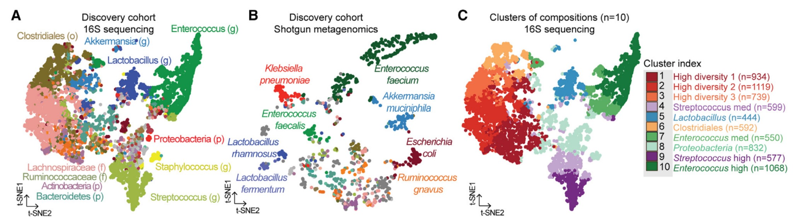
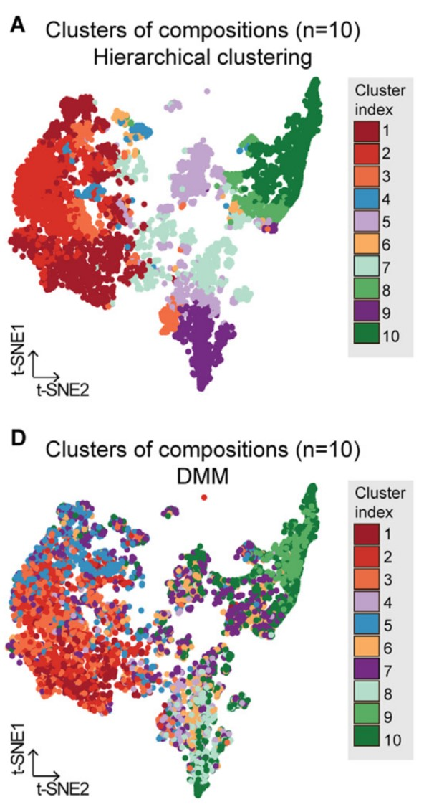
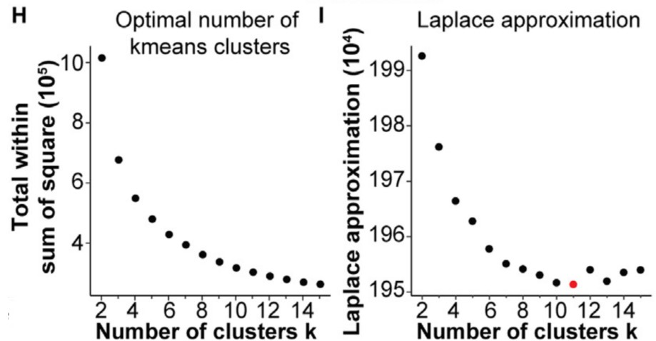
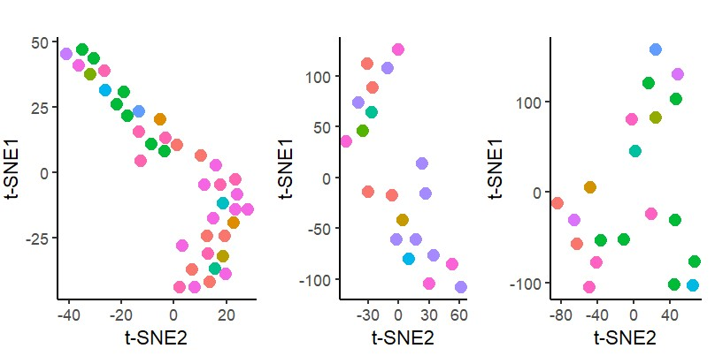
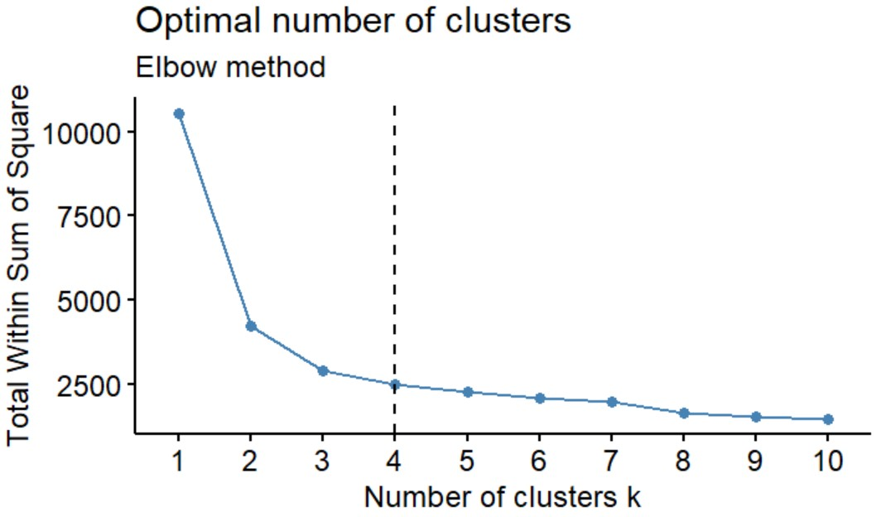
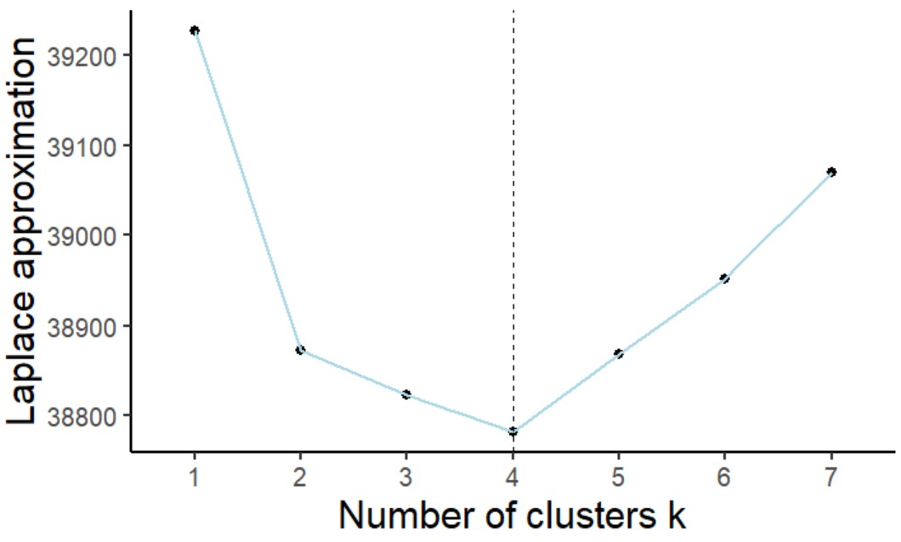
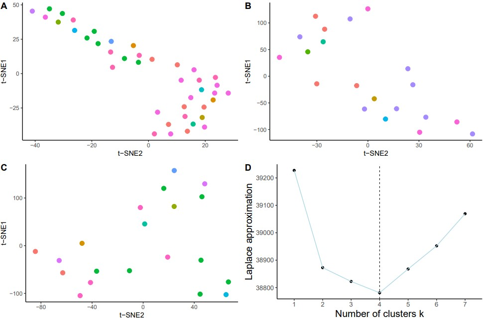

```{r setup, include=FALSE}
knitr::opts_chunk$set(
  collapse = T, echo=T, comment="#>", message=F, warning=F,
	fig.align="center", fig.width=5, fig.height=3, dpi=150)
```


The Batch effects correction scripts is referenced from MicrobiomeStatPlot [Inerst Reference below].


If you use this script, please cited 如果你使用本代码，请引用：

**Yong-Xin Liu**, Lei Chen, Tengfei Ma, Xiaofang Li, Maosheng Zheng, Xin Zhou, Liang Chen, Xubo Qian, Jiao Xi, Hongye Lu, Huiluo Cao, Xiaoya Ma, Bian Bian, Pengfan Zhang, Jiqiu Wu, Ren-You Gan, Baolei Jia, Linyang Sun, Zhicheng Ju, Yunyun Gao, **Tao Wen**, **Tong Chen**. 2023. EasyAmplicon: An easy-to-use, open-source, reproducible, and community-based pipeline for amplicon data analysis in microbiome research. **iMeta** 2(1): e83. https://doi.org/10.1002/imt2.83

The online version of this tuturial can be found in https://github.com/baidefeng/MicrobiomeStatPlot/tree/master/3.Visualization_and_interpretation


**Authors**
First draft(初稿)：Defeng Bai(白德凤)；Proofreading(校对)：Ma Chuang(马闯) and Xun Jiani(荀佳妮)；Text tutorial(文字教程)：Defeng Bai(白德凤)


# Introduction简介

什么是tSNE (t-Distributed Stochastic Neighbor Embedding)

tSNE简介和基本原理
Introduction and Basic Principles of tSNE

tSNE是数据降维方式中的一种，其由T分布和随机近邻嵌入，其可以讲高维数据降到2-3维。t-SNE把高维度的数据点之间的距离转化为高斯分布概率，在高维度用高斯分布概率表示相似性，在低维度用t分布表示相似性，然后设置一个惩罚函数，实现降低维度但是保留一定局部特征的方式。

TSNE is a method of data dimensionality reduction, which consists of T-distribution and random nearest neighbor embedding. It can reduce high-dimensional data to 2-3 dimensions. T-SNE converts the distance between high-dimensional data points into a Gaussian distribution probability. In high-dimensional data, Gaussian distribution probability is used to represent similarity, while in low-dimensional data, t-distribution is used to represent similarity. Then, a penalty function is set to reduce the dimensionality while retaining certain local features.


关键字：微生物组数据分析、MicrobiomeStatPlot、TSNE降维分析、R语言可视化

Keywords: Microbiome analysis, MicrobiomeStatPlot, t-Distributed Stochastic Neighbor Embedding, R visulization


## tSNE example tSNE实例

美国纪念斯隆凯瑟琳癌症研究中心的Marcel R.M. van den Brink团队2023年发表在Cell上的论文(Nguyen et al., 2023)，研究药物、肠道微生物组和癌症患者死亡之间的关系。我们以此图为例进行讲解。论文题目为：High-resolution analyses of associations between medications, microbiome, and mortality in cancer patients. https://doi.org/10.1016/j.cell.2023.05.007

The paper published by Marcel R.M. van den Brink's team at the Sloan Katherine Cancer Research Center in the United States in 2023 in Cell (Nguyen et al., 2023) investigates the relationship between drugs, gut microbiota, and cancer patient mortality. We will use this diagram as an example to explain. Title of the paper was: High-resolution analyses of associations between medications, microbiome, and mortality in cancer patients. https://doi.org/10.1016/j.cell.2023.05.007




图 2：（A 和 B）通过 tSNE 投影显示 MSKCC 发现队列中肠道微生物群的组成空间。每个点代表一个样本，根据 (A) 16S rRNA（7,454 个样本；778 名患者）或 (B) 宏基因组测序图谱（980 个样本；340 名患者）（p，门；f，科；o，目；g，属）中相对丰度最高的类群着色。样本采集于相对于 HCT 的第 -30 天和第 2,205 天之间。(C)通过 k-means 无监督聚类法划分出十个肠道微生物组聚类群。

Figure 2. (A and B) Compositional space of the intestinal microbiota in the MSKCC discovery cohort visualized by tSNE projection. Each point represents a sample, colored according to the taxon of highest relative abundance based on (A) 16S rRNA (7,454 samples; 778 patients) or (B) shotgun metagenomic sequencing profiles (980 samples; 340 patients) (p, phylum; f, family; o, order; g, genus). Samples were collected between day -30 and 2,205 relative to HCT. (C) Ten clusters of intestinal microbiome compositions are assigned by k-means unsupervised clustering.


**结果**：
结果：对于 16S rRNA 测序样本，我们使用 BrayCurtis b-diversity 差异指数计算了发现队列样本之间的组成差异；对于霰弹枪元基因组测序样本，我们使用 BrayCurtis b-diversity 差异指数计算了物种水平的组成差异，并通过 t-stochastic neighbor embedding（tSNE；图 2A 和 2B）将高维粪便组成数据可视化。我们观察到了微生物组损伤的模式，包括α多样性的丧失和潜在致病菌的富集，如肠球菌属和肠杆菌科（图 2A 和 2B）。具体来说，我们观察到一个样本群，其中最丰富的生物是各种严格厌氧菌，如Ruminococcus gnavus或Erysipelatoclostridium ramosum，以及富含潜在致病性兼性物种的独特样本群，包括粪肠球菌、肺炎克雷伯菌和大肠埃希菌。考虑到在保留细菌群落结构的同时降低维度复杂性的数学挑战，我们对发现集样本的 Bray-Curtis b-diversity 矩阵进行了无监督 k-means 聚类，并确定了 10 个不同的微生物群（图 2C）。

We computed the compositional differences among discovery cohort samples using BrayCurtis b-diversity dissimilarity indices at the genus level for 16S rRNA-sequenced samples or at the species level for shotgun metagenomic sequenced samples and visualized the highdimensional stool composition data via t-stochastic neighbor embedding (tSNE; Figures 2A and 2B). We observed patterns of microbiome injuries, including the
loss of alpha diversity and enrichment of potentially pathogenic bacteria such as Enterococcus and Enterobacteriaceae (Figures 2A and 2B).A subset of 980 samples with shotgun metagenomic profiling also showed similar patterns of microbiome injuries during allo-HCT (Figure 2B). Specifically, we observed a cluster of samples whose most abundant organisms were various strict anaerobes such as Ruminococcus gnavus or Erysipelatoclostridium ramosum, as well as distinct clusters enriched for potentially pathogenic facultative species including Enterococcus faecium, Klebsiella pneumoniae, and Escherichia coli. Given the mathematical challenge of reducing dimensionality complexity while preserving bacterial community structure, we performed unsupervised k-means clustering on the Bray-Curtis b-diversity matrix of samples in the discovery set and identified ten distinct microbiota clusters (Figure 2C).




**结果**：

Figure S1. (A and D) Compositional space of the intestinal microbiota visualized by tSNE projection in the MSKCC discovery cohort. Each dot represents a sample, colored according to clusters assigned by (A) hierarchical clustering or (D) Dirichlet multinomial mixture (DMM) model.

图 S1. (A和D）通过tSNE投影观察MSKCC发现队列中的肠道微生物群的组成空间。每个点代表一个样本，根据(A)分层聚类或(D)Dirichlet 多叉混合物（DMM）模型分配的聚类着色。



Figure S1. (H) Optimal number of k-means clusters was estimated from the curve of within-cluster sum of square distances from each point to its cluster centroid. (I) Optimal number of clusters identified by DMM was estimated by the smallest Laplace approximation metric.

图 S1. (H)根据每个点到其聚类中心点的聚类内平方距离之和曲线估算 k-means 聚类的最佳数目。(I) 通过最小拉普拉斯近似度量估算出 DMM 确定的最佳聚类数目。


## Packages installation软件包安装

```{r}
# 基于CRAN安装R包，检测没有则安装
p_list = c("tidyverse","pheatmap","reshape2","igraph","dplyr","Rtsne","factoextra"
           ,"magrittr","readxl")
for(p in p_list){if (!requireNamespace(p)){install.packages(p)}
    library(p, character.only = TRUE, quietly = TRUE, warn.conflicts = FALSE)}

# 基于Bioconductor安装R包
if (!requireNamespace("microbiome", quietly = TRUE))
    BiocManager::install("microbiome")
if (!requireNamespace("DirichletMultinomial", quietly = TRUE))
    BiocManager::install("DirichletMultinomial")

# 加载R包 Load the package
suppressWarnings(suppressMessages(library(tidyverse)))
suppressWarnings(suppressMessages(library(pheatmap)))
suppressWarnings(suppressMessages(library(reshape2)))
suppressWarnings(suppressMessages(library(igraph)))
suppressWarnings(suppressMessages(library(dplyr)))
suppressWarnings(suppressMessages(library(Rtsne)))
suppressWarnings(suppressMessages(library(factoextra)))
suppressWarnings(suppressMessages(library(microbiome)))
suppressWarnings(suppressMessages(library(DirichletMultinomial)))
suppressWarnings(suppressMessages(library(magrittr)))
suppressWarnings(suppressMessages(library(readxl)))
```


# tSNE analysis and plot tSNE分析和绘图

## tSNE using R software tSNE绘图实战

### Spatial map of the composition of intestinal microbiota projected by tSNEtSNE投影肠道微生物群的组成空间图

```{r tSNE1, fig.show='asis', fig.width=4, fig.height=2.5}
# 整体：健康组+疾病组(Health group+Disease group)
# 丰度数据表和metadata(Abundance data table and metadata)
design = read.table("data/design.txt", header=T, row.names=1, sep="\t")
design$group = design$groupID
otufile = "data/sum_species_data.txt"
otutab = read.table(paste(otufile, sep=""), header=T, row.names=1, sep="\t", comment.char="") 

# 健康组
# Healthy
design2 = read.table("data/design_sh.txt", header=T, row.names=1, sep="\t")
design2$group = design2$groupID
otufile2 = "data/sum_sh.txt"
otutab2 = read.table(paste(otufile2, sep=""), header=T, row.names=1, sep="\t", comment.char="") 

# 疾病组
# Patients
design3 = read.table("data/design_sp.txt", header=T, row.names=1, sep="\t")
design3$group = design3$groupID
otufile3 = "data/sum_sp.txt"
otutab3 = read.table(paste(otufile3, sep=""), header=T, row.names=1, sep="\t", comment.char="") 

```


### Identify the most diverse genera鉴定最丰富的物种

```{r tSNE2, fig.show='asis', fig.width=4, fig.height=2.5}
# 整体(Overall)
# 计算得到每个样本中每个微生物属的相对丰富Calculate the relative abundance of each microbial genus in each sample
otutab <- t(otutab)
otutab <- otutab[-1, ]
sample = rownames(otutab)
otutab <- cbind(sample, otutab)
otutab <- as.data.frame(otutab)
species_abundance_tbl = otutab %>%
  filter(sample %in% design$Samples)

# 得到每个样本优势微生物属的数据Obtain data on dominant microbial genera for each sample
dominant_species = colnames(species_abundance_tbl[,-1])[apply(species_abundance_tbl[,-1], 1, which.max)]

# 得到每个样本优势微生物属的数据Obtain data on dominant microbial genera for each sample
design$dominant_species = dominant_species

# 计算tSNE坐标Calculate the tSNE coordinates
bc_data = read.table(paste("data/bray_curtis.txt",sep=""), header=T, row.names=1, sep="\t", comment.char="") 

# 利用Rtsne计算tSNE坐标Using Rtsne to Calculate tSNE Coordinates
tsne_out <- Rtsne(bc_data, pca=FALSE, perplexity=10, theta=0.1, max_iter = 3000)

# Y中存储了画图坐标Y stores drawing coordinates
stnes = tsne_out$Y

# 健康组(Healthy)
otutab2 <- t(otutab2)
otutab2 <- otutab2[-1, ]
sample2 = rownames(otutab2)
otutab2 <- cbind(sample2, otutab2)
otutab2 <- as.data.frame(otutab2)
species_abundance_tbl2 = otutab2 %>%
  filter(sample2 %in% design2$Samples)

# 得到每个样本优势微生物属的数据Obtain data on dominant microbial genera for each sample
dominant_species2 = colnames(species_abundance_tbl2[,-1])[apply(species_abundance_tbl2[,-1], 1, which.max)]

# 得到每个样本优势微生物属的数据Obtain data on dominant microbial genera for each sample
design2$dominant_species2 = dominant_species2

# 计算tSNE坐标Calculate the tSNE coordinates
bc_data2 = read.table(paste("data/bray_curtis_sh.txt",sep=""), header=T, row.names=1, sep="\t", comment.char="") 

# 利用Rtsne计算tSNE坐标Using Rtsne to Calculate tSNE Coordinates
tsne_out2 <- Rtsne(bc_data2, pca=FALSE, perplexity=5, theta=0.1, max_iter = 3000)

# Y中存储了画图坐标Y stores drawing coordinates
stnes2 = tsne_out2$Y

# 疾病组(Patients)
otutab3 <- t(otutab3)
otutab3 <- otutab3[-1, ]
sample3 = rownames(otutab3)
otutab3 <- cbind(sample3, otutab3)
otutab3 <- as.data.frame(otutab3)
species_abundance_tbl3 = otutab3 %>%
  filter(sample3 %in% design3$Samples)

# 得到每个样本优势微生物属的数据Obtain data on dominant microbial genera for each sample
dominant_species3 = colnames(species_abundance_tbl3[,-1])[apply(species_abundance_tbl3[,-1], 1, which.max)]

# 得到每个样本优势微生物属的数据Obtain data on dominant microbial genera for each sample
design3$dominant_species3 = dominant_species3

# 计算tSNE坐标Calculate the tSNE coordinates
bc_data3 = read.table(paste("data/bray_curtis_sp.txt",sep=""), header=T, row.names=1, sep="\t", comment.char="") 

# 利用Rtsne计算tSNE坐标Using Rtsne to Calculate tSNE Coordinates
tsne_out3 <- Rtsne(bc_data3, pca=FALSE, perplexity=5, theta=0.1, max_iter = 3000)

# Y中存储了画图坐标Y stores drawing coordinates
stnes3 = tsne_out3$Y
```


### Draw a tSNE diagram绘tSNE图

```{r tSNE3, fig.show='asis', fig.width=4, fig.height=2.5}
# 整体：健康组+疾病组(Health group+Disease group)
p1 <- ggplot(design, aes(x=stnes[,2],y=stnes[,1],col=factor(dominant_species))) +
  geom_point(size = 3) +
  theme_classic() +
  #coord_fixed() +
  theme(legend.position = "none")+
  labs(x = "t-SNE2", y= "t-SNE1")
# ggsave(paste("data_npc/tSNE_all.pdf",".pdf", sep=""), p1, width=89 * 1.5, height=50 * 1.5, unit='mm')
# p1

# 健康组(Healthy)
p2 <- ggplot(design2, aes(x=stnes2[,2],y=stnes2[,1],col=factor(dominant_species2))) +
  geom_point(size = 3) +
  theme_classic() +
  #coord_fixed() +
  theme(legend.position = "none")+
  labs(x = "t-SNE2", y= "t-SNE1")
# ggsave(paste("data_npc/tSNE_H.pdf",".pdf", sep=""), p2, width=89 * 1.5, height=50 * 1.5, unit='mm')
# p2

# 疾病组(Patients)
p3 <- ggplot(design3, aes(x=stnes3[,2],y=stnes3[,1],col=factor(dominant_species3))) +
  geom_point(size = 3) +
  theme_classic() +
  #coord_fixed() +
  theme(legend.position = "none")+
  labs(x = "t-SNE2", y= "t-SNE1")
# ggsave(paste("data_npc/tSNE_P.pdf",".pdf", sep=""), p3, width=89 * 1.5, height=50 * 1.5, unit='mm')
# p3

library(patchwork)
p4 <- p1 + p2 + p3
#p4
```





### Determine the optimal number of clusters using the kmeans method通过kmeans方法确定最佳聚类数量

```{r tSNE4, fig.show='asis', fig.width=4, fig.height=2.5}
# Load bray-curtail Beta diversity Matrix
bc_data = read.table(paste("data/bray_curtis.txt",sep=""), header=T, row.names=1, sep="\t", comment.char="") 

# 1.kmeans聚类(kmeans clustering)
km <- kmeans(bc_data, 3, nstart = 24)

# 聚类可视化(cluster plot)
# fviz_cluster(km, data = bc_data,
#              palette = c("#A50026","#C2A5CF","#3690C0"),
#              ellipse.type = "euclid",
#              star.plot = TRUE, 
#              repel = TRUE,
#              ggtheme = theme_minimal()
# )

# 确定kmeans聚类的最佳聚类数。可以在平方误差综合SSE碎石图上查找弯曲或弯头。弯头在结果图中的位置表明适合kmeans的簇数
# Determine the optimal number of clusters for kmeans clustering. You can search for bends or bends on the squared error comprehensive SSE gravel map. The position of the elbow in the result graph indicates the number of clusters suitable for kmeans
pdf("results/kmeans_clusters_plot01.pdf", width = 5, height = 4)
(fviz_nbclust(bc_data, kmeans, method = "wss")+
  geom_vline(xintercept = 4, linetype = 2)+
  labs(subtitle = "Elbow method"))
dev.off()
```





### Cluster analysis using DMM model methodDMM模型方法进行聚类群分析

Dirichlet multinomial mixture (DMM) model实现微生物数据的聚类分析
Cluster analysis of microbial data using the Dirichlet Multimicrobial Mixture (DMM) model

```{r tSNE5, fig.show='asis', fig.width=4, fig.height=2.5}
# 构建phyloseq数据Building photoseq data
# metadata
metadata <- data.frame(read_xlsx('data/dietswap_data.xlsx', sheet='samtable'))
rownames(metadata) <- metadata$sample

# taxtable
tax <- data.frame(read_xlsx('data/dietswap_data.xlsx', sheet='taxtable'))

# otutable
otu <- data.frame(read_xlsx('data/dietswap_data.xlsx', sheet='otutable'))

# order same as metadata
otu <- otu[,c('clade_name',metadata$sample)]
otu <- as.data.frame(otu)

# make table sample x feature
rownames(tax) <- tax$clade_name
tax <- data.frame(tax[,-1], check.names=FALSE)
rownames(otu) <- otu$clade_name
otu <- data.frame(otu[,-1], check.names=FALSE)

# compile count data into phyloseq objects for species
dietswap_data <- phyloseq(otu_table(as.matrix(otu), taxa_are_rows=TRUE),
                      sample_data(metadata),
                      tax_table(as.matrix(tax)))
pseq <- dietswap_data

# 示例数据来源(example data resources)
# data("dietswap")
# #这个示例数据包含52个微生物，222个样本，样本信息文件有8列
# This example data contains 52 microorganisms, 222 samples, and the sample information file has 8 columns
# pseq<-dietswap
# pseq@otu_table
# write.csv(pseq@otu_table, "data/dietswap_otutable.csv")
# write.csv(pseq@tax_table, "data/dietswap_taxtable.csv")
# samdata <- as.data.frame(pseq@sam_data)
# write.csv(samdata, "data/dietswap_samtable.csv")

# 只挑选出核心群进行分析Only select the core group for analysis
pseq.comp<-microbiome::transform(pseq, "compositional")

# 核心微生物群的指标应该是在50%的样本中相对丰度为0.1% 
# The indicator of the core microbial community should be a relative abundance of 0.1% in 50% of the samples
taxa<-core_members(pseq.comp, detection = 0.1/100, prevalence = 50/100)

# 删除不想要的OTU或群Delete unwanted OTUs or groups
pseq<-prune_taxa(taxa, pseq)

# 数据中有三个分析组，按照这三个组分为三个部分的预设进行建模
# There are three analysis groups in the data, and modeling is carried out based on the assumption that these three groups are divided into three parts
map = sample_data(pseq)
map$group %>% unique()

# 222个样本中核心物种的丰富度，行为种名，列为样本对应的丰富度
# The richness of core species in 222 samples, represented by species names, is listed as the corresponding richness of the samples
dat<-abundances(pseq)

# 将核心群的丰度数据转置且变为矩阵，行为样本数，列为不同的种名
# Invert and transform the abundance data of the core group into a matrix, with the number of behavioral samples listed as different species names
count<-as.matrix(t(dat))

# lapply函数调用函数dmn，对样本计数矩阵拟合多项式模型
# The laply function calls the function dmn to fit a polynomial model to the sample count matrix
fit<-lapply(1:4, dmn, count=count, verbose=TRUE)

# 群落类型数设为3，得到三个dmn(Setting the number of community types to 3 yields three DMNs)
# 判断拟合结果(Judging the fitting results)
# laplace获取拟合的模型的参数(Laplace obtains the parameters of the fitted model)
lplc <- sapply(fit, laplace)
aic <- sapply(fit, AIC)

# 用最大似然法估计参数时，AIC、BIC越小拟合越好
# When estimating parameters using the maximum likelihood method, the smaller the AIC and BIC, the better the fitting
bic <- sapply(fit,BIC)

# 选择最佳模型(Choose the best model)
# unlist对所有参数列表的模型挑选参数最小的
# Unlist selects the model with the smallest parameter for all parameter lists
best <- fit[[which.min(unlist(lplc))]]

# 获取最佳拟合模型的参数pi和theta值
# Obtain the parameter pi and theta values of the best fit model
# mixturewt(best)

# 保存最佳模型(save best model)
ass <- apply(mixture(best),1,which.max)
write.csv(ass, file="results/DMM_4clusters.csv")

for(k in seq(ncol(fitted(best)))){
  d <- melt(fitted(best))
  colnames(d) <- c("OTU","cluster","value")
  d <- subset(d, cluster==k) %>%
    arrange(value) %>%
    mutate(OTU = factor(OTU, levels = unique(OTU))) %>%
    filter(abs(value)>quantile(abs(value), 0.8))
  p<-ggplot(d, aes(x=OTU, y= value))+
    geom_bar(stat = "identity")+
    coord_flip()+
    labs(title = paste("Top drivers: community type", k))
  #print(p)
}

# 如何先择最佳的k值(How to choose the best k value first)
data(fit)
lplc <- sapply(fit, laplace)
#plot(lplc, type="b")
fit[[which.min(lplc)]]
lplc2 <- as.data.frame(lplc)
lplc2$cluster <- rownames(lplc2)

# 绘图Plot
p01_DMM <- ggplot(data = lplc2, aes(x=cluster,y=lplc, group = 1))+
  geom_point()+
  geom_line(color = "lightblue")+
  xlab("Number of clusters k")+  
  ylab("Laplace approximation")+  
  theme_classic() + 
  geom_vline(xintercept = 4, colour='black', lwd=0.36, linetype="dashed")+
  theme(panel.grid.major=element_line(colour=NA),
        panel.background = element_rect(fill = "transparent",colour = NA),
        plot.background = element_rect(fill = "transparent",colour = NA),
        plot.title = element_text(hjust = 0.5,size = 15),
        panel.grid.minor = element_blank(),   
        text = element_text(family = "sans"),  
        axis.text.x = element_text(hjust = 0.5,size = 10), 
        axis.text.y = element_text(hjust = 0.5,size = 10),
        axis.title.y = element_text(size = 15), 
        axis.title.x = element_text(size = 15), 
        legend.text = element_text(size = 15),
        legend.position = c(.92,.72),  
        legend.box.background = element_rect(color="black"))
#(p01_DMM)
```





# Combo plots排版

Combo plots to published-ready figure

组合多个子图为发表格式

```{r tSNE6, fig.show='asis', fig.width=4, fig.height=2.5}
library(cowplot)
width = 89
height = 59
p0 = plot_grid(p1 ,p2, p3, p01_DMM, labels = c("A", "B", "C", "D"), ncol = 2)
ggsave("results/tsne_plot01.pdf", p0, width = width * 3, height = height * 3, units = "mm")
```




