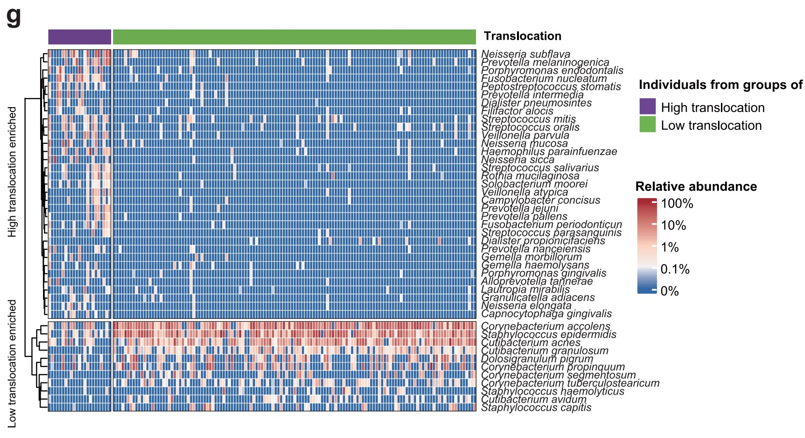

```{r setup, include=FALSE}
knitr::opts_chunk$set(
  collapse = T, echo=T, comment="#>", message=F, warning=F,
	fig.align="center", fig.width=5, fig.height=3, dpi=150)
```


The two group comparison heatmap scripts is referenced from MicrobiomeStatPlot [Inerst Reference below].

If you use this script, please cited 如果你使用本代码，请引用：

**Yong-Xin Liu**, Lei Chen, Tengfei Ma, Xiaofang Li, Maosheng Zheng, Xin Zhou, Liang Chen, Xubo Qian, Jiao Xi, Hongye Lu, Huiluo Cao, Xiaoya Ma, Bian Bian, Pengfan Zhang, Jiqiu Wu, Ren-You Gan, Baolei Jia, Linyang Sun, Zhicheng Ju, Yunyun Gao, **Tao Wen**, **Tong Chen**. 2023. EasyAmplicon: An easy-to-use, open-source, reproducible, and community-based pipeline for amplicon data analysis in microbiome research. **iMeta** 2(1): e83. https://doi.org/10.1002/imt2.83

The online version of this tuturial can be found in https://github.com/YongxinLiu/MicrobiomeStatPlot

**Authors**
First draft(初稿)：Defeng Bai(白德凤)；Proofreading(校对)：Ma Chuang(马闯) and Jiani Xun(荀佳妮)；Text tutorial(文字教程)：Defeng Bai(白德凤)


# Introduction简介

两组比较热图是最简单的热图类型，通过比较两组之间多个不同样本之间的相对丰度或含量等观察组间差异，在微生物组研究中很常用。

The two-group comparison heatmap is the simplest type of heat map. It is commonly used in microbiome research by comparing the relative abundance or content of multiple different samples between two groups.

关键字：微生物组数据分析、MicrobiomeStatPlot、两组比较热图、R语言可视化

Keywords: Microbiome analysis, MicrobiomeStatPlot, Two group comparison heatmap, R visulization


## Two group comparison heatmap example 两组比较热图应用案例

这是来自于中山大学肿瘤防治中心贾卫华课题组2024年发表于Nature Communications上的一篇论文，论文用到的题目是：Microbes translocation from oral cavity to nasopharyngeal carcinoma in patients. https://doi.org/10.1038/s41467-024-45518-2

This is a paper from Jia Weihua's research group at Sun Yat-sen University Cancer Center published in Nature Communications in 2024. The title of the paper is: Microbes translocation from oral cavity to nasopharyngeal carcinoma in patients. https://doi.org/10.1038/s41467-024-45518-2


Fig. 1 g The heatmap showing the significant differential species between high(N= 21) /low- (N= 135) translocation groups based on nasopharyngeal microbiota data (ANCOM-BC, two-sided, FDR q <0.05) with adjusting for age, sex, cigarette smoking status, alcohol drinking status, whether have caries and whether have oral or nasal diseases. 

图 1g 基于鼻咽微生物数据（ANCOM-BC，双侧，FDR q <0.05）的热图显示了高（N= 21）/低（N= 135）易位组之间的显著差异物种，并根据年龄、性别、吸烟状况、饮酒状况、是否患有龋齿以及是否患有口腔或鼻腔疾病进行调整。


**结果**

The species associated with the translocation were further identified in nasopharynx. A total of 33 species were significantly enriched in the high-translocation group, including five taxa from genus Prevotella,fourtaxafromgenus Streptococcus and four taxa from genus Neisseria, which were dominant in the oral cavity (Fig. 1g). An additional 11 species were significantly depleted in the high-translocation group, they were nasopharyngeal commensals from genus Corynebacterium, Cutibacterium, Staphylococcus and Dolosigranulum (including four, three, three and one taxa, respectively, Fig. 1g). Our results revealed that abnormal inflow of oral microbiota into nasopharynx is an important risk factor for NPC.

在鼻咽部进一步鉴定出与易位相关的物种。高易位组中共有33个物种显著富集，包括5个普氏菌属的分类群、4个链球菌属的分类群和4个奈瑟菌属的分类群，这些分类群在口腔中占优势（图1g）。高易位组中另有11个物种显著减少，它们是来自棒状杆菌属、Cutibacterium属、葡萄球菌属和Dolosigranulum属的鼻咽共生菌（分别包括4个、3个、3个和1个分类群，图1g）。我们的研究结果表明，口腔微生物群异常流入鼻咽是鼻咽癌的重要危险因素。


## Packages installation软件包安装

```{r}
# 基于CRAN安装R包，检测没有则安装
p_list = c("pheatmap")
for(p in p_list){if (!requireNamespace(p)){install.packages(p)}
    library(p, character.only = TRUE, quietly = TRUE, warn.conflicts = FALSE)}

# 加载R包 Load the package
suppressWarnings(suppressMessages(library(pheatmap)))
```


# Two group comparison heatmap 两组比较热图

## Two group comparison heatmap using R software 两组比较热图R语言实战

```{r heatmap, fig.show='asis', fig.width=4, fig.height=2.5}
# Load data
data01 <- read.table(file = "data/data2.txt", sep = "\t", row.names = 1, header = TRUE, check.names = FALSE)

# 1.基础热图 Basic heatmap
data <- data01[, 4:11]
pheatmap(data)

# 2.设置颜色 Set colors
pheatmap(data01[, c(4:11)], color = colorRampPalette(c('red', 'white', 'blue'))(100))

# 3.设置单元格大小 Set cell size
pheatmap(data01[, c(4:11)], cellwidth = 18, cellheight = 18)

# 4.设置聚类树的高度 Set the height of the clustering tree
# 行 Rows
pheatmap(data01[, c(4:11)], treeheight_row = 100)
# 列 Columns
pheatmap(data01[, c(4:11)], treeheight_col = 100)

# 5.取消聚类 Uncluster
# 行 Rows
pheatmap(data01[, c(4:11)], cluster_rows = FALSE)
# 列 Columns
pheatmap(data01[, c(4:11)], cluster_cols = FALSE)

# 6.依据聚类结果对热图进行分割 Segment the heat map based on clustering results
pheatmap(data01[, c(4:11)], cluster_rows = TRUE, cluster_cols = FALSE, cutree_rows = 3)

# 7.添加样本分组信息 Add sample grouping information
annotation_col = data.frame(Group = factor(rep(c('Healthy','Patients'), c(4,4))), row.names = colnames(data01[, c(4:11)]), color = rep(c("#d6a319","#8771cd"), c(4,4)))

annotation_col = data.frame(Group = factor(rep(c('Healthy','Patients'), c(4,4))), row.names = colnames(data01[, c(4:11)]))

pheatmap(data01[, c(4:11)], cluster_rows = TRUE, cluster_cols = FALSE, cutree_rows = 3, annotation_col = annotation_col)

pheatmap(data01[, c(4:11)], cluster_rows = TRUE, cluster_cols = FALSE, cutree_rows = 3, annotation_col = annotation_col,
         cellwidth = 24, cellheight = 12,
         color = colorRampPalette(c('#5e7fc2',"white", '#d05771'))(100), border_color = NA, filename = 'results/metabolism02.pdf')

# 8.添加代谢物分类信息 Add metabolite classification information
annotation_row = data.frame(Class = data01$Class, row.names = rownames(data01))
pheatmap(data01[, c(4:11)], cluster_rows = TRUE, cluster_cols = FALSE, cutree_rows = 3, annotation_col = annotation_col, annotation_row = annotation_row)

# 9.设置单元格边框颜色，默认颜色为灰色 Set the cell border color. The default color is gray.
pheatmap(data01[, c(4:11)], cluster_rows = TRUE, cluster_cols = FALSE, cutree_rows = 3, annotation_col = annotation_col, annotation_row = annotation_row, border_color = NA)# border_color = NA 表示不设置单元格边框颜色

# 10.单元格内显示数值 Display values in cells
pheatmap(data01[, c(4:11)], cluster_rows = TRUE, cluster_cols = FALSE, cutree_rows = 3, annotation_col = annotation_col, annotation_row = annotation_row, border_color = NA, display_numbers = T)

# 11.设置字体大小 Set the font size
pheatmap(data01[, c(4:11)], cluster_rows = TRUE, cluster_cols = FALSE, cutree_rows = 3, annotation_col = annotation_col, annotation_row = annotation_row, border_color = NA, display_numbers = T, fontsize = 11)

#也可使用fontsize_row和fontsize_col分别对行标签和列标签进行字体大小设置。 Set font size and labels
pheatmap(data01[, c(4:11)], cluster_rows = TRUE, cluster_cols = FALSE, cutree_rows = 3, annotation_col = annotation_col, annotation_row = annotation_row, border_color = NA, display_numbers = T, fontsize = 11, fontsize_row = 13, fontsize_col = 15)

# 12.保存热图 Save heatmap
pheatmap(data01[, c(4:11)], cluster_rows = TRUE, cluster_cols = FALSE, cutree_rows = 3, annotation_col = annotation_col, annotation_row = annotation_row, border_color = NA, display_numbers = T, filename = 'results/metabolism01.pdf')

```


If used this script, please cited:
使用此脚本，请引用下文：

**Yong-Xin Liu**, Lei Chen, Tengfei Ma, Xiaofang Li, Maosheng Zheng, Xin Zhou, Liang Chen, Xubo Qian, Jiao Xi, Hongye Lu, Huiluo Cao, Xiaoya Ma, Bian Bian, Pengfan Zhang, Jiqiu Wu, Ren-You Gan, Baolei Jia, Linyang Sun, Zhicheng Ju, Yunyun Gao, **Tao Wen**, **Tong Chen**. 2023. EasyAmplicon: An easy-to-use, open-source, reproducible, and community-based pipeline for amplicon data analysis in microbiome research. **iMeta** 2: e83. https://doi.org/10.1002/imt2.83

**Yunyun Gao**, Danyi Li, **Yong-Xin Liu**, Microbiome research outlook: past, present, and future, Protein & Cell, 2023, pwad031, https://doi.org/10.1093/procel/pwad031. 

Copyright 2016-2024 Defeng Bai <baidefeng@caas.cn>, Chuang Ma <22720765@stu.ahau.edu.cn>, Jiani Xun <15231572937@163.com>, Yong-Xin Liu <liuyongxin@caas.cn>

