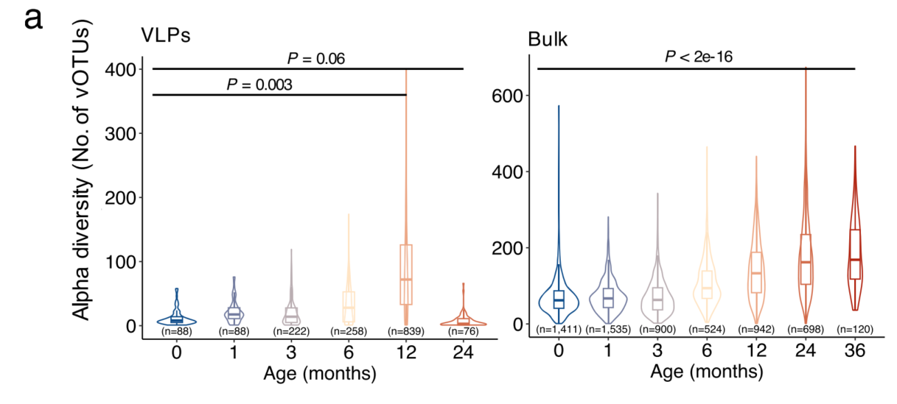
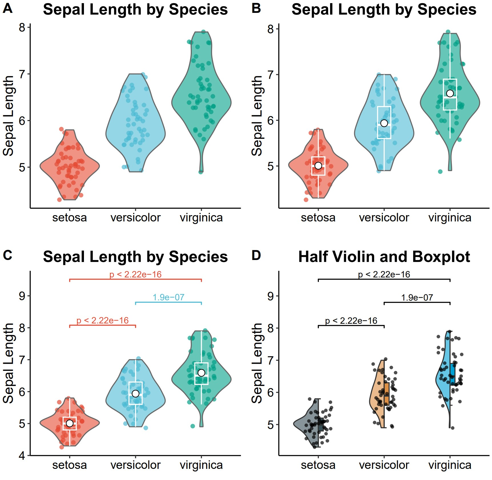

```{r setup, include=FALSE}
knitr::opts_chunk$set(
  collapse = T, echo=T, comment="#>", message=F, warning=F,
	fig.align="center", fig.width=5, fig.height=3, dpi=150)
```


The Violin plot scripts is referenced from MicrobiomeStatPlot [Inerst Reference below].


If you use this script, please cited 如果你使用本代码，请引用：

**Yong-Xin Liu**, Lei Chen, Tengfei Ma, Xiaofang Li, Maosheng Zheng, Xin Zhou, Liang Chen, Xubo Qian, Jiao Xi, Hongye Lu, Huiluo Cao, Xiaoya Ma, Bian Bian, Pengfan Zhang, Jiqiu Wu, Ren-You Gan, Baolei Jia, Linyang Sun, Zhicheng Ju, Yunyun Gao, **Tao Wen**, **Tong Chen**. 2023. EasyAmplicon: An easy-to-use, open-source, reproducible, and community-based pipeline for amplicon data analysis in microbiome research. **iMeta** 2(1): e83. https://doi.org/10.1002/imt2.83

The online version of this tuturial can be found in https://github.com/baidefeng/MicrobiomeStatPlot/tree/master/3.Visualization_and_interpretation


# Introduction简介

小提琴图（Violon plot）是一种用于可视化数据分布的统计图表。它结合了箱线图和核密度估计图，能够同时展示数据的中位数、四分位数、分布形状以及数据的密度情况，用于显示数据的分布情况。它由一个箱体和两条线段组成，箱体代表数据的中位数，四分位数以及上下界，线段则表示数据的最小值和最大值。在小提琴图中，箱体表示了数据的中间50%范围，其中间的线代表中位数。箱体周围的线段则延申至数据的最小值和最大值。触须以外的区域被视为异常值或离群点。

A violin plot is a statistical chart used to visualize the distribution of data. It combines boxplot and kernel density estimation chart, which can simultaneously display the median, quartile, distribution shape, and density of data, used to display the distribution of data. It consists of a box and two line segments, where the box represents the median, quartile, and upper and lower bounds of the data, while the line segments represent the minimum and maximum values of the data. In the violin chart, the box represents the middle 50% range of the data, with the lines between representing the median. The line segments around the box are extended to the minimum and maximum values of the data. Areas outside the tentacles are considered outliers or outliers.

小提琴的密度反映了相应数据的密度情况，密度越大表示在该区域内的数据点越密集，宽度越小则表示密度越小。因此，可以从小提琴的宽度上初步判断出数据是否集中在某个区间内或是具有多个峰值。

The density of the violin reflects the density of the corresponding data. The higher the density, the denser the data points in the area, and the smaller the width, the lower the density. Therefore, it can be preliminarily determined from the width of the violin whether the data is concentrated within a certain interval or has multiple peaks.


关键字：微生物组数据分析、MicrobiomeStatPlot、小提琴图、R语言可视化

Keywords: Microbiome analysis, MicrobiomeStatPlot, Violin plot, R visulization


## 小提琴图应用实例Violin plot case

这是Jakob Stokholm课题组2023年发表于Nature Medicine上的文章，第一作者为Cristina Leal Rodríguez，题目为：The infant gut virome is associated with preschool asthma risk independently of bacteria. https://doi.org/10.1038/s41591-023-02685-x

This is an article published by the Jakob Stokholm research group in Nature Medicine in 2023. The first author is Cristina Leal Rodr í guez, and the title is: The incident gut virus is associated with pre-school astroma risk independently of bacteria. https://doi.org/10.1038/s41591-023-02685-x



Fig. 2 a a Longitudinal changes of richness (number of observed vOTUs, left for VLPs and right for bulk) with the age of infants for viral species. The boxes indicate the interquartile range (IQR), with the horizontal line as the median, the whiskers for the range of the data (up to 1.5 × IQR), and points beyond the whiskers as outliers. The P values were obtained with linear mixed modeling with “study” as random factor. 

图2 a a病毒物种丰富度（观察到的vOTU数量，左为VLP，右为体积）随婴儿年龄的纵向变化。方框表示四分位间距（IQR），以水平线为中值，数据范围的须状物（高达1.5×IQR）以及须状物之外的点作为异常值。P值是通过以“研究”为随机因素的线性混合模型获得的。

**结果**：

We next examined the dynamics of the virome diversity by stratifying the metagenomes into discrete time points (months 0, 1, 3, 6,12, 24 for VLPs and bulk, and month 36 additionally for bulk) early in life. The overall richness of the early-life gut virome dynamically increased (linear mixed modeling with “study” as random factor, P=0.003 for VLPs and P< 2e-16 for bulk) as infants aged (Fig. 2a). 

接下来，我们通过将宏基因组划分为生命早期的离散时间点（VLP和大块的时间点分别为0、1、3、6、12、24个月和36个月）来研究病毒组多样性的动力学。随着婴儿年龄的增长，早期肠道病毒组的总体丰富度动态增加（以“研究”为随机因素的线性混合建模，VLP为P=0.003，体积为P<2e-16）（图2a）。


## Packages installation软件包安装

```{r}
# 基于CRAN安装R包，检测没有则安装
p_list = c("ggplot2","gghalves","ggsignif","ggpubr","ggsci","dplyr")
for(p in p_list){if (!requireNamespace(p)){install.packages(p)}
    library(p, character.only = TRUE, quietly = TRUE, warn.conflicts = FALSE)}

# 加载R包 Load the package
suppressWarnings(suppressMessages(library(ggplot2)))
suppressWarnings(suppressMessages(library(gghalves)))
suppressWarnings(suppressMessages(library(ggsignif)))
suppressWarnings(suppressMessages(library(ggpubr)))
suppressWarnings(suppressMessages(library(ggsci)))
suppressWarnings(suppressMessages(library(dplyr)))
```


# Violin plot

## Violin plot using R software小提琴图R语言实战

```{r viollin plot, fig.show='asis', fig.width=4, fig.height=2.5}
# 使用鸢尾花数据集测试
# Load data
data(iris)
df <- iris

# 设置图形主题
# Set theme
custom_theme <- theme_classic() + 
  theme(
    text = element_text(size = 12, color = "black"),
    axis.text = element_text(size = 12, color = "black"),
    axis.title = element_text(size = 14, color = "black"),
    plot.title = element_text(hjust = 0.5, size = 16, face = "bold"),
    legend.position = "none"
  )

# 1. 绘制散点图
# 1. Plot scatter plot
set.seed(123)
p1 <- ggplot(df, aes(x = Species, y = Sepal.Length, color = Species)) +
  geom_jitter(size = 1.5, width = 0.2, alpha = 0.7) +
  scale_color_npg() +  # 使用高质量的配色
  custom_theme +
  labs(title = "Sepal Length by Species", y = "Sepal Length", x = "")

# 2. 叠加小提琴图
# 2. Add violin plot 
p2 <- p1 + 
  geom_violin(aes(fill = Species), color = "grey40", alpha = 0.6, scale = "width") +
  scale_fill_npg()

# 3. 叠加箱线图
# 3. Add box plot
p3 <- p2 + 
  geom_boxplot(width = 0.2, position = position_dodge(0.8), outlier.shape = NA, color = "white", fill = NA) +
  stat_summary(fun = mean, geom = "point", shape = 21, size = 3, fill = "white", color = "black")

# 4. 添加显著性标记
# 4. Add significance labels
df1_cmp <- list(c("setosa", "versicolor"), c("versicolor", "virginica"), c("setosa", "virginica"))
p4 <- p3 +
  geom_signif(comparisons = df1_cmp, 
              map_signif_level = TRUE, 
              test = "t.test", 
              textsize = 4, 
              size = 0.5,
              y_position = c(7.5,8,8.5))

# 添加显著性标记
# Add significance labels
p41 <- p3 + 
  geom_signif(
    comparisons = df1_cmp , 
    map_signif_level = F , 
    textsize = 3 ,
    test = t.test, #Other methods includes wilcox.test、 t.test    
    step_increase = 0.2 , #Distance of difference annotation    
    size = 0.5 , #Line width   
    tip_length = 0.02 #Length of short vertical line
    #y_position = c(7.5,8,8.5)#The position of the marker on the vertical axis 
    )

# 5. 半小提琴图与箱线图组合
# 5. Combination of semi-violin plot and box plot
p5 <- ggplot(df, aes(x = Species, y = Sepal.Length, fill = Species)) +
  geom_half_violin(position = position_nudge(x = 0), side = "l", alpha = 0.6) +
  geom_half_boxplot(position = position_nudge(x = 0), side = "r", width = 0.15, outlier.shape = NA) +
  geom_jitter(width = 0.2, size = 1, alpha = 0.7, color = "black") +
  scale_fill_jama() + 
  custom_theme +
  labs(title = "Half Violin and Boxplot", y = "Sepal Length", x = "")

# 添加显著性标记
# Add significance labels
p51 <- p5 +
  geom_signif( 
    comparisons = df1_cmp,   
    map_signif_level = F,
    textsize = 3 ,     
    test = t.test,  
    step_increase = 0.2, 
    size = 0.5,
    tip_length = 0.02
    #y_position = c(7.5,8,8.5)
  )

# 保存图形为PDF格式
# Save plot
ggsave("results/violin_significance_plot.pdf", plot = p41, width = 8, height = 6)
ggsave("results/half_violin_boxplot.pdf", plot = p51, width = 8, height = 6)
```


# Combo plots排版

Combo plots to published-ready figure

组合多个子图为发表格式

```{r viollin plot2, fig.show='asis', fig.width=4, fig.height=2.5}
library(cowplot)
width = 89
height = 59
p0 = plot_grid(p2, p3, p41, p51, labels = c("A", "B", "C", "D", "E"), ncol = 2)
ggsave("results/violin_plot01.pdf", p0, width = width * 2, height = height * 3, units = "mm")
```





If used this script, please cited:
使用此脚本，请引用下文：

**Yong-Xin Liu**, Lei Chen, Tengfei Ma, Xiaofang Li, Maosheng Zheng, Xin Zhou, Liang Chen, Xubo Qian, Jiao Xi, Hongye Lu, Huiluo Cao, Xiaoya Ma, Bian Bian, Pengfan Zhang, Jiqiu Wu, Ren-You Gan, Baolei Jia, Linyang Sun, Zhicheng Ju, Yunyun Gao, **Tao Wen**, **Tong Chen**. 2023. EasyAmplicon: An easy-to-use, open-source, reproducible, and community-based pipeline for amplicon data analysis in microbiome research. **iMeta** 2: e83. https://doi.org/10.1002/imt2.83

Copyright 2016-2024 Defeng Bai <baidefeng@caas.cn>, Chuang Ma <22720765@stu.ahau.edu.cn>, Jiani Xun <15231572937@163.com>, Yong-Xin Liu <liuyongxin@caas.cn>
