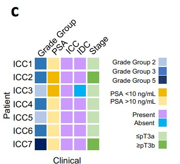
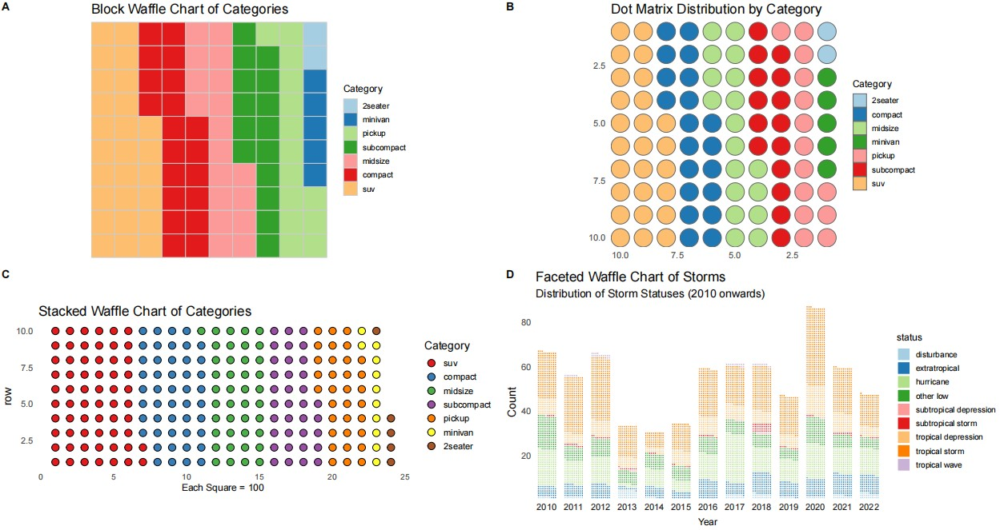

```{r setup, include=FALSE}
knitr::opts_chunk$set(
  collapse = T, echo=T, comment="#>", message=F, warning=F,
	fig.align="center", fig.width=5, fig.height=3, dpi=150)
```


The Waffle Chart plot scripts is referenced from MicrobiomeStatPlot [Inerst Reference below].

If you use this script, please cited 如果你使用本代码，请引用：

**Yong-Xin Liu**, Lei Chen, Tengfei Ma, Xiaofang Li, Maosheng Zheng, Xin Zhou, Liang Chen, Xubo Qian, Jiao Xi, Hongye Lu, Huiluo Cao, Xiaoya Ma, Bian Bian, Pengfan Zhang, Jiqiu Wu, Ren-You Gan, Baolei Jia, Linyang Sun, Zhicheng Ju, Yunyun Gao, **Tao Wen**, **Tong Chen**. 2023. EasyAmplicon: An easy-to-use, open-source, reproducible, and community-based pipeline for amplicon data analysis in microbiome research. **iMeta** 2(1): e83. https://doi.org/10.1002/imt2.83

The online version of this tuturial can be found in https://github.com/YongxinLiu/MicrobiomeStatPlot


**Authors**
First draft(初稿)：Defeng Bai(白德凤)；Proofreading(校对)：Ma Chuang(马闯) and Xun Jiani(荀佳妮)；Text tutorial(文字教程)：Defeng Bai(白德凤)


# Introduction简介

华夫饼图(waffle chart)

参考：https://mp.weixin.qq.com/s/9zW4EupcGSNoDH_vy23fPw
https://mp.weixin.qq.com/s/0iztINEslPhhIyDXbh_I3w

华夫饼图(waffle chart)分为块状华夫饼图和点状华夫饼图。它是展示总数据的组类别情况的一种有效图表。它是西方的一种由小方格组成的面包，所以这种图表因此得名为华夫饼图。

Waffle charts are divided into block waffle charts and dot waffle charts. It is an effective chart for showing the group category of total data. It is a kind of bread made up of small squares in the West, so this chart is named waffle chart.


关键字：微生物组数据分析、MicrobiomeStatPlot、华夫饼图、R语言可视化

Keywords: Microbiome analysis, MicrobiomeStatPlot, Waffle chartt, R visulization


## Waffle chart example 华夫饼图案例

这是来自于范德堡大学医学中心Paula J. Hurley课题组2022年发表于Nature Communications上的一篇论文。论文题目为：Single cell analysis of cribriform prostate cancer reveals cell intrinsic and tumor microenvironmental pathways of aggressive disease. https://doi.org/10.1038/s41467-022-33780-1

This is a paper from Paula J. Hurley's group at Vanderbilt University Medical Center published in Nature Communications in 2022. The title of the paper is: Single cell analysis of cribriform prostate cancer reveals cell intrinsic and tumor microenvironmental pathways of aggressive disease. https://doi.org/10.1038/s41467-022-33780-1




Fig. 1 c Patient clinical characteristics.
图 1c 患者临床特征。


**结果**

Overall, patients had Grade Group 2-5 prostate cancer that was either stage pT3aN0/X or pT3bN0 (Fig. 1c and Supplementary Table 1).
总体而言，患者患有 2-5 级前列腺癌，即 pT3aN0/X 期或 pT3bN0 期（图 1c 和补充表 1）。


## Packages installation软件包安装

```{r}
# 基于CRAN安装R包，检测没有则安装
p_list = c("ggplot2", "RColorBrewer", "ggforce", "dplyr", "waffle")
for(p in p_list){if (!requireNamespace(p)){install.packages(p)}
    library(p, character.only = TRUE, quietly = TRUE, warn.conflicts = FALSE)}

# 加载R包 Load the package
suppressWarnings(suppressMessages(library(ggplot2)))
suppressWarnings(suppressMessages(library(RColorBrewer)))
suppressWarnings(suppressMessages(library(ggforce)))
suppressWarnings(suppressMessages(library(dplyr)))
suppressWarnings(suppressMessages(library(waffle)))
```


# Waffle chart 华夫饼图

## Waffle chart using R software 华夫饼图R语言实战

```{r waffle chart, include=TRUE}
# 1. Block Waffle Chart 块状华夫饼图
# Data Preparation
nrows <- 10
category_counts <- round(table(mpg$class) * (nrows * nrows / length(mpg$class)))
sorted_counts <- sort(category_counts)
categories <- names(sorted_counts)
df <- expand.grid(row = 1:nrows, column = 1:nrows)
df$category <- factor(rep(categories, sorted_counts), levels = categories)

# Color Palette
colors <- brewer.pal(length(sorted_counts), "Paired")

# Plot
block_waffle_plot <- ggplot(df, aes(x = column, y = row, fill = category)) +
  geom_tile(color = "grey80", size = 0.1) +
  scale_fill_manual(values = colors, name = "Category") +
  coord_fixed(ratio = 1) +
  scale_x_reverse(expand = c(0, 0)) +
  scale_y_reverse(expand = c(0, 0)) +
  labs(title = "Block Waffle Chart of Categories") +
  theme_minimal(base_size = 14) +
  theme(
    panel.grid = element_blank(),
    axis.text = element_blank(),
    axis.title = element_blank(),
    axis.ticks = element_blank(),
    legend.position = "right",
    legend.title = element_text(size = 12),
    legend.text = element_text(size = 10)
  )

# Save Plot
# ggsave("block_waffle_chart.png", plot = block_waffle_plot, width = 8, height = 8, dpi = 300)
ggsave("results/block_waffle_chart.pdf", plot = block_waffle_plot, width = 8, height = 8)


#2.Dot Waffle Chart 点状华夫饼图
# Data Preparation
df$category <- factor(rep(categories, sorted_counts))

# Plot
dot_waffle_plot <- ggplot(df, aes(x0 = column, y0 = row, fill = category, r = 0.4)) +
  geom_circle(color = "grey40", size = 0.2) +
  scale_fill_manual(values = colors, name = "Category") +
  coord_fixed(ratio = 1) +
  scale_x_reverse(expand = c(0, 0)) +
  scale_y_reverse(expand = c(0, 0)) +
  labs(title = "Dot Matrix Distribution by Category") +
  theme_minimal(base_size = 14) +
  theme(
    panel.grid = element_blank(),
    legend.position = "right",
    legend.title = element_text(size = 12),
    legend.text = element_text(size = 10)
  )

# Save Plot
#ggsave("dot_waffle_chart.png", plot = dot_waffle_plot, width = 8, height = 8, dpi = 300)
ggsave("results/dot_waffle_chart.pdf", plot = dot_waffle_plot, width = 8, height = 8)


#3. Stacked Waffle Chart 堆积华夫饼图
# Data Preparation
unit_size <- 100
category_data <- as.data.frame(table(mpg$class) * (nrows * nrows))
colnames(category_data) <- c("category", "count")
category_data <- arrange(category_data, desc(count))
category_data$count <- category_data$count / unit_size

# Expanded Data for Plotting
expanded_data <- expand.grid(row = 1:10, column = seq_len(ceiling(sum(category_data$count) / 10)))
category_vector <- rep(category_data$category, category_data$count)
expanded_data <- expanded_data[1:length(category_vector), ]
expanded_data$category <- factor(category_vector, levels = category_data$category)

# Color Palette
colors <- brewer.pal(nrow(category_data), "Set1")

# Plot
stacked_waffle_plot <- ggplot(expanded_data, aes(x = column, y = row, fill = category)) +
  geom_point(color = "black", shape = 21, size = 4) +
  scale_fill_manual(values = colors, name = "Category") +
  coord_fixed(ratio = 1) +
  labs(title = "Stacked Waffle Chart of Categories", x = "Each Square = 100") +
  theme_minimal(base_size = 14) +
  theme(
    panel.grid = element_blank(),
    axis.text.x = element_text(size = 10),
    axis.title.x = element_text(size = 12),
    legend.position = "right"
  )

# Save Plot
#ggsave("stacked_waffle_chart.png", plot = stacked_waffle_plot, width = 8, height = 8, dpi = 300)
ggsave("results/stacked_waffle_chart.pdf", plot = stacked_waffle_plot, width = 8, height = 8)


#4. Faceted Waffle Chart 分面华夫饼图
# Data Preparation
storms_summary <- storms %>%
  filter(year >= 2010) %>%
  count(year, status)

# Plot
faceted_waffle_plot <- ggplot(storms_summary, aes(fill = status, values = n)) +
  geom_waffle(color = "white", size = 0.3, n_rows = 10, flip = TRUE) +
  facet_wrap(~ year, nrow = 1, strip.position = "bottom") +
  scale_fill_brewer(palette = "Paired") +
  scale_x_discrete() +
  scale_y_continuous(labels = scales::label_number(scale = 1), expand = c(0, 0)) +
  labs(
    title = "Faceted Waffle Chart of Storms",
    subtitle = "Distribution of Storm Statuses (2010 onwards)",
    x = "Year",
    y = "Count"
  ) +
  theme_minimal(base_size = 14) +
  theme(
    panel.grid = element_blank(),
    axis.text.x = element_text(size = 10),
    axis.title.x = element_text(size = 12),
    legend.position = "right",
    legend.title = element_text(size = 12),
    legend.text = element_text(size = 10)
  )

# Save Plot
#ggsave("faceted_waffle_chart.png", plot = faceted_waffle_plot, width = 12, height = 6, dpi = 300)
ggsave("results/faceted_waffle_chart.pdf", plot = faceted_waffle_plot, width = 12, height = 6)
```


# Combo plots排版

Combo plots to published-ready figure

组合多个子图为发表格式

```{r waffle_combo, fig.show='asis', fig.width=8, fig.height=7.5, dpi=72}
library(cowplot)
width = 89
height = 59
p0 = plot_grid(block_waffle_plot, dot_waffle_plot, stacked_waffle_plot, faceted_waffle_plot, labels = c("A", "B", "C", "D"), ncol = 2)
ggsave("results/Waffle_plot.pdf", p0, width = width * 5, height = height * 4, units = "mm")
```





If used this script, please cited:
使用此脚本，请引用下文：

**Yong-Xin Liu**, Lei Chen, Tengfei Ma, Xiaofang Li, Maosheng Zheng, Xin Zhou, Liang Chen, Xubo Qian, Jiao Xi, Hongye Lu, Huiluo Cao, Xiaoya Ma, Bian Bian, Pengfan Zhang, Jiqiu Wu, Ren-You Gan, Baolei Jia, Linyang Sun, Zhicheng Ju, Yunyun Gao, **Tao Wen**, **Tong Chen**. 2023. EasyAmplicon: An easy-to-use, open-source, reproducible, and community-based pipeline for amplicon data analysis in microbiome research. **iMeta** 2: e83. https://doi.org/10.1002/imt2.83

Copyright 2016-2024 Defeng Bai <baidefeng@caas.cn>, Chuang Ma <22720765@stu.ahau.edu.cn>, Jiani Xun <15231572937@163.com>, Yong-Xin Liu <liuyongxin@caas.cn>
