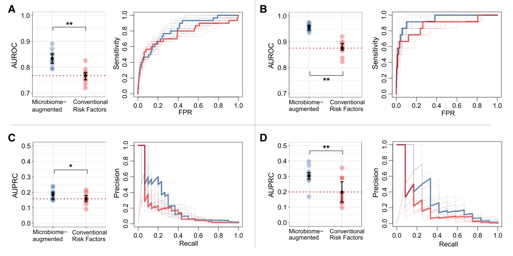

```{r setup, include=FALSE}
knitr::opts_chunk$set(
  collapse = T, echo=T, comment="#>", message=F, warning=F,
	fig.align="center", fig.width=5, fig.height=3, dpi=150)
```


The XGBoost Classifier scripts is referenced from MicrobiomeStatPlot [Inerst Reference below].

If you use this script, please cited 如果你使用本代码，请引用：

**Yong-Xin Liu**, Lei Chen, Tengfei Ma, Xiaofang Li, Maosheng Zheng, Xin Zhou, Liang Chen, Xubo Qian, Jiao Xi, Hongye Lu, Huiluo Cao, Xiaoya Ma, Bian Bian, Pengfan Zhang, Jiqiu Wu, Ren-You Gan, Baolei Jia, Linyang Sun, Zhicheng Ju, Yunyun Gao, **Tao Wen**, **Tong Chen**. 2023. EasyAmplicon: An easy-to-use, open-source, reproducible, and community-based pipeline for amplicon data analysis in microbiome research. **iMeta** 2(1): e83. https://doi.org/10.1002/imt2.83

The online version of this tuturial can be found in https://github.com/YongxinLiu/MicrobiomeStatPlot


**Authors**
First draft(初稿)：Defeng Bai(白德凤)；Proofreading(校对)：Ma Chuang(马闯) and Xun Jiani(荀佳妮)；Text tutorial(文字教程)：Defeng Bai(白德凤)


# Introduction简介

XGBoost is short for eXtreme Gradient Boosting package.
XGBoost 是 eXtreme Gradient Boosting 的缩写。

It is an efficient and scalable implementation of gradient boosting framework by J. Friedman et al. (2000) and J. H. Friedman (2001). Two solvers are included:
它是 J. Friedman 等人（2000 年）和 J. H. Friedman（2001 年）提出的梯度提升框架的高效且可扩展的实现。其中包括两个求解器：

-linear model ; 线性模型
-tree learning algorithm. 树学习算法
It supports various objective functions, including regression, classification and ranking. The package is made to be extendible, so that users are also allowed to define their own objective functions easily.
它支持各种目标函数，包括回归、分类和排序。该软件包具有可扩展性，因此用户也可以轻松定义自己的目标函数。

It has been used to win several Kaggle competitions.
它已被用于赢得多次 Kaggle 比赛。

It has several features:
它有几个特点：

Speed: it can automatically do parallel computation on Windows and Linux, with OpenMP. It is generally over 10 times faster than the classical gbm.
Input Type: it takes several types of input data:
Dense Matrix: R’s dense matrix, i.e. matrix ;
Sparse Matrix: R’s sparse matrix, i.e. Matrix::dgCMatrix ;
Data File: local data files ;
xgb.DMatrix: its own class (recommended).
Sparsity: it accepts sparse input for both tree booster and linear booster, and is optimized for sparse input ;
Customization: it supports customized objective functions and evaluation functions.

速度：它可以在 Windows 和 Linux 上自动进行并行计算，使用 OpenMP。它通常比经典的 gbm 快 10 倍以上。
输入类型：它接受几种类型的输入数据：
密集矩阵：R 的密集矩阵，即矩阵；
稀疏矩阵：R 的稀疏矩阵，即 Matrix::dgCMatrix；
数据文件：本地数据文件；
xgb.DMatrix：它自己的类（推荐）。
稀疏性：它接受树增强器和线性增强器的稀疏输入，并针对稀疏输入进行了优化；
自定义：它支持自定义目标函数和评估函数。


关键字：微生物组数据分析、MicrobiomeStatPlot、极致梯度提升分类模型、R语言可视化

Keywords: Microbiome analysis, MicrobiomeStatPlot, XGBoost Classifier , R visulization


## 极致梯度提升分类模型案例 XGBoost Classifier Example

这是来自于澳大利亚贝克心脏与糖尿病研究所Michael Inouye研究组2022年发表于Cell Metabolism上的一篇论文。论文的题目为：Early prediction of incident liver disease using conventional risk factors and gut-microbiome-augmented gradient boosting. https://doi.org/10.1016/j.cmet.2022.03.002

This is a paper from Michael Inouye's research group at the Baker Heart and Diabetes Institute in Australia published in Cell Metabolism in 2022. The title of the paper is: Early prediction of incident liver disease using conventional risk factors and gut-microbiome-augmented gradient boosting. https://doi.org/10.1016/j.cmet.2022.03.002




Figure 3. Models of conventional risk factors and gut microbiome data improved the prediction of incident liver disease over conventional prediction models
图 3. 传统风险因素和肠道微生物组数据模型比传统预测模型更能提高对肝病发病率的预测

(A and B) Area under the ROC curve (AUROC) for gradient boosting models using species-level gut microbiome data together with conventional risk factors (blue) or a conventional risk factor model (red), predicting (A) incident any liver disease or (B) alcoholic liver disease. (C and D) Area under the precision-recall curve (AUPRC) for (C) any liver disease and (D) alcoholic liver disease. Error bars represent mean and IQR. Difference in performance between the microbiome-augmented model and the conventional risk factor model was tested using one-sided Wilcoxon-signed rank test. *p < 0.05; **p < 0.01. Horizontal dashed lines mark the mean performance of conventional model as a reference. The bolded ROC and precision-recall curves correspond to models with AUROC and AUPRC that are closest to the mean performance reference.

(A 和 B) 使用物种水平肠道微生物组数据以及传统风险因素（蓝色）或传统风险因素模型（红色）的梯度增强模型的 ROC 曲线下面积 (AUROC)，预测 (A) 任何肝病的发生率或 (B) 酒精性肝病。 (C 和 D) (C) 任何肝病和 (D) 酒精性肝病的精确召回曲线下面积 (AUPRC)。误差线代表平均值和 IQR。使用单侧 Wilcoxon 符号秩检验测试微生物组增强模型和传统风险因素模型之间的性能差异。 *p < 0.05; **p < 0.01。水平虚线标记传统模型的平均性能作为参考。加粗的 ROC 和精确召回曲线对应于 AUROC 和 AUPRC 最接近平均性能参考的模型。


**结果**

Integrating gut microbiome and conventional risk factors
整合肠道微生物组和传统风险因素

Overall, the prediction performance of the microbiomeaugmented models achieved greater AUROC and AUPRC compared with that of the conventional prediction models (Wilcoxon p < 0.05). Prediction of LD (Figure 3A) using the species-level augmented model yielded an average AUROC of 0.834 (0.815–0.852), an AUROC increase of 0.066 over the conventional risk factor model (as above, average AUROC 0.768). For ALD, the species-level augmented model yielded an average AUROC of 0.956 (0.945–0.964), an AUROC increase of 0.081 over the conventional risk factor model (as above, average AUROC 0.875) (Figure 3B).
总体而言，与传统预测模型相比，微生物增强模型的预测性能实现了更高的 AUROC 和 AUPRC（Wilcoxon p < 0.05）。使用物种级增强模型预测 LD（图 3A）得出的平均 AUROC 为 0.834（0.815–0.852），比传统风险因素模型（如上，平均 AUROC 0.768）增加了 0.066。对于 ALD，物种级增强模型得出的平均 AUROC 为 0.956（0.945–0.964），比传统风险因素模型（如上，平均 AUROC 0.875）增加了 0.081（图 3B）。

With a baseline AUPRC value of 0.015 for LD, the species-level augmented model achieved an average AUPRC of 0.185 (0.156– 0.202), which was higher (Wilcoxon p < 0.05) than the average AUPRC of 0.158 (0.141–0.179) yielded by the conventional risk factor model (Figure 3C). For ALD with a baseline AUPRC of 0.006, the species-level augmented model yielded a significantly greater AUPRC than the conventional risk factor model (Wilcoxon p < 0.01; Figure 3D), with average AUPRCs of 0.304 (0.283–0.326) and 0.199 (0.133–0.265), respectively.
对于 LD，基线 AUPRC 值为 0.015，物种级增强模型实现了 0.185（0.156– 0.202）的平均 AUPRC，高于（Wilcoxon p < 0.05）传统风险因素模型得出的平均 AUPRC 0.158（0.141–0.179）（图 3C）。对于基线 AUPRC 为 0.006 的 ALD，物种级增强模型得出的 AUPRC 显著高于传统风险因素模型（Wilcoxon p < 0.01；图 3D），平均 AUPRC 分别为 0.304（0.283–0.326）和 0.199（0.133–0.265）。


## Packages installation软件包安装

```{r}
# 基于CRAN安装R包，检测没有则安装
p_list = c("xgboost", "tidyverse", "data.table", "Matrix", "skimr",
           "DataExplorer", "GGally", "caret", "pROC", "dplyr", "ggplot2",
           "ggpubr", "ggprism", "rms", "vip")
for(p in p_list){if (!requireNamespace(p)){install.packages(p)}
    library(p, character.only = TRUE, quietly = TRUE, warn.conflicts = FALSE)}

# 加载R包 Load the package
suppressWarnings(suppressMessages(library(xgboost)))
suppressWarnings(suppressMessages(library(tidyverse)))
suppressWarnings(suppressMessages(library(data.table)))
suppressWarnings(suppressMessages(library(Matrix)))
suppressWarnings(suppressMessages(library(skimr)))
suppressWarnings(suppressMessages(library(DataExplorer)))
suppressWarnings(suppressMessages(library(GGally)))
suppressWarnings(suppressMessages(library(caret)))
suppressWarnings(suppressMessages(library(pROC)))
suppressWarnings(suppressMessages(library(dplyr)))
suppressWarnings(suppressMessages(library(ggplot2)))
suppressWarnings(suppressMessages(library(ggpubr)))
suppressWarnings(suppressMessages(library(ggprism)))
suppressWarnings(suppressMessages(library(rms)))
suppressWarnings(suppressMessages(library(vip)))
```


# XGBoost Classifier Tutorial 极致梯度提升分类模型

## XGBoost Classifier Using R Software XGBoost在R语言中的实现

参考：https://mp.weixin.qq.com/s/I34u7D2dW0wLyrNx_UJIhQ


```{r XGBoost Classifier, echo=TRUE}
# 加载数据 Load data
library(survival)
#data(package="survival")
data1 <- colon

# 变量筛选
data2 <- select(data1,3:14)

# 剔除缺失样本
data_d <- na.omit(data2)

# 分类变量因子化
for (i in c(2,4:6,9:12)) {  
  data_d[,i] <- factor(data_d[,i])
  }
data_d$status <- as.factor(data_d$status)
data <- data_d

# 构建XGBoost模型
set.seed(123)
# 按照7：3分成训练集和验证集
train_index <- createDataPartition(y=data$status,p=0.7,list=F)
# 训练集
train_data <- data[train_index, ]
# 验证集
val_data <- data[-train_index,]

# 定义训练集特征，分类变量转换为哑变量，构建稀疏矩阵
train_x <-  sparse.model.matrix(status ~ ., data = train_data)[,-8]
# 定义训练集因变量，标签转换为数值向量，xgboost默认类别标签从0开始，减去1
train_y <-  as.numeric(train_data$status)-1
# 使用xgb.DMatrix函数将特征和目标变量转换为DMatrix矩阵格式
# dtrain 包含了训练集的特征矩阵和对应的标签，是xgboost 训练过程中所需的输入数据结构
dtrain <- xgb.DMatrix(data = train_x, label = train_y)

# 训练集构建XGBoost初始模型
params0 <- list(objective = "binary:logistic",                 
                booster="gbtree",                
                eval_metric = "logloss",                 
                eta = 0.3,                 
                gamma=0,                
                max_depth = 6,                
                min_child_weight = 1,                 
                subsample = 1,                 
                colsample_bytree = 1)

# 训练XGBoost初始模型
set.seed(123)
xgb_model0 <- xgb.train(data=dtrain,                        
                        params = params0,                        
                        nrounds = 100,#迭代轮数（树的数量）                        
                        verbose = 1)
# 查看模型
# xgb_model0 

# 训练集初始模型评估
# 训练集预测概率
predict_initial <- predict(xgb_model0,newdata =dtrain)
range(predict_initial)
# XGBoost使用label向量构建回归模型，预测结果是概率。
# 果特定数据的概率 > 0.5，则观察被分类为 1，否则为 0，也可以当作超参数调整
predict_initial <- ifelse(predict_initial > 0.5,1,0)
# 快速计算准确率
acc_initial <- mean(predict_initial == train_y)
#acc_initial 
#print(paste("训练集准确率:", acc_initial ))
# 输出初始模型整体评价指标：混淆矩阵
train_matrix0 <- confusionMatrix(as.factor(predict_initial),                
                                 train_data$status)
#train_matrix0 

# 调整参数
set.seed(123)
xgb_model_cv <- xgb.cv(data=dtrain,                       
                       objective="binary:logistic",                       
                       booster="gbtree",                      
                       eval_metric = "logloss",                        
                       eta=0.3,                       
                       max_depth=6,                       
                       min_child_weight=1,                       
                       gamma=0,                       
                       subsample=1,                       
                       colsample_bytree=1,                       
                       scale_pos_weight=1,#阴性样本总数/阳性样本总数                       
                       nrounds=500,                       
                       nfold=5,                       
                       metrics=list("error","auc"),                       
                       early_stopping_rounds=50)
# 确定最佳迭代次数

# 拟合模型
set.seed(123)
xgb_model_cv.bst <- xgb.train(data=dtrain,                              
                              objective="binary:logistic",                              
                              booster="gbtree",                              
                              eval_metric = "logloss",                               
                              eta=0.3,                              
                              max_depth=6,                              
                              min_child_weight=1,                              
                              gamma=0,                              
                              subsample=1,                              
                              colsample_bytree=1,                              
                              scale_pos_weight=1,#阴性样本总数/阳性样本总数                              
                              nrounds=238)
#输出最终模型
print(xgb_model_cv.bst)

#模型准确率快速计算
predict_cv.bst <- predict(xgb_model_cv.bst,,newdata =dtrain)
cv.fit <- ifelse(predict_cv.bst > 0.5,1,0)
acc_cv <- mean(cv.fit == train_y)
#acc_cv

# 使用caret包调整参数
# 设定trainControl参数，该对象能保存使用方法以训练调优参数
caret.Control <- trainControl(method = "adaptive_cv",   
                              # 交叉验证                             
                              number = 4,     
                              # 10折交叉验证                             
                              repeats=4,                             
                              verboseIter = FALSE,                             
                              returnData = FALSE,                             
                              selectionFunction="best",                             
                              returnResamp = "final",                             
                              search = "grid",                             
                              seeds=set.seed(123))
# 缩短计算时间采用自适应重采样（Adaptive Resampling）

# 设置参数
# 创建需要考察的参数
caret.grid <- expand.grid(nrounds = c(200,300), # 迭代轮数（nrounds）                          
                          max_depth = c(5,6), # 最大树深度（max_depth）                          
                          eta = c(0.1, 0.3), # 学习率（eta）                          
                          gamma = c(0.1,0.5), # 树分裂所需的最小损失减少值                          
                          colsample_bytree = c(0.8,1), # 特征子采样比例（colsample_bytree）                          
                          min_child_weight = c(1,3), # 叶子节点的最小权重和（min_child_weight）                          
                          subsample = c(0.8,1)) # 和样本子采样比例（subsample）

# 使用train()函数进行参数调优
library(plyr)
library(dplyr)
set.seed(123)
xgb_model_caret <- train(status~.,data = train_data,                    
                         method = "xgbTree",                    
                         trControl = caret.Control,                    
                         tuneGrid = caret.grid,                    
                         verbose=FALSE,                    
                         verbosity=0#消除xgboost警告                    
                         )
# 耗时较长
# 输出最优超参数
print(xgb_model_caret$bestTune)

# 设置最佳XGBoost参数
params.caret.bst <- list(objective = "binary:logistic",                
                         booster = "gbtree",                
                         eval_metric = "logloss",                
                         max_depth = 6,                
                         eta = 0.1,                
                         gamma = 0,                
                         colsample_bytree = 1,                
                         min_child_weight = 1,                
                         subsample = 0.8)

# 拟合模型
set.seed(123)
xgb_model_caret.bst <- xgb.train(data=dtrain,                        
                                 params = params.caret.bst,                         
                                 nrounds = 500)
# 输出最终模型
# print(xgb_model_caret.bst)

# 模型准确率快速计算
predict_caret <- predict(xgb_model_caret.bst,,newdata =dtrain)
caret.fit <- ifelse(predict_caret > 0.5,1,0)
acc_caret <- mean(caret.fit == train_y)
acc_caret

# 特征重要性排序/变量重要性
importance <- xgb.importance(feature_names = colnames(dtrain),                              
                             model = xgb_model_caret.bst)
# head(importance)

# 普通可视化
xgb.plot.importance(importance_matrix = importance,measure = "Cover")

# ggplot可视化排名前10变量
xgb.ggplot.importance(importance_matrix = importance,                      
                      top_n = 10)

# 查看模型中树的信息
xgb.plot.tree(model = xgb_model_caret.bst,              
              trees = 0
              # 显示模型中的第1棵              
              )

# 多棵树展示在一起
xgb.plot.multi.trees(model =  xgb_model_caret.bst,                     
                     features_keep = 2,                     
                     fill=TRUE)
# 这幅图就是把上面那张图的信息整合到了一起

# 查看树的深度来检查树的结构
xgb.plot.deepness(model = xgb_model_caret.bst)

# 训练集模型预测：混淆矩阵和ROC曲线
# 训练集预测概率
predict_train <- predict(xgb_model_caret.bst, newdata = dtrain)
predict_train <- as.factor(ifelse(predict_train >0.5,1,0))

#训练集预测结果
matrix_train <- table(train_data$status,predict_train)

#训练集混淆矩阵
confusionMatrix_train <- confusionMatrix(data = predict_train,                                         
                                         reference = train_data$status,                                         
                                         positive = "1",  
                                         mode="everything")

#输出训练集模型评价指标：准确率(accuracy),精确率(precision),召回率(recall),F1值
print(confusionMatrix_train)

# 绘制混淆矩阵
# 混淆矩阵转换为数据框
confusion_matrix_df2 <- as.data.frame.matrix(confusionMatrix_train$table)
colnames(confusion_matrix_df2) <- c("sensoring","terminal event")
rownames(confusion_matrix_df2) <- c("sensoring","terminal event")
draw_data2 <- round(confusion_matrix_df2 / rowSums(confusion_matrix_df2),2)
draw_data2$real <- rownames(draw_data2)
draw_data2 <- melt(draw_data2)

#绘制训练集混淆矩阵热图
ggplot(draw_data2, aes(real,variable, fill = value)) +  
  geom_tile() +  
  geom_text(aes(label = scales::percent(value))) +  
  scale_fill_gradient(low = "#ECA9B0", high = "#81D8D0") +  
  labs(x = "True", y = "Predicted", title = "Confusion matrix of train set") +  
  theme_prism(border = T)+  theme(panel.border = element_blank(),        
                                  axis.ticks.y = element_blank(),        
                                  axis.ticks.x = element_blank(),        
                                  legend.position="none")


# 绘制训练集ROC曲线
# 训练集预测概率
train_predprob <- predict(xgb_model_caret.bst,newdata = dtrain,type="prob")
# AUC
train_roc <- roc(response = train_data$status, predictor = train_predprob)
train_roc
# 截断值
train_roc_best=coords(train_roc, "best",best.method = c("youden"),                       
                      ret=c("threshold","sensitivity", "specificity"))
train_roc_best
# 计算训练集ROC曲线的参数
train_roc_obj <- train_roc 
train_roc_auc <- auc(train_roc_obj)
# 将ROC对象转换为数据框
train_roc_data <- data.frame(1-train_roc_obj$specificities, train_roc_obj$sensitivities)
# 绘制ROC曲线
plot(train_roc,     
     print.auc=TRUE,     
     auc.polygon=TRUE,     
     grid=T,     
     max.auc.polygon=T,     
     auc.polygon.col="skyblue",     
     print.thres=T,     
     legacy.axes=T,     
     bty="l")

# ggplot2包美化ROC
ggplot(train_roc_data, aes(x = 1-train_roc_obj$specificities, 
                           y = train_roc_obj$sensitivities)) +  
  geom_line(color = "#2089CB", size = 1) +  
  geom_text(aes(x = 0.75, y = 0.25, label = paste("AUC =", round(train_roc_auc, 2))), size = 8, color = "#345D82") +  
  geom_text(aes(x = 0.35, y = 0.85, label = paste("Cutoff =", round(train_roc_best[,1], 2))), size = 6, color = "#D2431C") +  
  coord_cartesian(xlim = c(0, 1), ylim = c(0, 1)) +  
  theme_pubr() +  
  labs(x = "1-Specificity", y = "Sensitivity") +  
  ggtitle("ROC Curve of train set") +  
  theme(plot.title = element_text(hjust = 0.5, face = "bold"))+  
  geom_segment(aes(x = 0, y = 0, xend = 1, yend = 1),color="#5d6174",linetype="dashed") +  
  theme_prism(border = T)+  
  geom_point(x= 1-train_roc_best$specificity ,y=train_roc_best$sensitivity,color="#D2431C",size=3)+  
  theme(axis.text = element_text (size = 10))+  
  theme(axis.title.x=element_text(vjust=2, size=15,face = "plain"))+  
  theme(axis.title.y=element_text(vjust=2, size=15,face = "plain"))


# 绘制训练集校准曲线
# 使用rms包中的val.prob()函数
train_cv <- val.prob(train_predprob,                     
                     as.numeric(train_data$status)-1,                               
                     logistic.cal = FALSE,                               
                     statloc = F,                               
                     riskdist = c("predicted","calibrated"),                     
                     legendloc = c(0.8,0.25))
title(main = "calibration curve of train")

# 使用predtools包
# install.packages("predtools")
library(predtools)

# 模型对训练集的预测概率写入训练集
train_data$P.pred<-train_predprob 
# 因变量需要是0/1型的数值型
train_data$obs<- as.numeric(train_data$status)-1
calibration_plot(data=train_data,                 
                 obs="obs",                 
                 pred="P.pred",                 
                 title="Calibration Curves for Trainset",                 
                 x_lim=c(0,1),                 
                 y_lim=c(0,1),                 
                 xlab="Prediction Probability",                 
                 ylab="Observation Probability") 

# 使用probably包
library(probably)
library(dplyr)
train_data2<-mutate(train_data,.pred_1=P.pred) 
cal_plot_breaks(train_data2,                
                truth=obs,                
                estimate=.pred_1,                
                num_breaks=10,conf_level=0.95,event_level="auto") #训练集校准曲线


# 决策曲线
# 使用rmda包
library(rmda)
DCA_train<-decision_curve(obs~P.pred,                           
                          data=train_data,                          
                          policy='opt-in',                           
                          fitted.risk=TRUE,                           
                          thresholds=seq(0,1,by= 0.01))

plot_decision_curve(DCA_train,                    
                    curve.names='DCA.trainset',                    
                    standardize=FALSE,                    
                    confidence.intervals=FALSE,                    
                    col='blue')

# 使用dcruves包
library(dcurves)
dca(obs~P.pred, data=train_data,thresholds=seq(0,1,by= 0.1))%>% 
  plot(smooth = TRUE,loess.span=0.1)


# 应用于验证集
val_x <-  sparse.model.matrix(status ~ ., data = val_data)[,-8]
val_y <-  as.numeric(val_data$status)-1
dval <- xgb.DMatrix(data = val_x, label = val_y)

# 使用最终模型预测验证集
# 验证集预测概率
predict_val <- predict(xgb_model_caret.bst,newdata = dval)
predict_val <- as.factor(ifelse(predict_val >0.5,1,0))

# 验证集预测结果
matrix_val <- table(val_data$status,predict_val)

# 验证集混淆矩阵
confusionMatrix_val <- confusionMatrix(data = predict_val,                                       
                                       reference = val_data$status,                                       
                                       positive = "1",                                       
                                       mode = "everything")
print(confusionMatrix_val)

# 绘制验证集混淆矩阵
# 混淆矩阵转换为数据框
confusion_matrix_df3 <- as.data.frame.matrix(confusionMatrix_val$table)
colnames(confusion_matrix_df3) <- c("sensoring","terminal event")
rownames(confusion_matrix_df3) <- c("sensoring","terminal event")
draw_data3 <- round(confusion_matrix_df3 / rowSums(confusion_matrix_df3),2)
draw_data3$real <- rownames(draw_data3)
draw_data3 <- melt(draw_data3)

# 绘制验证集混淆矩阵热图
ggplot(draw_data3, aes(real,variable, fill = value)) +  
  geom_tile() +  
  geom_text(aes(label = scales::percent(value))) +  
  scale_fill_gradient(low = "#ECA9B0", high = "#81D8D0") +  
  labs(x = "True", y = "Predicted", title = "Confusion matrix of valid set") +  
  theme_prism(border = T)+  theme(panel.border = element_blank(),        
                                  axis.ticks.y = element_blank(),        
                                  axis.ticks.x = element_blank(),        
                                  legend.position="none")

# 绘制验证集ROC曲线
# 验证集预测概率
val_predprob <- predict(xgb_model_caret.bst,newdata = dval,type="prob")

# AUC
val_roc <- roc(response = val_data$status, predictor = val_predprob)
val_roc

# 截断值
val_roc_best=coords(val_roc, "best",best.method = c("youden"),                     
                    ret=c("threshold","sensitivity", "specificity"))
val_roc_best

# 计算验证集ROC曲线的参数
val_roc_obj <- val_roc 
val_roc_auc <- auc(val_roc_obj)

#将ROC对象转换为数据框
val_roc_data <- data.frame(1-val_roc_obj$specificities, val_roc_obj$sensitivities)

# 绘制验证集ROC曲线#基本ROC曲线
plot(val_roc,     
     print.auc=TRUE,     
     auc.polygon=TRUE,     
     grid=T,#grid=c(0.1, 0.2)     
     max.auc.polygon=T,     
     auc.polygon.col="skyblue",     
     print.thres=T,     
     legacy.axes=T,     
     bty="l",     
     main='ROC curve of valset')

# ggplot2包美化ROC
ggplot(val_roc_data, aes(x = 1-val_roc_obj$specificities, y = val_roc_obj$sensitivities)) +  
  geom_line(color = "#2089CB", size = 1) +  
  geom_text(aes(x = 0.75, y = 0.25, label = paste("AUC =", round(val_roc_auc, 2))), size = 8, color = "#345D82") +  
  geom_text(aes(x = 0.1, y = 0.6, label = paste("Cutoff =", round(val_roc_best[,1], 2))), size = 6, color = "#D2431C") +  
  coord_cartesian(xlim = c(0, 1), ylim = c(0, 1)) +  
  theme_pubr() +  labs(x = "1-Specificity", y = "Sensitivity") +  
  ggtitle("ROC Curve of val set") +  
  theme(plot.title = element_text(hjust = 0.5, face = "bold"))+  
  geom_segment(aes(x = 0, y = 0, xend = 1, yend = 1),color="#5d6174",linetype="dashed") +  
  theme_prism(border = T)+  
  geom_point(x=1-val_roc_best$specificity,y=val_roc_best$sensitivity,color="#D2431C",size=3)+  
  theme(axis.text = element_text (size = 10))+  
  theme(axis.title.x=element_text(vjust=2, size=15,face = "plain"))+  
  theme(axis.title.y=element_text(vjust=2, size=15,face = "plain"))


# AUROC
#roc_species_test2 = roc(outcome_species_test, test_species[,2])
# AUC
val_roc <- roc(response = val_data$status, predictor = val_predprob)
val_roc
#roc_species_test2
# get average value of AUROC and confidence intervals
auc_test = round(val_roc$auc,3)
val_roc_2 <- plot.roc(val_data$status, val_predprob,
                   ci=TRUE, print.auc=TRUE)
ci_low_test = round(val_roc_2$ci[1], 3)
ci_high_test = round(val_roc_2$ci[3], 3)

# calculate 95% confidence intervals
roc.list <- list(roc_species_test2)
ci.list <- lapply(roc.list, ci.se, specificities = seq(0, 1, l = 25))
ciobj02 <- ci.se(roc_species_test2, 
               specificities=seq(0, 1, 0.01)) 

# confidence intervals
ciobj3 <- as.data.frame(ciobj02)
dat.ci.list <- lapply(ci.list, function(ciobj3)
  data.frame(x = as.numeric(rownames(ciobj3)),
             lower = ciobj3[, 1],
             upper = ciobj3[, 3]))

# plot
p1_species_test <- ggroc(roc.list, legacy.axes = TRUE) + 
  theme_bw()+
  theme(panel.background = element_blank(),
        panel.grid.major =element_blank(),
        panel.grid.minor = element_blank(),
        legend.position = "none") + coord_equal() + coord_fixed(ratio = 0.9)+
  geom_abline(slope=1, intercept = 0, linetype = "dashed", alpha=0.5, color = "grey") + 
  #ggtitle("Testing set (n = 234)")+
  #ggtitle("Testing set (n = 158)")+
  ggtitle("Testing set (n = 144)")+
  geom_line(size = 0.8)+labs(x = "1 - Specificity", y = "Sensitivity")+
  annotate("text", x = 0.77, y = 0.18, label = paste0("AUC = ", auc_species_test), size = 3)+
  annotate("text", x = 0.77, y = 0.08, label = paste0("CI = ",  ci_low_species_test, "-", ci_high_sepcies_test), size = 3)+
  scale_color_manual(values=c("#CD3278"))

col.list = list("#CD3278")
# add confidence intervals
for(i in 1:1) {
  p1_species_test <- p1_species_test + geom_ribbon(
    data = dat.ci.list[[i]],
    aes(x = 1-x, ymin = lower, ymax = upper),
    #fill = i + 1,
    fill = col.list[[i]],
    alpha = 0.3,
    inherit.aes = F)
}
#ggsave(paste("results/model_RF/all_selected_32_species_model_auroc_test_set_new",".pdf", sep=""), p3_32_test, width=109 * 1.5, height=60 * 1.5, unit='mm')
p1_species_test

# 训练集与验证集ROC曲线叠加
plot(train_roc,     
     print.auc=TRUE,     
     grid=c(0.1,0.2),     
     print.thres=T,     
     legacy.axes=T,     
     print.auc.y=0.3,     
     main="ROC of XGBoost")

plot(val_roc,     
     print.auc=TRUE,     
     print.auc.y=0.2,     
     print.thres=T,     
     add=T,     
     col="red")

legend("bottomright",       
       legend=c("train","val"),       
       col = c(par("fg"),"red"),       
       lwd=2,       
       cex=0.9)
```


If used this script, please cited:
使用此脚本，请引用下文：

**Yong-Xin Liu**, Lei Chen, Tengfei Ma, Xiaofang Li, Maosheng Zheng, Xin Zhou, Liang Chen, Xubo Qian, Jiao Xi, Hongye Lu, Huiluo Cao, Xiaoya Ma, Bian Bian, Pengfan Zhang, Jiqiu Wu, Ren-You Gan, Baolei Jia, Linyang Sun, Zhicheng Ju, Yunyun Gao, **Tao Wen**, **Tong Chen**. 2023. EasyAmplicon: An easy-to-use, open-source, reproducible, and community-based pipeline for amplicon data analysis in microbiome research. **iMeta** 2: e83. https://doi.org/10.1002/imt2.83

Copyright 2016-2024 Defeng Bai <baidefeng@caas.cn>, Chuang Ma <22720765@stu.ahau.edu.cn>, Jiani Xun <15231572937@163.com>, Yong-Xin Liu <liuyongxin@caas.cn>

