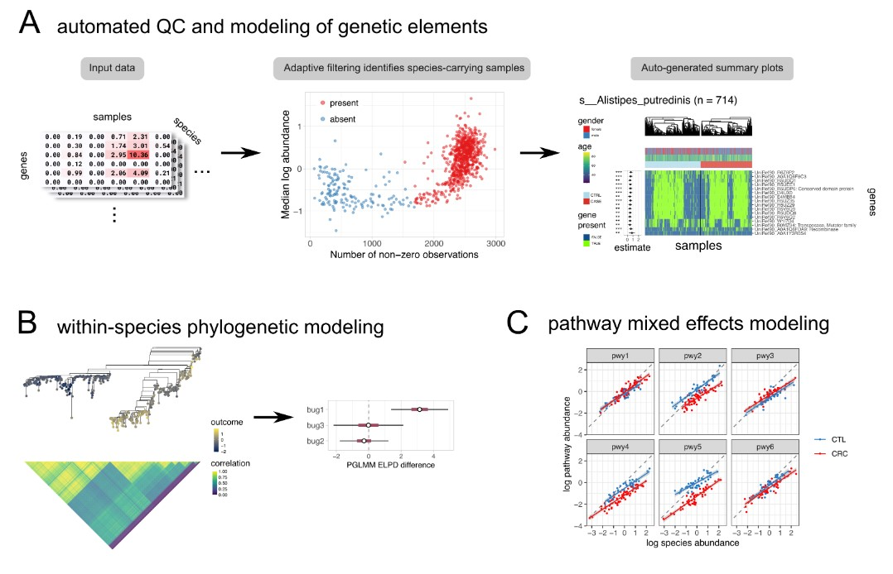
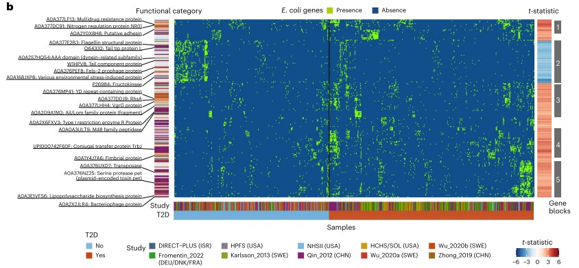
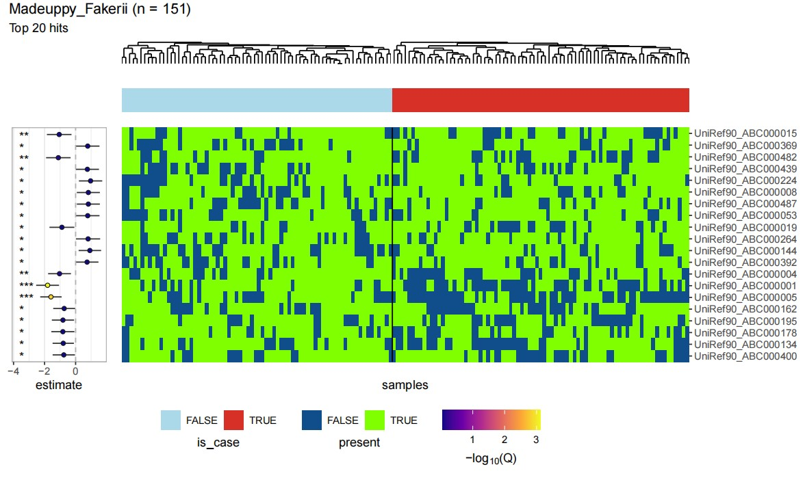
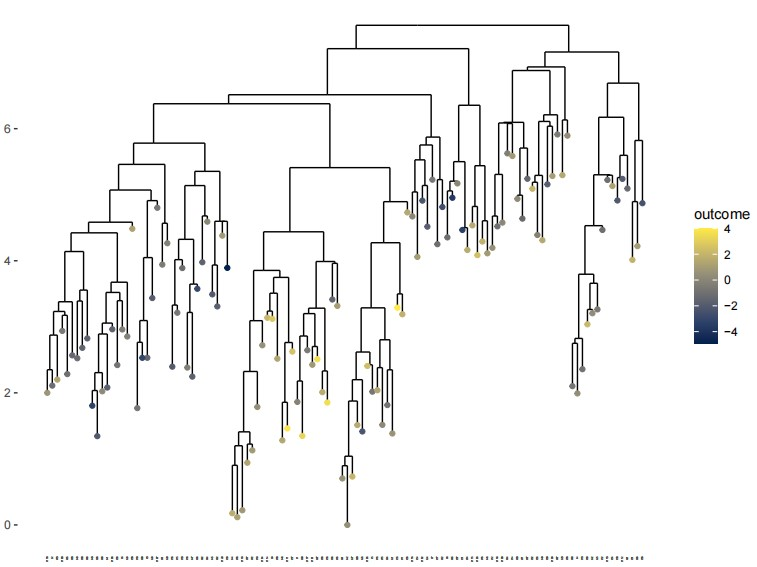

```{r setup, include=FALSE}
knitr::opts_chunk$set(
  collapse = T, echo=T, comment="#>", message=F, warning=F,
	fig.align="center", fig.width=5, fig.height=3, dpi=150)
```


The anpan analysis scripts is referenced from MicrobiomeStatPlot [Inerst Reference below].


If you use this script, please cited 如果你使用本代码，请引用：

**Yong-Xin Liu**, Lei Chen, Tengfei Ma, Xiaofang Li, Maosheng Zheng, Xin Zhou, Liang Chen, Xubo Qian, Jiao Xi, Hongye Lu, Huiluo Cao, Xiaoya Ma, Bian Bian, Pengfan Zhang, Jiqiu Wu, Ren-You Gan, Baolei Jia, Linyang Sun, Zhicheng Ju, Yunyun Gao, **Tao Wen**, **Tong Chen**. 2023. EasyAmplicon: An easy-to-use, open-source, reproducible, and community-based pipeline for amplicon data analysis in microbiome research. **iMeta** 2(1): e83. https://doi.org/10.1002/imt2.83

The online version of this tuturial can be found in https://github.com/YongxinLiu/MicrobiomeStatPlot


**Authors**
First draft(初稿)：Defeng Bai(白德凤)；Proofreading(校对)：Ma Chuang(马闯) and Xun Jiani(荀佳妮)；Text tutorial(文字教程)：Defeng Bai(白德凤)


# Introduction简介

参考：https://huttenhower.sph.harvard.edu/anpan
https://github.com/biobakery/anpan

It's difficult to find associations between microbial strains and host health outcomes due to their fine resolution and non-recurrence across individuals. This package, `anpan`, aims to make inferring those relationships a bit easier by providing an interface to our strain analysis functionality. This functionality covers three main points:

由于微生物菌株的分辨率高且个体间不复发，因此很难发现它们与宿主健康结果之间的关联。此软件包“anpan”旨在通过提供菌株分析功能的接口，使推断这些关系变得更容易一些。此功能涵盖三个要点：

1. Modeling the association between outcome variables and microbial gene presence while accounting for covariates
  1.1 Including adaptive sample filtering of per-bug microbial gene profiles to identify and discard samples in which the bug is poorly covered
  
1.在考虑协变量的同时，对结果变量和微生物基因存在之间的关联进行建模
  1.1 包括对每个细菌的微生物基因谱进行自适应样本过滤，以识别和丢弃细菌覆盖程度较差的样本

2. Modeling the association between outcome variables and the phylogeny of strains within a given microbial species
2. 建立结果变量与给定微生物物种内菌株系统发育之间的关联模型


3. Modeling the difference in microbial pathways between experimental groups while controlling for species abundance.
3. 在控制物种丰富度的同时，对实验组之间的微生物途径差异进行建模。

We'll cover each of these points in a top-level section. There is also an [Advanced topics] section with some additional information on a handful of more complicated diagnostics/methods/techniques.
我们将在顶级部分中介绍这些要点。还有一个 [高级主题] 部分，其中包含一些有关一些更复杂的诊断/方法/技术的附加信息。

The goal of anpan is to consolidate statistical methods for strain analysis. This includes automated filtering of metagenomic functional profiles, testing genetic elements for association with outcomes, within-species phylogenetic modeling, and abundance-adjusted mixed effects models for microbial pathways.

anpan的目标是巩固菌株分析的统计方法。这包括宏基因组功能图谱的自动过滤、测试遗传元素与结果的相关性、物种内系统发育建模以及微生物途径的丰度调整混合效应模型。


图 anpan分析概述 
Figure Overview of anpan analysis


关键字：微生物组数据分析、MicrobiomeStatPlot、微生物菌株和宿主健康状态关系分析、R语言可视化

Keywords: Microbiome analysis, MicrobiomeStatPlot, anpan analysis, R visulization


## anpan analysis example 微生物菌株和宿主健康状态关系分析案例

这是哈佛大学Dong D. Wang和Curtis Huttenhower团队2024年发表于Nature Medicine上的一篇论文。论文题目为：Strain-specific gut microbial signatures in type 2 diabetes identified in a cross-cohort analysis of 8,117 metagenomes. https://doi.org/10.1038/s41591-024-03067-7

This is a paper published in Nature Medicine in 2024 by the team of Dong D. Wang and Curtis Huttenhower of Harvard University. The title of the paper is: Strain-specific gut microbial signatures in type 2 diabetes identified in a cross-cohort analysis of 8,117 metagenomes. https://doi.org/10.1038/s41591-024-03067-7


Fig. 5 b. UniRef90 gene family profiles indicate metagenomically detected strains for E. coli. The heatmap shows the genes significantly associated with T2D, with each column representing a metagenome and each row representing a UniRef90 gene family. The colors indicate the presence (green) or absence (blue) of a UniRef90 gene family in a metagenome. The heatmap on the right-hand side presents the t-statistic of an association between a UniRef90 gene family and T2D derived from the gene association model in anpan. The red color signifies gene families enriched in T2D, while the blue color indicates gene families that are depleted in T2D. The sample sizes in the gene association model vary across species after the adaptive filtering in anpan (Methods) and are available in Supplementary Table 8.

图 5b. UniRef90 基因家族谱表明大肠杆菌的宏基因组检测菌株。热图显示与 T2D 显着相关的基因，每列代表一个宏基因组，每行代表一个 UniRef90 基因家族。颜色表示 UniRef90 基因家族在宏基因组中的存在（绿色）或不存在（蓝色）。右侧的热图显示了从 anpan 中的基因关联模型得出的 UniRef90 基因家族与 T2D 之间关联的 t 统计量。红色表示在 T2D 中富集的基因家族，而蓝色表示在 T2D 中耗尽的基因家族。在 anpan 中的自适应过滤后，基因关联模型中的样本量因物种而异（方法），可在补充表 8 中找到。


**结果**

Strain-specific functional variations and type 2 diabetes
菌株特异性功能变异和 2 型糖尿病

Taking E. coli as an example, several detected clusters of strains contain genetic markers of the species’ known subtypes48 (Fig. 5b). Notably, we identified gene families that encode for specific virulence factors of pathogenic E. coli subtypes, including adhesins, invasins and toxins, in the T2D-enriched clusters. The T2D-enriched Block 5 (Fig. 5b), comprising strains from Chinese and Swedish populations, was enriched in gene families involved in various horizontal gene transfer (HGT) mechanisms, such as mobile genetic elements, phages, conjugation and genetic rearrangement, suggesting a potential acquisition of advantageous traits and virulence factors by E. coli strains through HGT

以大肠杆菌为例，检测到的几组菌株含有该物种已知亚型的遗传标记48（图 5b）。值得注意的是，我们在 T2D 富集的簇中鉴定出编码致病性大肠杆菌亚型特定毒力因子的基因家族，包括粘附素、入侵素和毒素。T2D 富集的 Block 5（图 5b）包含来自中国和瑞典人群的菌株，富含涉及各种水平基因转移 (HGT) 机制的基因家族，例如移动遗传元件、噬菌体、接合和遗传重排，这表明大肠杆菌菌株可能通过 HGT 获得有利特征和毒力因子。


## Packages installation软件包安装

```{r}
# 基于CRAN安装R包，检测没有则安装
p_list = c("ape", "data.table", "dplyr", "fastglm", "furrr", "ggdendro",
           "ggnewscale", "ggplot2", "loo", "patchwork", "phylogram", "posterior",
           "progressr", "purrr", "R.utils", "remotes", "stringr", "tibble", "tidyselect")
for(p in p_list){if (!requireNamespace(p)){install.packages(p)}
    library(p, character.only = TRUE, quietly = TRUE, warn.conflicts = FALSE)}

# 安装cmdstanr
# install.packages("cmdstanr", repos = c("https://mc-stan.org/r-packages/", getOption("repos")))

# 基于github安装
library(remotes)
if(!requireNamespace("anpan", quietly = TRUE))
  remotes::install_github("biobakery/anpan")

# 加载R包 Load the package
suppressWarnings(suppressMessages(library(ape)))
suppressWarnings(suppressMessages(library(data.table)))
suppressWarnings(suppressMessages(library(dplyr)))
suppressWarnings(suppressMessages(library(fastglm)))
suppressWarnings(suppressMessages(library(furrr)))
suppressWarnings(suppressMessages(library(ggdendro)))
suppressWarnings(suppressMessages(library(ggnewscale)))
suppressWarnings(suppressMessages(library(ggplot2)))
suppressWarnings(suppressMessages(library(loo)))
suppressWarnings(suppressMessages(library(patchwork)))
suppressWarnings(suppressMessages(library(phylogram)))
suppressWarnings(suppressMessages(library(posterior)))
suppressWarnings(suppressMessages(library(progressr)))
suppressWarnings(suppressMessages(library(purrr)))
suppressWarnings(suppressMessages(library(R.utils)))
suppressWarnings(suppressMessages(library(remotes)))
suppressWarnings(suppressMessages(library(stringr)))
suppressWarnings(suppressMessages(library(tibble)))
suppressWarnings(suppressMessages(library(tidyselect)))
suppressWarnings(suppressMessages(library(cmdstanr)))
suppressWarnings(suppressMessages(library(anpan)))
```


## anpan analysis using R software anpan分析R语言实战


### Gene model 基因模型

The gene model uses microbial functional profiles and sample metadata to identify which genes in which bugs best explain sample outcome variables, while accounting for additional covariates like age and gender. The functional profiles are typically generated by [HUMAnN](https://huttenhower.sph.harvard.edu/humann). Rows are genes, samples are columns. 

基因模型使用微生物功能概况和样本元数据来确定哪些细菌中的哪些基因最能解释样本结果变量，同时考虑年龄和性别等其他协变量。功能概况通常由 [HUMAnN](https://huttenhower.sph.harvard.edu/humann) 生成。行是基因，样本是列。

There are two key problems here:
这里有两个关键问题：

* Not all bugs have their genes detectable in all samples
* When there are enough samples that have a given bug's genes in them, finding the genes that associate with the outcome is a needle-in-a-haystack situation.
* 并非所有细菌的基因都能在所有样本中检测到
* 当有足够多的样本含有特定细菌的基因时，找到与结果相关的基因就像大海捞针一样困难。

The gene model (implemented in the function `anpan()`) handles these issues respectively by:
基因模型（在函数`anpan()`中实现）分别通过以下方式处理这些问题：

* applying adaptive sample filtering to classify samples as having the bug's genes "well covered" or "poorly covered", so that the modeling can be run only using samples where there is data that can speak to the inferential goal
* applying logistic regression models that use either FDR correction or a horseshoe prior to pick out the small number of "hit" genes that associate with the outcome
* 应用自适应样本过滤将样本分类为具有“良好覆盖”或“不良覆盖”的细菌基因，以便仅使用具有可以说明推理目标的数据的样本来运行建模
* 应用使用 FDR 校正或马蹄形先验的逻辑回归模型来挑选出与结果相关的少数“命中”基因

In this section, you'll get some example data (either by reading the data included with the package or by simulating it yourself), run both steps with a single call to `anpan()` (or `anpan_batch()`), examine the filtering diagnostics, then examine the model results.
在本节中，您将获得一些示例数据（通过读取包中包含的数据或自己模拟），通过一次调用“anpan()”（或“anpan_batch()”）运行两个步骤，检查过滤诊断，然后检查模型结果。

### 单个菌种gene文件和分组(例如疾病和健康)之间的相关性分析
Correlation analysis between gene files of individual strains and groups (e.g. disease and health)

```{r gene model, echo=TRUE}
# 导入数据 Load data
meta_path <- "data/fake_metadata.tsv"
bug_path = "data/g__Madeuppy.s__Madeuppy_Fakerii.genefamilies.tsv.gz"
fread(meta_path, nrows = 5)
fread(bug_path, nrows = 5, select = 1:4)

# anpan analysis
anpan_res = anpan(bug_file          = bug_path,
                  meta_file         = meta_path,
                  out_dir           = file.path("results/", "anpan_output"),
                  covariates        = NULL,
                  outcome           = "is_case",
                  model_type        = "fastglm",
                  discretize_inputs = TRUE)

head(anpan_res[order(p.value)])

#visualize the results
input_path = file.path("results/", 
                       "anpan_output", "filter_stats",
                       "filtered_Madeuppy_Fakerii.tsv.gz")
model_input = fread(input_path)

pdf("results/Gene_model_Madeuppy_Fakerii.pdf", width = 10, height = 6) 
plot_results(res            = anpan_res,
             model_input    = model_input,
             covariates     = NULL, 
             outcome        = "is_case",
             bug_name       = "Madeuppy_Fakerii",
             cluster        = "both",
             show_trees     = TRUE,
             n_top          = 20,
             q_threshold    = NULL,
             beta_threshold = NULL)
dev.off()
```





### 利用系统发育树展示每个菌种的亚分支和结局(例如疾病或健康)之间的关联
Phylogenetic trees showing associations between subclades of each species and outcomes (e.g., disease or health)

```{r Phylogenetic trees, echo=TRUE}
# 拟合数据
# Simulate data
set.seed(123)
n = 120
sigma_phylo = 1
sigma_resid = 1

tr = ape::rtree(n)
plot(tr)

# correlation matrix implied by the tree
# 树隐含的相关矩阵
cor_mat = ape::vcv.phylo(tr, corr = TRUE)
cor_mat[1:5,1:5]

# The chunk below generates a normally distributed covariate `covariate`, the linear term contribution, the true phylogenetic effects we'll use, and the outcome variable `outcome`, all stored in a tibble called `metadata`. Note that the effect size of the linear covariate is explicitly set to 1:
# 下面的块生成一个正态分布的协变量“covariate”，线性项贡献，我们将使用的真实系统发育效应，以及结果变量“outcome”，所有这些都存储在名为“metadata”的 tibble 中。请注意，线性协变量的效应大小明确设置为 1：
covariate = rnorm(n)

linear_term = 1 * covariate + rnorm(n, mean = 0, sd = sigma_resid)

true_phylo_effects = sigma_phylo * MASS::mvrnorm(1, mu = rep(0, n), Sigma = cor_mat)

metadata = tibble(sample_id = colnames(cor_mat),
                  covariate = covariate,
                  outcome   = linear_term + true_phylo_effects)

# Now we have our tree and the metadata that goes along with it. A quick plot shows that the outcome correlates with the simulated covariate as desired:
# 现在我们有了树和与之相关的元数据。快速绘图显示结果与模拟协变量符合预期：
p1 <- ggplot(metadata, aes(covariate, outcome)) + 
  geom_point() + 
  labs(title = "The simulated covariate correlates with the outcome") + 
  theme_light()

# We can use the function `anpan::plot_outcome_tree()` to visually inspect the tree and confirm that it also appears related to the outcome. The dot on each leaf is shaded according to the outcome:
# 我们可以使用函数 `anpan::plot_outcome_tree()` 来直观地检查树并确认它似乎也与结果相关。每片叶子上的点都根据结果进行着色：
pdf("results/plot_outcome_tree_Madeuppy_Fakerii.pdf", width = 8, height = 6) 
plot_outcome_tree(tr,
                  metadata, 
                  covariates = NULL,
                  outcome    = "outcome")
dev.off()

# Exercise: Change the simulation to produce a binary outcome. Hint: If you don't want to define an inverse logit function, you can use `stats::plogis()`. You may also want to use `rbinom()` and start by first simulating a standard logistic regression. The answer is given in the source Rmarkdown.**
# 练习：更改模拟以产生二元结果。提示：如果您不想定义逆逻辑函数，则可以使用 `stats::plogis()`。您可能还想使用 `rbinom()` 并首先模拟标准逻辑回归。答案在源 Rmarkdown 中给出。**
inv_logit = function(x) 1 / (1 + exp(-x))

metadata = tibble(sample_id = colnames(cor_mat),
                  covariate = covariate,
                  prob      = inv_logit(true_phylo_effects + 1*covariate), 
                  outcome   = as.logical(rbinom(n    = n, 
                                                p    = prob, 
                                                size = 1)))

# Fit the PGLMM
# 拟合 PGLMM
result = anpan_pglmm(meta_file       = metadata,
                     tree_file       = tr,
                     outcome         = "outcome",
                     covariates      = "covariate",
                     family          = "gaussian",
                     bug_name        = "sim_bug",
                     reg_noise       = TRUE,
                     loo_comparison  = TRUE,
                     run_diagnostics = FALSE,
                     refresh         = 500,
                     show_plot_tree  = FALSE,
                     show_post       = FALSE)

# Fatal error: can't create C:/Users/ٻ/AppData/Local/Temp/RtmpUNJI9w/model-4aac789063c8.o: No such file or directory

# If you want to tl;dr the rest of the PGLMMs section, look at the model comparison result to decide if the phylogeny is informative beyond the base model: 
# 如果您想简要了解 PGLMM 部分的其余部分，请查看模型比较结果以确定系统发育是否具有超出基础模型的信息：
result$loo$comparison

# If you want to see how the fit sees the effect of the tree, you can examine the posterior distribution on the phylogenetic with a simple interval plot laid out below the tree using `plot_tree_with_post()` (or leave `show_post` at its default `TRUE` value in the above call to `anpan_pglmm()`):
# 如果你想了解拟合如何看到树的效果，你可以使用`plot_tree_with_post()`在树下方布置一个简单的区间图来检查系统发育的后验分布（或者在上面对`anpan_pglmm()`的调用中将`show_post`保留为其默认的`TRUE`值）：

# Leave one out model comparison [is NOT a null hypothesis significance test.](https://avehtari.github.io/modelselection/CV-FAQ.html#13_When_not_to_use_cross-validation)
# 留一模型比较[不是零假设显著性检验。](https://avehtari.github.io/modelselection/CV-FAQ.html#13_When_not_to_use_cross-validation)
p = plot_tree_with_post(tree_file  = tr,
                        meta_file  = metadata,
                        fit        = result$pglmm_fit,
                        covariates = "covariate",
                        outcome    = "outcome",
                        color_bars = TRUE,
                        labels     = metadata$sample_id)
pdf("results/plot_tree_with_post_Madeuppy_Fakerii.pdf", width = 8, height = 6) 
p
dev.off()

# Exercise: Fit a PGLMM with a binary outcome. If you weren't able to modify the simulation to generate binary outcomes in the previous exercise, just set the outcome to random draws of TRUE/FALSE (in which case you should observe zero phylogenetic signal). The answer is given in the source Rmarkdown.
# 练习：用二元结果拟合 PGLMM。如果您无法在上一个练习中修改模拟以生成二元结果，只需将结果设置为 TRUE/FALSE 的随机抽取（在这种情况下，您应该观察到零系统发育信号）。答案在源 Rmarkdown 中给出。

# Either re-run the simulation to get a binary outcome (see earlier exercise answer) or set metadata$outcome = sample(c(TRUE, FALSE), size = n, replace = TRUE). Then re-run anpan_pglmm() changing the following arguments:
# * family = "binomial" 
# * reg_noise = FALSE
# 重新运行模拟以获得二元结果（参见前面的练习答案）或设置元数据$outcome = sample(c(TRUE, FALSE), size = n, replace = TRUE)。然后重新运行 anpan_pglmm() 并更改以下参数：
# * family = "binomial"
# * reg_noise = FALSE

# Generate a random binary outcome. Skip this if you already have a binary result from the previous exercise.
# 生成随机二进制结果。如果您已经从上一个练习中获得二进制结果，请跳过此步骤。
metadata$outcome = sample(c(TRUE, FALSE), 
                          size = n, replace = TRUE)
# There is no relationship to the covariate nor phylogeny here. So the estimates for the covariate coefficient and sigma_phylo should be close to 0.
# 这里与协变量和系统发育没有关系。因此，协变量系数和 sigma_phylo 的估计值应该接近 0。

result = anpan_pglmm(meta_file       = metadata,
                     tree_file       = tr,
                     outcome         = "outcome",
                     covariates      = "covariate",
                     family          = "binomial",
                     bug_name        = "sim_bug",
                     reg_noise       = FALSE,
                     loo_comparison  = TRUE,
                     run_diagnostics = FALSE,
                     refresh         = 500,
                     show_plot_tree  = FALSE,
                     show_post       = FALSE)

# Inspect model fit
# 检查模型拟合度
post_summary = result$pglmm_fit$summary() |> 
  filter(grepl("beta|^intercept|sigma|^phylo_effect", variable)) |> 
  mutate(true_value = c(1,1, true_phylo_effects, 0))

post_summary[-c(4:113),] |> 
  ggplot(aes(mean, variable)) + 
  geom_point() + 
  geom_segment(aes(x = q5, xend = q95,
                   y = variable, yend = variable)) + 
  geom_point(aes(x = true_value), 
             color = 'firebrick1',
             size = 3) + 
  labs(x = 'value',
       y = 'parameter',
       title = 'Posterior mean & 90% interval in black, true values in red') + 
  theme_light()

# So we mostly recaptured our simulation parameters, but how well does the model really fit the data overall? We can use `anpan::plot_tree_with_post_pred()` to overlay the posterior predictive distribution for each leaf and show that the predictive distribution for each observation usually covers the true value:
# 因此，我们主要重新捕获了我们的模拟参数，但模型与数据的整体拟合程度如何？我们可以使用 `anpan::plot_tree_with_post_pred()` 来叠加每个叶子的后验预测分布，并显示每个观测值的预测分布通常涵盖真实值：
anpan::plot_tree_with_post_pred(tree_file  = tr,
                                meta_file  = metadata,
                                covariates = "covariate",
                                outcome    = "outcome",
                                fit        = result$pglmm_fit,
                                labels     = metadata$sample_id,
                                verbose    = FALSE)

# What about the posterior on the linear model component? We can visualize that by taking some of the posterior draws (with `cmdstanr::draws()`) of the line (the parameters `beta[1]` and `centered_cov_intercept`) and overlay those onto the `outcome ~ covariate` scatterplot. The covariate is centered with `scale(scale=FALSE)` since that is how the Stan model uses the data:
# 线性模型组件的后验如何？我们可以通过对线（参数“beta[1]”和“centered_cov_intercept”）进行一些后验绘制（使用“cmdstanr::draws()”）并将其叠加到“结果 ~ 协变量”散点图上来可视化。协变量以“scale(scale=FALSE)”为中心，因为这是 Stan 模型使用数据的方式：
line_draws = result$pglmm_fit$draws(format = 'data.frame') |> 
  as_tibble() |> 
  select(beta = `beta[1]`, intercept = centered_cov_intercept) |> 
  slice_sample(n = 40)

result$model_input |> 
  ggplot(aes(scale(covariate, scale = FALSE), outcome)) + 
  geom_point() + 
  geom_abline(data = line_draws,
              aes(slope = beta,
                  intercept = intercept),
              alpha = .2) + 
  theme_light()
```



If used this script, please cited:
使用此脚本，请引用下文：

**Yong-Xin Liu**, Lei Chen, Tengfei Ma, Xiaofang Li, Maosheng Zheng, Xin Zhou, Liang Chen, Xubo Qian, Jiao Xi, Hongye Lu, Huiluo Cao, Xiaoya Ma, Bian Bian, Pengfan Zhang, Jiqiu Wu, Ren-You Gan, Baolei Jia, Linyang Sun, Zhicheng Ju, Yunyun Gao, **Tao Wen**, **Tong Chen**. 2023. EasyAmplicon: An easy-to-use, open-source, reproducible, and community-based pipeline for amplicon data analysis in microbiome research. **iMeta** 2: e83. https://doi.org/10.1002/imt2.83

Copyright 2016-2024 Defeng Bai <baidefeng@caas.cn>, Chuang Ma <22720765@stu.ahau.edu.cn>, Jiani Xun <15231572937@163.com>, Yong-Xin Liu <liuyongxin@caas.cn>

