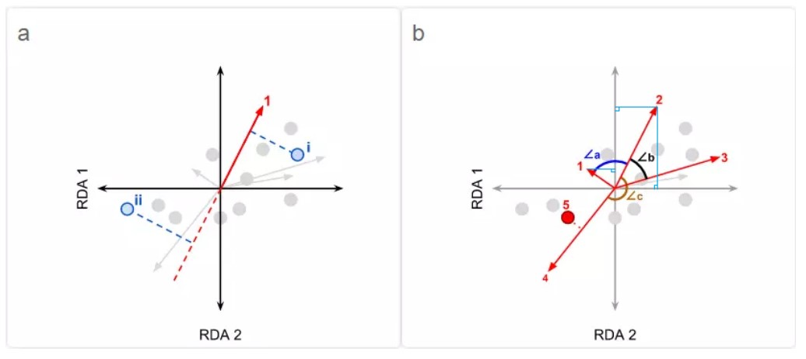
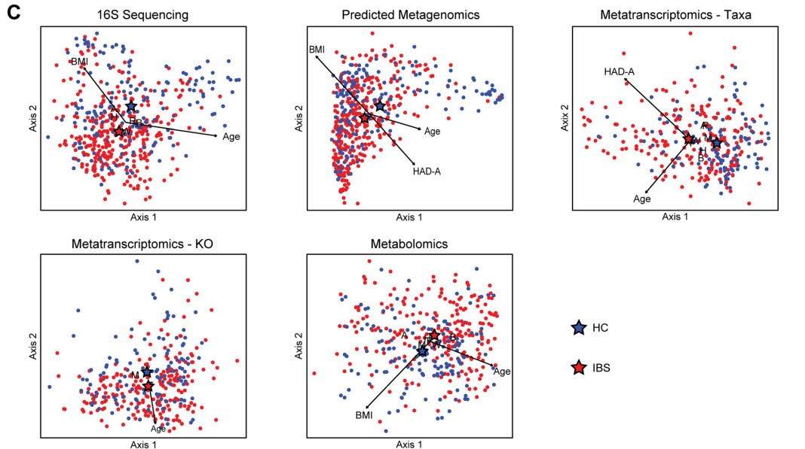
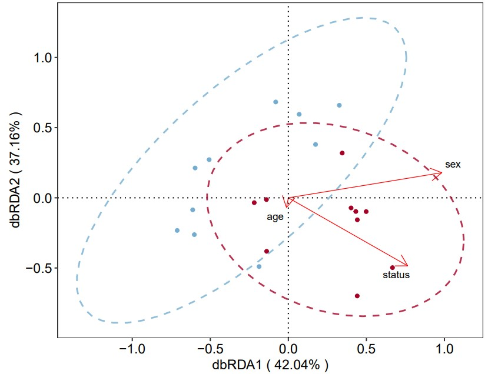
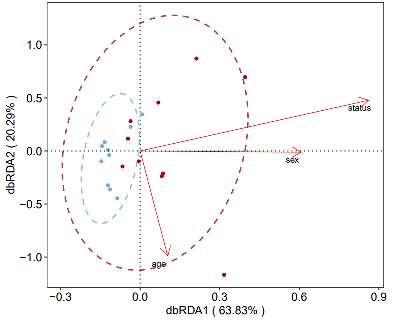
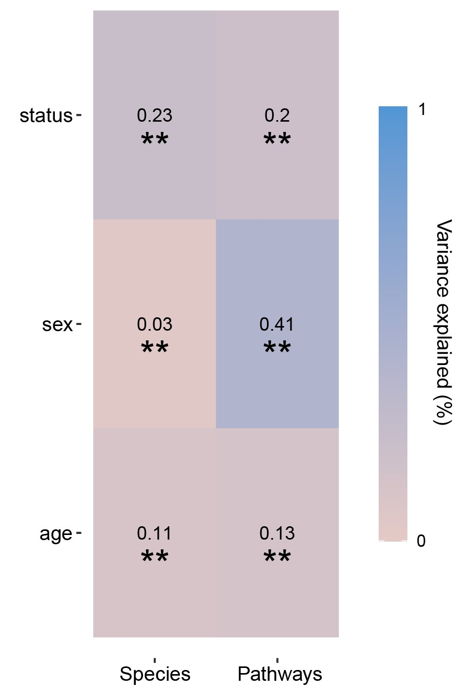
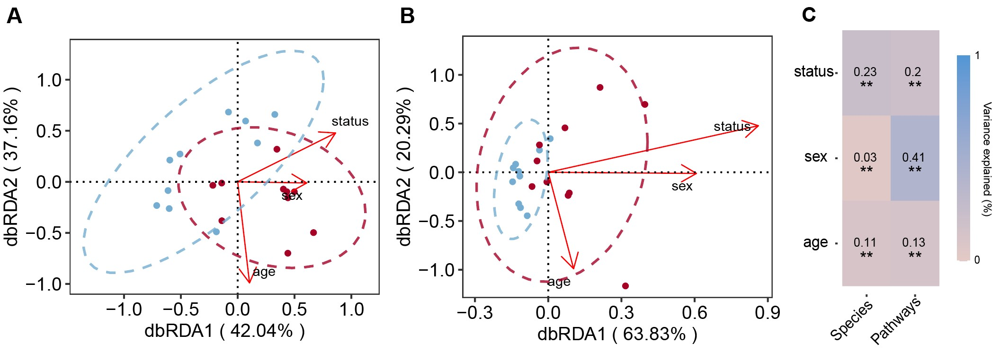

```{r setup, include=FALSE}
knitr::opts_chunk$set(
  collapse = T, echo=T, comment="#>", message=F, warning=F,
	fig.align="center", fig.width=5, fig.height=3, dpi=150)
```


The dbRDA plot scripts is referenced from MicrobiomeStatPlot [Inerst Reference below].

If you use this script, please cited 如果你使用本代码，请引用：

**Yong-Xin Liu**, Lei Chen, Tengfei Ma, Xiaofang Li, Maosheng Zheng, Xin Zhou, Liang Chen, Xubo Qian, Jiao Xi, Hongye Lu, Huiluo Cao, Xiaoya Ma, Bian Bian, Pengfan Zhang, Jiqiu Wu, Ren-You Gan, Baolei Jia, Linyang Sun, Zhicheng Ju, Yunyun Gao, **Tao Wen**, **Tong Chen**. 2023. EasyAmplicon: An easy-to-use, open-source, reproducible, and community-based pipeline for amplicon data analysis in microbiome research. **iMeta** 2(1): e83. https://doi.org/10.1002/imt2.83

The online version of this tuturial can be found in https://github.com/YongxinLiu/MicrobiomeStatPlot


**Authors**
First draft(初稿)：Defeng Bai(白德凤)；Proofreading(校对)：Ma Chuang(马闯) and Jiani Xun(荀佳妮)；Text tutorial(文字教程)：Defeng Bai(白德凤)；Video tutorial(视频教程)：Defeng Bai(白德凤)


# Introduction简介

什么是RDA分析？
What is RDA analysis?

RDA分析(Redundancy Analysis, 冗余分析)，是环境因子约束化的PCA分析，可以将样本和环境因子反映在同一个二维排序图上，从图中可以直观地看出样本分布和环境因子间的关系。从概念上讲，RDA是响应变量矩阵与解释变量矩阵之间多元多重线性回归的拟合值矩阵的PCA分析，也是多响应变量回归分析的拓展。在群落分析中常使用RDA，将物种多度的变化分解为与环境变量相关的方差，用以探索群落物种组成受环境变量的约束关系。

RDA analysis (Redundancy Analysis) is a PCA analysis constrained by environmental factors. It can reflect samples and environmental factors on the same two-dimensional ordination diagram, from which the relationship between sample distribution and environmental factors can be intuitively seen. Conceptually, RDA is a PCA analysis of the fitted value matrix of multivariate linear regression between the response variable matrix and the explanatory variable matrix, and is also an extension of multi-response variable regression analysis. RDA is often used in community analysis to decompose the changes in species abundance into variances related to environmental variables, in order to explore the constraints of community species composition on environmental variables.

什么是tb-RDA?
What is tb-RDA?

包含很多零值的物种多度数据在执行多元回归或其它基于欧氏距离的分析方法之前必须被转化，tb-RDA（基于转化的RDA）被提出用于解决这个问题。tb-RDA在分析前首先对原始数据做一定的转换，并使用转化后的数据执行RDA。即除了第一步增添了数据转化外，其余过程均和常规的RDA相同，只是在原始数据本身做了改动，RDA算法本质未变。

Species abundance data containing many zero values must be transformed before performing multiple regression or other analysis methods based on Euclidean distance. tb-RDA (transformation-based RDA) is proposed to solve this problem. tb-RDA first transforms the original data before analysis and uses the transformed data to perform RDA. In other words, except for the addition of data transformation in the first step, the rest of the process is the same as conventional RDA, only the original data itself is changed, and the essence of the RDA algorithm remains unchanged.

什么是偏冗余分析？
What is partial redundancy analysis?

偏冗余分析(Partial canonical ordination, 偏RDA)相当于多元偏线性回归分析，在实际应用中同样广泛。在解释变量的向前选择过程中，偏RDA应用广泛。
Partial redundancy analysis (Partial canonical ordination, partial RDA) is equivalent to multivariate partial linear regression analysis and is also widely used in practice. Partial RDA is widely used in the forward selection process of explanatory variables.

什么是基于距离的冗余分析(db-RDA)?
What is distance-based redundancy analysis (db-RDA)?

尽管tb-RDA的应用拓展了RDA的适应范围，但无论常规的RDA或tb-RDA，样方或物种的降维过程实质上均以欧氏距离为举出。有时候我们可能期望关注非欧式距离样方或物种关系的RDA,。基于距离的冗余分析被提出用于解决这个问题，并且证明RDA能够以方差分析方式分析由用于选择的任何距离矩阵。db-RDA将主坐标分析(PCoA)计算的样方得分矩阵应用在RDA中，其好处是可以基于任意一种距离测度进行RDA排序，因此db-RDA在生态学统计分析中被广泛使用。db-RDA首先基于物种多度数据计算相异矩阵，作为PCoA的输入，之后将所有PCoA排序轴上的样方得分矩阵用于执行RDA，而不再使用原始的物种数据以及解释变量直接作为RDA的输入。由于在PCoA中可能会产生负特征值，必要时需要引入一些有效的矫正方法。尽管物种信息在相异矩阵的计算过程中丢失，但柱坐标矩阵依然可以视为表征数据总方差的距离矩阵，因此db-RDA结果反映了解释变量对从整个响应数据中得出的样方相似性的隐形。物种得分可以通过与它们所在样方得分的多度加权平均与PCoA轴建立关联而投影到最终的排序图中，用以表明响应变量对PCoA排序的贡献程度。

Although the application of tb-RDA has expanded the scope of RDA, the dimension reduction process of samples or species in both conventional RDA and tb-RDA is essentially based on Euclidean distance. Sometimes we may want to focus on RDA of non-Euclidean distance samples or species relationships. Distance-based redundancy analysis was proposed to solve this problem, and it was proved that RDA can analyze any distance matrix selected by the method of variance analysis. db-RDA applies the sample score matrix calculated by principal coordinate analysis (PCoA) to RDA. The advantage is that RDA can be sorted based on any distance measure, so db-RDA is widely used in ecological statistical analysis. db-RDA first calculates the dissimilarity matrix based on species abundance data as the input of PCoA, and then uses the sample score matrix on all PCoA sorting axes to perform RDA, instead of using the original species data and explanatory variables directly as the input of RDA. Since negative eigenvalues may be generated in PCoA, some effective correction methods need to be introduced when necessary. Although species information is lost in the calculation of the dissimilarity matrix, the cylindrical coordinate matrix can still be regarded as a distance matrix that represents the total variance of the data, so the db-RDA results reflect the invisibility of the explanatory variables on the sample similarity obtained from the entire response data. Species scores can be projected into the final ordination diagram by associating them with the abundance-weighted average of the sample scores in which they are located and the PCoA axis to indicate the contribution of the response variable to the PCoA ordination.


RDA排序图解读
Interpretation of RDA Sorting Diagram


（1）a图，存在排序样方（样本）I和II，解释变量（环境变量）1，探究I或II与1的关系时，将I或II垂直投影在1的向量（箭头）上，根据交叉点的位置判断变量1在I或II中的值。交叉点越靠近该变量向量的正方向，则表明所对应的样方中，该变量的数值越大。例如，假设变量1为土壤碳含量，样方I投影在1的正方向，样方II投影在1的负方向上（图中红色虚线反向延长线部分），两个交叉点相比较，I与1的交叉点更位于1延伸方向，因此可知I中的土壤碳含量要比II中的土壤碳含量要高。
若1为响应变量（物种变量），观察方法同样适用。例如变量1为物种species1，同样据此可判断物种species1在I中的丰度高于在II中的丰度。
注：无论I型标尺或II型标尺，均可据此判断变量在样方中的相对数值大小。

(1) In Figure a, there are sorted plots (samples) I and II, and explanatory variable (environmental variable) 1. When exploring the relationship between I or II and 1, project I or II vertically onto the vector (arrow) of 1, and judge the value of variable 1 in I or II based on the position of the intersection. The closer the intersection is to the positive direction of the variable vector, the larger the value of the variable in the corresponding plot. For example, assuming that variable 1 is soil carbon content, plot I is projected in the positive direction of 1, and plot II is projected in the negative direction of 1 (the reverse extension of the red dotted line in the figure). Compared with the two intersections, the intersection of I and 1 is more in the extension direction of 1, so it can be seen that the soil carbon content in I is higher than that in II.
If 1 is the response variable (species variable), the observation method is also applicable. For example, if variable 1 is species species1, it can also be judged that the abundance of species species1 in I is higher than that in II.
Note: Whether it is type I scale or type II scale, it can be used to judge the relative value of the variable in the plot.

（2）b图，根据向量（箭头）夹角判断变量间的相关性。∠a接近90°，即接近正交，表明变量1和2之间的相关性很小，二者相互之间几乎不存在影响。∠b小于90°，夹角为锐角，表明变量2和3之间存在正相关；锐角角度越小，则正相关性越大。∠c大于90°，夹角为钝角，表明变量3和4之间存在负相关；钝角角度越大，则负相关性越大。
注：对于I型标尺，仅可据此观测解释变量与响应变量间的相关性；对于II型标尺，既可以据此观测解释变量与响应变量间的相关性，也可以观测解释变量之间、或响应变量之间的相关性。

(2) In Figure b, the correlation between variables is determined based on the angle between the vectors (arrows). ∠a is close to 90°, that is, close to orthogonality, indicating that the correlation between variables 1 and 2 is very small, and there is almost no influence between the two. ∠b is less than 90°, and the angle is acute, indicating that there is a positive correlation between variables 2 and 3; the smaller the acute angle, the greater the positive correlation. ∠c is greater than 90°, and the angle is obtuse, indicating that there is a negative correlation between variables 3 and 4; the larger the obtuse angle, the greater the negative correlation.
Note: For the type I scale, only the correlation between the explanatory variable and the response variable can be observed; for the type II scale, both the correlation between the explanatory variable and the response variable and the correlation between the explanatory variables or the response variables can be observed.

(3) 对于因子类型的解释变量5（定性变量，非数值型变量），在图中以点表示而非以向量表示，探究变量5与其它变量间的相关性时需要根据投影判断。例如，变量5垂直投影在变量4的正方向，表明与变量4存在正相关；投影在变量2的负方向，表明与变量2存在负相关；相关性的大小，可以通过垂线交叉点与原点(0,0)的距离来表示。
注：对于I型标尺，仅能据此观测定性解释变量与响应变量间的相关性；对于II型标尺，既可以据此观测定性解释变量与响应变量间的相关性，也可以观测其与定量解释变量之间的相关性。

(3) For the factor type explanatory variable 5 (qualitative variable, non-numerical variable), it is represented by a point rather than a vector in the figure. When exploring the correlation between variable 5 and other variables, it is necessary to judge based on the projection. For example, variable 5 is vertically projected in the positive direction of variable 4, indicating that it is positively correlated with variable 4; it is projected in the negative direction of variable 2, indicating that it is negatively correlated with variable 2; the magnitude of the correlation can be represented by the distance between the intersection of the vertical line and the origin (0,0).
Note: For the type I scale, only the correlation between the qualitative explanatory variable and the response variable can be observed; for the type II scale, both the correlation between the qualitative explanatory variable and the response variable can be observed, and the correlation between it and the quantitative explanatory variable can also be observed.

(4) 若为I型标尺，还可根据图中样方点之间的距离判断样方群落之间的相似性。两个样方距离越近，则群落相似性越大；反之越低。

(4) If it is an I-type scale, the similarity between sample plots can also be judged based on the distance between the sample points in the figure. The closer the distance between two sample plots, the greater the community similarity; otherwise, the lower.

(5) 此外，还可通过比较解释变量（环境变量）向量在约束轴上投影的相对长度，判断环境变量对群落特征的贡献度。例如在图b中，将变量2和变量1均投影至RDA2轴，此时变量2的投影长度相对更长，表明变量2比变量1对RDA2轴形成的贡献更大。

(5) In addition, the contribution of environmental variables to community characteristics can be determined by comparing the relative lengths of the projections of the explanatory variable (environmental variable) vectors on the constraint axis. For example, in Figure b, both variable 2 and variable 1 are projected onto the RDA2 axis. At this time, the projection length of variable 2 is relatively longer, indicating that variable 2 contributes more to the formation of the RDA2 axis than variable 1.

解释变量向量与约束轴夹角的大小同样具有意义，表示解释变量与约束轴相关性的大小，夹角小说明关系密切，若正交则不相关。例如在图b中，变量2的向量与RDA2轴的夹角比与RDA1轴的夹角更小，表明变量2与RDA2的关联程度比与RDA1的关联程度要高，即相较之下变量2更贡献于RDA2轴。

The size of the angle between the explanatory variable vector and the constraint axis is also meaningful, indicating the size of the correlation between the explanatory variable and the constraint axis. A small angle indicates a close relationship, and if it is orthogonal, there is no correlation. For example, in Figure b, the angle between the vector of variable 2 and the RDA2 axis is smaller than the angle with the RDA1 axis, indicating that the degree of correlation between variable 2 and RDA2 is higher than that with RDA1, that is, variable 2 contributes more to the RDA2 axis.


关键字：微生物组数据分析、MicrobiomeStatPlot、冗余分析图、R语言可视化

Keywords: Microbiome analysis, MicrobiomeStatPlot, dbRDA plot, R visulization


## dbRDA exampledbRDA案例

这是来自于加州大学洛杉矶分校的Emeran A. Mayer团队在2023年发表于Microbiome上的一篇论文用到的dbRDA图。论文题目为：Multi-omics profles of the intestinal microbiome in irritable bowel syndrome and its bowel habit subtypes. https://doi.org/10.1186/s40168-022-01450-5

This is a dbRDA plot used in a paper published in Microbiome in 2023 by Emeran A. Mayer's team from UCLA. The paper is titled: Multi-omics profiles of the intestinal microbiome in irritable bowel syndrome and its bowel habit subtypes. https://doi.org/10.1186/s40168-022-01450-5



Fig. 1  (C) Distance-based redundancy analysis (dbRDA) was performed to visualize variation in beta diversity related to IBS status, age, sex, race/ethnicity, BMI, dietary category, and HAD-Anxiety (HAD-A). IBS group and statistically signifcant categorical variables are denoted by letters or symbols indicating the centroid for each category. Statistically signifcant continuous variables are shown as arrows originating from the centroid of all samples, with length proportional to strength of association. F = female, M = male, A = Asian, B = African-American, H = Hispanic, W = non-Hispanic white, R = multiracial.

图 1 (C) 进行基于距离的冗余分析 (dbRDA)，以可视化与 IBS 状态、年龄、性别、种族/民族、BMI、饮食类别和 HAD-焦虑 (HAD-A) 相关的 beta 多样性变化。IBS 组和具有统计学意义的分类变量用字母或符号表示，表示每个类别的质心。具有统计学意义的连续变量显示为源自所有样本质心的箭头，长度与关联强度成正比。F = 女性，M = 男性，A = 亚裔，B = 非裔美国人，H = 西班牙裔，W = 非西班牙裔白人，R = 多种族。


**结果**

Many covariates were also found to be signifcantly associated with microbial composition in one or both datasets, including age, sex, race, BMI, dietary category, HAD-Anxiety, and HAD Depression. Given the strong correlation between anxiety and depression and the greater diferential between IBS and HC in HAD-Anxiety, this was selected as a covariate to represent the association of mood with the microbiome. In multivariate analyses adjusting for these covariates, IBS remained signifcantly associated with microbial composition by 16S rRNA and metatranscriptomics sequencing, as did several of the covariates including age and race (Fig. 1B, C).

还发现许多协变量与一个或两个数据集中的微生物组成显著相关，包括年龄、性别、种族、BMI、饮食类别、HAD-焦虑和 HAD 抑郁。鉴于焦虑和抑郁之间的强相关性以及 HAD-焦虑中 IBS 和 HC 之间的较大差异，因此将其选为协变量来表示情绪与微生物组的关联。在调整这些协变量的多变量分析中，IBS 仍然与 16S rRNA 和宏转录组测序的微生物组成显著相关，年龄和种族等几个协变量也是如此（图 1B、C）。

Among the covariates, age, sex, race, BMI, dietary category, and HAD-Anxiety were signifcantly associated with the metatranscriptome and metabolome; age, race, and BMI also were signifcantly associated with the predicted metagenome. After adjustment for these six covariates, IBS remained signifcantly associated with the metatranscriptome and predicted metagenome but no longer had a signifcant association with the metabolome (Fig. 1B, C).

在协变量中，年龄、性别、种族、BMI、饮食类别和 HAD-Anxiety 与宏转录组和代谢组显著相关；年龄、种族和 BMI 也与预测的宏基因组显著相关。调整这六个协变量后，IBS 仍然与宏转录组和预测的宏基因组显著相关，但与代谢组不再具有显著关联（图 1B、C）。


## Packages installation软件包安装

```{r}
# 基于CRAN安装R包，检测没有则安装
p_list = c("vegan", "ggplot2", "ggpubr", "ggrepel", "rdacca.hp", "vegan", "psych", "reshape2")
for(p in p_list){if (!requireNamespace(p)){install.packages(p)}
    library(p, character.only = TRUE, quietly = TRUE, warn.conflicts = FALSE)}

# 加载R包 Load the package
suppressWarnings(suppressMessages(library(vegan)))
suppressWarnings(suppressMessages(library(ggplot2)))
suppressWarnings(suppressMessages(library(ggpubr)))
suppressWarnings(suppressMessages(library(ggrepel)))
suppressWarnings(suppressMessages(library(rdacca.hp)))
```


## dbRDA plot using R softwaredbRDA图R语言实战

### Microbiota species微生物物种

```{r dbRDA_plot, fig.show='asis', fig.width=4, fig.height=2.5}
# load data
# 读入物种数据，以细菌 OTU 水平丰度表为例
otu = read.csv('data/species_data.csv', head = T, row.names=1)
otu <- data.frame(t(otu))

# 分组数据
# group data
matadata <- read.table(paste("data/group_data.txt",sep=""), header=T, row.names=1, sep="\t", comment.char="")
otu = otu[rownames(otu) %in% rownames(matadata), ]

# 读取环境数据
# confounding factors
env = read.csv('data/c_index_species_new4.csv', header = T, row.names=1)
env = na.omit(env)
env = env[rownames(env) %in% rownames(matadata), ]

rownames = rownames(env)
rownames = as.data.frame(rownames)
otu$rownames = rownames(otu)
otu = merge(otu, rownames, by = "rownames")
rownames(otu) = otu$rownames
otu = otu[, -1]

# 根据原理一步步计算 db-RDA
# Calculate db-RDA step by step according to the principle
# 计算样方距离，以 Bray-curtis 距离为例，详情 ?vegdist
# Calculate the sample distance, taking Bray-curtis distance as an example, details ?vegdist
# dis_bray <- vegdist(otu, method = 'bray')
distance_mat = read.table(paste("data/Species_beta_diversity2.txt",sep=""), header=T, row.names=1, sep="\t", comment.char="")
metadata2 = t(matadata)
distance_mat2 = distance_mat[rownames(distance_mat) %in% rownames(matadata), ]
distance_mat3 = distance_mat2[, colnames(distance_mat2) %in% colnames(metadata2)]
distance_mat = distance_mat3

# 或者直接使用现有的距离矩阵，这里同样为 Bray-curtis 距离
# Or directly use the existing distance matrix, which is also the Bray-curtis distance
dis_bray <- as.dist(distance_mat)

# PCoA 排序，这里通过 add = TRUE校正负特征值，详情 ?cmdscale
# PCoA sorting, here add = TRUE is used to correct negative eigenvalues, details ?cmdscale
pcoa <- cmdscale(dis_bray, k = nrow(otu) - 1, eig = TRUE, add = TRUE)

# 提取 PCoA 样方得分（坐标）
# Extract PCoA sample scores (coordinates)
pcoa_site <- pcoa$point

# db-RDA，环境变量与 PCoA 轴的多元回归
# db-RDA, multiple regression of environmental variables and PCoA axes
# 通过 vegan 包的 RDA 函数 rda() 执行，详情 ?rda
# Execute via the RDA function rda() of the vegan package, details ?rda
db_rda <- rda(pcoa_site, env, scale = FALSE)
# summary(db_rda)

# 被动拟合物种得分
# Passive fitting species score
v.eig <- t(otu) %*% db_rda$CCA$u/sqrt(nrow(otu) - 1)
db_rda$CCA$v <- decostand(v.eig, 'normalize', MARGIN = 2)
v.eig <- t(otu) %*% db_rda$CA$u/sqrt(nrow(otu) - 1)
db_rda$CA$v <- decostand(v.eig, 'normalize', MARGIN = 2)

# 提取画图所需要的数据
# Extract the data needed for drawing
score = scores(db_rda)
# score$sites
db_rda$CCA$biplot
# score$species

CAP1 = score$sites[,1]
CAP2 = score$sites[,2]

seg = as.data.frame(db_rda$CCA$biplot)

CPA_data = as.data.frame(score$sites)
CPA_data$group = rownames(CPA_data)
CPA_data$group = as.character(CPA_data$group)
CPA_data$group = gsub("[0-9]","", CPA_data$group)

# 将上述提取的数据整合成画图所需的表格
# Integrate the above extracted data into the table required for drawing
plotdata = data.frame(rownames(score$sites), CAP1, CAP2, CPA_data$group)
colnames(plotdata) = c('sample','CAP1','CAP2','Group') #为其加上列名(add column name)
# write.csv(plotdata,'data/data5/dbRDA_npc_KO9.csv')

# 计算第一、二主轴的解释度
# Calculate the explanation of the first and second principal axes
CAP1_exp = round(db_rda$CCA$eig[1]/sum(db_rda$CCA$eig)*100,2)
CAP2_exp = round(db_rda$CCA$eig[2]/sum(db_rda$CCA$eig)*100,2)

p1 = ggplot(plotdata, aes(CAP1, CAP2)) +
  geom_point(aes(fill = Group, color = Group),size = 1.3) + 
  scale_fill_manual(values = c("#74add1","#a60026"))+
  scale_color_manual(values = c("#74add1","#a60026"))+
  #添加置信区间，两种选一个就行
  #add confidence intervals
  #stat_ellipse(linetype = 1,level = 0.95,aes(group = Treatment, color = Treatment)) +
  #stat_chull(geom = 'polygon', aes(group = Treatment, color = Treatment, fill = Treatment), alpha = 0.1) +
  xlab(paste('dbRDA1 ( ',CAP1_exp,'%',' )', sep = '')) + 
  ylab(paste('dbRDA2 ( ',CAP2_exp,'%',' )', sep = '')) +
  geom_segment(data = seg, aes(x = 0, y = 0, xend = seg[,1], yend = seg[,2]),
               colour = "red", size = 0.3,
               arrow = arrow(angle = 30, length = unit(0.4, 'cm'))) +
  geom_text_repel(data = seg, segment.colour = 'black',
                  aes(x = seg[,1], y = seg[,2], 
                      label = rownames(seg)),size = 3) +
  geom_vline(aes(xintercept = 0), linetype = 'dotted') +
  geom_hline(aes(yintercept = 0), linetype = 'dotted') +
  theme_bw()+
  theme(text = element_text(family = 'sans', size = 12),
        panel.grid.major = element_blank(),
        panel.grid.minor = element_blank()
        ,legend.position = 'none'
        )+ 
  theme(axis.text = element_text(colour = 'black',size = 12))+
  stat_ellipse(#data=plotdata,
               #geom = "polygon",
               level=0.95,
               linetype = 2,size=0.7,
               aes(color=Group),
               alpha=0.8)+
  coord_equal(ratio=0.9)
ggsave(paste("results/dbRDA_Species01.pdf",".pdf", sep=""), p1, width=149 * 1.5, height=80 * 1.5, unit='mm')
#p1

# 置换检验
# Permutation test
env$status = as.numeric(env$status)
env$sex = as.vector(env$sex)
# env$region = as.vector(env$region)
env$age = as.vector(env$age)

envfit <- envfit(db_rda, env, permutations  = 999)
r <- as.matrix(envfit$vectors$r)
p <- as.matrix(envfit$vectors$pvals)
env.p <- cbind(r,p)
colnames(env.p) <- c("r2","p-value")
KK <- as.data.frame(env.p)
KK$p.adj = p.adjust(KK$`p-value`, method = 'BH')
# KK
# write.csv(as.data.frame(env.p),file="data/rdaenvfit_HP_new_species_01.csv")

# 利用rdacca.hp计算每个环境因子的效应
# Use rdacca.hp to calculate the effect of each environmental factor
dis_bray <- as.dist(distance_mat)
bray = dis_bray
cap.hp = rdacca.hp(bray, env, method = 'dbRDA', type = 'R2', scale = FALSE)
cap.hp$Total_explained_variation
cap.hp$Hier.part

# 导出每个环境因子的解释度
# Export the explanation of each environmental factor
# write.csv(cap.hp$Hier.part, 'data/env_effect_HP_new_Species_02.csv')

# Unique:每个解释变量单独解释的总变化量的比例，即与其它解释变量不存在共存解释的部分
# Unique: The proportion of the total variation explained by each explanatory variable alone, that is, the part that does not coexist with other explanatory variables
# Average.share: 对每个解释变量与其它解释变量共同解释部分的分割
# Average.share: Split each explanatory variable into its common explanation with other explanatory variables
# Individual: 每个解释变量站总变化量的比例Individual等于Unique和Average.share的总和
# Individual: The proportion of the total variation of each explanatory variable station is equal to the sum of Unique and Average.share
# I.prec(%): 每个解释变量占总被解释变化量的比例，即各解释变量的Individual占Individual总和的百分比，Individual总和等同db-RDA的总解释方差占比
# I.prec(%): The proportion of each explanatory variable to the total explained variance, that is, the percentage of each explanatory variable's individual to the individual sum, and the individual sum is equivalent to the total explained variance proportion of db-RDA
```





### Pathways功能通路

```{r dbRDA_plot2, fig.show='asis', fig.width=4, fig.height=2.5}
# load data
# 读取数据
# 读入物种数据，以细菌 OTU 水平丰度表为例
otu = read.csv('data/pathway_unstrafied4.csv', head = T, row.names=1)           #读取物种相对丰度表
otu <- data.frame(t(otu))

# 分组数据
# group data
matadata <- read.table(paste("data/group_data.txt",sep=""), header=T, row.names=1, sep="\t", comment.char="")
otu = otu[rownames(otu) %in% rownames(matadata), ]

# 读取环境数据
# confounding factors
env = read.csv('data/c_index_species_new4.csv', header = T, row.names=1)
env = na.omit(env)
env = env[rownames(env) %in% rownames(matadata), ]
rownames = rownames(env)
rownames = as.data.frame(rownames)
otu$rownames = rownames(otu)
otu = merge(otu, rownames, by = "rownames")
rownames(otu) = otu$rownames
otu = otu[, -1]

# Bray-curtis distance
# Pathways
distance_mat = read.table(paste("data/bray_curtis_path3.txt",sep=""), header=T, row.names=1, sep="\t", comment.char="")
metadata2 = t(matadata)
distance_mat2 = distance_mat[rownames(distance_mat) %in% rownames(matadata), ]
distance_mat3 = distance_mat2[, colnames(distance_mat2) %in% colnames(metadata2)]
distance_mat = distance_mat3

# 或者直接使用现有的距离矩阵，这里同样为 Bray-curtis 距离
# Or directly use the existing distance matrix, which is also the Bray-curtis distance
dis_bray <- as.dist(distance_mat)

# PCoA 排序，这里通过 add = TRUE校正负特征值，详情 ?cmdscale
# PCoA sorting, here add = TRUE is used to correct negative eigenvalues, details ?cmdscale
pcoa <- cmdscale(dis_bray, k = nrow(otu) - 1, eig = TRUE, add = TRUE)

# 提取 PCoA 样方得分（坐标）
# Extract PCoA sample scores (coordinates)
pcoa_site <- pcoa$point

# db-RDA，环境变量与 PCoA 轴的多元回归
# db-RDA, multiple regression of environmental variables and PCoA axes
# 通过 vegan 包的 RDA 函数 rda() 执行，详情 ?rda
# Execute via the RDA function rda() of the vegan package, details ?rda
db_rda <- rda(pcoa_site, env, scale = FALSE)
# summary(db_rda)

# 被动拟合物种得分
# Passive fitting species score
v.eig <- t(otu) %*% db_rda$CCA$u/sqrt(nrow(otu) - 1)
db_rda$CCA$v <- decostand(v.eig, 'normalize', MARGIN = 2)
v.eig <- t(otu) %*% db_rda$CA$u/sqrt(nrow(otu) - 1)
db_rda$CA$v <- decostand(v.eig, 'normalize', MARGIN = 2)

# 提取画图所需要的数据
# Extract the data needed for drawing
score = scores(db_rda)
# score$sites
db_rda$CCA$biplot
# score$species

CAP1 = score$sites[,1]
CAP2 = score$sites[,2]

seg = as.data.frame(db_rda$CCA$biplot)

CPA_data = as.data.frame(score$sites)
CPA_data$group = rownames(CPA_data)
CPA_data$group = as.character(CPA_data$group)
CPA_data$group = gsub("[0-9]","", CPA_data$group)

# 将上述提取的数据整合成画图所需的表格
# Integrate the above extracted data into the table required for drawing
plotdata = data.frame(rownames(score$sites), CAP1, CAP2, CPA_data$group)
colnames(plotdata) = c('sample','CAP1','CAP2','Group') #为其加上列名(add column name)

# 计算第一、二主轴的解释度
# Calculate the explanation of the first and second principal axes
CAP1_exp = round(db_rda$CCA$eig[1]/sum(db_rda$CCA$eig)*100,2)
CAP2_exp = round(db_rda$CCA$eig[2]/sum(db_rda$CCA$eig)*100,2)

p2 = ggplot(plotdata, aes(CAP1, CAP2)) +
  geom_point(aes(fill = Group, color = Group),size = 1.3) + 
  scale_fill_manual(values = c("#74add1","#a60026"))+
  scale_color_manual(values = c("#74add1","#a60026"))+
  #添加置信区间，两种选一个就行
  #add confidence intervals
  #stat_ellipse(linetype = 1,level = 0.95,aes(group = Treatment, color = Treatment)) +
  #stat_chull(geom = 'polygon', aes(group = Treatment, color = Treatment, fill = Treatment), alpha = 0.1) +
  xlab(paste('dbRDA1 ( ',CAP1_exp,'%',' )', sep = '')) + 
  ylab(paste('dbRDA2 ( ',CAP2_exp,'%',' )', sep = '')) +
  geom_segment(data = seg, aes(x = 0, y = 0, xend = seg[,1], yend = seg[,2]),
               colour = "red", size = 0.3,
               arrow = arrow(angle = 30, length = unit(0.4, 'cm'))) +
  geom_text_repel(data = seg, segment.colour = 'black',
                  aes(x = seg[,1], y = seg[,2], 
                      label = rownames(seg)),size = 3) +
  geom_vline(aes(xintercept = 0), linetype = 'dotted') +
  geom_hline(aes(yintercept = 0), linetype = 'dotted') +
  theme_bw()+
  theme(text = element_text(family = 'sans', size = 12),
        panel.grid.major = element_blank(),
        panel.grid.minor = element_blank()
        ,legend.position = 'none'
        )+ 
  theme(axis.text = element_text(colour = 'black',size = 12))+
  stat_ellipse(#data=plotdata,
               #geom = "polygon",
               level=0.95,
               linetype = 2,size=0.7,
               aes(color=Group),
               alpha=0.8)+
  coord_equal(ratio=0.4)
ggsave(paste("results/dbRDA_PATHs01.pdf",".pdf", sep=""), p2, width=149 * 1.5, height=80 * 1.5, unit='mm')
#p2

# 置换检验
# Permutation test
env$status = as.numeric(env$status)
env$sex = as.vector(env$sex)
env$age = as.vector(env$age)

envfit <- envfit(db_rda, env, permutations  = 999)
r <- as.matrix(envfit$vectors$r)
p <- as.matrix(envfit$vectors$pvals)
env.p <- cbind(r,p)
colnames(env.p) <- c("r2","p-value")
KK <- as.data.frame(env.p)
KK$p.adj = p.adjust(KK$`p-value`, method = 'BH')
# KK
# write.csv(as.data.frame(env.p),file="data/rdaenvfit_HP_new_species_01.csv")

# db-RDA，环境变量与 PCoA 轴的多元回归
# db-RDA, multiple regression of environmental variables and PCoA axes
# 通过 vegan 包的 RDA 函数 rda() 执行，详情 ?rda
# Execute the RDA function rda() of the vegan package, see ?rda for details
# db_rda <- rda(pcoa_site~., env, scale = FALSE)
# summary(db_rda)
# anova(db_rda, by = "term", permutations=999)
# RsquareAdj(rda(pcoa_site ~ status, data=env))$adj.r.squared
# RsquareAdj(rda(pcoa_site ~ status+sex, data=env))$adj.r.squared
# RsquareAdj(rda(pcoa_site ~ status+sex+age, data=env))$adj.r.squared

# 利用rdacca.hp计算每个环境因子的效应
# Use rdacca.hp to calculate the effect of each environmental factor
# bray = vegdist(otu, method = 'bray')
# bray = dis_bray

#dis_bray <- as.dist(distance_mat)
bray = dis_bray
cap.hp = rdacca.hp(bray, env, method = 'dbRDA', type = 'R2', scale = FALSE)
cap.hp$Total_explained_variation
cap.hp$Hier.part

# 导出每个环境因子的解释度
# Export the explanation of each environmental factor
write.csv(cap.hp$Hier.part, 'results/env_effect_HP_new_paths_04.csv')
```





### Variance explained percent heatmap变异解释度热图

```{r dbRDA_plot3, fig.show='asis', fig.width=4, fig.height=2.5}
# Load data
allnew <- read.csv('data/data_heat_4.csv', header = T)

allnew[which(allnew$p<0.001),'sig'] <- '***'
allnew[which(allnew$p<0.01 & allnew$p>=0.001),'sig'] <- '**'
allnew[which(allnew$p<0.05 & allnew$p>=0.01),'sig'] <- '*'

allnew = allnew %>%
  mutate(variable = ordered(variable,
                         levels=c("Species", "Pathways")))

# Plot
p3 <- ggplot(allnew, aes(variable,names, fill = deviance_explained)) +
  geom_tile(aes(width = 1, height = 1), size = 12) +
  geom_text(aes(label=deviance_explained), color="black", size=4) + 
  geom_text(aes(label=sig), color="black", size=8,vjust = 1.6) + 
  scale_fill_gradient2(low = "#afaa80", mid = "#e4cac6", high = "#5196d5",limit=c(0,1), breaks = seq(0, 0.25, 1)) +
  theme(
    panel.grid = element_blank(),
    panel.background = element_blank(),
    legend.title = element_text(angle = -90, hjust = 0.2),
    axis.text.y = element_text(size=12, colour="black", family = "sans", angle = 0),
    axis.text.x = element_text(size=12, colour="black", family = "sans", angle = 0, hjust = 0)
  )+
  theme(text = element_text(family = 'sans', size = 12),
        panel.grid.major = element_blank(),
        panel.grid.minor = element_blank()
        #,legend.position = 'none'
        )+
  scale_color_discrete(breaks = c(0, 1.0, 0.25))+
  theme(legend.direction='vertical')+
  labs(x=NULL,y=NULL) + 
  guides(fill=guide_colorbar(barheight = 18,title = "Variance explained (%)", title.position = "right"))+
  coord_equal(ratio = 1.7)
ggsave(paste("results/dbRDA_HP_heat_n01_only_sex_age_new0318_3",".pdf", sep=""), p3, width=79 * 1.5, height=100 * 1.5, unit='mm')
#p3
```




# Combo plots排版

Combo plots to published-ready figure

组合多个子图为发表格式

```{r dbRDA_combo, fig.show='asis', fig.width=8, fig.height=7.5, dpi=72}
library(cowplot)
p0 = plot_grid(p1, p2, p3, labels = c("A", "B", "C"), ncol = 3)
ggsave("results/dbRDA_plot02.pdf", p0, width=179 * 1.5, height=100 * 1.5, units = "mm")
```





If you use this script, please cited 如果你使用本代码，请引用：

**Yong-Xin Liu**, Lei Chen, Tengfei Ma, Xiaofang Li, Maosheng Zheng, Xin Zhou, Liang Chen, Xubo Qian, Jiao Xi, Hongye Lu, Huiluo Cao, Xiaoya Ma, Bian Bian, Pengfan Zhang, Jiqiu Wu, Ren-You Gan, Baolei Jia, Linyang Sun, Zhicheng Ju, Yunyun Gao, **Tao Wen**, **Tong Chen**. 2023. EasyAmplicon: An easy-to-use, open-source, reproducible, and community-based pipeline for amplicon data analysis in microbiome research. **iMeta** 2(1): e83. https://doi.org/10.1002/imt2.83

Copyright 2016-2024 Defeng Bai <baidefeng@caas.cn>, Chuang Ma <22720765@stu.ahau.edu.cn>, Jiani Xun <15231572937@163.com>, Yong-Xin Liu <liuyongxin@caas.cn>


