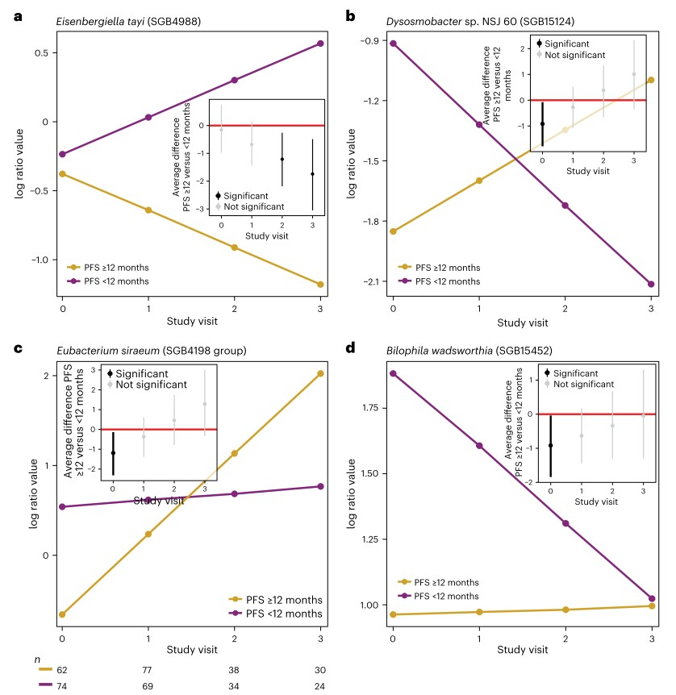

```{r setup, include=FALSE}
knitr::opts_chunk$set(
  collapse = T, echo=T, comment="#>", message=F, warning=F,
	fig.align="center", fig.width=5, fig.height=3, dpi=150)
```


The fido model analysis for relationship between microbiota and  patient prognosis is referenced from MicrobiomeStatPlot [Inerst Reference below].

If you use this script, please cited 如果你使用本代码，请引用：

**Yong-Xin Liu**, Lei Chen, Tengfei Ma, Xiaofang Li, Maosheng Zheng, Xin Zhou, Liang Chen, Xubo Qian, Jiao Xi, Hongye Lu, Huiluo Cao, Xiaoya Ma, Bian Bian, Pengfan Zhang, Jiqiu Wu, Ren-You Gan, Baolei Jia, Linyang Sun, Zhicheng Ju, Yunyun Gao, **Tao Wen**, **Tong Chen**. 2023. EasyAmplicon: An easy-to-use, open-source, reproducible, and community-based pipeline for amplicon data analysis in microbiome research. **iMeta** 2(1): e83. https://doi.org/10.1002/imt2.83

The online version of this tuturial can be found in https://github.com/YongxinLiu/MicrobiomeStatPlot


**Authors**
First draft(初稿)：Defeng Bai(白德凤)；Proofreading(校对)：Ma Chuang(马闯) and Jiani Xun(荀佳妮)；Text tutorial(文字教程)：Defeng Bai(白德凤)


# Introduction简介

fido 简介(fido introduction)

fido（Justin D. Silverman 等人，2019 年）是“（贝叶斯）多项逻辑正态模型”的缩写。特别是 fido 的开发源于对时不变 MALLARD 模型快速推理的需求 (Justin D. Silverman 等人 2018)。fido 非常快！它使用用 C++ 编写的模型梯度和 Hessians 的闭式解决方案，结合使用拉普拉斯近似的参数不确定性估计来执行 MAP 估计。fido 中的主要模型之一是函数 pibble，它适合多项逻辑正态线性回归模型。

fido (Justin D. Silverman et al., 2019) is an abbreviation for "(Bayesian) Multinomial Logistic Normal Model". In particular, the development of fido stems from the need for fast inference of time-invariant MALLARD models (Justin D. Silverman et al. 2018). fido is very fast! It performs MAP estimation using closed-form solutions to model gradients and Hessians written in C++ combined with parameter uncertainty estimates using the Laplace approximation. One of the main models in fido is the function pibble, which fits a multinomial logistic normal linear regression model.

那么，fido 模型到底是什么？首先，让我从 10,000 英尺的高度给出一个大致的描述：基本上，它是一个多项计数数据模型（例如，每个样本包含 D 种“事物类型”的计数）。重要的是，与更常见的泊松计数模型不同，多项模型模拟了“要计数的竞争”（即，计数更多一种事物意味着我可用于计数其他类型事物的资源更少的情况）。

So, what exactly is the fido model? First, let me give you a rough description from 10,000 feet: basically, it's a model for multinomial count data (e.g., each sample contains counts of D "types of things"). Importantly, unlike the more common Poisson count model, the multinomial model models "competition to count" (i.e., situations where counting more of one type of thing means I have fewer resources available to count other types of things).

这似乎有点模糊，所以让我举个例子。假设有一个球坑，里面有红色、绿色和蓝色的球。假设球坑很大，我不知道球坑里总共有多少个球，但我想说一下球坑里红色、蓝色和绿色球的相对数量。我可以选择的一种测量球坑的方法是抓起一抱球，然后计算每种颜色球的数量（例如，一抱球中我可能收集到 5 个红色、3 个蓝色和 6个绿色）。我的手臂只能容纳这么多球（在这个例子中大约 14 个），所以如果我（随机）从我的手臂中再拿一个绿色球（总共7个），我很可能无法测量其中一个红色或蓝色球；因此有“要计数的竞争”。事实证明，这种类型的采样在许多情况下一直都在发生（维基百科有一个政治民意调查的例子）。这种计数数据最显著的例子之一可能是现代高通量测序研究，例如用于分析微生物群落的 16S rRNA 研究或用于研究细胞表达谱的批量/单细胞 RNA 测序研究。在所有情况下，都会对转录本进行测序，并计算不同类型转录本的数量。重要的是，测序仅对可用的全部遗传物质的一小部分进行采样，并导致类似的竞争。

This seems a bit vague, so let me give an example. Suppose there is a ball pit with red, green, and blue balls in it. Assuming the ball pit is large, I don't know how many balls there are in total, but I would like to say the relative number of red, blue and green balls in the ball pit. One way I could choose to measure the ball pit is to grab an armful of balls and count the number of balls of each color (e.g. in an armful I might collect 5 red, 3 blue and 6 green) . My arm can only hold so many balls (about 14 in this example), so if I (randomly) take another green ball from my arm (7 total), I will most likely not be able to measure one of the red or Blue ball; hence there is "contest to count". It turns out that this type of sampling happens all the time in many contexts (Wikipedia has an example of political polling). Perhaps one of the most striking examples of such count data is modern high-throughput sequencing studies, such as 16S rRNA studies for profiling microbial communities or bulk/single-cell RNA sequencing studies for studying cellular expression profiles. In all cases, transcripts were sequenced and the number of different types of transcripts was counted. Importantly, sequencing only samples a small fraction of the total genetic material available and results in similar competition.

颗粒模型The pibble model

Pibble 是一种 fido 模型。具体来说，它是用于多元线性回归的 fido 模型。
Pibble is a fido model. Specifically, it is a fido model for multiple linear regression.


关键字：微生物组数据分析、MicrobiomeStatPlot、fido模型分析、R语言可视化

Keywords: Microbiome analysis, MicrobiomeStatPlot, fido model analysis, R visulization


## fido model analysis example fido软件包使用案例

这是Rinse K. Weersma团队2024年发表于Nature Medicine上的论文，利用宏基因组测序数据分析肠道菌群特征和患者预后的关系。论文题目为：Longitudinal gut microbiome changes in immune checkpoint blockade-treated advanced melanoma. https://doi.org/10.1038/s41591-024-02803-3

This is a paper published by Rinse K. Weersma's team in Nature Medicine in 2024, which used metagenomic sequencing data to analyze the relationship between intestinal flora characteristics and patient prognosis. The title of the paper is: Longitudinal gut microbiome changes in immune checkpoint blockade-treated advanced melanoma. https://doi.org/10.1038/s41591-024-02803-3


Fig. 3 | Different taxon dynamics in patients with PFS ≥12 and PFS <12 months.
图 3 | PFS ≥12 和 PFS <12 个月患者的不同分类单元动态。

a–d, Four different dynamics exemplified by different microbial SGBs with different dynamics in patients with PFS ≥12 (n0 n3 = 30) and PFS <12 (n0 = 62, n1 = 77, n2 = 38 and n0 = 74, n1 = 69, n2 = 34 and n3 = 24) months, where the slopes of patients with PFS ≥12 months (yellow slopes) and patients with PFS <12 months (purple slopes) diverge from similar baseline abundances (a, dynamics 2a, Extended Data Fig. 7a), where the slopes of patients with PFS ≥12 and PFS <12 months are crossing (b, generating opposite abundance patterns when comparing baseline to the last study visit, dynamics 3b, Extended Data Fig. 7b), where the slope of the patients with PFS <12 months is relatively unchanged across the study visits compared to the slope of the patients with patients with PFS ≥12 months (c, dynamics 1c, Extended Data Fig. 7c); where the slope of the patients with PFS ≥12 months is relatively unchanged across the study visits compared to the slope of the patients with PFS <12 months (d, dynamics 2c, Extended Data Fig. 7c). The y axis shows the expected abundance (represented in centered log ratio coordinates) for each study visit (x axis). The corresponding inset figures show the average difference between patients with PFS ≥12 and PFS <12 months at each study visit, including its 90% credible interval. The number (n) represents the number of patient samples at each visit for patients with PFS ≥12 and PFS <12 months.

a–d，四种不同的动态，以不同微生物 SGB 为例，在 PFS ≥12（n0 n3 = 30）和 PFS <12（n0 = 62、n1 = 77、n2 = 38 和 n0 = 74、n1 = 69、n2 = 34 和 n3 = 24）个月的患者中，其中 PFS ≥12 个月的患者（黄色斜率）和 PFS <12 个月的患者（紫色斜率）的斜率与相似的基线丰度不同（a，动态 2a，扩展数据图 7a），其中 PFS ≥12 和 PFS <12 个月的患者的斜率交叉（b，将基线与最后一次研究访问进行比较时产生相反的丰度模式，动态 3b，扩展数据图 7b），其中 PFS <12 个月的患者的斜率与 PFS ≥12 个月的患者的斜率相比，在整个研究访问中相对没有变化PFS ≥12 个月的患者（c，动态 1c，扩展数据图 7c）；其中，与 PFS <12 个月的患者的斜率相比，PFS ≥12 个月的患者的斜率在研究访问中相对没有变化（d，动态 2c，扩展数据图 7c）。y 轴显示每次研究访问（x 轴）的预期丰度（以中心对数比率坐标表示）。相应的插图显示每次研究访问中 PFS ≥12 和 PFS <12 个月的患者之间的平均差异，包括其 90% 可信区间。数字（n）表示每次访问中 PFS ≥12 和 PFS <12 个月的患者的患者样本数量。


## Packages installation软件包安装

```{r}
# 基于CRAN安装R包，检测没有则安装 Installing R packages based on CRAN and installing them if they are not detected
p_list = c("phyloseq", "dplyr", "fido", "tidyverse", "wec",
           "zCompositions","ggtext","survival","ggsurvfit" )
for(p in p_list){if (!requireNamespace(p)){install.packages(p)}
    library(p, character.only = TRUE, quietly = TRUE, warn.conflicts = FALSE)}

# 基于github安装
library(devtools)
if(!requireNamespace("MicrobeDS", quietly = TRUE))
  install_github("twbattaglia/MicrobeDS")

# 如果MicrobeDS安装不成功，请到https://github.com/twbattaglia/MicrobeDS/releases/tag/v1.0.0下载压缩文件本地安装

library(devtools)
if(!requireNamespace("driver", quietly = TRUE))
  install_github("jsilve24/driver")

# 加载R包 Loading R packages
suppressWarnings(suppressMessages(library(phyloseq)))
suppressWarnings(suppressMessages(library(dplyr)))
suppressWarnings(suppressMessages(library(fido)))# for Pibble model
suppressWarnings(suppressMessages(library(tidyverse)))
suppressWarnings(suppressMessages(library(wec)))# for weighted sum contrasts
suppressWarnings(suppressMessages(library(zCompositions)))# for 0-imputation 
suppressWarnings(suppressMessages(library(driver)))# for a few CoDa functions; devtools::install_github("jsilve24/driver")
suppressWarnings(suppressMessages(library(ggtext)))
suppressWarnings(suppressMessages(library(survival)))# for survival analysis
suppressWarnings(suppressMessages(library(ggsurvfit)))# for plotting KM curves
```


# fido model analysis fido模型分析

## 复现案例中Nature Medicine论文中模型的结果
Reproduce the results of the model in the Nature Medicine paper in the case study

参考：https://github.com/johannesbjork/Longitudinal-gut-microbiome-changes-in-ICB-treated-advanced-melanoma

Almost all of the methods developed for compositional sequencingdata are intended for counts (for example, 16S rRNA gene amplicons).However, if the processed sequencing data are expressed as proportions with unknown sample totals, then these methods may require changes before being applied. The R package fido (1.0.4) implements a Bayesian multinomial logistic normal regression model called Pibble that can be adapted to model proportions (that is, only fitting the logistic normal model). Furthermore, the coefficients estimated by Pibble can be ranked and interpreted as differential rankings with statistical significance achieved through Bayesian inference. Pibble is constructed to model any observed sequencing counts using a multinomial distribution, with the underlying microbial feature composition as random variables modeled by a logistic normal distribution. 


几乎所有为组成测序数据开发的方法都是用于计数（例如，16S rRNA 基因扩增子）。但是，如果处理后的测序数据表示为样本总数未知的比例，则这些方法可能需要在应用之前进行更改。R 包 fido（1.0.4）实现了一个称为 Pibble 的贝叶斯多项逻辑正态回归模型，该模型可以适应模型比例（即仅拟合逻辑正态模型）。此外，Pibble 估计的系数可以进行排序并解释为通过贝叶斯推理实现的具有统计意义的差异排序。Pibble 的构建是为了使用多项分布对任何观察到的测序计数进行建模，其中底层微生物特征组成作为由逻辑正态分布建模的随机变量。

注意：如果运行时遇到内存不足的问题，请释放R语言运行环境的内存gc()，或者增加R语言可用内存容量。

Note: If you encounter insufficient memory during runtime, release the memory of the R language runtime environment using gc(), or increase the available memory capacity of the R language.


### fit pibble model 运行pibble模型

```{r fit_pibble_model,fig.show='asis', fig.width=4, fig.height=2.5}
# Reading the raw file（原始文件读取）
mdat_fido = read.csv("data/mdat_longi_pibble.csv", sep = ",", stringsAsFactors = FALSE)
row.names(mdat_fido) = mdat_fido$sampleid
otutab = read.table("data/sgbs_longi_pibble.csv", header=T, row.names=1, sep=",", comment.char="", stringsAsFactors = F)
otutab = as.matrix(t(otutab))

# Contruct phyloseq data 构建数据
library(phyloseq)
ps_species = phyloseq(sample_data(mdat_fido),
              otu_table(as.matrix(otutab), taxa_are_rows=TRUE)
              )
ps_species

# Set up Pibble model(模型设置)
# interaction model
f <- reformulate(termlabels=c("visit*PFS12*combi_therapy", 
                              "visit*PFS12*colitis",
                              "visit*PFS12*ppi",
                              "centre", 
                              "days_since_start_thetapy", 
                              "antibiotics", 
                              "toxicity", 
                              "previous_therapy", 
                              "age", 
                              "sex", 
                              "bmi", 
                              "patientid_anon"))

# Create the design matrix(创建分组矩阵)
X <- t(model.matrix(f, data=mdat_fido))

# Because we skip the multinomial part of the Pibble model, we have to deal with the 0s
Y <- driver::miniclo(otu_table(ps_species)) # close compositions (i.e. sum constraint to 1)
Y <- as.matrix(zCompositions::cmultRepl(Y, z.delete = FALSE)) # multiplicative 0 replacement 
#Y <- t(Y) # pibble assumes Var1s on rows
#Y <- t(Y)

N <- ncol(Y) # number of samples
D <- nrow(Y) # number of Var1s (categories)

# Specify uninformative (default) priors 
upsilon <- D+3
Omega <- diag(D)
G <- cbind(diag(D-1), -1)
Xi <- (upsilon-D)*G%*%Omega%*%t(G)
Theta <- matrix(0, D-1, nrow(X))
Gamma <- diag(nrow(X))

priors <- pibble(NULL, X, upsilon, Theta, Gamma, Xi)

# Fit the Pibble model(运行Pibble模型)
eta_init <- t(driver::alr(t(Y))) # The model implemented using the ALR transform as it is computationally simple and fast; the results of the model can be viewed as if any number of transforms had been used, i.e. we can switch between any.
eta_array <- array(eta_init, dim=c(nrow(eta_init), ncol(eta_init), 2000))
# uncollapsePibble can be fitted on proportions (normally, this is an intermediate step; if we had counts, we would start with the optimPibbleCollapsed function)
posterior <- uncollapsePibble(eta_array, priors$X, priors$Theta, priors$Gamma, priors$Xi, priors$upsilon, seed=2849)
#write.csv(posterior$Lambda, "data/posterior_Lambda.csv")

# Attach dimnames
dimnames(posterior$Lambda)[[2]] <- rownames(X)
dimnames(posterior$Lambda)[[1]] <- rownames(Y)[-length(rownames(Y))]
dimnames(posterior$Sigma)[[1]] <- dimnames(posterior$Sigma)[[2]] <- rownames(Y)[-length(rownames(Y))]

posterior <- pibblefit(D=D,
                       N=N,
                       Q=nrow(X),
                       coord_system="alr",
                       iter=2000L,
                       #iter=2049L,
                       alr_base=D,
                       Eta=eta_array,
                       Lambda=posterior$Lambda,
                       Sigma=posterior$Sigma,
                       Y=Y,
                       X=X,
                       names_categories=rownames(Y),
                       names_samples=colnames(Y),
                       names_covariates=rownames(X),
                       upsilon=priors$upsilon,
                       Theta=priors$Theta,
                       Gamma=priors$Gamma,
                       Xi=priors$Xi)

# Change to CLR transform
fit_species_clr <- to_clr(posterior)

# Attach dimnames
dimnames(fit_species_clr$Lambda)[[2]] <- rownames(X)
dimnames(fit_species_clr$Lambda)[[1]] <- rownames(Y)
dimnames(fit_species_clr$Sigma)[[1]] <- 
  dimnames(fit_species_clr$Sigma)[[2]] <- rownames(Y)
```


### PFS>=12 (R) vs PFS<12 (NR) 分组比较与预后关联可视化

这里以PFS>=12 (R) 与 PFS<12 (NR)两组比较模型及绘图示例进行分析展示，更全面的信息可参考https://github.com/johannesbjork/Longitudinal-gut-microbiome-changes-in-ICB-treated-advanced-melanoma

Function for computing, from the fitted model, the marginal average for PFS>=12 (R) vs PFS<12 (NR) averaging across all levels of W1 (therapy regimen), W2 (colitis) and W3 (PPI-use), and plotting the posteriors whose "siglevel" CI does not cover 0

用于从拟合模型计算 PFS>=12 (R) 与 PFS<12 (NR) 的边际平均值的函数，该平均值涵盖 W1（治疗方案）、W2（结肠炎）和 W3（PPI 使用）的所有水平，并绘制“siglevel”CI 不覆盖 0 的后验值

```{r R_vs_NR,fig.show='asis', fig.width=4, fig.height=2.5}
# For the underlying calculations, please see the Supplementary Methods in Björk et al. (2024)
# 有关基础计算，请参阅 Björk 等人（2024）中的补充方法
plot_RvsNR <- function(pibble_fit=pibble_fit, siglevel=siglevel) {
  
  #focus_vars <- c("visit","PFS12yes","combiIOyes","colitisyes","ppiyes")
  focus_vars <- c("visit","PFS12yes","combi_therapyyes","colitisyes","ppiyes")

  avg_diffs <- as.data.frame.table(pibble_fit$Lambda) %>%
    pivot_wider(id_cols=c(Var1,Var3), names_from=Var2, values_from=Freq) %>%
    dplyr::select(feature=Var1, b0=`(Intercept)`, contains(focus_vars)) %>% 
    mutate(feature=str_remove_all(string = feature, pattern = "f__"),
           feature=str_remove_all(string = feature, pattern = "s__"),
           feature=str_remove_all(string = feature, pattern = "t__")) %>%

    group_by(feature) %>% 
    
    mutate(
      
      # Slopes for R
      
      slopes_NR =
        !!rlang::sym(focus_vars[1]) +
        0.5*(!!rlang::sym(paste0(focus_vars[1],":",focus_vars[3])) +
               !!rlang::sym(paste0(focus_vars[1],":",focus_vars[4])) + 
               !!rlang::sym(paste0(focus_vars[1],":",focus_vars[5]))),
      
      slopes_R =
        !!rlang::sym(focus_vars[1]) +
        !!rlang::sym(paste0(focus_vars[1],":",focus_vars[2])) +
        0.5*(!!rlang::sym(paste0(focus_vars[1],":",focus_vars[3])) +
               !!rlang::sym(paste0(focus_vars[1],":",focus_vars[4])) + 
               !!rlang::sym(paste0(focus_vars[1],":",focus_vars[5])) +
               
               !!rlang::sym(paste0(focus_vars[1],":",focus_vars[2],":",focus_vars[3])) +
               !!rlang::sym(paste0(focus_vars[1],":",focus_vars[2],":",focus_vars[4])) +       
               !!rlang::sym(paste0(focus_vars[1],":",focus_vars[2],":",focus_vars[5]))),
      
      # R vs NR averaging across all W scenarios
      avgdiff_RvsNR_x_t0 =
        !!rlang::sym(focus_vars[2]) +
        
        0.5*(!!rlang::sym(paste0(focus_vars[2],":",focus_vars[3])) +
               !!rlang::sym(paste0(focus_vars[2],":",focus_vars[4])) +
               !!rlang::sym(paste0(focus_vars[2],":",focus_vars[5]))) +
        
        0*(!!rlang::sym(paste0(focus_vars[1],":",focus_vars[2]))) +
        
        0.5*(
          0*(!!rlang::sym(paste0(focus_vars[1],":",focus_vars[2],":",focus_vars[3])) +
               !!rlang::sym(paste0(focus_vars[1],":",focus_vars[2],":",focus_vars[4])) +
               !!rlang::sym(paste0(focus_vars[1],":",focus_vars[2],":",focus_vars[5])))
        ),
      
      avgdiff_RvsNR_x_t1 =
        !!rlang::sym(focus_vars[2]) +
        
        0.5*(!!rlang::sym(paste0(focus_vars[2],":",focus_vars[3])) +
               !!rlang::sym(paste0(focus_vars[2],":",focus_vars[4])) +
               !!rlang::sym(paste0(focus_vars[2],":",focus_vars[5]))) +
        
        1*(!!rlang::sym(paste0(focus_vars[1],":",focus_vars[2]))) +
        
        0.5*(
          1*(!!rlang::sym(paste0(focus_vars[1],":",focus_vars[2],":",focus_vars[3])) +
               !!rlang::sym(paste0(focus_vars[1],":",focus_vars[2],":",focus_vars[4])) +
               !!rlang::sym(paste0(focus_vars[1],":",focus_vars[2],":",focus_vars[5])))
        ),
      
      avgdiff_RvsNR_x_t2 =
        !!rlang::sym(focus_vars[2]) +
        
        0.5*(!!rlang::sym(paste0(focus_vars[2],":",focus_vars[3])) +
               !!rlang::sym(paste0(focus_vars[2],":",focus_vars[4])) +
               !!rlang::sym(paste0(focus_vars[2],":",focus_vars[5]))) +
        
        2*(!!rlang::sym(paste0(focus_vars[1],":",focus_vars[2]))) +
        
        0.5*(
          2*(!!rlang::sym(paste0(focus_vars[1],":",focus_vars[2],":",focus_vars[3])) +
               !!rlang::sym(paste0(focus_vars[1],":",focus_vars[2],":",focus_vars[4])) +
               !!rlang::sym(paste0(focus_vars[1],":",focus_vars[2],":",focus_vars[5])))
        ),
      
      avgdiff_RvsNR_x_t3 =
        !!rlang::sym(focus_vars[2]) +
        0.5*(!!rlang::sym(paste0(focus_vars[2],":",focus_vars[3])) +
               !!rlang::sym(paste0(focus_vars[2],":",focus_vars[4])) +
               !!rlang::sym(paste0(focus_vars[2],":",focus_vars[5]))) +
        
        3*(!!rlang::sym(paste0(focus_vars[1],":",focus_vars[2]))) +
        
        0.5*(
          3*(!!rlang::sym(paste0(focus_vars[1],":",focus_vars[2],":",focus_vars[3])) +
               !!rlang::sym(paste0(focus_vars[1],":",focus_vars[2],":",focus_vars[4])) +
               !!rlang::sym(paste0(focus_vars[1],":",focus_vars[2],":",focus_vars[5])))
        )
    ) %>%
    
    dplyr::select(feature, slopes_R, slopes_NR, avgdiff_RvsNR_x_t0, avgdiff_RvsNR_x_t1, avgdiff_RvsNR_x_t2, avgdiff_RvsNR_x_t3)
  
  ranks_ls <- vector("list", 4)
  names(ranks_ls) <- c("avgdiff_RvsNR_x_t0","avgdiff_RvsNR_x_t1","avgdiff_RvsNR_x_t2","avgdiff_RvsNR_x_t3")
  
  for(i in names(ranks_ls)) {
    print(i)
    
    ranks_ls[[i]]$sig_increasing <-
      avg_diffs %>% 
      dplyr::select(feature, !!rlang::sym(i)) %>% 
      group_by(feature) %>%
      ggdist::median_qi(!!rlang::sym(i), .width=c(0, 0.5, 0.75, 0.90, 0.95, 0.97, 1)) %>% 
      mutate(feature=reorder(factor(feature), !!rlang::sym(i))) %>% 
      pivot_wider(id_cols=feature, names_from=.width, values_from=.lower) %>%
      dplyr::select(feature, p0=`0`, p50=`0.5`, p75=`0.75`, p90=`0.9`, p95=`0.95`, p97=`0.97`, p1=`1`) %>%
      filter(!! rlang::sym(siglevel) > 0) %>%
      mutate(feature=factor(feature)) %>% 
      dplyr::select(feature) %>% 
      pull() %>% 
      levels() 
    
    ranks_ls[[i]]$sig_decreasing <-
      avg_diffs %>% 
      dplyr::select(feature, !!rlang::sym(i)) %>% 
      group_by(feature) %>%
      ggdist::median_qi(!!rlang::sym(i), .width=c(0, 0.5, 0.75, 0.90, 0.95, 0.97, 1)) %>% 
      mutate(feature=reorder(factor(feature), !!rlang::sym(i))) %>% 
      pivot_wider(id_cols=feature, names_from=.width, values_from=.upper) %>%
      dplyr::select(feature, p0=`0`, p50=`0.5`, p75=`0.75`, p90=`0.9`, p95=`0.95`, p97=`0.97`, p1=`1`) %>%
      filter(!! rlang::sym(siglevel) < 0) %>%
      mutate(feature=factor(feature)) %>% 
      dplyr::select(feature) %>% 
      pull() %>% 
      levels()
  }
  
  all_taxa <- c(ranks_ls$avgdiff_RvsNR_x_t0$sig_increasing, ranks_ls$avgdiff_RvsNR_x_t0$sig_decreasing,
                ranks_ls$avgdiff_RvsNR_x_t1$sig_increasing, ranks_ls$avgdiff_RvsNR_x_t1$sig_decreasing,
                ranks_ls$avgdiff_RvsNR_x_t2$sig_increasing, ranks_ls$avgdiff_RvsNR_x_t2$sig_decreasing,
                ranks_ls$avgdiff_RvsNR_x_t3$sig_increasing, ranks_ls$avgdiff_RvsNR_x_t3$sig_decreasing)
  
  ranks_ls2 <- vector("list", 2)
  names(ranks_ls2) <- c("slopes_R","slopes_NR")
  
  for(i in names(ranks_ls2)) {
    print(i)
    
    ranks_ls2[[i]]$sig_increasing <-
      avg_diffs %>% 
      dplyr::select(feature, !!rlang::sym(i)) %>% 
      group_by(feature) %>%
      ggdist::median_qi(!!rlang::sym(i), .width=c(0, 0.5, 0.75, 0.90, 0.95, 0.97, 1)) %>% 
      mutate(feature=reorder(factor(feature), !!rlang::sym(i))) %>% 
      pivot_wider(id_cols=feature, names_from=.width, values_from=.lower) %>%
      dplyr::select(feature, p0=`0`, p50=`0.5`, p75=`0.75`, p90=`0.9`, p95=`0.95`, p97=`0.97`, p1=`1`) %>%
      
      #filter(!! rlang::sym(siglevel) > 0) %>% # this is to find non-zero slopes
      
      filter(feature %in% all_taxa) %>% # this is to retain differentially abundant taxa at the specified siglevel 
      
      mutate(feature=factor(feature)) %>% 
      dplyr::select(feature) %>% 
      pull() %>% 
      levels() 
    
    ranks_ls2[[i]]$sig_decreasing <-
      avg_diffs %>% 
      dplyr::select(feature, !!rlang::sym(i)) %>% 
      group_by(feature) %>%
      ggdist::median_qi(!!rlang::sym(i), .width=c(0, 0.5, 0.75, 0.90, 0.95, 0.97, 1)) %>% 
      mutate(feature=reorder(factor(feature), !!rlang::sym(i))) %>% 
      pivot_wider(id_cols=feature, names_from=.width, values_from=.upper) %>%
      dplyr::select(feature, p0=`0`, p50=`0.5`, p75=`0.75`, p90=`0.9`, p95=`0.95`, p97=`0.97`, p1=`1`) %>%
      
      #filter(!! rlang::sym(siglevel) < 0) %>% # this is to find non-zero slopes
      
      filter(feature %in% all_taxa) %>% # this is to retain differentially abundant taxa at the specified siglevel 
      
      mutate(feature=factor(feature)) %>% 
      dplyr::select(feature) %>% 
      pull() %>% 
      levels()
  }
  
  ## Color labeling features shared between different visits
  
  # Features shared between t2 and t1
  shared_t1_t2 <- Reduce(intersect, list(c(ranks_ls$avgdiff_RvsNR_x_t0$sig_increasing, ranks_ls$avgdiff_RvsNR_x_t0$sig_decreasing),
                                         c(ranks_ls$avgdiff_RvsNR_x_t1$sig_increasing, ranks_ls$avgdiff_RvsNR_x_t1$sig_decreasing)))
  
  # Features shared between t3 and t2
  shared_t2_t3 <- Reduce(intersect, list(c(ranks_ls$avgdiff_RvsNR_x_t1$sig_increasing, ranks_ls$avgdiff_RvsNR_x_t1$sig_decreasing),
                                         c(ranks_ls$avgdiff_RvsNR_x_t2$sig_increasing, ranks_ls$avgdiff_RvsNR_x_t2$sig_decreasing)))
  
  # Features shared between t4 and t3
  shared_t3_t4 <- Reduce(intersect, list(c(ranks_ls$avgdiff_RvsNR_x_t2$sig_increasing, ranks_ls$avgdiff_RvsNR_x_t2$sig_decreasing),
                                         c(ranks_ls$avgdiff_RvsNR_x_t3$sig_increasing, ranks_ls$avgdiff_RvsNR_x_t3$sig_decreasing)))
  
  # Features shared between t4, t3, t2
  shared_t2_t3_t4 <- Reduce(intersect, list(
    c(ranks_ls$avgdiff_RvsNR_x_t3$sig_increasing, ranks_ls$avgdiff_RvsNR_x_t3$sig_decreasing),
    c(ranks_ls$avgdiff_RvsNR_x_t2$sig_increasing, ranks_ls$avgdiff_RvsNR_x_t2$sig_decreasing),
    c(ranks_ls$avgdiff_RvsNR_x_t1$sig_increasing, ranks_ls$avgdiff_RvsNR_x_t1$sig_decreasing)))
  
  # Remember that t0 is visit 1 and t1 is visit 2 and so forth...
  y_labels_t2 <- setNames(rep("black",length(c(ranks_ls$avgdiff_RvsNR_x_t1$sig_increasing, ranks_ls$avgdiff_RvsNR_x_t1$sig_decreasing))),
                          rev(c(rev(ranks_ls$avgdiff_RvsNR_x_t1$sig_increasing), rev(ranks_ls$avgdiff_RvsNR_x_t1$sig_decreasing))))
  
  y_labels_t3 <- setNames(rep("black",length(c(ranks_ls$avgdiff_RvsNR_x_t2$sig_increasing, ranks_ls$avgdiff_RvsNR_x_t2$sig_decreasing))),
                          rev(c(rev(ranks_ls$avgdiff_RvsNR_x_t2$sig_increasing), rev(ranks_ls$avgdiff_RvsNR_x_t2$sig_decreasing))))
  
  y_labels_t4 <- setNames(rep("black",length(c(ranks_ls$avgdiff_RvsNR_x_t3$sig_increasing, ranks_ls$avgdiff_RvsNR_x_t3$sig_decreasing))),
                          rev(c(rev(ranks_ls$avgdiff_RvsNR_x_t3$sig_increasing), rev(ranks_ls$avgdiff_RvsNR_x_t3$sig_decreasing))))
  
  y_labels_t2[shared_t1_t2] <- "#74c476"
  y_labels_t3[shared_t2_t3] <- "#74c476"
  y_labels_t4[setdiff(shared_t3_t4, shared_t2_t3_t4)] <- "#74c476"
  y_labels_t4[shared_t2_t3_t4] <- "#005a32"
  
  plot_ls <- vector("list", 6)
  names(plot_ls) <- c("slopes_R","slopes_NR","avgdiff_RvsNR_x_t0","avgdiff_RvsNR_x_t1","avgdiff_RvsNR_x_t2","avgdiff_RvsNR_x_t3")
  
  for(p in names(plot_ls)) {
    print(p)
    
    if (p=="avgdiff_RvsNR_x_t0") {
      
      gp <- avg_diffs %>% 
        dplyr::select(feature, !!rlang::sym(p)) %>% 
        group_by(feature) %>%
        ggdist::median_qi(!!rlang::sym(p), .width=c(0.5, 0.75, 0.90, 0.95, 0.97)) %>% 
        mutate(feature=reorder(factor(feature), !!rlang::sym(p))) %>% 
        filter(feature %in% c(ranks_ls[[p]]$sig_increasing, ranks_ls[[p]]$sig_decreasing)) %>%
        
        ggplot(aes(y=reorder(factor(feature), !!rlang::sym(p)), x=!!rlang::sym(p), xmin=.lower, xmax=.upper)) +
        ggdist::geom_interval(aes(alpha=.width), color="orange3") +
        scale_alpha_continuous("Credible interval", range=c(.7, .15), breaks=c(0.5, 0.75, 0.90, 0.95, 0.97)) +
        geom_point() +
        theme(
          legend.key=element_rect(fill='white'),
          legend.text=element_text(size=10, color="black"),
          strip.background=element_blank(),
          strip.text=element_blank(),
          panel.grid.major=element_blank(), 
          panel.grid.minor=element_blank(), 
          panel.background=element_rect(fill="white"),
          panel.border=element_rect(colour="black", fill=NA, size=1),
          axis.ticks.length.y=unit(0.25,"cm"), 
          axis.text.x=element_text(size=12, color="black"),
          axis.text.y=element_text(size=7, color="black")) +
        labs(x="Log-Ratio Value", y=NULL, title=paste0("T0: R vs NR")) + 
        geom_vline(xintercept=0, linetype="dashed", color="darkgray")
      
      plot_ls[[p]] <- gp
      
    } else if (p=="avgdiff_RvsNR_x_t1") {
      
      gp <- avg_diffs %>% 
        dplyr::select(feature, !!rlang::sym(p)) %>% 
        group_by(feature) %>%
        ggdist::median_qi(!!rlang::sym(p), .width=c(0.5, 0.75, 0.90, 0.95, 0.97)) %>% 
        mutate(feature=reorder(factor(feature), !!rlang::sym(p))) %>% 
        filter(feature %in% c(ranks_ls[[p]]$sig_increasing, ranks_ls[[p]]$sig_decreasing)) %>%
        
        ggplot(aes(y=reorder(factor(feature), !!rlang::sym(p)), x=!!rlang::sym(p), xmin=.lower, xmax=.upper)) +
        ggdist::geom_interval(aes(alpha=.width), color="orange3") +
        scale_alpha_continuous("Credible interval", range=c(.7, .15), breaks=c(0.5, 0.75, 0.90, 0.95, 0.97)) +
        geom_point() +
        theme(
          legend.key=element_rect(fill='white'),
          legend.text=element_text(size=10, color="black"),
          strip.background=element_blank(),
          strip.text=element_blank(),
          panel.grid.major=element_blank(), 
          panel.grid.minor=element_blank(), 
          panel.background=element_rect(fill="white"),
          panel.border=element_rect(colour="black", fill=NA, size=1),
          axis.ticks.length.y=unit(0.25,"cm"), 
          axis.text.x=element_text(size=12, color="black"),
          axis.text.y=ggtext::element_markdown(color=unname(y_labels_t2), size=7)) +
        labs(x="Log-Ratio Value", y=NULL, title=paste0("T1: R vs NR")) + 
        geom_vline(xintercept=0, linetype="dashed", color="darkgray")
      
      plot_ls[[p]] <- gp
      
    } else if (p=="avgdiff_RvsNR_x_t2") {
      
      gp <- avg_diffs %>% 
        dplyr::select(feature, !!rlang::sym(p)) %>% 
        group_by(feature) %>%
        ggdist::median_qi(!!rlang::sym(p), .width=c(0.5, 0.75, 0.90, 0.95, 0.97)) %>% 
        mutate(feature=reorder(factor(feature), !!rlang::sym(p))) %>% 
        filter(feature %in% c(ranks_ls[[p]]$sig_increasing, ranks_ls[[p]]$sig_decreasing)) %>%
        
        ggplot(aes(y=reorder(factor(feature), !!rlang::sym(p)), x=!!rlang::sym(p), xmin=.lower, xmax=.upper)) +
        ggdist::geom_interval(aes(alpha=.width), color="orange3") +
        scale_alpha_continuous("Credible interval", range=c(.7, .15), breaks=c(0.5, 0.75, 0.90, 0.95, 0.97)) +
        geom_point() +
        theme(
          legend.key=element_rect(fill='white'),
          legend.text=element_text(size=10, color="black"),
          strip.background=element_blank(),
          strip.text=element_blank(),
          panel.grid.major=element_blank(), 
          panel.grid.minor=element_blank(), 
          panel.background=element_rect(fill="white"),
          panel.border=element_rect(colour="black", fill=NA, size=1),
          axis.ticks.length.y=unit(0.25,"cm"), 
          axis.text.x=element_text(size=12, color="black"),
          axis.text.y=ggtext::element_markdown(color=unname(y_labels_t3), size=7)) +
        labs(x="Log-Ratio Value", y=NULL, title=paste0("T2: R vs NR")) + 
        geom_vline(xintercept=0, linetype="dashed", color="darkgray")
      
      plot_ls[[p]] <- gp
      
    } else if (p=="avgdiff_RvsNR_x_t3") { 
      
      gp <- avg_diffs %>% 
        dplyr::select(feature, !!rlang::sym(p)) %>% 
        group_by(feature) %>%
        ggdist::median_qi(!!rlang::sym(p), .width=c(0.5, 0.75, 0.90, 0.95, 0.97)) %>% 
        mutate(feature=reorder(factor(feature), !!rlang::sym(p))) %>% 
        filter(feature %in% c(ranks_ls[[p]]$sig_increasing, ranks_ls[[p]]$sig_decreasing)) %>%
        
        ggplot(aes(y=reorder(factor(feature), !!rlang::sym(p)), x=!!rlang::sym(p), xmin=.lower, xmax=.upper)) +
        ggdist::geom_interval(aes(alpha=.width), color="orange3") +
        scale_alpha_continuous("Credible interval", range=c(.7, .15), breaks=c(0.5, 0.75, 0.90, 0.95, 0.97)) +
        geom_point() +
        theme(
          legend.key=element_rect(fill='white'),
          legend.text=element_text(size=10, color="black"),
          strip.background=element_blank(),
          strip.text=element_blank(),
          panel.grid.major=element_blank(), 
          panel.grid.minor=element_blank(), 
          panel.background=element_rect(fill="white"),
          panel.border=element_rect(colour="black", fill=NA, size=1),
          axis.ticks.length.y=unit(0.25,"cm"), 
          axis.text.x=element_text(size=12, color="black"),
          axis.text.y=ggtext::element_markdown(color=unname(y_labels_t4), size=7)) +
        labs(x="Log-Ratio Value", y=NULL, title=paste0("T3: R vs NR")) + 
        geom_vline(xintercept=0, linetype="dashed", color="darkgray")
      
      plot_ls[[p]] <- gp
      
    } else if (p=="slopes_R") { 
      
      gp <- avg_diffs %>% 
        dplyr::select(feature, !!rlang::sym(p)) %>% 
        group_by(feature) %>%
        ggdist::median_qi(!!rlang::sym(p), .width=c(0.5, 0.75, 0.90, 0.95, 0.97)) %>% 
        mutate(feature=reorder(factor(feature), !!rlang::sym(p))) %>% 
        filter(feature %in% c(ranks_ls2[[p]]$sig_increasing, ranks_ls2[[p]]$sig_decreasing)) %>%
        
        ggplot(aes(y=reorder(factor(feature), !!rlang::sym(p)), x=!!rlang::sym(p), xmin=.lower, xmax=.upper)) +
        ggdist::geom_interval(aes(alpha=.width), color="orange3") +
        scale_alpha_continuous("Credible interval", range=c(.7, .15), breaks=c(0.5, 0.75, 0.90, 0.95, 0.97)) +
        geom_point() +
        theme(
          legend.key=element_rect(fill='white'),
          legend.text=element_text(size=10, color="black"),
          strip.background=element_blank(),
          strip.text=element_blank(),
          panel.grid.major=element_blank(), 
          panel.grid.minor=element_blank(), 
          panel.background=element_rect(fill="white"),
          panel.border=element_rect(colour="black", fill=NA, size=1),
          axis.ticks.length.y=unit(0.25,"cm"), 
          axis.text.x=element_text(size=12, color="black"),
          axis.text.y=ggtext::element_markdown(color=unname(y_labels_t4), size=7)) +
        labs(x="Log-Ratio Value", y=NULL, title=paste0("Slope R")) + 
        geom_vline(xintercept=0, linetype="dashed", color="darkgray")
      
      plot_ls[[p]] <- gp
      
    } else if (p=="slopes_NR") { 
      
      gp <- avg_diffs %>% 
        dplyr::select(feature, !!rlang::sym(p)) %>% 
        group_by(feature) %>%
        ggdist::median_qi(!!rlang::sym(p), .width=c(0.5, 0.75, 0.90, 0.95, 0.97)) %>% 
        mutate(feature=reorder(factor(feature), !!rlang::sym(p))) %>% 
        filter(feature %in% c(ranks_ls2[[p]]$sig_increasing, ranks_ls2[[p]]$sig_decreasing)) %>%
        
        ggplot(aes(y=reorder(factor(feature), !!rlang::sym(p)), x=!!rlang::sym(p), xmin=.lower, xmax=.upper)) +
        ggdist::geom_interval(aes(alpha=.width), color="orange3") +
        scale_alpha_continuous("Credible interval", range=c(.7, .15), breaks=c(0.5, 0.75, 0.90, 0.95, 0.97)) +
        geom_point() +
        theme(
          legend.key=element_rect(fill='white'),
          legend.text=element_text(size=10, color="black"),
          strip.background=element_blank(),
          strip.text=element_blank(),
          panel.grid.major=element_blank(), 
          panel.grid.minor=element_blank(), 
          panel.background=element_rect(fill="white"),
          panel.border=element_rect(colour="black", fill=NA, size=1),
          axis.ticks.length.y=unit(0.25,"cm"), 
          axis.text.x=element_text(size=12, color="black"),
          axis.text.y=ggtext::element_markdown(color=unname(y_labels_t4), size=7)) +
        labs(x="Log-Ratio Value", y=NULL, title=paste0("Slope NR")) + 
        geom_vline(xintercept=0, linetype="dashed", color="darkgray")
      
      plot_ls[[p]] <- gp
    }
  }
  return(plot_ls)
}

# Then we run this function for the "siglevel" that we want. 
avg_RvsNR_p90 <- plot_RvsNR(pibble_fit=fit_species_clr, siglevel="p90")

#avg_RvsNR_p90$slopes_R
ggsave("results/avg_RvsNR_p90_sloped_R.pdf", avg_RvsNR_p90$slopes_R, width = 89 * 2, height = 109 * 2, units = "mm")

#avg_RvsNR_p90$slopes_NR
ggsave("results/avg_RvsNR_p90_sloped_NR.pdf", avg_RvsNR_p90$slopes_NR, width = 89 * 2, height = 109 * 2, units = "mm")

#avg_RvsNR_p90$avgdiff_RvsNR_x_t0
ggsave("results/avg_RvsNR_p90_avgdiff_RvsNR_x_t0.pdf", avg_RvsNR_p90$avgdiff_RvsNR_x_t0, width = 89 * 2, height = 109 * 2, units = "mm")

#avg_RvsNR_p90$avgdiff_RvsNR_x_t1
ggsave("results/avg_RvsNR_p90_avgdiff_RvsNR_x_t1.pdf", avg_RvsNR_p90$avgdiff_RvsNR_x_t1, width = 89 * 2, height = 109 * 2, units = "mm")

#avg_RvsNR_p90$avgdiff_RvsNR_x_t2
ggsave("results/avg_RvsNR_p90_avgdiff_RvsNR_x_t2.pdf", avg_RvsNR_p90$avgdiff_RvsNR_x_t2, width = 89 * 2, height = 109 * 2, units = "mm")

#avg_RvsNR_p90$avgdiff_RvsNR_x_t3
ggsave("results/avg_RvsNR_p90_avgdiff_RvsNR_x_t3.pdf", avg_RvsNR_p90$avgdiff_RvsNR_x_t3, width = 89 * 2, height = 109 * 2, units = "mm")

# 组合图
# Combined
library(cowplot)
width = 89
height = 59
p0 = plot_grid(avg_RvsNR_p90$avgdiff_RvsNR_x_t0, avg_RvsNR_p90$avgdiff_RvsNR_x_t1,avg_RvsNR_p90$avgdiff_RvsNR_x_t2,avg_RvsNR_p90$avgdiff_RvsNR_x_t3, labels = c("A", "B","A", "B"), ncol = 2)
ggsave("results/avg_RvsNR_p90_avgdiff_RvsNR_x_t0_3.pdf", p0, width = width * 4, height = height * 5, units = "mm")
```


If used this script, please cited:
使用此脚本，请引用下文：

**Yong-Xin Liu**, Lei Chen, Tengfei Ma, Xiaofang Li, Maosheng Zheng, Xin Zhou, Liang Chen, Xubo Qian, Jiao Xi, Hongye Lu, Huiluo Cao, Xiaoya Ma, Bian Bian, Pengfan Zhang, Jiqiu Wu, Ren-You Gan, Baolei Jia, Linyang Sun, Zhicheng Ju, Yunyun Gao, **Tao Wen**, **Tong Chen**. 2023. EasyAmplicon: An easy-to-use, open-source, reproducible, and community-based pipeline for amplicon data analysis in microbiome research. **iMeta** 2: e83. https://doi.org/10.1002/imt2.83

Copyright 2016-2024 Defeng Bai <baidefeng@caas.cn>, Chuang Ma <22720765@stu.ahau.edu.cn>, Jiani Xun <15231572937@163.com>, Yong-Xin Liu <liuyongxin@caas.cn>

