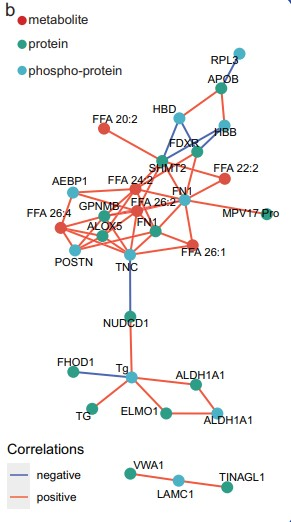
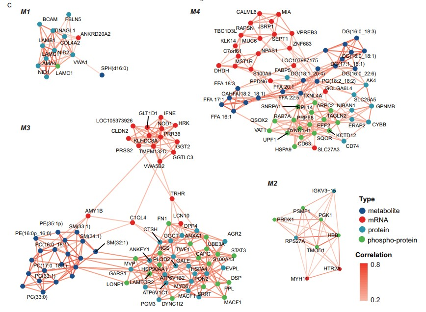
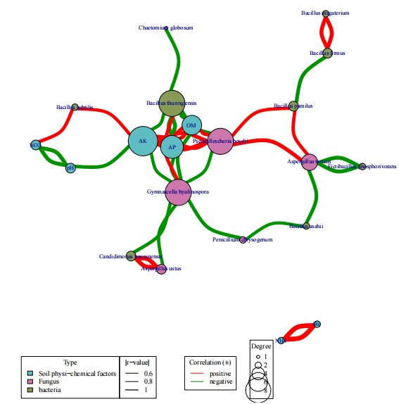
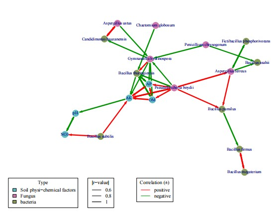
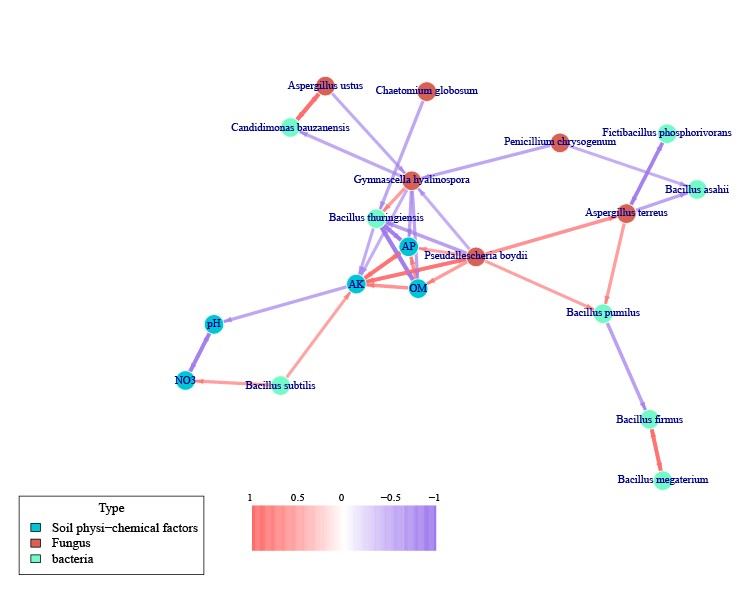
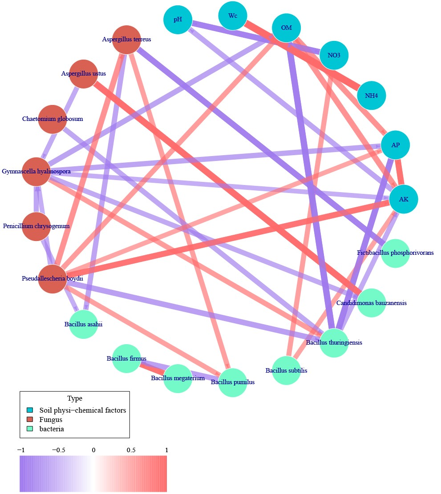
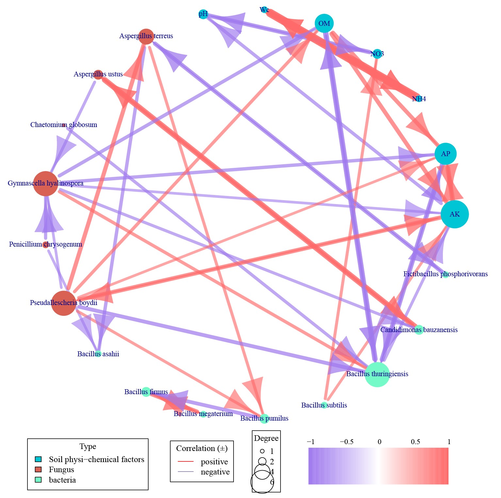

```{r setup, include=FALSE}
knitr::opts_chunk$set(
  collapse = T, echo=T, comment="#>", message=F, warning=F,
	fig.align="center", fig.width=5, fig.height=3, dpi=150)
```


The igraph Network Analysis scripts is referenced from MicrobiomeStatPlot [Inerst Reference below].

If you use this script, please cited 如果你使用本代码，请引用：

**Yong-Xin Liu**, Lei Chen, Tengfei Ma, Xiaofang Li, Maosheng Zheng, Xin Zhou, Liang Chen, Xubo Qian, Jiao Xi, Hongye Lu, Huiluo Cao, Xiaoya Ma, Bian Bian, Pengfan Zhang, Jiqiu Wu, Ren-You Gan, Baolei Jia, Linyang Sun, Zhicheng Ju, Yunyun Gao, **Tao Wen**, **Tong Chen**. 2023. EasyAmplicon: An easy-to-use, open-source, reproducible, and community-based pipeline for amplicon data analysis in microbiome research. **iMeta** 2(1): e83. https://doi.org/10.1002/imt2.83

The online version of this tuturial can be found in https://github.com/YongxinLiu/MicrobiomeStatPlot


**Authors**
First draft(初稿)：Defeng Bai(白德凤)；Proofreading(校对)：Ma Chuang(马闯) and Jiani Xun(荀佳妮)；Text tutorial(文字教程)：Defeng Bai(白德凤)


# Introduction简介

参考：https://mp.weixin.qq.com/s/ZSyOVR1Mmkc7CtRlTUodcg

微生物网络分析和网络图
微生物网络分析是研究微生物关系和组织结构的方法。它通过分析个体之间的连接(称为边)来研究微生物关系和微生物结构。微生物网络分析在微生物组领域应用广泛。网络图是微生物网络分析中常用的一种图形表示方法，也称为图论或图形理论。它是由节点(也称为顶点)和边组成的图形，用于描述网络中个体之间的连接关系。在网络图中，节点代表微生物，边代表微生物之间的连接。网络图中的节点可以用不同的颜色、大小、形状或标签来表示不同的属性或特征。网络图可以用来研究网络中的结构、中心性、密度、连通性等特征。

Microbial network analysis and network graphs
Microbial network analysis is a method for studying microbial relationships and organizational structures. It studies microbial relationships and microbial structures by analyzing the connections between individuals (called edges). Microbial network analysis is widely used in the field of microbiome. Network graphs are a commonly used graphical representation method in microbial network analysis, also known as graph theory or graph theory. It is a graph composed of nodes (also called vertices) and edges, which are used to describe the connection relationships between individuals in the network. In a network graph, nodes represent microorganisms and edges represent connections between microorganisms. Nodes in a network graph can be represented by different colors, sizes, shapes or labels to represent different attributes or characteristics. Network graphs can be used to study characteristics such as structure, centrality, density, connectivity, etc. in a network.

关于网络图的一些概念：
单模式：网络中的所有实体都是同一类型的实体。
多模式：网络节点可以是不同类型的。
无向网络：这些线被称为边缘，之所以称为边缘，是因为方向性不是该网络的突出特征。换句话说，两个人之间的联系在该网络中没有意义。因此，网络中这两个实体之间的联系被称为边缘。
有向网络是指它们之间的连接被称为弧线。它基本上有箭头。在这种情况下，连接的方向性或特别是连接的互易性对于每个网络都很重要。
无权网络有时也被称为二分网络或二进制网络，在这些网络中，边基本上可以取两个值之一。不存在零边或一边。
加权网络是一种网络，其中边缘可以取无限值，可以是 0 到 1，也可以是其他尺度。这种加权网络提供了更多信息。它让我们了解这种联系有多强。
最后需要注意的是，说到边，还有第三种边，称为循环。循环基本上是指一个人提名自己为平局的情况。这种情况并不常见。但有时这些信息可能很重要。
我之前在讨论网络之间的联系时使用的“提名”一词来自调查数据收集方法。我们使用提名的原因是，它提醒我们信息来自发起联系的人的视角。
第一种布局是层级布局，最经典的例子是家谱。另一种布局称为弹簧或能量布局。之所以称为弹簧或能量布局，是因为它使用顶点之间的距离来提供信息。在这种布局中，它具有能量或弹性的隐喻。这意味着距离较近的东西之间的能量就多得多，距离较远的东西之间的能量就少得多。
最后，在我们进入实验室之前，我想简单谈谈与网络相关的数据结构。有两种主要的数据结构——邻接矩阵和边列表。
由于网络源自图论，而图论是建立在矩阵之上的。邻接矩阵基本上通过一个值显示一个节点与另一个节点的相邻程度。矩阵的优点是它允许我们直接对网络进行数学运算。但矩阵的缺点是，在收集数据时，它并不总是符合人类的直觉，其次，矩阵是昂贵的数据，这意味着有很多我们不需要的信息。
有一种更高效、更人性化的数据表示，我们经常将其输入计算机，计算机将其转换为矩阵，以便我们进行这些操作和计算。这就是所谓的边列表。边列表有三个主要组成部分。它有一个首先发起连接的发送者，一个接收该连接的目标，以及一个权重，该权重基本上就是该连接强度。

Some concepts about network graphs:
Single-mode: All entities in the network are the same type of entity.
Multi-mode: Network nodes can be of different types.
Undirected network: The lines are called edges and they are called edges because directionality is not a prominent feature of this network. In other words, the connection between two people does not make sense in this network. So, the connection between these two entities in the network is called an edge.
Directed network is when the connection between them is called an arc. It basically has arrows. In this case, the directionality of the connection or especially the reciprocity of the connection is important for every network.
Unweighted networks are sometimes also called bipartite networks or binary networks where the edges can basically take one of two values. There is no zero edge or one edge.
Weighted networks are networks where the edges can take unlimited values, which can be from 0 to 1 or other scales. This weighted network provides more information. It gives us an idea of how strong the connection is.
Finally, it is important to note that when it comes to edges, there is a third type of edge called a loop. A loop basically refers to a situation where a person nominates himself as a tie. This situation is not common. But sometimes this information can be important.
The word "nomination" that I used earlier when discussing connections between networks comes from survey data collection methods. The reason we use nomination is that it reminds us that the information comes from the perspective of the person who initiated the connection.
The first layout is the hierarchical layout, the most classic example is the family tree. The other layout is called the spring or energy layout. It is called the spring or energy layout because it uses the distance between vertices to provide information. In this layout, it has the metaphor of energy or elasticity. This means that things that are closer have much more energy between them, and things that are farther away have much less energy between them.
Finally, before we get into the lab, I want to talk briefly about data structures related to networks. There are two main data structures - adjacency matrices and edge lists.
Since networks are derived from graph theory, and graph theory is built on matrices. The adjacency matrix basically shows how close one node is to another node through a value. The advantage of a matrix is that it allows us to do mathematical operations directly on the network. But the disadvantage of a matrix is that it does not always match human intuition when collecting data, and secondly, matrices are expensive data, which means there is a lot of information that we don't need.
There's a more efficient and more human-friendly representation of data that we often feed into computers, which convert it into matrices so that we can do these operations and calculations. It's called an edge list. An edge list has three main components. It has a sender that first initiated the connection, a target that receives that connection, and a weight, which is basically the strength of that connection.


关键字：微生物组数据分析、MicrobiomeStatPlot、igraph相关性网络分析、R语言可视化

Keywords: Microbiome analysis, MicrobiomeStatPlot, igraph Correlation Network Analysis , R visulization


## igraph绘制网络图案例

这是上海复旦大学癌症中心的Rongliang Shi团队2024年发表于Nature Communications上的一篇论文用到了网络图。论文题目为：Integrated proteogenomic and metabolomic characterization of papillary thyroid cancer with different recurrence risks. https://doi.org/10.1038/s41467-024-47581-1

This is a paper published in Nature Communications in 2024 by Rongliang Shi's team from the Cancer Center of Fudan University in Shanghai. The title of the paper is: Integrated proteogenomic and metabolomic characterization of papillary thyroid cancer with different recurrence risks. https://doi.org/10.1038/s41467-024-47581-1




Fig. 3 b Correlation network of the molecules showed significant differential expressions among different RRs.
图3b 分子相关网络显示不同RR之间存在显著的差异表达。

**结果**
The expression profiles of the RR-relevant molecules, especially for the FFAs (FFA 26:2, FFA 24:2, FFA 26:4) and several proteins or phosphoproteins were highly associated (Fig. 3b, spearman correlation >0.65 or Spearman correlation <−0.65). The FFA 26:2, Tg, FN1, and 5-Lipoxygenase (ALOX5), phospho-FN1, and phospho-TNC harbored a relative hub position in the correlation network, suggesting their crucial roles in interactive regulations or signaling communications. ALOX5, as a non-heme iron-containing enzyme, can catalyze the peroxidation of polyunsaturated fatty acids. 

RR 相关分子的表达谱，尤其是 FFA（FFA 26:2、FFA 24:2、FFA 26:4）和几种蛋白质或磷蛋白的表达谱高度相关（图 3b，Spearman 相关性 >0.65 或 Spearman 相关性 <-0.65）。FFA 26:2、Tg、FN1 和 5-脂氧合酶 (ALOX5)、磷酸化 FN1 和磷酸化 TNC 在相关网络中具有相对枢纽位置，表明它们在相互作用调控或信号传导中起着关键作用。ALOX5 是一种非血红素含铁酶，可以催化多不饱和脂肪酸的过氧化。



Fig. 4c Correlation network for four molecule modules (M1 to M4) based on the multi-omics. Source data are provided as a Source Data file
图 4c 基于多组学的四个分子模块（M1 至 M4）的关联网络。源数据以源数据文件的形式提供

**结果**

Their expressions were also associated with the proteins IGKV3-15, RPS27A, genes MYH11, and HTR2A (Fig. 4c). The third module (M3) was the largest module, and molecules in M3 mainly showed higher expressions in the tumor tissues (regardless of the RRs) than the matched normal tissues (Fig. 4b). There were three sub-modules in M3 which were aggregated by metabolites, genes and proteins/phosphoproteins (Fig. 4c, M3). The inter-correlated metabolites in M3 were mainly lipids, including phosphatidylcholines (PCs), phosphatidylethanolamines (PEs) and sphingomyelins (SMs). A large fraction of the proteins/phosph-proteins were involved in autophagy (STAT3/ATP6V1B2/ATP6V1C1/HGS/LAMTOR2/VPS13C/HSP90AA1)30. The genes were involved in glutathione metabolism (GGTLC3/GGT2), immune response (IFNE/PRSS2) and exocytosis secretion of thyroid stimulating hormone (TRHR). Meanwhile, TRHR, C1QL4 and AMY1B possessed inter-connection positions in the network of M3. Molecules in the fourth module (M4) mainly showed higher expressions in the intermediate and low RR groups (Fig. 4b). Metabolites including FFAs, Diacylglycerols (DGs) and Phosphatidylglycerols (PGs) and the fatty acid binding protein FABP5 formed an intermediated layer linking the genes and proteins or phosphoproteins in the network of M4, and multiple proteins and phosphoproteins (ERAP2/CYBB/CD74/DYNC1H1/RAB7A) in M4 were involved in antigen processing and presenting30 (Fig. 4c), indicating the potential interactions between fatty acid metabolism and adaptive immune functions in PTC

它们的表达还与蛋白质IGKV3-15、RPS27A、基因MYH11和HTR2A相关（图4c）。第三个模块（M3）是最大的模块，M3中的分子主要在肿瘤组织（无论RR如何）中表现出高于匹配的正常组织的表达（图4b）。M3中有三个子模块，由代谢物、基因和蛋白质/磷蛋白聚合（图4c，M3）。M3中相互关联的代谢物主要是脂质，包括磷脂酰胆碱（PC）、磷脂酰乙醇胺（PE）和鞘磷脂（SM）。大部分蛋白质/磷酸化蛋白质参与自噬（STAT3/ATP6V1B2/ATP6V1C1/HGS/LAMTOR2/VPS13C/HSP90AA1）30。这些基因参与谷胱甘肽代谢（GGTLC3/GGT2）、免疫反应（IFNE/PRSS2）和促甲状腺激素（TRHR）的胞吐分泌。同时，TRHR、C1QL4和AMY1B在M3网络中具有相互连接的位置。第四模块（M4）中的分子主要在中低RR组中表现出较高的表达（图4b）。包括FFA、二酰甘油（DG）和磷脂酰甘油（PG）在内的代谢物以及脂肪酸结合蛋白FABP5形成了一个中间层，连接M4网络中的基因和蛋白质或磷蛋白，M4中的多种蛋白质和磷蛋白（ERAP2/CYBB/CD74/DYNC1H1/RAB7A）参与抗原加工和呈递30（图4c），这表明PTC中脂肪酸代谢和适应性免疫功能之间存在潜在的相互作用


## Packages installation软件包安装

```{r}
# 基于CRAN安装R包，检测没有则安装 Installing R packages based on CRAN and installing them if they are not detected
p_list = c("tidyverse", "igraph",  "psych")
for(p in p_list){if (!requireNamespace(p)){install.packages(p)}
    library(p, character.only = TRUE, quietly = TRUE, warn.conflicts = FALSE)}

# 加载R包 Loading R packages
suppressWarnings(suppressMessages(library(tidyverse)))
suppressWarnings(suppressMessages(library(igraph)))
suppressWarnings(suppressMessages(library(psych)))
```


# igraph Network Analysis Tutorial igraph网络分析

## igraph软件包R语言实战

igraph package R language practice
igraph包简介：igraph是一个用于创建、操作和分析图形和网络的R语言包。它提供了一系列函数和工具，可以用来创建和可视化复杂网络、计算各种网络的度量和属性，以及实现基于网络的算法和分析。
igraph package introduction: igraph is an R language package for creating, manipulating, and analyzing graphs and networks. It provides a series of functions and tools that can be used to create and visualize complex networks, calculate various network metrics and properties, and implement network-based algorithms and analysis.

网络图分析多组学之间的相关性(igraph)
Network graph analysis of correlations between multiple omics (igraph)

参考：https://mp.weixin.qq.com/s/v6CTOtuoIbZ_9PYM-sA6mw
https://mp.weixin.qq.com/s/7cGrCcbLrWv7JeVxnAvo-w


### 导入数据，确定相关关系

```{r data_preparation, fig.show='asis', fig.width=4, fig.height=2.5}
# 数据准备
# data preparation
data <- read.csv("data/data.csv",header = TRUE,
                  row.names = 1,
                  check.names=FALSE,
                  comment.char = "")

type = read.csv("data/type.csv",header = TRUE,check.names = FALSE)

# 确定相关性关系
# Determine the correlation relationship
cor <- corr.test(data, use = "pairwise",method="spearman",adjust="holm", alpha=.05,ci=FALSE)
cor.r <- data.frame(cor$r) 
cor.p <- data.frame(cor$p) 
colnames(cor.r) = rownames(cor.r)
colnames(cor.p) = rownames(cor.p) 
write.csv(cor.r,"results/cor.r.csv",quote = FALSE,col.names = NA,row.names = TRUE)
write.csv(cor.p,"results/cor.p.csv",quote = FALSE,col.names = NA,row.names = TRUE)

knitr::kable(
  head(cor.r),
  caption = "cor.r"
)

# 保留p<=0.05且abs(r)>=0.6的变量间相关关系
# Keep the correlation between variables with p<=0.05 and abs(r)>=0.6
cor.r$node1 = rownames(cor.r) 
cor.p$node1 = rownames(cor.p)

r = cor.r %>% 
  gather(key = "node2", value = "r", -node1) %>%
  data.frame()

p = cor.p %>% 
  gather(key = "node2", value = "p", -node1) %>%
  data.frame()

# 将r和p值合并为一个数据表
# Combine r and p values into one data table
cor.data <- merge(r,p,by=c("node1","node2"))

# 保留p<=0.05且abs(r)>=0.6的变量间相关关系，并添加网络属性
# Keep the correlation between variables with p<=0.05 and abs(r)>=0.6, and add network attributes
cor.data <- cor.data %>%
  filter(abs(r) >= 0.6, p <= 0.05, node1 != node2) %>%
  plyr::mutate(
    linetype = ifelse(r > 0,"positive","negative"), 
    linesize = abs(r) 
    ) 

```


### 构建网络图数据结构
Constructing the network graph data structure

此步构建网络之后，还需要将网络图转换为简单图，去除重复链接。
After building the network in this step, you also need to convert the network graph into a simple graph and remove duplicate links.

```{r Constructing the network graph data structure, fig.show='asis', fig.width=4, fig.height=2.5}
# 网络图节点属性整理
# Network graph node attribute arrangement
## 计算每个节点具有的链接数
## Calculate the number of links each node has
c(as.character(cor.data$node1),as.character(cor.data$node2)) %>%
  as_tibble() %>%
  group_by(value) %>%
  tidytree::summarize(n=n()) -> vertices
colnames(vertices) <- c("node", "n")

## 添加变量分类属性
## Add variable classification attributes
vertices %>%
  select(-n) %>% 
  left_join(type,by="node") -> vertices 

## 网络图中节点会按照节点属性文件的顺序依次绘制，为了使同类型变量位置靠近，按照节点属性对节点进行排序。
## The nodes in the network diagram will be drawn in sequence according to the order of the node attribute file. In order to make the variables of the same type close together, the nodes are sorted according to the node attributes.
vertices$type = factor(vertices$type,levels = unique(vertices$type))
vertices = tidytree::arrange(vertices,type)
write.csv(vertices,"results/vertices.csv",quote = FALSE,col.names = NA,row.names = FALSE)
head(vertices)

## 构建graph结构数据
## Build graph structure data
g <- graph_from_data_frame(cor.data, vertices = vertices, directed = FALSE )
g <- graph_from_data_frame(cor.data, vertices = vertices, directed = TRUE )

vcount(g) 
ecount(g)
```


### 简单图
Simple Graph

```{r Simple Graph, fig.show='asis', fig.width=4, fig.height=2.5}
# 非简单图，链接数会偏高，所以需要转换为简单图。
# For non-simple graphs, the number of links will be too high, so it needs to be converted to a simple graph.
is.simple(g) 
E(g)$weight <- 1
g <- igraph::simplify(g,
                      remove.multiple = TRUE,
                      remove.loops = TRUE,
                      edge.attr.comb = "first")
# g <- delete.vertices(g,which(degree(g) == 0)) 
# 删除孤立点(Delete isolated points)
is.simple(g)
E(g)$weight <- 1
is.weighted(g)
vcount(g)
ecount(g)

## 计算节点链接数
## Calculating the number of node links
V(g)$degree <- igraph::degree(g)

## graph保存到本地
## Save the graph locally
write.graph(g,file = "results/all.gml",format="gml") 
net.data  <- igraph::as_data_frame(g, what = "both")$edges 
write.csv(net.data,"results/net.data.csv",quote = FALSE,col.names = NA,row.names = FALSE) 
head(net.data)

vertices  <- igraph::as_data_frame(g, what = "both")$vertices 
write.csv(vertices,"results/vertices.csv",quote = FALSE,col.names = NA,row.names = FALSE)
```


### 绘制分组网络图
Draw a group network diagram

图属性Graph properties：
1) 节点根据分类属性填充颜色和背景色；
1) The node is filled with color and background color according to the classification attribute;
2) 节点大小按degree设置；
2) The node size is set by degree;
3) 链接线根据正负相关性设置颜色；
3) Link lines are colored based on positive or negative correlation;
4) 链接线宽度根据abs(r)设置。
4) The link line width is set according to abs(r).
绘图前先确定网络图中的节点位置，即计算每个节点的(x，y)坐标，igraph包中有多个图布局计算函数，可根据不同的算法计算出网络图中的节点坐标位置。
Before drawing, determine the node positions in the network graph, that is, calculate the (x, y) coordinates of each node. The igraph package has multiple graph layout calculation functions that can calculate the node coordinate positions in the network graph according to different algorithms.

```{r Draw a group network diagram, fig.show='asis', fig.width=4, fig.height=2.5}
# 准备网络图布局数据
# Preparing network diagram layout data。
layout1 <- layout_in_circle(g) 
layout2 <- layout_with_fr(g) 
layout3 <- layout_on_grid(g)
layout4 <- layout_nicely(g) 
layout5 <- layout_with_graphopt(g)

## 设置绘图颜色
## Setting the drawing color
color <- c("#5ebcc2","#ce77ad","#879b56")

names(color) <- unique(V(g)$type) 
V(g)$point.col <- color[match(V(g)$type,names(color))] 

## 边颜色按照相关性正负设置
## The edge color is set according to the positive or negative correlation
E(g)$color <- ifelse(E(g)$linetype == "positive","red",rgb(0,147,0,maxColorValue = 255))
```


### 绘制fr布局网络图-不添加背景色
Draw fr layout network diagram-no background color

```{r fr, fig.show='asis', fig.width=4, fig.height=2.5}
# 绘制fr布局网络图-不添加背景色
pdf("results/network_group_fr.pdf",family = "Times",width = 10,height = 12)
par(mar=c(5,2,1,2))
plot.igraph(g, layout=layout2,
     # 节点颜色设置参数
     vertex.color=V(g)$point.col,
     vertex.frame.color ="black",
     vertex.border=V(g)$point.col,
     vertex.size=V(g)$degree*2,
     vertex.label=g$name,
     vertex.label.cex=0.8,
     vertex.label.col="black",
     edge.arrow.size=0.5,
     edge.width=abs(E(g)$r)*12,
     edge.curved = TRUE
     )
# 设置图例
legend(
  title = "Type",
  list(x = min(layout1[,1])-0.1,
       y = min(layout1[,2])-0.10), 
  legend = c(unique(V(g)$type)),
  fill = color,
  #pch=1
)

legend(
  title = "|r-value|",
  list(x = min(layout1[,1])+0.5,
       y = min(layout1[,2])-0.10),
  legend = c(0.6,0.8,1.0),
  col = "black",
  lty=1,
  lwd=c(0.6,0.8,1.0)*2,
)

legend(
  title = "Correlation (±)",
  list(x = min(layout1[,1])+0.9,
       y = min(layout1[,2])-0.10),
  legend = c("positive","negative"),
  col = c("red",rgb(0,147,0,maxColorValue = 255)),
  lty=1,
  lwd=1
)

legend(
  title = "Degree",
  list(x = min(layout1[,1])+1.3,
       y = min(layout1[,2])-0.0),
  legend = c(1,seq(0,8,2)[-1]),# max(V(g)$degree)
  col = "black",
  pch=1,
  pt.lwd=1,
  pt.cex=c(1,seq(0,8,2)[-1])
)
dev.off()
```




### 绘制graphopt布局网络图-不添加背景色
Draw a graphopt layout network diagram - without adding background color

```{r graphopt, fig.show='asis', fig.width=4, fig.height=2.5}
pdf("results/network_group_graphopt.pdf",family = "Times",width = 10,height = 12)
par(mar=c(5,2,1,2))
plot.igraph(g, layout=layout5,
     vertex.color=V(g)$point.col,
     vertex.border=V(g)$point.col,
     vertex.size=6,
     vertex.frame.color="white",
     vertex.label=g$name,
     vertex.label.cex=0.8,
     vertex.label.dist=0, 
     vertex.label.degree = pi/2,
     vertex.label.col="black",
     edge.arrow.size=0.5,
     edge.width=abs(E(g)$r)*6,
     )

# 设置图例
legend(
  title = "Type",
  list(x = min(layout1[,1])-0.05,
       y = min(layout1[,2])-0.05), 
  legend = c(unique(V(g)$type)),
  fill = color,
  #pch=1
)

legend(
  title = "|r-value|",
  list(x = min(layout1[,1])+0.6,
       y = min(layout1[,2])-0.05),
  legend = c(0.6,0.8,1.0),
  col = "black",
  lty=1,
  lwd=c(0.6,0.8,1.0)*2,
)

legend(
  title = "Correlation (±)",
  list(x = min(layout1[,1])+1.0,
       y = min(layout1[,2])-0.05),
  legend = c("positive","negative"),
  col = c("red",rgb(0,147,0,maxColorValue = 255)),
  lty=1,
  lwd=1
)
dev.off()
```




### 设置边渐变颜色表示相关性强弱，相关性越强颜色越深
Set the edge gradient color to indicate the strength of the correlation. The stronger the correlation, the darker the color.

```{r edge gradient color, fig.show='asis', fig.width=4, fig.height=2.5}
# 设置绘图颜色
color <- c("#00c5d4","#d86154","#74fac8")

names(color) <- unique(V(g)$type) 
V(g)$point.col <- color[match(V(g)$type,names(color))] 

## 边颜色按照相关性正负设置
E(g)$color = ifelse(E(g)$r>0,rgb(255/255,106/255,106/255,abs(E(g)$r)),rgb(159/255,121/255,238/255,abs(E(g)$r)))
```


### graphopt布局网络图

```{r graphopt2, fig.show='asis', fig.width=4, fig.height=2.5}
pdf("results/network_group_graphopt3.pdf",family = "Times",width = 10,height = 12)
par(mar=c(5,2,1,2))
plot.igraph(g, layout=layout5,
     vertex.color=V(g)$point.col,
     vertex.border=V(g)$point.col,
     vertex.size=6,
     vertex.frame.color="white",
     vertex.label=g$name,
     vertex.label.cex=0.8,
     vertex.label.dist=0, 
     vertex.label.degree = pi/2, 
     vertex.label.col="black",
     edge.arrow.size=0.5,
     edge.width=abs(E(g)$r)*6,
     )

# 设置图例
legend(
  title = "Type",
  list(x = min(layout1[,1])-0.1,
       y = min(layout1[,2])-0.05),
  legend = c(unique(V(g)$type)),
  fill = color,
  #pch=1
)

dev.off()

# 绘制图例
pdf("results/network_group_graphopt3_legend.pdf",family = "Times",width = 10,height = 3)
#color_legend = c(rgb(254/255,67/255,101/255,seq(1,0,by=-0.01)),rgb(0/255,0/255,255/255,seq(0,1,by=0.01)))
color_legend = c(rgb(255/255,106/255,106/255,seq(1,0,by=-0.01)),rgb(159/255,121/255,238/255,seq(0,1,by=0.01)))
par(mar=c(2,2,1,2),xpd = T,cex.axis=1.6,las=1)
barplot(rep(1,length(color_legend)),border = NA, space = 0,ylab="",xlab="",xlim=c(1,length(color_legend)),horiz=FALSE,
        axes = F, col=color_legend,main="")
axis(3,at=seq(1,length(color_legend),length=5),c(1,0.5,0,-0.5,-1),tick=FALSE)
dev.off()
```





### circle布局网络图

```{r circle, fig.show='asis', fig.width=4, fig.height=2.5}
pdf("results/network_group_circle3.pdf",family = "Times",width = 10,height = 12)
par(mar=c(5,2,1,2))
plot.igraph(g, layout=layout1,
     vertex.color=V(g)$point.col,
     vertex.border=V(g)$point.col,
     vertex.size=16,
     vertex.frame.color="white",
     vertex.label=g$name,
     vertex.label.cex=0.8,
     vertex.label.dist=0, 
     vertex.label.degree = pi/2, 
     vertex.label.col="black",
     edge.arrow.size=0.5,
     edge.width=abs(E(g)$r)*16
     )

# 设置图例
legend(
  title = "Type",
  list(x = min(layout1[,1])-0.1,
       y = min(layout1[,2])-0.05),
  legend = c(unique(V(g)$type)),
  fill = color,
  #pch=1
)

dev.off()

# 绘制图例
pdf("results/network_group_circle3_legend.pdf",family = "Times",width = 10,height = 3)
#color_legend = c(rgb(254/255,67/255,101/255,seq(1,0,by=-0.01)),rgb(0/255,0/255,255/255,seq(0,1,by=0.01)))
color_legend = c(rgb(159/255,121/255,238/255,seq(1,0,by=-0.01)),rgb(255/255,106/255,106/255,seq(0,1,by=0.01)))
par(mar=c(2,2,1,2),xpd = T,cex.axis=1.6,las=1)
barplot(rep(1,length(color_legend)),border = NA, space = 0,ylab="",xlab="",xlim=c(1,length(color_legend)),horiz=FALSE,
        axes = F, col=color_legend,main="")
axis(3,at=seq(1,length(color_legend),length=5),c(-1,-0.5,0,0.5,1),tick=FALSE)
dev.off()
```




### 径向布局网络图
radial network diagrams

```{r circle2, fig.show='asis', fig.width=4, fig.height=2.5}
pdf("results/network_group_circle7.pdf",family = "Times",width = 10,height = 12)
par(mar=c(5,2,1,2))
plot.igraph(g, layout=layout1,
     vertex.color=V(g)$point.col,
     vertex.frame.color =V(g)$point.col,
     vertex.border=V(g)$point.col,
     shape = 1,
     vertex.size=V(g)$degree*1.5, 
     rescale =TRUE, 
     vertex.label=g$name,
     vertex.label.cex=0.8,
     vertex.label.dist=0, 
     vertex.label.col="white",
     mark.col=color,
     mark.border=color,
     edge.arrow.size=3.5,
     edge.width=abs(-log10(E(g)$p))*2,
     #edge.curved = TRUE
     edge.curved = FALSE
     )

# 设置图例
legend(
  title = "Type",
  list(x = min(layout1[,1])-0.1,
       y = min(layout1[,2])-0.10), 
  legend = c(unique(V(g)$type)),
  fill = color,
  #pch=1
)

legend(
  title = "|r-value|",
  list(x = min(layout1[,1])+0.5,
       y = min(layout1[,2])-0.10),
  legend = c(0.6,0.8,1.0),
  col = "black",
  lty=1,
  lwd=c(0.6,0.8,1.0)*2,
)

legend(
  title = "Correlation (±)",
  list(x = min(layout1[,1])+0.9,
       y = min(layout1[,2])-0.10),
  legend = c("positive","negative"),
  #col = c("red",rgb(0,147,0,maxColorValue = 255)),
  col = c("red","#7a76b7"),
  lty=1,
  lwd=1
)

legend(
  title = "Degree",
  list(x = min(layout1[,1])+1.3,
       y = min(layout1[,2])-0.05),
  legend = c(1,seq(0,6,2)[-1]),
  col = "black",
  pch=1,
  pt.lwd=1,
  pt.cex=c(1,seq(0,6,2)[-1])
)
dev.off()
```




If used this script, please cited:
使用此脚本，请引用下文：

**Yong-Xin Liu**, Lei Chen, Tengfei Ma, Xiaofang Li, Maosheng Zheng, Xin Zhou, Liang Chen, Xubo Qian, Jiao Xi, Hongye Lu, Huiluo Cao, Xiaoya Ma, Bian Bian, Pengfan Zhang, Jiqiu Wu, Ren-You Gan, Baolei Jia, Linyang Sun, Zhicheng Ju, Yunyun Gao, **Tao Wen**, **Tong Chen**. 2023. EasyAmplicon: An easy-to-use, open-source, reproducible, and community-based pipeline for amplicon data analysis in microbiome research. **iMeta** 2: e83. https://doi.org/10.1002/imt2.83

Copyright 2016-2024 Defeng Bai <baidefeng@caas.cn>, Chuang Ma <22720765@stu.ahau.edu.cn>, Jiani Xun <15231572937@163.com>, Yong-Xin Liu <liuyongxin@caas.cn>


