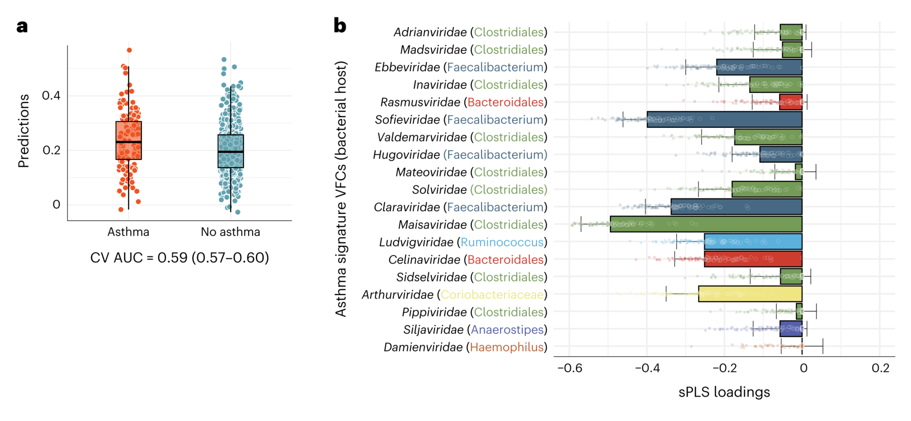
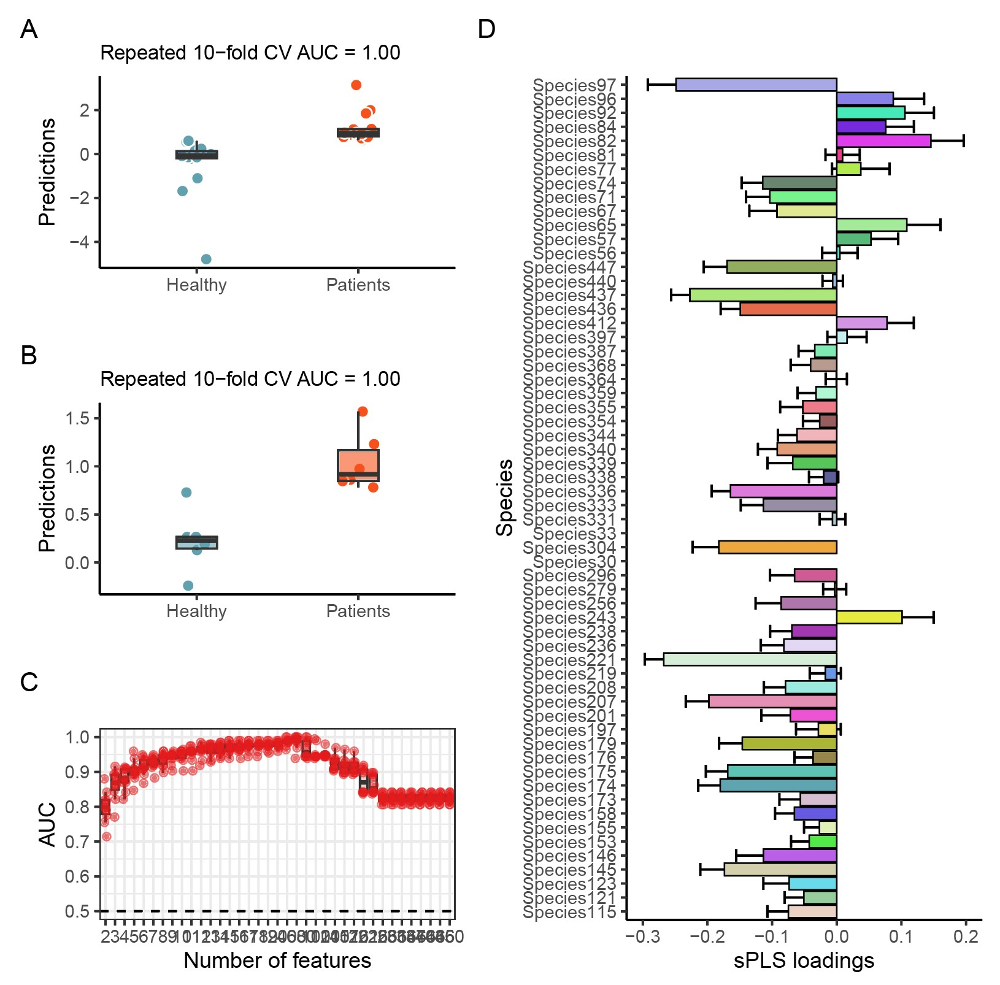

```{r setup, include=FALSE}
knitr::opts_chunk$set(
  collapse = T, echo=T, comment="#>", message=F, warning=F,
	fig.align="center", fig.width=5, fig.height=3, dpi=150)
```


The Sparse partial least-squares regression analysis scripts is referenced from MicrobiomeStatPlot [Inerst Reference below].


If you use this script, please cited 如果你使用本代码，请引用：

**Yong-Xin Liu**, Lei Chen, Tengfei Ma, Xiaofang Li, Maosheng Zheng, Xin Zhou, Liang Chen, Xubo Qian, Jiao Xi, Hongye Lu, Huiluo Cao, Xiaoya Ma, Bian Bian, Pengfan Zhang, Jiqiu Wu, Ren-You Gan, Baolei Jia, Linyang Sun, Zhicheng Ju, Yunyun Gao, **Tao Wen**, **Tong Chen**. 2023. EasyAmplicon: An easy-to-use, open-source, reproducible, and community-based pipeline for amplicon data analysis in microbiome research. **iMeta** 2(1): e83. https://doi.org/10.1002/imt2.83

The online version of this tuturial can be found in https://github.com/YongxinLiu/MicrobiomeStatPlot


**Authors**
First draft(初稿)：Defeng Bai(白德凤)；Proofreading(校对)：Ma Chuang(马闯) and Xun Jiani(荀佳妮)；Text tutorial(文字教程)：Defeng Bai(白德凤)


# Introduction简介

什么是sPLS？
What is sPLS?
sPLS, Sparse partial least-squares regression, 稀疏偏最小二乘回归

最小二乘法，又称最小平方法，是一种数学优化建模方法。它通过最小化误差的平方和寻找数据的最佳函数匹配。利用最小二乘法可以简便的求得未知的数据，并使得求得的数据与实际数据之间误差的平方和为最小。偏最小二乘（PLS）最大化潜在变量之间的协方差，而不是相关性，它能够同时对多个响应变量进行建模，并处理嘈杂的相关变量，但在对高维数据进行操作时，其可解释性受到影响。sPLS(稀疏偏最小二乘法)在PLS的基础上，综合运用PCA,CCA和LASSO三种模型，将高维数据降维，提取主成分，开展相关性分析，使用LASSO罚分测虐挑选出核心元素，最终输出样本分布图和两组学强相关的元素集合，最后通过相关性散点图呈现关键物种和代谢物。稀疏偏最小二乘回归方法在PLS中内置了变量选择过程，并且在融合两组组学和对结果的生物学解释方面有良好的性能。也就是将lasso惩罚变量选择法加入了PLS。

The least squares method, also known as the least squares method, is a mathematical optimization modeling method. It finds the best function match for the data by minimizing the sum of squared errors. The use of the least squares method can easily obtain unknown data and minimize the sum of squared errors between the obtained data and the actual data. Partial Least Squares (PLS) maximize the covariance between latent variables, rather than correlation. It can model multiple response variables simultaneously and handle noisy correlated variables, but its interpretability is affected when operating on high-dimensional data. SPLS (Sparse Partial Least Squares) combines PCA, CCA, and LASSO models on the basis of PLS to reduce the dimensionality of high-dimensional data, extract principal components, conduct correlation analysis, use LASSO penalty score to select core elements, and finally output a sample distribution map and a set of strongly correlated elements between two omics. Finally, key species and metabolites are presented through a correlation scatter plot. The sparse partial least squares regression method has a built-in variable selection process in PLS and performs well in integrating two omics and biological interpretation of the results. That is to say, the Lasso penalty variable selection method was added to PLS.


关键字：微生物组数据分析、MicrobiomeStatPlot、稀疏偏最小二乘回归分析、R语言可视化

Keywords: Microbiome analysis, MicrobiomeStatPlot, Sparse partial least-squares regression analysis, R visulization


## SPLS analysis case sPLS分析案例


这是Jakob Stokholm课题组2023年发表于Nature Medicine上的文章，第一作者为Cristina Leal Rodríguez，题目为：The infant gut virome is associated with preschool asthma risk independently of bacteria. https://doi.org/10.1038/s41591-023-02685-x

This is an article published by the Jakob Stokholm research group in Nature Medicine in 2023. The first author is Cristina Leal Rodr í guez, and the title is: The incident gut virus is associated with pre-school astroma risk independently of bacteria. https://doi.org/10.1038/s41591-023-02685-x


Fig. 3 a, AUC from repeated tenfold cross-validation (CV) of an sPLS model for core temperate VFCs at 1 year of age and preschool asthma (n = 133 out of 498). The box plots represent the class predictions for the median cross-validated model. The center of the boxes represents the median, their bounds represent the 25th and 75th percentiles and the lower and upper ends of whiskers represent the smallest and largest values, respectively, no further than 1.5 × IQR from the respective end of the box plot. b, Representation of the 19 signature VFCs (all caudoviruses) contributing to the optimal set of loadings for the ten-times repeated tenfold cross-validation sPLS model (n = 100) using the entire cohort (n = 631). Bars depict the median across repeats ± s.d. VFCs are sorted from top to bottom based on their mean relative abundance (higher to lower) and colored by their most frequent host (predicted by sequence similarity). All VFCs presented negative loadings, implying that they were present at lower abundances in the relative space of the core temperate virome in the infant gut of children later developing asthma compared to controls (n = 133 out of 498).

图3 a，1岁时核心温带VFCs和学龄前哮喘的sPLS模型的重复十倍交叉验证（CV）的AUC（498个中n=133）。方框图表示中值交叉验证模型的类别预测。方框的中心表示中值，其边界表示第25个和第75个百分位数，胡须的下端和上端分别表示最小值和最大值，距离方框图的各个端部不超过1.5×IQR。b、使用整个队列（n=631），对十次重复十倍交叉验证的sPLS模型（n=100）的最佳载荷集做出贡献的19个特征VFC（所有caudoviruse）的表示。条形图描绘了重复±s.d.之间的中位数。VFC根据其平均相对丰度（从高到低）从上到下排序，并按其最频繁的宿主着色（通过序列相似性预测）。所有VFCs均呈负负荷，这意味着与对照组相比，它们在后来发展为哮喘的儿童的婴儿肠道中核心温带病毒组的相对空间中的丰度较低（498个中n=133）。

**结果**：

As the compositional differences were observed primarily in the temperate virome, we then aimed to identify the smallest possible set of covariant core temperate phage families that were associated with the development of asthma, and computed a virome asthma signature score for each child. This was achieved by a repeated tenfold cross-validated sparse partial least squares (sPLS) model, which accomplished adequate performance with a cross-validated median repeat area under the curve (AUC) of 0.59 (0.57–0.60) (Fig. 3a). The model selected a minimal set of 19 temperate VFCs that were jointly associated with later asthma (Fig. 3b). An increase of one standard deviation in the virome asthma score corresponded to a 34% increase in the odds of developing asthma by 5 years of age (OR = 1.34 (1.11–1.62); P = 0.002). 

由于主要在温带病毒组中观察到成分差异，因此我们旨在确定与哮喘发展相关的尽可能小的协变核心温和噬菌体科，并计算每个儿童的病毒组哮喘特征得分。这是通过重复的十倍交叉验证的稀疏偏最小二乘（sPLS）模型实现的，该模型实现了足够的性能，交叉验证的曲线下重复面积中位数（AUC）为0.59（0.57–0.60）（图第3a段）。该模型选择了一组最小的19个与后期哮喘共同相关的温带VFC（图第3b段）。病毒性哮喘评分增加一个标准差，5岁时患哮喘的几率增加34%（OR=1.34（1.11-1.62）；P＝0.002）。


## Packages installation软件包安装

```{r}
# 基于CRAN安装R包，检测没有则安装
p_list = c("RColorBrewer","mlbench","doParallel","caret","pROC","tidyverse","ggsci",
           "randomcoloR", "patchwork")
for(p in p_list){if (!requireNamespace(p)){install.packages(p)}
    library(p, character.only = TRUE, quietly = TRUE, warn.conflicts = FALSE)}
# doMC如果安装不成功，需要在https://cran.rstudio.com/web/packages/doMC/index.html下载软件包在本地安装

# 基于Bioconductor安装R包
if (!requireNamespace("mixOmics", quietly = TRUE))
    BiocManager::install("mixOmics")

# 基于github安装
library(devtools)
if(!requireNamespace("mixOmicsCaret", quietly = TRUE))
  install_github("jonathanth/mixOmicsCaret")
if(!requireNamespace("copiome", quietly = TRUE))
  install_github("jonathanth/copiome@main")

# 加载R包 Load the package
suppressWarnings(suppressMessages(library(RColorBrewer)))
suppressWarnings(suppressMessages(library(mixOmics)))
suppressWarnings(suppressMessages(library(mlbench)))
#suppressWarnings(suppressMessages(library(doMC)))
suppressWarnings(suppressMessages(library(doParallel)))
suppressWarnings(suppressMessages(library(caret)))
suppressWarnings(suppressMessages(library(pROC)))
suppressWarnings(suppressMessages(library(tidyverse)))
suppressWarnings(suppressMessages(library(ggsci)))
suppressWarnings(suppressMessages(library(randomcoloR)))
suppressWarnings(suppressMessages(library(mixOmicsCaret)))
suppressWarnings(suppressMessages(library(copiome)))
suppressWarnings(suppressMessages(library(conflicted)))

conflicts_prefer(dplyr::select)
conflicts_prefer(dplyr::filter)
```


# Sparse partial least-squares regression analysis稀疏偏最小二乘回归分析

## SPLS analysis in practice sPLS分析实战

利用偏最小二乘回归选择生物标志物
Using sparse partial least-squares regression model to select microbiome biomarkers

参考：https://jonathanth.github.io/mixOmics_examples.html; https://github.com/crlero/vir2asth/blob/main/6-classification.Rmd

```{r sPLS, fig.show='asis', fig.width=4, fig.height=2.5}
# 进行AUC值箱线图绘制的函数
# Plot PLS-DA model components AUC distribution
auc_components_plot = function(plsmodel) {
  plsmodel$pred %>%
    separate(Resample, c("Fold", "Rep")) %>%
    group_by(ncomp, keepX, Rep) %>%
    summarize(auc = as.numeric(pROC::auc(predictor = pred, obs, direction = "<"))) %T>%
    { mx <<- max(.$auc); mn <<- min(.$auc) } %>%
    ggplot(., aes(x = factor(keepX), y = auc, fill=factor(ncomp))) +
    geom_boxplot(outlier.shape = NA, alpha=0.25) +
    geom_point(aes(color=factor(ncomp)),
               alpha=0.6,
               position=position_jitter(w=0.15, h=0)) +
    guides(fill="none", color="none") +
    facet_wrap(~ ncomp) +
    geom_hline(yintercept = 0.5, lwd=.5, linetype=2) +
    scale_color_brewer(palette = "Set1", name = NULL) +
    theme_bw() + theme(strip.background = element_blank()) +
    xlab("Number of features") + ylab("AUC")
}

# Multithreading in caret
# 多线程运行
#registerDoMC(cores = 2)
registerDoParallel(cores = 2)

# Load data
# 载入数据
spls_data <- read.table(file = "data/data_spls.txt", sep = "\t", header = T, row.names=1)

# Partition the data into a training set and a test set
# 将数据分成训练集和测试集
data_split <- createDataPartition(spls_data$group, p = .70, list = FALSE)
training_data <- spls_data[ data_split,]
testing_data  <- spls_data[-data_split,]

# 5 repeats and 10-fold cross validation
# 5次重复和10倍交叉验证
repCV10 <- trainControl(method = "repeatedcv", 
                        number = 10, 
                        repeats = 10, 
                        returnResamp = "all", 
                        savePredictions = "all", 
                        allowParallel = T, 
                        verboseIter = F)

# Set keepX
# 设置keepX
keepX_list = c(seq(2,20,1),
               seq(20, floor(ncol(training_data)/3),20),
               seq(ceiling(ncol(training_data)/3), floor(ncol(training_data)/2),25),
               seq(ceiling(ncol(training_data)/2), ncol(training_data)-1,30),
               ncol(training_data)-1)

# Run model
# 运行模型
# fixX=c()可以允许设置每个成分的预测因子的数量
set.seed(666)
sPLS_model <- suppressWarnings(suppressMessages(train(as.numeric(group == "Patients") ~ ., data = training_data,
                  method = get_mixOmics_spls(),
                  preProc = c("center", "scale"),
                  metric = "Rsquared",
                  tuneGrid = expand.grid(ncomp = 1, 
                                         keepX = keepX_list, 
                                         keepY = 1),
                  trControl = repCV10,
                  fixX = c())))
#sPLS_model

reps_auc <- sPLS_model |>
  get_best_predictions() |>
  group_by(Rep) |>
  summarize(auc = as.numeric(pROC::auc(obs, pred, direction = "<")))|>
  arrange(desc(auc))

# print AUC for each repeat
# 查看每一次重复的AUC值
# reps_auc

# extract best repetition
# 提取最佳重复
bestRep <- sPLS_model |>
  get_best_predictions() |> group_by(Rep) |>
  summarize(auc = as.numeric(pROC::auc(obs, pred, direction = "<"))) |>
  arrange(desc(auc)) |>
  (\(x) x[1, "Rep"])() |>
  as.character()

# extract predictions
# 基于最佳重复提取预测值
savedPreds <- sPLS_model |>
  get_best_predictions() |>
  dplyr::filter(Rep == bestRep)
cvauc.train <- auc(obs ~ pred, direction = "<", data = savedPreds)
cvauc.train

# plot AUC
# AUC值箱线图
vfc_auc_1round <- auc_components_plot(sPLS_model)
ggsave("results/cross_validation_auc.pdf", device="pdf", dpi=300, height=4, width=6)
#vfc_auc_1round

# Tune the model
# 调整参数
registerDoParallel(cores = 2)
set.seed(666)
sPLS_model2 <- suppressWarnings(suppressMessages(train(as.numeric(group == "Patients") ~ .,
                      data = training_data,
                      method = get_mixOmics_spls(),
                      preProc = c("center", "scale"),
                      metric = "Rsquared",
                      tuneGrid = expand.grid(ncomp = 1,
                                             keepX = 60, 
                                             keepY = 1),
                      trControl = repCV10, fixX = c(60))))

reps_auc <- sPLS_model2 |> 
  get_best_predictions() |> 
  group_by(Rep) |> 
  summarize(auc = as.numeric(pROC::auc(obs, pred, direction = "<")))|> 
  arrange(desc(auc))
#reps_auc

bestRep <- sPLS_model2 |> 
  get_best_predictions() |> group_by(Rep) |> 
  summarize(auc = as.numeric(pROC::auc(obs, pred, direction = "<"))) |>
  arrange(desc(auc)) |>
  (\(x) x[1, "Rep"])() |> 
  as.character()

savedPreds <- sPLS_model2 |> 
  get_best_predictions() |>
  filter(Rep == bestRep)
cvauc.train <- auc(obs ~ pred, direction = "<", data = savedPreds)

# sPLS_model2$bestTune

# 绘制组间比较箱线图
# Plot group comparision boxplots
df = data.frame(trainpreds = savedPreds$pred,
                class = ifelse(savedPreds$obs == 1, "Patients", "Healthy"))

color_map2 <- c("Healthy" = "#61a0af",
                "Patients" = "#f6511d")
color_rev_map2 <- c("Healthy" = "#ffffff",
                    "Patients" = "#ffffff")
p_train <- ggplot(df, aes(x=class, y=trainpreds)) +
  geom_point(aes(color=class, fill=class), pch=21, size=2.5, position=position_jitter(h=0,w=.1)) +
  geom_boxplot(aes(fill=class), outlier.size=-Inf, width=0.5/2, alpha=.6) +
  scale_fill_manual(values = color_map2) + scale_color_manual(values =  color_rev_map2) +
  guides(color="none", fill="none") +
  xlab("") +
  ylab("Predictions") +
  ggtitle(paste0("Repeated ",
                 sPLS_model2$control$number, "-fold CV AUC = ", roundex(cvauc.train, 2))) +
  theme_classic()
ggsave("results/train_set_preictions01.pdf", device="pdf", p_train,  dpi=300, width=4, height=3.5)
#p_train

# 测试集预测
# Test set predictions
testPreds <- predict(sPLS_model2, testing_data)
testPreds2 <- as.data.frame(testPreds)
cvauc <- auc(predictor = testPreds, testing_data$group, direction = "<")
df2 <- testPreds2
df2$class <- rownames(df2)
df2$class = gsub("[0-9]","", df2$class)

p_test <- ggplot(df2, aes(x=class, y=testPreds)) +
  geom_point(aes(color=class, fill=class), pch=21, size=2.5, position=position_jitter(h=0,w=.1)) +
  geom_boxplot(aes(fill=class), outlier.size=-Inf, width=0.5/2, alpha=.6) +
  scale_fill_manual(values = color_map2) + scale_color_manual(values =  color_rev_map2) +
  guides(color="none", fill="none") +
  xlab("") +
  ylab("Predictions") +
  ggtitle(paste0("Repeated ",
                 sPLS_model2$control$number, "-fold CV AUC = ", roundex(cvauc, 2))) +
  theme_classic()
ggsave("results/test_set_preictions01.pdf", device="pdf", p_test, dpi=300, width=4, height=3.5)
#p_test

# Plot loading
# 模型Loadings图
loadings_df_vfc <- sPLS_model2 |>
  get_loadings("CV", remove_empty = F) |>
  mutate(famid = var, tax = var) |>
  arrange(desc(abs(loading)), desc(sd)) |> 
  head(sPLS_model2$bestTune$keepX)

# 差异明显的60种
# 60 distinct colors
mypalette <- randomColor(count = 60)
mypalette <- distinctColorPalette(60) 
p_loadings <- ggplot(loadings_df_vfc, 
       aes(tax, 
           loading, ymin = loading - sd, 
           ymax = loading + sd, fill=tax
           )) +
  geom_errorbar() +
  geom_bar(stat = "identity", color="black", lwd=.3) + 
  coord_flip() + ylab("sPLS loadings") + xlab("Species") +
  theme_classic()+
  ylim(-0.3, 0.2) + 
  scale_fill_manual(values = mypalette)+
  theme(legend.position = "bottom") +
  guides(fill="none")
ggsave("results/best_model_loadings.pdf", device="pdf", p_loadings, dpi=300, height=8, width=6)
#p_loadings
```


# Combo plots排版

Combo plots to published-ready figure

组合多个子图为发表格式

```{r sPLS2, fig.show='asis', fig.width=4, fig.height=2.5}
width = 89
height = 59
p0 <- (((p_train / p_test) / vfc_auc_1round) | p_loadings) + plot_layout(ncol = 2)+
  plot_annotation(tag_levels = c('A'),
                  # 在标签后添加点
                  #tag_suffix = '.',
                  # 设置标签的样式，字体大小为12，字体样式为普通
                  theme=theme(plot.tag = element_text(size = 12, face="plain")))
ggsave("results/combined_plot01.pdf", p0, width = width * 2, height = height * 3, units = "mm")
```





If used this script, please cited:
使用此脚本，请引用下文：

**Yong-Xin Liu**, Lei Chen, Tengfei Ma, Xiaofang Li, Maosheng Zheng, Xin Zhou, Liang Chen, Xubo Qian, Jiao Xi, Hongye Lu, Huiluo Cao, Xiaoya Ma, Bian Bian, Pengfan Zhang, Jiqiu Wu, Ren-You Gan, Baolei Jia, Linyang Sun, Zhicheng Ju, Yunyun Gao, **Tao Wen**, **Tong Chen**. 2023. EasyAmplicon: An easy-to-use, open-source, reproducible, and community-based pipeline for amplicon data analysis in microbiome research. **iMeta** 2: e83. https://doi.org/10.1002/imt2.83

Copyright 2016-2024 Defeng Bai <baidefeng@caas.cn>, Chuang Ma <22720765@stu.ahau.edu.cn>, Jiani Xun <15231572937@163.com>, Yong-Xin Liu <liuyongxin@caas.cn>
