```{r setup, include=FALSE}
knitr::opts_chunk$set(
  collapse = T, echo=T, comment="#>", message=F, warning=F,
	fig.align="center", fig.width=5, fig.height=3, dpi=150)
```


The Basic bar plot scripts is referenced from MicrobiomeStatPlot [Inerst Reference below].

If you use this script, please cited 如果你使用本代码，请引用：

**Yong-Xin Liu**, Lei Chen, Tengfei Ma, Xiaofang Li, Maosheng Zheng, Xin Zhou, Liang Chen, Xubo Qian, Jiao Xi, Hongye Lu, Huiluo Cao, Xiaoya Ma, Bian Bian, Pengfan Zhang, Jiqiu Wu, Ren-You Gan, Baolei Jia, Linyang Sun, Zhicheng Ju, Yunyun Gao, **Tao Wen**, **Tong Chen**. 2023. EasyAmplicon: An easy-to-use, open-source, reproducible, and community-based pipeline for amplicon data analysis in microbiome research. **iMeta** 2(1): e83. https://doi.org/10.1002/imt2.83

The online version of this tuturial can be found in https://github.com/YongxinLiu/MicrobiomeStatPlot


**Authors**
First draft(初稿)：Defeng Bai(白德凤)；Proofreading(校对)：Ma Chuang(马闯) and Jiani Xun(荀佳妮)；Text tutorial(文字教程)：Defeng Bai(白德凤)


# Introduction简介

## Bar plot 柱状图
什么是柱状图？
What is bar plot?

柱状图（Bar Chart）是一种常用于显示分类变量数据的图形表示方式，主要通过矩形柱的长度或高度来反映各分类的数值大小。柱状图能够有效展示不同类别之间的对比情况，并直观地体现各类目之间的差异。其横轴通常用于表示分类变量，而纵轴则代表某种度量（如频率、百分比或其他数值）。每一个分类的柱子长度与其对应的数值成正比，从而使得不同类别之间的数据量可视化。

A bar chart is a graphical representation commonly used to display categorical variable data, primarily using the length or height of rectangular bars to reflect the values of each category. Bar charts effectively demonstrate comparisons between different categories and visually highlight the differences between them. The horizontal axis is typically used to represent categorical variables, while the vertical axis represents a certain metric (such as frequency, percentage, or other numerical values). The length of each bar is proportional to the value associated with its respective category, thereby visualizing the data quantities across different categories.


关键字：微生物组数据分析、MicrobiomeStatPlot、基本柱状图、R语言可视化

Keywords: Microbiome analysis, MicrobiomeStatPlot, Basic bar Plot , R visulization


## Bar plot example  柱状图案例

这是Xuehui Huang课题组2021年发表于Nature Genetics上的文章，第一作者为Xin Wei，题目为：A quantitative genomics map of rice provides genetic insights and guides breeding https://doi.org/10.1038/s41588-020-00769-9

This is a 2021 article by Xuehui Huang's group published in Nature Genetics, first authored by Xin Wei, titled: A quantitative genomics map of rice provides genetic insights and guides breeding

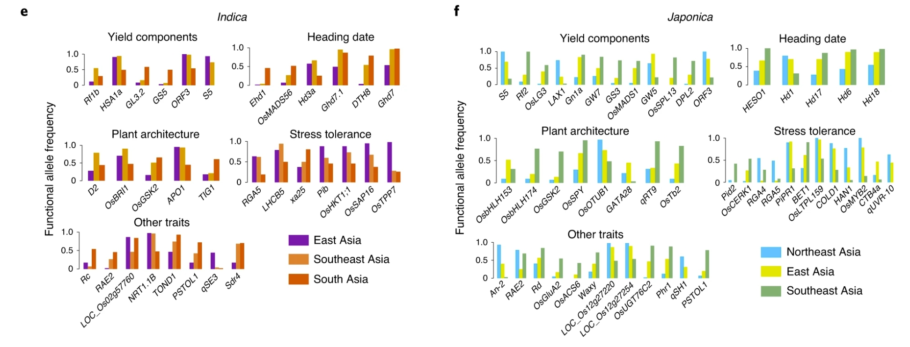

Fig. 4: Genetic investigation of the QTNs. e, Allele frequency of QTNs in indica from East Asia, South Asia and Southeast Asia. f, Allele frequency of QTNs in japonica from East Asia, Southeast Asia and Northeast Asia. All QTGs shown have highly differentiated allele frequency (AF > 0.4). Detailed functional allele frequencies of each QTG are listed in Supplementary Datasets 4 and 5.

图 4：QTNs 的遗传调查。e，东亚、南亚和东南亚籼稻 QTNs 的等位基因频率；f，东亚、东南亚和东北亚粳稻 QTNs 的等位基因频率。所示的所有 QTG 都具有高度差异的等位基因频率（AF > 0.4）。各 QTG 的详细功能等位基因频率见补充数据集 4 和 5。


**结果**：

For indica, accessions in East Asia have more early heading date alleles, more blast disease resistance alleles and stronger resistance to low-temperature germination, but fewer alleles for high mineral nutrition use efficiency (Fig. 4e), which is in line with the long day-length, serious disease stresses, low temperature and heavy use of fertilizer in this region. In parallel, higher cold tolerance and early heading date allele frequencies were found in japonica from Northeast Asia (Fig. 4f), and this pattern is consistent with the low temperature and long day-length in the planting season in Northeast Asia. 

在籼稻方面，东亚地区具有较多的早穗期等位基因、较多的抗稻瘟病等位基因和较强的抗低温发芽能力，但较少的高矿质营养利用效率等位基因（图4e），这与该地区昼长、病害胁迫严重、低温和大量施肥的特点相一致。同时，东北亚地区的粳稻耐寒性和早穗期等位基因频率较高（图4f），这与东北亚地区种植季节气温低、昼长的特点相一致。


## Packages installation软件包安装

```{r}
# 基于CRAN安装R包，检测没有则安装
p_list = c("ggplot2", "dplyr", "readxl", "cols4all", "patchwork", "scales", 
           "patchwork", "reshape2", "ggsignif","tidyverse","ggh4x","grid","showtext","Cairo","ggpattern","ggpubr","ggbreak","dagitty","brms","broom","broom.mixed","ggdag","MetBrewer","latex2exp","readxl","ggsci")
for(p in p_list){if (!requireNamespace(p)){install.packages(p)}
    library(p, character.only = TRUE, quietly = TRUE, warn.conflicts = FALSE)}

# 加载R包 Load the package
suppressWarnings(suppressMessages(library(ggplot2)))
suppressWarnings(suppressMessages(library(dplyr)))
suppressWarnings(suppressMessages(library(readxl)))
suppressWarnings(suppressMessages(library(cols4all)))
suppressWarnings(suppressMessages(library(patchwork)))
suppressWarnings(suppressMessages(library(scales)))
suppressWarnings(suppressMessages(library(patchwork)))
suppressWarnings(suppressMessages(library(reshape2)))
suppressWarnings(suppressMessages(library(ggsignif)))
suppressWarnings(suppressMessages(library(tidyverse)))
suppressWarnings(suppressMessages(library(ggh4x)))
suppressWarnings(suppressMessages(library(MetBrewer)))
suppressWarnings(suppressMessages(library(latex2exp)))
suppressWarnings(suppressMessages(library(readxl)))
suppressWarnings(suppressMessages(library(ggsci)))
suppressWarnings(suppressMessages(library(ggdag)))
suppressWarnings(suppressMessages(library(broom.mixed)))
suppressWarnings(suppressMessages(library(broom)))
suppressWarnings(suppressMessages(library(grid)))
suppressWarnings(suppressMessages(library(showtext)))
suppressWarnings(suppressMessages(library(Cairo)))
suppressWarnings(suppressMessages(library(ggpattern)))
suppressWarnings(suppressMessages(library(ggpubr)))
suppressWarnings(suppressMessages(library(ggbreak)))
suppressWarnings(suppressMessages(library(dagitty)))
suppressWarnings(suppressMessages(library(brms)))
```


# Bar plot柱状图

## Practice1 实战1

Simple bar chart 简单柱状图

参考：https://mp.weixin.qq.com/s/_7eCtIbvNChngVOhNuIfVA
参考：https://mp.weixin.qq.com/s/44lUo1Ncsd7Ef_7Luj5pHA
参考：https://mp.weixin.qq.com/s/N0KPinMiTS-9zRB8XcfZrA

```{r simple bar plot1, fig.show='asis', fig.width=4, fig.height=2.5}
# 数据
# Creat data
df <- data.frame(
  group = c("A", "B", "C","D","F"),
  value1 = c(10, 20, 30, 20, 15),
  value2 = c(15, 25, 35, 15, 20)
)
df1 <- melt(df)

# 添加误差数据
# Add error data
df1$sd <- c(1,2,3,2.5,1,1,2,3,2,1.5)

# 误差线位置
# Error bar position
df1 <- df1 %>% 
  group_by(group) %>% 
  mutate(xx=cumsum(value))

# 保证误差线可以对应其正确位置
# Ensure that the error bars correspond to their correct positions
df1$variable <- factor(df1$variable,levels = c("value2","value1"))

# 转换为因子，指定绘图顺序
# Convert to factors and specify drawing order
df1$group <- factor(df1$group, levels = unique(df1$group))

# 美化与主题调整
# Beautification and theme adjustment
mycol1 <- c("#4E79A7","#F28E2B")
mycol2 <- c("#85D4E3","#F4B5BD")

# 分组柱形图，添加误差棒
# Grouping bar graphs, adding error bars
p1 <- ggplot(df1, aes(x = group, y = value, fill = variable)) +
  geom_bar(position = position_dodge(), stat = "identity", color = NA, width = 0.8) +
  scale_fill_manual(values = mycol1) +
  scale_y_continuous(expand = c(0, 0)) +
  theme_classic() +
  geom_errorbar(aes(ymin = value - sd, ymax = value + sd),
                position = position_dodge(width = 0.8), 
                width = 0.4) + 
  labs(y = 'Value') +
  theme(axis.text = element_text(size = 12), 
        axis.title = element_text(size = 14))

# 堆叠柱形图，添加误差棒
# Stacked bar chart with error bars added
df1 <- df1 %>%
  group_by(group) %>% 
  mutate(position = cumsum(value))

p2 <- ggplot(df1, aes(x = group, y = value, fill = variable)) +
  geom_bar(position = "stack", stat = "identity", color = NA, width = 0.8) +
  scale_fill_manual(values = mycol2) +
  scale_y_continuous(expand = c(0, 0)) +
  theme_classic() +
  geom_errorbar(aes(ymin = position - sd, ymax = position + sd), 
                width = 0.4) +
  labs(y = 'Value') +
  theme(axis.text = element_text(size = 12), 
        axis.title = element_text(size = 14))

# 保存图形为PDF文件
# Save graphics as PDF files
ggsave("results/p1.pdf", plot = p1, width = 6, height = 4)
ggsave("results/p2.pdf", plot = p2, width = 6, height = 4)

# 组合图
library(cowplot)
width = 89
height = 59
p0 = plot_grid(p1, p2, labels = c("A", "B"), ncol = 2)
ggsave("results/Simple_bar_plot1.pdf", p0, width = width * 3, height = height * 2, units = "mm")
```


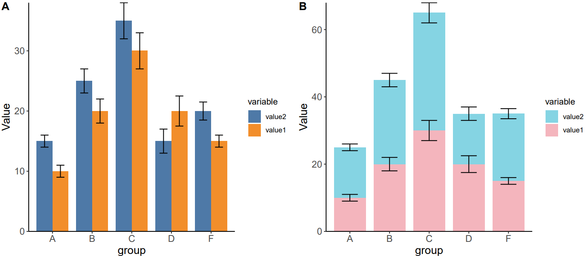


## Practice2 实战2

Draw a bar plot using the ggpattern package 利用ggpattern软件包绘制柱状图

```{r barplot with ggpattern,  fig.show='asis', fig.width=4, fig.height=2.5}
# 测试使用内置数据集ToothGrowth
# Test using the dataset ToothGrowth
head(ToothGrowth)
table(ToothGrowth$supp)
table(ToothGrowth$dose)

# gradient/plasma 渐变色
# gradient
p21 <- ggplot(ToothGrowth, aes(x = factor(dose), y = len)) +
  geom_bar_pattern(aes(pattern_fill = factor(dose)), 
                   stat = "summary", fun = mean, position = "dodge", linewidth = 0.7,
                   pattern = 'gradient', pattern_key_scale_factor = 1.5,
                   pattern_fill2 = NA, fill = NA) + 
  stat_summary(fun.data = 'mean_sd', geom = "errorbar", width = 0.15, linewidth = 0.6) +
  #theme_minimal(base_size = 16) +
  theme_classic()+
  scale_y_continuous(expand = c(0,0), limits = c(0, 35), breaks = seq(0, 35, 5)) +
  scale_pattern_fill_manual(values = c("#89A66D", "#538DB7", "#D8898A")) +
  labs(x = NULL, title = "Gradient Pattern", subtitle = 'Pattern Fill = Dose') +
  theme(legend.position = 'none') +
  geom_signif(comparisons = list(c("0.5", "1"), c("0.5", "2")),
              y_position = c(24, 30), map_signif_level = TRUE, 
              test = wilcox.test, textsize = 6)
#p21

# plasma
p22 <- ggplot(ToothGrowth, aes(x = factor(dose), y = len)) +
  geom_bar_pattern(aes(pattern_fill = factor(dose)), 
                   stat = "summary", fun = mean, position = "dodge", linewidth = 0.7,
                   pattern = 'plasma', pattern_key_scale_factor = 1.5,
                   pattern_fill2 = NA, fill = NA) + 
  stat_summary(fun.data = 'mean_sd', geom = "errorbar", width = 0.15, linewidth = 0.6) +
  #theme_minimal(base_size = 16) +
  theme_classic()+
  scale_y_continuous(expand = c(0, 0), limits = c(0, 35), breaks = seq(0, 35, 5)) +
  scale_pattern_fill_manual(values = c("#89A66D", "#538DB7", "#D8898A")) +
  labs(x = NULL, title = "Plasma Pattern", subtitle = 'Pattern Fill = Dose') +
  theme(legend.position = 'none') +
  geom_signif(comparisons = list(c("0.5", "1"), c("0.5", "2")),
              y_position = c(24, 30), map_signif_level = TRUE, 
              test = wilcox.test, textsize = 6)
# p22
# 保存为PDF
# Save as PDF
ggsave("results/gradient_plasma.pdf", p21 + p22, width = 8, height = 5)

# 柱子上添加图片
# placeholder 
p23 <- ggplot(ToothGrowth, aes(x = factor(dose), y = len)) +
  geom_bar_pattern(aes(pattern_type = factor(dose)), 
                   pattern = 'placeholder', pattern_type = 'bear', 
                   stat = "summary", fun = mean, position = "dodge",
                   pattern_spacing = 0.08, pattern_density = 0.9, 
                   linewidth = 0.6, fill = 'white', colour = 'black') + 
  stat_summary(fun.data = 'mean_sd', geom = "errorbar", width = 0.15, linewidth = 0.6) +
  #theme_minimal(base_size = 16) +
  theme_classic()+
  scale_y_continuous(expand = c(0, 0), limits = c(0, 35), breaks = seq(0, 35, 5)) +
  labs(x = NULL, title = "Placeholder Pattern", subtitle = 'Pattern Type = Dose') +
  theme(legend.position = 'none') +
  geom_signif(comparisons = list(c("0.5", "1"), c("0.5", "2")),
              y_position = c(24, 30), map_signif_level = TRUE, 
              test = wilcox.test, textsize = 6)

# 保存为PDF
# Save as PDF
ggsave("results/placeholder_pattern.pdf", p23, width = 6, height = 5)

# 条纹样式
# magick
p24 <- ggplot(ToothGrowth, aes(x = factor(dose), y = len)) +
  geom_bar_pattern(aes(pattern_type = factor(dose)), 
                   pattern = 'magick', pattern_fill = "black",
                   stat = "summary", fun = mean, position = "dodge",
                   pattern_spacing = 0.08, pattern_density = 0.9, 
                   linewidth = 0.6, fill = 'white', colour = 'black') + 
  stat_summary(fun.data = 'mean_sd', geom = "errorbar", width = 0.15, linewidth = 0.6) +
  #theme_minimal(base_size = 16) +
  theme_classic()+
  scale_y_continuous(expand = c(0, 0), limits = c(0, 35), breaks = seq(0, 35, 5)) +
  scale_pattern_type_discrete(choices = c('vertical2','hs_bdiagonal','gray100','gray0')) +
  labs(x = NULL, title = "Magick Pattern", subtitle = 'Pattern Type = Dose') +
  theme(legend.position = 'none') +
  geom_signif(comparisons = list(c("0.5", "1"), c("0.5", "2")),
              y_position = c(24, 30), map_signif_level = TRUE, 
              test = wilcox.test, textsize = 6)

# 保存为PDF
# Save as PDF
ggsave("results/magick_pattern.pdf", p24, width = 6, height = 5)

# 组合图
library(cowplot)
width = 89
height = 59
p0 = plot_grid(p21, p22, p23, p24, labels = c("A", "B", "C", "D"), ncol = 2)
ggsave("results/ggpattern_bar_plot1.pdf", p0, width = width * 3, height = height * 3, units = "mm")
```


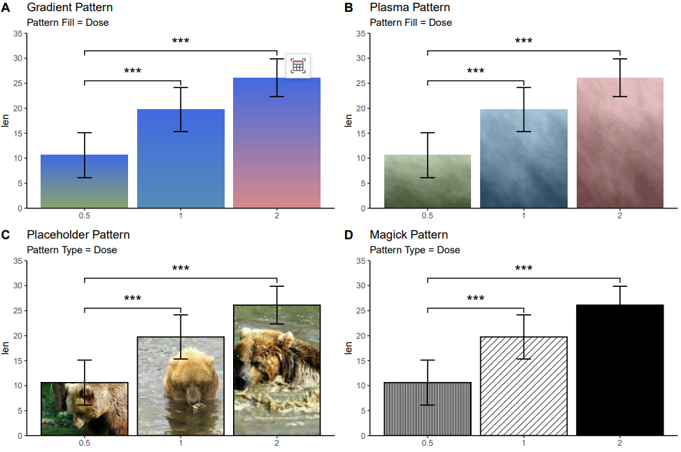


## Practice3 实战3

Gradient color grouped bar chart 渐变色分组柱状图

参考：https://mp.weixin.qq.com/s/La0W03eveYSLggKIh_gC3A

```{r Gradient color grouped bar chart,  fig.show='asis', fig.width=4, fig.height=2.5}
# 渐变色分组柱状图
# Gradient color grouped bar chart

#data
df <- tribble(
  ~pattern, ~treat,~value,~sd, ~color, 
  'S', 'blank', 0.253, 0.02,"brown",
  'S', '20', 0.243, 0.005,"green",
  'S', '40', 0.193, 0.02, "yellow",
  'P', 'blank', 0.17, 0.001,"brown",
  'P', '20', 0.08, 0.01,"green",
  'P', '40', 0.06, 0.001, "yellow")

# 绘图
# plot
pdf(file='results/Bar_plot_change_color01.pdf', height=10,width=12, family='sans')
ggplot(df) +
  geom_col_pattern(aes(x = factor(pattern, levels = c('S','P')),
                       y = value, 
                       group = factor(treat, levels = c('blank', '20', '40')),
                       pattern_fill  = color),
                   pattern = 'gradient',
                   color = NA, fill = NA,
                   position = position_dodge2(padding = 0.3),  
                   width = 0.6) +
  geom_errorbar(aes(x = factor(pattern, levels = c('S','P')),
                    ymin = value - sd, ymax = value + sd, 
                    color = factor(treat, levels = c('blank', '20', '40'))),
                position = position_dodge(width = 0.6),  
                linewidth = 1.1,  
                width = 0.1) +
  annotate("text", x = 'S', y = 0.29, label = "Anti-interference",
           size = 7, color = '#395529') +
  annotate("text", x = 'P', y = 0.21, label = "Interference",
           size = 7, color = '#691000') +
  geom_curve(aes(x = 0.7, y = 0.26, xend = 1.3, yend = 0.205),
             curvature = -0.3,
             linewidth = 1.2,
             color = '#324F28',
             arrow = arrow(length = unit(0.03, "npc"), 
                           ends = "last", type = "open")) +
  annotate(geom = 'line', x = c(1.8, 2.1, 2.2, 2.3), y = c(0.2, 0.1, 0.11, 0.09),
           linewidth = 1.2,
           color = "#AD480D",
           arrow = arrow(length = unit(0.03, "npc"), 
                         ends = "last", type = "open")) +
  scale_x_discrete(labels = c(expression(MnFe[2]*O[4]-S), expression(MnFe[2]*O[4]-P))) +
  scale_y_continuous(limits = c(0, 0.35), expand = expansion(mult = c(0, 0))) +
  scale_pattern_fill_manual(
    values = c('#F5CCB2', '#A9E1B6', '#F5F5A1'),
    labels = c('Blank', expression(20~mg%.%L^-1~HA),
               expression(40~mg%.%L^-1~HA))
  ) +
  scale_color_manual(
    values = c("#8C3209", "#1A6A3E", "#8F8B00"),
    labels = c('Blank', expression(20~mg%.%L^-1~HA),
               expression(40~mg%.%L^-1~HA))
  ) +
  xlab(NULL) + 
  ylab(expression(italic(k)*(min^-1))) +
  ggthemes::theme_par(base_size = 16) +
  theme(
    legend.text.align = 0,
    legend.title = element_blank(),
    legend.position = c(0.8, 0.8),
    legend.background = element_blank(),
    legend.key.size = unit(1, 'cm')
  )
dev.off()
```

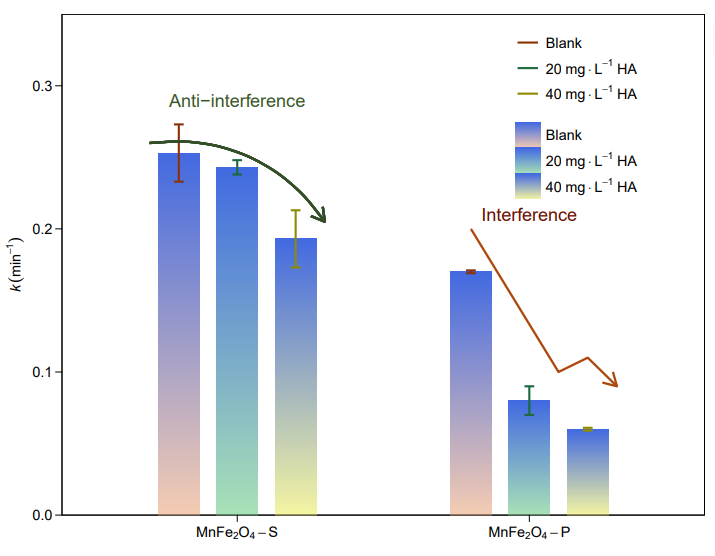


## Practice4 实战4

Butterfly Histogram 蝴蝶柱状图

参考：https://mp.weixin.qq.com/s/Iz9GR6hE2vIlziH_y7npew


```{r Butterfly Histogram,  fig.show='asis', fig.width=4, fig.height=2.5}
# 生成图形所需数据集
# Generate the data set required for the graph
mydata<-data.frame(
    id=1:14,
    A=c(5.0,14.7,2.5,8.5,5.1,6.9,7.7,6.8,4.4,4.9,5.3,1.0,0.9,7.8),
    B=c(31.3,24.7,17.8,17.2,15.3,14.3,13.9,13.9,12.4,10.0,6.5,4.2,2.5,0.9),
    Label=c("Website","Customer & Employee Referral","Webinar","Facebook/Twitter/Other Social","Marketting & Advertising","Paid Serch","Other","Sales generated","Tradeshows","Parter","Linkedin","Events","Lead list","Emial Campaign")
)

# 设置颜色和字体
# Setting colours and fonts
color_A <- "#D4AF37"  
color_B <- "#B22222" 
font_family <- "sans"

# 制作右侧柱状图
# Make a right-hand side bar chart
p_right <- ggplot(mydata) +
  geom_hline(yintercept = mean(mydata$A), linetype = "dashed", size = 0.5, colour = "grey70") +
  geom_bar(aes(x = id, y = A), stat = "identity", fill = color_A, colour = NA) +
  ylim(-5.5, 16) +
  scale_x_reverse() +
  geom_text(aes(x = id, y = -4, label = Label), vjust = 0.5, size = 4, family = font_family) +
  geom_text(aes(x = id, y = A + 0.75, label = paste0(A, "%")), size = 4.5, family = font_family, fontface = "bold") +
  coord_flip() +
  theme_void()

# 制作左侧柱状图
# Creating the left-hand side bar chart
p_left <- ggplot(mydata) +
  geom_hline(yintercept = -mean(mydata$B), linetype = "dashed", size = 0.5, colour = "grey70") +
  geom_bar(aes(x = id, y = -B), stat = "identity", fill = color_B, colour = NA) +
  ylim(-40, 0) +
  scale_x_reverse() +
  geom_text(aes(x = id, y = -B - 1.75, label = paste0(B, "%")), size = 4.5, family = font_family, fontface = "bold") +
  coord_flip() +
  theme_void()

# 合并两侧图形
# Merge both sides of the graph
p_butterfly <- p_left + p_right + 
  plot_layout(widths = c(1, 1))
#p_butterfly
# 保存为PDF Save as PDF
ggsave(filename = "results/butterfly_plot.pdf", plot = p_butterfly, width = 18, height = 6)
```


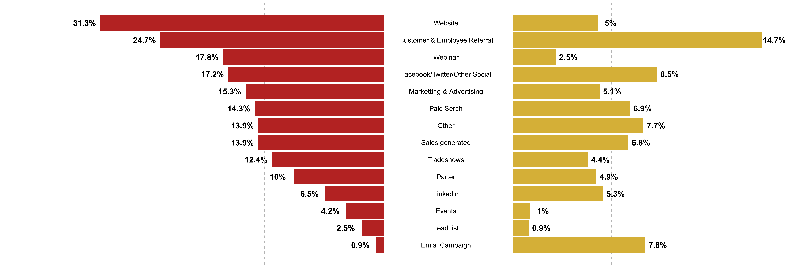


## Practice5 实战5

Clustered Bar Chart 簇状柱状图

参考：https://mp.weixin.qq.com/s/WXEGN-O2u1m6YU-B_SBDgw
https://mp.weixin.qq.com/s/j4xLG66Xei4mBZKW6uM00w

```{r, Clustered Bar Chart ,fig.show='asis', fig.width=4, fig.height=2.5}
# 读取数据
# retrieve data
fig3a <- read_excel("data/nature_figure3.xlsx", sheet = "fig3a")

# 数据处理：重命名和设置因子顺序
# Data processing: renaming and setting factor order
fig3a <- fig3a %>%
  mutate(`Ancestries/Ethnicities` = factor(`Ancestries/Ethnicities`, 
                                           levels = c('European', 'Hispanic', 'South-Asian', 'East-Asian', 'African')),
         group = factor(group, levels = c('within GWS loci', 'outside GWS loci')))

# 计算各族裔的总遗传力
# Calculation of total heritability by ethnicity
fig3a1 <- fig3a %>%
  group_by(`Ancestries/Ethnicities`) %>%
  summarise(value = sum(Heritability)) %>%
  ungroup()

# 定义X轴标签
# Defining X-axis labels
x_labels <- c("EUR\n(n = 28,645)", "HIS\n(n = 4,939)", "SAS\n(n = 9,257)", 
              "EAS\n(n = 49,939)", "AFR\n(n = 15,149)")

# 绘图
# plot
p1 <- ggplot(data = fig3a, aes(x = `Ancestries/Ethnicities`, y = Heritability)) +
  geom_bar(stat = "identity", position = position_dodge(), aes(fill = group), width = 0.7) +  
  geom_errorbar(aes(ymin = Heritability - SE, ymax = Heritability + SE, group = group), 
                position = position_dodge(0.7), width = 0.2, color = "red", size = 0.8) + 
  scale_fill_manual(values = c("#00afbb", "#e7b800"),
                    labels = c(TeX(r"(Within GWS loci (21% of the genome): \textit{h}${^2}$${_G}{_W}{_S}$)"),
                               TeX(r"(Outside GWS loci (79% of the genome): \textit{h}${^2}$${_o}{_t}{_h}{_e}{_r}$)"))) +  
  scale_y_continuous(breaks = seq(0, 0.5, by = 0.1), limits = c(0, 0.5)) +  
  scale_x_discrete(labels = x_labels) +  
  theme_bw() + 
  theme(panel.grid = element_blank(),  
        panel.border = element_blank(),  
        axis.line.y = element_line(),  
        axis.ticks.x = element_blank(),  
        axis.text.x = element_text(vjust = 10, size = 12),  
        legend.title = element_blank(),  
        legend.position = "top",  
        legend.justification = c(0, 0),  
        legend.key.size = unit(0.3, 'cm'),  
        plot.margin = margin(t = 0.5, r = 1, b = 1, l = 0.5, unit = "cm")) +  
  geom_hline(yintercept = 0, color = "gray") +  
  coord_cartesian(clip = "off") +  
  labs(x = "Ancestries\n(sample size)", y = "Heritability")

# 输出图形
# Output Graphics
#print(p1)

# 读取数据
# retrieve data
fig3b <- read_excel("data/nature_figure3.xlsx", sheet = "fig3b")

# 数据处理：设置因子顺序
# Data processing: setting the order of factors
fig3b <- fig3b %>%
  mutate(`Ancestries/Ethnicities` = factor(`Ancestries/Ethnicities`, 
                                           levels = c('European', 'Hispanic', 'South-Asian', 'East-Asian', 'African')))

# 添加文本注释数据
# Adding Text Annotation Data
fig3b.text <- data.frame(
  x = 1:5,
  y = 0.5,
  label = paste(c("310,092", "348,498", "334,237", "304,478", "371,622"), 
                "SNPs in GWS loci")
)

# 绘图
# plot
p2 <- ggplot(data = fig3b, aes(x = `Ancestries/Ethnicities`, y = Heritability)) +
  geom_bar(stat = "identity", position = position_fill(), aes(fill = group), width = 0.7, show.legend = FALSE) +  
  scale_fill_manual(values = c("#e7b800", "#00afbb")) + 
  geom_text(data = fig3b.text, aes(x = x, y = y, label = label), 
            angle = 90, color = "white", size = 3.5, vjust = 0.5, hjust = 0.5) +  
  scale_x_discrete(labels = c("EUR\n(1,130,264)", "HIS\n(1,277,112)", "SAS\n(1,222,935)", 
                              "EAS\n(1,110,588)", "AFR\n(1,180,574)")) +  
  scale_y_continuous(breaks = seq(0, 1, by = 0.1), expand = expansion(mult = c(0, 0))) +  
  labs(x = "Ancestries (total number of SNPs analysed)", 
       y = TeX(r"(Proportion of SNP-based heritability within GWS loci $(\textit{h}{^2}{_G}{_W}{_S}/\textit{h}{^2}{_S}{_N}{_P})$)")) +  
  theme_bw() + 
  theme(panel.grid = element_blank(),  
        panel.border = element_blank(),  
        axis.line.y = element_line(),  
        axis.ticks.x = element_blank(),  
        axis.text.x = element_text(size = 12, vjust = 0.5),  
        axis.text.y = element_text(size = 12),  
        plot.margin = margin(t = 0.5, r = 1, b = 1, l = 0.5, unit = "cm")) + 
  geom_hline(yintercept = 0.9, color = "red", linetype = "dashed") 

# 输出图形
# Output Graphics
#print(p2)

# 组合图
p3 <- p1+p2+
  plot_annotation(tag_levels = "a")
# p3
# 保存为PDF Save as PDF
ggsave(filename = "results/Clustered_Barplot1.pdf", plot = p3, width = 18, height = 6)
```


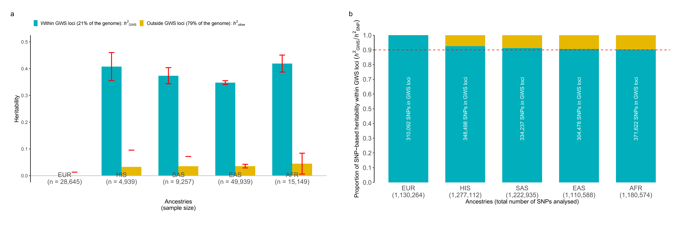


## Practice6 实战6

绘制显著性、误差线簇状柱状图
Draw significance and error bar clustered histograms


```{r significance and error bar clustered histograms, fig.show='asis', fig.width=4, fig.height=2.5}
# 模拟数据
# Simulated data
df <- data.frame(
  ID = paste0("sample", 1:60),
  Weight = sample(20:200, 60, replace = FALSE),
  species = rep(c("A", "B"),times=30),
  time = rep(c("E1", "E2", "E3"), each = 20)
)

p61 <- ggplot(data=df, aes(x=species, y=Weight, fill=time))+ 
  geom_bar(stat = "identity", position = "dodge")

# 图中给每个柱子加了误差线，因此我们要先求出平均值与标准差
# Error bars are added to each column in the figure, so we need to find the mean and standard deviation first
result1 <- aggregate(df$Weight, by = list(df$species, df$time), mean)
colnames(result1) <- c("species", "time", "mean_weight")
result2 <- aggregate(df$Weight, by = list(df$species, df$time), sd)
colnames(result2) <- c("species", "time", "sd_weight")

result1$sd_weight <- result2$sd_weight
result <- result1

# 现在我们根据result绘制簇状柱状图
# Now we draw a clustered bar chart based on result
result$species<-factor(result$species,levels = c("A","B"))
result$time<-factor(result$time,levels = c("E1","E2","E3"))

# 配色
# colour scheme
optimized_cols <- c("#4E79A7", "#F28E2B", "#E15759")

# 绘图
# plot
p62 <- ggplot(result, aes(x=species, y=mean_weight, fill=time)) +
  geom_bar(position=position_dodge(), stat="identity", color="white", width=0.7) +
  geom_errorbar(aes(ymin=mean_weight-sd_weight, ymax=mean_weight+sd_weight), 
                width=0.2, size=0.6, position=position_dodge(0.7), color="black") +
  scale_fill_manual(values=optimized_cols) +
  geom_signif(data=result, aes(xmin=0.71, xmax=1, annotations="**", y_position=188),
              textsize = 4, vjust = 0.05, tip_length = c(0.02, 0.02), manual=TRUE) +
  geom_signif(data=result, aes(xmin=0.71, xmax=1.31, annotations="*", y_position=192),
              textsize = 4, vjust = 0.05, tip_length = c(0.02, 0.02), manual=TRUE) +
  scale_y_continuous(name="Weight (g)\n", expand=c(0,0), limits=c(0, 200)) +
  scale_x_discrete(name="Species") +
  theme_classic() +
  theme(
    axis.line = element_line(color="black", size=1),
    axis.text = element_text(size=12, color="black"),
    axis.title = element_text(size=14, face="bold"),
    legend.title = element_blank(),
    legend.position = "top",
    legend.text = element_text(size=12),
    legend.key.size = unit(0.4, 'cm'),
    panel.grid.major = element_blank(),
    panel.grid.minor = element_blank()
  )

# 显示最终的图
# Show final diagram
# print(p62)

# 保存为PDF Save as PDF
ggsave(filename = "results/Clustered_Barplot2.pdf", plot = p62, width = 8, height = 5)
```


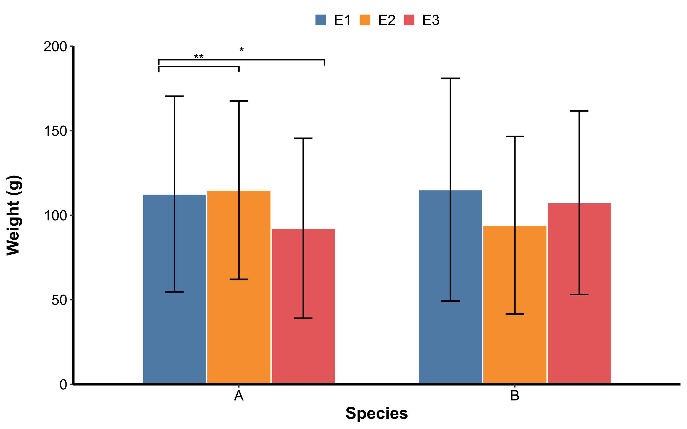


## Practice7 实战7

柱状图截断坐标轴
Histogram truncation axis

```{r, fig.show='asis', fig.width=4, fig.height=2.5}
# 载入数据
# Load data
test_design <- read.csv("data/test_design.csv",row.names = 1)
df2 <- test_design[,c(1,6)]

# 统计平均值，以Group为基础统计，分别为AA，BB，CC，DD。
# Calculate the average value based on Group, which are AA, BB, CC, and DD.
mean_df <- aggregate(df2[,2],by=list(df2[,1]),FUN=mean)
rownames(mean_df) <- mean_df[,1]

# 统计标准差，以Group为基础统计，分别为AA，BB，CC，DD。
# Statistical standard deviation, based on Group, AA, BB, CC, DD respectively.
sd_df <- aggregate(df2[,2],by=list(df2[,1]),FUN=sd)
rownames(sd_df) <- sd_df[,1]
sd_df <- sd_df[,-1]

# 可根据样品数计算Se,这里未进行
# Se can be calculated based on the number of samples, but this is not done here
# 合并数据框
# Merge dataframes
df1 <- cbind(mean_df,sd_df)
colnames(df1) <- c("group","mean","sd")
colnames(df2) <- c("group","Gene_Abundance")

# 绘图，geom_bar添加平均值柱子，geom_jitter用df2数据框加散点，geom_errorbar添加标准误误差棒。
# Drawing, geom_bar adds mean value columns, geom_jitter uses the df2 data frame to add scatter points, and geom_errorbar adds standard error bars.
p71 <- ggplot(df1, aes(x = group, y = mean, fill = group)) +
  geom_bar(stat = "identity", position = "dodge", width = 0.6, color = "black") +
  geom_errorbar(aes(ymin = mean - sd, ymax = mean + sd), width = 0.3, size = 0.7, color = "black", position = position_dodge(0.6)) +
  geom_jitter(data = df2, aes(x = group, y = Gene_Abundance, color = group), size = 2, width = 0.2, height = 0.02) +
  scale_fill_manual(values = c('#2D6DB1', '#DC1623')) +
  scale_color_manual(values = c('#2D6DB1', '#DC1623')) +
  scale_y_break(c(16, 18), space = 0.4, scales = 1, expand = c(0, 0)) +
  labs(y = "Gene Abundance", x = "") +
  theme_bw() +
  theme(
    panel.grid.major = element_blank(),
    panel.grid.minor = element_blank(),
    panel.background = element_blank(),
    plot.background = element_blank(),
    axis.line = element_line(color = "black"),
    axis.text.x = element_text(size = 12, color = "black"),
    axis.text.y = element_text(size = 12, color = "black"),
    axis.title.x = element_text(size = 14),
    axis.title.y = element_text(size = 14)
  )

# 保存为PDF
ggsave(filename = "results/Bacteria_Barplot.pdf", plot = p71, width = 10, height = 6)

# 真菌的例子
# Example of fungi
test_design <- read.csv("data/test_design.csv",row.names = 1)
df2 <- test_design[,c(1,8)]

# 统计平均值，以Group为基础统计，分别为AA，BB，CC，DD。
# Calculate the average value based on Group, which are AA, BB, CC, and DD.
mean_df <- aggregate(df2[,2],by=list(df2[,1]),FUN=mean)
rownames(mean_df) <- mean_df[,1]

# 统计标准差，以Group为基础统计，分别为AA，BB，CC，DD。
# Statistical standard deviation, based on Group, AA, BB, CC, DD respectively.
sd_df <- aggregate(df2[,2],by=list(df2[,1]),FUN=sd)
rownames(sd_df) <- sd_df[,1]
sd_df <- sd_df[,-1]

# 可根据样品数计算Se,这里未进行
# Se can be calculated based on the number of samples, but this is not done here
# 合并数据框
# Merge dataframes
df1 <- cbind(mean_df,sd_df)
colnames(df1) <- c("group","mean","sd")
colnames(df2) <- c("group","Gene_Abundance")

# 绘图，geom_bar添加平均值柱子，geom_jitter用df2数据框加散点，geom_errorbar添加标准误误差棒。
# Drawing, geom_bar adds mean value columns, geom_jitter uses the df2 data frame to add scatter points, and geom_errorbar adds standard error bars.
p72 <- ggplot(df1, aes(x = group, y = mean, fill = group)) +
  geom_bar(stat = "identity", position = "dodge", width = 0.6, color = "black") +
  geom_errorbar(aes(ymin = mean - sd, ymax = mean + sd), width = 0.3, size = 0.7, color = "black", position = position_dodge(0.6)) +
  geom_jitter(data = df2, aes(x = group, y = Gene_Abundance, color = group), size = 2, width = 0.2, height = 0.02) +
  scale_fill_manual(values = c("#F2B379", "#DD5F60")) +
  scale_color_manual(values = c("#F2B379", "#DD5F60")) +
  scale_y_break(c(16, 18), space = 0.4, scales = 1, expand = c(0, 0)) +
  labs(y = "Gene Abundance", x = "") +
  theme_bw() +
  theme(
    panel.grid.major = element_blank(),
    panel.grid.minor = element_blank(),
    panel.background = element_blank(),
    plot.background = element_blank(),
    axis.line = element_line(color = "black"),
    axis.text.x = element_text(size = 12, color = "black"),
    axis.text.y = element_text(size = 12, color = "black"),
    axis.title.x = element_text(size = 14),
    axis.title.y = element_text(size = 14)
  )

# 保存为PDF
# Save as PDF
ggsave(filename = "results/Fungi_Barplot.pdf", plot = p72, width = 10, height = 6)
```


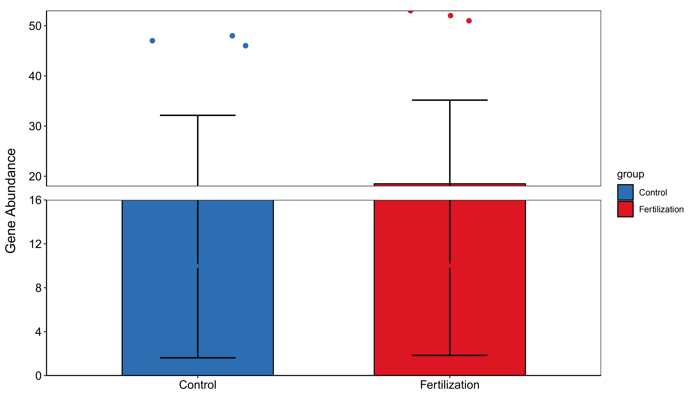

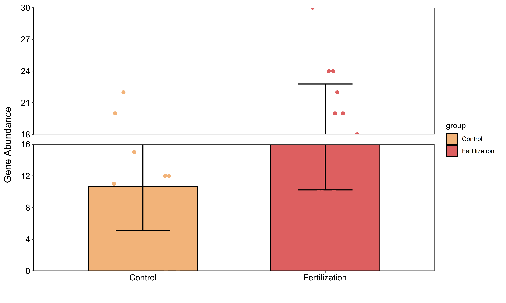


## Practice8 实战8

Comparing histograms and error bars with positive and negative y-axes 正负y轴比较柱状图和误差棒

参考：https://mp.weixin.qq.com/s/_T_5Rp0dfBccHZaZbiPQUQ


```{r error bars with positive and negative y-axes, fig.show='asis', fig.width=4, fig.height=2.5}
# 测试数据
# Test data
df <- read.csv("data/test_otu1.csv",row.names = 1)

# 构建测试数据框，构建"Microbes"的数据
# Build a test data frame and build the data of "Microbes"
plot_data <- df[1000:1019,c(7,12)]
colnames(plot_data) <- c("Microbes","error_bar")

# 误差棒随机弄的数据，需要自己计算，这里直接除以10倍作为误差棒，没有实际意义
# Error bars are random data, you need to calculate it yourself. Here, directly dividing by 10 is used as the error bar, which has no practical significance
plot_data$error_bar = plot_data$error_bar/10 

# 随机选择1-10天作为纵坐标时间，进行绘图
# Randomly select 1-10 days as the vertical axis time for drawing
Days <- as.data.frame(c(1:10,1:10))
plot_data <- cbind(plot_data,Days)

# 添加分组颜色，进行绘图
# Add group colors for drawing
Group <- as.data.frame(c(rep("#77A779",10),rep("#DA5E9A",10)))
plot_data <- cbind(plot_data,Group)

# 将随机选择的数据命名为微生物，误差棒和时间，实际可根际自己数据构建此数据框
# Name the randomly selected data as microorganisms, error bars and time. You can actually construct this data frame with your own data
colnames(plot_data)<-c("Microbes","Error_bar","Days","Group")

# 将一组数据转化为负值,用于负y轴
# Convert a set of data into negative values for negative y axis
plot_data[11:20,]$Microbes<--plot_data[11:20,]$Microbes

# 绘图，geom_col添加柱状图，geom_errorbar添加误差棒，geom_hline添加坐标x轴
# Drawing, geom_col adds a bar chart, geom_errorbar adds an error bar, geom_hline adds a coordinate x-axis
pdf("results/microbes_growth.pdf", width = 6, height = 4)
ggplot(plot_data, aes(x = Days, y = Microbes)) +
  geom_col(position = position_dodge(width = 0.5), width = 0.6, size = 0.3, fill = plot_data$Group) +
  geom_errorbar(aes(ymin = Microbes - Error_bar, ymax = Microbes + Error_bar), width = 0.2, size = 0.8) +
  labs(y = "Growth", x = "Years") +
  geom_hline(aes(yintercept = 0), size = 0.5, colour = "gray2") +
  theme_bw() +
  theme(panel.grid = element_blank(),
        axis.text = element_text(colour = 'black', size = 12),
        axis.title = element_text(size = 14),
        plot.margin = unit(c(1, 1, 1, 1), "cm"))
dev.off()
```


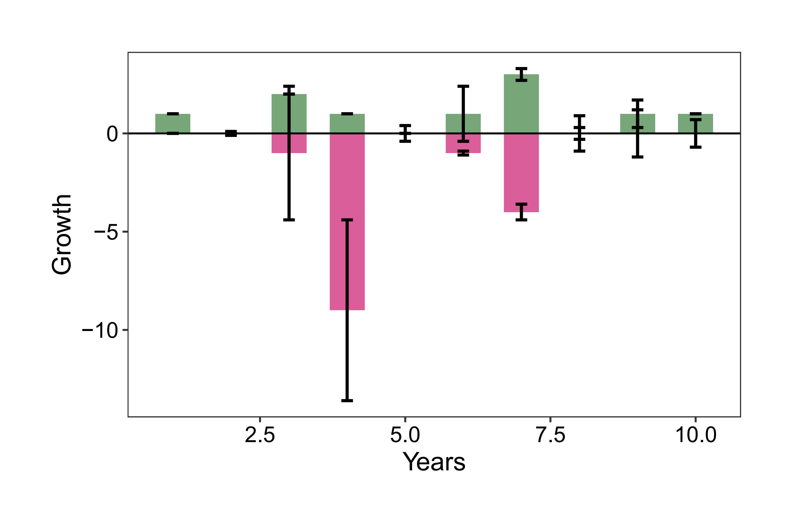


## Practice9 实战9

Add annotation lines and rectangular box annotations to simple histogram 简单直方图添加标注线和矩形框标注

参考：https://mp.weixin.qq.com/s/5dTEKBkQ5ZG6m-c1F3x3BQ


```{r annotations to simple histogram, echo=TRUE}
# 数据
# Creat data
df <- data.frame(x=c(0,1,2,3,4),
                 y=c(1200,850,450,300,150))
# 自定义配色
# Custom Colourways
fill_color <- "#999999"  
line_color <- "#000000"  
vline_color <- "#D55E00" 
rect_fill <- "#D55E00"  

# 优化后的直方图
# Optimised histogram
p91 <- ggplot(df, aes(x = x, y = y)) +
  # 使用黑色边框和灰色填充绘制柱状图
  # Drawing a bar chart with a black border and grey fill
  geom_col(width = 1, color = line_color, fill = fill_color) +
  # 设置坐标轴标签
  # Setting Axis Labels
  labs(x = "Niche width", y = "Number of ESVs") +
  # 去除背景并优化图形样式
  # Remove backgrounds and optimise graphic styles
  theme_classic(base_size = 14) +
  # 设置x轴和y轴的线条
  # Setting the x-axis and y-axis lines
  theme(axis.line = element_line(color = line_color),
        axis.text = element_text(size = 12),
        axis.title = element_text(size = 14)) +
  # 添加一条垂直虚线辅助线
  # Add a vertical dashed auxiliary line
  geom_vline(xintercept = 4, linetype = "dashed", color = vline_color, size = 1) +
  # 添加红色矩形框并设置透明度
  # Add a red rectangular box and set the transparency
  geom_rect(aes(xmin = 4.02, xmax = 4.5, ymin = 0, ymax = 1200),
            fill = rect_fill, alpha = 0.2) +
  # 设置y轴范围以防止矩形框覆盖
  # Set the y-axis range to prevent the rectangular box from covering the
  scale_y_continuous(limits = c(0, 1300)) +
  # 确保x轴和y轴的比例合适，优化整体可视化效果
  # Ensure that the x-axis and y-axis are properly scaled to optimise the overall visualisation
  coord_cartesian(clip = "off")

# 保存为PDF
# Save as PDF
ggsave(filename = "results/Barplot_stripline.pdf", p91, width = 10, height = 6)
```


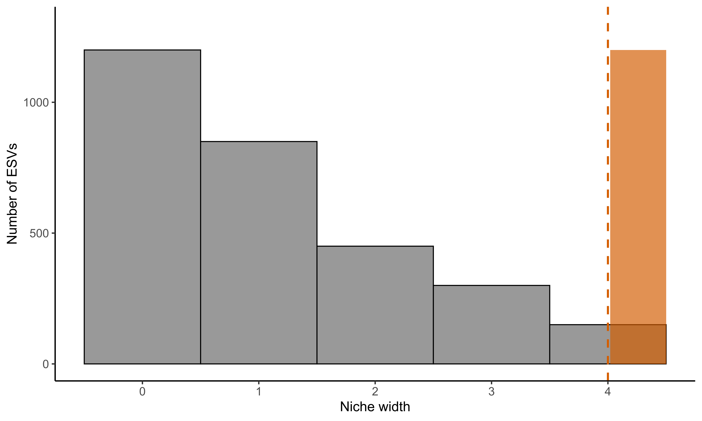


## Practice10 实战10

Use a bar chart to show the variation explained by confounding factors 用柱状图展示混杂因素的变异解释度


```{r bar plot with confounding factors, echo=TRUE}
# 读取数据
# retrieve data
permanova.res <- read.csv("data/permanova_res.csv", sep = ",")

# 筛选显著性结果
# Screening for Significance Results
presult <- permanova.res[permanova.res$Pvalue < 0.05, ]
padj.result <- permanova.res[permanova.res$Padjust < 0.05, ]

# 优化配色，符合期刊标准
# Optimised colour scheme to meet journal standards
anova.cols <- c("Demography" = "#1b9e77", 
                "Disease" = "#d95f02", 
                "Life style" = "#7570b3", 
                "Medication" = "#e7298a", 
                "Physiology" = "#66a61e")

# 创建柱状图并进行优化
# Create bar charts and optimise them
p10 <- ggplot(permanova.res, aes(x = reorder(ID, R2), y = R2, fill = Group)) +
  geom_bar(stat = 'identity', width = 0.7) +  # 控制柱状图宽度
  coord_flip() + 
  ylab("Adonis R2") + 
  xlab("") +
  scale_fill_manual(values = anova.cols) +  # 使用优化后的配色 Using an optimised colour scheme
  #theme_minimal(base_size = 14) +  # 使用简洁主题，调整基础字体大小 Use the Simplicity theme and adjust the base font size
  theme_classic()+
  theme(axis.text.x = element_text(size = 12),  # 调整x轴标签字体大小 Adjust x-axis label font size
        axis.text.y = element_text(size = 12),  # 调整y轴标签字体大小 Adjust y-axis label font size
        axis.title.y = element_text(size = 14),  # 调整y轴标题字体大小 Adjust y-axis title font size
        legend.position = "top",  # 调整图例位置 Adjustment of legend position
        legend.title = element_blank()) +  # 去除图例标题 Remove legend title
  # 添加显著性标记，黑色星号用于未校正p值，红色用于校正后的p值
  # Significance markers added, black asterisks for uncorrected p-values, red for corrected p-values
  geom_text(data = presult, aes(ID, R2), label = "*", col = "black", 
            nudge_y = 0.005, nudge_x = -0.15, size = 5) +  
  geom_text(data = padj.result, aes(ID, R2), label = "*", col = "red", 
            nudge_y = 0.01, nudge_x = -0.15, size = 5) +
  # 控制坐标范围，确保标签不会被截断
  # Control coordinate range to ensure labels are not truncated
  scale_y_continuous(expand = c(0, 0)) +
  # 增加图形间距，避免文字重叠
  # Increase graphic spacing to avoid overlapping text
  theme(plot.margin = margin(5, 5, 5, 5))

# 保存为PDF
# Save as PDF
ggsave(filename = "results/Barplot_variation.pdf", p10, width = 10, height = 6)
```


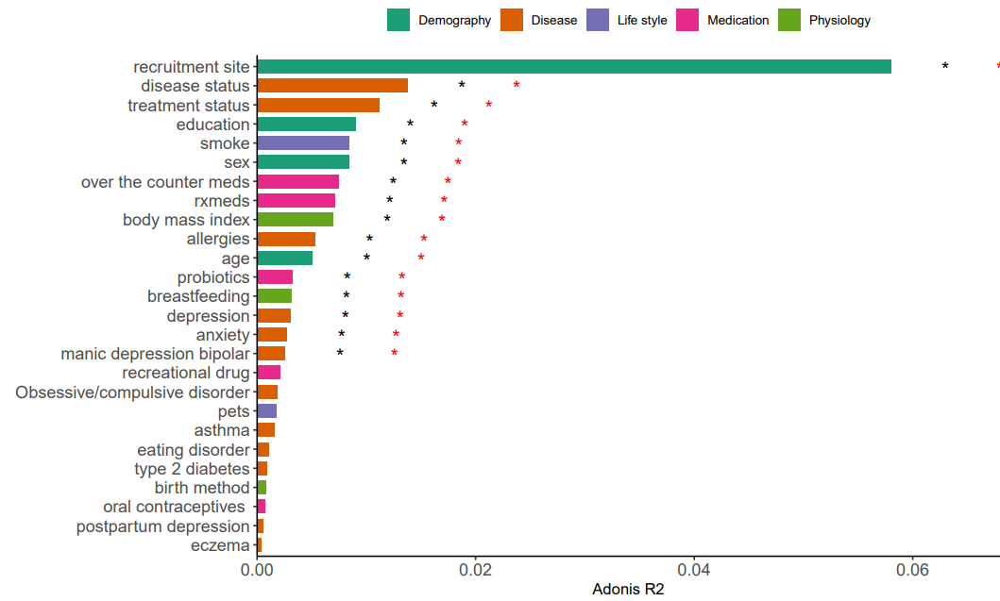


If used this script, please cited:
使用此脚本，请引用下文：

**Yong-Xin Liu**, Lei Chen, Tengfei Ma, Xiaofang Li, Maosheng Zheng, Xin Zhou, Liang Chen, Xubo Qian, Jiao Xi, Hongye Lu, Huiluo Cao, Xiaoya Ma, Bian Bian, Pengfan Zhang, Jiqiu Wu, Ren-You Gan, Baolei Jia, Linyang Sun, Zhicheng Ju, Yunyun Gao, **Tao Wen**, **Tong Chen**. 2023. EasyAmplicon: An easy-to-use, open-source, reproducible, and community-based pipeline for amplicon data analysis in microbiome research. **iMeta** 2: e83. https://doi.org/10.1002/imt2.83

Copyright 2016-2024 Defeng Bai <baidefeng@caas.cn>, Chuang Ma <22720765@stu.ahau.edu.cn>, Jiani Xun <15231572937@163.com>, Yong-Xin Liu <liuyongxin@caas.cn>